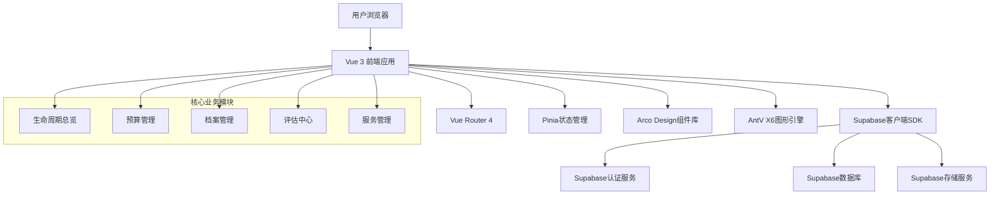
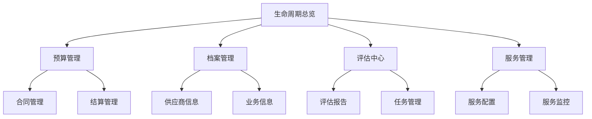

# 外数生命周期实施方案与开发计划

## 1. 项目现状评估

### 1.1 当前实现状态

**已完成功能：**
- ✅ 预算管理模块完整实现（总览、列表、监控、合同、结算）
- ✅ 基础生命周期页面框架（阶段时间线、状态管理、筛选功能）
- ✅ 档案管理基础列表（多维度筛选、状态筛选、导出功能）
- ✅ 评估中心基础列表（类型筛选、状态筛选、评分展示）
- ✅ 服务管理基础列表（供应商筛选、服务类型筛选、计费模式展示）
- ✅ 数据发现模块外数管理功能整合

**待完善功能：**
- ❌ 生命周期总览页（模块统一入口）
- ❌ 档案详情深度功能（元数据管理、版本控制、权限设置）
- ❌ 评估报告生成与深度分析功能
- ❌ 服务配置与发布流程
- ❌ 线下审批结果录入功能
- ❌ 跨模块数据联动与状态同步

### 1.2 技术架构现状

**前端技术栈：**
- Vue 3 + TypeScript + Vite
- Arco Design Vue组件库
- AntV X6图形引擎（待充分利用）
- Vuex状态管理
- Supabase后端服务

**现有页面结构：**
```
/src/pages/
├── external-data-archive/     # 外数档案（基础列表）
├── external-data-v1/         # 外数v1产品化展示
├── budget/                   # 预算管理（完整实现）
└── risk/                     # 风险域相关页面
```

## 2. 实施方案总体设计

### 2.1 实施目标

**短期目标（4周）：**
1. 完成生命周期总览页，建立模块统一入口
2. 实现档案详情深度功能，形成业务中枢
3. 打通评估中心任务闭环流程
4. 建立跨模块数据联动机制

**中期目标（8周）：**
1. 完善服务管理配置与发布功能
2. 实现线下审批流程数字化
3. 优化用户体验与交互流程
4. 建立完整的数据分析体系

**长期目标（12周）：**
1. 实现全生命周期自动化管理
2. 建立智能化预警与决策支持
3. 完成移动端适配
4. 达到企业级应用标准

### 2.2 技术架构升级



## 3. 里程碑规划

### 3.1 里程碑M1：基础完善（第1-2周）

**目标：** 建立统一入口，完善基础功能

**核心任务：**
1. **生命周期总览页开发**
   - 数据资产全景视图（总量、分类分布、状态占比）
   - 生命周期流程图可视化（AntV X6实现）
   - 关键指标监控面板（四金额汇总、健康度分布）
   - 快速操作区（一键跳转新建功能）
   - 待办事项聚合展示

2. **档案详情功能完善**
   - 档案详情页面结构设计
   - 业务信息补充功能
   - 管理属性维护功能
   - 统一跳转协议实现

3. **评估中心任务闭环**
   - 评估任务创建功能
   - 评估报告生成与展示
   - 评估结果归档功能

**交付标准：**
- 生命周期总览页功能完整，用户体验流畅
- 档案详情页包含五大核心模块（业务概览、技术详情、元数据、评估、预算、服务）
- 评估中心实现任务创建到结果归档的完整闭环

### 3.2 里程碑M2：功能增强（第3-4周）

**目标：** 实现深度功能，建立数据联动

**核心任务：**
1. **服务管理功能完善**
   - 服务配置向导
   - 服务发布流程
   - 服务监控面板
   - 服务评价功能

2. **线下审批数字化**
   - 审批结果录入功能
   - 审批流程状态跟踪
   - 审批历史记录

3. **跨模块数据联动**
   - 预算消耗自动更新机制
   - 评估结果自动同步
   - 合同状态联动更新
   - 服务调用日志关联

**交付标准：**
- 服务管理实现配置到发布的完整流程
- 线下审批完全数字化，支持状态跟踪
- 各模块间数据实时同步，状态一致

### 3.3 里程碑M3：体验优化（第5-6周）

**目标：** 优化用户体验，提升系统性能

**核心任务：**
1. **交互体验优化**
   - 页面加载性能优化
   - 表单交互体验提升
   - 数据可视化效果增强
   - 响应式设计完善

2. **数据分析增强**
   - 智能预警机制
   - 趋势分析图表
   - 自定义报表功能
   - 数据导出优化

3. **系统稳定性提升**
   - 错误处理机制完善
   - 数据备份策略
   - 性能监控体系

**交付标准：**
- 页面加载时间<2秒，交互响应<500ms
- 数据可视化效果专业，用户体验良好
- 系统稳定性达到99.9%

### 3.4 里程碑M4：智能化升级（第7-8周）

**目标：** 实现智能化管理，建立决策支持

**核心任务：**
1. **智能预警系统**
   - 多维度预警规则配置
   - 智能阈值计算
   - 预警通知机制
   - 预警处置跟踪

2. **决策支持功能**
   - 数据价值评估模型
   - 采购建议生成
   - 风险评估报告
   - ROI计算分析

3. **自动化流程**
   - 生命周期状态自动转换
   - 定期评估任务自动生成
   - 合同到期自动提醒
   - 预算超支自动管控

**交付标准：**
- 智能预警准确率>90%，误报率<5%
- 决策支持建议采纳率>80%
- 自动化流程覆盖率>90%

## 4. 工作包分解

### 4.1 生命周期总览页工作包

**工作包编号：** WP-001
**工作量：** 5人日
**依赖关系：** 依赖预算管理、档案管理基础数据

**具体任务：**
1. 页面布局设计（1人日）
   - 响应式布局实现
   - 卡片式组件设计
   - 导航菜单集成

2. 数据资产全景视图（1.5人日）
   - 核心指标统计
   - 分类分布图表
   - 状态占比可视化

3. 生命周期流程图（2人日）
   - AntV X6流程图实现
   - 节点状态交互
   - 流程动画效果

4. 快速操作区（0.5人日）
   - 快捷入口按钮
   - 操作权限控制
   - 跳转逻辑实现

### 4.2 档案详情功能工作包

**工作包编号：** WP-002
**工作量：** 8人日
**依赖关系：** 依赖档案数据模型和API接口

**具体任务：**
1. 详情页面框架（1.5人日）
   - 左侧导航菜单
   - 内容区域布局
   - 标签页切换

2. 业务信息模块（2人日）
   - 业务价值展示
   - 使用场景管理
   - 影响评估功能
   - 替代方案配置

3. 供应商信息模块（1.5人日）
   - 供应商档案展示
   - 联系人信息管理
   - 合作历史记录
   - 信用评级展示

4. 使用说明管理（1人日）
   - 快速入门指南
   - API示例展示
   - FAQ管理
   - 最佳实践沉淀

5. 效果评估索引（1人日）
   - 评估结果聚合
   - 趋势对比图表
   - ROI计算展示

6. 生命周期变更（1人日）
   - 变更申请表单
   - 审批流程跟踪
   - 状态变更历史

### 4.3 评估中心增强工作包

**工作包编号：** WP-003
**工作量：** 6人日
**依赖关系：** 依赖评估数据模型和任务API

**具体任务：**
1. 评估任务创建（2人日）
   - 任务类型选择
   - 评估标准配置
   - 任务分配功能
   - 截止日期设置

2. 评估报告生成（2人日）
   - 报告模板设计
   - 自动数据填充
   - 图表生成
   - 报告导出功能

3. 评估结果管理（1人日）
   - 评分录入界面
   - 评估意见填写
   - 附件上传功能

4. 评估流程跟踪（1人日）
   - 状态流转控制
   - 审批历史记录
   - 通知提醒机制

### 4.4 服务管理工作包

**工作包编号：** WP-004
**工作量：** 7人日
**依赖关系：** 依赖服务配置API和监控数据

**具体任务：**
1. 服务配置向导（2.5人日）
   - 服务基本信息配置
   - API参数设置
   - 返回值定义
   - 安全配置

2. 服务发布流程（2人日）
   - 测试环境发布
   - 生产环境发布
   - 发布审批流程
   - 版本管理功能

3. 服务监控面板（1.5人日）
   - 实时调用量监控
   - 响应时间统计
   - 错误率监控
   - 性能趋势分析

4. 服务评价功能（1人日）
   - 用户评价收集
   - 评分统计
   - 意见反馈管理

### 4.5 跨模块联动工作包

**工作包编号：** WP-005
**工作量：** 4人日
**依赖关系：** 依赖各模块基础功能完成

**具体任务：**
1. 数据同步机制（2人日）
   - 状态变更监听
   - 数据推送实现
   - 冲突解决机制

2. 业务流程联动（1.5人日）
   - 预算消耗自动更新
   - 评估结果自动同步
   - 合同状态联动

3. 统一消息通知（0.5人日）
   - 消息模板设计
   - 通知发送机制
   - 消息历史管理

## 5. 依赖关系分析

### 5.1 技术依赖

**前端技术依赖：**
- Vue 3.3+ 版本兼容性
- Arco Design Vue 2.0+ 组件库
- AntV X6 图形引擎版本
- Supabase客户端SDK版本

**后端服务依赖：**
- Supabase数据库服务可用性
- Supabase认证服务稳定性
- Supabase实时订阅功能

### 5.2 数据依赖

**核心数据表依赖：**
```sql
-- 基础数据表
lifecycles      -- 生命周期主表
budgets         -- 预算表（四金额模型）
contracts       -- 合同表
settlements     -- 结算表
archives        -- 档案表
evaluations     -- 评估表
services        -- 服务表
```

**数据完整性要求：**
- 生命周期数据完整性>95%
- 预算数据准确性100%
- 合同数据时效性要求
- 评估数据可追溯性

### 5.3 功能依赖

**模块间依赖关系：**


## 6. 验收标准

### 6.1 功能验收标准

**生命周期总览页验收：**
- ✅ 数据加载时间<2秒
- ✅ 图表渲染时间<1秒
- ✅ 所有快捷入口可正常跳转
- ✅ 待办事项数据准确性100%

**档案详情功能验收：**
- ✅ 所有模块信息完整展示
- ✅ 编辑功能数据保存成功
- ✅ 跳转协议参数正确传递
- ✅ 权限控制准确生效

**评估中心验收：**
- ✅ 任务创建到完成流程通畅
- ✅ 评估报告生成完整准确
- ✅ 评分计算逻辑正确
- ✅ 结果归档功能正常

### 6.2 性能验收标准

**响应时间要求：**
- 页面加载时间：<2秒
- API响应时间：<500ms
- 图表渲染时间：<1秒
- 数据导出时间：<5秒

**并发性能要求：**
- 支持100并发用户
- 系统响应时间无明显下降
- 内存使用率<80%
- CPU使用率<70%

### 6.3 用户体验验收

**界面体验标准：**
- 界面布局合理，信息层次清晰
- 交互流程顺畅，操作反馈及时
- 错误提示友好，帮助信息完整
- 响应式设计适配良好

**可用性标准：**
- 任务完成率>95%
- 用户满意度>4.5分（5分制）
- 学习曲线平缓，新用户上手时间<30分钟
- 错误恢复能力强

## 7. 风险评估与应对

### 7.1 技术风险

**AntV X6图形引擎风险：**
- 风险：复杂流程图性能问题
- 概率：中等
- 影响：高
- 应对：提前进行性能测试，准备降级方案

**Supabase服务稳定性风险：**
- 风险：外部服务不可用
- 概率：低
- 影响：高
- 应对：建立本地缓存机制，准备离线方案

### 7.2 项目风险

**开发进度延期风险：**
- 风险：功能复杂度超预期
- 概率：中等
- 影响：中等
- 应对：采用敏捷开发，及时调整计划

**团队协作风险：**
- 风险：跨模块协作效率低
- 概率：中等
- 影响：中等
- 应对：建立每日站会机制，加强沟通协调

### 7.3 业务风险

**需求变更风险：**
- 风险：业务需求频繁调整
- 概率：高
- 影响：高
- 应对：建立需求变更管理流程，评估影响范围

**数据质量风险：**
- 风险：历史数据不完整
- 概率：中等
- 影响：中等
- 应对：建立数据清洗机制，制定数据补录方案

## 8. 资源配置

### 8.1 人力资源配置

**核心团队（6人）：**
- 前端开发工程师：2人
- 后端开发工程师：1人
- UI/UX设计师：1人
- 测试工程师：1人
- 产品经理：1人

**角色分工：**
- 前端开发：负责页面开发、组件实现、交互逻辑
- 后端开发：负责API接口、数据处理、性能优化
- UI/UX设计：负责界面设计、交互设计、用户体验
- 测试工程师：负责功能测试、性能测试、验收测试
- 产品经理：负责需求管理、进度跟踪、质量把控

### 8.2 技术资源配置

**开发环境：**
- 开发服务器：2台（主备）
- 测试环境：1套
- 预发布环境：1套
- 生产环境：1套

**开发工具：**
- 代码仓库：Git版本控制
- CI/CD：自动化部署流水线
- 监控工具：应用性能监控
- 协作工具：项目管理平台

### 8.3 时间资源配置

**总工期：** 8周（40个工作日）
**每日工作时间：** 8小时
**总工作量：** 240人时

**时间分配：**
- 开发工作：70%（168人时）
- 测试工作：20%（48人时）
- 项目管理：10%（24人时）

## 9. 质量保证

### 9.1 代码质量保障

**代码规范：**
- 统一代码风格（ESLint规则）
- TypeScript类型严格检查
- 组件化开发规范
- API接口规范

**代码审查：**
- 强制代码审查机制
- 审查标准制定
- 审查记录保存
- 问题跟踪解决

### 9.2 测试质量保证

**测试策略：**
- 单元测试覆盖率>80%
- 集成测试覆盖率>70%
- 端到端测试关键路径覆盖
- 性能测试基准建立

**测试执行：**
- 自动化测试集成
- 回归测试定期执行
- 性能测试每里程碑进行
- 安全测试专业评估

### 9.3 交付质量保证

**交付标准：**
- 功能完整性100%
- 性能指标达标
- 用户体验良好
- 文档齐全准确

**验收流程：**
- 内部验收测试
- 用户验收测试
- 性能验收测试
- 安全验收评估

## 10. 总结

本实施方案基于现有项目基础，制定了分阶段、可执行的外数生命周期管理系统开发计划。通过四个里程碑的递进实施，将在8周内完成从基础功能完善到智能化升级的全过程。

**关键成功因素：**
1. 统一的项目管理和协调机制
2. 高质量的技术架构和代码实现
3. 有效的风险识别和应对措施
4. 充分的测试和质量保证
5. 良好的团队协作和沟通

**预期成果：**
- 完整的外数生命周期管理平台
- 优秀的用户体验和系统性能
- 高可用性和可扩展性的技术架构
- 满足业务需求的智能化功能
- 可持续维护和演进的代码基础

通过严格执行本计划，将交付一个功能完善、性能优秀、用户体验良好的外数生命周期管理系统，为企业的数据资产管理提供强有力的支撑。