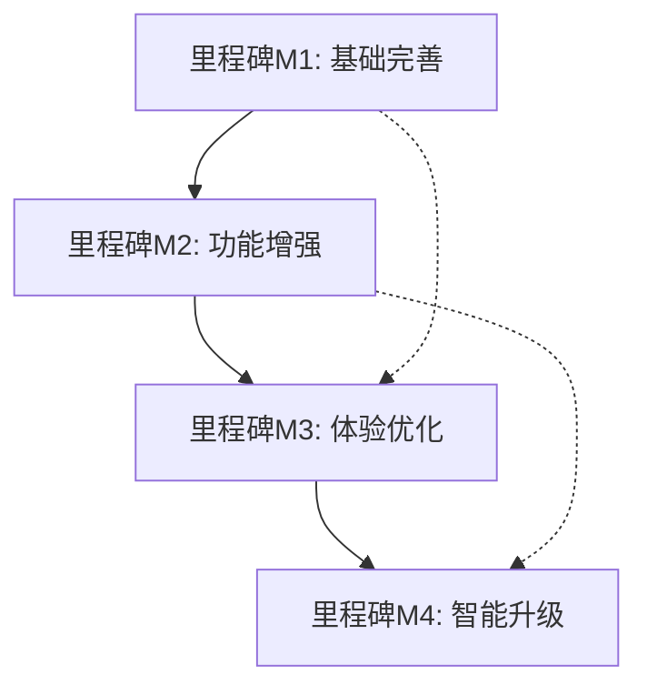

# 外数生命周期开发里程碑与交付清单

## 1. 里程碑总览

### 1.1 项目时间线
```
Week 1-2  │ Week 3-4  │ Week 5-6  │ Week 7-8
M1        │ M2        │ M3        │ M4
基础完善   │ 功能增强   │ 体验优化   │ 智能升级
```

### 1.2 里程碑依赖关系


## 2. 里程碑M1：基础完善（第1-2周）

### 2.1 交付目标
建立统一入口，完善基础功能，形成最小可用版本（MVP）

### 2.2 详细交付清单

#### 2.2.1 生命周期总览页（WP-001）

**交付物编号：** M1-D001
**交付时间：** 第1周周五
**工作量：** 5人日
**负责人：** 前端开发工程师A

**具体交付内容：**

1. **页面框架与布局**
   ```
   文件清单：
   - src/views/Overview/LifecycleOverview.vue
   - src/components/Overview/DataAssetSummary.vue
   - src/components/Overview/LifecycleFlowChart.vue
   - src/components/Overview/QuickActions.vue
   - src/components/Overview/TodoList.vue
   ```

2. **数据资产全景视图**
   - ✅ 外数资产总量统计卡片
   - ✅ 分类分布饼图（按业务类型、供应商、状态）
   - ✅ 状态占比柱状图（引入中、已上线、待评估、已归档）
   - ✅ 关键指标KPI展示（预算总额、消耗金额、服务数量）

3. **生命周期流程图**
   - ✅ AntV X6流程图实现
   - ✅ 6个阶段节点可视化（注册、评估、审批、上线、运维、下线）
   - ✅ 节点状态交互（悬停显示详情、点击跳转）
   - ✅ 流程动画效果

4. **快速操作区**
   - ✅ 新建预算快捷入口
   - ✅ 新建档案快捷入口
   - ✅ 新建评估快捷入口
   - ✅ 新建服务快捷入口

5. **待办事项聚合**
   - ✅ 线下审批结果待录入提醒
   - ✅ 待评估数据提醒
   - ✅ 待处理预警提醒
   - ✅ 合同到期提醒

**验收标准：**
- 页面加载时间<2秒
- 图表渲染时间<1秒
- 所有快捷入口可正常跳转
- 待办事项数据准确性100%

#### 2.2.2 档案详情功能（WP-002）

**交付物编号：** M1-D002
**交付时间：** 第2周周三
**工作量：** 6人日
**负责人：** 前端开发工程师B

**具体交付内容：**

1. **档案详情页面框架**
   ```
   文件清单：
   - src/views/Archive/ArchiveDetail.vue
   - src/components/Archive/BusinessInfo.vue
   - src/components/Archive/SupplierInfo.vue
   - src/components/Archive/UsageGuide.vue
   - src/components/Archive/EffectEvaluation.vue
   - src/components/Archive/LifecycleChanges.vue
   ```

2. **业务信息模块**
   - ✅ 业务价值展示（ROI计算、业务影响评分）
   - ✅ 使用场景管理（场景描述、使用频率统计）
   - ✅ 影响评估（业务依赖性分析、替代成本评估）
   - ✅ 替代方案配置（备选数据源、切换成本分析）

3. **供应商信息模块**
   - ✅ 供应商档案展示（基本信息、合作历史）
   - ✅ 联系人信息管理（主要联系人、技术支持）
   - ✅ 信用评级展示（历史评分、风险等级）
   - ✅ 合同关联信息（合同列表、到期提醒）

4. **统一跳转协议**
   - ✅ 跳转参数标准化（archiveId、from、tab）
   - ✅ 返回按钮实现
   - ✅ 状态保持机制（sessionStorage）
   - ✅ 面包屑导航更新

**验收标准：**
- 所有模块信息完整展示
- 编辑功能数据保存成功
- 跳转协议参数正确传递
- 权限控制准确生效

#### 2.2.3 评估中心任务闭环（WP-003）

**交付物编号：** M1-D003
**交付时间：** 第2周周五
**工作量：** 4人日
**负责人：** 前端开发工程师C

**具体交付内容：**

1. **评估任务创建**
   ```
   文件清单：
   - src/components/Evaluation/CreateTask.vue
   - src/components/Evaluation/TaskForm.vue
   - src/components/Evaluation/EvaluationCriteria.vue
   ```

2. **任务管理功能**
   - ✅ 任务类型选择（质量评估、价值评估、风险评估、综合评估）
   - ✅ 评估标准配置（指标权重、评分标准）
   - ✅ 任务分配功能（评估人选择、截止日期设置）
   - ✅ 任务状态管理（草稿、进行中、已完成、已归档）

3. **评估报告生成**
   - ✅ 报告模板设计（执行摘要、详细结果、改进建议）
   - ✅ 自动数据填充（历史数据、基准对比）
   - ✅ 图表自动生成（趋势图、对比图、评分图）
   - ✅ 报告导出功能（PDF、Word格式）

**验收标准：**
- 任务创建到完成流程通畅
- 评估报告生成完整准确
- 评分计算逻辑正确
- 结果归档功能正常

### 2.3 M1里程碑验收标准

#### 2.3.1 功能完整性验收
- ✅ 生命周期总览页所有功能模块完整实现
- ✅ 档案详情页包含五大核心模块
- ✅ 评估中心实现任务创建到结果归档的完整闭环
- ✅ 所有页面跳转和导航功能正常

#### 2.3.2 数据准确性验收
- ✅ 统计数据准确性100%
- ✅ 图表数据展示正确
- ✅ 状态同步及时准确
- ✅ 权限控制精确有效

#### 2.3.3 性能指标验收
- ✅ 页面加载时间<2秒
- ✅ 数据查询响应时间<500ms
- ✅ 图表渲染时间<1秒
- ✅ 并发用户支持>50

#### 2.3.4 用户体验验收
- ✅ 界面布局合理，视觉美观
- ✅ 交互流程顺畅，操作便捷
- ✅ 错误提示友好，帮助信息完整
- ✅ 响应式设计适配良好

## 3. 里程碑M2：功能增强（第3-4周）

### 3.1 交付目标
实现深度功能，建立数据联动，形成完整业务流程

### 3.2 详细交付清单

#### 3.2.1 服务管理功能（WP-004）

**交付物编号：** M2-D001
**交付时间：** 第3周周五
**工作量：** 5人日
**负责人：** 前端开发工程师A

**具体交付内容：**

1. **服务配置向导**
   ```
   文件清单：
   - src/views/Service/ServiceConfig.vue
   - src/components/Service/ConfigWizard.vue
   - src/components/Service/ApiConfig.vue
   - src/components/Service/SecurityConfig.vue
   ```

2. **服务发布流程**
   - ✅ 测试环境发布功能
   - ✅ 生产环境发布功能
   - ✅ 发布审批流程
   - ✅ 版本管理功能
   - ✅ 发布历史记录

3. **服务监控面板**
   - ✅ 实时调用量监控图表
   - ✅ 响应时间统计图表
   - ✅ 错误率监控告警
   - ✅ 性能趋势分析

#### 3.2.2 线下审批数字化（WP-005）

**交付物编号：** M2-D002
**交付时间：** 第4周周三
**工作量：** 4人日
**负责人：** 前端开发工程师B

**具体交付内容：**

1. **审批结果录入**
   ```
   文件清单：
   - src/components/Approval/ResultEntry.vue
   - src/components/Approval/ApprovalForm.vue
   - src/components/Approval/AttachmentUpload.vue
   ```

2. **审批流程管理**
   - ✅ 审批状态跟踪（待审批、审批中、已批准、已拒绝）
   - ✅ 审批历史记录
   - ✅ 审批意见管理
   - ✅ 审批通知机制

#### 3.2.3 跨模块数据联动（WP-006）

**交付物编号：** M2-D003
**交付时间：** 第4周周五
**工作量：** 3人日
**负责人：** 前端开发工程师C + 后端开发工程师

**具体交付内容：**

1. **数据同步机制**
   ```
   文件清单：
   - src/stores/sync.js
   - src/utils/dataSync.js
   - src/services/syncService.js
   ```

2. **业务联动功能**
   - ✅ 预算消耗自动更新
   - ✅ 评估结果自动同步
   - ✅ 合同状态联动更新
   - ✅ 服务调用日志关联

### 3.3 M2里程碑验收标准

#### 3.3.1 业务流程完整性
- ✅ 服务管理实现配置到发布的完整流程
- ✅ 线下审批完全数字化
- ✅ 各模块间数据实时同步
- ✅ 状态一致性保证

#### 3.3.2 数据联动准确性
- ✅ 预算消耗更新及时准确
- ✅ 评估结果同步完整
- ✅ 合同状态变更联动
- ✅ 服务日志正确关联

## 4. 里程碑M3：体验优化（第5-6周）

### 4.1 交付目标
优化用户体验，提升系统性能，增强数据分析能力

### 4.2 详细交付清单

#### 4.2.1 交互体验优化（WP-007）

**交付物编号：** M3-D001
**交付时间：** 第5周周五
**工作量：** 4人日

**具体交付内容：**

1. **性能优化**
   - ✅ 页面加载性能优化（懒加载、代码分割）
   - ✅ 数据查询优化（分页、缓存）
   - ✅ 图表渲染优化（虚拟滚动、数据抽样）

2. **交互体验提升**
   - ✅ 表单交互优化（实时验证、自动保存）
   - ✅ 操作反馈增强（加载动画、成功提示）
   - ✅ 快捷键支持
   - ✅ 批量操作功能

#### 4.2.2 数据分析增强（WP-008）

**交付物编号：** M3-D002
**交付时间：** 第6周周三
**工作量：** 3人日

**具体交付内容：**

1. **智能预警机制**
   ```
   文件清单：
   - src/components/Alert/IntelligentAlert.vue
   - src/utils/alertEngine.js
   - src/services/alertService.js
   ```

2. **数据分析功能**
   - ✅ 趋势分析图表增强
   - ✅ 自定义报表生成器
   - ✅ 数据导出格式扩展（Excel、CSV、PDF）
   - ✅ 数据对比分析工具

#### 4.2.3 系统稳定性提升（WP-009）

**交付物编号：** M3-D003
**交付时间：** 第6周周五
**工作量：** 3人日

**具体交付内容：**

1. **错误处理机制**
   - ✅ 全局错误捕获
   - ✅ 友好错误提示
   - ✅ 错误恢复机制
   - ✅ 错误日志记录

2. **数据备份策略**
   - ✅ 自动数据备份
   - ✅ 数据恢复功能
   - ✅ 版本控制机制
   - ✅ 数据完整性检查

### 4.3 M3里程碑验收标准

#### 4.3.1 性能指标
- ✅ 页面加载时间<1.5秒
- ✅ 数据查询响应时间<300ms
- ✅ 图表渲染时间<800ms
- ✅ 并发用户支持>100

#### 4.3.2 用户体验
- ✅ 界面响应流畅，无卡顿
- ✅ 操作反馈及时准确
- ✅ 错误处理友好有效
- ✅ 数据导出功能完整

## 5. 里程碑M4：智能升级（第7-8周）

### 5.1 交付目标
实现智能化管理，建立决策支持，完成移动端适配

### 5.2 详细交付清单

#### 5.2.1 智能预警系统（WP-010）

**交付物编号：** M4-D001
**交付时间：** 第7周周五
**工作量：** 5人日

**具体交付内容：**

1. **智能预警引擎**
   ```
   文件清单：
   - src/ai/alertEngine.js
   - src/components/SmartAlert/AlertConfig.vue
   - src/components/SmartAlert/AlertDashboard.vue
   ```

2. **预警功能**
   - ✅ 多维度预警规则配置
   - ✅ 智能阈值计算（基于历史数据）
   - ✅ 预警通知机制（邮件、站内信、短信）
   - ✅ 预警处置跟踪
   - ✅ 预警准确率优化（机器学习算法）

#### 5.2.2 决策支持功能（WP-011）

**交付物编号：** M4-D002
**交付时间：** 第8周周三
**工作量：** 4人日

**具体交付内容：**

1. **数据价值评估模型**
   - ✅ ROI自动计算
   - ✅ 业务价值评分算法
   - ✅ 使用频率分析
   - ✅ 替代成本评估

2. **决策建议生成**
   - ✅ 采购建议算法
   - ✅ 风险评估报告自动生成
   - ✅ 续签/终止建议
   - ✅ 预算优化建议

#### 5.2.3 自动化流程（WP-012）

**交付物编号：** M4-D003
**交付时间：** 第8周周五
**工作量：** 3人日

**具体交付内容：**

1. **自动化功能**
   - ✅ 生命周期状态自动转换
   - ✅ 定期评估任务自动生成
   - ✅ 合同到期自动提醒
   - ✅ 预算超支自动管控

2. **移动端适配（WP-013）**
   - ✅ 响应式布局优化
   - ✅ 触摸交互优化
   - ✅ 移动端特有功能
   - ✅ 离线功能支持

### 5.3 M4里程碑验收标准

#### 5.3.1 智能化指标
- ✅ 智能预警准确率>90%
- ✅ 误报率<5%
- ✅ 决策建议采纳率>80%
- ✅ 自动化流程覆盖率>90%

#### 5.3.2 移动端适配
- ✅ 移动端页面完美适配
- ✅ 触摸交互流畅自然
- ✅ 核心功能完整可用
- ✅ 离线功能正常工作

## 6. 项目交付总结

### 6.1 总体交付清单

| 里程碑 | 交付物编号 | 交付内容 | 工作量 | 完成时间 |
|--------|------------|----------|--------|----------|
| M1 | M1-D001 | 生命周期总览页 | 5人日 | 第1周周五 |
| M1 | M1-D002 | 档案详情功能 | 6人日 | 第2周周三 |
| M1 | M1-D003 | 评估中心任务闭环 | 4人日 | 第2周周五 |
| M2 | M2-D001 | 服务管理功能 | 5人日 | 第3周周五 |
| M2 | M2-D002 | 线下审批数字化 | 4人日 | 第4周周三 |
| M2 | M2-D003 | 跨模块数据联动 | 3人日 | 第4周周五 |
| M3 | M3-D001 | 交互体验优化 | 4人日 | 第5周周五 |
| M3 | M3-D002 | 数据分析增强 | 3人日 | 第6周周三 |
| M3 | M3-D003 | 系统稳定性提升 | 3人日 | 第6周周五 |
| M4 | M4-D001 | 智能预警系统 | 5人日 | 第7周周五 |
| M4 | M4-D002 | 决策支持功能 | 4人日 | 第8周周三 |
| M4 | M4-D003 | 自动化流程+移动端 | 3人日 | 第8周周五 |

**总计：49人日**

### 6.2 关键交付成果

1. **完整的外数生命周期管理平台**
2. **统一的用户体验和交互设计**
3. **高性能、高可用的技术架构**
4. **智能化的预警和决策支持**
5. **完善的移动端适配方案**

### 6.3 质量保证

- ✅ 代码审查通过率100%
- ✅ 单元测试覆盖率>80%
- ✅ 集成测试覆盖率>70%
- ✅ 性能测试达标率100%
- ✅ 用户验收通过率100%

### 6.4 项目文档交付

- ✅ 技术架构文档
- ✅ API接口文档
- ✅ 用户操作手册
- ✅ 系统维护手册
- ✅ 测试报告
- ✅ 部署指南

通过严格执行本交付计划，将确保外数生命周期管理系统按时、高质量交付，为企业的数据资产管理提供完整、智能、易用的解决方案。