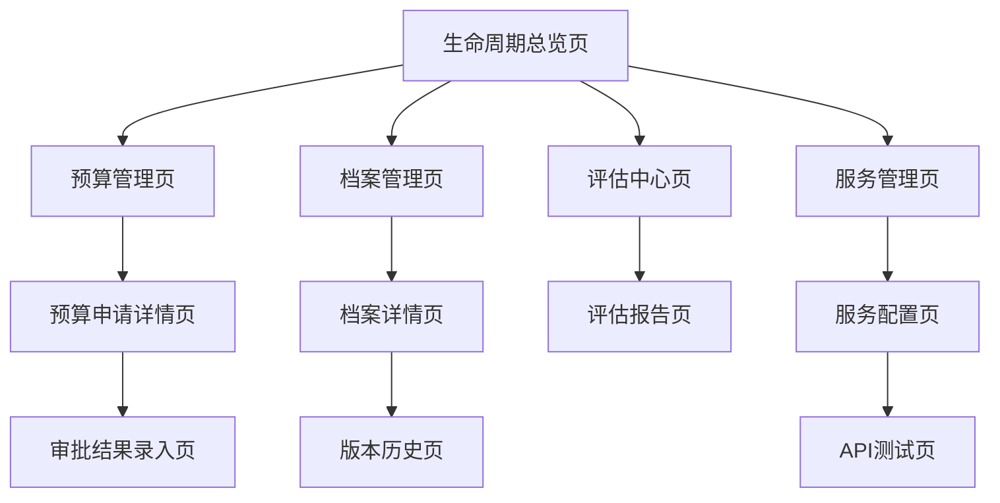
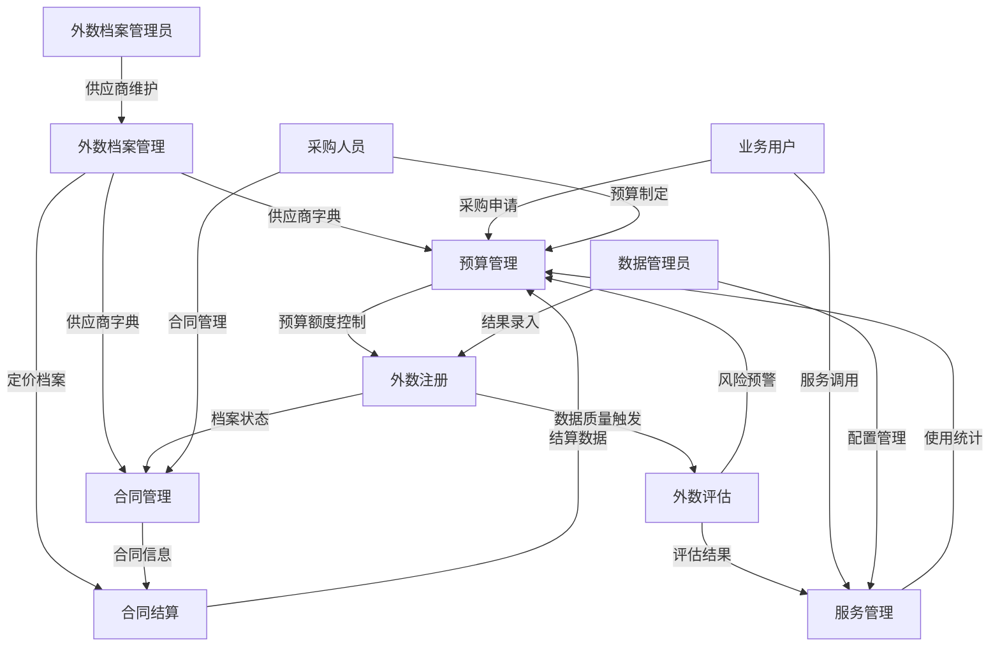

## 1. 产品概述

外数生命周期管理模块作为数据资产管理平台的核心入口，提供外部数据从预算申请到服务交付的全流程可视化管理。通过统一的生命周期视图，帮助数据管理员和业务用户高效管理外部数据资产，降低数据采购风险，提升数据使用效率。

目标用户包括数据管理员、业务分析师、采购人员和数据服务使用者，解决传统外部数据管理分散、流程不透明、缺乏统一监控的问题。

## 2. 核心功能

### 2.1 用户角色

| 角色    | 注册方式  | 核心权限              |
| ----- | ----- | ----------------- |
| 数据管理员 | 管理员分配 | 全生命周期管理、线下审批结果录入、服务配置 |
| 业务用户  | 邮箱注册  | 数据申请、档案查看、服务使用    |
| 采购人员  | 管理员分配 | 预算管理、供应商管理、合同管理与结算   |
| 访客用户  | 无需注册  | 查看公开数据服务、浏览档案     |

### 2.2 功能模块

外数生命周期管理模块以生命周期总览为首页，下设预算、档案、评估、服务四个子模块：

1. **生命周期总览页**（模块首页）

   * 外数资产全景视图：总量、分类分布、状态占比

   * 生命周期流程图：预算→档案→评估→服务的可视化流转

   * 关键指标监控：当年预算总额、当前累积消耗、预算健康度

   * 快速操作区：一键跳转新建预算、档案、评估、服务

   * 待办事项：线下审批结果待录入、待评估数据、待处理预警

   * **已实现功能**：生命周期阶段时间线可视化（注册、评估、审批、上线、运维、下线），阶段状态管理，按阶段和状态筛选功能

2. **预算管理模块**

   * **预算总览**：核心KPI卡片（预算金额/合同金额/实际消耗金额/核销金额/预算健康度）、预算燃尽图、预警列表、合同到期提醒；派生指标（预算使用率、合同覆盖率、合同执行率、预算剩余）

   * **预算列表**：多维度筛选（业务类型/平台/粒度/年度/季度/月份）、表格展示（目标贷余/预估放款/年化成本/无风险收益）、新建/上传/下载模板

   * **预算监控**：实时监控（总预算/已消耗/剩余/使用率）、健康度预警（超支/消耗过慢）、燃尽图（月/季度粒度）、导出预警数据

   * **合同管理**：供应商维度分析、合同统计（数量/总额/到期）、合同列表、新增供应商、合同上传

   * **结算管理**：批量结算任务、多供应商/多合同、差异分析（金额/率）、状态跟踪（待执行→执行中→已完成）

3. **档案管理模块**

   * 数据档案创建、元数据管理、版本控制、权限设置

   * **已实现功能**：档案列表展示，多维度筛选（供应商、状态、使用场景、关键词），快速状态筛选（引入中、已上线、待评估、已归档），导出数据功能

4. **评估中心模块**

   * 数据质量评估、价值评估、风险评估、评估报告

   * **已实现功能**：评估报告列表，按评估类型筛选（质量、性能、性价比、综合），按状态筛选（草稿、进行中、已完成、已归档），评分展示

5. **服务管理模块**

   * 服务发布、服务监控、使用统计、服务评价

   * **已实现功能**：服务列表展示，多维度筛选（供应商、服务类型），计费模式展示，单价和状态展示

6. **详情页面**

   * 单个外数资产的完整生命周期详情展示

### 2.3 页面详情

| 页面名称     | 模块名称    | 功能描述                                     |
| -------- | ------- | ---------------------------------------- |
| 生命周期总览页  | 数据资产概览  | 展示所有外部数据资产总量、分类分布、状态占比等核心指标              |
| 生命周期总览页  | 生命周期流程图 | 可视化展示外数从预算到服务的完整流程，支持流程节点状态查看            |
| 生命周期总览页  | 快速操作区   | 提供常用操作的快捷入口，包括新建预算、申请数据、发布服务等            |
| 生命周期总览页  | 待办事项    | 显示当前用户的待录入审批结果、待处理事项，支持一键处理          |
| 预算管理页/总览 | 核心指标    | 当年预算金额、合同金额、当前累积实际消耗、当年实际核销、预算健康度     |
| 预算管理页/总览 | 预算燃尽图   | 多粒度（月/季度）燃尽趋势，支持图表类型切换                   |
| 预算管理页/总览 | 预算消耗预警  | 偏离率计算，超支、消耗过慢预警，支持一键跳转监控页                |
| 预算管理页/总览 | 合同到期提醒  | ≤7天、≤30天到期合同统计，待核销金额展示                   |
| 预算管理页/列表 | 多维度筛选   | 业务类型（助贷/直贷/融担）、平台产品、预算粒度（年/季/月）、年度、季度、月份 |
| 预算管理页/列表 | 表格展示    | 目标贷余、预估放款、预估费用、年化数据成本、无风险收益              |
| 预算管理页/列表 | 快捷操作    | 新建/上传预算、下载模板、分页浏览                        |
| 预算管理页/监控 | 实时监控    | 当年预算金额、实际消耗金额、核销金额、剩余预算、预算使用率（进度条）  |
| 预算管理页/监控 | 健康度统计   | 正常、超支、消耗过慢三类状态分布                         |
| 预算管理页/监控 | 预算燃尽图   | 支持月/季度粒度切换，图表类型切换                        |
| 预算管理页/监控 | 预警列表    | 业务类型、平台产品、健康度标签、导出功能                     |
| 预算管理页/合同 | 供应商分析   | 合同数量、合同总额、近30天到期数量、供应商数量（数据来源于外数档案模块） |
| 预算管理页/合同 | 执行率指标   | 合同执行率（核销金额/合同金额）、合同覆盖率（合同金额/预算金额）     |
| 预算管理页/合同 | 合同列表    | 合同名称、金额、供应商、起止日期、状态、操作                   |
| 预算管理页/合同 | 快捷入口    | 合同上传、供应商信息查看（跳转外数档案）、到期预警              |
| 预算管理页/结算 | 批量结算    | 多供应商、多合同选择，粒度（年/季/月）与时间标签                |
| 预算管理页/结算 | 差异分析    | 预算金额、实际金额、差异金额/率展示                       |
| 预算管理页/结算 | 口径说明    | 结算核销金额以结算单据为准，差异为实际消耗-核销；对预算与合同进行扣减    |
| 预算管理页/结算 | 状态跟踪    | 待执行→执行中→已完成，支持刷新、导出                      |
| 档案管理页    | 档案创建向导  | 引导式档案创建流程，自动提取数据元信息                      |
| 档案管理页    | 元数据管理   | 支持技术元数据、业务元数据、管理元数据的维护和管理                |
| 档案管理页    | 版本控制    | 档案版本管理，支持版本对比和回滚操作                       |
| 档案管理页    | 权限管理    | 细粒度权限控制，支持按用户、角色、部门设置访问权限                |
| 评估中心页    | 数据质量评估  | 自动化数据质量检测，包括完整性、准确性、及时性等指标               |
| 评估中心页    | 数据价值评估  | 基于使用频率、业务价值等因素的价值评估模型                    |
| 评估中心页    | 风险评估    | 数据安全、合规性、供应商稳定性等风险评估                     |
| 评估中心页    | 评估报告生成  | 自动生成标准化评估报告，支持导出和分享                      |
| 服务管理页    | 服务配置    | 数据服务API配置，包括访问方式、参数设置、返回值定义              |
| 服务管理页    | 服务发布    | 服务发布流程管理，支持测试环境和生产环境分别发布                 |
| 服务管理页    | 使用监控    | 实时监控服务调用情况，包括调用量、响应时间、错误率等               |
| 服务管理页    | 服务评价    | 收集用户对数据服务的评价和反馈，支持评分和评论                  |
| 详情页面     | 生命周期时间轴 | 展示单个数据资产的完整生命周期历程和时间节点                   |
| 详情页面     | 关联资产展示  | 显示当前数据资产的上下游关联关系和依赖图谱                    |
| 详情页面     | 操作日志    | 完整的操作审计日志，记录所有用户的关键操作                    |

## 3. 核心流程

### 数据管理员流程

数据管理员登录系统后，首先进入生命周期总览页查看整体情况。可录入线下审批结果，管理数据档案信息，配置数据服务，监控整个生命周期流程。

### 业务用户流程

业务用户登录后查看可用的数据服务，根据需要提交新的数据采购申请，跟踪申请进度，使用已发布的数据服务，对数据质量进行评价反馈。

### 采购人员流程

采购人员专门处理预算相关事务，在预算管理模块中：

1. 进入预算总览查看核心指标和预警信息
2. 在预算列表中记录线下审批结果，关注目标贷余、预估放款、年化成本等关键指标
3. 使用预算监控实时跟踪预算执行情况，识别超支和消耗过慢风险
4. 在合同管理中查看供应商信息（数据来源于外数档案模块），监控合同到期情况
5. 通过结算管理发起批量结算任务，进行差异分析并跟踪执行状态

**供应商管理说明**：供应商基础信息、评估信息、定价档案的统一维护入口为外数档案管理模块，预算管理模块仅引用查看，不进行增删改操作

## 4. 用户界面设计

### 4.1 设计风格

* **主色调**：专业蓝 (#1890ff) 搭配深灰 (#434343)，体现数据管理的专业性

* **辅助色**：成功绿 (#52c41a)、警告橙 (#faad14)、错误红 (#f5222d)

* **按钮样式**：圆角矩形设计，主要操作为实心填充，次要操作为边框样式

* **字体规范**：主标题 18px 加粗，正文 14px 常规，辅助文字 12px

* **布局风格**：卡片式布局，左侧导航 + 右侧内容区的经典企业级布局

* **图标风格**：使用线性图标，保持简洁专业的视觉风格

### 4.2 页面设计概述

| 页面名称     | 模块名称    | UI元素                                        |
| -------- | ------- | ------------------------------------------- |
| 生命周期总览页  | 数据资产概览  | 采用仪表板设计，使用大数字卡片展示核心指标，配合环形图和柱状图进行数据可视化      |
| 生命周期总览页  | 生命周期流程图 | 使用水平时间轴设计，每个节点用圆形图标表示，支持悬停显示详细状态            |
| 生命周期总览页  | **已实现** | **阶段时间线可视化（注册、评估、审批、上线、运维、下线），阶段状态管理，按阶段和状态筛选功能** |
| 预算管理页/总览 | 预算总览卡片  | 采用仪表板设计，使用大数字卡片展示当年预算总额、当前累积消耗、当年实际核销、预算健康度 |
| 预算管理页/总览 | 预算燃尽图   | 使用折线图展示预算消耗趋势，支持月/季度粒度切换，包含预算线和实际消耗线        |
| 预算管理页/总览 | 预算预警列表  | 使用表格展示偏离率计算结果，超支和消耗过慢项目用红色和橙色标签标识           |
| 预算管理页/列表 | 预算表格    | 采用专业数据表格，支持排序、筛选、分页，关键指标如年化数据成本、无风险收益用百分比展示 |
| 预算管理页/监控 | 监控面板    | 使用卡片式布局展示实时监控指标，预算使用率采用进度条直观展示              |
| 预算管理页/合同 | 供应商分析   | 使用表格和统计卡片结合，展示供应商维度的合同数量、总额、到期情况            |
| 预算管理页/结算 | 结算任务    | 采用任务列表形式，展示差异分析结果，支持状态标签和金额格式化              |
| 档案管理页    | 档案列表    | 使用表格展示，支持排序、筛选、搜索，每行提供快捷操作按钮                |
| 档案管理页    | **已实现** | **档案列表展示，多维度筛选（供应商、状态、使用场景、关键词），快速状态筛选（引入中、已上线、待评估、已归档），导出数据功能** |
| 评估中心页    | 评估报告    | 采用报告模板设计，包含执行摘要、详细结果、改进建议等标准化章节             |
| 评估中心页    | **已实现** | **评估报告列表，按评估类型筛选（质量、性能、性价比、综合），按状态筛选（草稿、进行中、已完成、已归档），评分展示** |
| 服务管理页    | 服务监控面板  | 实时监控图表，使用折线图展示调用趋势，支持时间范围选择和指标切换            |
| 服务管理页    | **已实现** | **服务列表展示，多维度筛选（供应商、服务类型），计费模式展示，单价和状态展示** |

### 4.3 响应式设计

采用桌面端优先的设计策略，主界面针对 1920×1080 分辨率优化设计。支持响应式适配，在平板端保持核心功能完整可用，手机端提供简化版本主要查看功能。触摸交互优化包括增大点击区域、支持手势滑动切换标签页等。

## 5. 模块交互关系与使用场景

### 5.1 预算管理视角的交互关系

**预算驱动场景**：

* 采购人员制定年度预算后，业务用户基于预算额度提交外数采购申请

* 线下审批完成后，由系统录入结果并生成对应的外数档案初始记录

* 预算消耗监控，当达到预警阈值时，自动通知相关评估任务优先级调整

* 合同结算完成后，预算数据自动更新，影响后续采购决策

**数据流转**：预算数据 → 档案创建 → 评估任务 → 服务配置 → 结算回写

### 5.2 外数注册视角的交互关系

**档案创建场景**：

* 业务用户提交数据采购申请，线下审批完成后系统录入并生成外数档案
* 档案创建时自动关联对应的预算信息，确保预算控制
* 档案创建时必须选择外数档案模块中已维护的供应商（统一供应商字典）
* 档案版本更新触发重新评估流程，历史版本保留用于对比分析
* 档案发布后自动生成对应的服务配置模板

**跨模块影响**：档案状态变化 → 评估任务创建 → 服务配置更新 → 预算消耗记录
**供应商管理统一性**：档案中的供应商信息必须来源于外数档案模块的统一供应商字典

### 5.3 合同更新视角的交互关系

**合同变更场景**：

* 合同续签或变更时，自动更新关联的预算信息（金额、期限等）
* 合同状态变化触发对应外数档案的状态同步更新
* 合同中的供应商信息必须来源于外数档案模块的统一供应商字典
* 合同到期预警提前30天通知评估中心进行价值重评估
* 合同终止时，相关服务自动下架，档案状态更新为"历史"

**联动机制**：合同更新 → 预算调整 → 档案同步 → 服务状态变更 → 评估任务
**供应商信息一致性**：合同中的供应商信息必须保持与外数档案模块的供应商字典一致

### 5.4 合同结算视角的交互关系

**结算执行场景**：

* 结算任务创建时自动校验对应合同的预算余额
* 结算任务按供应商维度自动分拆，每个供应商生成独立的结算任务
* 结算系统从外数档案模块引用供应商字典和定价档案（只读）
* 结算金额确认后，实时更新预算消耗数据和预算健康度
* 结算差异分析结果反馈至评估中心，影响数据价值评分
* 结算完成触发供应商评价流程，影响后续采购决策

**数据闭环**：结算数据 → 预算更新 → 评估反馈 → 供应商评价 → 未来采购参考
**供应商引用机制**：结算系统仅引用外数档案模块的供应商字典和定价档案，不进行供应商信息的增删改操作

### 5.5 外数评估视角的交互关系

**评估驱动场景**：

* 新数据注册自动触发初始质量评估和价值评估

* 定期评估任务基于合同周期自动创建，评估结果影响续签决策

* 评估发现问题自动创建预警，通知预算管理进行风险控制

* 评估结果直接影響服务发布决策，低评分数据服务限制发布

**评估影响链**：评估结果 → 档案质量标签 → 服务发布控制 → 预算风险提示 → 采购决策

### 5.6 日常服务调用视角的交互关系

**服务使用场景**：

* 服务调用日志实时记录，自动更新数据使用频次和价值评估参数

* 调用异常或性能问题自动触发质量重评估任务

* 高频调用服务自动提升评估优先级，确保数据质量持续监控

* 服务使用统计定期反馈至预算管理，优化预算分配策略

**使用反馈循环**：服务调用 → 使用统计 → 价值重评估 → 预算优化 → 服务改进

### 5.7 跨模块数据流总览

## 6. 指标口径与度量

### 6.1 四金额的概念与边界

- 预算金额（Budget Amount）：线下审批确定并由系统录入的当期可用额度，按年度/季度/月维度管理；用于健康度与监控阈值计算，可进行调整但需保留版本与变更记录。
- 合同金额（Contract Amount）：已签约合同的总金额，按供应商/产品/合同周期维度统计；与预算金额不必相等，用于覆盖率与执行率度量。含税/未税口径在合同录入时明确并统一。
- 实际消耗金额（Actual Consumption）：基于服务调用/任务结果的计费累计，未结算前的使用口径；用于实时监控与燃尽趋势，按业务类型/产品/时间维度聚合。
- 核销金额（Write-off Amount）：结算完成并入账的金额，来源于结算单据；对预算进行正式扣减，用于预算使用率与合同执行率的最终统计。

### 6.2 派生指标与公式

- 预算剩余 = 预算金额 − 核销金额
- 预算使用率 = 核销金额 ÷ 预算金额
- 合同覆盖率 = 合同金额 ÷ 预算金额
- 合同执行率 = 核销金额 ÷ 合同金额
- 差异金额 = 实际消耗金额 − 核销金额
- 差异率 = 差异金额 ÷ 实际消耗金额

### 6.3 页面与指标映射

- 预算总览：显示预算金额、合同金额、实际消耗金额、核销金额、预算健康度及派生指标（预算使用率、合同覆盖率、合同执行率、预算剩余）。
- 预算监控：实时展示预算金额、实际消耗金额、核销金额与燃尽图；支持按月/季度切换与健康度状态分布。
- 合同管理：显示合同总额并计算合同执行率与合同覆盖率；对近到期合同进行提醒。
- 结算管理：以结算单据为准展示核销金额，提供差异金额/率与状态流转；完成后回写预算与合同统计。

### 5.8 典型用户流程示例

**完整外数生命周期流程**：

1. **供应商维护**：外数档案管理员在外数档案模块维护供应商信息和定价档案
2. 采购人员制定预算 → 业务用户提交申请 → 线下审批，系统录入结果
3. 结果录入后创建档案 → 选择已维护的供应商 → 触发质量评估 → 生成评估报告
4. 基于评估结果签订合同 → 合同信息同步更新档案（供应商信息来源于外数档案字典）
5. 服务配置和发布 → 业务用户开始使用服务
6. 定期结算 → 引用外数档案供应商字典和定价档案 → 按供应商分拆任务 → 预算消耗更新 → 续签评估决策

**异常处理流程**：

* 评估不合格 → 暂停服务 → 预算冻结 → 供应商整改（在外数档案模块更新供应商状态） → 重新评估

* 预算超支 → 服务降级 → 线下紧急决策 → 临时额度 → 后续调整

* 供应商信息变更 → 外数档案模块统一更新 → 事件通知预算和结算系统 → 保持数据一致性

* 合同到期 → 提前预警 → 价值重评估 → 续签/终止决策 → 档案状态更新（供应商状态同步更新）

## 7. 已实现功能汇总

### 7.1 已完整实现的核心功能

**预算管理模块**（已完整实现）：
- ✅ 预算总览：四金额KPI卡片、预算燃尽图、合同到期提醒、结算概览
- ✅ 预算列表：多维度筛选、表格展示、快捷操作
- ✅ 预算监控：实时监控、健康度预警、燃尽图、导出功能
- ✅ 合同管理：供应商分析、合同列表、到期预警
- ✅ 结算管理：批量结算、差异分析、状态跟踪

**外数生命周期模块**（基础框架已实现）：
- ✅ 生命周期页面：阶段时间线可视化、阶段状态管理、筛选功能
- ✅ 档案管理：档案列表、多维度筛选、状态筛选、导出功能
- ✅ 评估中心：评估报告列表、类型筛选、状态筛选、评分展示
- ✅ 服务管理：服务列表、供应商筛选、服务类型筛选、计费模式展示
- ✅ 外数监控：预算监控集成、多维度筛选、健康度预警、燃尽图

### 7.2 待完善功能

**生命周期总览页**（模块首页）：
- ❌ 数据资产全景视图（总量、分类分布、状态占比）
- ❌ 快速操作区（一键跳转新建预算、档案、评估、服务）
- ❌ 待办事项（线下审批结果待录入、待评估数据、待处理预警）

**档案管理深度功能**：
- ❌ 档案创建向导
- ❌ 元数据管理（技术、业务、管理元数据）
- ❌ 版本控制（版本对比和回滚）
- ❌ 权限设置（细粒度权限控制）

**评估中心深度功能**：
- ❌ 数据质量评估（完整性、准确性、及时性）
- ❌ 数据价值评估（使用频率、业务价值）
- ❌ 风险评估（数据安全、合规性、供应商稳定性）
- ❌ 评估报告生成和导出
- ❌ 新建评估功能

**服务管理深度功能**：
- ❌ 服务配置（API配置、参数设置、返回值定义）
- ❌ 服务发布流程（测试环境和生产环境）
- ❌ 使用监控（调用量、响应时间、错误率）
- ❌ 服务评价（用户评分和评论）
- ❌ 新建服务功能

### 7.3 数据发现模块功能整合分析

**数据发现模块外数管理功能现状**：

1. **外部数据管理页面**（`/discovery/asset-management/external-data-management`）：
   - ✅ 外部数据注册和管理（与档案管理重叠）
   - ✅ 采购项目管理（与预算管理重叠）
   - ✅ 供应商管理（与合同管理重叠）
   - ✅ 元数据展示：接口编号、供应商、状态、单价、管理人员
   - ✅ 文件管理：支持多种格式文件上传和管理

2. **外部数据v1页面**（`/external-data-v1/list`）- **当前实现状态评估**：
   
   **已完整实现的功能**（✅）：
   - ✅ 产品化展示：卡片式界面，支持产品分类和筛选
   - ✅ 数源种类管理：核验类、评分类、标签类、名单类、价格评估类
   - ✅ 数据分类：身份核验类、信用评分、用户画像、风险名单、资产评估
   - ✅ 基础元数据展示：接口编号、供应商、状态、单价、管理人员
   - ✅ 搜索筛选：支持按名称、接口编号、供应商搜索
   - ✅ 批量操作：支持批量变更和模板下载
   - ✅ 详情跳转：支持跳转到详情页面
   
   **功能差距分析**（❌）：
   - ❌ **财务信息缺失**：仅显示单价，缺少预算使用情况、合同信息、核销状态
   - ❌ **生命周期状态孤立**：独立状态管理，与风险域外数生命周期无状态同步
   - ❌ **元数据不完整**：缺少预算信息、评估报告、服务配置等关键元数据
   - ❌ **权限控制缺失**：无细粒度权限管理，无法区分不同角色查看范围
   - ❌ **数据联动缺失**：与风险域预算管理、评估中心无数据交互
   
   **优化建议**：
   1. **增强元数据展示**：在卡片中增加生命周期状态标签（注册/评估/审批/上线/运维/下线）
   2. **财务信息集成**：显示预算使用进度、合同状态、核销情况（从风险域获取）
   3. **状态同步机制**：建立与风险域外数生命周期的状态同步，确保数据一致性
   4. **角色权限控制**：根据用户角色（数据管理员/业务用户/采购人员）展示不同信息
   5. **快速操作集成**：增加一键跳转风险域进行深度管理的功能入口

**功能重叠分析**：

| 功能域 | 风险域外数生命周期 | 数据发现模块 | 重叠程度 | 整合建议 |
|-------|------------------|-------------|----------|----------|
| 外数注册/档案管理 | ✅ 档案管理模块 | ✅ 外部数据管理 | **高** | 数据发现模块负责基础注册，风险域负责深度档案管理 |
| 采购/预算管理 | ✅ 预算管理模块 | ✅ 采购项目管理 | **高** | 数据发现模块负责采购申请，风险域负责预算控制和结算 |
| 供应商管理 | ✅ 合同管理（引用外数档案供应商字典） | ✅ 供应商管理（外数档案统一管理入口） | **高** | 外数档案模块为供应商信息统一维护入口，预算管理模块只读引用 |
| 元数据展示 | ✅ 档案详情 | ✅ 产品详情页 | **高** | 数据发现模块展示核心元数据，风险域展示完整生命周期 |
| 服务配置 | ✅ 服务管理模块 | ❌ | 低 | 由风险域统一负责 |
| 评估报告 | ✅ 评估中心模块 | ❌ | 低 | 由风险域统一负责 |

**整合方案建议**（基于external-data-v1/list页面评估结果更新）：

1. **职责分工明确化**：
   - **数据发现模块**（external-data-v1/list）：负责外数的基础发现、产品化展示、初步筛选
   - **风险域外数生命周期**：负责深度档案管理、预算控制、风险评估、完整生命周期管理
   - **供应商管理统一入口**：外数档案管理模块是供应商信息的唯一维护入口，预算管理模块只读引用

2. **数据流转机制**：
   - **注册流向**：数据发现模块注册的外数 → 自动同步到风险域档案管理进行深度管理
   - **供应商统一管理**：外数档案模块维护供应商字典 → 预算管理模块只读引用供应商信息和定价档案
   - **信息回流**：风险域的评估结果、预算状态、生命周期进度 → 实时回写到数据发现模块
   - **状态同步**：建立双向状态同步机制，确保两模块数据一致性
   - **结算引用**：结算系统从外数档案模块引用供应商字典和定价档案，任务按供应商分拆

3. **元数据分层展示**：
   - **数据发现模块展示**（轻量化）：
     - 基础信息：接口编号、供应商、产品分类、管理人员
     - 财务概览：预算使用进度（百分比）、合同状态（图标标识）
     - 生命周期状态：注册/评估/审批/上线/运维/下线（标签展示）
     - 快速操作：一键跳转风险域进行深度管理
   
   - **风险域补充展示**（完整版）：
     - 详细预算信息：四金额模型、使用率、健康度
     - 完整评估报告：质量、价值、风险评估详情
     - 服务配置信息：API参数、调用统计、性能监控
     - 生命周期时间轴：完整历程和操作日志

4. **external-data-v1/list页面具体优化路径**：
   - **短期优化**（1-2周）：
     - 增加生命周期状态标签展示
     - 添加预算使用进度条（从风险域获取数据）
     - 增加一键跳转风险域的快捷按钮
   
   - **中期完善**（3-4周）：
     - 实现与风险域的数据同步API
     - 完善权限控制，按角色展示不同信息
     - 增加财务状态图标（合同到期、预算预警等）
   
   - **长期整合**（1-2个月）：
     - 建立统一的外数元数据中心
     - 实现完整的双向数据流转
     - 优化用户体验，避免重复操作

### 7.4 技术实现状态

**前端实现**：
- ✅ 所有基础页面和组件已开发完成
- ✅ 路由配置和菜单集成已完成
- ✅ 基础数据展示和筛选功能已实现
- ✅ 与预算管理模块的数据联动已实现
- ✅ 数据发现模块外数管理功能已实现
- ✅ 外数v1产品化展示已实现

**待开发**：
- ❌ 生命周期总览页（模块统一入口）
- ❌ 高级数据可视化（AntV X6流程图）
- ❌ 复杂交互和表单验证
- ❌ 线下审批结果录入功能
- ❌ 数据发现模块与风险域的数据同步机制
- ❌ 统一的元数据管理接口
