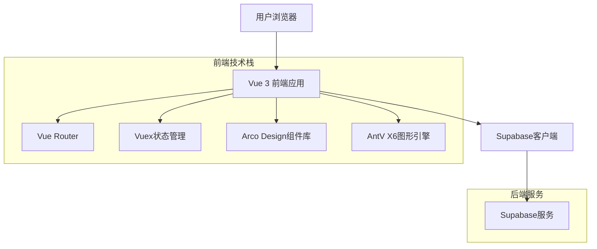
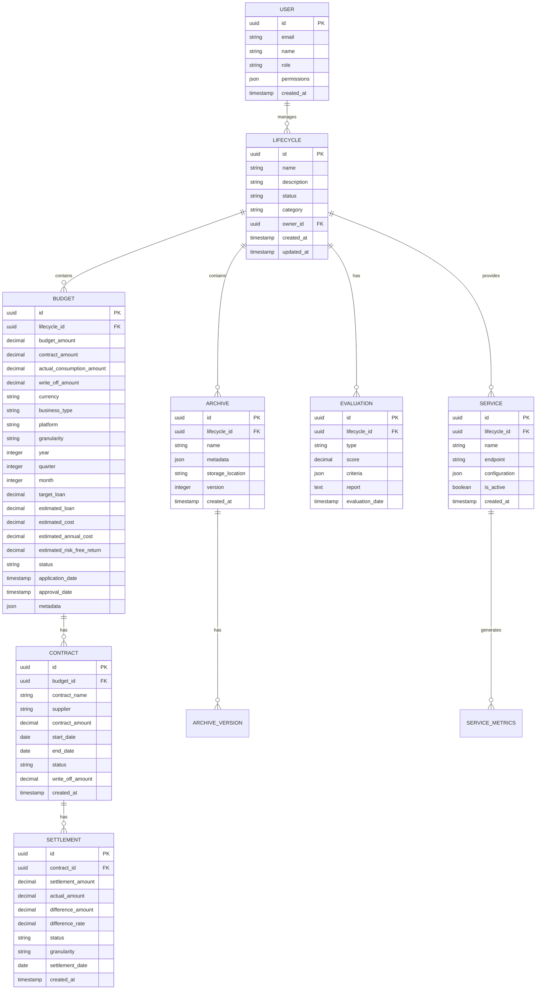

## 1. 架构设计



## 2. 技术描述

- **前端框架**: Vue 3 (Composition API) + TypeScript
- **构建工具**: Vite
- **状态管理**: Vuex 4
- **路由管理**: Vue Router 4
- **UI组件库**: Arco Design Vue
- **图形引擎**: AntV X6 (用于生命周期流程图和拓扑图)
- **数据可视化**: AntV G2Plot
- **HTTP客户端**: Axios
- **后端服务**: Supabase (提供认证、数据库、存储服务)
- **初始化工具**: vite-init

## 3. 路由定义

| 路由 | 用途 |
|------|------|
| / | 生命周期总览页，模块首页 |
| /budget | 预算管理页，包含预算申请和审批 |
| /budget/apply | 预算申请页面 |
| /budget/detail/:id | 预算详情页面 |
| /archive | 档案管理页，数据档案列表 |
| /archive/create | 档案创建页面 |
| /archive/detail/:id | 档案详情页面 |
| /evaluation | 评估中心页，数据质量和价值评估 |
| /evaluation/report/:id | 评估报告页面 |
| /service | 服务管理页，数据服务配置和监控 |
| /service/config/:id | 服务配置页面 |
| /lifecycle/detail/:id | 生命周期详情页面 |
| /profile | 用户个人中心 |

## 4. 数据模型

### 4.1 数据模型定义



### 4.2 数据定义语言

```sql
-- 生命周期主表
CREATE TABLE lifecycles (
    id UUID PRIMARY KEY DEFAULT gen_random_uuid(),
    name VARCHAR(255) NOT NULL,
    description TEXT,
    status VARCHAR(50) NOT NULL DEFAULT 'draft' CHECK (status IN ('draft', 'budgeting', 'archived', 'evaluating', 'serving', 'retired')),
    category VARCHAR(100) NOT NULL,
    owner_id UUID REFERENCES auth.users(id),
    metadata JSONB DEFAULT '{}',
    created_at TIMESTAMP WITH TIME ZONE DEFAULT NOW(),
    updated_at TIMESTAMP WITH TIME ZONE DEFAULT NOW()
);

-- 预算表（四金额模型）
CREATE TABLE budgets (
    id UUID PRIMARY KEY DEFAULT gen_random_uuid(),
    lifecycle_id UUID REFERENCES lifecycles(id) ON DELETE CASCADE,
    budget_amount DECIMAL(15,2) NOT NULL, -- 预算金额
    contract_amount DECIMAL(15,2) DEFAULT 0, -- 合同金额
    actual_consumption_amount DECIMAL(15,2) DEFAULT 0, -- 实际消耗金额
    write_off_amount DECIMAL(15,2) DEFAULT 0, -- 核销金额
    currency VARCHAR(3) DEFAULT 'CNY',
    business_type VARCHAR(50) NOT NULL, -- 业务类型：助贷/直贷/融担
    platform VARCHAR(100) NOT NULL, -- 平台产品
    granularity VARCHAR(20) NOT NULL CHECK (granularity IN ('year', 'quarter', 'month')), -- 预算粒度
    year INTEGER NOT NULL,
    quarter INTEGER CHECK (quarter >= 1 AND quarter <= 4),
    month INTEGER CHECK (month >= 1 AND month <= 12),
    target_loan DECIMAL(15,2) DEFAULT 0, -- 目标贷余
    estimated_loan DECIMAL(15,2) DEFAULT 0, -- 预估放款
    estimated_cost DECIMAL(15,2) DEFAULT 0, -- 预估费用
    estimated_annual_cost DECIMAL(5,4) DEFAULT 0, -- 预估年化数据成本（百分比）
    estimated_risk_free_return DECIMAL(5,4) DEFAULT 0, -- 预估无风险收益（百分比）
    status VARCHAR(50) NOT NULL DEFAULT 'pending' CHECK (status IN ('pending', 'approved', 'rejected', 'executing', 'completed')),
    applicant_id UUID REFERENCES auth.users(id),
    approver_id UUID REFERENCES auth.users(id),
    application_date TIMESTAMP WITH TIME ZONE DEFAULT NOW(),
    approval_date TIMESTAMP WITH TIME ZONE,
    metadata JSONB DEFAULT '{}',
    created_at TIMESTAMP WITH TIME ZONE DEFAULT NOW(),
    updated_at TIMESTAMP WITH TIME ZONE DEFAULT NOW()
);

-- 合同表
CREATE TABLE contracts (
    id UUID PRIMARY KEY DEFAULT gen_random_uuid(),
    budget_id UUID REFERENCES budgets(id) ON DELETE CASCADE,
    contract_name VARCHAR(255) NOT NULL,
    supplier VARCHAR(255) NOT NULL,
    contract_amount DECIMAL(15,2) NOT NULL,
    start_date DATE NOT NULL,
    end_date DATE NOT NULL,
    status VARCHAR(50) NOT NULL DEFAULT 'active' CHECK (status IN ('draft', 'active', 'expiring', 'expired', 'terminated')),
    write_off_amount DECIMAL(15,2) DEFAULT 0, -- 已核销金额
    metadata JSONB DEFAULT '{}',
    created_at TIMESTAMP WITH TIME ZONE DEFAULT NOW(),
    updated_at TIMESTAMP WITH TIME ZONE DEFAULT NOW()
);

-- 结算表
CREATE TABLE settlements (
    id UUID PRIMARY KEY DEFAULT gen_random_uuid(),
    contract_id UUID REFERENCES contracts(id) ON DELETE CASCADE,
    settlement_amount DECIMAL(15,2) NOT NULL, -- 结算金额（核销金额）
    actual_amount DECIMAL(15,2) NOT NULL, -- 实际消耗金额
    difference_amount DECIMAL(15,2) DEFAULT 0, -- 差异金额
    difference_rate DECIMAL(5,4) DEFAULT 0, -- 差异率
    status VARCHAR(50) NOT NULL DEFAULT 'pending' CHECK (status IN ('pending', 'executing', 'completed', 'failed')),
    granularity VARCHAR(20) NOT NULL CHECK (granularity IN ('year', 'quarter', 'month')),
    settlement_date DATE NOT NULL,
    settlement_period_start DATE,
    settlement_period_end DATE,
    metadata JSONB DEFAULT '{}',
    created_at TIMESTAMP WITH TIME ZONE DEFAULT NOW(),
    updated_at TIMESTAMP WITH TIME ZONE DEFAULT NOW()
);

-- 档案表
CREATE TABLE archives (
    id UUID PRIMARY KEY DEFAULT gen_random_uuid(),
    lifecycle_id UUID REFERENCES lifecycles(id) ON DELETE CASCADE,
    name VARCHAR(255) NOT NULL,
    description TEXT,
    metadata JSONB DEFAULT '{}',
    storage_location VARCHAR(500),
    version INTEGER DEFAULT 1,
    created_by UUID REFERENCES auth.users(id),
    created_at TIMESTAMP WITH TIME ZONE DEFAULT NOW()
);

-- 评估表
CREATE TABLE evaluations (
    id UUID PRIMARY KEY DEFAULT gen_random_uuid(),
    lifecycle_id UUID REFERENCES lifecycles(id) ON DELETE CASCADE,
    evaluation_type VARCHAR(50) NOT NULL CHECK (evaluation_type IN ('quality', 'value', 'risk', 'comprehensive')),
    score DECIMAL(3,2) CHECK (score >= 0 AND score <= 1),
    criteria JSONB DEFAULT '{}',
    report TEXT,
    evaluator_id UUID REFERENCES auth.users(id),
    evaluation_date TIMESTAMP WITH TIME ZONE DEFAULT NOW()
);

-- 服务表
CREATE TABLE services (
    id UUID PRIMARY KEY DEFAULT gen_random_uuid(),
    lifecycle_id UUID REFERENCES lifecycles(id) ON DELETE CASCADE,
    name VARCHAR(255) NOT NULL,
    endpoint VARCHAR(500),
    configuration JSONB DEFAULT '{}',
    is_active BOOLEAN DEFAULT false,
    created_by UUID REFERENCES auth.users(id),
    created_at TIMESTAMP WITH TIME ZONE DEFAULT NOW()
);

-- 创建索引
CREATE INDEX idx_lifecycles_status ON lifecycles(status);
CREATE INDEX idx_lifecycles_category ON lifecycles(category);
CREATE INDEX idx_lifecycles_owner ON lifecycles(owner_id);
CREATE INDEX idx_budgets_status ON budgets(status);
CREATE INDEX idx_budgets_lifecycle ON budgets(lifecycle_id);
CREATE INDEX idx_budgets_business_type ON budgets(business_type);
CREATE INDEX idx_budgets_platform ON budgets(platform);
CREATE INDEX idx_budgets_year_quarter ON budgets(year, quarter);
CREATE INDEX idx_contracts_budget ON contracts(budget_id);
CREATE INDEX idx_contracts_supplier ON contracts(supplier);
CREATE INDEX idx_contracts_status ON contracts(status);
CREATE INDEX idx_contracts_end_date ON contracts(end_date);
CREATE INDEX idx_settlements_contract ON settlements(contract_id);
CREATE INDEX idx_settlements_status ON settlements(status);
CREATE INDEX idx_settlements_date ON settlements(settlement_date);
CREATE INDEX idx_archives_lifecycle ON archives(lifecycle_id);
CREATE INDEX idx_evaluations_lifecycle ON evaluations(lifecycle_id);
CREATE INDEX idx_services_lifecycle ON services(lifecycle_id);

-- Supabase RLS策略
-- 生命周期表策略
ALTER TABLE lifecycles ENABLE ROW LEVEL SECURITY;

-- 所有用户可查看活跃的生命周期
CREATE POLICY "Public view active lifecycles" ON lifecycles
    FOR SELECT USING (status IN ('evaluating', 'serving'));

-- 认证用户可创建生命周期
CREATE POLICY "Authenticated users can create lifecycles" ON lifecycles
    FOR INSERT WITH CHECK (auth.uid() = owner_id);

-- 拥有者可更新生命周期
CREATE POLICY "Owners can update lifecycles" ON lifecycles
    FOR UPDATE USING (auth.uid() = owner_id);

-- 预算表策略
ALTER TABLE budgets ENABLE ROW LEVEL SECURITY;

-- 所有用户可查看预算
CREATE POLICY "Public view budgets" ON budgets
    FOR SELECT USING (true);

-- 认证用户可创建预算
CREATE POLICY "Authenticated users can create budgets" ON budgets
    FOR INSERT WITH CHECK (auth.uid() = applicant_id);

-- 拥有者可更新预算
CREATE POLICY "Owners can update budgets" ON budgets
    FOR UPDATE USING (auth.uid() = applicant_id);

-- 合同表策略
ALTER TABLE contracts ENABLE ROW LEVEL SECURITY;

-- 所有用户可查看合同
CREATE POLICY "Public view contracts" ON contracts
    FOR SELECT USING (true);

-- 认证用户可创建合同
CREATE POLICY "Authenticated users can create contracts" ON contracts
    FOR INSERT WITH CHECK (auth.role() = 'authenticated');

-- 结算表策略
ALTER TABLE settlements ENABLE ROW LEVEL SECURITY;

-- 所有用户可查看结算
CREATE POLICY "Public view settlements" ON settlements
    FOR SELECT USING (true);

-- 认证用户可创建结算
CREATE POLICY "Authenticated users can create settlements" ON settlements
    FOR INSERT WITH CHECK (auth.role() = 'authenticated');

-- 授权访问
GRANT SELECT ON lifecycles TO anon;
GRANT ALL PRIVILEGES ON lifecycles TO authenticated;
GRANT SELECT ON budgets TO anon;
GRANT ALL PRIVILEGES ON budgets TO authenticated;
GRANT SELECT ON contracts TO anon;
GRANT ALL PRIVILEGES ON contracts TO authenticated;
GRANT SELECT ON settlements TO anon;
GRANT ALL PRIVILEGES ON settlements TO authenticated;
GRANT SELECT ON archives TO anon;
GRANT ALL PRIVILEGES ON archives TO authenticated;
GRANT SELECT ON evaluations TO anon;
GRANT ALL PRIVILEGES ON evaluations TO authenticated;
GRANT SELECT ON services TO anon;
GRANT ALL PRIVILEGES ON services TO authenticated;
```

## 5. 前端架构设计

### 5.1 组件架构
```
src/
├── components/           # 公共组件
│   ├── LifecycleFlow/   # 生命周期流程图组件
│   ├── DataCard/        # 数据卡片组件
│   ├── Chart/           # 图表组件
│   ├── Table/           # 表格组件
│   ├── BudgetCard/      # 预算卡片组件（四金额展示）
│   ├── ContractCard/    # 合同卡片组件
│   └── SettlementForm/  # 结算表单组件
├── views/               # 页面组件
│   ├── Overview/        # 总览页
│   ├── Budget/          # 预算管理
│   │   ├── Overview.vue # 预算总览（四金额KPI）
│   │   ├── List.vue     # 预算列表
│   │   ├── Monitor.vue  # 预算监控
│   │   ├── Contracts.vue # 合同管理
│   │   └── Settlement.vue # 结算管理
│   ├── Archive/         # 档案管理
│   ├── Evaluation/      # 评估中心
│   └── Service/         # 服务管理
├── stores/              # 状态管理
│   ├── lifecycle.js     # 生命周期状态（四金额计算）
│   ├── user.js          # 用户状态
│   ├── app.js           # 应用状态
│   ├── budget.js        # 预算状态管理
│   ├── contract.js      # 合同状态管理
│   └── settlement.js    # 结算状态管理
├── utils/               # 工具函数
│   ├── request.js       # HTTP请求封装
│   ├── auth.js          # 认证相关
│   ├── budget.js        # 四金额计算工具
│   └── constants.js     # 常量定义
└── router/              # 路由配置
    └── index.js
```

### 5.2 状态管理设计
使用Vuex进行全局状态管理，主要模块包括：
- lifecycle: 管理生命周期相关数据，包含四金额汇总计算
- user: 管理用户信息和权限
- app: 管理应用级状态（加载状态、通知等）
- budget: 管理预算相关状态，支持四金额模型
- contract: 管理合同相关状态
- settlement: 管理结算相关状态
- archive: 管理档案相关状态

### 5.3 权限控制
基于角色的权限控制（RBAC），在前端路由守卫中实现：
```javascript
// 路由守卫示例
router.beforeEach((to, from, next) => {
  const userStore = useUserStore()
  const requiredRole = to.meta.requiredRole
  
  if (requiredRole && !userStore.hasRole(requiredRole)) {
    next('/403')
  } else {
    next()
  }
})
```

## 6. 实现差距分析

### 6.1 当前实现与PRD对比

基于对现有代码的分析，当前实现与PRD的主要差距：

**✅ 已实现功能：**
- 预算管理模块基础框架（Overview, List, Monitor, Contracts, Settlement页面）
- 四金额模型数据结构（budget_amount, contract_amount, actual_consumption_amount, write_off_amount）
- 预算总览页面的核心KPI展示
- 合同管理和结算管理页面结构
- 预算健康度监控基础功能

**❌ 待实现功能：**
- 生命周期总览页（模块首页）- 当前缺少统一入口
- 档案管理模块 - 完全缺失
- 评估中心模块 - 完全缺失  
- 服务管理模块 - 完全缺失
- 外数生命周期流程图可视化 - 缺少AntV X6实现
- 四金额计算逻辑的前端工具函数 - 需要补充BudgetCalculator
- 模块间数据流的状态管理 - 需要完善Vuex模块
- 线下审批结果录入功能 - 当前为空白

### 6.2 技术架构完善建议

**1. 生命周期总览页实现**
```javascript
// 需要创建src/views/Overview/LifecycleOverview.vue
// 包含：数据资产全景视图、生命周期流程图、关键指标监控、快速操作区
```

**2. 缺失模块补充**
```
src/views/
├── Archive/          # 档案管理模块
│   ├── List.vue     # 档案列表
│   ├── Create.vue   # 档案创建
│   └── Detail.vue   # 档案详情
├── Evaluation/       # 评估中心模块  
│   ├── List.vue     # 评估列表
│   ├── Create.vue   # 新建评估
│   └── Report.vue   # 评估报告
└── Service/          # 服务管理模块
    ├── List.vue     # 服务列表
    ├── Config.vue   # 服务配置
    └── Monitor.vue  # 服务监控
```

**3. 数据模型补充**
需要补充档案、评估、服务相关的数据库表结构和API接口

**4. 状态管理完善**
```javascript
// 需要补充的Vuex模块
stores/
├── archive.js      # 档案状态管理
├── evaluation.js   # 评估状态管理  
└── service.js      # 服务状态管理
```

**5. 工具函数补充**
```javascript
// 需要创建src/utils/budget.js
export const BudgetCalculator = {
  // 四金额计算、健康度评估、派生指标计算
}
```

### 6.3 优先级建议

**高优先级（立即实现）：**
1. 生命周期总览页 - 作为模块统一入口
2. BudgetCalculator工具函数 - 支撑四金额计算
3. 完善的状态管理架构 - 支撑模块间数据流

**中优先级（后续迭代）：**
1. 档案管理模块基础功能
2. 评估中心核心功能
3. 服务管理基础功能

**低优先级（长期规划）：**
1. AntV X6生命周期流程图可视化
2. 高级数据分析和报表功能
3. 移动端适配和响应式优化

### 5.4 四金额计算逻辑
在前端实现四金额计算工具函数：
```javascript
// 预算计算工具函数
export const BudgetCalculator = {
  // 计算预算剩余
  calculateRemaining: (budget) => {
    return budget.budget_amount - budget.write_off_amount
  },
  
  // 计算预算使用率
  calculateUsageRate: (budget) => {
    return budget.write_off_amount / budget.budget_amount
  },
  
  // 计算合同覆盖率
  calculateContractCoverage: (budget) => {
    return budget.contract_amount / budget.budget_amount
  },
  
  // 计算合同执行率
  calculateContractExecution: (budget) => {
    return budget.write_off_amount / budget.contract_amount
  },
  
  // 计算差异金额
  calculateDifference: (settlement) => {
    return settlement.actual_amount - settlement.settlement_amount
  },
  
  // 计算差异率
  calculateDifferenceRate: (settlement) => {
    return settlement.difference_amount / settlement.actual_amount
  },
  
  // 预算健康度评估
  calculateHealthScore: (budget) => {
    const usageRate = this.calculateUsageRate(budget)
    const timeProgress = this.calculateTimeProgress(budget)
    
    if (usageRate > timeProgress * 1.2) return '超支'
    if (usageRate < timeProgress * 0.5) return '消耗过慢'
    return '正常'
  }
}
```

### 5.5 模块间数据流
前端状态管理实现模块间数据同步：
```javascript
// Vuex store - lifecycle.js
export const useLifecycleStore = defineStore('lifecycle', {
  state: () => ({
    budgets: [],
    contracts: [],
    settlements: [],
    currentBudget: null
  }),
  
  getters: {
    // 计算四金额汇总
    budgetSummary: (state) => {
      return state.budgets.reduce((summary, budget) => ({
        totalBudget: summary.totalBudget + budget.budget_amount,
        totalContract: summary.totalContract + budget.contract_amount,
        totalConsumption: summary.totalConsumption + budget.actual_consumption_amount,
        totalWriteOff: summary.totalWriteOff + budget.write_off_amount
      }), { totalBudget: 0, totalContract: 0, totalConsumption: 0, totalWriteOff: 0 })
    },
    
    // 获取预算健康度分布
    budgetHealthDistribution: (state) => {
      return state.budgets.reduce((dist, budget) => {
        const health = BudgetCalculator.calculateHealthScore(budget)
        dist[health] = (dist[health] || 0) + 1
        return dist
      }, {})
    }
  },
  
  actions: {
    // 更新预算后同步更新相关合同和结算
    async updateBudget(budgetData) {
      await this.updateBudgetInAPI(budgetData)
      await this.fetchRelatedContracts(budgetData.id)
      await this.fetchRelatedSettlements(budgetData.id)
    },
    
    // 结算完成后更新预算数据
    async settlementCompleted(settlementData) {
      await this.createSettlement(settlementData)
      await this.updateBudgetConsumption(settlementData.contract_id)
    }
  }
})
```