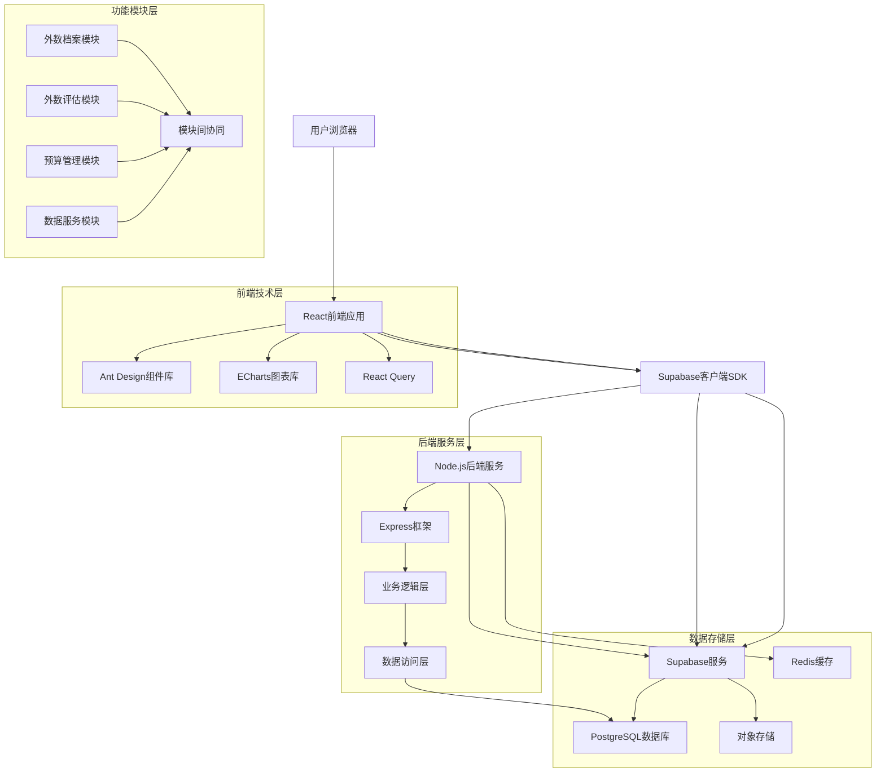
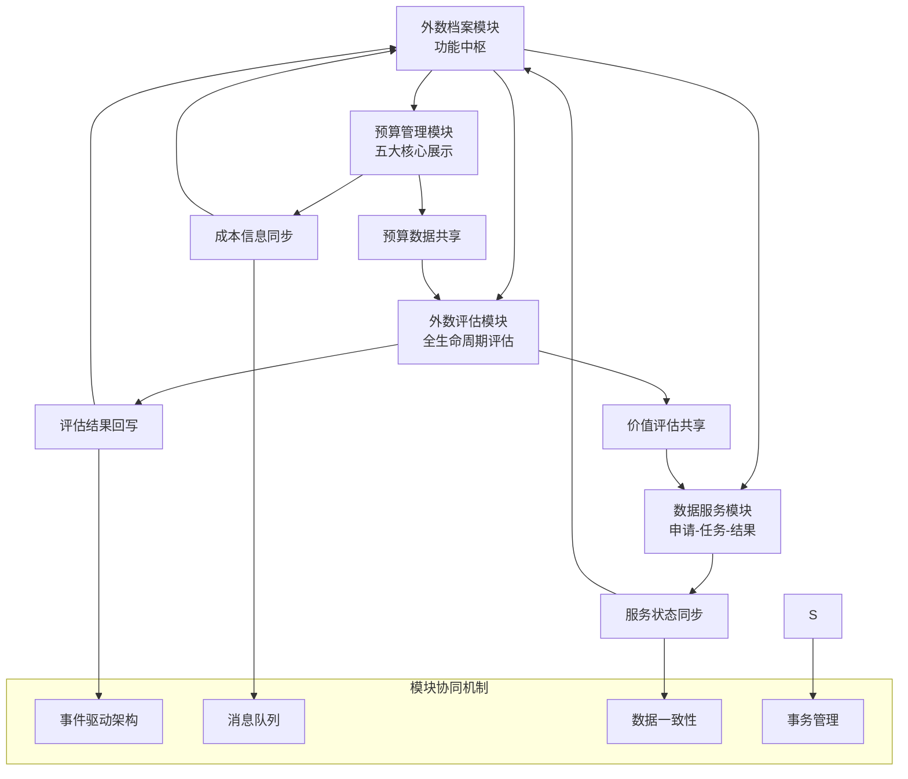
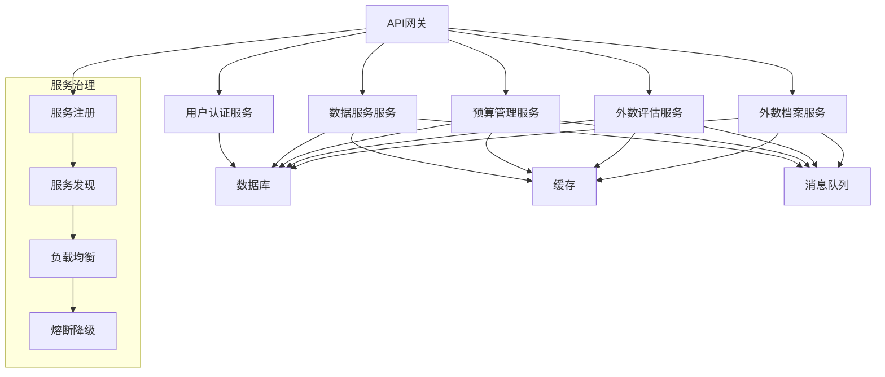
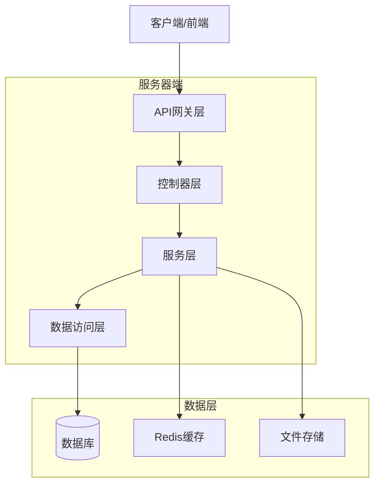
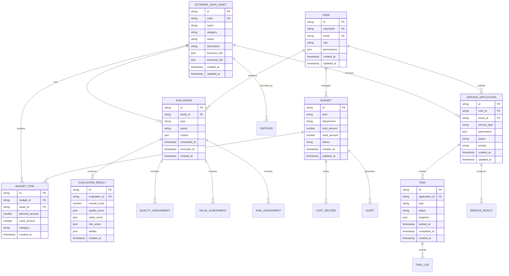

# 外数生命周期管理模块技术架构文档

## 1. 架构设计

### 1.1 整体架构图


### 1.2 模块间协同架构


### 1.3 微服务架构设计


## 2. 技术描述

### 2.1 核心技术栈
- **前端框架**：React 18 + TypeScript 5.0+
- **UI组件库**：Ant Design 5.x
- **状态管理**：React Query + Zustand
- **图表库**：ECharts 5.4+
- **路由管理**：React Router 6.x
- **构建工具**：Vite 5.0+
- **代码规范**：ESLint + Prettier + Husky
- **初始化工具**：vite-init

### 2.2 后端技术栈
- **运行环境**：Node.js 18+
- **Web框架**：Express 4.x + TypeScript
- **数据库**：Supabase (PostgreSQL)
- **缓存**：Redis 7.x
- **消息队列**：Bull Queue + Redis
- **文件存储**：Supabase Storage
- **API文档**：Swagger/OpenAPI 3.0

### 2.3 架构特点
- **前后端分离**：清晰的职责划分和接口契约
- **微服务架构**：模块化部署和独立扩展
- **事件驱动**：异步消息处理和解耦设计
- **数据一致性**：分布式事务和最终一致性
- **高可用性**：服务熔断、降级和容错机制
- **安全性**：认证授权、数据加密、审计日志

## 3. 路由定义

### 3.1 外数档案模块路由
| 路由 | 页面名称 | 功能描述 |
|------|----------|----------|
| `/external-data/dictionary` | 档案总览页 | 外数资产全局视图、快速搜索 |
| `/external-data/dictionary/:id` | 档案详情页 | 信息展示中枢、跨模块数据聚合 |
| `/external-data/suppliers` | 供应商管理页 | 供应商信息管理、评估、关系维护 |
| `/external-data/instructions` | 使用说明页 | 使用指南、API示例、最佳实践 |
| `/external-data/changes` | 变更管理页 | 生命周期变更申请、审批、跟踪 |

### 3.2 外数评估模块路由
| 路由 | 页面名称 | 功能描述 |
|------|----------|----------|
| `/external-data/evaluation` | 评估总览页 | 评估任务总览、状态监控 |
| `/external-data/evaluation/introduction` | 引入评估页 | 引入前评估、报告生成 |
| `/external-data/evaluation/monitoring` | 监控评估页 | 运营期监控、指标跟踪 |
| `/external-data/evaluation/continuous` | 持续评估页 | 定期评估、自动触发 |
| `/external-data/evaluation/reports` | 评估报告页 | 报告查看、对比分析 |

### 3.3 预算管理模块路由
| 路由 | 页面名称 | 功能描述 |
|------|----------|----------|
| `/external-data/budget` | 预算总览页 | 年度/滚动预算展示、执行监控 |
| `/external-data/budget/planning` | 预算制定页 | 预算规划、科目设置、审批流程 |
| `/external-data/budget/monitoring` | 预算监控页 | 实时成本监控、执行分析 |
| `/external-data/budget/contracts` | 合同管理页 | 合同信息展示、执行跟踪 |
| `/external-data/budget/settlements` | 结算管理页 | 结算信息展示、差异分析 |

### 3.4 数据服务模块路由
| 路由 | 页面名称 | 功能描述 |
|------|----------|----------|
| `/external-data/services` | 服务申请页 | 统一申请入口、服务类型选择 |
| `/external-data/services/tasks` | 任务查询页 | 任务列表、状态跟踪、异常处理 |
| `/external-data/services/results` | 结果展示页 | 结果列表、详情查看、分析功能 |
| `/external-data/services/config` | 服务配置页 | 服务参数配置、流程定义 |

### 3.5 系统管理路由
| 路由 | 页面名称 | 功能描述 |
|------|----------|----------|
| `/system/users` | 用户管理页 | 用户角色管理、权限配置 |
| `/system/config` | 系统配置页 | 系统参数配置、流程定义 |
| `/system/logs` | 日志审计页 | 操作日志、异常日志 |
| `/system/reports` | 报表中心页 | 综合报表、统计分析 |

## 4. API定义

### 4.1 外数档案模块API

#### 4.1.1 档案管理接口
```
GET /api/v1/external-data/assets
```
**功能**：获取外数资产列表
**请求参数**：
| 参数名 | 类型 | 必填 | 描述 |
|--------|------|------|------|
| page | number | 否 | 页码，默认1 |
| pageSize | number | 否 | 每页条数，默认20 |
| category | string | 否 | 数据分类 |
| status | string | 否 | 数据状态 |
| keyword | string | 否 | 搜索关键词 |

**响应数据**：
```json
{
  "code": 200,
  "message": "success",
  "data": {
    "total": 100,
    "list": [
      {
        "id": "asset_001",
        "name": "征信数据",
        "code": "CREDIT_DATA",
        "category": "金融征信",
        "status": "active",
        "supplier": "央行征信中心",
        "evaluationScore": 85,
        "lastUpdated": "2024-01-15"
      }
    ]
  }
}
```

```
GET /api/v1/external-data/assets/{id}
```
**功能**：获取外数资产详情
**响应数据**：
```json
{
  "code": 200,
  "message": "success",
  "data": {
    "basicInfo": {
      "id": "asset_001",
      "name": "征信数据",
      "description": "个人征信报告数据",
      "category": "金融征信",
      "status": "active"
    },
    "businessInfo": {
      "businessImpact": "高",
      "alternativeSolutions": ["方案A", "方案B"],
      "businessRisks": ["数据延迟风险", "合规风险"]
    },
    "supplierInfo": {
      "supplierId": "supplier_001",
      "supplierName": "央行征信中心",
      "contactInfo": {
        "name": "张三",
        "phone": "13800138000",
        "email": "zhangsan@example.com"
      },
      "cooperationHistory": "合作3年，服务质量良好",
      "creditRating": "AAA"
    },
    "evaluationIndex": {
      "latestScore": 85,
      "historicalTrends": [
        {"date": "2024-01", "score": 85},
        {"date": "2023-12", "score": 82}
      ],
      "comparativeAnalysis": {
        "industryAverage": 80,
        "ranking": "前20%"
      }
    },
    "technicalInfo": {
      "interfaceType": "API",
      "updateFrequency": "日更新",
      "dataFormat": "JSON",
      "technicalStatus": "正常"
    }
  }
}
```

#### 4.1.2 供应商管理接口
```
GET /api/v1/external-data/suppliers
```
**功能**：获取供应商列表
```
POST /api/v1/external-data/suppliers
```
**功能**：创建供应商
```
PUT /api/v1/external-data/suppliers/{id}
```
**功能**：更新供应商信息
```
GET /api/v1/external-data/suppliers/{id}/evaluation
```
**功能**：获取供应商评估信息

### 4.2 外数评估模块API

#### 4.2.1 评估任务管理接口
```
GET /api/v1/external-data/evaluations
```
**功能**：获取评估任务列表
```
POST /api/v1/external-data/evaluations
```
**功能**：创建评估任务
**请求数据**：
```json
{
  "assetId": "asset_001",
  "evaluationType": "introduction",
  "evaluationPeriod": "2024-Q1",
  "evaluationCriteria": {
    "qualityWeight": 0.4,
    "valueWeight": 0.3,
    "riskWeight": 0.3
  }
}
```

```
GET /api/v1/external-data/evaluations/{id}
```
**功能**：获取评估任务详情
```
POST /api/v1/external-data/evaluations/{id}/execute
```
**功能**：执行评估任务
```
GET /api/v1/external-data/evaluations/{id}/report
```
**功能**：获取评估报告

#### 4.2.2 引入评估接口
```
POST /api/v1/external-data/evaluations/introduction
```
**功能**：创建引入评估
```
GET /api/v1/external-data/evaluations/introduction/{id}/samples
```
**功能**：获取试数据样本
```
POST /api/v1/external-data/evaluations/introduction/{id}/analysis
```
**功能**：提交试数据分析

#### 4.2.3 监控评估接口
```
GET /api/v1/external-data/evaluations/monitoring/{assetId}/indicators
```
**功能**：获取监控指标数据
```
GET /api/v1/external-data/evaluations/monitoring/{assetId}/cost
```
**功能**：获取成本指标数据
```
GET /api/v1/external-data/evaluations/monitoring/{assetId}/performance
```
**功能**：获取性能指标数据

### 4.3 预算管理模块API

#### 4.3.1 预算管理接口
```
GET /api/v1/external-data/budgets
```
**功能**：获取预算列表
```
POST /api/v1/external-data/budgets
```
**功能**：创建预算
```
GET /api/v1/external-data/budgets/{id}
```
**功能**：获取预算详情
```
PUT /api/v1/external-data/budgets/{id}
```
**功能**：更新预算

#### 4.3.2 成本监控接口
```
GET /api/v1/external-data/budgets/{id}/costs
```
**功能**：获取成本数据
```
GET /api/v1/external-data/budgets/{id}/alerts
```
**功能**：获取预警信息
```
POST /api/v1/external-data/budgets/{id}/alerts
```
**功能**：创建预警规则

#### 4.3.3 合同管理接口
```
GET /api/v1/external-data/contracts
```
**功能**：获取合同列表
```
GET /api/v1/external-data/contracts/{id}
```
**功能**：获取合同详情
```
GET /api/v1/external-data/contracts/{id}/progress
```
**功能**：获取合同执行进度

### 4.4 数据服务模块API

#### 4.4.1 服务申请接口
```
GET /api/v1/external-data/services/applications
```
**功能**：获取服务申请列表
```
POST /api/v1/external-data/services/applications
```
**功能**：提交服务申请
**请求数据**：
```json
{
  "serviceType": "online_data_query",
  "assetId": "asset_001",
  "parameters": {
    "queryType": "realtime",
    "dataRange": "2024-01-01_2024-01-31",
    "queryFields": ["field1", "field2"]
  },
  "priority": "normal",
  "description": "征信数据实时查询"
}
```

#### 4.4.2 任务管理接口
```
GET /api/v1/external-data/services/tasks
```
**功能**：获取任务列表
```
GET /api/v1/external-data/services/tasks/{id}
```
**功能**：获取任务详情
```
POST /api/v1/external-data/services/tasks/{id}/cancel
```
**功能**：取消任务

#### 4.4.3 结果管理接口
```
GET /api/v1/external-data/services/results
```
**功能**：获取结果列表
```
GET /api/v1/external-data/services/results/{id}
```
**功能**：获取结果详情
```
GET /api/v1/external-data/services/results/{id}/download
```
**功能**：下载结果文件

### 4.5 模块协同API

#### 4.5.1 档案-评估协同接口
```
POST /api/v1/external-data/assets/{assetId}/trigger-evaluation
```
**功能**：档案变更触发评估
```
POST /api/v1/external-data/evaluations/{evaluationId}/writeback-asset
```
**功能**：评估结果回写档案

#### 4.5.2 档案-预算协同接口
```
POST /api/v1/external-data/assets/{assetId}/sync-budget-info
```
**功能**：同步预算信息到档案
```
POST /api/v1/external-data/budgets/{budgetId}/alert-asset
```
**功能**：预算预警触发档案更新

#### 4.5.3 档案-服务协同接口
```
POST /api/v1/external-data/assets/{assetId}/sync-service-status
```
**功能**：同步服务状态到档案
```
POST /api/v1/external-data/services/applications/{applicationId}/record-usage
```
**功能**：记录服务使用到档案

## 5. 服务器架构设计

### 5.1 服务分层架构


### 5.2 核心服务组件

#### 5.2.1 控制器层（Controller Layer）
```typescript
// 外数档案控制器
interface AssetController {
  getAssets(req: Request, res: Response): Promise<void>
  getAssetById(req: Request, res: Response): Promise<void>
  createAsset(req: Request, res: Response): Promise<void>
  updateAsset(req: Request, res: Response): Promise<void>
  deleteAsset(req: Request, res: Response): Promise<void>
}

// 外数评估控制器
interface EvaluationController {
  getEvaluations(req: Request, res: Response): Promise<void>
  createEvaluation(req: Request, res: Response): Promise<void>
  executeEvaluation(req: Request, res: Response): Promise<void>
  getEvaluationReport(req: Request, res: Response): Promise<void>
}

// 预算管理控制器
interface BudgetController {
  getBudgets(req: Request, res: Response): Promise<void>
  createBudget(req: Request, res: Response): Promise<void>
  getCostData(req: Request, res: Response): Promise<void>
  createAlert(req: Request, res: Response): Promise<void>
}

// 数据服务控制器
interface ServiceController {
  getApplications(req: Request, res: Response): Promise<void>
  createApplication(req: Request, res: Response): Promise<void>
  getTasks(req: Request, res: Response): Promise<void>
  getResults(req: Request, res: Response): Promise<void>
}
```

#### 5.2.2 服务层（Service Layer）
```typescript
// 外数档案服务
interface AssetService {
  getAssets(filters: AssetFilters): Promise<PaginatedResult<Asset>>
  getAssetById(id: string): Promise<Asset>
  createAsset(asset: CreateAssetDto): Promise<Asset>
  updateAsset(id: string, asset: UpdateAssetDto): Promise<Asset>
  deleteAsset(id: string): Promise<void>
}

// 外数评估服务
interface EvaluationService {
  createEvaluation(evaluation: CreateEvaluationDto): Promise<Evaluation>
  executeEvaluation(id: string): Promise<EvaluationResult>
  getEvaluationReport(id: string): Promise<EvaluationReport>
  calculateQualityScore(data: QualityData): Promise<number>
  calculateValueScore(data: ValueData): Promise<number>
  calculateRiskScore(data: RiskData): Promise<number>
}

// 预算管理服务
interface BudgetService {
  getBudgets(filters: BudgetFilters): Promise<PaginatedResult<Budget>>
  createBudget(budget: CreateBudgetDto): Promise<Budget>
  getCostData(budgetId: string, period: TimePeriod): Promise<CostData>
  createAlert(alert: CreateAlertDto): Promise<Alert>
  calculateBudgetExecution(budgetId: string): Promise<BudgetExecution>
}

// 数据服务服务
interface DataService {
  createApplication(application: CreateApplicationDto): Promise<Application>
  executeApplication(id: string): Promise<Task>
  getTaskStatus(taskId: string): Promise<TaskStatus>
  getTaskResults(taskId: string): Promise<TaskResult>
  validateServiceParameters(params: ServiceParams): Promise<ValidationResult>
}
```

#### 5.2.3 数据访问层（Repository Layer）
```typescript
// Supabase数据访问接口
interface SupabaseRepository<T> {
  findAll(filters: Record<string, any>): Promise<T[]>
  findById(id: string): Promise<T | null>
  create(data: Partial<T>): Promise<T>
  update(id: string, data: Partial<T>): Promise<T>
  delete(id: string): Promise<void>
  findWithPagination(page: number, pageSize: number, filters: Record<string, any>): Promise<PaginatedResult<T>>
}

// 具体Repository实现
interface AssetRepository extends SupabaseRepository<Asset> {
  findByCategory(category: string): Promise<Asset[]>
  findBySupplier(supplierId: string): Promise<Asset[]>
  findByStatus(status: AssetStatus): Promise<Asset[]>
  updateEvaluationScore(id: string, score: number): Promise<Asset>
}

interface EvaluationRepository extends SupabaseRepository<Evaluation> {
  findByAssetId(assetId: string): Promise<Evaluation[]>
  findByPeriod(period: string): Promise<Evaluation[]>
  findByStatus(status: EvaluationStatus): Promise<Evaluation[]>
  updateResult(id: string, result: EvaluationResult): Promise<Evaluation>
}

interface BudgetRepository extends SupabaseRepository<Budget> {
  findByYear(year: number): Promise<Budget[]>
  findByDepartment(department: string): Promise<Budget[]>
  getCostData(budgetId: string, startDate: Date, endDate: Date): Promise<CostData[]>
  updateExecution(budgetId: string, execution: BudgetExecution): Promise<Budget>
}
```

## 6. 数据模型设计

### 6.1 核心数据模型


### 6.2 数据库表结构定义

#### 6.2.1 外数资产表
```sql
-- 外数资产主表
CREATE TABLE external_data_assets (
    id UUID PRIMARY KEY DEFAULT gen_random_uuid(),
    code VARCHAR(50) UNIQUE NOT NULL,
    name VARCHAR(200) NOT NULL,
    category VARCHAR(100) NOT NULL,
    status VARCHAR(50) NOT NULL DEFAULT 'draft',
    description TEXT,
    business_info JSONB DEFAULT '{}',
    technical_info JSONB DEFAULT '{}',
    supplier_id UUID REFERENCES suppliers(id),
    evaluation_score DECIMAL(5,2),
    created_at TIMESTAMP WITH TIME ZONE DEFAULT NOW(),
    updated_at TIMESTAMP WITH TIME ZONE DEFAULT NOW(),
    created_by UUID REFERENCES users(id),
    updated_by UUID REFERENCES users(id)
);

-- 索引
CREATE INDEX idx_assets_code ON external_data_assets(code);
CREATE INDEX idx_assets_category ON external_data_assets(category);
CREATE INDEX idx_assets_status ON external_data_assets(status);
CREATE INDEX idx_assets_supplier ON external_data_assets(supplier_id);
CREATE INDEX idx_assets_created_at ON external_data_assets(created_at DESC);

-- RLS策略
ALTER TABLE external_data_assets ENABLE ROW LEVEL SECURITY;

-- 基础权限
GRANT SELECT ON external_data_assets TO anon;
GRANT ALL ON external_data_assets TO authenticated;

-- 业务规则
CREATE POLICY "任何人可查看已发布资产" ON external_data_assets
    FOR SELECT USING (status = 'active');

CREATE POLICY "认证用户可管理自己的资产" ON external_data_assets
    FOR ALL USING (auth.uid() = created_by);
```

#### 6.2.2 评估表
```sql
-- 评估任务表
CREATE TABLE evaluations (
    id UUID PRIMARY KEY DEFAULT gen_random_uuid(),
    asset_id UUID NOT NULL REFERENCES external_data_assets(id),
    type VARCHAR(50) NOT NULL,
    status VARCHAR(50) NOT NULL DEFAULT 'pending',
    criteria JSONB DEFAULT '{}',
    scheduled_at TIMESTAMP WITH TIME ZONE,
    executed_at TIMESTAMP WITH TIME ZONE,
    created_by UUID REFERENCES users(id),
    created_at TIMESTAMP WITH TIME ZONE DEFAULT NOW(),
    updated_at TIMESTAMP WITH TIME ZONE DEFAULT NOW()
);

-- 评估结果表
CREATE TABLE evaluation_results (
    id UUID PRIMARY KEY DEFAULT gen_random_uuid(),
    evaluation_id UUID NOT NULL REFERENCES evaluations(id),
    overall_score DECIMAL(5,2),
    quality_score JSONB DEFAULT '{}',
    value_score JSONB DEFAULT '{}',
    risk_score JSONB DEFAULT '{}',
    details JSONB DEFAULT '{}',
    created_at TIMESTAMP WITH TIME ZONE DEFAULT NOW()
);

-- 索引
CREATE INDEX idx_evaluations_asset ON evaluations(asset_id);
CREATE INDEX idx_evaluations_type ON evaluations(type);
CREATE INDEX idx_evaluations_status ON evaluations(status);
CREATE INDEX idx_evaluation_results_evaluation ON evaluation_results(evaluation_id);

-- RLS策略
ALTER TABLE evaluations ENABLE ROW LEVEL SECURITY;
ALTER TABLE evaluation_results ENABLE ROW LEVEL SECURITY;

GRANT SELECT ON evaluations TO anon;
GRANT ALL ON evaluations TO authenticated;
GRANT SELECT ON evaluation_results TO anon;
GRANT ALL ON evaluation_results TO authenticated;
```

#### 6.2.3 预算表
```sql
-- 预算主表
CREATE TABLE budgets (
    id UUID PRIMARY KEY DEFAULT gen_random_uuid(),
    year VARCHAR(4) NOT NULL,
    department VARCHAR(100) NOT NULL,
    total_amount DECIMAL(15,2) NOT NULL,
    used_amount DECIMAL(15,2) DEFAULT 0,
    status VARCHAR(50) NOT NULL DEFAULT 'draft',
    created_by UUID REFERENCES users(id),
    created_at TIMESTAMP WITH TIME ZONE DEFAULT NOW(),
    updated_at TIMESTAMP WITH TIME ZONE DEFAULT NOW()
);

-- 预算明细表
CREATE TABLE budget_items (
    id UUID PRIMARY KEY DEFAULT gen_random_uuid(),
    budget_id UUID NOT NULL REFERENCES budgets(id),
    asset_id UUID REFERENCES external_data_assets(id),
    planned_amount DECIMAL(15,2) NOT NULL,
    used_amount DECIMAL(15,2) DEFAULT 0,
    category VARCHAR(100) NOT NULL,
    description TEXT,
    created_at TIMESTAMP WITH TIME ZONE DEFAULT NOW()
);

-- 成本记录表
CREATE TABLE cost_records (
    id UUID PRIMARY KEY DEFAULT gen_random_uuid(),
    budget_id UUID NOT NULL REFERENCES budgets(id),
    asset_id UUID REFERENCES external_data_assets(id),
    amount DECIMAL(15,2) NOT NULL,
    cost_type VARCHAR(50) NOT NULL,
    description TEXT,
    occurred_at TIMESTAMP WITH TIME ZONE NOT NULL,
    created_at TIMESTAMP WITH TIME ZONE DEFAULT NOW()
);

-- 索引
CREATE INDEX idx_budgets_year ON budgets(year);
CREATE INDEX idx_budgets_department ON budgets(department);
CREATE INDEX idx_budget_items_budget ON budget_items(budget_id);
CREATE INDEX idx_budget_items_asset ON budget_items(asset_id);
CREATE INDEX idx_cost_records_budget ON cost_records(budget_id);
CREATE INDEX idx_cost_records_occurred ON cost_records(occurred_at);

-- RLS策略
ALTER TABLE budgets ENABLE ROW LEVEL SECURITY;
ALTER TABLE budget_items ENABLE ROW LEVEL SECURITY;
ALTER TABLE cost_records ENABLE ROW LEVEL SECURITY;

GRANT SELECT ON budgets TO anon;
GRANT ALL ON budgets TO authenticated;
GRANT SELECT ON budget_items TO anon;
GRANT ALL ON budget_items TO authenticated;
GRANT SELECT ON cost_records TO anon;
GRANT ALL ON cost_records TO authenticated;
```

#### 6.2.4 服务申请表
```sql
-- 服务申请表
CREATE TABLE service_applications (
    id UUID PRIMARY KEY DEFAULT gen_random_uuid(),
    user_id UUID NOT NULL REFERENCES users(id),
    asset_id UUID NOT NULL REFERENCES external_data_assets(id),
    service_type VARCHAR(50) NOT NULL,
    parameters JSONB DEFAULT '{}',
    status VARCHAR(50) NOT NULL DEFAULT 'pending',
    priority VARCHAR(20) NOT NULL DEFAULT 'normal',
    description TEXT,
    created_at TIMESTAMP WITH TIME ZONE DEFAULT NOW(),
    updated_at TIMESTAMP WITH TIME ZONE DEFAULT NOW()
);

-- 任务表
CREATE TABLE tasks (
    id UUID PRIMARY KEY DEFAULT gen_random_uuid(),
    application_id UUID NOT NULL REFERENCES service_applications(id),
    type VARCHAR(50) NOT NULL,
    status VARCHAR(50) NOT NULL DEFAULT 'pending',
    progress JSONB DEFAULT '{}',
    started_at TIMESTAMP WITH TIME ZONE,
    completed_at TIMESTAMP WITH TIME ZONE,
    created_at TIMESTAMP WITH TIME ZONE DEFAULT NOW(),
    updated_at TIMESTAMP WITH TIME ZONE DEFAULT NOW()
);

-- 任务日志表
CREATE TABLE task_logs (
    id UUID PRIMARY KEY DEFAULT gen_random_uuid(),
    task_id UUID NOT NULL REFERENCES tasks(id),
    level VARCHAR(20) NOT NULL,
    message TEXT NOT NULL,
    details JSONB DEFAULT '{}',
    created_at TIMESTAMP WITH TIME ZONE DEFAULT NOW()
);

-- 服务结果表
CREATE TABLE service_results (
    id UUID PRIMARY KEY DEFAULT gen_random_uuid(),
    application_id UUID NOT NULL REFERENCES service_applications(id),
    task_id UUID REFERENCES tasks(id),
    result_type VARCHAR(50) NOT NULL,
    data JSONB DEFAULT '{}',
    file_urls TEXT[],
    status VARCHAR(50) NOT NULL,
    created_at TIMESTAMP WITH TIME ZONE DEFAULT NOW()
);

-- 索引
CREATE INDEX idx_applications_user ON service_applications(user_id);
CREATE INDEX idx_applications_asset ON service_applications(asset_id);
CREATE INDEX idx_applications_type ON service_applications(service_type);
CREATE INDEX idx_applications_status ON service_applications(status);
CREATE INDEX idx_tasks_application ON tasks(application_id);
CREATE INDEX idx_tasks_status ON tasks(status);
CREATE INDEX idx_task_logs_task ON task_logs(task_id);
CREATE INDEX idx_service_results_application ON service_results(application_id);

-- RLS策略
ALTER TABLE service_applications ENABLE ROW LEVEL SECURITY;
ALTER TABLE tasks ENABLE ROW LEVEL SECURITY;
ALTER TABLE task_logs ENABLE ROW LEVEL SECURITY;
ALTER TABLE service_results ENABLE ROW LEVEL SECURITY;

GRANT SELECT ON service_applications TO anon;
GRANT ALL ON service_applications TO authenticated;
GRANT SELECT ON tasks TO anon;
GRANT ALL ON tasks TO authenticated;
GRANT SELECT ON task_logs TO anon;
GRANT ALL ON task_logs TO authenticated;
GRANT SELECT ON service_results TO anon;
GRANT ALL ON service_results TO authenticated;
```

### 6.3 初始化数据

#### 6.3.1 基础数据初始化
```sql
-- 插入测试用户
INSERT INTO users (id, username, email, role, permissions) VALUES
('00000000-0000-0000-0000-000000000001', 'admin', 'admin@example.com', 'admin', '{"all": true}'),
('00000000-0000-0000-0000-000000000002', 'user1', 'user1@example.com', 'user', '{"read": true, "write": true}');

-- 插入测试供应商
INSERT INTO suppliers (id, name, contact_info, credit_rating, status) VALUES
('10000000-0000-0000-0000-000000000001', '央行征信中心', '{"name": "张三", "phone": "010-12345678", "email": "contact@pbccrc.org.cn"}', 'AAA', 'active'),
('10000000-0000-0000-0000-000000000002', '百行征信', '{"name": "李四", "phone": "010-87654321", "email": "contact@baihangcredit.com"}', 'AA', 'active');

-- 插入测试外数资产
INSERT INTO external_data_assets (id, code, name, category, status, description, supplier_id, evaluation_score, created_by) VALUES
('20000000-0000-0000-0000-000000000001', 'CREDIT_001', '个人征信报告', '金融征信', 'active', '央行个人信用报告数据', '10000000-0000-0000-0000-000000000001', 85.5, '00000000-0000-0000-0000-000000000001'),
('20000000-0000-0000-0000-000000000002', 'TELCO_001', '运营商信用分', '运营商数据', 'active', '基于运营商行为的信用评分', '10000000-0000-0000-0000-000000000002', 78.2, '00000000-0000-0000-0000-000000000001');

-- 插入测试预算
INSERT INTO budgets (id, year, department, total_amount, used_amount, status, created_by) VALUES
('30000000-0000-0000-0000-000000000001', '2024', '风控部', 1000000.00, 350000.00, 'active', '00000000-0000-0000-0000-000000000001'),
('30000000-0000-0000-0000-000000000002', '2024', '业务部', 800000.00, 200000.00, 'active', '00000000-0000-0000-0000-000000000001');
```

#### 6.3.2 权限配置初始化
```sql
-- 创建角色权限配置
CREATE TABLE role_permissions (
    id UUID PRIMARY KEY DEFAULT gen_random_uuid(),
    role VARCHAR(50) NOT NULL UNIQUE,
    permissions JSONB NOT NULL DEFAULT '{}',
    created_at TIMESTAMP WITH TIME ZONE DEFAULT NOW()
);

-- 插入角色权限
INSERT INTO role_permissions (role, permissions) VALUES
('admin', '{
  "external_data": {"read": true, "write": true, "delete": true},
  "evaluation": {"read": true, "write": true, "delete": true},
  "budget": {"read": true, "write": true, "delete": true},
  "service": {"read": true, "write": true, "delete": true},
  "system": {"read": true, "write": true, "delete": true}
}'),
('manager', '{
  "external_data": {"read": true, "write": true, "delete": false},
  "evaluation": {"read": true, "write": true, "delete": false},
  "budget": {"read": true, "write": true, "delete": false},
  "service": {"read": true, "write": true, "delete": false},
  "system": {"read": true, "write": false, "delete": false}
}'),
('analyst', '{
  "external_data": {"read": true, "write": false, "delete": false},
  "evaluation": {"read": true, "write": true, "delete": false},
  "budget": {"read": true, "write": false, "delete": false},
  "service": {"read": true, "write": false, "delete": false},
  "system": {"read": false, "write": false, "delete": false}
}'),
('user', '{
  "external_data": {"read": true, "write": false, "delete": false},
  "evaluation": {"read": true, "write": false, "delete": false},
  "budget": {"read": false, "write": false, "delete": false},
  "service": {"read": true, "write": true, "delete": false},
  "system": {"read": false, "write": false, "delete": false}
}');
```

## 4. 组件架构设计

### 4.1 外数档案模块组件
```typescript
// 核心组件结构
interface DictionaryComponents {
  // 档案总览组件
  DictionaryOverview: VueComponent;      // 档案总览页面
  AssetList: VueComponent;              // 资产列表组件
  AssetSearch: VueComponent;              // 搜索筛选组件
  AssetCategoryTree: VueComponent;        // 分类树组件
  
  // 档案详情组件
  DictionaryDetail: VueComponent;        // 档案详情页面
  AssetInfoCard: VueComponent;          // 资产信息卡片
  SupplierInfoCard: VueComponent;       // 供应商信息卡片
  EvaluationIndexCard: VueComponent;     // 评估索引卡片
  TechnicalInfoCard: VueComponent;       // 技术信息卡片
  
  // 供应商管理组件
  SupplierManagement: VueComponent;     // 供应商管理页面
  SupplierList: VueComponent;             // 供应商列表
  SupplierDetail: VueComponent;          // 供应商详情
  SupplierEvaluation: VueComponent;      // 供应商评估
  
  // 变更管理组件
  ChangeManagement: VueComponent;         // 变更管理页面
  ChangeApplication: VueComponent;       // 变更申请
  ChangeApproval: VueComponent;          // 变更审批
  ChangeTracking: VueComponent;          // 变更跟踪
}
```

### 4.2 外数评估模块组件
```typescript
interface EvaluationComponents {
  // 评估总览组件
  EvaluationOverview: VueComponent;     // 评估总览页面
  EvaluationTaskList: VueComponent;      // 评估任务列表
  EvaluationDashboard: VueComponent;      // 评估仪表盘
  
  // 引入评估组件
  IntroductionEvaluation: VueComponent; // 引入评估页面
  EvaluationReport: VueComponent;        // 评估报告组件
  CostBenefitAnalysis: VueComponent;     // 成本效益分析
  RiskAssessment: VueComponent;           // 风险评估
  
  // 监控评估组件
  MonitoringEvaluation: VueComponent;    // 监控评估页面
  CostIndicatorChart: VueComponent;      // 成本指标图表
  CallIndicatorChart: VueComponent;      // 调用指标图表
  PerformanceChart: VueComponent;         // 性能指标图表
  
  // 质量评估组件
  QualityAssessment: VueComponent;        // 质量评估页面
  CompletenessAnalysis: VueComponent;      // 完整性分析
  AccuracyAnalysis: VueComponent;         // 准确性分析
  TimelinessAnalysis: VueComponent;        // 及时性分析
  ConsistencyAnalysis: VueComponent;      // 一致性分析
}
```

### 4.3 预算管理模块组件
```typescript
interface BudgetComponents {
  // 预算总览组件
  BudgetOverview: VueComponent;           // 预算总览页面
  AnnualBudgetCard: VueComponent;          // 年度预算卡片
  ExecutionTrendChart: VueComponent;      // 执行趋势图表
  DepartmentDistribution: VueComponent;    // 部门分布图表
  
  // 成本监控组件
  CostMonitoring: VueComponent;           // 成本监控页面
  RealtimeCostChart: VueComponent;         // 实时成本图表
  CostTrendAnalysis: VueComponent;         // 成本趋势分析
  CostAnomalyDetection: VueComponent;      // 成本异常检测
  
  // 合同管理组件
  ContractManagement: VueComponent;        // 合同管理页面
  ContractList: VueComponent;               // 合同列表
  ContractDetail: VueComponent;             // 合同详情
  ContractExpiryAlert: VueComponent;        // 合同到期预警
  
  // 结算管理组件
  SettlementManagement: VueComponent;       // 结算管理页面
  SettlementList: VueComponent;              // 结算列表
  VarianceAnalysis: VueComponent;           // 差异分析
  SettlementEfficiency: VueComponent;        // 结算效率
}
```

### 4.4 数据服务模块组件
```typescript
interface ServiceComponents {
  // 服务申请组件
  ServiceApplication: VueComponent;       // 服务申请页面
  ApplicationForm: VueComponent;            // 申请表单
  ServiceTypeSelector: VueComponent;       // 服务类型选择器
  ParameterConfig: VueComponent;            // 参数配置
  
  // 任务查询组件
  TaskQuery: VueComponent;                  // 任务查询页面
  TaskList: VueComponent;                   // 任务列表
  TaskStatusTracking: VueComponent;          // 任务状态跟踪
  TaskDetailModal: VueComponent;             // 任务详情弹窗
  ExceptionHandling: VueComponent;          // 异常处理
  
  // 结果展示组件
  ResultDisplay: VueComponent;              // 结果展示页面
  ResultList: VueComponent;                   // 结果列表
  ResultDetail: VueComponent;                 // 结果详情
  DataVisualization: VueComponent;            // 数据可视化
  ResultAnalysis: VueComponent;               // 结果分析
}
```

## 5. 数据模型设计

### 5.1 外数档案数据模型
```typescript
// 外部数据资产模型
interface ExternalDataAsset {
  id: string;                           // 资产ID
  name: string;                          // 资产名称
  category: string;                      // 分类
  description: string;                   // 描述
  supplierId: string;                    // 供应商ID
  businessInfo: BusinessInfo;            // 业务信息
  technicalInfo: TechnicalInfo;           // 技术信息
  evaluationIndex: EvaluationIndex;       // 评估索引
  lifecycleStatus: LifecycleStatus;        // 生命周期状态
  createdAt: Date;                       // 创建时间
  updatedAt: Date;                        // 更新时间
}

// 业务信息模型
interface BusinessInfo {
  businessValue: BusinessValue;          // 业务价值
  usageScenarios: UsageScenario[];       // 使用场景
  impactAssessment: ImpactAssessment;    // 影响评估
  riskIdentification: Risk[];           // 风险识别
  approvalHistory: ApprovalRecord[];     // 审批历史
}

// 供应商信息模型
interface SupplierInfo {
  id: string;                            // 供应商ID
  name: string;                           // 供应商名称
  companyInfo: CompanyInfo;              // 公司信息
  contacts: Contact[];                    // 联系人
  cooperationHistory: Cooperation[];     // 合作历史
  creditRating: CreditRating;            // 信用评级
  serviceCapability: ServiceCapability;  // 服务能力
}
```

### 5.2 外数评估数据模型
```typescript
// 评估任务模型
interface EvaluationTask {
  id: string;                            // 任务ID
  assetId: string;                        // 资产ID
  evaluationType: EvaluationType;         // 评估类型
  status: TaskStatus;                     // 任务状态
  parameters: EvaluationParameter[];      // 评估参数
  results: EvaluationResult;               // 评估结果
  createdBy: string;                       // 创建人
  createdAt: Date;                         // 创建时间
  completedAt?: Date;                      // 完成时间
}

// 引入评估模型
interface IntroductionEvaluation {
  taskId: string;                        // 任务ID
  trialData: TrialData;                   // 试数据
  costBenefitAnalysis: CostBenefit;       // 成本效益分析
  riskAssessment: RiskAssessment;         // 风险评估
  supplierComparison: SupplierCompare[]; // 供应商对比
  recommendation: string;                  // 引入建议
  decisionSupport: DecisionSupport;        // 决策支持
}

// 监控评估模型
interface MonitoringEvaluation {
  taskId: string;                        // 任务ID
  costIndicators: CostIndicator[];          // 成本指标
  callIndicators: CallIndicator[];        // 调用指标
  performanceIndicators: Performance[];  // 性能指标
  stabilityIndicators: Stability[];      // 稳定性指标
  alertRecords: AlertRecord[];             // 预警记录
}
```

### 5.3 预算管理数据模型
```typescript
// 年度预算模型
interface AnnualBudget {
  id: string;                            // 预算ID
  budgetYear: number;                     // 预算年度
  totalBudget: number;                     // 总预算
  executedAmount: number;                  // 已执行金额
  remainingBudget: number;                // 剩余预算
  executionRate: number;                   // 执行率
  departmentBudgets: DepartmentBudget[];  // 部门预算
  subjectBudgets: SubjectBudget[];        // 科目预算
  executionTrend: ExecutionTrend[];       // 执行趋势
}

// 成本监控模型
interface CostMonitoring {
  id: string;                            // 监控ID
  assetId: string;                        // 资产ID
  realtimeCost: RealtimeCost;             // 实时成本
  costTrends: CostTrend[];                // 成本趋势
  costStructure: CostStructure;            // 成本结构
  anomalyDetections: Anomaly[];           // 异常检测
  alertRules: AlertRule[];                 // 预警规则
}

// 合同信息模型
interface ContractInfo {
  id: string;                            // 合同ID
  contractNo: string;                     // 合同编号
  supplierId: string;                     // 供应商ID
  contractAmount: number;                  // 合同金额
  startDate: Date;                         // 开始日期
  endDate: Date;                           // 结束日期
  status: ContractStatus;                 // 合同状态
  executionProgress: number;               // 执行进度
  expiryAlert: ExpiryAlert;               // 到期预警
}
```

### 5.4 数据服务数据模型
```typescript
// 服务申请模型
interface ServiceApplication {
  id: string;                            // 申请ID
  serviceType: ServiceType;               // 服务类型
  assetId: string;                        // 资产ID
  applicant: string;                       // 申请人
  applicationParams: ApplicationParam[];   // 申请参数
  status: ApplicationStatus;                // 申请状态
  approvalFlow: ApprovalFlow;              // 审批流程
  createdAt: Date;                         // 创建时间
  estimatedCost: number;                   // 预估成本
}

// 任务查询模型
interface TaskQuery {
  id: string;                            // 任务ID
  applicationId: string;                  // 申请ID
  taskStatus: TaskStatus;                 // 任务状态
  taskDetails: TaskDetail;                 // 任务详情
  executionLogs: ExecutionLog[];           // 执行日志
  progressTracking: Progress;              // 进度跟踪
  exceptionInfo?: ExceptionInfo;           // 异常信息
}

// 结果展示模型
interface ResultDisplay {
  id: string;                            // 结果ID
  taskId: string;                         // 任务ID
  resultStatus: ResultStatus;             // 结果状态
  resultData: ResultData;                   // 结果数据
  qualityReport: QualityReport;            // 质量报告
  visualizationData: VisualizationData;     // 可视化数据
  analysisReport: AnalysisReport;          // 分析报告
}
```

## 6. 模块间协同机制

### 6.1 协同数据流
```typescript
// 档案-评估协同接口
interface AssetEvaluationCollaboration {
  // 档案触发评估
  triggerEvaluation: (assetId: string) => Promise<EvaluationTask>;
  
  // 评估结果回写
  writebackEvaluationResult: (result: EvaluationResult) => Promise<void>;
  
  // 档案状态更新
  updateAssetStatus: (assetId: string, status: AssetStatus) => Promise<void>;
  
  // 评估历史获取
  getEvaluationHistory: (assetId: string) => Promise<EvaluationHistory[]>;
}

// 档案-预算协同接口
interface AssetBudgetCollaboration {
  // 成本信息同步
  syncCostInfo: (assetId: string) => Promise<CostInfo>;
  
  // 预算预警触发
  triggerBudgetAlert: (alert: BudgetAlert) => Promise<void>;
  
  // 生命周期决策
  makeLifecycleDecision: (input: DecisionInput) => Promise<Decision>;
  
  // 成本效益分析
  analyzeCostBenefit: (assetId: string) => Promise<CostBenefitAnalysis>;
}

// 档案-服务协同接口
interface AssetServiceCollaboration {
  // 服务状态同步
  syncServiceStatus: (assetId: string) => Promise<ServiceStatus>;
  
  // 使用记录回写
  writebackUsageRecord: (record: UsageRecord) => Promise<void>;
  
  // 服务可用性更新
  updateServiceAvailability: (assetId: string, available: boolean) => Promise<void>;
  
  // 服务申请触发
  triggerServiceApplication: (input: ServiceInput) => Promise<ServiceApplication>;
}
```

### 6.2 数据共享机制
```typescript
// 评估结果共享
interface EvaluationResultSharing {
  sharingId: string;
  resultId: string;
  sharingScenarios: SharingScenario[];
  sharedData: SharedData;
  accessPermissions: AccessPermission[];
  sharingHistory: SharingHistory[];
}

// 预算数据共享
interface BudgetDataSharing {
  sharingId: string;
  budgetId: string;
  sharingPurposes: SharingPurpose[];
  sharedMetrics: SharedMetric[];
  dataSecurity: DataSecurity;
  sharingAnalytics: SharingAnalytics;
}

// 服务数据共享
interface ServiceDataSharing {
  sharingId: string;
  serviceId: string;
  sharingTypes: SharingType[];
  serviceData: ServiceData;
  usageAnalytics: UsageAnalytics;
  sharingRecommendations: SharingRecommendation[];
}
```

## 7. 性能优化策略

### 7.1 前端性能优化
- **虚拟滚动**：大数据列表使用虚拟滚动技术
- **懒加载**：路由和组件懒加载减少首屏加载时间
- **图片优化**：图片压缩、WebP格式、懒加载
- **缓存策略**：接口数据缓存、组件缓存
- **代码分割**：按需加载，减少bundle体积

### 7.2 数据加载优化
- **分页加载**：列表数据分页获取
- **增量更新**：只更新变化的数据
- **数据预加载**：预测用户行为预加载数据
- **压缩传输**：开启Gzip压缩减少传输体积

### 7.3 渲染性能优化
- **防抖节流**：高频事件使用防抖节流
- **计算属性缓存**：复杂计算使用计算属性缓存
- **组件复用**：相似组件提取公共组件
- **异步组件**：复杂组件异步加载

## 8. 安全设计方案

### 8.1 前端安全
- **XSS防护**：输入验证、输出编码
- **CSRF防护**：Token验证机制
- **权限控制**：前端路由守卫、按钮级权限
- **数据加密**：敏感数据前端加密存储

### 8.2 数据安全
- **敏感数据脱敏**：手机号、身份证号等脱敏展示
- **权限数据隔离**：不同角色看到不同数据
- **操作审计**：用户操作日志记录
- **数据备份**：重要数据本地备份机制

### 8.3 接口安全
- **接口鉴权**：Token-based认证机制
- **参数验证**：前端参数格式验证
- **错误处理**：统一错误处理机制
- **限流机制**：防止接口被恶意调用

## 9. 部署方案

### 9.1 构建配置
```typescript
// Vite配置
interface BuildConfig {
  base: string;                          // 基础路径
  outDir: string;                         // 输出目录
  assetsDir: string;                     // 静态资源目录
  sourcemap: boolean;                    // 是否生成sourcemap
  minify: 'esbuild' | 'terser';         // 压缩工具
  rollupOptions: RollupOptions;          // Rollup配置
}

// 环境变量
interface EnvironmentVariables {
  VITE_APP_TITLE: string;                // 应用标题
  VITE_API_BASE_URL: string;              // API基础路径
  VITE_MOCK_ENABLED: boolean;             // 是否启用Mock
  VITE_BUILD_MODE: 'development' | 'production'; // 构建模式
}
```

### 9.2 部署流程
1. **代码检查**：ESLint代码规范检查
2. **单元测试**：运行单元测试用例
3. **构建打包**：Vite构建生产包
4. **静态检查**：检查构建产物完整性
5. **部署发布**：部署到CDN或服务器
6. **健康检查**：验证部署结果

### 9.3 监控告警
- **性能监控**：页面加载时间、接口响应时间
- **错误监控**：JS错误、接口错误收集
- **用户行为监控**：PV/UV、用户路径分析
- **业务监控**：核心业务指标监控

## 10. 开发规范

### 10.1 代码规范
- **命名规范**：组件名PascalCase，变量名camelCase
- **文件结构**：按功能模块组织文件
- **注释规范**：复杂逻辑必须添加注释
- **类型定义**：所有接口数据必须有TypeScript类型

### 10.2 Git规范
- **分支管理**：main/develop/feature分支策略
- **提交规范**：遵循Conventional Commits规范
- **Code Review**：所有代码必须经过Review
- **版本管理**：语义化版本号管理

### 10.3 文档规范
- **组件文档**：每个组件必须有使用文档
- **接口文档**：所有接口必须有详细文档
- **架构文档**：架构变更必须更新文档
- **部署文档**：部署流程必须有操作文档