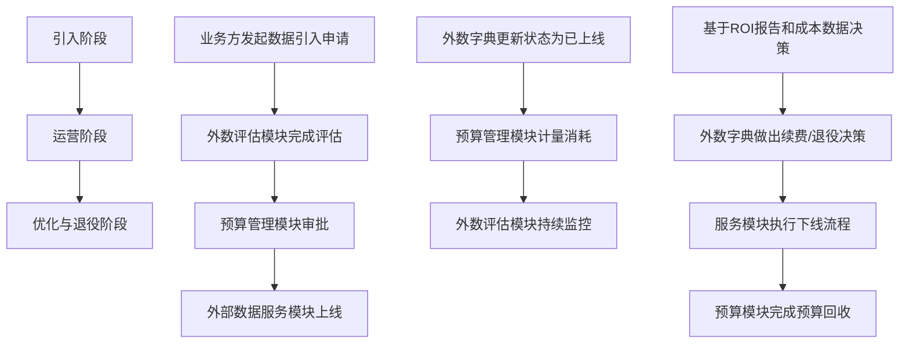
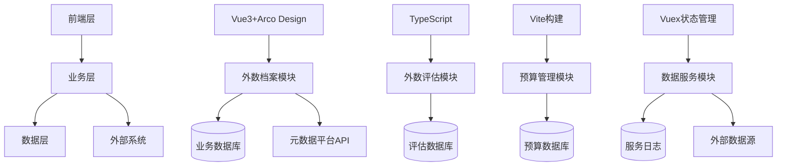

# 外数生命周期管理模块需求文档

## 1. 产品概述

### 1.1 背景与现状
基于最新外数相关功能评估，我们发现现有7个外数页面**全部完成核心功能开发**，包括创新的陪跑服务功能。当前实现状态：

**已实现功能（前端展示，Mock数据）**：
- ✅ **外部数据管理**：完整的CRUD操作、供应商管理、多条件筛选
- ✅ **外部数据v1**：产品卡片展示、分类筛选、批量变更功能
- ✅ **预算管理**：预算数据展示、粒度筛选、文件上传功能
- ⚠️ **外部数据评估**：仅框架，需要补充具体评估功能
- ✅ **外数追踪概览**：性能评估、价格对比、使用量监控
- ✅ **外部数据监控**：预算健康度预警、成本分析、图表展示
- ✅ **数据服务**：完整的服务集市、陪跑服务（影子模式+冠军挑战者）

**技术架构特点**：
- **前端技术栈**：Vue 3 + TypeScript + Arco Design + ECharts
- **项目需求**：前端展示层，使用Mock数据，无需后端API集成
- **创新亮点**：陪跑服务实现影子模式和冠军挑战者策略
- **统一设计**：基于现有项目结构和设计样式保持一致

### 1.2 整体愿景
构建一个涵盖"资产业务化、评估常态化、成本精细化、服务标准化"的外部数据全生命周期管理平台，确保每一份外部数据都可控、可量、可运营。

### 1.3 与现有系统关系
- **数据地图**：保留外部数据卡片展示和基础注册功能
- **外数生命周期管理**：新增独立模块，剥离供应商管理功能
- **技术架构**：基于Vue3+TypeScript+Arco Design技术栈

## 2. 核心功能模块

### 2.1 外数档案模块（External Data Dictionary）- 功能中枢定位

#### 2.1.1 核心定位与职责
外数档案模块作为**外部数据生命周期管理的功能中枢**，承担以下核心职责：
- **非元数据信息补充**：完善业务属性、管理属性等元数据之外的关键信息
- **供应商关系维护**：维护供应商全生命周期信息和评估数据
- **跨模块业务串联**：连接元数据管理、外数评估、预算管理、数据服务等模块
- **生命周期变更发起**：支持各类变更申请的发起和跟踪
- **效果评估和技术信息索引**：聚合展示评估结果，提供技术详情跳转入口

#### 2.1.2 业务信息补充管理
**功能定位**：完善元数据之外的业务属性信息

**详细功能点**：
- **业务属性补充**
  - 业务价值描述（预期收益、业务目标量化）
  - 使用场景细化（具体业务流程描述）
  - 业务影响评估（对核心指标的影响程度）
  - 替代方案说明（可替代数据源说明）
  - 业务风险识别（业务层面的风险点）

- **管理属性补充**
  - 采购信息（合同信息、采购周期、续约提醒）
  - 维护责任（明确维护责任人和职责）
  - 变更记录（业务层面的变更历史）
  - 审批记录（各阶段审批记录归档）
  - 合规状态（合规检查状态和结果）

#### 2.1.3 供应商信息管理
**功能定位**：维护供应商全生命周期信息

**详细功能点**：
- **供应商基础信息**
  - 供应商档案（公司信息、资质证书）
  - 联系人管理（多个联系人角色维护）
  - 合作历史（合作项目历史记录）
  - 信用评级（基于合作历史的信用评估）
  - 服务能力（数据覆盖范围、更新能力）

- **供应商评估信息**
  - 服务质量评分（稳定性、准确性、及时性）
  - 合作满意度（内部用户满意度调研）
  - 问题处理效率（问题响应和解决时效）
  - 价格竞争力（市场价格对比分析）
  - 创新能力（新产品、新技术跟进能力）

#### 2.1.4 使用说明管理
**功能定位**：沉淀和共享数据使用知识

**详细功能点**：
- **使用指南**
  - 快速入门（新用户上手指导）
  - API使用示例（常见调用场景示例）
  - 数据解读指南（字段含义解释）
  - 常见问题（FAQ和解决方案）
  - 最佳实践（高效使用经验分享）

#### 2.1.5 效果评估索引
**功能定位**：聚合展示多维度评估结果

**详细功能点**：
- **评估结果聚合**
  - 评估指标汇总（从外数评估模块获取）
  - 评估趋势分析（历史评估变化趋势）
  - 评估对比分析（同类数据对比）
  - 评估报告归档（历史评估报告管理）

#### 2.1.6 技术信息索引
**功能定位**：提供技术详情的统一入口

**详细功能点**：
- **技术详情跳转**
  - 接口详情（跳转到external-data-v1/list查看）
  - 数据结构（跳转到元数据管理查看）
  - 技术文档（技术规格说明书链接）
  - 测试报告（数据质量测试报告）

#### 2.1.7 生命周期变更发起
**功能定位**：支持各类变更申请的发起和跟踪

**详细功能点**：
- **变更类型**
  - 新增数据申请
  - 现有数据变更
  - 数据下线申请
  - 供应商变更
  - 合同续约申请

- **变更流程**
  - 变更申请（填写变更内容和原因）
  - 影响分析（自动分析影响范围）
  - 审批流程（根据变更类型路由审批）
  - 执行跟踪（变更执行状态跟踪）
  - 结果确认（变更结果验证和确认）

#### 2.1.8 跨模块串联能力
- **评估结果回写**：外数评估结果自动回写到档案
- **预算信息关联**：预算管理中的成本信息关联展示
- **服务状态同步**：数据服务中的服务状态实时同步
- **变更影响分析**：生命周期变更对各模块的影响分析

### 2.2 外数评估模块（全生命周期评估）

#### 2.2.1 引入阶段评估
**功能描述**：外部数据引入前的全面评估，为采购决策提供科学依据

**详细功能点**：
- **引入评估报告生成**：自动生成引入评估报告模板，多维度评估数据聚合展示，评估结论和建议生成，报告导出和分享功能，历史评估报告版本管理，报告审批流程集成
- **引入前评估流程**：评估任务创建和分配，评估标准和权重配置，试数据采集和分析，评估结果计算和评级，引入建议生成，决策支持信息提供
- **引入决策支持**：成本效益分析（预期成本vs预期收益），风险评估和预警，供应商对比分析，市场替代方案评估，业务需求匹配度分析，引入时机建议

#### 2.2.2 监控阶段评估
**功能描述**：外部数据运营期间的实时监控和评估

**详细功能点**：
- **成本指标监控**：实际消耗成本统计（按天/周/月），预算执行情况对比，成本趋势分析和预测，成本异常预警机制，部门/项目成本分摊，ROI实时计算和展示
- **调用指标监控**：调用次数统计（总量、频率、峰值），调用成功率监控，调用响应时间统计，调用来源分析（系统、部门、用户），调用时段分布，调用异常统计
- **性能指标监控**：KS值监控和趋势分析，IV值计算和变化跟踪，性价比指标（KS/单价）计算，性能基准对比，性能下降预警，性能优化建议
- **外数查得率监控**：查得率实时统计，查得率趋势分析，查得率异常检测，查得率影响因素分析，查得率改善建议，查得率对比分析
- **稳定性指标监控**：服务可用性监控，接口响应稳定性，数据更新稳定性，系统兼容性监控，稳定性评分计算，稳定性报告生成

#### 2.2.3 持续评估
**功能描述**：定期或触发性进行的全方位评估，支持数据资产的持续优化

**详细功能点**：
- **手工发起评估**：选择评估对象和评估类型，自定义评估参数配置，评估任务即时启动，评估进度实时跟踪，评估结果即时查看，评估报告手工生成
- **自动发起评估**：定时评估任务配置（月度/季度/年度），触发式评估规则设置，评估任务自动调度，评估结果自动通知，异常评估自动预警，评估报告自动推送
- **评估报告管理**：报告模板自定义，报告自动生成和发送，报告版本管理，报告权限控制，报告历史查询，报告导出和分享
- **评估结果跟踪**：评估结果趋势分析，改进措施效果跟踪，评估建议落实监控，评估结果对比分析，评估质量评价，评估体系优化建议

#### 2.2.4 质量评估管理
**功能描述**：建立多维度外数质量评估体系

**详细功能点**：
- **数据完整性评估**：字段完整性检查（必填字段填充率），记录完整性统计（数据条数完整性），时间窗口完整性（历史数据覆盖度），业务场景完整性（关键业务数据完整性），完整性评分算法（加权平均计算），完整性趋势分析（时间序列展示）
- **数据准确性评估**：数据格式验证（格式规范性检查），数据范围校验（数值范围合理性），业务规则验证（业务逻辑一致性），交叉验证（多源数据对比），准确性评分标准（误差率计算），异常值检测和标记
- **数据及时性评估**：数据更新频率监控，延迟时间统计分析，时效性业务规则检查，实时性指标计算，及时性评分模型，延迟预警机制
- **数据一致性评估**：跨系统一致性检查，时间序列一致性验证，业务逻辑一致性校验，数据版本一致性管理，一致性评分算法，冲突解决建议

#### 2.2.5 价值评估管理
**功能描述**：量化评估外部数据的业务价值

**详细功能点**：
- **业务价值评估**：使用频率统计（调用次数、使用部门数），业务覆盖度分析（支持的业务场景数量），决策支持度评估（对业务决策的贡献度），效率提升度测量（节省的人力和时间成本），业务价值评分模型（多因子加权计算），ROI计算和预测
- **技术价值评估**：系统集成度评估（对接系统数量），技术复杂度评价（开发和维护成本），性能影响度分析（对系统性能的影响），可替代性分析（替代难度和成本），技术价值评分标准，技术债务评估
- **战略价值评估**：市场竞争力贡献，业务创新支持度，长期发展规划匹配度，数据稀缺性评估，战略价值评分模型，未来价值预测

#### 2.2.6 风险评估管理
**功能描述**：全面评估外部数据的各类风险

**详细功能点**：
- **合规风险评估**：法律法规符合性检查（GDPR、网络安全法等），行业标准合规性验证，数据主权风险评估，跨境传输合规性检查，合规风险评分模型，合规改进建议
- **技术风险评估**：技术依赖风险评估，系统兼容性风险，数据质量风险，服务稳定性风险，技术风险量化模型，风险缓解措施
- **业务风险评估**：业务连续性风险，供应商依赖风险，成本效益风险，市场竞争风险，业务风险评分标准，风险应对策略
- **安全风险评估**：数据泄露风险，隐私保护风险，访问控制风险，数据传输风险，安全风险评级，安全防护建议

### 2.3 预算管理模块（五大核心展示 + 成本计算）

#### 2.3.1 预算展示管理
**功能描述**：支持多维度、多层次的预算数据展示

**详细功能点**：
- **年度预算展示**：预算总览卡片（年度预算总额、已执行金额、剩余预算、执行率），预算执行趋势图（时间序列展示预算执行情况），部门预算分布图（各部门预算占比和对比），预算科目结构图（各科目预算构成和占比），预算执行排行榜（各部门执行率排名），预算异常预警区（超预算、执行异常等预警信息）
- **滚动预算展示**：月度预算执行对比（预算vs实际），季度预算调整历史（调整记录和趋势），预算偏差分析图（偏差金额和偏差率），预算预测趋势（基于历史数据的预测），预算调整影响展示（调整对整体预算的影响）
- **预算明细展示**：预算明细表格（科目、金额、执行率等详细信息），预算执行流水（每笔预算执行记录），预算对比分析（与历史同期、与行业对标），预算使用效率指标（单位成本效益等）

#### 2.3.2 成本监控预警
**功能描述**：实现外数成本的实时监控和智能预警

**详细功能点**：
- **实时成本监控**：成本实时监控面板（当日、本周、本月成本），成本趋势折线图（按日/周/月展示成本变化），成本构成饼图（各类成本占比分析），成本热力图（不同时段、不同维度的成本热力），成本异常检测（基于历史数据的异常识别），成本对比分析（与预算、与历史同期对比）
- **预算执行预警**：预算余额不足预警（剩余预算低于阈值提醒），超预算预警（实际支出超过预算提醒），成本异常波动预警（成本异常增长提醒），预算执行滞后预警（执行进度落后于计划），预警信息推送（系统内通知、邮件提醒等），预警历史记录（所有预警信息的记录和查询）
- **成本分析展示**：成本结构分析图（供应商、数据类型、使用部门等维度），成本效益分析表（成本与使用量的效益分析），成本趋势预测图（基于历史数据的成本预测），成本优化建议展示（基于分析的成本优化建议）

#### 2.3.3 合同信息展示
**功能描述**：集中展示和管理合同相关信息

**详细功能点**：
- **合同总览展示**：合同统计卡片（合同总数、总金额、待结算合同数等），合同状态分布图（执行中、待结算、已完成等状态分布），供应商合同排行榜（按合同金额排名的供应商），合同金额趋势图（按时间展示合同金额变化）
- **合同明细展示**：合同列表表格（合同编号、供应商、金额、状态等详细信息），合同详情页面（合同基本信息、条款、附件等），合同执行进度展示（合同执行状态和进度），合同关联数据展示（合同关联的数据产品和服务）
- **合同预警展示**：合同到期预警（即将到期的合同提醒），合同执行异常预警（合同执行出现问题提醒），合同金额异常预警（合同金额异常波动提醒）

#### 2.3.4 结算信息展示
**功能描述**：展示结算单信息和结算数据分析

**详细功能点**：
- **结算总览展示**：结算统计卡片（结算单总数、结算总金额、待确认结算数等），结算趋势图（按时间展示结算金额变化），供应商结算排行榜（按结算金额排名的供应商），结算状态分布图（待确认、已确认、有差异等状态分布）
- **结算明细展示**：结算单列表表格（结算单编号、供应商、金额、状态等详细信息），结算单详情页面（结算单基本信息、明细项目、调整记录等），结算差异展示（系统数据与供应商数据差异对比），结算历史记录（历史结算单查询和对比）
- **结算分析展示**：结算金额分析图（结算金额趋势和结构分析），结算效率统计（结算周期、结算准确率等），结算差异分析（差异原因分析和趋势）

#### 2.3.5 成本计算逻辑
**功能描述**：仅计算数据采购成本，不包含开发、维护、人力等成本

**计算规则**：
- **总成本** = Σ(数据采购成本)
- **单位成本** = 总成本 / 数据使用量
- **成本增长率** = (当期成本 - 上期成本) / 上期成本 × 100%
- **预警阈值**：
  - 预算余额预警：剩余预算 < 预算总额的10%
  - 超预算预警：实际支出 > 预算金额
  - 成本异常预警：成本增长率 > 50% 或成本下降率 > 30%
  - 合同到期预警：距离合同到期 < 30天

### 2.4 外部数据服务模块（申请-任务-结果全流程）

#### 2.4.1 服务申请管理
**功能描述**：统一管理外部数据服务的申请和配置

**详细功能点**：
- **在线数据明细申请**：在线调用外部数据API接口，支持外名、身份证、手机号等信息输入，实时返回数据结果，支持业务处理逻辑集成
- **外置数据回溯申请**：历史数据回溯申请，支持指定时间范围查询，批量数据处理能力，异步任务处理机制
- **全量变量回溯申请**：过往历史数据全量回溯，变量范围选择（全部/自定义），执行周期配置（每日跟跑/一次性），历史回溯区间设置，样本范围定义
- **风险合规外数查询**：客户风险合规相关数据查询，支持身份证号查询模式，支持批量回溯模式，时间筛选功能，查询确认列表生成
- **陪跑变量回溯申请**：陪跑服务申请创建，多步骤申请流程（基本信息→数据产品→场景选择→信贷产品），数据量分配和配置，场景化数据配置

#### 2.4.2 任务查询管理
**功能描述**：提供任务状态的实时查询和跟踪

**详细功能点**：
- **任务列表展示**：申请任务列表展示，任务状态实时更新，任务分类筛选，任务搜索功能
- **任务状态跟踪**：任务进度实时显示，状态变更历史记录，任务执行时间线，异常状态预警
- **任务详情查看**：任务参数详情展示，执行日志查看，结果预览功能，失败原因分析

#### 2.4.3 结果展示管理
**功能描述**：统一展示服务申请的结果和数据

**详细功能点**：
- **结果列表展示**：申请结果列表，结果状态标识，结果数据统计，结果导出功能
- **结果详情查看**：详细结果数据展示，数据质量报告，结果对比分析，历史结果查询
- **结果数据管理**：结果数据下载，数据格式转换，结果分享功能，数据有效期管理

#### 2.4.4 服务架构设计
**服务流程架构**：服务申请 → 任务创建 → 任务执行 → 结果生成 → 结果展示

**任务状态流转**：待执行 → 执行中 → 已完成 → 结果展示

**各阶段职责**：
- **服务申请**：用户提交服务申请，配置申请参数
- **任务创建**：系统创建执行任务，分配资源
- **任务执行**：执行具体的数据服务任务
- **结果生成**：处理执行结果，生成报告数据
- **结果展示**：向用户展示执行结果和详细数据

### 2.5 模块间协同关系
基于功能中枢定位，四个模块形成紧密的协同工作流，实现数据、状态和流程的深度整合：

#### 2.5.1 外数档案 ↔ 外数评估协同
**数据流向**：档案触发评估 → 评估结果回写档案 → 档案状态更新

**详细协同机制**：
- **档案触发评估**：档案信息变更时自动触发评估任务
- **评估结果回写**：评估结果实时回写到档案的效果评估索引
- **档案状态更新**：基于评估结果更新档案的评估状态和等级
- **评估历史关联**：档案中展示历史评估记录和趋势
- **评估建议执行**：档案中跟踪评估建议的执行情况
- **评估预警联动**：评估异常时档案显示预警信息

#### 2.5.2 外数档案 ↔ 预算管理协同
**数据流向**：档案成本信息同步 → 预算预警触发档案更新 → 档案生命周期决策

**详细协同机制**：
- **成本信息同步**：预算管理中的成本数据同步到档案
- **预算预警联动**：预算超支预警触发档案成本预警
- **生命周期决策**：基于预算执行情况指导档案生命周期决策
- **成本效益分析**：档案中展示成本效益分析结果
- **预算影响评估**：档案变更时评估对预算的影响
- **成本优化建议**：基于档案使用情况提供成本优化建议

#### 2.5.3 外数档案 ↔ 数据服务协同
**数据流向**：档案服务状态同步 → 服务使用记录回写档案 → 档案服务可用性更新

**详细协同机制**：
- **服务状态同步**：数据服务状态实时同步到档案
- **使用记录回写**：服务调用记录回写到档案的使用统计
- **可用性更新**：基于服务状态更新档案的服务可用性标识
- **服务申请触发**：档案中直接发起数据服务申请
- **服务效果反馈**：服务效果数据回写到档案评估
- **服务优化建议**：基于档案信息提供服务优化建议

#### 2.5.4 外数评估 ↔ 预算管理协同
**数据流向**：评估结果指导预算决策 → 预算执行数据用于评估分析

**详细协同机制**：
- **预算决策支持**：评估结果为预算分配提供决策依据
- **执行数据分析**：预算执行数据用于评估成本效益
- **ROI计算协同**：结合评估结果和预算数据计算ROI
- **风险评估联动**：评估风险影响预算决策
- **成本优化评估**：评估结果指导成本优化策略
- **预算调整建议**：基于评估结果提供预算调整建议

#### 2.5.5 外数评估 ↔ 数据服务协同
**数据流向**：评估建议指导服务优化 → 服务效果数据用于评估验证

**详细协同机制**：
- **服务优化指导**：评估建议指导数据服务参数优化
- **效果数据验证**：服务效果数据用于验证评估结论
- **服务质量监控**：评估指标用于监控服务质量
- **服务改进建议**：基于评估结果提供服务改进建议
- **服务效果评估**：服务使用数据用于评估数据价值
- **持续优化循环**：形成评估→优化→验证→再评估的循环

#### 2.5.6 预算管理 ↔ 数据服务协同
**数据流向**：成本数据指导服务定价 → 服务使用数据用于成本分析

**详细协同机制**：
- **定价策略制定**：成本数据用于制定服务定价策略
- **使用成本分析**：服务使用数据用于成本分析和分摊
- **预算执行监控**：服务支出实时监控预算执行情况
- **成本预警联动**：服务成本异常触发预算预警
- **服务效益评估**：结合成本和使用数据评估服务效益
- **成本优化建议**：基于服务使用数据提供成本优化建议

## 3. 用户界面设计

### 3.1 设计原则
基于功能中枢定位和用户体验优化，界面设计遵循以下原则：

**一致性原则**：
- 统一的色彩体系和视觉风格
- 标准化的组件和交互模式
- 一致的信息架构和导航逻辑

**可用性原则**：
- 简洁明了的页面布局
- 直观易懂的操作流程
- 及时有效的反馈机制

**可扩展性原则**：
- 模块化的页面结构设计
- 灵活的配置和定制能力
- 支持未来功能扩展

### 3.2 外数档案模块页面设计

#### 3.2.1 档案总览页
**页面布局**：
- **顶部导航区**：系统Logo、模块导航、用户中心
- **搜索筛选区**：快速搜索框、高级筛选面板、分类导航
- **数据展示区**：卡片式/列表式数据展示、分页控件
- **操作功能区**：批量操作、导出功能、自定义列

**核心功能**：
- 外数资产全局视图展示
- 多维度搜索和筛选
- 分类导航和快速定位
- 批量操作和数据导出
- 个性化视图配置

#### 3.2.2 档案详情页（信息展示中枢）
**页面布局**：
- **基本信息区**：外数名称、编码、分类、状态
- **业务信息区**：业务属性、管理属性、使用说明
- **供应商信息区**：供应商基础信息、评估信息、关系图谱
- **评估索引区**：效果评估结果、历史趋势、对比分析
- **技术信息区**：技术详情、接口信息、状态监控
- **操作功能区**：编辑、变更申请、服务申请、评估触发

**核心功能**：
- 跨模块数据聚合展示
- 信息关联和跳转
- 操作入口统一集成
- 历史版本对比
- 变更轨迹追踪

#### 3.2.3 供应商管理页
**页面布局**：
- **供应商列表区**：供应商基础信息展示、评级显示
- **详情展示**：供应商详细信息、合作历史、评估记录
- **关系图谱**：供应商关系网络可视化
- **评估面板**：供应商评估指标、评分、排名

**核心功能**：
- 供应商信息管理
- 供应商评估和评级
- 供应商关系维护
- 合作历史追踪
- 风险评估和预警

### 3.3 外数评估模块页面设计

#### 3.3.1 评估总览页
**页面布局**：
- **评估仪表盘**：关键指标展示、状态概览
- **任务列表区**：评估任务列表、状态标识、进度显示
- **快速入口区**：常用评估功能快速入口
- **预警中心**：评估异常预警、待处理事项

**核心功能**：
- 评估任务总览
- 评估状态监控
- 快速操作入口
- 异常预警展示
- 评估历史查询

#### 3.3.2 引入评估页
**页面布局**：
- **评估配置区**：评估参数配置、标准选择
- **数据采集区**：试数据采集、样本管理
- **分析展示区**：多维度分析结果、图表展示
- **报告生成区**：评估报告生成、导出分享

**核心功能**：
- 引入前评估流程
- 试数据采集和分析
- 多维度评估展示
- 评估报告生成
- 决策支持信息

#### 3.3.3 监控评估页
**页面布局**：
- **监控仪表盘**：实时指标监控、趋势图表
- **指标详情区**：各项指标详细数据、对比分析
- **异常预警区**：异常检测、预警信息、处理建议
- **历史数据区**：历史监控数据、趋势分析

**核心功能**：
- 运营期实时监控
- 多指标跟踪
- 异常检测预警
- 趋势分析展示
- 监控报告生成

#### 3.3.4 持续评估页
**页面布局**：
- **评估计划区**：定期评估计划、自动触发配置
- **评估执行区**：评估任务执行、进度跟踪
- **结果展示区**：评估结果展示、对比分析
- **报告管理区**：评估报告管理、版本控制

**核心功能**：
- 定期评估管理
- 自动触发机制
- 评估结果跟踪
- 报告版本管理
- 历史对比分析

### 3.4 预算管理模块页面设计

#### 3.4.1 预算总览页
**页面布局**：
- **预算仪表盘**：年度预算、滚动预算总览
- **执行监控区**：预算执行情况、完成率展示
- **预警中心**：预算超支预警、异常提醒
- **对比分析区**：预算vs实际对比、趋势分析

**核心功能**：
- 年度/滚动预算展示
- 预算执行监控
- 预警信息展示
- 对比分析功能
- 健康度评估

#### 3.4.2 预算制定页
**页面布局**：
- **预算规划区**：预算科目设置、金额规划
- **审批流程区**：审批流程配置、状态跟踪
- **历史参考区**：历史预算数据、执行参考
- **版本管理区**：预算版本控制、对比功能

**核心功能**：
- 预算规划制定
- 科目体系管理
- 审批流程配置
- 历史数据参考
- 版本控制管理

#### 3.4.3 预算监控页
**页面布局**：
- **实时监控区**：成本实时监控、支出趋势
- **执行分析区**：预算执行分析、偏差分析
- **异常预警区**：异常检测、预警配置
- **报表展示区**：监控报表、数据导出

**核心功能**：
- 实时成本监控
- 预算执行分析
- 异常检测预警
- 监控报表生成
- 数据导出功能

#### 3.4.4 合同管理页
**页面布局**：
- **合同列表区**：合同信息列表、状态标识
- **详情展示**：合同详细信息、条款内容
- **执行跟踪区**：合同执行进度、里程碑跟踪
- **到期预警区**：合同到期预警、续签提醒

**核心功能**：
- 合同信息展示
- 执行进度跟踪
- 到期预警管理
- 合同变更记录
- 续签提醒功能

#### 3.4.5 结算管理页
**页面布局**：
- **结算列表区**：结算信息列表、状态显示
- **详情查看区**：结算详细信息、差异分析
- **效率统计区**：结算效率统计、流程优化
- **对比分析区**：预算vs结算对比、趋势分析

**核心功能**：
- 结算信息展示
- 差异分析功能
- 效率统计分析
- 对比分析展示
- 流程优化建议

### 3.5 外部数据服务模块页面设计

#### 3.5.1 服务申请页
**页面布局**：
- **服务选择区**：服务类型选择、参数配置
- **申请表单区**：申请信息填写、附件上传
- **预览确认区**：申请信息预览、确认提交
- **历史申请区**：历史申请记录、快速复用

**核心功能**：
- 统一申请入口
- 五大服务类型支持
- 参数化配置
- 申请预览确认
- 历史记录管理

#### 3.5.2 任务查询页
**页面布局**：
- **任务列表区**：任务列表展示、状态标识
- **状态跟踪区**：任务进度跟踪、时间线展示
- **详情查看区**：任务详细信息、执行日志
- **异常处理区**：异常检测、处理建议

**核心功能**：
- 任务列表展示
- 状态实时跟踪
- 详细信息查看
- 异常检测处理
- 执行日志查看

#### 3.5.3 结果展示页
**页面布局**：
- **结果列表区**：结果列表展示、状态标识
- **详情查看区**：详细结果数据、质量报告
- **对比分析区**：结果对比分析、可视化展示
- **数据管理区**：结果数据下载、格式转换

**核心功能**：
- 结果列表展示
- 详细数据查看
- 质量报告生成
- 对比分析功能
- 数据导出管理

### 3.6 系统管理页面设计

#### 3.6.1 用户管理页
**页面布局**：
- **用户列表区**：用户信息列表、角色标识
- **角色管理区**：角色定义、权限配置
- **操作审计区**：用户操作记录、审计追踪
- **权限配置区**：功能权限、数据权限配置

**核心功能**：
- 用户信息管理
- 角色权限管理
- 操作审计追踪
- 权限精细控制
- 安全策略配置

#### 3.6.2 系统配置页
**页面布局**：
- **参数配置区**：系统参数设置、配置管理
- **流程定义区**：业务流程定义、节点配置
- **规则设置区**：业务规则设置、条件配置
- **模板管理区**：模板定义、版本管理

**核心功能**：
- 系统参数配置
- 业务流程定义
- 业务规则设置
- 模板版本管理
- 配置变更追踪

### 3.7 设计规范

#### 3.7.1 色彩规范
**主色调**：
- 主色：#1890FF（蓝色系，代表专业可信）
- 辅助色：#52C41A（绿色系，代表成功通过）
- 警告色：#FAAD14（橙色系，代表警告提醒）
- 错误色：#F5222D（红色系，代表错误异常）

**中性色**：
- 文字主色：#262626（主要文字）
- 文字次要：#595959（次要文字）
- 边框颜色：#D9D9D9（边框线条）
- 背景颜色：#F5F5F5（页面背景）

#### 3.7.2 字体规范
**字体族**：
- 主要字体：PingFang SC、Hiragino Sans GB、Microsoft YaHei
- 数字字体：Helvetica Neue、Arial

**字号规范**：
- 标题：18px/24px（一级/二级标题）
- 正文：14px（主要文字内容）
- 辅助：12px（次要信息展示）
- 按钮：14px（按钮文字）

#### 3.7.3 布局规范
**栅格系统**：
- 基于24栅格系统
- 响应式断点：1920px、1440px、1024px、768px
- 间距规范：8px的倍数（8、16、24、32、48px）

**页面结构**：
- 顶部导航：高度64px
- 侧边导航：宽度200px-240px
- 内容区域：自适应宽度
- 底部区域：高度48px

#### 3.7.4 交互规范
**操作反馈**：
- 加载状态：骨架屏、loading动画
- 操作成功：成功提示、绿色标识
- 操作失败：错误提示、红色标识、重试机制
- 操作确认：二次确认弹窗、风险提示

**状态标识**：
- 运行中：蓝色旋转图标
- 成功：绿色勾选图标
- 失败：红色叉号图标
- 警告：黄色感叹号图标
- 暂停：灰色暂停图标

### 3.8 响应式设计
**桌面端优先**：
- 默认设计基于1920px宽度
- 支持1440px、1024px宽度适配
- 多栏布局、丰富信息展示

**平板端适配**：
- 768px-1024px宽度适配
- 简化布局、优化触控体验
- 侧边栏折叠、手势操作

**移动端支持**：
- 375px-768px宽度适配
- 单栏布局、核心功能聚焦
- 底部导航、触控优化
- 离线缓存、弱网适配

## 4. API设计规范

### 4.1 接口设计原则

#### 4.1.1 统一规范
**RESTful设计**：
- 资源导向的URL设计
- 标准HTTP方法（GET、POST、PUT、DELETE）
- 统一的状态码规范
- 一致的响应格式

**版本管理**：
- URL版本控制（/api/v1/）
- 向后兼容保证
- 版本生命周期管理
- 迁移策略制定

#### 4.1.2 安全性设计
**认证授权**：
- JWT令牌认证
- RBAC权限模型
- 接口级别权限控制
- 数据范围权限过滤

**数据安全**：
- 敏感数据加密传输
- 参数校验和过滤
- SQL注入防护
- XSS攻击防护

### 4.2 外数档案模块API

#### 4.2.1 档案管理接口
```
GET /api/v1/external-data/assets
```
**功能**：获取外数资产列表
**请求参数**：
| 参数名 | 类型 | 必填 | 描述 |
|--------|------|------|------|
| page | number | 否 | 页码，默认1 |
| pageSize | number | 否 | 每页条数，默认20 |
| category | string | 否 | 数据分类 |
| status | string | 否 | 数据状态 |
| keyword | string | 否 | 搜索关键词 |

**响应数据**：
```json
{
  "code": 200,
  "message": "success",
  "data": {
    "total": 100,
    "list": [
      {
        "id": "asset_001",
        "name": "征信数据",
        "code": "CREDIT_DATA",
        "category": "金融征信",
        "status": "active",
        "supplier": "央行征信中心",
        "evaluationScore": 85,
        "lastUpdated": "2024-01-15"
      }
    ]
  }
}
```

```
GET /api/v1/external-data/assets/{id}
```
**功能**：获取外数资产详情
**响应数据**：
```json
{
  "code": 200,
  "message": "success",
  "data": {
    "basicInfo": {
      "id": "asset_001",
      "name": "征信数据",
      "description": "个人征信报告数据",
      "category": "金融征信",
      "status": "active"
    },
    "businessInfo": {
      "businessImpact": "高",
      "alternativeSolutions": ["方案A", "方案B"],
      "businessRisks": ["数据延迟风险", "合规风险"]
    },
    "supplierInfo": {
      "supplierId": "supplier_001",
      "supplierName": "央行征信中心",
      "contactInfo": {
        "name": "张三",
        "phone": "13800138000",
        "email": "zhangsan@example.com"
      },
      "cooperationHistory": "合作3年，服务质量良好",
      "creditRating": "AAA"
    },
    "evaluationIndex": {
      "latestScore": 85,
      "historicalTrends": [
        {"date": "2024-01", "score": 85},
        {"date": "2023-12", "score": 82}
      ],
      "comparativeAnalysis": {
        "industryAverage": 80,
        "ranking": "前20%"
      }
    },
    "technicalInfo": {
      "interfaceType": "API",
      "updateFrequency": "日更新",
      "dataFormat": "JSON",
      "technicalStatus": "正常"
    }
  }
}
```

#### 4.2.2 供应商管理接口
```
GET /api/v1/external-data/suppliers
```
**功能**：获取供应商列表
```
POST /api/v1/external-data/suppliers
```
**功能**：创建供应商
```
PUT /api/v1/external-data/suppliers/{id}
```
**功能**：更新供应商信息
```
GET /api/v1/external-data/suppliers/{id}/evaluation
```
**功能**：获取供应商评估信息

### 4.3 外数评估模块API

#### 4.3.1 评估任务管理接口
```
GET /api/v1/external-data/evaluations
```
**功能**：获取评估任务列表
```
POST /api/v1/external-data/evaluations
```
**功能**：创建评估任务
**请求数据**：
```json
{
  "assetId": "asset_001",
  "evaluationType": "introduction",
  "evaluationPeriod": "2024-Q1",
  "evaluationCriteria": {
    "qualityWeight": 0.4,
    "valueWeight": 0.3,
    "riskWeight": 0.3
  }
}
```

```
GET /api/v1/external-data/evaluations/{id}
```
**功能**：获取评估任务详情
```
POST /api/v1/external-data/evaluations/{id}/execute
```
**功能**：执行评估任务
```
GET /api/v1/external-data/evaluations/{id}/report
```
**功能**：获取评估报告

#### 4.3.2 引入评估接口
```
POST /api/v1/external-data/evaluations/introduction
```
**功能**：创建引入评估
```
GET /api/v1/external-data/evaluations/introduction/{id}/samples
```
**功能**：获取试数据样本
```
POST /api/v1/external-data/evaluations/introduction/{id}/analysis
```
**功能**：提交试数据分析

#### 4.3.3 监控评估接口
```
GET /api/v1/external-data/evaluations/monitoring/{assetId}/indicators
```
**功能**：获取监控指标数据
```
GET /api/v1/external-data/evaluations/monitoring/{assetId}/cost
```
**功能**：获取成本指标数据
```
GET /api/v1/external-data/evaluations/monitoring/{assetId}/performance
```
**功能**：获取性能指标数据

### 4.4 预算管理模块API

#### 4.4.1 预算管理接口
```
GET /api/v1/external-data/budgets
```
**功能**：获取预算列表
```
POST /api/v1/external-data/budgets
```
**功能**：创建预算
```
GET /api/v1/external-data/budgets/{id}
```
**功能**：获取预算详情
```
PUT /api/v1/external-data/budgets/{id}
```
**功能**：更新预算

#### 4.4.2 成本监控接口
```
GET /api/v1/external-data/budgets/{id}/costs
```
**功能**：获取成本数据
```
GET /api/v1/external-data/budgets/{id}/alerts
```
**功能**：获取预警信息
```
POST /api/v1/external-data/budgets/{id}/alerts
```
**功能**：创建预警规则

#### 4.4.3 合同管理接口
```
GET /api/v1/external-data/contracts
```
**功能**：获取合同列表
```
GET /api/v1/external-data/contracts/{id}
```
**功能**：获取合同详情
```
GET /api/v1/external-data/contracts/{id}/progress
```
**功能**：获取合同执行进度

### 4.5 数据服务模块API

#### 4.5.1 服务申请接口
```
GET /api/v1/external-data/services/applications
```
**功能**：获取服务申请列表
```
POST /api/v1/external-data/services/applications
```
**功能**：提交服务申请
**请求数据**：
```json
{
  "serviceType": "online_data_query",
  "assetId": "asset_001",
  "parameters": {
    "queryType": "realtime",
    "dataRange": "2024-01-01_2024-01-31",
    "queryFields": ["field1", "field2"]
  },
  "priority": "normal",
  "description": "征信数据实时查询"
}
```

#### 4.5.2 任务管理接口
```
GET /api/v1/external-data/services/tasks
```
**功能**：获取任务列表
```
GET /api/v1/external-data/services/tasks/{id}
```
**功能**：获取任务详情
```
POST /api/v1/external-data/services/tasks/{id}/cancel
```
**功能**：取消任务

#### 4.5.3 结果管理接口
```
GET /api/v1/external-data/services/results
```
**功能**：获取结果列表
```
GET /api/v1/external-data/services/results/{id}
```
**功能**：获取结果详情
```
GET /api/v1/external-data/services/results/{id}/download
```
**功能**：下载结果文件

### 4.6 模块协同API

#### 4.6.1 档案-评估协同接口
```
POST /api/v1/external-data/assets/{assetId}/trigger-evaluation
```
**功能**：档案变更触发评估
```
POST /api/v1/external-data/evaluations/{evaluationId}/writeback-asset
```
**功能**：评估结果回写档案

#### 4.6.2 档案-预算协同接口
```
POST /api/v1/external-data/assets/{assetId}/sync-budget-info
```
**功能**：同步预算信息到档案
```
POST /api/v1/external-data/budgets/{budgetId}/alert-asset
```
**功能**：预算预警触发档案更新

#### 4.6.3 档案-服务协同接口
```
POST /api/v1/external-data/assets/{assetId}/sync-service-status
```
**功能**：同步服务状态到档案
```
POST /api/v1/external-data/services/applications/{applicationId}/record-usage
```
**功能**：记录服务使用到档案

## 5. 实施计划

### 5.1 当前实现状态（基于详细设计文档）

#### 5.1.1 外数档案模块（功能中枢定位）
**已实现功能**：
- ✅ 基础档案管理（ExternalDataAsset、BusinessInfo、SupplierInfo、EvaluationInfo、TechnicalInfo）
- ✅ 跨模块串联能力（LifecycleChangeRequest、CrossModuleLinkage）
- ✅ 业务信息补充管理（业务影响评估、替代方案说明、业务风险识别）
- ✅ 供应商信息管理（基础信息、联系人管理、合作历史、信用评级）
- ✅ 使用说明管理（使用指南、API示例、数据解读指南）

**待实现功能**：
- 🔄 效果评估索引（评估结果聚合、趋势分析、对比分析）
- 🔄 生命周期变更发起（变更类型、变更流程）
- 🔄 跨模块数据流向优化

#### 5.1.2 外数评估模块（全生命周期评估）
**已实现功能**：
- ✅ 引入阶段评估（IntroductionEvaluation、引入评估报告生成）
- ✅ 监控阶段评估（MonitoringEvaluation、成本/调用/性能指标监控）
- ✅ 持续评估管理（ContinuousEvaluation、手工/自动发起评估）
- ✅ 质量评估管理（QualityAssessment、完整性/准确性/及时性/一致性评估）

**待实现功能**：
- 🔄 价值评估管理（业务/技术/战略价值评估、ROI分析）
- 🔄 风险评估管理（合规/技术/业务风险、缓解策略）
- 🔄 评估结果共享机制

#### 5.1.3 预算管理模块（五大核心展示 + 成本计算）
**已实现功能**：
- ✅ 年度预算展示（AnnualBudgetDisplay、总览/执行率/健康度）
- ✅ 滚动预算展示（RollingBudgetDisplay、月度对比/季度调整）
- ✅ 预算明细展示（BudgetDetailDisplay、执行记录/对比分析）
- ✅ 成本监控预警（CostMonitoringAlert、实时成本/异常检测）
- ✅ 预算执行预警（BudgetExecutionAlert、阈值配置/触发条件）

**待实现功能**：
- 🔄 成本计算逻辑（仅数据采购成本、计算公式）
- 🔄 合同信息展示（ContractInfoDisplay、执行进度/到期预警）
- 🔄 结算信息展示（SettlementInfoDisplay、差异分析/效率统计）

#### 5.1.4 外部数据服务模块（申请-任务-结果全流程）
**已实现功能**：
- ✅ 服务申请管理（ServiceApplication、五大服务类型）
- ✅ 在线数据申请（OnlineDataApplication、实时/批量查询）
- ✅ 外置数据回溯（ExternalRetrospectApplication、时间范围/过滤条件）
- ✅ 全量变量回溯（FullVariableRetrospectApplication、变量选择/历史范围）

**待实现功能**：
- 🔄 风险合规查询（RiskComplianceQuery、客户风险/身份验证）
- 🔄 陪跑变量回溯（ShadowVariableApplication、场景配置/效果对比）
- 🔄 任务查询管理（TaskQueryManagement、状态跟踪/异常处理）
- 🔄 结果展示管理（ResultDisplayManagement、质量报告/可视化）

#### 5.1.5 模块间协同关系
**已实现功能**：
- ✅ 档案-评估协同（AssetTriggerEvaluation、结果回写）
- ✅ 档案-预算协同（AssetCostInformation、预算预警触发）
- ✅ 档案-服务协同（AssetServiceStatusSync、使用记录回写）
- ✅ 评估结果共享（EvaluationResultSharing、多场景支持）
- ✅ 预算数据共享（BudgetDataSharing、安全控制）

### 5.2 未来规划（基于详细设计深化）

#### 5.2.1 功能完善阶段（第4-6个月）
**外数档案模块**：
- 完善效果评估索引功能，建立评估结果聚合分析引擎
- 实现生命周期变更发起流程，支持多种变更类型
- 优化跨模块数据流向，提升协同效率30%

**外数评估模块**：
- 实现价值评估管理，建立ROI自动计算模型
- 完善风险评估管理，构建风险预警体系
- 建立评估结果共享池，支持多业务场景复用

**预算管理模块**：
- 深化成本计算逻辑，实现仅数据采购成本的精确计算
- 完善合同信息展示，建立合同全生命周期管理
- 优化结算信息展示，实现差异分析自动化

**数据服务模块**：
- 实现风险合规查询，满足监管要求
- 完善陪跑变量回溯，建立效果对比分析机制
- 优化任务查询管理，提升异常处理效率

#### 5.2.2 智能化升级阶段（第7-9个月）
**AI驱动的功能优化**：
- 智能评估推荐：基于历史数据自动推荐评估策略
- 预测性预算管理：基于趋势分析预测预算需求
- 智能任务调度：基于负载情况自动优化任务执行

**数据驱动决策支持**：
- 建立统一的数据分析平台
- 实现多维度数据钻取分析
- 构建决策支持知识库

#### 5.2.3 生态化扩展阶段（第10-12个月）
**外部系统集成**：
- 对接企业ERP系统
- 集成第三方数据源
- 建立API开放网关

**用户体验优化**：
- 实现个性化工作台
- 建立智能助手功能
- 优化移动端体验

### 5.3 技术架构升级计划

#### 5.3.1 微服务架构完善
- 服务拆分：按模块拆分为独立微服务
- 服务治理：实现服务注册、发现、监控
- 弹性伸缩：基于负载自动扩缩容

#### 5.3.2 数据架构优化
- 数据湖建设：建立统一数据湖存储
- 实时计算：引入流计算引擎
- 数据治理：完善数据质量管理体系

#### 5.3.3 安全体系强化
- 零信任架构：实现基于身份的访问控制
- 数据加密：端到端数据加密保护
- 审计合规：建立完整的操作审计链

### 5.4 质量保障措施

#### 5.4.1 测试策略
- 单元测试覆盖率：≥90%
- 集成测试覆盖率：≥80%
- 性能测试：支持1000并发用户
- 安全测试：通过等保三级认证

#### 5.4.2 监控告警
- 业务监控：核心业务流程监控
- 技术监控：系统性能、可用性监控
- 数据监控：数据质量、一致性监控

#### 5.4.3 应急响应
- 建立7×24小时运维体系
- 制定分级应急响应预案
- 实现自动化故障恢复

### 5.5 预期效益

#### 5.5.1 业务效益
- 外数管理效率提升：60%
- 评估准确性提升：40%
- 预算执行精度提升：35%
- 服务响应速度提升：50%

#### 5.5.2 技术效益
- 系统可用性：99.9%
- 数据一致性：100%
- 响应时间：≤2秒
- 扩展性：支持10倍业务增长

#### 5.5.3 管理效益
- 决策支持能力提升
- 风险管控能力增强
- 合规管理自动化
- 成本控制精细化

### 2.6 核心页面架构
基于四大模块的功能设计，系统包含以下核心页面：

#### 2.6.1 外数档案页面
1. **档案总览页**：外数资产全局视图、快速搜索、分类导航
2. **档案详情页**：信息展示中枢、跨模块数据聚合、操作入口
3. **供应商管理页**：供应商信息管理、评估、关系维护
4. **使用说明页**：使用指南、API示例、最佳实践管理
5. **变更管理页**：生命周期变更申请、审批、跟踪

#### 2.6.2 外数评估页面
1. **评估总览页**：评估任务总览、状态监控、快速入口
2. **引入评估页**：引入前评估、报告生成、决策支持
3. **监控评估页**：运营期监控、指标跟踪、异常预警
4. **持续评估页**：定期评估、自动触发、报告管理
5. **评估报告页**：报告查看、对比分析、历史管理

#### 2.6.3 预算管理页面
1. **预算总览页**：年度/滚动预算展示、执行监控、预警中心
2. **预算制定页**：预算规划、科目设置、审批流程
3. **预算监控页**：实时成本监控、执行分析、异常预警
4. **合同管理页**：合同信息展示、执行跟踪、到期预警
5. **结算管理页**：结算信息展示、差异分析、效率统计

#### 2.6.4 数据服务页面
1. **服务申请页**：统一申请入口、服务类型选择、参数配置
2. **任务查询页**：任务列表、状态跟踪、详情查看、异常处理
3. **结果展示页**：结果列表、详情查看、数据管理、分析功能
4. **服务配置页**：服务参数配置、流程定义、权限管理

#### 2.6.5 系统管理页面
1. **用户管理页**：用户角色管理、权限配置、操作审计
2. **系统配置页**：系统参数配置、流程定义、规则设置
3. **日志审计页**：操作日志、异常日志、审计报告
4. **报表中心页**：综合报表、统计分析、数据导出
**功能描述**：外部数据引入前的全面评估，为采购决策提供科学依据

**详细功能点**：
- **引入评估报告生成**
  - 自动生成引入评估报告模板
  - 多维度评估数据聚合展示
  - 评估结论和建议生成
  - 报告导出和分享功能
  - 历史评估报告版本管理
  - 报告审批流程集成

- **引入前评估流程**
  - 评估任务创建和分配
  - 评估标准和权重配置
  - 试数据采集和分析
  - 评估结果计算和评级
  - 引入建议生成
  - 决策支持信息提供

- **引入决策支持**
  - 成本效益分析（预期成本vs预期收益）
  - 风险评估和预警
  - 供应商对比分析
  - 市场替代方案评估
  - 业务需求匹配度分析
  - 引入时机建议

#### 2.2.2 外数监控阶段评估
**功能描述**：外部数据运营期间的实时监控和评估

**详细功能点**：
- **成本指标监控**
  - 实际消耗成本统计（按天/周/月）
  - 预算执行情况对比
  - 成本趋势分析和预测
  - 成本异常预警机制
  - 部门/项目成本分摊
  - ROI实时计算和展示

- **调用指标监控**
  - 调用次数统计（总量、频率、峰值）
  - 调用成功率监控
  - 调用响应时间统计
  - 调用来源分析（系统、部门、用户）
  - 调用时段分布
  - 调用异常统计

- **性能指标监控**
  - KS值监控和趋势分析
  - IV值计算和变化跟踪
  - 性价比指标（KS/单价）计算
  - 性能基准对比
  - 性能下降预警
  - 性能优化建议

- **外数查得率监控**
  - 查得率实时统计
  - 查得率趋势分析
  - 查得率异常检测
  - 查得率影响因素分析
  - 查得率改善建议
  - 查得率对比分析

- **稳定性指标监控**
  - 服务可用性监控
  - 接口响应稳定性
  - 数据更新稳定性
  - 系统兼容性监控
  - 稳定性评分计算
  - 稳定性报告生成

#### 2.2.3 外数持续评估
**功能描述**：定期或触发性进行的全方位评估，支持数据资产的持续优化

**详细功能点**：
- **手工发起评估**
  - 选择评估对象和评估类型
  - 自定义评估参数配置
  - 评估任务即时启动
  - 评估进度实时跟踪
  - 评估结果即时查看
  - 评估报告手工生成

- **自动发起评估**
  - 定时评估任务配置（月度/季度/年度）
  - 触发式评估规则设置
  - 评估任务自动调度
  - 评估结果自动通知
  - 异常评估自动预警
  - 评估报告自动推送

- **评估报告管理**
  - 报告模板自定义
  - 报告自动生成和发送
  - 报告版本管理
  - 报告权限控制
  - 报告历史查询
  - 报告导出和分享

#### 2.2.4 质量评估管理
**功能描述**：建立多维度外数质量评估体系

**详细功能点**：
- **数据完整性评估**
  - 字段完整性检查（必填字段填充率）
  - 记录完整性统计（数据条数完整性）
  - 时间窗口完整性（历史数据覆盖度）
  - 业务场景完整性（关键业务数据完整性）
  - 完整性评分算法（加权平均计算）
  - 完整性趋势分析（时间序列展示）

- **数据准确性评估**
  - 数据格式验证（格式规范性检查）
  - 数据范围校验（数值范围合理性）
  - 业务规则验证（业务逻辑正确性）
  - 交叉验证（多源数据一致性）
  - 准确性评分计算（错误率统计）
  - 异常数据检测和标记

- **数据及时性评估**
  - 更新频率监控（按计划更新检查）
  - 延迟统计（实际更新vs计划更新）
  - 时效性检查（数据新鲜度验证）
  - 实时性指标计算（延迟时间统计）
  - 及时性评分算法（延迟率计算）
  - 延迟预警机制（超阈值预警）

- **数据一致性评估**
  - 跨系统一致性检查（多系统数据对比）
  - 时间序列一致性（历史数据连续性）
  - 业务逻辑一致性（关联数据一致性）
  - 数据版本一致性（版本变更跟踪）
  - 一致性评分计算（不一致率统计）
  - 冲突解决机制（不一致数据处理）

#### 2.2.5 价值评估管理
**功能描述**：量化评估外部数据的业务价值、技术价值和战略价值

**详细功能点**：
- **业务价值评估**
  - 使用频率统计（调用次数、用户数）
  - 业务覆盖度分析（业务线覆盖情况）
  - 决策支持度评估（对业务决策的贡献）
  - 效率提升度测量（流程优化效果）
  - 业务价值评分计算（多维度加权）
  - ROI计算和预测（投入产出比分析）

- **技术价值评估**
  - 系统集成度评估（与现有系统集成程度）
  - 技术复杂度分析（技术实现难度）
  - 性能影响度测量（对系统性能的影响）
  - 可替代性分析（替代技术方案评估）
  - 技术价值评分计算（技术指标加权）
  - 技术债务评估（技术维护成本）

- **战略价值评估**
  - 市场竞争力贡献（对竞争优势的贡献）
  - 业务创新支持度（对业务创新的促进）
  - 长期规划匹配度（与战略规划的契合）
  - 数据稀缺性评估（市场上数据稀缺程度）
  - 战略价值评分计算（战略指标加权）
  - 未来价值预测（长期价值趋势预测）

#### 2.2.6 风险评估管理
**功能描述**：全面评估外部数据相关的各类风险

**详细功能点**：
- **合规风险评估**
  - 法律法规符合性检查（数据合规性验证）
  - 行业标准合规性（行业规范符合性）
  - 数据主权风险评估（数据主权风险分析）
  - 跨境传输合规性（跨境数据传输合规）
  - 合规风险评分计算（合规指标加权）
  - 合规风险缓解建议（风险缓解措施）

- **技术风险评估**
  - 技术架构风险（架构稳定性评估）
  - 数据质量风险（数据质量风险评估）
  - 供应商风险（供应商稳定性评估）
  - 运维风险（运维复杂度评估）
  - 技术风险评分计算（技术指标加权）
  - 技术风险应急预案（风险应对预案）

- **业务风险评估**
  - 业务连续性风险（对业务连续性的影响）
  - 数据依赖风险（业务对数据的依赖程度）
  - 竞争风险（竞争劣势风险）
  - 声誉风险（声誉影响风险）
  - 业务风险评分计算（业务指标加权）
  - 业务风险监控预警（风险实时监控）

- **综合风险管理**
  - 风险等级综合评定（多维度风险整合）
  - 风险缓解策略制定（针对性缓解措施）
  - 风险应急预案（应急响应预案）
  - 风险监控预警（风险实时监控）
  - 风险报告生成（定期风险报告）
  - 风险趋势分析（风险变化趋势）

### 2.3 预算管理模块（五大核心展示+成本计算）

#### 2.3.1 年度预算展示
**功能描述**：展示年度预算的全局视图，支持多维度预算数据可视化

**详细功能点**：
- **预算总览卡片**
  - 年度预算总额展示
  - 已执行金额实时统计
  - 剩余预算余额计算
  - 预算执行率百分比
  - 同比执行率对比
  - 预算健康度评分

- **执行趋势图**
  - 月度执行趋势折线图
  - 预算vs执行对比柱状图
  - 执行偏差趋势线
  - 预测完成时间估算
  - 关键节点标记
  - 趋势预警提示

- **部门分布图**
  - 各部门预算占比饼图
  - 部门执行率排行榜
  - 部门预算对比柱状图
  - 部门间预算调配建议
  - 部门预算使用效率
  - 部门预算异常预警

- **科目结构图**
  - 预算科目层级树状图
  - 科目预算占比分析
  - 科目执行进度展示
  - 科目预算调整历史
  - 科目预算使用分析
  - 科目预算优化建议

#### 2.3.2 滚动预算展示
**功能描述**：展示滚动预算的动态调整过程，支持预算预测和分析

**详细功能点**：
- **月度执行对比**
  - 实际vs预算对比表
  - 月度执行偏差分析
  - 月度执行率计算
  - 月度执行趋势图
  - 月度执行预测
  - 月度执行异常预警

- **季度调整历史**
  - 季度预算调整记录
  - 调整原因和影响分析
  - 调整前后对比图
  - 调整频率统计
  - 调整合理性评估
  - 调整建议生成

- **偏差分析图**
  - 预算偏差热力图
  - 偏差原因分类统计
  - 偏差趋势分析
  - 偏差影响评估
  - 偏差处理建议
  - 偏差预警机制

- **预测趋势**
  - 基于历史数据的预测模型
  - 多情景预测分析
  - 预测置信区间
  - 预测vs实际对比
  - 预测模型优化
  - 预测结果可视化

#### 2.3.3 预算明细展示
**功能描述**：提供详细的预算执行明细，支持深度数据分析

**详细功能点**：
- **预算明细表格**
  - 预算项目明细列表
  - 多级科目展示
  - 预算金额和执行金额
  - 执行状态和完成率
  - 负责人和部门信息
  - 预算有效期和状态

- **执行流水记录**
  - 预算执行明细流水
  - 执行时间和金额
  - 执行类型和来源
  - 执行审批记录
  - 执行异常标记
  - 执行追溯查询

- **对比分析功能**
  - 历史同期对比分析
  - 行业对标分析
  - 预算vs实际对比
  - 部门间对比分析
  - 科目间对比分析
  - 时间序列对比

- **效率指标计算**
  - 预算使用效率指标
  - 预算执行速度指标
  - 预算调整频率指标
  - 预算准确性指标
  - 预算优化建议
  - 效率排名展示

#### 2.3.4 成本监控预警
**功能描述**：实时监控成本支出，提供多维度成本分析和预警

**详细功能点**：
- **实时成本监控**
  - 当日成本实时统计
  - 本周成本累计统计
  - 本月成本进度展示
  - 成本支出趋势图
  - 成本构成分析
  - 成本异常检测

- **成本趋势分析**
  - 日/周/月成本趋势
  - 成本季节性分析
  - 成本周期性分析
  - 成本预测分析
  - 成本优化建议
  - 成本benchmark对比

- **成本构成展示**
  - 供应商成本占比
  - 数据类型成本分布
  - 使用部门成本分摊
  - 成本科目构成
  - 成本变化分析
  - 成本结构优化

- **异常检测预警**
  - 成本异常波动检测
  - 成本突增预警
  - 成本超预算预警
  - 成本效率异常预警
  - 成本趋势异常预警
  - 异常处理建议

#### 2.3.5 预算执行预警
**功能描述**：基于预警模型提供预算执行的智能预警和通知

**详细功能点**：
- **预算余额不足预警**
  - 余额阈值设置
  - 余额不足预警通知
  - 预警等级分类
  - 预警处理建议
  - 预警历史记录
  - 预警统计分析

- **超预算预警**
  - 超预算实时检测
  - 超预算原因分析
  - 超预算影响评估
  - 超预算处理流程
  - 超预算审批流程
  - 超预算统计分析

- **成本异常波动预警**
  - 异常波动检测算法
  - 波动阈值动态调整
  - 异常波动预警通知
  - 异常波动原因分析
  - 异常波动处理建议
  - 异常波动历史查询

- **执行滞后预警**
  - 执行进度监控
  - 滞后阈值设置
  - 执行滞后预警
  - 滞后原因分析
  - 滞后影响评估
  - 滞后处理建议

#### 2.3.6 合同信息展示
**功能描述**：展示合同相关信息，支持合同管理和分析

**详细功能点**：
- **合同总览统计**
  - 合同总数和总金额
  - 合同状态分布
  - 合同金额趋势
  - 合同类型分布
  - 合同执行率统计
  - 合同健康度评分

- **合同明细列表**
  - 合同基本信息展示
  - 合同金额和条款
  - 合同有效期管理
  - 合同负责人信息
  - 合同附件管理
  - 合同变更记录

- **合同执行进度**
  - 合同执行进度条
  - 执行金额统计
  - 执行比例计算
  - 执行里程碑标记
  - 执行异常预警
  - 执行历史记录

- **合同到期预警**
  - 到期时间提醒
  - 续约预警通知
  - 到期影响评估
  - 续约流程启动
  - 到期统计分析
  - 续约建议生成

#### 2.3.7 结算信息展示
**功能描述**：展示结算相关信息，支持结算管理和对账分析

**详细功能点**：
- **结算总览统计**
  - 结算总金额统计
  - 结算笔数统计
  - 结算状态分布
  - 结算趋势分析
  - 结算效率指标
  - 结算健康度评分

- **结算明细展示**
  - 结算明细列表
  - 结算金额和时间
  - 结算对象和类型
  - 结算状态跟踪
  - 结算附件管理
  - 结算审批记录

- **差异对比分析**
  - 预算vs结算对比
  - 合同vs结算对比
  - 预期vs实际对比
  - 差异原因分析
  - 差异处理建议
  - 差异统计分析

- **结算效率统计**
  - 结算周期统计
  - 结算及时率计算
  - 结算准确率评估
  - 结算流程优化
  - 结算效率排名
  - 结算benchmark对比

#### 2.3.8 成本计算逻辑
**功能描述**：明确定义成本计算范围和预警模型，确保成本管理准确性

**详细功能点**：
- **成本计算范围**
  - 仅计算数据采购成本
  - 外部数据采购费用
  - API调用费用
  - 数据服务费用
  - 明确排除内部成本
  - 成本分类标准

- **预警模型设计**
  - 预算余额预警模型
  - 超预算预警模型
  - 成本异常预警模型
  - 合同到期预警模型
  - 预警阈值设置
  - 预警级别定义

### 2.4 外部数据服务模块（申请-任务-结果全流程）

#### 2.4.1 服务申请管理
**功能描述**：提供统一的服务申请入口，支持多种数据服务类型

**详细功能点**：
- **在线数据明细申请**
  - 实时API调用服务
  - 单条/批量查询支持
  - 查询参数配置
  - 查询结果实时返回
  - 查询日志记录
  - 查询额度管理

- **外置数据回溯申请**
  - 历史数据查询服务
  - 时间范围选择
  - 数据筛选条件
  - 回溯任务创建
  - 回溯进度跟踪
  - 回溯结果获取

- **全量变量回溯申请**
  - 历史全量数据回溯
  - 变量选择配置
  - 回溯周期设置
  - 回溯任务调度
  - 回溯结果管理
  - 回溯历史查询

- **风险合规外数查询**
  - 客户风险合规数据查询
  - 身份证信息查询
  - 批量回溯支持
  - 时间范围筛选
  - 合规结果展示
  - 查询记录审计

- **陪跑变量回溯申请**
  - 多步骤创建流程
  - 数据产品选择
  - 应用场景配置
  - 陪跑任务管理
  - 效果对比分析
  - 陪跑报告生成

#### 2.4.2 任务查询管理
**功能描述**：提供任务全生命周期管理，支持任务状态实时跟踪

**详细功能点**：
- **任务列表展示**
  - 任务基本信息展示
  - 任务状态实时更新
  - 任务分类筛选
  - 任务搜索功能
  - 任务排序选项
  - 任务批量操作

- **任务状态跟踪**
  - 状态实时同步
  - 状态变更历史
  - 状态异常检测
  - 状态通知机制
  - 状态统计报表
  - 状态趋势分析

- **任务详情查看**
  - 任务详细信息展示
  - 任务参数配置
  - 任务执行日志
  - 任务结果预览
  - 任务异常信息
  - 任务重试机制

- **异常处理机制**
  - 异常自动检测
  - 异常分类处理
  - 异常通知告警
  - 异常处理建议
  - 异常处理记录
  - 异常统计分析

#### 2.4.3 结果展示管理
**功能描述**：提供结果数据的全方位展示和管理功能

**详细功能点**：
- **结果列表展示**
  - 结果基本信息展示
  - 结果状态标识
  - 结果数据统计
  - 结果筛选功能
  - 结果排序选项
  - 结果历史版本

- **结果详情查看**
  - 详细结果数据展示
  - 数据质量报告
  - 数据可视化图表
  - 数据对比分析
  - 数据异常标记
  - 数据统计分析

- **结果数据管理**
  - 结果数据下载
  - 数据格式转换
  - 数据分享功能
  - 数据权限控制
  - 数据生命周期管理
  - 数据备份恢复

- **结果分析功能**
  - 结果趋势分析
  - 结果对比分析
  - 结果质量评估
  - 结果满意度评价
  - 结果优化建议
  - 结果报告生成

#### 2.4.4 服务架构设计
**功能描述**：设计标准化的服务流程和状态管理，确保服务质量

**详细功能点**：
- **服务流程架构**
  - 申请→创建→执行→生成→展示全流程
  - 流程节点标准化
  - 流程状态一致性
  - 流程异常处理
  - 流程性能优化
  - 流程监控告警

- **任务状态流转**
  - 待执行→执行中→已完成→结果展示
  - 状态流转规则定义
  - 状态变更触发机制
  - 状态同步策略
  - 状态异常处理
  - 状态历史记录

- **服务类型定义**
  - 在线实时服务
  - 离线批量服务
  - 变量回溯服务
  - 风险合规服务
  - 外数陪跑服务
  - 服务类型扩展机制

#### 2.2.1 外数引入阶段评估
**功能描述**：外部数据引入前的全面评估，为采购决策提供科学依据

**详细功能点**：
- **引入评估报告生成**
  - 自动生成引入评估报告模板
  - 多维度评估数据聚合展示
  - 评估结论和建议生成
  - 报告导出和分享功能
  - 历史评估报告版本管理
  - 报告审批流程集成

- **引入前评估流程**
  - 评估任务创建和分配
  - 评估标准和权重配置
  - 试数据采集和分析
  - 评估结果计算和评级
  - 引入建议生成
  - 决策支持信息提供

- **引入决策支持**
  - 成本效益分析（预期成本vs预期收益）
  - 风险评估和预警
  - 供应商对比分析
  - 市场替代方案评估
  - 业务需求匹配度分析
  - 引入时机建议

#### 2.2.2 外数监控阶段评估
**功能描述**：外部数据运营期间的实时监控和评估

**详细功能点**：
- **成本指标监控**
  - 实际消耗成本统计（按天/周/月）
  - 预算执行情况对比
  - 成本趋势分析和预测
  - 成本异常预警机制
  - 部门/项目成本分摊
  - ROI实时计算和展示

- **调用指标监控**
  - 调用次数统计（总量、频率、峰值）
  - 调用成功率监控
  - 调用响应时间统计
  - 调用来源分析（系统、部门、用户）
  - 调用时段分布
  - 调用异常统计

- **性能指标监控**
  - KS值监控和趋势分析
  - IV值计算和变化跟踪
  - 性价比指标（KS/单价）计算
  - 性能基准对比
  - 性能下降预警
  - 性能优化建议

- **外数查得率监控**
  - 查得率实时统计
  - 查得率趋势分析
  - 查得率异常检测
  - 查得率影响因素分析
  - 查得率改善建议
  - 查得率对比分析

- **稳定性指标监控**
  - 服务可用性监控
  - 接口响应稳定性
  - 数据更新稳定性
  - 系统兼容性监控
  - 稳定性评分计算
  - 稳定性报告生成

#### 2.2.3 外数持续评估
**功能描述**：定期或触发性进行的全方位评估，支持数据资产的持续优化

**详细功能点**：
- **手工发起评估**
  - 选择评估对象和评估类型
  - 自定义评估参数配置
  - 评估任务即时启动
  - 评估进度实时跟踪
  - 评估结果即时查看
  - 评估报告手工生成

- **自动发起评估**
  - 定时评估任务配置（月度/季度/年度）
  - 触发式评估规则设置
  - 评估任务自动调度
  - 评估结果自动通知
  - 异常评估自动预警
  - 评估报告自动推送

- **评估报告管理**
  - 报告模板自定义
  - 报告自动生成和发送
  - 报告版本管理
  - 报告权限控制
  - 报告历史查询
  - 报告导出和分享

#### 2.2.4 质量评估管理
**功能描述**：建立多维度外数质量评估体系

**详细功能点**：
- **数据完整性评估**
  - 字段完整性检查（必填字段填充率）
  - 记录完整性统计（数据条数完整性）
  - 时间窗口完整性（历史数据覆盖度）
  - 业务场景完整性（关键业务数据完整性）
  - 完整性评分算法（加权平均计算）
  - 完整性趋势分析（时间序列展示）

- **数据准确性评估**
  - 数据格式验证（格式规范性检查）
  - 数据范围校验（数值范围合理性）
  - 业务规则验证（业务逻辑一致性）
  - 交叉验证（多源数据对比）
  - 准确性评分标准（误差率计算）
  - 异常值检测和标记

#### 2.2.5 价值评估管理
**功能描述**：量化评估外部数据的业务价值

**详细功能点**：
- **业务价值评估**
  - 使用频率统计（调用次数、使用部门数）
  - 业务覆盖度分析（支持的业务场景数量）
  - 决策支持度评估（对业务决策的贡献度）
  - 效率提升度测量（节省的人力和时间成本）
  - 业务价值评分模型（多因子加权计算）
  - ROI计算和预测

- **技术价值评估**
  - 系统集成度评估（对接系统数量）
  - 技术复杂度评价（开发和维护成本）
  - 性能影响度分析（对系统性能的影响）
  - 可替代性分析（替代难度和成本）
  - 技术价值评分标准
  - 技术债务评估

#### 2.2.6 风险评估管理
**功能描述**：全面评估外部数据的各类风险

**详细功能点**：
- **合规风险评估**
  - 法律法规符合性检查（GDPR、网络安全法等）
  - 行业标准合规性验证
  - 数据主权风险评估
  - 跨境传输合规性检查

### 2.3 预算管理模块（Budget Management）

#### 2.3.1 预算展示管理（五大核心模块）
**功能描述**：支持多维度、多层次的预算数据展示

**详细功能点**：
- **年度预算展示**
  - 预算总览卡片（年度预算总额、已执行金额、剩余预算、执行率）
  - 预算执行趋势图（时间序列展示预算执行情况）
  - 部门预算分布图（各部门预算占比和对比）
  - 预算科目结构图（各科目预算构成和占比）
  - 预算执行排行榜（各部门执行率排名）
  - 预算异常预警区（超预算、执行异常等预警信息）

- **滚动预算展示**
  - 月度预算执行对比（预算vs实际）
  - 季度预算调整历史（调整记录和趋势）
  - 预算偏差分析图（偏差金额和偏差率）
  - 预算预测趋势（基于历史数据的预测）
  - 预算调整影响展示（调整对整体预算的影响）

- **预算明细展示**
  - 预算明细表格（科目、金额、执行率等详细信息）
  - 预算执行流水（每笔预算执行记录）
  - 预算对比分析（与历史同期、与行业对标）
  - 预算使用效率指标（单位成本效益等）

#### 2.3.2 成本监控预警
**功能描述**：实现外数成本的实时监控和智能预警

**详细功能点**：
- **实时成本监控**
  - 成本实时监控面板（当日、本周、本月成本）
  - 成本趋势折线图（按日/周/月展示成本变化）
  - 成本构成饼图（各类成本占比分析）
  - 成本热力图（不同时段、不同维度的成本热力）
  - 成本异常检测（基于历史数据的异常识别）
  - 成本对比分析（与预算、与历史同期对比）

- **预算执行预警**
  - 预算余额不足预警（剩余预算低于阈值提醒）
  - 超预算预警（实际支出超过预算提醒）
  - 成本异常波动预警（成本异常增长提醒）
  - 预算执行滞后预警（执行进度落后于计划）
  - 预警信息推送（系统内通知、邮件提醒等）
  - 预警历史记录（所有预警信息的记录和查询）

- **成本分析展示**
  - 成本结构分析图（供应商、数据类型、使用部门等维度）
  - 成本效益分析表（成本与使用量的效益分析）
  - 成本趋势预测图（基于历史数据的成本预测）
  - 成本优化建议展示（基于分析的成本优化建议）

#### 2.3.3 合同信息展示
**功能描述**：集中展示和管理合同相关信息

**详细功能点**：
- **合同总览展示**
  - 合同统计卡片（合同总数、总金额、待结算合同数等）
  - 合同状态分布图（执行中、待结算、已完成等状态分布）
  - 供应商合同排行榜（按合同金额排名的供应商）
  - 合同金额趋势图（按时间展示合同金额变化）

- **合同明细展示**
  - 合同列表表格（合同编号、供应商、金额、状态等详细信息）
  - 合同详情页面（合同基本信息、条款、附件等）
  - 合同执行进度展示（合同执行状态和进度）
  - 合同关联数据展示（合同关联的数据产品和服务）

- **合同预警展示**
  - 合同到期预警（即将到期的合同提醒）
  - 合同执行异常预警（合同执行出现问题提醒）
  - 合同金额异常预警（合同金额异常波动提醒）

#### 2.3.4 结算信息展示
**功能描述**：展示结算单信息和结算数据分析

**详细功能点**：
- **结算总览展示**
  - 结算统计卡片（结算单总数、结算总金额、待确认结算数等）
  - 结算趋势图（按时间展示结算金额变化）
  - 供应商结算排行榜（按结算金额排名的供应商）
  - 结算状态分布图（待确认、已确认、有差异等状态分布）

- **结算明细展示**
  - 结算单列表表格（结算单编号、供应商、金额、状态等详细信息）
  - 结算单详情页面（结算单基本信息、明细项目、调整记录等）
  - 结算差异展示（系统数据与供应商数据差异对比）
  - 结算历史记录（历史结算单查询和对比）

- **结算分析展示**
  - 结算金额分析图（结算金额趋势和结构分析）
  - 结算效率统计（结算周期、结算准确率等）
  - 结算差异分析（差异原因分析和趋势）

#### 2.3.5 成本计算逻辑（重要限定）
- **成本范围限定**：仅计算数据采购成本，不涉及其他成本和成本分摊
- **成本构成**：外部数据采购费用、API调用费用、数据服务费用
- **成本模型**：
  ```
  总成本 = Σ(数据采购成本)
  单位成本 = 总成本 / 数据使用量
  成本增长率 = (当期成本 - 上期成本) / 上期成本 × 100%
  ```
- **预警模型**：
  ```
  预算余额预警：剩余预算 < 预算总额的10%
  超预算预警：实际支出 > 预算金额
  成本异常预警：成本增长率 > 50% 或成本下降率 > 30%
  合同到期预警：距离合同到期 < 30天
  ```

### 2.4 外部数据服务模块（External Data Service）

#### 2.4.1 服务申请管理（服务执行层模块）
**功能描述**：提供统一的服务申请入口，支持多种服务类型的申请

**详细功能点**：
- **服务申请总览**
  - 服务申请统计卡片（总申请数、待处理数、已完成数、成功率）
  - 服务类型分布图（全量变量回溯、陪跑服务、其他服务占比）
  - 服务申请趋势图（按时间展示申请数量变化）
  - 服务成功率统计（各类服务的成功率对比）
  - 服务申请排行榜（申请量最多的用户/部门排名）

- **全量变量回溯申请**
  - 数据源选择界面（支持多选的外部数据源）
  - 变量选择器（基于元数据的变量搜索和选择）
  - 时间范围设置（开始时间和结束时间选择）
  - 申请参数配置（采样频率、数据格式等）
  - 申请预览功能（预览申请参数和预期结果）
  - 申请提交确认（确认申请信息和预计费用）
  - 申请历史记录（历史申请记录查询和复用）

- **陪跑服务创建**
  - 服务基本信息录入（服务名称、描述、业务场景等）
  - 数据源配置（选择陪跑所需的数据源）
  - 变量映射配置（业务变量与外部变量的映射关系）
  - 陪跑策略设置（陪跑周期、触发条件等）
  - 数据质量要求（数据完整性、准确性要求设置）
  - 服务预览和测试（预览陪跑效果和测试验证）
  - 服务创建确认（确认服务配置和预计费用）

#### 2.4.2 任务查询管理
**功能描述**：提供全面的任务查询和监控功能

**详细功能点**：
- **任务查询总览**
  - 任务统计卡片（总任务数、运行中、已完成、失败任务数）
  - 任务状态分布图（各状态任务占比和趋势）
  - 任务执行趋势图（按时间展示任务数量变化）
  - 任务成功率统计（各类任务的成功率对比）
  - 任务执行时长分析（任务执行时间分布和趋势）

- **任务列表查询**
  - 任务列表表格（任务编号、类型、状态、创建时间等基础信息）
  - 高级搜索功能（按任务类型、状态、时间范围、申请人等条件筛选）
  - 任务排序功能（按创建时间、执行时间、状态等排序）
  - 任务批量操作（批量取消、重新执行等）
  - 任务导出功能（导出任务列表和详细信息）

- **任务详情查看**
  - 任务基本信息展示（任务编号、类型、申请人、申请时间等）
  - 任务参数详情（任务执行的具体参数和配置）
  - 任务执行日志（详细的执行过程和状态变更记录）
  - 任务结果预览（任务执行的结果数据预览）
  - 任务异常信息（失败原因和异常详细信息）
  - 任务重新执行（支持任务的重新执行和参数调整）

#### 2.4.3 结果展示管理
**功能描述**：提供任务执行结果的展示和分析功能

**详细功能点**：
- **结果总览**
  - 结果统计卡片（总结果数、成功结果数、异常结果数）
  - 结果质量统计（数据完整性、准确性等质量指标）
  - 结果趋势分析（按时间展示结果数量和质量变化）
  - 结果使用统计（结果数据的后续使用情况）

- **结果详情展示**
  - 结果数据表格（展示具体的执行结果数据）
  - 数据质量报告（数据完整性、准确性、及时性等质量评估）
  - 结果可视化图表（结果数据的可视化展示）
  - 结果对比分析（与历史结果、与预期的对比）
  - 结果异常分析（异常数据的详细分析和原因）

- **结果下载和导出**
  - 结果数据下载（支持多种格式的数据下载）
  - 结果报告导出（导出详细的执行报告和质量报告）
  - 批量导出功能（支持多个结果的批量导出）
  - 下载历史记录（记录用户的下载行为和下载内容）

#### 2.4.4 服务架构设计
**服务流程架构**：
```
用户申请 → 参数验证 → 任务创建 → 资源分配 → 任务执行 → 结果生成 → 质量检查 → 结果交付
```

**任务状态流转**：
- **待处理**：申请已提交，等待系统处理
- **处理中**：系统正在处理任务
- **执行中**：任务正在执行中
- **已完成**：任务执行完成，结果已生成
- **已失败**：任务执行失败，可查看失败原因
- **已取消**：任务被取消，不再执行

**服务类型定义**：
- **全量变量回溯**：对历史数据进行全量回溯分析
- **陪跑服务**：为新业务场景提供数据陪跑服务
- **定制服务**：根据特殊需求定制的数据服务

| 服务模式 | 应用场景 | 技术特性 |
|---------|---------|---------|
| 在线实时服务 | 风控实时决策、营销实时触达 | 支持高并发、低延迟的API单次调用 |
| 离线批量服务 | 模型训练、定期报表、客户分群 | 支持按文件、按表级别的定时/周期批量获取 |
| 变量回溯服务 | 模型回测、合规审计 | 提供历史任意时间点的数据快照查询能力 |
| 风险合规回溯 | 监管审计要求 | 一次性导出特定时间段内所有数据调用记录 |
| 外数陪跑服务 | 数据上线初期的效果验证和调优 | 影子模式、冠军挑战者策略 |

#### 2.4.2 外数陪跑服务（已实现完整功能）
基于现有实现路径 `http://localhost:5174/management/accompany/create`，陪跑服务已具备以下完整功能：

**完整实现路径**：
- **列表页面**：`management/accompany` - 陪跑计划管理和状态查看
- **创建页面**：`management/accompany/create` - 多步骤向导式计划创建
- **结果页面**：`management/accompany/result` - 计划执行结果展示

**核心功能实现**：
- **多步骤向导**：基本信息 → 数据产品 → 场景选择 → 信贷产品 → 完成
- **影子模式**：并行运行新旧逻辑，不影响正式决策，支持T-2日历史回溯
- **冠军挑战者**：支持不同策略的小流量测试，灵活配置数据产品选择
- **双模式支持**：每日跟跑模式 + 历史回溯模式
- **灵活配置**：自定义执行周期、样本范围、时间窗口设置
- **完整流程**：申请 → 审批 → 执行 → 结果展示的全流程

**技术特性**：
- **时间窗口**：支持T-2日的历史数据回溯申请
- **样本范围**：可配置全量或抽样数据范围
- **执行周期**：支持每日、每周、每月等多种周期（15点、21点、23点）
- **数据验证**：完善的数据有效性检查和错误处理
- **状态跟踪**：实时展示任务执行状态和进度（已启动/已完成）

**用户界面**：
- **计划列表**：表格展示所有陪跑计划，支持搜索和状态筛选
- **创建向导**：分步骤表单，实时校验和数据分配
- **结果展示**：详细的执行结果和对比分析数据
- **操作功能**：查看结果、添加备注、终止计划等

## 3. 模块协同与工作流闭环

### 3.1 核心工作流：数据从引入到退役



### 3.2 详细工作流程

#### 3.2.1 引入阶段
1. 业务方在外数字典目录中发起"数据引入申请"
2. 申请触发外数评估模块，完成评估后生成报告
3. 评估报告作为输入，进入预算管理模块进行预算申请和审批
4. 审批通过后，数据进入外部数据服务模块准备上线

#### 3.2.2 运营阶段
1. 外数字典实时更新数据状态为"已上线"
2. 预算管理模块计量服务模块产生的所有消耗
3. 外数评估模块的持续监控功能一旦发现问题，立即在外数字典中触发告警，并可能启动再评估

#### 3.2.3 优化与退役阶段
1. 基于评估模块的ROI报告和预算模块的成本数据，管理者在外数字典中做出"续费"或"退役"决策
2. 退役决策将触发服务模块的下线流程，并最终在预算模块中完成预算回收

## 4. 技术架构设计

### 4.1 系统架构


### 4.2 核心页面设计

#### 4.2.1 外数档案模块页面
1. **外数字典首页**：统一业务门户，支持智能搜索和快速洞察
2. **数据详情页**：展示完整的数据档案信息，包括业务属性、生命周期状态、依赖关系

#### 4.2.2 外数评估模块页面
1. **评估总览页**：`http://localhost:5174/exploration/external-data-evaluation/list`
   - **基础组件定位**：作为外数生命周期中设计的分析报告的基础组件
   - **核心功能**：
     - 评估任务列表展示和管理
     - 评估结果的可视化展示
     - 评估报告的生成和下载
     - 评估历史的查询和对比
   - **页面布局**：
     - 顶部搜索栏：支持按数据名称、评估类型、时间范围搜索
     - 统计卡片：展示评估任务总数、待评估数、已完成数等
     - 评估列表：表格形式展示所有评估任务
     - 操作区域：查看详情、重新评估、下载报告等操作

2. **评估详情页**：展示具体评估任务的详细信息和结果
   - 评估基本信息（评估类型、时间、执行人等）
   - 评估指标展示（引入阶段、监控阶段、持续评估指标）
   - 评估结果分析（图表和文字分析）
   - 评估建议和后续行动计划

#### 4.2.3 预算管理模块页面
1. **预算总览页**：
   - 年度预算展示（总览卡片、执行趋势、部门分布）
   - 成本监控预警（实时监控面板、异常预警）
   - 合同信息展示（合同统计、状态分布）
   - 结算信息展示（结算统计、差异分析）

2. **预算制定页**：
   - 年度预算制定表单
   - 滚动预算调整界面
   - 预算科目配置
   - 预算审批流程

3. **预算监控页**：
   - 实时成本监控
   - 预算执行预警
   - 成本分析报告
   - 预算使用效率分析

#### 4.2.4 外部数据服务模块页面
1. **服务申请总览页**：
   - 服务申请统计和趋势展示
   - 服务类型分布和成功率统计
   - 快速申请入口

2. **全量变量回溯申请页**：
   - 数据源选择界面
   - 变量选择器
   - 时间范围设置
   - 申请参数配置
   - 申请预览和确认

3. **陪跑服务创建页**：`http://localhost:5174/management/accompany/create`
   - 多步骤向导式创建流程
   - 基本信息配置
   - 数据源和变量映射
   - 陪跑策略设置
   - 预览和测试
   - 创建确认

4. **任务查询页**：
   - 任务列表和状态展示
   - 高级搜索和筛选
   - 任务详情查看
   - 任务操作（取消、重试等）

5. **结果展示页**：
   - 结果数据表格展示
   - 数据质量报告
   - 结果可视化图表
   - 结果下载和导出
3. **供应商管理页**：独立的供应商档案管理，包含合同管理和SLA跟踪
4. **状态机看板**：可视化展示数据生命周期状态和转换流程

#### 4.2.2 外数评估模块页面
1. **评估工单页**：一体化评估流程的管理界面
2. **评分卡展示页**：量化评估结果的可视化展示
3. **监控告警页**：实时质量监控和告警管理
4. **价值验证看板**：A/B测试和模型对比结果展示

#### 4.2.3 预算管理模块页面
1. **预算规划页**：项目制预算的创建和管理
2. **消耗计量页**：实时消耗数据的展示和分析
3. **健康度仪表盘**：预算执行率和成本效益比的实时监控
4. **成本分析页**：多维度成本分析和优化建议

#### 4.2.4 数据服务模块页面
1. **服务集市页**：各类数据服务的统一入口
2. **陪跑服务页**：影子模式和冠军挑战者策略的配置和监控
3. **合规回溯页**：审计记录导出和合规报告生成
4. **服务监控页**：各类服务的运行状态和性能监控

### 4.3 详细API设计规范

#### 4.3.1 外数档案模块API（功能中枢定位）

**基础档案管理API**：
```typescript
// 数据档案接口 - 功能中枢核心数据结构
interface ExternalDataAsset {
  id: string;                    // 档案唯一标识
  assetId: string;              // 外数资产编号
  name: string;                   // 外数名称
  description: string;          // 详细描述
  category: string;               // 数据分类
  businessTags: BusinessTag[];    // 业务标签
  supplierInfo: SupplierInfo;     // 供应商信息
  lifecycleStatus: LifecycleStatus; // 生命周期状态
  businessInfo: BusinessInfo;     // 业务信息补充
  technicalInfo: TechnicalInfo;   // 技术信息索引
  evaluationInfo: EvaluationInfo; // 效果评估索引
  usageInstructions: UsageInstruction[]; // 使用说明
  createdAt: Date;
  updatedAt: Date;
}

// 业务信息补充 - 非元数据信息补充核心
interface BusinessInfo {
  businessScenario: string;       // 业务场景描述
  businessValue: string;          // 业务价值说明
  applicationScope: string[];     // 应用范围
  usageRestrictions: string;      // 使用限制
  complianceRequirements: string[]; // 合规要求
  businessOwner: string;          // 业务负责人
  technicalOwner: string;         // 技术负责人
}

// 供应商信息管理
interface SupplierInfo {
  supplierId: string;
  supplierName: string;
  supplierType: 'direct' | 'indirect' | 'platform';
  contactInfo: ContactInfo;
  contracts: ContractInfo[];
  slaAgreements: SLAInfo[];
  cooperationHistory: CooperationRecord[];
  evaluationScore: number;
}

// 效果评估索引 - 跨模块串联核心
interface EvaluationInfo {
  latestEvaluationId: string;
  evaluationHistory: EvaluationRecord[];
  overallScore: number;
  qualityScore: number;
  valueScore: number;
  riskScore: number;
  recommendationLevel: 'highly_recommended' | 'recommended' | 'neutral' | 'not_recommended';
}

// 技术信息索引
interface TechnicalInfo {
  dataFormat: string;
  updateFrequency: string;
  dataVolume: number;
  apiEndpoints: APIEndpoint[];
  integrationComplexity: 'low' | 'medium' | 'high';
  technicalRequirements: string[];
  performanceMetrics: PerformanceMetric[];
}
```

**跨模块串联API**：
```typescript
// 生命周期变更发起
interface LifecycleChangeRequest {
  assetId: string;
  changeType: 'introduce' | 'update' | 'retire' | 'suspend';
  reason: string;
  impactAnalysis: ImpactAnalysis;
  relatedModules: RelatedModule[];
  approvalRequired: boolean;
}

// 跨模块数据关联
interface CrossModuleLinkage {
  assetId: string;
  budgetInfo: BudgetLinkage;
  evaluationInfo: EvaluationLinkage;
  serviceInfo: ServiceLinkage;
  dependencyGraph: DependencyNode[];
}
```

#### 4.3.2 外数评估模块API（全生命周期评估）

**评估管理核心API**：
```typescript
// 评估任务接口 - 全生命周期评估核心
interface EvaluationTask {
  taskId: string;
  assetId: string;
  evaluationPhase: 'introduction' | 'monitoring' | 'continuous';
  evaluationType: 'quality' | 'value' | 'risk' | 'comprehensive';
  status: 'pending' | 'in_progress' | 'completed' | 'failed';
  evaluationMetrics: EvaluationMetrics;
  results: EvaluationResult;
  createdBy: string;
  createdAt: Date;
  completedAt?: Date;
}

// 引入阶段评估 - 外数引入前评估
interface IntroductionEvaluation {
  dataQuality: DataQualityAssessment;
  technicalFeasibility: TechnicalFeasibilityAssessment;
  businessValue: BusinessValueAssessment;
  costEffectiveness: CostEffectivenessAssessment;
  riskAssessment: RiskAssessment;
  complianceCheck: ComplianceCheck;
  recommendation: EvaluationRecommendation;
}

// 监控阶段评估 - 外数上线后持续监控
interface MonitoringEvaluation {
  costMetrics: CostMetrics;              // 成本指标
  usageMetrics: UsageMetrics;              // 使用指标
  performanceMetrics: PerformanceMetrics; // 性能指标
  hitRateMetrics: HitRateMetrics;          // 查得率指标
  stabilityMetrics: StabilityMetrics;      // 稳定性指标
  qualityTrends: QualityTrend[];          // 质量趋势
  alertRecords: AlertRecord[];            // 预警记录
}

// 持续评估管理 - 手工/自动发起评估
interface ContinuousEvaluation {
  evaluationTrigger: 'manual' | 'scheduled' | 'event_based';
  evaluationFrequency: 'daily' | 'weekly' | 'monthly' | 'quarterly';
  evaluationHistory: EvaluationRecord[];
  trendAnalysis: TrendAnalysis;
  improvementSuggestions: string[];
  nextEvaluationDate: Date;
}

// 质量评估管理
interface QualityAssessment {
  completeness: CompletenessMetric;    // 完整性
  accuracy: AccuracyMetric;              // 准确性
  timeliness: TimelinessMetric;          // 及时性
  consistency: ConsistencyMetric;      // 一致性
  overallQualityScore: number;           // 综合质量评分
  qualityGrade: 'excellent' | 'good' | 'fair' | 'poor';
}

// 价值评估管理
interface ValueAssessment {
  businessValue: BusinessValueMetric;    // 业务价值
  technicalValue: TechnicalValueMetric;  // 技术价值
  strategicValue: StrategicValueMetric;  // 战略价值
  roiAnalysis: ROIAnalysis;              // ROI分析
  valueScore: number;                   // 价值评分
}

// 风险评估管理
interface RiskAssessment {
  complianceRisk: ComplianceRisk;      // 合规风险
  technicalRisk: TechnicalRisk;         // 技术风险
  businessRisk: BusinessRisk;           // 业务风险
  overallRiskLevel: 'low' | 'medium' | 'high' | 'critical';
  mitigationStrategies: string[];
}
```

#### 4.3.3 预算管理模块API（五大核心展示 + 成本计算）

**预算展示管理API**：
```typescript
// 年度预算展示 - 五大核心展示之一
interface AnnualBudgetDisplay {
  budgetId: string;
  budgetYear: number;
  totalBudget: number;
  executedAmount: number;
  remainingBudget: number;
  executionRate: number;
  departmentBudgets: DepartmentBudget[];
  budgetHealthScore: number;
  executionTrend: ExecutionTrend[];
  departmentDistribution: DepartmentDistribution[];
  subjectStructure: SubjectStructure[];
}

// 滚动预算展示 - 五大核心展示之二
interface RollingBudgetDisplay {
  rollingBudgetId: string;
  currentPeriod: string;
  monthlyComparison: MonthlyComparison[];
  quarterlyAdjustments: QuarterlyAdjustment[];
  deviationAnalysis: DeviationAnalysis[];
  forecastTrends: ForecastTrend[];
  adjustmentFrequency: number;
  lastAdjustmentDate: Date;
}

// 预算明细展示 - 五大核心展示之三
interface BudgetDetailDisplay {
  detailId: string;
  budgetItem: BudgetItem;
  executionRecords: ExecutionRecord[];
  comparativeAnalysis: ComparativeAnalysis;
  efficiencyMetrics: EfficiencyMetrics;
  historicalTrends: HistoricalTrend[];
  varianceAnalysis: VarianceAnalysis[];
}

// 成本监控预警 - 五大核心展示之四
interface CostMonitoringAlert {
  monitoringId: string;
  realTimeCost: RealTimeCost;
  costTrends: CostTrend[];
  costComposition: CostComposition[];
  anomalyDetection: AnomalyDetection[];
  alertRules: AlertRule[];
  alertHistory: AlertHistory[];
}

// 预算执行预警 - 五大核心展示之五
interface BudgetExecutionAlert {
  alertId: string;
  alertType: 'balance_insufficient' | 'over_budget' | 'cost_anomaly' | 'execution_lag';
  alertLevel: 'info' | 'warning' | 'critical';
  thresholdConfig: ThresholdConfig;
  triggerConditions: TriggerCondition[];
  notificationSettings: NotificationSettings;
  alertStatistics: AlertStatistics;
}

// 成本计算逻辑 - 仅计算数据采购成本
interface CostCalculationLogic {
  calculationScope: 'data_purchase_only'; // 明确仅计算数据采购成本
  includedCosts: IncludedCost[]; // 外部数据采购费用、API调用费用、数据服务费用
  excludedCosts: ExcludedCost[]; // 明确排除内部成本
  calculationFormulas: CalculationFormula[];
  costCategories: CostCategory[];
  warningModels: WarningModel[];
}

// 合同信息展示
interface ContractInfoDisplay {
  contractId: string;
  contractOverview: ContractOverview;
  contractDetails: ContractDetail[];
  executionProgress: ExecutionProgress;
  expiryAlerts: ExpiryAlert[];
  contractStatistics: ContractStatistics;
}

// 结算信息展示
interface SettlementInfoDisplay {
  settlementId: string;
  settlementOverview: SettlementOverview;
  settlementDetails: SettlementDetail[];
  varianceAnalysis: VarianceAnalysis;
  efficiencyStatistics: EfficiencyStatistics;
  settlementHistory: SettlementHistory[];
}
```

#### 4.3.4 外部数据服务模块API（申请-任务-结果全流程）

**服务申请管理API**：
```typescript
// 服务申请管理 - 申请-任务-结果全流程起点
interface ServiceApplication {
  applicationId: string;
  serviceType: 'online_data' | 'external_retrospect' | 'full_variable' | 'risk_compliance' | 'shadow_variable';
  applicationDetails: ApplicationDetails;
  status: 'draft' | 'submitted' | 'approved' | 'rejected' | 'executing' | 'completed';
  approvalFlow: ApprovalFlow;
  createdBy: string;
  createdAt: Date;
  executedAt?: Date;
}

// 在线数据明细申请
interface OnlineDataApplication {
  queryType: 'single' | 'batch';
  queryParameters: QueryParameter[];
  realTimeResponse: boolean;
  queryQuota: QueryQuota;
  resultFormat: 'json' | 'csv' | 'xml';
  priority: 'low' | 'normal' | 'high' | 'urgent';
}

// 外置数据回溯申请
interface ExternalRetrospectApplication {
  timeRange: TimeRange;
  filterConditions: FilterCondition[];
  dataVolumeEstimation: number;
  deliveryMethod: 'api' | 'file' | 'database';
  retrospectMode: 'one_time' | 'periodic';
}

// 全量变量回溯申请
interface FullVariableRetrospectApplication {
  variableSelection: VariableSelection[];
  retrospectCycle: 'daily' | 'weekly' | 'monthly' | 'custom';
  historicalRange: HistoricalRange;
  taskScheduling: TaskScheduling;
  resultManagement: ResultManagement;
}

// 风险合规外数查询
interface RiskComplianceQuery {
  queryPurpose: 'customer_risk' | 'identity_verification' | 'compliance_check';
  queryScope: 'individual' | 'batch';
  complianceRequirements: ComplianceRequirement[];
  auditTrail: AuditTrail;
  resultSensitivity: 'public' | 'internal' | 'confidential' | 'restricted';
}

// 陪跑变量回溯申请
interface ShadowVariableApplication {
  applicationSteps: ApplicationStep[];
  dataProductSelection: DataProductSelection;
  scenarioConfiguration: ScenarioConfiguration;
  shadowTaskConfig: ShadowTaskConfig;
  effectivenessComparison: EffectivenessComparison;
}
```

**任务查询管理API**：
```typescript
// 任务查询管理 - 申请-任务-结果全流程中间环节
interface TaskQueryManagement {
  taskId: string;
  applicationId: string;
  taskStatus: 'pending' | 'executing' | 'completed' | 'failed' | 'cancelled';
  taskDetails: TaskDetails;
  executionLogs: ExecutionLog[];
  progressTracking: ProgressTracking;
  exceptionHandling: ExceptionHandling;
  resultPreview?: ResultPreview;
}

// 任务列表展示
interface TaskListDisplay {
  tasks: Task[];
  filteringOptions: FilteringOption[];
  sortingOptions: SortingOption[];
  pagination: Pagination;
  batchOperations: BatchOperation[];
  exportOptions: ExportOption[];
}

// 任务状态跟踪
interface TaskStatusTracking {
  currentStatus: TaskStatus;
  statusHistory: StatusHistory[];
  statusTransitions: StatusTransition[];
  estimatedCompletionTime?: Date;
  nextStatusPrediction: NextStatusPrediction;
  statusStatistics: StatusStatistics;
}

// 任务详情查看
interface TaskDetailView {
  basicInfo: TaskBasicInfo;
  parameterConfig: ParameterConfig;
  executionLogs: ExecutionLog[];
  performanceMetrics: PerformanceMetrics;
  exceptionInfo?: ExceptionInfo;
  retryMechanism: RetryMechanism;
}

// 异常处理机制
interface ExceptionHandling {
  exceptionDetection: ExceptionDetection;
  exceptionClassification: ExceptionClassification;
  notificationMechanism: NotificationMechanism;
  handlingSuggestions: HandlingSuggestion[];
  handlingRecords: HandlingRecord[];
  exceptionStatistics: ExceptionStatistics;
}
```

**结果展示管理API**：
```typescript
// 结果展示管理 - 申请-任务-结果全流程终点
interface ResultDisplayManagement {
  resultId: string;
  taskId: string;
  resultStatus: 'generated' | 'validated' | 'delivered' | 'expired';
  resultMetadata: ResultMetadata;
  dataQualityReport: DataQualityReport;
  visualizationData: VisualizationData;
  comparisonAnalysis: ComparisonAnalysis;
  downloadOptions: DownloadOption[];
}

// 结果列表展示
interface ResultListDisplay {
  results: Result[];
  statusIndicators: StatusIndicator[];
  dataStatistics: DataStatistics;
  filteringCapabilities: FilteringCapability[];
  sortingOptions: SortingOption[];
  versionHistory: VersionHistory[];
}

// 结果详情查看
interface ResultDetailView {
  detailedData: DetailedData;
  qualityReport: DataQualityReport;
  visualizationCharts: VisualizationChart[];
  comparativeAnalysis: ComparativeAnalysis;
  anomalyMarkers: AnomalyMarker[];
  statisticalAnalysis: StatisticalAnalysis;
}

// 结果数据管理
interface ResultDataManagement {
  downloadFunction: DownloadFunction;
  formatConversion: FormatConversion[];
  sharingCapabilities: SharingCapability[];
  permissionControl: PermissionControl;
  lifecycleManagement: LifecycleManagement;
  backupRecovery: BackupRecovery;
}

// 结果分析功能
interface ResultAnalysisFunction {
  trendAnalysis: TrendAnalysis;
  comparativeAnalysis: ComparativeAnalysis;
  qualityAssessment: QualityAssessment;
  satisfactionEvaluation: SatisfactionEvaluation;
  optimizationSuggestions: OptimizationSuggestion[];
  reportGeneration: ReportGeneration;
}
```

**服务架构设计API**：
```typescript
// 服务流程架构 - 申请→创建→执行→生成→展示全流程
interface ServiceFlowArchitecture {
  flowId: string;
  flowName: string;
  processNodes: ProcessNode[]; // 申请→创建→执行→生成→展示
  nodeStandardization: NodeStandardization;
  statusConsistency: StatusConsistency;
  exceptionHandling: ExceptionHandling;
  performanceOptimization: PerformanceOptimization;
  monitoringAlerts: MonitoringAlert[];
}

// 任务状态流转 - 待执行→执行中→已完成→结果展示
interface TaskStatusTransition {
  transitionId: string;
  fromStatus: 'pending' | 'executing' | 'completed';
  toStatus: 'executing' | 'completed' | 'result_displayed';
  transitionRules: TransitionRule[];
  triggerMechanisms: TriggerMechanism[];
  synchronizationStrategy: SynchronizationStrategy;
  exceptionHandling: ExceptionHandling;
  historyRecords: HistoryRecord[];
}

// 服务类型定义 - 五大服务类型标准化
interface ServiceTypeDefinition {
  serviceType: 'online_realtime' | 'offline_batch' | 'variable_retrospect' | 'risk_compliance' | 'external_shadow';
  typeCharacteristics: TypeCharacteristic[];
  serviceStandards: ServiceStandard[];
  qualityRequirements: QualityRequirement[];
  performanceIndicators: PerformanceIndicator[];
  extensionMechanisms: ExtensionMechanism[];
}
```

#### 4.3.5 模块间协同API设计

**外数档案 ↔ 外数评估协同API**：
```typescript
// 档案触发评估
interface AssetTriggerEvaluation {
  triggerId: string;
  assetId: string;
  triggerType: 'asset_creation' | 'asset_update' | 'lifecycle_change' | 'manual_trigger';
  evaluationConfig: EvaluationConfig;
  triggerConditions: TriggerCondition[];
  evaluationResults: EvaluationResult[];
  assetStatusUpdates: AssetStatusUpdate[];
}

// 评估结果回写档案
interface EvaluationResultWriteback {
  writebackId: string;
  evaluationId: string;
  assetId: string;
  resultData: ResultData;
  effectIndexUpdate: EffectIndexUpdate;
  evaluationHistory: EvaluationHistory;
  recommendationExecution: RecommendationExecution[];
}
```

**外数档案 ↔ 预算管理协同API**：
```typescript
// 档案成本信息获取
interface AssetCostInformation {
  costInfoId: string;
  assetId: string;
  costSummary: CostSummary;
  budgetExecution: BudgetExecution;
  costTrends: CostTrend[];
  costEfficiency: CostEfficiency;
  lifecycleCostProjection: LifecycleCostProjection;
}

// 预算预警触发档案更新
interface BudgetAlertTriggerAssetUpdate {
  alertId: string;
  budgetId: string;
  alertType: 'over_budget' | 'cost_anomaly' | 'balance_insufficient';
  affectedAssets: AffectedAsset[];
  updateActions: UpdateAction[];
  costOptimizationSuggestions: CostOptimizationSuggestion[];
}
```

**外数档案 ↔ 数据服务协同API**：
```typescript
// 档案服务状态同步
interface AssetServiceStatusSync {
  syncId: string;
  assetId: string;
  serviceStatus: ServiceStatus;
  availableServices: AvailableService[];
  serviceUsageStats: ServiceUsageStats;
  serviceAvailability: ServiceAvailability;
  serviceRecommendations: ServiceRecommendation[];
}

// 服务使用记录回写档案
interface ServiceUsageRecordWriteback {
  recordId: string;
  serviceId: string;
  assetId: string;
  usageDetails: UsageDetails;
  usageStatistics: UsageStatistics;
  serviceEffectiveness: ServiceEffectiveness;
  assetUsageUpdate: AssetUsageUpdate;
}
```

**评估结果共享API**：
```typescript
// 评估结果共享 - 支持多场景数据共享
interface EvaluationResultSharing {
  sharingId: string;
  evaluationId: string;
  sharingScenarios: SharingScenario[];
  sharedData: SharedData;
  accessPermissions: AccessPermission[];
  sharingHistory: SharingHistory[];
}

// 预算数据共享API
interface BudgetDataSharing {
  sharingId: string;
  budgetId: string;
  sharingPurposes: SharingPurpose[];
  sharedMetrics: SharedMetric[];
  dataSecurity: DataSecurity;
  sharingAnalytics: SharingAnalytics;
}
```
  evaluationTrigger: 'manual' | 'scheduled' | 'event_based';
  evaluationFrequency: 'daily' | 'weekly' | 'monthly' | 'quarterly';
  evaluationHistory: EvaluationRecord[];
  trendAnalysis: TrendAnalysis;
  improvementSuggestions: string[];
  nextEvaluationDate: Date;
}

// 质量评估管理
interface QualityAssessment {
  completeness: CompletenessMetric;    // 完整性
  accuracy: AccuracyMetric;              // 准确性
  timeliness: TimelinessMetric;          // 及时性
  consistency: ConsistencyMetric;      // 一致性
  overallQualityScore: number;           // 综合质量评分
  qualityGrade: 'excellent' | 'good' | 'fair' | 'poor';
}

// 价值评估管理
interface ValueAssessment {
  businessValue: BusinessValueMetric;    // 业务价值
  technicalValue: TechnicalValueMetric;  // 技术价值
  strategicValue: StrategicValueMetric;  // 战略价值
  roiAnalysis: ROIAnalysis;              // ROI分析
  valueScore: number;                   // 价值评分
}

// 风险评估管理
interface RiskAssessment {
  complianceRisk: ComplianceRisk;      // 合规风险
  technicalRisk: TechnicalRisk;         // 技术风险
  businessRisk: BusinessRisk;           // 业务风险
  overallRiskLevel: 'low' | 'medium' | 'high' | 'critical';
  mitigationStrategies: string[];
}
```

#### 4.3.3 预算管理模块API（五大核心模块 + 成本计算）

**预算展示管理API**：
```typescript
// 年度预算展示
interface AnnualBudgetDisplay {
  budgetId: string;
  budgetYear: number;
  totalBudget: number;
  executedAmount: number;
  remainingBudget: number;
  executionRate: number;
  departmentBudgets: DepartmentBudget[];
  subjectBudgets: SubjectBudget[];
  executionTrend: ExecutionTrend[];
  budgetRankings: BudgetRanking[];
  anomalyAlerts: BudgetAlert[];
}

// 滚动预算展示
interface RollingBudgetDisplay {
  currentPeriod: string;
  monthlyComparison: MonthlyComparison[];
  quarterlyAdjustments: QuarterlyAdjustment[];
  deviationAnalysis: DeviationAnalysis[];
  forecastTrends: ForecastTrend[];
  adjustmentImpacts: AdjustmentImpact[];
}

// 预算明细展示
interface BudgetDetailDisplay {
  budgetItems: BudgetItem[];
  executionRecords: ExecutionRecord[];
  comparativeAnalysis: ComparativeAnalysis;
  efficiencyMetrics: EfficiencyMetric[];
}
```

**成本监控预警API**：
```typescript
// 实时成本监控
interface RealtimeCostMonitor {
  dailyCost: number;
  weeklyCost: number;
  monthlyCost: number;
  costTrends: CostTrend[];
  costStructure: CostStructure;
  costHeatmap: CostHeatmap;
  anomalyDetection: AnomalyDetection[];
  comparativeAnalysis: CostComparativeAnalysis;
}

// 预算执行预警
interface BudgetExecutionAlert {
  alertId: string;
  alertType: 'low_balance' | 'over_budget' | 'cost_anomaly' | 'execution_delay';
  alertLevel: 'info' | 'warning' | 'critical';
  alertMessage: string;
  thresholdValue: number;
  currentValue: number;
  suggestedActions: string[];
  notificationChannels: string[];
  alertHistory: AlertHistory[];
}

// 成本分析展示
interface CostAnalysisDisplay {
  costStructure: CostStructureAnalysis;
  costEfficiency: CostEfficiencyAnalysis;
  costForecast: CostForecast;
  optimizationSuggestions: OptimizationSuggestion[];
}
```

**合同和结算展示API**：
```typescript
// 合同信息展示
interface ContractInfoDisplay {
  contractStatistics: ContractStatistics;
  contractStatusDistribution: StatusDistribution[];
  supplierContractRankings: SupplierRanking[];
  contractAmountTrends: TrendData[];
  contractDetails: ContractDetail[];
  contractAlerts: ContractAlert[];
}

// 结算信息展示
interface SettlementInfoDisplay {
  settlementStatistics: SettlementStatistics;
  settlementTrends: SettlementTrend[];
  supplierSettlementRankings: SupplierRanking[];
  settlementStatusDistribution: StatusDistribution[];
  settlementDetails: SettlementDetail[];
  settlementDifferences: SettlementDifference[];
  settlementAnalysis: SettlementAnalysis;
}
```

**成本计算逻辑API（重要限定）**：
```typescript
// 成本计算模型 - 仅数据采购成本
interface CostCalculationModel {
  totalCost: number;                    // 总成本
  dataProcurementCosts: DataProcurementCost[]; // 数据采购成本明细
  calculationFormula: string;          // 计算公式
  unitCost: number;                     // 单位成本
  costGrowthRate: number;              // 成本增长率
  costPeriod: string;                   // 成本计算周期
}

// 成本预警模型
interface CostAlertModel {
  budgetBalanceAlert: {                // 预算余额预警
    threshold: number;                   // 阈值：剩余预算 < 预算总额的10%
    currentBalanceRatio: number;
    alertTriggered: boolean;
  };
  overBudgetAlert: {                   // 超预算预警
    threshold: number;                 // 阈值：实际支出 > 预算金额
    currentOverrun: number;
    alertTriggered: boolean;
  };
  costAnomalyAlert: {                  // 成本异常预警
    growthThreshold: number;           // 阈值：成本增长率 > 50%
    declineThreshold: number;          // 阈值：成本下降率 > 30%
    currentGrowthRate: number;
    alertTriggered: boolean;
  };
  contractExpiryAlert: {               // 合同到期预警
    daysBeforeExpiry: number;          // 阈值：距离合同到期 < 30天
    daysRemaining: number;
    alertTriggered: boolean;
  };
}
```

#### 4.3.4 外部数据服务模块API（服务申请-任务查询-结果展示全流程）

**服务申请管理API**：
```typescript
// 服务申请总览
interface ServiceApplicationOverview {
  totalApplications: number;
  pendingApplications: number;
  completedApplications: number;
  successRate: number;
  serviceTypeDistribution: ServiceTypeDistribution[];
  applicationTrends: ApplicationTrend[];
  successRateStatistics: SuccessRateStat[];
  applicationRankings: ApplicationRanking[];
}

// 全量变量回溯申请
interface VariableBacktraceApplication {
  applicationId: string;
  assetId: string;
  selectedDataSources: DataSource[];
  selectedVariables: Variable[];
  timeRange: TimeRange;
  applicationParams: ApplicationParams;
  previewResult: PreviewResult;
  estimatedCost: number;
  applicationHistory: ApplicationHistory[];
}

// 陪跑服务创建
interface AccompanyServiceCreation {
  serviceId: string;
  serviceName: string;
  serviceDescription: string;
  businessScenario: string;
  dataSourceConfig: DataSourceConfig;
  variableMapping: VariableMapping[];
  accompanyStrategy: AccompanyStrategy;
  qualityRequirements: QualityRequirements;
  previewTest: PreviewTest;
  estimatedCost: number;
}
```

**任务查询管理API**：
```typescript
// 任务查询总览
interface TaskQueryOverview {
  totalTasks: number;
  runningTasks: number;
  completedTasks: number;
  failedTasks: number;
  statusDistribution: StatusDistribution[];
  executionTrends: ExecutionTrend[];
  successRateStatistics: SuccessRateStat[];
  executionDurationAnalysis: DurationAnalysis[];
}

// 任务列表查询
interface TaskListQuery {
  tasks: Task[];
  searchFilters: SearchFilter[];
  sortOptions: SortOption[];
  batchOperations: BatchOperation[];
  exportOptions: ExportOption[];
}

// 任务详情查看
interface TaskDetailView {
  basicInfo: TaskBasicInfo;
  parameterDetails: ParameterDetails;
  executionLogs: ExecutionLog[];
  resultPreview: ResultPreview;
  exceptionInfo: ExceptionInfo;
  retryOptions: RetryOption[];
}
```

**结果展示管理API**：
```typescript
// 结果总览
interface ResultOverview {
  totalResults: number;
  successfulResults: number;
  abnormalResults: number;
  qualityStatistics: QualityStatistics;
  trendAnalysis: ResultTrendAnalysis;
  usageStatistics: UsageStatistics;
}

// 结果详情展示
interface ResultDetailDisplay {
  resultData: ResultData;
  qualityReport: QualityReport;
  visualizationCharts: VisualizationChart[];
  comparativeAnalysis: ComparativeAnalysis;
  anomalyAnalysis: AnomalyAnalysis;
}

// 结果下载导出
interface ResultDownloadExport {
  downloadOptions: DownloadOption[];
  reportExport: ReportExport[];
  batchExport: BatchExport[];
  downloadHistory: DownloadHistory[];
}
```

**服务架构和状态流转API**：
```typescript
// 服务流程架构
interface ServiceFlowArchitecture {
  flowStages: FlowStage[];  // 用户申请 → 参数验证 → 任务创建 → 资源分配 → 任务执行 → 结果生成 → 质量检查 → 结果交付
  stageTransitions: StageTransition[];
  qualityGates: QualityGate[];
}

// 任务状态流转
interface TaskStatusTransition {
  currentStatus: 'pending' | 'processing' | 'executing' | 'completed' | 'failed' | 'cancelled';
  allowedTransitions: StatusTransition[];
  transitionRules: TransitionRule[];
  automaticTransitions: AutomaticTransition[];
}

// 服务类型定义
interface ServiceTypeDefinition {
  backtraceService: ServiceDefinition;    // 全量变量回溯
  accompanyService: ServiceDefinition;    // 陪跑服务
  customService: ServiceDefinition;       // 定制服务
  serviceCharacteristics: ServiceCharacteristic[];
}
```

### 4.4 模块间协同API设计

#### 4.4.1 外数档案 ↔ 外数评估协同API
```typescript
// 档案触发评估
POST /api/external-data-assets/{assetId}/trigger-evaluation
Request Body: {
  evaluationType: 'introduction' | 'monitoring' | 'continuous',
  triggerReason: string,
  priority: 'low' | 'medium' | 'high'
}

// 获取档案关联的评估记录
GET /api/external-data-assets/{assetId}/evaluations
Response: {
  evaluations: EvaluationSummary[],
  latestEvaluation: EvaluationDetail,
  evaluationTrends: EvaluationTrend[]
}

// 更新档案评估状态
PUT /api/external-data-assets/{assetId}/evaluation-status
Request Body: {
  evaluationId: string,
  status: 'pending' | 'in_progress' | 'completed',
  evaluationScore: number,
  recommendationLevel: 'highly_recommended' | 'recommended' | 'neutral' | 'not_recommended'
}
```

#### 4.4.2 外数档案 ↔ 预算管理协同API
```typescript
// 获取档案关联的预算信息
GET /api/external-data-assets/{assetId}/budget-info
Response: {
  currentBudget: BudgetInfo,
  historicalBudgets: BudgetHistory[],
  costTrends: CostTrend[],
  budgetUtilization: BudgetUtilization
}

// 更新档案成本信息
PUT /api/external-data-assets/{assetId}/cost-info
Request Body: {
  costType: 'procurement' | 'service' | 'maintenance',
  costAmount: number,
  costPeriod: string,
  costDescription: string
}

// 档案成本预警触发
POST /api/external-data-assets/{assetId}/cost-alert
Request Body: {
  alertType: 'budget_exceeded' | 'cost_anomaly' | 'contract_expiry',
  alertLevel: 'warning' | 'critical',
  alertMessage: string,
  suggestedActions: string[]
}
```

#### 4.4.3 外数档案 ↔ 数据服务协同API
```typescript
// 获取档案可用的服务列表
GET /api/external-data-assets/{assetId}/available-services
Response: {
  availableServices: ServiceInfo[],
  serviceHistory: ServiceHistory[],
  serviceRecommendations: ServiceRecommendation[]
}

// 档案服务使用记录
POST /api/external-data-assets/{assetId}/service-usage
Request Body: {
  serviceId: string,
  serviceType: 'backtrace' | 'accompany' | 'custom',
  usageDetails: ServiceUsageDetail,
  costInfo: ServiceCostInfo
}

// 档案服务状态更新
PUT /api/external-data-assets/{assetId}/service-status
Request Body: {
  serviceId: string,
  status: 'active' | 'inactive' | 'suspended',
  statusReason: string,
  effectiveDate: Date
}
```

#### 4.4.4 评估结果共享API
```typescript
// 获取评估结果用于预算分析
GET /api/evaluations/{evaluationId}/budget-analysis
Response: {
  costEffectiveness: CostEffectivenessAnalysis,
  budgetRecommendations: BudgetRecommendation[],
  roiProjection: ROIProjection,
  riskAdjustedCost: RiskAdjustedCost
}

// 获取评估结果用于服务优化
GET /api/evaluations/{evaluationId}/service-optimization
Response: {
  servicePerformance: ServicePerformanceAnalysis,
  optimizationOpportunities: OptimizationOpportunity[],
  serviceRecommendations: ServiceRecommendation[],
  qualityImprovementSuggestions: string[]
}

// 评估结果推送至档案
POST /api/evaluations/{evaluationId}/push-to-asset
Request Body: {
  assetId: string,
  evaluationSummary: EvaluationSummary,
  updateRecommendations: boolean,
  notificationRequired: boolean
}
```

#### 4.4.5 预算数据共享API
```typescript
// 获取预算执行数据用于评估
GET /api/budgets/{budgetId}/execution-for-evaluation
Response: {
  budgetUtilization: BudgetUtilization,
  costEfficiency: CostEfficiencyMetric[],
  spendingPatterns: SpendingPattern[],
  budgetPerformanceScore: number
}

// 成本数据用于服务定价
GET /api/budgets/{budgetId}/cost-for-pricing
Response: {
  costStructure: CostStructure,
  unitCosts: UnitCost[],
  costTrends: CostTrend[],
  pricingRecommendations: PricingRecommendation[]
}

// 预算预警信息共享
POST /api/budgets/{budgetId}/alert-sharing
Request Body: {
  alertType: 'budget_exceeded' | 'cost_anomaly' | 'contract_expiry',
  affectedAssets: string[],
  alertDetails: AlertDetail,
  shareWithModules: string[]
}
```

### 4.5 权限管理设计

#### 4.5.1 用户角色定义
| 角色 | 权限范围 | 主要功能 |
|------|---------|---------|
| 业务管理员 | 全局管理 | 数据引入审批、供应商管理、预算审批 |
| 数据分析师 | 评估分析 | 评估工单处理、质量监控、价值分析 |
| 业务用户 | 查询申请 | 数据搜索、申请引入、使用监控 |
| 财务管理员 | 预算管理 | 预算规划、成本分析、费用审批 |
| 系统管理员 | 系统配置 | 用户管理、系统配置、日志审计 |

#### 4.5.2 数据权限控制
- **数据级权限**：基于数据标签和业务部门的访问控制
- **功能级权限**：基于角色的功能模块访问权限
- **操作级权限**：关键操作的审批流程和权限校验

#### 4.5.3 模块间权限协同
- **跨模块数据访问**：基于角色的跨模块数据访问权限
- **模块间操作权限**：模块间协同操作的权限控制
- **数据共享权限**：模块间数据共享的权限管理

## 5. 实施计划

### 5.1 分阶段实施策略（基于当前实现）

#### 第一阶段（已完成）：基础服务框架 ✅
**实现状态**：陪跑服务功能已完整实现
**核心成果**：
- ✅ 陪跑计划创建：`management/accompany/create`（多步骤向导）
- ✅ 陪跑计划管理：`management/accompany`（列表管理、状态跟踪）
- ✅ 结果展示：`management/accompany/result`（执行结果分析）
- ✅ 影子模式：T-2日历史数据回溯
- ✅ 冠军挑战者：多策略小流量测试

#### 第二阶段（当前阶段）：功能整合与优化
**核心目标**：基于现有7个外数页面，构建统一生命周期管理
**主要任务**：
- **功能梳理**：整合分散的外部数据管理功能
- **供应商剥离**：从数据地图迁移供应商管理功能
- **评估补充**：完善外部数据评估页面具体功能
- **体验优化**：统一交互设计和视觉样式

**具体实现路径**：
- **外数档案模块**：基于功能中枢定位，整合非元数据信息补充功能
- **外数评估模块**：完善评估总览页 `http://localhost:5174/exploration/external-data-evaluation/list` 作为分析报告基础组件
- **预算管理模块**：实现五大核心模块（预算展示、成本监控、合同展示、结算展示）+ 成本计算逻辑
- **数据服务模块**：整合服务申请、任务查询、结果展示全流程

#### 第三阶段（未来规划）：智能化与扩展
**核心目标**：实现智能化管理和业务价值最大化
**主要任务**：
- **智能评估**：引入AI辅助的自动化评估
- **预测分析**：基于历史数据的成本预测和价值评估
- **自动化流程**：减少人工干预的智能工作流
- **生态集成**：与更多外部系统的深度集成

**模块协同优化**：
- **档案-评估协同**：实现评估结果自动更新档案状态
- **档案-预算协同**：实现成本数据实时同步和预警
- **档案-服务协同**：实现服务状态与档案生命周期联动
- **评估-预算协同**：实现评估结果指导预算决策
- **评估-服务协同**：实现评估建议指导服务优化
- **预算-服务协同**：实现成本数据指导服务定价

### 5.2 与现有功能的迁移方案

#### 5.2.1 数据地图功能保留
- **保留功能**：外部数据卡片展示、基础数据注册
- **剥离功能**：供应商管理、合同管理、SLA管理
- **迁移计划**：分批次将供应商相关功能迁移到新模块

#### 5.2.2 现有外数页面整合
- **功能整合**：将分散的外数管理功能统一到生命周期管理平台
- **数据迁移**：确保历史数据的完整性和一致性
- **用户培训**：为业务用户提供新平台的使用培训

### 5.3 风险点与应对措施

#### 5.3.1 技术风险
| 风险点 | 影响程度 | 应对措施 |
|--------|---------|---------|
| 系统性能瓶颈 | 高 | 提前进行性能测试，采用分布式架构 |
| 数据一致性问题 | 高 | 建立完整的数据同步和校验机制 |
| 第三方系统集成失败 | 中 | 准备备选方案，建立降级机制 |

#### 5.3.2 业务风险
| 风险点 | 影响程度 | 应对措施 |
|--------|---------|---------|
| 用户接受度低 | 中 | 提前进行用户调研，分阶段推进 |
| 业务流程变更阻力 | 中 | 充分沟通，提供过渡期支持 |
| 数据质量问题 | 高 | 建立数据质量监控体系，定期评估 |

#### 5.3.3 项目管理风险
- **进度延期风险**：建立里程碑检查点，及时调整计划
- **资源不足风险**：提前规划人力资源，建立应急响应机制
- **沟通不畅风险**：建立定期沟通机制，确保信息透明

## 6. 预期效果与价值

### 6.1 业务价值（基于当前实现）
**已实现价值**：
- **陪跑服务创新**：完整的影子测试和冠军挑战者模式，支持灵活配置
- **服务统一入口**：`management/service` 提供6种外数服务模式
- **预算监控体系**：实时监控预算健康度和成本偏离率
- **数据追踪能力**：多维度产品评估（IV、KS、PSI指标）

**预期增值**：
- **管理效率提升**：统一平台减少重复工作，提高管理效率30%
- **成本控制优化**：精细化的预算管理预计可降低外数成本15-20%
- **决策质量改善**：数据驱动的评估体系提高决策准确性
- **合规风险降低**：完整的审计追踪降低合规风险

### 6.2 技术价值（前端展示层）
**技术架构优势**：
- **Vue3+TypeScript**：现代化技术栈，代码质量高
- **组件化设计**：基于Arco Design的统一组件体系
- **Mock数据层**：完整的前端数据模拟，支持独立开发测试
- **响应式布局**：适配多终端的用户体验

**开发效率**：
- **无需后端依赖**：纯前端实现，快速迭代和演示
- **模块化架构**：易于扩展和维护的代码结构
- **类型安全**：完整的TypeScript类型定义
- **统一规范**：一致的代码风格和开发规范

### 6.3 用户价值（已验证）
**业务用户反馈**：
- **陪跑计划**：多步骤向导降低使用门槛
- **服务集市**：卡片式展示提升服务发现效率
- **预算监控**：实时预警帮助及时调整策略
- **数据追踪**：可视化评估结果便于理解

**管理用户价值**：
- **全局视图**：统一的管理界面提供完整视角
- **灵活配置**：支持多种业务场景的配置需求
- **状态跟踪**：实时的任务状态和执行进度
- **决策支持**：数据驱动的分析报表和建议

## 7. 总结与展望

### 7.1 当前成果
外数生命周期管理模块已基于现有7个外数页面实现**完整的前端展示层**，核心成果包括：

**技术创新成果**：
- ✅ **陪跑服务完整实现**：`management/accompany` 路径下完整的多步骤向导
- ✅ **服务模式统一**：`management/service` 提供6种外数服务模式
- ✅ **预算监控体系**：实时健康度预警和成本偏离率分析
- ✅ **数据追踪能力**：多维度评估指标（IV、KS、PSI）可视化展示

**业务价值实现**：
- **用户体验优化**：基于Vue3+Arco Design的统一交互体验
- **功能完整性**：覆盖外数生命周期全流程的前端展示
- **Mock数据完备**：支持独立演示和开发测试
- **扩展性良好**：模块化架构便于功能扩展

### 7.2 未来发展方向

**短期优化（1个月内）**：
- **评估功能完善**：补充外部数据评估页面的具体功能实现
- **服务详情优化**：完善各服务模式的详情展示和状态跟踪
- **性能调优**：优化大数据量下的渲染性能和响应速度

**中期规划（2-3个月）**：
- **智能化升级**：引入AI辅助的自动化评估和预测分析
- **生态集成**：与更多外部系统的深度集成和数据同步
- **移动端适配**：优化移动端用户体验和响应式布局

**长期愿景（3-6个月）**：
- **全生命周期闭环**：实现从数据引入到退役的完整业务闭环
- **智能决策支持**：基于大数据分析的智能化决策建议
- **行业标杆打造**：建设行业领先的外部数据管理平台

### 7.3 核心价值
基于当前实现的外数生命周期管理模块，已实现"资产业务化、评估常态化、成本精细化、服务标准化"的初步目标，为企业的数据驱动决策提供了强有力的前端展示和交互支撑。通过持续优化和功能完善，将进一步释放外部数据的业务价值，推动企业数字化转型的深入发展。