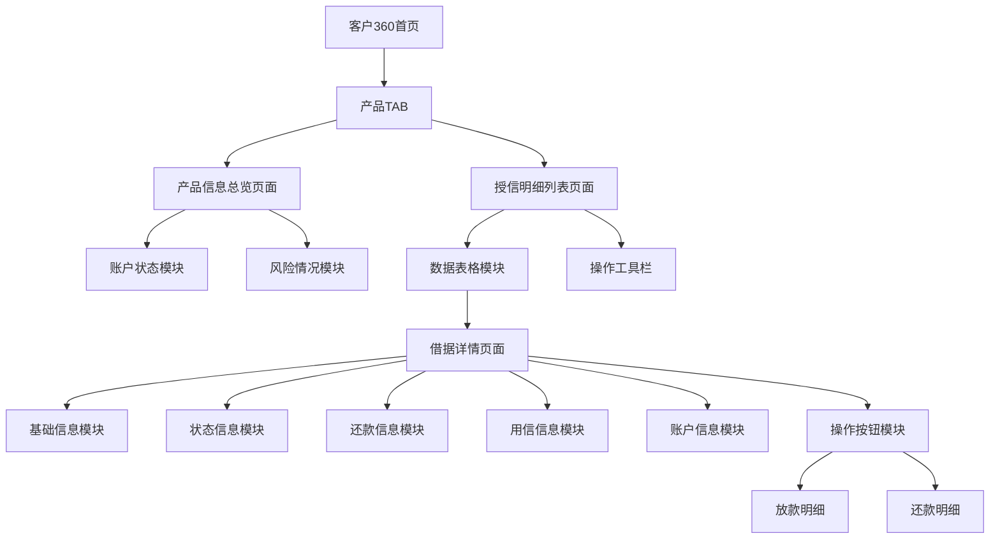

# 客户360产品TAB功能需求文档

## 1. 产品概述

客户360产品TAB功能旨在为业务人员提供客户与金融产品相关的全面信息视图，通过集中展示产品级客户信息总览和授信明细列表，实现客户产品维度的一站式查询和管理。

该功能解决了业务人员需要在多个系统间切换查看客户产品信息的痛点，提供统一的数据展示界面，提升工作效率和决策质量。

产品目标是成为金融机构客户关系管理的核心工具，支撑风险控制、营销决策和客户服务等关键业务场景。

## 2. 核心功能

### 2.1 用户角色

| 角色 | 注册方式 | 核心权限 |
|------|----------|----------|
| 业务人员 | 内部系统账号登录 | 查看客户产品信息、导出数据、查看授信明细 |
| 风控人员 | 内部系统账号登录 | 查看风险指标、逾期信息、历史记录分析 |
| 管理人员 | 内部系统账号登录 | 查看所有信息、数据统计分析、权限管理 |

### 2.2 功能模块

产品TAB功能包含以下核心页面：

1. **产品信息总览页面**：产品级客户信息汇总展示，账户状态统计，风险情况分析
2. **授信明细列表页面**：借据明细表格展示，数据筛选和排序，一键复制功能
3. **借据详情页面**：单笔借据完整信息展示，基础信息、状态信息、还款信息等

### 2.3 页面详情

| 页面名称 | 模块名称 | 功能描述 |
|----------|----------|----------|
| 产品信息总览页面 | 账户状态模块 | 展示当前总授信金额、总在贷余额、未结清借据笔数、最大期数、最早借款时间、已还本金、已还利息罚息、剩余应还本金、剩余应还利息、剩余应还罚息、剩余应还总额 |
| 产品信息总览页面 | 风险情况模块 | 展示历史最大逾期天数、当前逾期期数、当前总逾期金额等风险指标 |
| 授信明细列表页面 | 数据表格模块 | 展示产品名称、借据号、放款时间、借据状态、借款金额、期数、逾期天数、历史最大逾期天数，支持数据筛选和排序 |
| 授信明细列表页面 | 操作工具栏 | 提供数据日期显示、一键复制功能、详情查看按钮 |
| 借据详情页面 | 基础信息模块 | 展示产品名称、借据号、放款时间、借据状态、借款金额、期数、借款利率、当前期次、还款日 |
| 借据详情页面 | 状态信息模块 | 展示结清日期、逾期日期、是否核销、是否理赔 |
| 借据详情页面 | 还款信息模块 | 展示实际还款本金、实际还款利息、实际还款罚息、剩余本金、剩余罚息、剩余应还总额 |
| 借据详情页面 | 用信信息模块 | 展示用信单号、用信日期、用信结果、拒绝原因 |
| 借据详情页面 | 账户信息模块 | 展示银行卡号（脱敏显示） |
| 借据详情页面 | 操作按钮模块 | 提供放款明细查看、还款明细查看功能 |

## 3. 核心流程

**业务人员操作流程：**
1. 登录系统进入客户360页面
2. 选择产品TAB查看客户产品信息
3. 在产品信息总览页面查看账户状态和风险情况
4. 切换到授信明细列表查看具体借据信息
5. 点击详情按钮查看单笔借据完整信息
6. 使用一键复制功能导出数据
7. 查看放款明细和还款明细进行深入分析

**风控人员操作流程：**
1. 重点关注风险情况模块的逾期指标
2. 在授信明细列表中筛选逾期借据
3. 查看借据详情中的状态信息和还款信息
4. 分析历史最大逾期天数和当前逾期情况

## 4. 用户界面设计

### 4.1 设计风格

- **主色调**：#1890ff（蓝色）作为主色，#52c41a（绿色）表示正常状态，#ff4d4f（红色）表示风险状态
- **辅助色**：#f0f2f5（浅灰）作为背景色，#ffffff（白色）作为卡片背景
- **按钮样式**：圆角按钮设计，主要操作使用实心按钮，次要操作使用线框按钮
- **字体**：14px为主要文字大小，12px为辅助信息，16px为标题文字
- **布局风格**：卡片式布局，顶部导航+左右分栏结构
- **图标风格**：使用Arco Design图标库，简洁线性图标

### 4.2 页面设计概览

| 页面名称 | 模块名称 | UI元素 |
|----------|----------|--------|
| 产品信息总览页面 | 账户状态模块 | 使用Descriptions组件展示，4列布局，边框样式，标签颜色#666666，数值颜色#1890ff，金额字段右对齐 |
| 产品信息总览页面 | 风险情况模块 | 使用Card组件包装，Alert组件突出显示高风险项，逾期天数使用红色标识，正常状态使用绿色标识 |
| 授信明细列表页面 | 数据表格模块 | 使用Table组件，斑马纹样式，固定表头，支持排序，状态列使用Tag组件，金额列右对齐并格式化 |
| 授信明细列表页面 | 操作工具栏 | 使用Space组件布局，包含日期显示、复制按钮（#52c41a）、筛选器，右对齐布局 |
| 借据详情页面 | 抽屉弹窗 | 使用Drawer组件，宽度60%，包含多个Descriptions组件分组展示，底部操作按钮固定定位 |

### 4.3 响应式设计

产品采用桌面优先设计，支持1920px、1440px、1024px等主流分辨率。在小屏幕设备上，表格支持横向滚动，卡片布局自适应调整为单列显示，确保信息的可读性和操作的便利性。