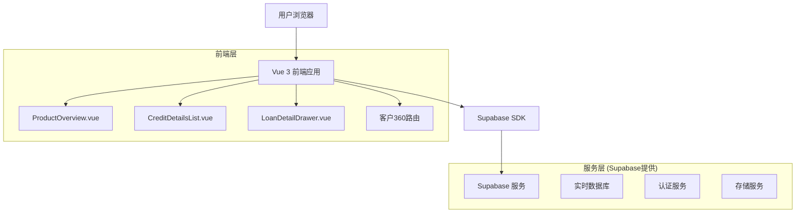
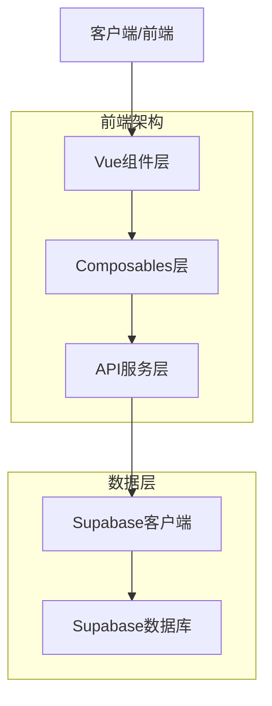
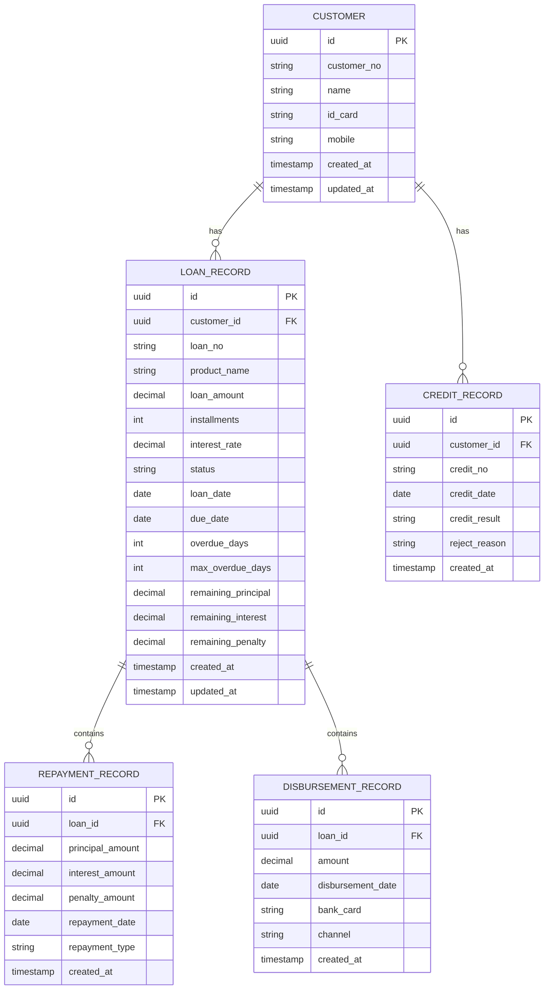

# 客户360产品TAB技术架构文档

## 1. 架构设计



## 2. 技术描述

* 前端：Vue 3 + Composition API + TypeScript + Arco Design + Vite

* 后端：Supabase (PostgreSQL + 实时订阅)

* 状态管理：Pinia

* 路由：Vue Router 4

## 3. 路由定义

| 路由                                    | 用途                |
| ------------------------------------- | ----------------- |
| /customer360/:userId                  | 客户360主页面，包含产品TAB  |
| /customer360/:userId/product-overview | 产品信息总览页面          |
| /customer360/:userId/credit-details   | 授信明细列表页面          |
| /customer360/:userId/loan/:loanId     | 借据详情页面（可选，用于直接访问） |

## 4. API定义

### 4.1 核心API

**获取客户产品总览信息**

```
GET /api/customer/:userId/product-overview
```

请求参数：

| 参数名    | 参数类型   | 是否必填 | 描述   |
| ------ | ------ | ---- | ---- |
| userId | string | true | 客户ID |

响应数据：

| 参数名           | 参数类型   | 描述     |
| ------------- | ------ | ------ |
| accountStatus | object | 账户状态信息 |
| riskInfo      | object | 风险情况信息 |

示例：

```json
{
  "accountStatus": {
    "totalCreditAmount": 500000,
    "totalLoanBalance": 300000,
    "unSettledLoanCount": 3,
    "maxInstallments": 36,
    "earliestLoanDate": "2022-01-15",
    "paidPrincipal": 200000,
    "paidInterestPenalty": 15000,
    "remainingPrincipal": 300000,
    "remainingInterest": 8000,
    "remainingPenalty": 2000,
    "remainingTotal": 310000
  },
  "riskInfo": {
    "maxOverdueDays": 15,
    "currentOverdueInstallments": 2,
    "totalOverdueAmount": 25000
  }
}
```

**获取授信明细列表**

```
GET /api/customer/:userId/credit-details
```

请求参数：

| 参数名      | 参数类型   | 是否必填  | 描述        |
| -------- | ------ | ----- | --------- |
| userId   | string | true  | 客户ID      |
| page     | number | false | 页码，默认1    |
| pageSize | number | false | 每页条数，默认20 |
| status   | string | false | 借据状态筛选    |

响应数据：

| 参数名        | 参数类型   | 描述     |
| ---------- | ------ | ------ |
| list       | array  | 借据列表   |
| total      | number | 总条数    |
| updateTime | string | 数据更新时间 |

**获取借据详情**

```
GET /api/loan/:loanId/detail
```

请求参数：

| 参数名    | 参数类型   | 是否必填 | 描述   |
| ------ | ------ | ---- | ---- |
| loanId | string | true | 借据ID |

响应数据：

| 参数名           | 参数类型   | 描述   |
| ------------- | ------ | ---- |
| basicInfo     | object | 基础信息 |
| statusInfo    | object | 状态信息 |
| repaymentInfo | object | 还款信息 |
| creditInfo    | object | 用信信息 |
| accountInfo   | object | 账户信息 |

## 5. 服务架构图



## 6. 数据模型

### 6.1 数据模型定义



### 6.2 数据定义语言

**客户表 (customers)**

```sql
-- 创建客户表
CREATE TABLE customers (
    id UUID PRIMARY KEY DEFAULT gen_random_uuid(),
    customer_no VARCHAR(50) UNIQUE NOT NULL,
    name VARCHAR(100) NOT NULL,
    id_card VARCHAR(18) NOT NULL,
    mobile VARCHAR(11) NOT NULL,
    created_at TIMESTAMP WITH TIME ZONE DEFAULT NOW(),
    updated_at TIMESTAMP WITH TIME ZONE DEFAULT NOW()
);

-- 创建索引
CREATE INDEX idx_customers_customer_no ON customers(customer_no);
CREATE INDEX idx_customers_id_card ON customers(id_card);
CREATE INDEX idx_customers_mobile ON customers(mobile);
```

**借据记录表 (loan\_records)**

```sql
-- 创建借据记录表
CREATE TABLE loan_records (
    id UUID PRIMARY KEY DEFAULT gen_random_uuid(),
    customer_id UUID NOT NULL REFERENCES customers(id),
    loan_no VARCHAR(50) UNIQUE NOT NULL,
    product_name VARCHAR(100) NOT NULL,
    loan_amount DECIMAL(15,2) NOT NULL,
    installments INTEGER NOT NULL,
    interest_rate DECIMAL(5,4) NOT NULL,
    status VARCHAR(20) NOT NULL CHECK (status IN ('未结清', '已结清', '逾期', '核销')),
    loan_date DATE NOT NULL,
    due_date DATE,
    overdue_days INTEGER DEFAULT 0,
    max_overdue_days INTEGER DEFAULT 0,
    remaining_principal DECIMAL(15,2) DEFAULT 0,
    remaining_interest DECIMAL(15,2) DEFAULT 0,
    remaining_penalty DECIMAL(15,2) DEFAULT 0,
    created_at TIMESTAMP WITH TIME ZONE DEFAULT NOW(),
    updated_at TIMESTAMP WITH TIME ZONE DEFAULT NOW()
);

-- 创建索引
CREATE INDEX idx_loan_records_customer_id ON loan_records(customer_id);
CREATE INDEX idx_loan_records_loan_no ON loan_records(loan_no);
CREATE INDEX idx_loan_records_status ON loan_records(status);
CREATE INDEX idx_loan_records_loan_date ON loan_records(loan_date DESC);
```

**还款记录表 (repayment\_records)**

```sql
-- 创建还款记录表
CREATE TABLE repayment_records (
    id UUID PRIMARY KEY DEFAULT gen_random_uuid(),
    loan_id UUID NOT NULL REFERENCES loan_records(id),
    principal_amount DECIMAL(15,2) NOT NULL DEFAULT 0,
    interest_amount DECIMAL(15,2) NOT NULL DEFAULT 0,
    penalty_amount DECIMAL(15,2) NOT NULL DEFAULT 0,
    repayment_date DATE NOT NULL,
    repayment_type VARCHAR(20) NOT NULL,
    created_at TIMESTAMP WITH TIME ZONE DEFAULT NOW()
);

-- 创建索引
CREATE INDEX idx_repayment_records_loan_id ON repayment_records(loan_id);
CREATE INDEX idx_repayment_records_date ON repayment_records(repayment_date DESC);
```

**放款记录表 (disbursement\_records)**

```sql
-- 创建放款记录表
CREATE TABLE disbursement_records (
    id UUID PRIMARY KEY DEFAULT gen_random_uuid(),
    loan_id UUID NOT NULL REFERENCES loan_records(id),
    amount DECIMAL(15,2) NOT NULL,
    disbursement_date DATE NOT NULL,
    bank_card VARCHAR(20),
    channel VARCHAR(50),
    created_at TIMESTAMP WITH TIME ZONE DEFAULT NOW()
);

-- 创建索引
CREATE INDEX idx_disbursement_records_loan_id ON disbursement_records(loan_id);
CREATE INDEX idx_disbursement_records_date ON disbursement_records(disbursement_date DESC);
```

**用信记录表 (credit\_records)**

```sql
-- 创建用信记录表
CREATE TABLE credit_records (
    id UUID PRIMARY KEY DEFAULT gen_random_uuid(),
    customer_id UUID NOT NULL REFERENCES customers(id),
    credit_no VARCHAR(50) NOT NULL,
    credit_date DATE NOT NULL,
    credit_result VARCHAR(20) NOT NULL,
    reject_reason TEXT,
    created_at TIMESTAMP WITH TIME ZONE DEFAULT NOW()
);

-- 创建索引
CREATE INDEX idx_credit_records_customer_id ON credit_records(customer_id);
CREATE INDEX idx_credit_records_date ON credit_records(credit_date DESC);
```

**权限设置**

```sql
-- 为匿名用户授予基本读取权限
GRANT SELECT ON customers TO anon;
GRANT SELECT ON loan_records TO anon;
GRANT SELECT ON repayment_records TO anon;
GRANT SELECT ON disbursement_records TO anon;
GRANT SELECT ON credit_records TO anon;

-- 为认证用户授予完整权限
GRANT ALL PRIVILEGES ON customers TO authenticated;
GRANT ALL PRIVILEGES ON loan_records TO authenticated;
GRANT ALL PRIVILEGES ON repayment_records TO authenticated;
GRANT ALL PRIVILEGES ON disbursement_records TO authenticated;
GRANT ALL PRIVILEGES ON credit_records TO authenticated;
```

**初始化数据**

```sql
-- 插入测试客户数据
INSERT INTO customers (customer_no, name, id_card, mobile) VALUES
('C001', '张三', '110101199001011234', '13800138001'),
('C002', '李四', '110101199002021234', '13800138002'),
('C003', '王五', '110101199003031234', '13800138003');

-- 插入测试借据数据
INSERT INTO loan_records (customer_id, loan_no, product_name, loan_amount, installments, interest_rate, status, loan_date, overdue_days, max_overdue_days, remaining_principal, remaining_interest, remaining_penalty)
SELECT 
    c.id,
    'LN' || LPAD((ROW_NUMBER() OVER())::text, 6, '0'),
    '个人消
```

