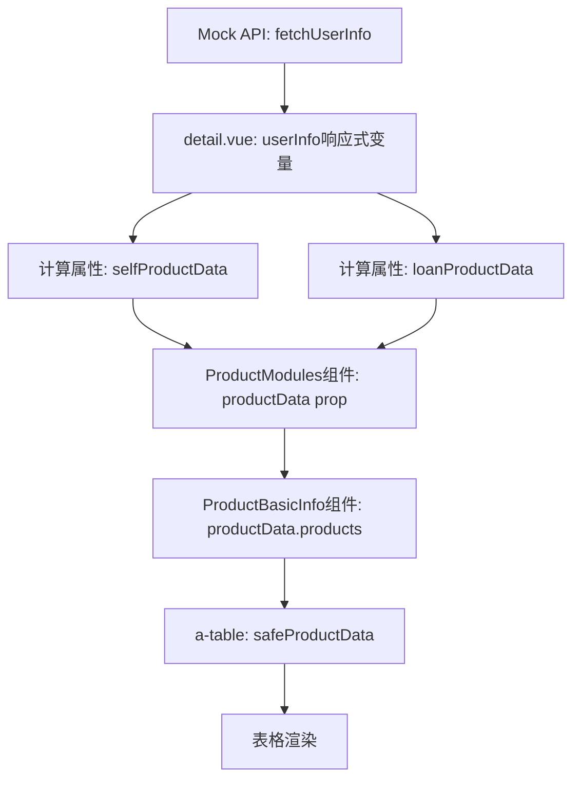

# 客户360产品信息模块技术分析文档

## 1. 前端页面显示结构分析

### 1.1 ProductModules组件结构

**文件位置**: `/src/pages/discovery/customer360/components/ProductModules.vue`

**组件功能**:
- 产品模块的主容器组件
- 提供标签页切换功能（基础信息、催收记录、征信记录、营销记录）
- 负责接收和传递产品数据到子组件

**Props接收**:
```javascript
props: {
  productType: String,        // 'self' 或 'loan'
  userInfo: Object,          // 用户信息对象
  productData: {             // 产品数据对象
    type: Object,
    default: () => ({
      products: [],            // 产品列表
      collections: [],         // 催收记录
      credits: [],            // 征信记录
      marketing: []           // 营销记录
    })
  },
  activeModule: String       // 当前激活模块
}
```

**数据传递机制**:
- 通过 `debugProductData` 计算属性监控数据变化
- 向 `ProductBasicInfo` 组件传递 `productData.products`
- 使用深度监听追踪 `productData` 和 `userInfo` 变化

### 1.2 ProductBasicInfo组件结构

**文件位置**: `/src/pages/discovery/customer360/components/ProductBasicInfo.vue`

**组件功能**:
- 显示产品基础信息表格
- 根据产品类型（自营/助贷）显示不同列
- 提供数据复制和选择功能

**Props接收**:
```javascript
props: {
  productType: String,       // 'self' 或 'loan'
  productData: {             // 产品数据数组
    type: Array,
    default: () => []
  },
  userInfo: Object          // 用户信息对象
}
```

**表格列定义**:
- **自营产品**: 产品编号、产品名称、余额、状态、币种、最后交易日、利率
- **助贷产品**: 产品编号、产品名称、余额、状态、币种、利率、剩余期数、下次还款日

**数据安全处理**:
```javascript
const safeProductData = computed(() => {
  const data = props.productData || []
  return data
})
```

### 1.3 数据绑定和Props传递机制

**父组件 detail.vue 传递数据**:
```vue
<ProductModules 
  :product-type="'self'" 
  :user-info="userInfo" 
  :product-data="selfProductData"
  :active-module="activeModules.self"
  @module-change="(module) => handleModuleChange('self', module)"
  @debug-info="handleDebugInfo"
/>
```

**数据流向**:
1. `detail.vue` → `ProductModules` → `ProductBasicInfo`
2. 数据经过计算属性 `selfProductData`/`loanProductData` 处理
3. `ProductModules` 接收 `productData` 对象
4. `ProductBasicInfo` 接收 `productData.products` 数组

### 1.4 条件渲染逻辑

**主要条件**:
- `v-else-if="userInfo && !userInfo.error"` - 确保用户数据存在且无错误
- 产品统计显示: `{{ selfProductData?.products?.length || 0 }}个`
- 表格数据渲染: 依赖 `safeProductData` 计算属性

## 2. 后端Mock数据API分析

### 2.1 用户887123完整数据结构

**文件位置**: `/src/mock/customer360.ts`

**基础信息**:
```javascript
'887123': {
  userId: '887123',
  name: '张*',
  basicInfo: {
    name: '张*',
    age: 35,
    gender: '男',
    idCard: '320*******123X',
    phone: '159****5678',
    email: 'zhang@example.com',
    address: '上海市浦东新区',
    customerNo: 'KH100100022002',
    idExpiry: '2028-05-20',
    status: '正常',
    joinDate: '2020-03-10',
    customerLevel: '普通客户'
  }
}
```

### 2.2 产品数据字段定义

**存款产品 (depositProducts)**:
```javascript
depositProducts: [
  {
    productKey: 'regular-887123',
    name: '活期存款',
    balance: 20000.00,
    currency: 'CNY',
    status: '正常',
    rate: 0.30,
    lastTransaction: '2024-09-20'
  }
]
```

**贷款产品 (loanProducts)**:
```javascript
loanProducts: [
  {
    productKey: 'consumer-887123',
    name: '个人消费贷款',
    balance: 30000.00,
    currency: 'CNY',
    status: '正常',
    rate: 4.35,
    remainingPeriod: 18,
    totalPeriod: 24,
    nextPaymentDate: '2024-02-15'
  }
]
```

**其他相关数据**:
```javascript
// 催收记录
collectionRecords: [{ id, collectionDate, collectionMethod, ... }]

// 征信记录
creditsList: [{ creditNo, creditDate, productName, ... }]

// 营销记录
marketingRecords: {
  touchRecords: [{ id, touchDate, touchChannel, ... }],
  benefitRecords: [{ id, benefitDate, benefitType, ... }]
}

// 调额历史
quotaAdjustHistory: [{ customerNo, adjustDate, beforeAmount, afterAmount, ... }]
```

### 2.3 API返回格式和字段映射

**API函数**: `fetchUserInfo(userId: string)`

**返回数据验证**:
```javascript
export const fetchUserInfo = (userId: string): Promise<any> => {
  return new Promise((resolve) => {
    setTimeout(() => {
      const userData = mockUsers[userId];
      if (userData) {
        // 详细的数据结构验证
        console.debug('[数据完整性检查] 用户数据结构:', {
          userId: userId,
          dataKeys: Object.keys(userData),
          hasBasicInfo: !!(userData.name && userData.age && userData.gender),
          depositProductsCount: userData.depositProducts?.length,
          loanProductsCount: userData.loanProducts?.length,
          // ... 更多验证
        });
        resolve(userData);
      } else {
        resolve({ error: 'USER_NOT_FOUND', message: '用户不存在' });
      }
    }, 500);
  });
}
```

## 3. 数据流分析

### 3.1 完整数据流路径



### 3.2 计算属性处理逻辑

**selfProductData计算属性**:
```javascript
const selfProductData = computed(() => {
  if (!userInfo.value || userInfo.value.error) {
    return null
  }
  
  return {
    products: userInfo.value.depositProducts || [],      // ✅ 正确映射
    collections: userInfo.value.collectionRecords || [], // ✅ 正确映射
    credits: userInfo.value.creditsList || [],           // ✅ 正确映射
    marketing: userInfo.value.marketingRecords?.touchRecords || [] // ✅ 正确映射
  }
})
```

**loanProductData计算属性**:
```javascript
const loanProductData = computed(() => {
  if (!userInfo.value || userInfo.value.error) {
    return null
  }
  
  return {
    products: userInfo.value.loanProducts || [],         // ✅ 正确映射
    collections: userInfo.value.collectionRecords || [], // ✅ 正确映射
    credits: userInfo.value.creditsList || [],           // ✅ 正确映射
    marketing: userInfo.value.marketingRecords?.benefitRecords || [] // ✅ 正确映射
  }
})
```

### 3.3 数据传递过程中的转换和映射

**关键转换点**:
1. **API → userInfo**: 直接赋值，保持原始数据结构
2. **userInfo → productData**: 通过计算属性重新组织数据结构
3. **productData → ProductModules**: 作为props传递对象
4. **ProductModules → ProductBasicInfo**: 传递 `productData.products` 数组
5. **ProductBasicInfo → Table**: 通过 `safeProductData` 计算属性确保数据安全

## 4. 问题诊断

### 4.1 产品统计显示正确但列表内容为空的根本原因

**问题现象**:
- 显示"自营产品: 1个"、"助贷产品: 1个" ✅
- 但ProductBasicInfo表格内容为空 ❌

**根本原因分析**:

1. **数据结构映射正确**: 
   - Mock数据中 `depositProducts` 和 `loanProducts` 字段存在
   - 计算属性 `selfProductData` 和 `loanProductData` 映射正确
   - 统计数量计算正确: `selfProductData?.products?.length || 0`

2. **可能的问题点**:
   - **Props传递问题**: `ProductModules` 向 `ProductBasicInfo` 传递数据时可能存在问题
   - **响应式更新问题**: 数据更新后组件未正确重新渲染
   - **表格数据绑定问题**: `a-table` 的 `:data` 绑定可能存在问题

### 4.2 前端期望vs实际API返回格式的差异

**前端期望的数据格式**:
```javascript
// ProductBasicInfo组件期望接收
productData: [
  {
    productKey: string,
    name: string,
    balance: number,
    currency: string,
    status: string,
    rate: number,
    // 自营产品特有
    lastTransaction?: string,
    // 助贷产品特有
    remainingPeriod?: number,
    totalPeriod?: number,
    nextPaymentDate?: string
  }
]
```

**实际API返回格式**:
```javascript
// Mock API返回的格式
{
  depositProducts: [{ productKey, name, balance, currency, status, rate, lastTransaction }],
  loanProducts: [{ productKey, name, balance, currency, status, rate, remainingPeriod, totalPeriod, nextPaymentDate }]
}
```

**格式匹配度**: ✅ **完全匹配** - 数据格式没有问题

### 4.3 字段映射不匹配的具体位置

经过分析，字段映射是正确的，问题可能在于:

1. **组件渲染时机**: 数据更新和组件渲染的时机不同步
2. **Props传递链**: `ProductModules` → `ProductBasicInfo` 的数据传递可能存在问题
3. **响应式数据更新**: Vue的响应式系统可能未正确检测到数据变化

## 5. 修复方案

### 5.1 具体的代码修改建议

#### 修复1: 优化ProductModules组件的数据传递

```vue
<!-- ProductModules.vue -->
<template>
  <div class="module-content">
    <ProductBasicInfo 
      :product-type="productType" 
      :product-data="safeProducts" 
      :user-info="userInfo"
      @debug-info="handleDebugInfo"
    />
  </div>
</template>

<script setup>
// 添加安全的产品数据计算属性
const safeProducts = computed(() => {
  const products = props.productData?.products || []
  console.log('🛡️ [ProductModules] safeProducts:', {
    productType: props.productType,
    originalProducts: props.productData?.products,
    safeProducts: products,
    length: products.length
  })
  return products
})
</script>
```

#### 修复2: 增强ProductBasicInfo组件的数据处理

```vue
<!-- ProductBasicInfo.vue -->
<script setup>
// 增强数据监听和调试
watch(() => props.productData, (newData, oldData) => {
  console.log('🔍 [ProductBasicInfo] productData变化详情:', {
    productType: props.productType,
    newData,
    oldData,
    isArray: Array.isArray(newData),
    length: newData?.length || 0,
    hasData: !!(newData && newData.length > 0),
    firstItem: newData?.[0],
    dataChanged: JSON.stringify(newData) !== JSON.stringify(oldData)
  })
}, { immediate: true, deep: true })

// 强制响应式更新
const forceUpdate = ref(0)
const safeProductData = computed(() => {
  forceUpdate.value // 触发响应式依赖
  const data = props.productData || []
  console.log('🛡️ [ProductBasicInfo] safeProductData计算:', {
    productType: props.productType,
    originalData: props.productData,
    isArray: Array.isArray(props.productData),
    length: data.length,
    safeData: data,
    hasData: data.length > 0
  })
  return data
})

// 监听数据变化时强制更新
watch(() => props.productData, () => {
  forceUpdate.value++
}, { deep: true })
</script>
```

#### 修复3: 优化detail.vue中的数据更新机制

```javascript
// detail.vue
const updateUserInfo = (newUserInfo) => {
  console.log('🔄 [detail.vue] 更新userInfo:', newUserInfo)
  
  // 使用nextTick确保DOM更新
  nextTick(() => {
    userInfo.value = newUserInfo
    
    // 强制触发计算属性重新计算
    console.log('🔄 强制触发计算属性重新计算')
    console.log('selfProductData:', selfProductData.value)
    console.log('loanProductData:', loanProductData.value)
  })
}
```

### 5.2 数据结构调整方案

**无需调整** - 当前数据结构是正确的，问题在于数据传递和响应式更新。

### 5.3 测试验证步骤

#### 步骤1: 验证数据获取
```javascript
// 在浏览器控制台执行
console.log('用户数据:', userInfo.value)
console.log('自营产品数据:', selfProductData.value)
console.log('助贷产品数据:', loanProductData.value)
```

#### 步骤2: 验证组件接收
```javascript
// 在ProductModules组件中添加调试
console.log('ProductModules接收到的productData:', props.productData)
console.log('ProductModules传递给ProductBasicInfo的数据:', props.productData?.products)
```

#### 步骤3: 验证表格渲染
```javascript
// 在ProductBasicInfo组件中添加调试
console.log('ProductBasicInfo接收到的productData:', props.productData)
console.log('safeProductData计算结果:', safeProductData.value)
```

#### 步骤4: 验证修复效果
1. 打开客户360页面
2. 搜索用户887123
3. 检查产品信息模块
4. 确认统计数量和列表内容都正确显示
5. 切换自营/助贷产品标签页
6. 验证数据正确切换

## 6. 总结

### 6.1 技术架构总结

- **数据层**: Mock API提供标准化的用户数据
- **状态层**: Vue响应式系统管理数据状态
- **计算层**: 计算属性处理数据转换和映射
- **组件层**: 组件树负责数据传递和渲染
- **表现层**: Arco Design表格组件展示数据

### 6.2 问题根因

问题不在于数据结构或字段映射，而在于:
1. 组件间数据传递的响应式更新机制
2. Vue组件的渲染时机和数据同步
3. 可能存在的异步数据更新问题

### 6.3 修复策略

1. **增强数据传递安全性**: 添加安全检查和默认值
2. **优化响应式更新**: 使用强制更新机制确保数据同步
3. **完善调试日志**: 添加详细的数据流追踪
4. **改进错误处理**: 增加异常情况的处理逻辑

通过以上分析和修复方案，应该能够解决产品信息模块显示问题，确保用户887123的产品数据能够正确展示。