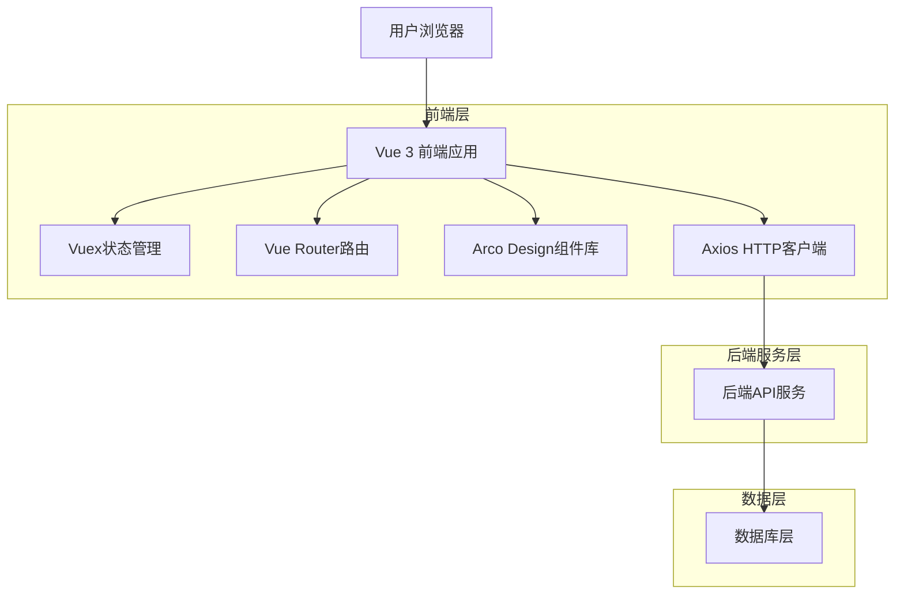
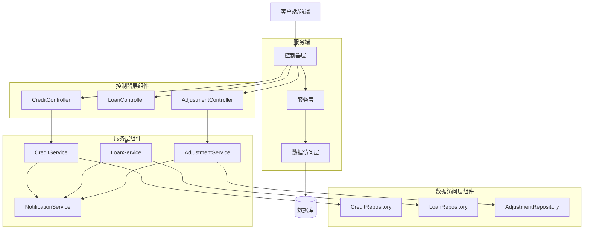
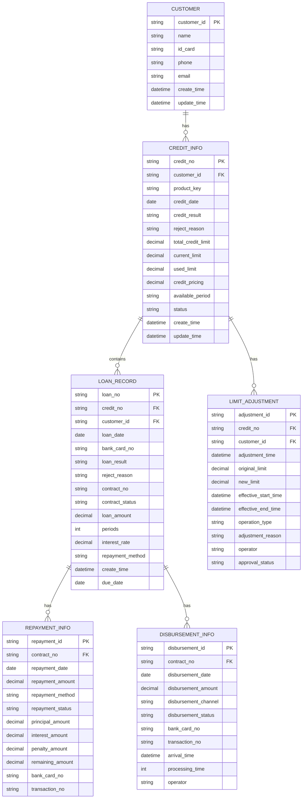

# 客户360授信信息模块技术架构文档

## 1. 架构设计



## 2. 技术描述

- **前端**：Vue 3 + Composition API + TypeScript + Vite + Arco Design + Vuex
- **状态管理**：Vuex 4
- **路由管理**：Vue Router 4
- **HTTP客户端**：Axios
- **构建工具**：Vite
- **开发语言**：TypeScript + JavaScript

## 3. 路由定义

| 路由 | 用途 |
|------|------|
| /customer/:id | 客户详情页面，包含授信信息模块 |
| /customer/:id/credit | 授信信息详情页面 |
| /customer/:id/loans | 用信列表页面 |
| /customer/:id/adjustments | 调额历史页面 |

## 4. API定义

### 4.1 核心API

#### 授信信息查询
```
GET /api/customers/{customerId}/credit-info
```

**请求参数：**
| 参数名 | 参数类型 | 是否必需 | 描述 |
|--------|----------|----------|------|
| customerId | string | true | 客户ID |
| productKey | string | false | 产品标识，不传则返回所有产品 |

**响应：**
| 参数名 | 参数类型 | 描述 |
|--------|----------|------|
| success | boolean | 请求是否成功 |
| data | CreditInfo | 授信信息对象 |
| message | string | 响应消息 |

**示例：**
```json
{
  "success": true,
  "data": {
    "creditNo": "CR202401001",
    "creditDate": "2024-01-15",
    "creditResult": "通过",
    "rejectReason": null,
    "totalCreditLimit": 500000,
    "currentLimit": 450000,
    "usedLimit": 50000,
    "creditPricing": 0.0485,
    "availablePeriod": "2024-01-15至2025-01-15",
    "productKey": "loan_001",
    "status": "active",
    "createTime": "2024-01-15T10:30:00Z",
    "updateTime": "2024-01-15T10:30:00Z"
  },
  "message": "查询成功"
}
```

#### 用信列表查询
```
GET /api/customers/{customerId}/loan-records
```

**请求参数：**
| 参数名 | 参数类型 | 是否必需 | 描述 |
|--------|----------|----------|------|
| customerId | string | true | 客户ID |
| productKey | string | false | 产品标识 |
| page | number | false | 页码，默认1 |
| pageSize | number | false | 每页数量，默认20 |
| status | string | false | 借据状态筛选 |
| startDate | string | false | 开始日期 |
| endDate | string | false | 结束日期 |

**响应：**
```json
{
  "success": true,
  "data": {
    "records": [
      {
        "loanNo": "LN202401001",
        "loanDate": "2024-01-20",
        "bankCardNo": "****1234",
        "loanResult": "成功",
        "rejectReason": null,
        "contractNo": "CT202401001",
        "contractStatus": "正常",
        "loanAmount": 100000,
        "periods": 12,
        "productKey": "loan_001",
        "interestRate": 0.048,
        "repaymentMethod": "等额本息",
        "createTime": "2024-01-20T09:00:00Z",
        "dueDate": "2025-01-20T00:00:00Z"
      }
    ],
    "total": 1,
    "page": 1,
    "pageSize": 20
  },
  "message": "查询成功"
}
```

#### 调额历史查询
```
GET /api/customers/{customerId}/limit-adjustments
```

**请求参数：**
| 参数名 | 参数类型 | 是否必需 | 描述 |
|--------|----------|----------|------|
| customerId | string | true | 客户ID |
| productKey | string | false | 产品标识 |
| operationType | string | false | 操作类型筛选 |
| startDate | string | false | 开始日期 |
| endDate | string | false | 结束日期 |

**响应：**
```json
{
  "success": true,
  "data": [
    {
      "creditNo": "CR202401001",
      "adjustmentTime": "2024-02-01T10:30:00Z",
      "originalLimit": 300000,
      "newLimit": 500000,
      "effectiveStartTime": "2024-02-01T00:00:00Z",
      "effectiveEndTime": "2025-02-01T00:00:00Z",
      "operationType": "提额",
      "adjustmentReason": "客户信用良好，主动提额",
      "operator": "系统自动",
      "approvalStatus": "已生效",
      "productKey": "loan_001"
    }
  ],
  "message": "查询成功"
}
```

#### 还款信息查询
```
GET /api/customers/{customerId}/repayment-info/{contractNo}
```

**响应：**
```json
{
  "success": true,
  "data": [
    {
      "repaymentId": "RP202401001",
      "contractNo": "CT202401001",
      "repaymentDate": "2024-02-20",
      "repaymentAmount": 8500,
      "repaymentMethod": "银行卡代扣",
      "repaymentStatus": "成功",
      "principalAmount": 8000,
      "interestAmount": 500,
      "penaltyAmount": 0,
      "remainingAmount": 92000,
      "bankCardNo": "****1234",
      "transactionNo": "TXN202402001"
    }
  ],
  "message": "查询成功"
}
```

#### 放款信息查询
```
GET /api/customers/{customerId}/disbursement-info/{contractNo}
```

**响应：**
```json
{
  "success": true,
  "data": [
    {
      "disbursementId": "DS202401001",
      "contractNo": "CT202401001",
      "disbursementDate": "2024-01-20",
      "disbursementAmount": 100000,
      "disbursementChannel": "银行转账",
      "disbursementStatus": "成功",
      "bankCardNo": "****1234",
      "transactionNo": "TXN202401001",
      "arrivalTime": "2024-01-20T15:30:00Z",
      "processingTime": 30,
      "operator": "系统自动"
    }
  ],
  "message": "查询成功"
}
```

## 5. 服务架构图



## 6. 数据模型

### 6.1 数据模型定义



### 6.2 数据定义语言

#### 授信信息表 (credit_info)
```sql
-- 创建授信信息表
CREATE TABLE credit_info (
    credit_no VARCHAR(50) PRIMARY KEY COMMENT '授信单号',
    customer_id VARCHAR(50) NOT NULL COMMENT '客户ID',
    product_key VARCHAR(50) NOT NULL COMMENT '产品标识',
    credit_date DATE NOT NULL COMMENT '授信日期',
    credit_result VARCHAR(20) NOT NULL COMMENT '授信结果',
    reject_reason TEXT COMMENT '拒绝原因',
    total_credit_limit DECIMAL(15,2) NOT NULL COMMENT '总授信额度',
    current_limit DECIMAL(15,2) NOT NULL COMMENT '当前额度',
    used_limit DECIMAL(15,2) DEFAULT 0 COMMENT '已用额度',
    credit_pricing DECIMAL(8,6) NOT NULL COMMENT '授信定价',
    available_period VARCHAR(100) NOT NULL COMMENT '可用期限',
    status VARCHAR(20) DEFAULT 'active' COMMENT '状态',
    create_time TIMESTAMP DEFAULT CURRENT_TIMESTAMP COMMENT '创建时间',
    update_time TIMESTAMP DEFAULT CURRENT_TIMESTAMP ON UPDATE CURRENT_TIMESTAMP COMMENT '更新时间'
) COMMENT='授信信息表';

-- 创建索引
CREATE INDEX idx_credit_customer_id ON credit_info(customer_id);
CREATE INDEX idx_credit_product_key ON credit_info(product_key);
CREATE INDEX idx_credit_date ON credit_info(credit_date DESC);
CREATE INDEX idx_credit_status ON credit_info(status);
```

#### 用信记录表 (loan_record)
```sql
-- 创建用信记录表
CREATE TABLE loan_record (
    loan_no VARCHAR(50) PRIMARY KEY COMMENT '用信单号',
    credit_no VARCHAR(50) NOT NULL COMMENT '授信单号',
    customer_id VARCHAR(50) NOT NULL COMMENT '客户ID',
    loan_date DATE NOT NULL COMMENT '用信日期',
    bank_card_no VARCHAR(50) NOT NULL COMMENT '银行卡号',
    loan_result VARCHAR(20) NOT NULL COMMENT '用信结果',
    reject_reason TEXT COMMENT '拒绝原因',
    contract_no VARCHAR(50) NOT NULL COMMENT '借据号',
    contract_status VARCHAR(20) NOT NULL COMMENT '借据状态',
    loan_amount DECIMAL(15,2) NOT NULL COMMENT '借款金额',
    periods INT NOT NULL COMMENT '期数',
    interest_rate DECIMAL(8,6) NOT NULL COMMENT '利率',
    repayment_method VARCHAR(50) NOT NULL COMMENT '还款方式',
    create_time TIMESTAMP DEFAULT CURRENT_TIMESTAMP COMMENT '创建时间',
    due_date DATE NOT NULL COMMENT '到期时间',
    FOREIGN KEY (credit_no) REFERENCES credit_info(credit_no)
) COMMENT='用信记录表';

-- 创建索引
CREATE INDEX idx_loan_customer_id ON loan_record(customer_id);
CREATE INDEX idx_loan_credit_no ON loan_record(credit_no);
CREATE INDEX idx_loan_date ON loan_record(loan_date DESC);
CREATE INDEX idx_loan_status ON loan_record(contract_status);
CREATE INDEX idx_loan_contract_no ON loan_record(contract_no);
```

#### 调额历史表 (limit_adjustment)
```sql
-- 创建调额历史表
CREATE TABLE limit_adjustment (
    adjustment_id VARCHAR(50) PRIMARY KEY COMMENT '调额ID',
    credit_no VARCHAR(50) NOT NULL COMMENT '授信单号',
    customer_id VARCHAR(50) NOT NULL COMMENT '客户ID',
    adjustment_time TIMESTAMP NOT NULL COMMENT '调整时间',
    original_limit DECIMAL(15,2) NOT NULL COMMENT '原授信额度',
    new_limit DECIMAL(15,2) NOT NULL COMMENT '调整后授信额度',
    effective_start_time TIMESTAMP NOT NULL COMMENT '生效起始时间',
    effective_end_time TIMESTAMP NOT NULL COMMENT '生效结束时间',
    operation_type VARCHAR(20) NOT NULL COMMENT '操作类型',
    adjustment_reason TEXT COMMENT '调整原因',
    operator VARCHAR(50) NOT NULL COMMENT '操作人员',
    approval_status VARCHAR(20) NOT NULL COMMENT '审批状态',
    FOREIGN KEY (credit_no) REFERENCES credit_info(credit_no)
) COMMENT='调额历史表';

-- 创建索引
CREATE INDEX idx_adjustment_customer_id ON limit_adjustment(customer_id);
CREATE INDEX idx_adjustment_credit_no ON limit_adjustment(credit_no);
CREATE INDEX idx_adjustment_time ON limit_adjustment(adjustment_time DESC);
CREATE INDEX idx_adjustment_type ON limit_adjustment(operation_type);
```

#### 还款信息表 (repayment_info)
```sql
-- 创建还款信息表
CREATE TABLE repayment_info (
    repayment_id VARCHAR(50) PRIMARY KEY COMMENT '还款ID',
    contract_no VARCHAR(50) NOT NULL COMMENT '借据号',
    repayment_date DATE NOT NULL COMMENT '还款日期',
    repayment_amount DECIMAL(15,2) NOT NULL COMMENT '还款金额',
    repayment_method VARCHAR(50) NOT NULL COMMENT '还款方式',
    repayment_status VARCHAR(20) NOT NULL COMMENT '还款状态',
    principal_amount DECIMAL(15,2) NOT NULL COMMENT '本金金额',
    interest_amount DECIMAL(15,2) NOT NULL COMMENT '利息金额',
    penalty_amount DECIMAL(15,2) DEFAULT 0 COMMENT '罚息金额',
    remaining_amount DECIMAL(15,2) NOT NULL COMMENT '剩余金额',
    bank_card_no VARCHAR(50) NOT NULL COMMENT '还款银行卡号',
    transaction_no VARCHAR(50) NOT NULL COMMENT '交易流水号',
    FOREIGN KEY (contract_no) REFERENCES loan_record(contract_no)
) COMMENT='还款信息表';

-- 创建索引
CREATE INDEX idx_repayment_contract_no ON repayment_info(contract_no);
CREATE INDEX idx_repayment_date ON repayment_info(repayment_date DESC);
CREATE INDEX idx_repayment_status ON repayment_info(repayment_status);
CREATE INDEX idx_repayment_transaction_no ON repayment_info(transaction_no);
```

#### 放款信息表 (disbursement_info)
```sql
-- 创建放款信息表
CREATE TABLE disbursement_info (
    disbursement_id VARCHAR(50) PRIMARY KEY COMMENT '放款ID',
    contract_no VARCHAR(50) NOT NULL COMMENT '借据号',
    disbursement_date DATE NOT NULL COMMENT '放款日期',
    disbursement_amount DECIMAL(15,2) NOT NULL COMMENT '放款金额',
    disbursement_channel VARCHAR(50) NOT NULL COMMENT '放款渠道',
    disbursement_status VARCHAR(20) NOT NULL COMMENT '放款状态',
    bank_card_no VARCHAR(50) NOT NULL COMMENT '收款银行卡号',
    transaction_no VARCHAR(50) NOT NULL COMMENT '交易流水号',
    arrival_time TIMESTAMP COMMENT '到账时间',
    processing_time INT COMMENT '处理时长(分钟)',
    operator VARCHAR(50) NOT NULL COMMENT '操作人员',
    FOREIGN KEY (contract_no) REFERENCES loan_record(contract_no)
) COMMENT='放款信息表';

-- 创建索引
CREATE INDEX idx_disbursement_contract_no ON disbursement_info(contract_no);
CREATE INDEX idx_disbursement_date ON disbursement_info(disbursement_date DESC);
CREATE INDEX idx_disbursement_status ON disbursement_info(disbursement_status);
CREATE INDEX idx_disbursement_transaction_no ON disbursement_info(transaction_no);
```

#### 初始化数据
```sql
-- 插入测试授信信息
INSERT INTO credit_info (
    credit_no, customer_id, product_key, credit_date, credit_result,
    total_credit_limit, current_limit, used_limit, credit_pricing, available_period
) VALUES 
('CR202401001', 'CUST001', 'loan_001', '2024-01-15', '通过', 
 500000, 450000, 50000, 0.0485, '2024-01-15至2025-01-15'),
('CR202401002', 'CUST002', 'loan_002', '2024-01-16', '拒绝', 
 0, 0, 0, 0, '', '征信不良'),
('CR202401003', 'CUST003', 'credit_card_001', '2024-01-17', '通过', 
 100000, 100000, 0, 0.0520, '2024-01-17至2025-01-17');

-- 插入测试用信记录
INSERT INTO loan_record (
    loan_no, credit_no, customer_id, loan_date, bank_card_no, loan_result,
    contract_no, contract_status, loan_amount, periods, interest_rate, repayment_method, due_date
) VALUES 
('LN202401001', 'CR202401001', 'CUST001', '2024-01-20', '****1234', '成功',
 'CT202401001', '正常', 100000, 12, 0.048, '等额本息', '2025-01-20'),
('LN202401002', 'CR202401001', 'CUST001', '2024-02-15', '****1234', '成功',
 'CT202401002', '正常', 50000, 6, 0.048, '等额本息', '2024-08-15');

-- 插入测试调额历史
INSERT INTO limit_adjustment (
    adjustment_id, credit_no, customer_id, adjustment_time, original_limit, new_limit,
    effective_start_time, effective_end_time, operation_type, adjustment_reason, operator, approval_status
) VALUES 
('ADJ202401001', 'CR202401001', 'CUST001', '2024-02-01 10:30:00', 300000, 500000,
 '2024-02-01 00:00:00', '2025-02-01 00:00:00', '提额', '客户信用良好，主动提额', '系统自动', '已生效');

-- 插入测试还款信息
INSERT INTO repayment_info (
    repayment_id, contract_no, repayment_date, repayment_amount, repayment_method,
    repayment_status, principal_amount, interest_amount, penalty_amount, remaining_amount,
    bank_card_no, transaction_no
) VALUES 
('RP202401001', 'CT202401001', '2024-02-20', 8500, '银行卡代扣',
 '成功', 8000, 500, 0, 92000, '****1234', 'TXN202402001');

-- 插入测试放款信息
INSERT INTO disbursement_info (
    disbursement_id, contract_no, disbursement_date, disbursement_amount, disbursement_channel,
    disbursement_status, bank_card_no, transaction_no, arrival_time, processing_time, operator
) VALUES 
('DS202401001', 'CT202401001', '2024-01-20', 100000, '银行转账',
 '成功', '****1234', 'TXN202401001', '2024-01-20 15:30:00', 30, '系统自动');
```

## 7. 前端组件架构

### 7.1 组件层次结构

```
CreditInfoModule/
├── CreditInfoCard.vue          # 授信信息卡片
├── LoanRecordTable.vue         # 用信列表表格
├── LimitAdjustmentTable.vue    # 调额历史表格
├── RepaymentDrawer.vue         # 还款信息抽屉
├── DisbursementDrawer.vue      # 放款信息抽屉
├── components/
│   ├── CreditStatusTag.vue     # 授信状态标签
│   ├── LoanStatusTag.vue       # 借据状态标签
│   ├── AmountDisplay.vue       # 金额显示组件
│   ├── DateRangePicker.vue     # 日期范围选择器
│   └── DataExporter.vue        # 数据导出组件
├── composables/
│   ├── useCreditInfo.js        # 授信信息逻辑
│   ├── useLoanRecords.js       # 用信记录逻辑
│   ├── useLimitAdjustments.js  # 调额历史逻辑
│   └── useDataExport.js        # 数据导出逻辑
└── types/
    ├── credit.ts               # 授信相关类型定义
    ├── loan.ts                 # 用信相关类型定义
    └── adjustment.ts           # 调额相关类型定义
```

### 7.2 状态管理结构

```javascript
// store/modules/creditInfo.js
const creditInfoModule = {
  namespaced: true,
  state: {
    creditInfo: null,
    loanRecords: [],
    limitAdjustments: [],
    repaymentInfo: [],
    disbursementInfo: [],
    loading: {
      creditInfo: false,
      loanRecords: false,
      limitAdjustments: false,
      repaymentInfo: false,
      disbursementInfo: false
    },
    filters: {
      loanStatus: '',
      dateRange: [],
      operationType: ''
    },
    pagination: {
      loanRecords: { page: 1, pageSize: 20, total: 0 },
      limitAdjustments: { page: 1, pageSize: 20, total: 0 }
    }
  },
  mutations: {
    SET_CREDIT_INFO(state, creditInfo) {
      state.creditInfo = creditInfo
    },
    SET_LOAN_RECORDS(state, { records, total }) {
      state.loanRecords = records
      state.pagination.loanRecords.total = total
    },
    SET_LIMIT_ADJUSTMENTS(state, adjustments) {
      state.limitAdjustments = adjustments
    },
    SET_LOADING(state, { type, loading }) {
      state.loading[type] = loading
    },
    UPDATE_FILTERS(state, filters) {
      state.filters = { ...state.filters, ...filters }
    },
    UPDATE_PAGINATION(state, { type, pagination }) {
      state.pagination[type] = { ...state.pagination[type], ...pagination }
    }
  },
  actions: {
    async fetchCreditInfo({ commit }, { customerId, productKey }) {
      commit('SET_LOADING', { type: 'creditInfo', loading: true })
      try {
        const response = await api.getCreditInfo(customerId, productKey)
        commit('SET_CREDIT_INFO', response.data)
      } catch (error) {
        console.error('获取授信信息失败:', error)
      } finally {
        commit('SET_LOADING', { type: 'creditInfo', loading: false })
      }
    },
    async fetchLoanRecords({ commit, state }, { customerId, productKey }) {
      commit('SET_LOADING', { type: 'loanRecords', loading: true })
      try {
        const params = {
          customerId,
          productKey,
          ...state.filters,
          ...state.pagination.loanRecords
        }
        const response = await api.getLoanRecords(params)
        commit('SET_LOAN_RECORDS', response.data)
      } catch (error) {
        console.error('获取用信记录失败:', error)
      } finally {
        commit('SET_LOADING', { type: 'loanRecords', loading: false })
      }
    }
  },
  getters: {
    availableCredit: (state) => {
      if (!state.creditInfo) return 0
      return state.creditInfo.currentLimit - state.creditInfo.usedLimit
    },
    creditUtilization: (state) => {
      if (!state.creditInfo || state.creditInfo.currentLimit === 0) return 0
      return (state.creditInfo.usedLimit / state.creditInfo.currentLimit * 100).toFixed(2)
    },
    activeLoanCount: (state) => {
      return state.loanRecords.filter(record => record.contractStatus === '正常').length
    }
  }
}
```

## 8. 性能优化策略

### 8.1 前端性能优化

1. **组件懒加载**
```javascript
// 路由懒加载
const CreditInfoModule = () => import('@/views/CreditInfoModule.vue')

// 组件懒加载
const RepaymentDrawer = defineAsyncComponent(() => 
  import('@/components/RepaymentDrawer.vue')
)
```

2. **虚拟滚动**
```vue
<template>
  <a-table
    :data="loanRecords"
    :virtual-list-props="{ height: 400, threshold: 100 }"
    :scroll="{ y: 400 }"
  >
    <!-- 表格列定义 -->
  </a-table>
</template>
```

3. **数据缓存**
```javascript
// 使用Vue 3的缓存机制
const cachedCreditInfo = computed(() => {
  return creditInfoCache.get(cacheKey.value) || null
})

// 请求去重
const pendingRequests = new Map()
const getCreditInfo = async (customerId, productKey) => {
  const key = `${customerId}-${productKey}`
  if (pendingRequests.has(key)) {
    return pendingRequests.get(key)
  }
  
  const promise = api.getCreditInfo(customerId, productKey)
  pendingRequests.set(key, promise)
  
  try {
    const result = await promise
    return result
  } finally {
    pendingRequests.delete(key)
  }
}
```

### 8.2 后端性能优化

1. **数据库查询优化**
```sql
-- 使用复合索引优化查询
CREATE INDEX idx_loan_customer_product_date ON loan_record(customer_id, product_key, loan_date DESC);

-- 分页查询优化
SELECT * FROM loan_record 
WHERE customer_id = ? AND product_key = ?
ORDER BY loan_date DESC 
LIMIT ? OFFSET ?;
```

2. **缓存策略**
```javascript
// Redis缓存配置
const cacheConfig = {
  creditInfo: { ttl: 300 }, // 5分钟
  loanRecords: { ttl: 180 }, // 3分钟
  limitAdjustments: { ttl: 600 } // 10分钟
}

// 缓存装饰器
const cache = (key, ttl) => {
  return (target, propertyName, descriptor) => {
    const method = descriptor.value
    descriptor.value = async function(...args) {
      const cacheKey = `${key}:${JSON.stringify(args)}`
      const cached = await redis.get(cacheKey)
      
      if (cached) {
        return JSON.parse(cached)
      }
      
      const result = await method.apply(this, args)
      await redis.setex(cacheKey, ttl, JSON.stringify(result))
      
      return result
    }
  }
}
```

## 9. 安全性设计

### 9.1 数据脱敏

```javascript
// 银行卡号脱敏
const maskBankCard = (cardNo) => {
  if (!cardNo || cardNo.length < 8) return cardNo
  return cardNo.replace(/^(\d{4})\d+(\d{4})$/, '$1****$2')
}

// 身份证号脱敏
const maskIdCard = (idCard) => {
  if (!idCard || idCard.length < 8) return idCard
  return idCard.replace(/^(\d{3})\d+(\d{4})$/, '$1****$2')
}

// 金额脱敏（根据权限）
const maskAmount = (amount, userRole) => {
  if (userRole === 'admin' || userRole === 'manager') {
    return amount
  }
  return '***'
}
```

### 9.2 权限控制

```javascript
// 权限检查中间件
const checkPermission = (requiredPermission) => {
  return (req, res, next) => {
    const userPermissions = req.user.permissions
    if (userPermissions.includes(requiredPermission)) {
      next()
    } else {
      res.status(403).json({ message: '权限不足' })
    }
  }
}

// API路由权限配置
router.get('/credit-info/:customerId', 
  checkPermission('credit:read'), 
  getCreditInfo
)

router.get('/loan-records/:customerId', 
  checkPermission('loan:read'), 
  getLoanRecords
)
```

### 9.3 输入验证

```javascript
// 参数验证
const validateCreditInfoQuery = {
  customerId: {
    type: 'string',
    required: true,
    pattern: /^[A-Z0-9]{6,20}$/
  },
  productKey: {
    type: 'string',
    required: false,
    pattern: /^[a-z0-9_]{3,50}$/
  }
}

// XSS防护
const sanitizeInput = (input) => {
  return input.replace(/<script[^>]*>.*?<\/script>/gi, '')
              .replace(/<[^>]+>/g, '')
              .trim()
}
```

## 10. 监控和日志

### 10.1 性能监控

```javascript
// 前端性能监控
const performanceMonitor = {
  trackPageLoad: () => {
    const loadTime = performance.timing.loadEventEnd - performance.timing.navigationStart
    console.log('页面加载时间:', loadTime)
    // 发送到监控系统
  },
  
  trackApiCall: (apiName, startTime) => {
    const endTime = Date.now()
    const duration = endTime - startTime
    console.log(`API ${apiName} 响应时间:`, duration)
    // 发送到监控系统
  }
}

// 后端性能监控
const apiMonitor = (req, res, next) => {
  const startTime = Date.now()
  
  res.on('finish', () => {
    const duration = Date.now() - startTime
    console.log(`${req.method} ${req.path} - ${res.statusCode} - ${duration}ms`)
    
    // 记录慢查询
    if (duration > 1000) {
      logger.warn('慢查询警告', {
        method: req.method,
        path: req.path,
        duration,
        query: req.query,
        body: req.body
      })
    }
  })
  
  next()
}
```

### 10.2 错误日志

```javascript
// 错误日志配置
const logger = {
  error: (message, error, context = {}) => {
    console.error({
      timestamp: new Date().toISOString(),
      level: 'ERROR',
      message,
      error: {
        name: error.name,
        message: error.message,
        stack: error.stack
      },
      context
    })
  },
  
  warn: (message, context = {}) => {
    console.warn({
      timestamp: new Date().toISOString(),
      level: 'WARN',
      message,
      context
    })
  },
  
  info: (message, context = {}) => {
    console.info({
      timestamp: new Date().toISOString(),
      level: 'INFO',
      message,
      context
    })
  }
}

// 全局错误处理
process.on('uncaughtException', (error) => {
  logger.error('未捕获的异常', error)
  process.exit(1)
})

process.on('unhandledRejection', (reason, promise) => {
  logger.error('未处理的Promise拒绝', reason, { promise })
})
```

通过以上技术架构设计，确保客户360授信信息模块具备高性能、高可用性、高安全性的特点，为业务人员提供稳定可靠的服务。