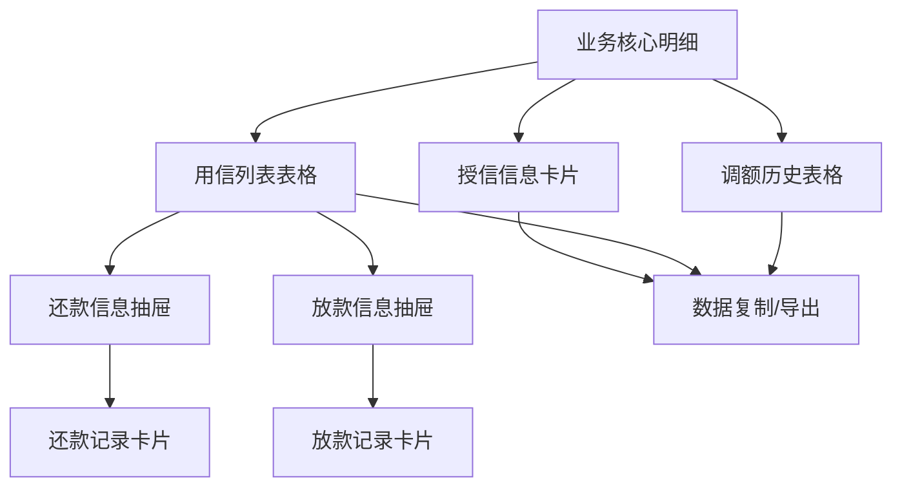

# 客户360授信信息模块详细需求文档

## 1. 产品概述

客户360授信信息模块是客户详情页面中业务核心明细的重要组成部分，为业务人员提供完整的客户授信、用信、调额历史等信息查询和管理功能。模块通过结构化的数据展示和交互式操作，帮助业务人员快速了解客户的信贷业务全貌，支持风险评估和业务决策。

## 2. 核心功能

### 2.1 用户角色

| 角色 | 登录方式 | 核心权限 |
|------|----------|----------|
| 业务人员 | 系统账号登录 | 可查看授信信息、用信列表、调额记录，支持数据导出和复制 |
| 风控人员 | 系统账号登录 | 可查看所有授信相关数据，支持风险分析和历史追溯 |
| 管理人员 | 系统账号登录 | 拥有所有查询权限，可查看操作日志和审批记录 |

### 2.2 功能模块

授信信息模块包含以下主要功能：

1. **授信信息展示**：显示客户的授信基本信息和当前状态
2. **用信列表管理**：展示客户的用信记录和相关操作
3. **调额历史查询**：显示客户的额度调整历史记录
4. **操作功能**：还款信息和放款信息的抽屉式展示

### 2.3 页面详情

| 页面名称 | 模块名称 | 功能描述 |
|----------|----------|----------|
| 业务核心明细 | 授信信息卡片 | 展示授信单号、授信日期、授信结果、拒绝原因、总授信额度、当前额度、已用额度、授信定价、可用期限 |
| 业务核心明细 | 用信列表表格 | 展示用信单号、用信日期、银行卡号、用信结果、拒绝原因、借据号、借据状态、借款金额、期数，支持操作按钮 |
| 业务核心明细 | 调额历史表格 | 展示授信单号、调整时间、原授信额度、调整后授信额度、生效起始时间、生效结束时间、操作类型 |
| 业务核心明细 | 还款信息抽屉 | 卡片式展示还款记录详情，包含还款时间、金额、方式、状态等信息 |
| 业务核心明细 | 放款信息抽屉 | 卡片式展示放款记录详情，包含放款时间、金额、渠道、状态等信息 |

## 3. 核心流程

### 3.1 授信信息查询流程

用户进入客户详情页 → 选择业务核心明细Tab → 查看授信信息卡片 → 获取客户授信基本信息 → 支持数据复制和导出

### 3.2 用信列表操作流程

查看用信列表 → 选择目标用信记录 → 点击操作按钮（还款信息/放款信息） → 打开抽屉展示详细信息 → 支持数据操作和导出

### 3.3 调额历史查询流程

查看调额历史表格 → 支持时间筛选和类型筛选 → 查看调额详细记录 → 支持数据导出和分析



## 4. 用户界面设计

### 4.1 设计风格

- **主色调**：#165dff（蓝色）、#ffffff（白色）
- **辅助色**：#86909c（灰色）、#f7f8fa（浅灰背景）
- **按钮样式**：圆角按钮，支持主要、次要、文本三种类型
- **字体**：系统默认字体，标题16px，正文14px，辅助文本12px
- **布局风格**：卡片式布局，表格展示，抽屉式详情
- **图标风格**：使用Arco Design图标库，简洁现代风格

### 4.2 页面设计概览

| 页面名称 | 模块名称 | UI元素 |
|----------|----------|--------|
| 业务核心明细 | 授信信息卡片 | 白色卡片背景，网格布局，标签式数据展示，状态指示器 |
| 业务核心明细 | 用信列表表格 | 表格布局，分页器，筛选器，操作按钮，状态标签 |
| 业务核心明细 | 调额历史表格 | 时间线布局，类型标识，金额对比，筛选功能 |
| 业务核心明细 | 还款信息抽屉 | 右侧滑出抽屉，卡片式内容，关闭按钮，导出功能 |
| 业务核心明细 | 放款信息抽屉 | 右侧滑出抽屉，卡片式内容，关闭按钮，导出功能 |

### 4.3 响应式设计

- **桌面端优先**：主要针对桌面端业务场景设计
- **移动端适配**：支持平板和手机端的基本查看功能
- **触摸优化**：移动端增大点击区域，优化滑动体验

## 5. 数据模型设计

### 5.1 授信信息数据结构

```typescript
interface CreditInfo {
  creditNo: string;           // 授信单号
  creditDate: string;         // 授信日期
  creditResult: string;       // 授信结果（通过/拒绝/待审批）
  rejectReason?: string;      // 拒绝原因
  totalCreditLimit: number;   // 总授信额度
  currentLimit: number;       // 当前额度
  usedLimit: number;          // 已用额度
  creditPricing: number;      // 授信定价（利率）
  availablePeriod: string;    // 可用期限
  productKey: string;         // 产品标识
  status: string;             // 状态
  createTime: string;         // 创建时间
  updateTime: string;         // 更新时间
}
```

### 5.2 用信列表数据结构

```typescript
interface LoanRecord {
  loanNo: string;             // 用信单号
  loanDate: string;           // 用信日期
  bankCardNo: string;         // 银行卡号（脱敏）
  loanResult: string;         // 用信结果（成功/失败/处理中）
  rejectReason?: string;      // 拒绝原因
  contractNo: string;         // 借据号
  contractStatus: string;     // 借据状态（正常/逾期/结清）
  loanAmount: number;         // 借款金额
  periods: number;            // 期数
  productKey: string;         // 产品标识
  interestRate: number;       // 利率
  repaymentMethod: string;    // 还款方式
  createTime: string;         // 创建时间
  dueDate: string;            // 到期时间
}
```

### 5.3 调额历史数据结构

```typescript
interface LimitAdjustment {
  creditNo: string;           // 授信单号
  adjustmentTime: string;     // 调整时间
  originalLimit: number;      // 原授信额度
  newLimit: number;           // 调整后授信额度
  effectiveStartTime: string; // 生效起始时间
  effectiveEndTime: string;   // 生效结束时间
  operationType: string;      // 操作类型（提额/降额/冻结/解冻）
  adjustmentReason: string;   // 调整原因
  operator: string;           // 操作人员
  approvalStatus: string;     // 审批状态
  productKey: string;         // 产品标识
}
```

### 5.4 还款信息数据结构

```typescript
interface RepaymentInfo {
  repaymentId: string;        // 还款ID
  contractNo: string;         // 借据号
  repaymentDate: string;      // 还款日期
  repaymentAmount: number;    // 还款金额
  repaymentMethod: string;    // 还款方式
  repaymentStatus: string;    // 还款状态
  principalAmount: number;    // 本金金额
  interestAmount: number;     // 利息金额
  penaltyAmount: number;      // 罚息金额
  remainingAmount: number;    // 剩余金额
  bankCardNo: string;         // 还款银行卡号
  transactionNo: string;      // 交易流水号
}
```

### 5.5 放款信息数据结构

```typescript
interface LoanDisbursement {
  disbursementId: string;     // 放款ID
  contractNo: string;         // 借据号
  disbursementDate: string;   // 放款日期
  disbursementAmount: number; // 放款金额
  disbursementChannel: string;// 放款渠道
  disbursementStatus: string; // 放款状态
  bankCardNo: string;         // 收款银行卡号
  transactionNo: string;      // 交易流水号
  arrivalTime: string;        // 到账时间
  processingTime: number;     // 处理时长（分钟）
  operator: string;           // 操作人员
}
```

## 6. 交互设计规范

### 6.1 授信信息卡片交互

- **布局**：采用网格布局，分为基本信息区和额度信息区
- **数据展示**：关键字段使用标签形式展示，支持状态颜色区分
- **操作功能**：支持整体数据复制，支持单个字段复制
- **状态指示**：授信结果使用不同颜色标识（通过-绿色，拒绝-红色，待审批-橙色）

### 6.2 用信列表表格交互

- **表格功能**：支持排序、筛选、分页
- **操作按钮**：每行包含"还款信息"和"放款信息"操作按钮
- **状态展示**：借据状态使用标签形式，不同状态不同颜色
- **抽屉触发**：点击操作按钮打开右侧抽屉展示详细信息

### 6.3 调额历史表格交互

- **时间筛选**：支持日期范围筛选
- **类型筛选**：支持操作类型筛选（提额/降额/冻结/解冻）
- **金额对比**：原额度和新额度支持对比展示
- **排序功能**：默认按调整时间倒序排列

### 6.4 抽屉式详情交互

- **打开方式**：从右侧滑入，宽度占屏幕40%
- **内容布局**：采用卡片式布局展示详细信息
- **关闭方式**：支持点击关闭按钮、点击遮罩层、按ESC键关闭
- **数据操作**：支持数据复制、导出功能

### 6.5 卡片式内容展示

- **还款信息卡片**：按时间倒序展示还款记录，每个卡片包含完整还款信息
- **放款信息卡片**：按时间倒序展示放款记录，每个卡片包含完整放款信息
- **卡片样式**：白色背景，圆角边框，悬停阴影效果
- **信息层次**：主要信息大字体，次要信息小字体，状态信息标签化

## 7. 业务规则说明

### 7.1 数据展示规则

- **产品关联**：所有数据必须与当前选中的产品相关联
- **时间排序**：默认按时间倒序展示最新记录
- **状态过滤**：支持按状态筛选，提供快速查看功能
- **数据脱敏**：银行卡号等敏感信息需要脱敏处理

### 7.2 权限控制规则

- **查看权限**：不同角色可查看的数据范围不同
- **操作权限**：只有授权用户可以执行数据导出操作
- **审计日志**：所有查看和操作行为需要记录审计日志

### 7.3 数据更新规则

- **实时更新**：授信状态变更需要实时反映
- **缓存策略**：历史数据可以适当缓存，提升查询性能
- **数据一致性**：确保不同模块间数据的一致性

## 8. 技术实现要点

### 8.1 前端技术要求

- **框架**：Vue 3 + Composition API
- **UI组件**：Arco Design
- **状态管理**：Vuex
- **数据请求**：Axios
- **表格组件**：支持虚拟滚动的高性能表格

### 8.2 性能优化

- **分页加载**：大数据量采用分页加载
- **虚拟滚动**：长列表使用虚拟滚动技术
- **数据缓存**：合理使用缓存减少重复请求
- **懒加载**：抽屉内容采用懒加载方式

### 8.3 用户体验优化

- **加载状态**：提供骨架屏和加载动画
- **错误处理**：友好的错误提示和重试机制
- **响应式设计**：适配不同屏幕尺寸
- **快捷操作**：支持键盘快捷键操作

## 9. 测试用例设计

### 9.1 功能测试用例

1. **授信信息展示测试**
   - 验证授信信息卡片正确展示所有必需字段
   - 验证不同授信状态的颜色显示正确
   - 验证数据复制功能正常工作

2. **用信列表测试**
   - 验证用信列表正确展示所有记录
   - 验证筛选和排序功能正常
   - 验证操作按钮点击正常触发抽屉

3. **调额历史测试**
   - 验证调额记录按时间正确排序
   - 验证筛选功能正常工作
   - 验证金额对比显示正确

4. **抽屉功能测试**
   - 验证抽屉正确打开和关闭
   - 验证还款信息和放款信息正确展示
   - 验证卡片式内容布局正确

### 9.2 性能测试用例

1. **大数据量测试**
   - 测试1000+记录的加载性能
   - 测试分页功能的响应速度
   - 测试虚拟滚动的流畅度

2. **并发访问测试**
   - 测试多用户同时访问的性能
   - 测试数据更新的实时性
   - 测试缓存机制的有效性

### 9.3 兼容性测试用例

1. **浏览器兼容性**
   - 测试Chrome、Firefox、Safari、Edge的兼容性
   - 测试不同版本浏览器的功能正常性

2. **设备兼容性**
   - 测试桌面端、平板端、手机端的显示效果
   - 测试不同分辨率下的布局适配

## 10. 验收标准

### 10.1 功能验收标准

- ✅ 授信信息卡片正确展示所有必需字段
- ✅ 用信列表支持完整的CRUD操作
- ✅ 调额历史支持时间和类型筛选
- ✅ 抽屉式详情展示功能正常
- ✅ 卡片式内容布局美观易读
- ✅ 所有数据操作功能正常

### 10.2 性能验收标准

- ✅ 页面首次加载时间 < 2秒
- ✅ 数据筛选响应时间 < 500ms
- ✅ 抽屉打开响应时间 < 300ms
- ✅ 支持1000+记录的流畅操作

### 10.3 用户体验验收标准

- ✅ 界面布局清晰，信息层次分明
- ✅ 交互操作直观，符合用户习惯
- ✅ 错误提示友好，引导用户操作
- ✅ 响应式设计适配各种设备

## 11. 后续优化方向

### 11.1 功能增强

- 增加数据可视化图表展示
- 支持批量操作功能
- 增加数据对比分析功能
- 支持自定义字段展示

### 11.2 性能优化

- 实现更智能的数据缓存策略
- 优化大数据量的渲染性能
- 增加数据预加载机制
- 实现增量数据更新

### 11.3 用户体验提升

- 增加个性化设置功能
- 支持数据收藏和标记
- 增加操作历史记录
- 实现智能推荐功能