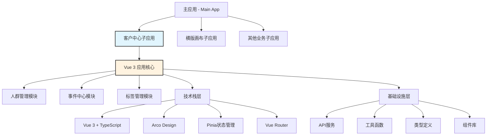

# 客户中心子应用技术架构文档

## 1. 架构设计

### 1.1 整体架构

客户中心子应用采用微前端架构，作为独立的Vue 3应用通过模块联邦技术与主应用集成。



### 1.2 技术栈选择

- **前端框架**: Vue 3.4+ (Composition API)
- **构建工具**: Vite 5.0+
- **开发语言**: TypeScript 5.5+
- **UI组件库**: Arco Design Vue 2.55+
- **状态管理**: Pinia 2.1+
- **路由管理**: Vue Router 4.3+
- **代码规范**: ESLint + Prettier
- **测试框架**: Vitest + Vue Test Utils

### 1.3 项目结构

```
customer-center/
├── src/
│   ├── main.ts                 # 应用入口
│   ├── App.vue                 # 根组件
│   ├── router/                 # 路由配置
│   │   ├── index.ts           # 路由主文件
│   │   ├── guards.ts          # 路由守卫
│   │   └── routes/            # 路由定义
│   │       ├── audience.ts    # 人群管理路由
│   │       ├── event.ts       # 事件中心路由
│   │       └── tag.ts         # 标签管理路由
│   ├── stores/                 # 状态管理
│   │   ├── index.ts           # Store主文件
│   │   ├── audience.ts        # 人群状态
│   │   ├── event.ts           # 事件状态
│   │   ├── tag.ts             # 标签状态
│   │   └── app.ts             # 应用状态
│   ├── api/                    # API接口
│   │   ├── index.ts           # API主文件
│   │   ├── audience.ts        # 人群管理API
│   │   ├── event.ts           # 事件中心API
│   │   ├── tag.ts             # 标签管理API
│   │   └── types/             # API类型定义
│   ├── components/             # 组件库
│   │   ├── common/            # 通用组件
│   │   │   ├── BaseTable.vue  # 基础表格
│   │   │   ├── BaseForm.vue   # 基础表单
│   │   │   ├── BaseModal.vue  # 基础弹窗
│   │   │   └── ConditionConfig.vue # 条件配置
│   │   ├── audience/          # 人群组件
│   │   ├── event/             # 事件组件
│   │   └── tag/               # 标签组件
│   ├── views/                  # 页面视图
│   │   ├── layout/            # 布局组件
│   │   ├── audience/          # 人群管理页面
│   │   ├── event/             # 事件中心页面
│   │   └── tag/               # 标签管理页面
│   ├── composables/            # 组合式函数
│   │   ├── useTable.ts        # 表格逻辑
│   │   ├── useForm.ts         # 表单逻辑
│   │   ├── useSearch.ts       # 搜索逻辑
│   │   └── usePermission.ts   # 权限逻辑
│   ├── utils/                  # 工具函数
│   │   ├── request.ts         # HTTP请求
│   │   ├── format.ts          # 数据格式化
│   │   ├── validate.ts        # 数据验证
│   │   └── constants.ts       # 常量定义
│   ├── types/                  # 类型定义
│   │   ├── audience.ts        # 人群类型
│   │   ├── event.ts           # 事件类型
│   │   ├── tag.ts             # 标签类型
│   │   └── common.ts          # 通用类型
│   ├── assets/                 # 静态资源
│   │   ├── styles/            # 样式文件
│   │   ├── icons/             # 图标资源
│   │   └── images/            # 图片资源
│   └── directives/             # 自定义指令
├── public/                     # 公共资源
├── tests/                      # 测试文件
├── docs/                       # 文档
├── package.json               # 项目配置
├── vite.config.ts            # Vite配置
├── tsconfig.json             # TypeScript配置
├── .eslintrc.js              # ESLint配置
└── README.md                 # 项目说明
```

## 2. 路由设计

### 2.1 路由结构

```typescript
// src/router/routes/index.ts
export const routes: RouteRecordRaw[] = [
  {
    path: '/',
    name: 'layout',
    component: () => import('@/views/layout/index.vue'),
    children: [
      // 人群管理路由
      {
        path: 'audience',
        name: 'audience',
        redirect: '/audience/management',
        meta: { title: '人群管理', icon: 'user-group' },
        children: [
          {
            path: 'management',
            name: 'audience-management',
            component: () => import('@/views/audience/management.vue'),
            meta: { title: '人群列表', breadcrumb: ['客户中心', '人群管理'] }
          },
          {
            path: 'create',
            name: 'audience-create',
            component: () => import('@/views/audience/create.vue'),
            meta: { title: '创建人群', breadcrumb: ['客户中心', '人群管理', '创建人群'] }
          },
          {
            path: 'detail/:id',
            name: 'audience-detail',
            component: () => import('@/views/audience/detail.vue'),
            meta: { title: '人群详情', breadcrumb: ['客户中心', '人群管理', '人群详情'] }
          }
        ]
      },
      
      // 事件中心路由
      {
        path: 'event',
        name: 'event',
        redirect: '/event/management',
        meta: { title: '事件中心', icon: 'thunderbolt' },
        children: [
          {
            path: 'management',
            name: 'event-management',
            component: () => import('@/views/event/management.vue'),
            meta: { title: '事件管理', breadcrumb: ['客户中心', '事件中心'] }
          },
          {
            path: 'virtual',
            name: 'event-virtual',
            component: () => import('@/views/event/virtual.vue'),
            meta: { title: '虚拟事件', breadcrumb: ['客户中心', '事件中心', '虚拟事件'] }
          },
          {
            path: 'stats/:id',
            name: 'event-stats',
            component: () => import('@/views/event/stats.vue'),
            meta: { title: '样本统计', breadcrumb: ['客户中心', '事件中心', '样本统计'] }
          },
          {
            path: 'kafka',
            name: 'event-kafka',
            component: () => import('@/views/event/kafka.vue'),
            meta: { title: 'Kafka数据源', breadcrumb: ['客户中心', '事件中心', 'Kafka数据源'] }
          }
        ]
      },
      
      // 标签管理路由
      {
        path: 'tag',
        name: 'tag',
        redirect: '/tag/management',
        meta: { title: '标签管理', icon: 'tag' },
        children: [
          {
            path: 'management',
            name: 'tag-management',
            component: () => import('@/views/tag/management.vue'),
            meta: { title: '标签列表', breadcrumb: ['客户中心', '标签管理'] }
          },
          {
            path: 'create',
            name: 'tag-create',
            component: () => import('@/views/tag/create.vue'),
            meta: { title: '创建标签', breadcrumb: ['客户中心', '标签管理', '创建标签'] }
          },
          {
            path: 'detail/:id',
            name: 'tag-detail',
            component: () => import('@/views/tag/detail.vue'),
            meta: { title: '标签详情', breadcrumb: ['客户中心', '标签管理', '标签详情'] }
          },
          {
            path: 'attribute',
            name: 'tag-attribute',
            component: () => import('@/views/tag/attribute.vue'),
            meta: { title: '属性管理', breadcrumb: ['客户中心', '标签管理', '属性管理'] }
          },
          {
            path: 'table',
            name: 'tag-table',
            component: () => import('@/views/tag/table.vue'),
            meta: { title: '表管理', breadcrumb: ['客户中心', '标签管理', '表管理'] }
          }
        ]
      }
    ]
  }
];
```

### 2.2 路由守卫

```typescript
// src/router/guards.ts
import type { Router } from 'vue-router';
import { useUserStore } from '@/stores/user';
import { Message } from '@arco-design/web-vue';

export function setupRouterGuards(router: Router) {
  // 权限守卫
  router.beforeEach(async (to, from, next) => {
    const userStore = useUserStore();
    
    // 检查是否需要登录
    if (to.meta.requiresAuth && !userStore.isLoggedIn) {
      Message.error('请先登录');
      next('/login');
      return;
    }
    
    // 检查权限
    if (to.meta.permissions && !userStore.hasPermissions(to.meta.permissions)) {
      Message.error('没有访问权限');
      next('/403');
      return;
    }
    
    next();
  });
  
  // 页面标题更新
  router.afterEach((to) => {
    if (to.meta.title) {
      document.title = `${to.meta.title} - 客户中心`;
    }
  });
}
```

## 3. 状态管理设计

### 3.1 Store结构

```typescript
// src/stores/index.ts
import { createPinia } from 'pinia';
import type { App } from 'vue';

export const pinia = createPinia();

export function setupStore(app: App) {
  app.use(pinia);
}

// 导出所有store
export * from './app';
export * from './audience';
export * from './event';
export * from './tag';
```

### 3.2 应用状态管理

```typescript
// src/stores/app.ts
import { defineStore } from 'pinia';
import { ref, computed } from 'vue';

export const useAppStore = defineStore('app', () => {
  // 状态
  const loading = ref(false);
  const sidebarCollapsed = ref(false);
  const theme = ref<'light' | 'dark'>('light');
  
  // 计算属性
  const isLoading = computed(() => loading.value);
  const isSidebarCollapsed = computed(() => sidebarCollapsed.value);
  const currentTheme = computed(() => theme.value);
  
  // 方法
  function setLoading(value: boolean) {
    loading.value = value;
  }
  
  function toggleSidebar() {
    sidebarCollapsed.value = !sidebarCollapsed.value;
  }
  
  function setTheme(value: 'light' | 'dark') {
    theme.value = value;
  }
  
  return {
    loading,
    sidebarCollapsed,
    theme,
    isLoading,
    isSidebarCollapsed,
    currentTheme,
    setLoading,
    toggleSidebar,
    setTheme
  };
});
```

### 3.3 人群状态管理

```typescript
// src/stores/audience.ts
import { defineStore } from 'pinia';
import { ref, computed } from 'vue';
import type { Audience, AudienceFilter, AudienceCreateParams } from '@/types/audience';
import * as audienceAPI from '@/api/audience';

export const useAudienceStore = defineStore('audience', () => {
  // 状态
  const audiences = ref<Audience[]>([]);
  const loading = ref(false);
  const pagination = ref({
    current: 1,
    pageSize: 10,
    total: 0
  });
  const filters = ref<AudienceFilter>({});
  
  // 计算属性
  const audienceList = computed(() => audiences.value);
  const isLoading = computed(() => loading.value);
  const currentPagination = computed(() => pagination.value);
  const currentFilters = computed(() => filters.value);
  
  // 方法
  async function fetchAudiences(params?: any) {
    loading.value = true;
    try {
      const response = await audienceAPI.getAudiences({
        page: pagination.value.current,
        pageSize: pagination.value.pageSize,
        ...filters.value,
        ...params
      });
      
      audiences.value = response.data;
      pagination.value = {
        current: response.page,
        pageSize: response.pageSize,
        total: response.total
      };
    } catch (error) {
      console.error('Failed to fetch audiences:', error);
      throw error;
    } finally {
      loading.value = false;
    }
  }
  
  async function createAudience(params: AudienceCreateParams) {
    loading.value = true;
    try {
      const response = await audienceAPI.createAudience(params);
      await fetchAudiences();
      return response;
    } catch (error) {
      console.error('Failed to create audience:', error);
      throw error;
    } finally {
      loading.value = false;
    }
  }
  
  async function updateAudience(id: string, params: Partial<Audience>) {
    loading.value = true;
    try {
      const response = await audienceAPI.updateAudience(id, params);
      await fetchAudiences();
      return response;
    } catch (error) {
      console.error('Failed to update audience:', error);
      throw error;
    } finally {
      loading.value = false;
    }
  }
  
  async function deleteAudience(id: string) {
    loading.value = true;
    try {
      await audienceAPI.deleteAudience(id);
      await fetchAudiences();
    } catch (error) {
      console.error('Failed to delete audience:', error);
      throw error;
    } finally {
      loading.value = false;
    }
  }
  
  function setFilters(newFilters: AudienceFilter) {
    filters.value = newFilters;
    pagination.value.current = 1;
  }
  
  function setPagination(newPagination: any) {
    pagination.value = { ...pagination.value, ...newPagination };
  }
  
  return {
    audiences,
    loading,
    pagination,
    filters,
    audienceList,
    isLoading,
    currentPagination,
    currentFilters,
    fetchAudiences,
    createAudience,
    updateAudience,
    deleteAudience,
    setFilters,
    setPagination
  };
});
```

## 4. API设计

### 4.1 API封装

```typescript
// src/api/index.ts
import axios, { type AxiosInstance, type AxiosRequestConfig, type AxiosResponse } from 'axios';
import { Message } from '@arco-design/web-vue';
import { useUserStore } from '@/stores/user';

// 创建axios实例
const apiClient: AxiosInstance = axios.create({
  baseURL: import.meta.env.VITE_API_BASE_URL || '/api',
  timeout: 30000,
  headers: {
    'Content-Type': 'application/json'
  }
});

// 请求拦截器
apiClient.interceptors.request.use(
  (config) => {
    const userStore = useUserStore();
    if (userStore.token) {
      config.headers.Authorization = `Bearer ${userStore.token}`;
    }
    return config;
  },
  (error) => {
    return Promise.reject(error);
  }
);

// 响应拦截器
apiClient.interceptors.response.use(
  (response: AxiosResponse) => {
    const { code, message, data } = response.data;
    
    if (code === 0) {
      return data;
    } else if (code === 401) {
      // 未授权，跳转到登录页
      const userStore = useUserStore();
      userStore.logout();
      window.location.href = '/login';
      return Promise.reject(new Error(message || '未授权'));
    } else {
      Message.error(message || '请求失败');
      return Promise.reject(new Error(message || '请求失败'));
    }
  },
  (error) => {
    const { response } = error;
    
    if (response) {
      const { status, data } = response;
      
      if (status === 401) {
        const userStore = useUserStore();
        userStore.logout();
        window.location.href = '/login';
      } else if (status === 403) {
        Message.error('没有权限访问该资源');
      } else if (status >= 500) {
        Message.error('服务器错误，请稍后重试');
      } else {
        Message.error(data?.message || '请求失败');
      }
    } else {
      Message.error('网络错误，请检查网络连接');
    }
    
    return Promise.reject(error);
  }
);

// 导出封装的请求方法
export function request<T = any>(config: AxiosRequestConfig): Promise<T> {
  return apiClient.request(config);
}

export function get<T = any>(url: string, params?: any, config?: AxiosRequestConfig): Promise<T> {
  return apiClient.get(url, { params, ...config });
}

export function post<T = any>(url: string, data?: any, config?: AxiosRequestConfig): Promise<T> {
  return apiClient.post(url, data, config);
}

export function put<T = any>(url: string, data?: any, config?: AxiosRequestConfig): Promise<T> {
  return apiClient.put(url, data, config);
}

export function del<T = any>(url: string, config?: AxiosRequestConfig): Promise<T> {
  return apiClient.delete(url, config);
}

export default apiClient;
```

### 4.2 人群管理API

```typescript
// src/api/audience.ts
import { get, post, put, del } from './index';
import type { 
  Audience, 
  AudienceListResponse, 
  AudienceCreateParams, 
  AudienceUpdateParams,
  AudienceFilter 
} from '@/types/audience';

// 获取人群列表
export function getAudiences(params: {
  page?: number;
  pageSize?: number;
  name?: string;
  type?: string;
  status?: string;
}): Promise<AudienceListResponse> {
  return get('/audience/list', params);
}

// 获取人群详情
export function getAudienceDetail(id: string): Promise<Audience> {
  return get(`/audience/${id}`);
}

// 创建人群
export function createAudience(data: AudienceCreateParams): Promise<Audience> {
  return post('/audience', data);
}

// 更新人群
export function updateAudience(id: string, data: AudienceUpdateParams): Promise<Audience> {
  return put(`/audience/${id}`, data);
}

// 删除人群
export function deleteAudience(id: string): Promise<void> {
  return del(`/audience/${id}`);
}

// 获取人群统计
export function getAudienceStats(id: string): Promise<any> {
  return get(`/audience/${id}/stats`);
}

// 导出人群
export function exportAudience(id: string): Promise<Blob> {
  return get(`/audience/${id}/export`, {}, { responseType: 'blob' });
}

// 导入人群
export function importAudience(data: FormData): Promise<any> {
  return post('/audience/import', data, {
    headers: { 'Content-Type': 'multipart/form-data' }
  });
}
```

### 4.3 事件中心API

```typescript
// src/api/event.ts
import { get, post, put, del } from './index';
import type { 
  Event, 
  EventListResponse, 
  EventCreateParams, 
  EventUpdateParams,
  VirtualEvent,
  EventStats 
} from '@/types/event';

// 获取事件列表
export function getEvents(params: any): Promise<EventListResponse> {
  return get('/event/list', params);
}

// 获取事件详情
export function getEventDetail(id: string): Promise<Event> {
  return get(`/event/${id}`);
}

// 创建事件
export function createEvent(data: EventCreateParams): Promise<Event> {
  return post('/event', data);
}

// 更新事件
export function updateEvent(id: string, data: EventUpdateParams): Promise<Event> {
  return put(`/event/${id}`, data);
}

// 删除事件
export function deleteEvent(id: string): Promise<void> {
  return del(`/event/${id}`);
}

// 更新事件状态
export function updateEventStatus(id: string, status: string): Promise<Event> {
  return put(`/event/${id}/status`, { status });
}

// 获取虚拟事件列表
export function getVirtualEvents(params: any): Promise<any> {
  return get('/event/virtual/list', params);
}

// 创建虚拟事件
export function createVirtualEvent(data: VirtualEvent): Promise<VirtualEvent> {
  return post('/event/virtual', data);
}

// 获取事件统计
export function getEventStats(id: string): Promise<EventStats> {
  return get(`/event/${id}/stats`);
}

// 获取Kafka配置
export function getKafkaConfig(): Promise<any> {
  return get('/event/kafka/config');
}

// 更新Kafka配置
export function updateKafkaConfig(data: any): Promise<any> {
  return put('/event/kafka/config', data);
}
```

### 4.4 标签管理API

```typescript
// src/api/tag.ts
import { get, post, put, del } from './index';
import type { 
  Tag, 
  TagListResponse, 
  TagCreateParams, 
  TagUpdateParams,
  TagAttribute,
  TagTable 
} from '@/types/tag';

// 获取标签列表
export function getTags(params: any): Promise<TagListResponse> {
  return get('/tag/list', params);
}

// 获取标签详情
export function getTagDetail(id: string): Promise<Tag> {
  return get(`/tag/${id}`);
}

// 创建标签
export function createTag(data: TagCreateParams): Promise<Tag> {
  return post('/tag', data);
}

// 更新标签
export function updateTag(id: string, data: TagUpdateParams): Promise<Tag> {
  return put(`/tag/${id}`, data);
}

// 删除标签
export function deleteTag(id: string): Promise<void> {
  return del(`/tag/${id}`);
}

// 获取属性列表
export function getTagAttributes(params: any): Promise<any> {
  return get('/tag/attribute/list', params);
}

// 创建属性
export function createTagAttribute(data: TagAttribute): Promise<TagAttribute> {
  return post('/tag/attribute', data);
}

// 获取表列表
export function getTagTables(params: any): Promise<any> {
  return get('/tag/table/list', params);
}

// 注册表
export function registerTagTable(data: TagTable): Promise<TagTable> {
  return post('/tag/table', data);
}

// 获取标签值列表
export function getTagValues(tagId: string): Promise<any> {
  return get(`/tag/${tagId}/values`);
}

// 更新标签值
export function updateTagValues(tagId: string, data: any): Promise<any> {
  return put(`/tag/${tagId}/values`, data);
}
```

## 5. 组件设计

### 5.1 基础组件

#### 5.1.1 表格组件

```vue
<!-- src/components/common/BaseTable.vue -->
<template>
  <div class="base-table">
    <a-table
      v-bind="$attrs"
      :data="tableData"
      :loading="loading"
      :pagination="paginationConfig"
      @page-change="handlePageChange"
      @page-size-change="handlePageSizeChange"
    >
      <template v-for="(_, name) in $slots" #[name]="slotData">
        <slot :name="name" v-bind="slotData" />
      </template>
    </a-table>
  </div>
</template>

<script setup lang="ts">
import { computed, watch } from 'vue';
import type { TableData } from '@arco-design/web-vue';

interface Props {
  data: TableData[];
  loading?: boolean;
  pagination?: any;
}

const props = withDefaults(defineProps<Props>(), {
  loading: false,
  pagination: () => ({})
});

const emit = defineEmits<{
  pageChange: [page: number];
  pageSizeChange: [pageSize: number];
}>();

const tableData = computed(() => props.data);
const loading = computed(() => props.loading);

const paginationConfig = computed(() => ({
  total: props.pagination.total || 0,
  current: props.pagination.current || 1,
  pageSize: props.pagination.pageSize || 10,
  showTotal: true,
  showJumper: true,
  showPageSize: true,
  ...props.pagination
}));

const handlePageChange = (page: number) => {
  emit('pageChange', page);
};

const handlePageSizeChange = (pageSize: number) => {
  emit('pageSizeChange', pageSize);
};
</script>

<style scoped lang="scss">
.base-table {
  :deep(.arco-table-th) {
    background-color: var(--color-fill-2);
    font-weight: 600;
  }
  
  :deep(.arco-table-tr:hover .arco-table-td) {
    background-color: var(--color-fill-1);
  }
}
</style>
```

#### 5.1.2 搜索表单组件

```vue
<!-- src/components/common/BaseSearchForm.vue -->
<template>
  <div class="base-search-form">
    <a-form :model="formModel" layout="inline">
      <slot :form="formModel" :rules="rules" />
      <a-form-item>
        <a-space>
          <a-button type="primary" @click="handleSearch">
            <template #icon><icon-search /></template>
            搜索
          </a-button>
          <a-button @click="handleReset">
            <template #icon><icon-refresh /></template>
            重置
          </a-button>
        </a-space>
      </a-form-item>
    </a-form>
  </div>
</template>

<script setup lang="ts">
import { reactive, watch } from 'vue';
import { IconSearch, IconRefresh } from '@arco-design/web-vue/es/icon';

interface Props {
  model?: Record<string, any>;
  rules?: Record<string, any>;
}

const props = withDefaults(defineProps<Props>(), {
  model: () => ({}),
  rules: () => ({})
});

const emit = defineEmits<{
  search: [params: Record<string, any>];
  reset: [];
}>();

const formModel = reactive({ ...props.model });

const handleSearch = () => {
  emit('search', { ...formModel });
};

const handleReset = () => {
  Object.keys(formModel).forEach(key => {
    delete formModel[key];
  });
  Object.assign(formModel, props.model);
  emit('reset');
  emit('search', { ...formModel });
};

watch(() => props.model, (newModel) => {
  Object.assign(formModel, newModel);
}, { deep: true });
</script>

<style scoped lang="scss">
.base-search-form {
  padding: 16px;
  background-color: var(--color-bg-2);
  border-radius: 4px;
  margin-bottom: 16px;
  
  :deep(.arco-form-item) {
    margin-bottom: 0;
  }
}
</style>
```

### 5.2 业务组件

#### 5.2.1 条件配置组件

```vue
<!-- src/components/common/ConditionConfig.vue -->
<template>
  <div class="condition-config">
    <div class="condition-groups">
      <div v-for="(group, groupIndex) in conditionGroups" :key="groupIndex" class="condition-group">
        <div class="group-header">
          <span class="group-title">条件组 {{ groupIndex + 1 }}</span>
          <a-space>
            <a-button size="mini" @click="toggleGroupLogic(group)">
              {{ group.logic === 'and' ? '且' : '或' }}
            </a-button>
            <a-button size="mini" status="danger" @click="removeGroup(groupIndex)">
              <template #icon><icon-delete /></template>
            </a-button>
          </a-space>
        </div>
        
        <div class="conditions">
          <div v-for="(condition, conditionIndex) in group.conditions" :key="conditionIndex" class="condition-item">
            <condition-item
              :condition="condition"
              :data-source-options="dataSourceOptions"
              :field-options="getFieldOptions(condition.dataSourceType)"
              :operator-options="getOperatorOptions(condition)"
              @update="updateCondition(groupIndex, conditionIndex, $event)"
              @remove="removeCondition(groupIndex, conditionIndex)"
            />
          </div>
          
          <a-button type="outline" size="small" @click="addCondition(groupIndex)">
            <template #icon><icon-plus /></template>
            添加条件
          </a-button>
        </div>
      </div>
    </div>
    
    <div class="group-actions">
      <a-button type="primary" @click="addGroup">
        <template #icon><icon-plus /></template>
        添加条件组
      </a-button>
    </div>
  </div>
</template>

<script setup lang="ts">
import { ref, reactive } from 'vue';
import { IconPlus, IconDelete } from '@arco-design/web-vue/es/icon';
import ConditionItem from './ConditionItem.vue';
import type { ConditionGroup, Condition } from '@/types/condition';

interface Props {
  modelValue: ConditionGroup[];
  dataSourceOptions: any[];
  fieldOptions: Record<string, any[]>;
  operatorOptions: Record<string, any[]>;
}

const props = defineProps<Props>();
const emit = defineEmits<{
  'update:modelValue': [value: ConditionGroup[]];
}>();

const conditionGroups = reactive<ConditionGroup[]>(props.modelValue || []);

const addGroup = () => {
  conditionGroups.push({
    logic: 'and',
    conditions: [createEmptyCondition()]
  });
};

const removeGroup = (index: number) => {
  conditionGroups.splice(index, 1);
};

const addCondition = (groupIndex: number) => {
  conditionGroups[groupIndex].conditions.push(createEmptyCondition());
};

const removeCondition = (groupIndex: number, conditionIndex: number) => {
  conditionGroups[groupIndex].conditions.splice(conditionIndex, 1);
  if (conditionGroups[groupIndex].conditions.length === 0) {
    removeGroup(groupIndex);
  }
};

const updateCondition = (groupIndex: number, conditionIndex: number, condition: Condition) => {
  conditionGroups[groupIndex].conditions[conditionIndex] = condition;
};

const toggleGroupLogic = (group: ConditionGroup) => {
  group.logic = group.logic === 'and' ? 'or' : 'and';
};

const getFieldOptions = (dataSourceType: string) => {
  return props.fieldOptions[dataSourceType] || [];
};

const getOperatorOptions = (condition: Condition) => {
  return props.operatorOptions[condition.dataType] || [];
};

const createEmptyCondition = (): Condition => ({
  id: Date.now().toString(),
  dataSourceType: '',
  field: '',
  operator: '',
  value: '',
  dataType: 'string'
});
</script>

<style scoped lang="scss">
.condition-config {
  .condition-groups {
    margin-bottom: 16px;
  }
  
  .condition-group {
    border: 1px solid var(--color-border-2);
    border-radius: 4px;
    padding: 16px;
    margin-bottom: 12px;
    background-color: var(--color-bg-2);
  }
  
  .group-header {
    display: flex;
    justify-content: space-between;
    align-items: center;
    margin-bottom: 12px;
    
    .group-title {
      font-weight: 600;
      color: var(--color-text-1);
    }
  }
  
  .conditions {
    .condition-item {
      margin-bottom: 8px;
    }
  }
  
  .group-actions {
    text-align: center;
  }
}
</style>
```

## 6. 类型定义

### 6.1 人群管理类型

```typescript
// src/types/audience.ts

// 基础人群类型
export interface Audience {
  id: string;
  name: string;
  description?: string;
  type: 'static' | 'dynamic' | 'computed' | 'rule';
  size: number;
  status: 'active' | 'inactive' | 'computing' | 'error';
  createMethod: 'rule' | 'import' | 'manual';
  shareLevel: 'public' | 'private' | 'team';
  createUser: string;
  createTime: string;
  updateTime: string;
  rules?: AudienceRule[];
  statistics?: AudienceStatistics;
}

// 人群规则
export interface AudienceRule {
  id: string;
  name: string;
  type: 'include' | 'exclude';
  conditions: AudienceCondition[];
  logic: 'and' | 'or';
}

// 人群条件
export interface AudienceCondition {
  id: string;
  field: string;
  operator: string;
  value: string | number | string[] | number[];
  dataType: 'string' | 'number' | 'date' | 'boolean';
  dataSource: string;
}

// 人群统计
export interface AudienceStatistics {
  totalCount: number;
  validCount: number;
  coverage: number;
  trend: Array<{
    date: string;
    count: number;
  }>;
  demographics: {
    age: Record<string, number>;
    gender: Record<string, number>;
    region: Record<string, number>;
  };
}

// 人群列表响应
export interface AudienceListResponse {
  data: Audience[];
  page: number;
  pageSize: number;
  total: number;
  totalPages: number;
}

// 人群创建参数
export interface AudienceCreateParams {
  name: string;
  description?: string;
  type: 'static' | 'dynamic' | 'computed' | 'rule';
  rules: AudienceRule[];
  shareLevel: 'public' | 'private' | 'team';
}

// 人群更新参数
export interface AudienceUpdateParams extends Partial<AudienceCreateParams> {
  id: string;
  status?: 'active' | 'inactive';
}

// 人群筛选条件
export interface AudienceFilter {
  name?: string;
  type?: string;
  status?: string;
  createUser?: string;
  createTimeStart?: string;
  createTimeEnd?: string;
}
```

### 6.2 事件中心类型

```typescript
// src/types/event.ts

// 基础事件类型
export interface Event {
  id: string;
  name: string;
  description?: string;
  type: 'system' | 'business' | 'user' | 'marketing' | 'risk';
  source: string;
  status: 'active' | 'inactive';
  triggerCondition: string;
  owner: string;
  createTime: string;
  updateTime: string;
  virtualEvents?: VirtualEvent[];
  statistics?: EventStatistics;
}

// 虚拟事件
export interface VirtualEvent {
  id: string;
  name: string;
  description?: string;
  parentEventId: string;
  condition: string;
  parameters: Record<string, any>;
  status: 'active' | 'inactive';
  createTime: string;
}

// 事件统计
export interface EventStatistics {
  totalCount: number;
  dailyCount: number;
  weeklyCount: number;
  monthlyCount: number;
  trend: Array<{
    date: string;
    count: number;
  }>;
  topProperties: Array<{
    property: string;
    count: number;
  }>;
}

// Kafka配置
export interface KafkaConfig {
  brokers: string[];
  topic: string;
  consumerGroup: string;
  authentication: {
    type: 'none' | 'sasl';
    username?: string;
    password?: string;
  };
  ssl: {
    enabled: boolean;
    ca?: string;
    cert?: string;
    key?: string;
  };
}

// 事件列表响应
export interface EventListResponse {
  data: Event[];
  page: number;
  pageSize: number;
  total: number;
  totalPages: number;
}

// 事件创建参数
export interface EventCreateParams {
  name: string;
  description?: string;
  type: string;
  source: string;
  triggerCondition: string;
  parameters?: Record<string, any>;
}

// 事件更新参数
export interface EventUpdateParams extends Partial<EventCreateParams> {
  id: string;
  status?: 'active' | 'inactive';
}
```

### 6.3 标签管理类型

```typescript
// src/types/tag.ts

// 基础标签类型
export interface Tag {
  id: string;
  name: string;
  description?: string;
  dataType: 'string' | 'number' | 'boolean' | 'date';
  category: 'basic' | 'behavior' | 'preference' | 'business';
  type: 'static' | 'dynamic' | 'computed' | 'rule';
  dimensionKey: string;
  mappingStatus: 'configured' | 'unconfigured' | 'error';
  shareLevel: 'public' | 'private';
  createUser: string;
  createTime: string;
  updateTime: string;
  values?: TagValue[];
  rules?: TagRule[];
  statistics?: TagStatistics;
}

// 标签值
export interface TagValue {
  id: string;
  name: string;
  value: string | number;
  description?: string;
  conditions: TagCondition[];
  logic: 'and' | 'or';
}

// 标签规则
export interface TagRule {
  id: string;
  name: string;
  type: 'include' | 'exclude';
  conditions: TagCondition[];
  logic: 'and' | 'or';
}

// 标签条件
export interface TagCondition {
  id: string;
  field: string;
  operator: string;
  value: string | number | string[] | number[];
  dataType: 'string' | 'number' | 'date' | 'boolean';
  dataSource: string;
}

// 标签属性
export interface TagAttribute {
  id: string;
  name: string;
  description?: string;
  dataType: 'string' | 'number' | 'boolean' | 'date';
  category: string;
  isRequired: boolean;
  defaultValue?: any;
  validation?: string;
}

// 标签表
export interface TagTable {
  id: string;
  name: string;
  description?: string;
  database: string;
  tableName: string;
  fields: TagField[];
  primaryKey: string;
  status: 'active' | 'inactive';
  createTime: string;
}

// 标签字段
export interface TagField {
  name: string;
  type: string;
  description?: string;
  isPrimaryKey: boolean;
  isNullable: boolean;
  mapping?: string;
}

// 标签统计
export interface TagStatistics {
  totalCount: number;
  coverage: number;
  valueDistribution: Record<string, number>;
  trend: Array<{
    date: string;
    count: number;
  }>;
}

// 标签列表响应
export interface TagListResponse {
  data: Tag[];
  page: number;
  pageSize: number;
  total: number;
  totalPages: number;
}

// 标签创建参数
export interface TagCreateParams {
  name: string;
  description?: string;
  dataType: string;
  category: string;
  type: string;
  dimensionKey: string;
  shareLevel: 'public' | 'private';
  values?: TagValue[];
  rules?: TagRule[];
}

// 标签更新参数
export interface TagUpdateParams extends Partial<TagCreateParams> {
  id: string;
}
```

## 7. 工具函数

### 7.1 HTTP请求工具

```typescript
// src/utils/request.ts
import axios, { type AxiosInstance, type AxiosRequestConfig } from 'axios';
import { Message } from '@arco-design/web-vue';

class Request {
  private instance: AxiosInstance;
  
  constructor(config: AxiosRequestConfig) {
    this.instance = axios.create(config);
    this.setupInterceptors();
  }
  
  private setupInterceptors() {
    // 请求拦截器
    this.instance.interceptors.request.use(
      (config) => {
        // 添加认证token
        const token = localStorage.getItem('token');
        if (token) {
          config.headers.Authorization = `Bearer ${token}`;
        }
        return config;
      },
      (error) => {
        return Promise.reject(error);
      }
    );
    
    // 响应拦截器
    this.instance.interceptors.response.use(
      (response) => {
        const { data } = response;
        
        // 统一处理响应格式
        if (data.code === 0) {
          return data.data;
        } else {
          Message.error(data.message || '请求失败');
          return Promise.reject(new Error(data.message || '请求失败'));
        }
      },
      (error) => {
        const { response } = error;
        
        if (response) {
          const { status, data } = response;
          
          switch (status) {
            case 401:
              // 未授权，跳转到登录页
              localStorage.removeItem('token');
              window.location.href = '/login';
              break;
            case 403:
              Message.error('没有权限访问该资源');
              break;
            case 404:
              Message.error('请求的资源不存在');
              break;
            case 500:
              Message.error('服务器错误，请稍后重试');
              break;
            default:
              Message.error(data?.message || '请求失败');
          }
        } else {
          Message.error('网络错误，请检查网络连接');
        }
        
        return Promise.reject(error);
      }
    );
  }
  
  // 封装请求方法
  request<T = any>(config: AxiosRequestConfig): Promise<T> {
    return this.instance.request(config);
  }
  
  get<T = any>(url: string, params?: any, config?: AxiosRequestConfig): Promise<T> {
    return this.instance.get(url, { params, ...config });
  }
  
  post<T = any>(url: string, data?: any, config?: AxiosRequestConfig): Promise<T> {
    return this.instance.post(url, data, config);
  }
  
  put<T = any>(url: string, data?: any, config?: AxiosRequestConfig): Promise<T> {
    return this.instance.put(url, data, config);
  }
  
  delete<T = any>(url: string, config?: AxiosRequestConfig): Promise<T> {
    return this.instance.delete(url, config);
  }
}

// 创建请求实例
export const request = new Request({
  baseURL: import.meta.env.VITE_API_BASE_URL || '/api',
  timeout: 30000,
  headers: {
    'Content-Type': 'application/json'
  }
});

// 导出快捷方法
export const { get, post, put, del } = request;
```

### 7.2 数据格式化工具

```typescript
// src/utils/format.ts

/**
 * 格式化数字
 */
export function formatNumber(value: number | string, decimals: number = 2): string {
  const num = Number(value);
  if (isNaN(num)) return '0';
  
  if (num >= 10000) {
    return (num / 10000).toFixed(decimals) + '万';
  }
  
  return num.toFixed(decimals);
}

/**
 * 格式化百分比
 */
export function formatPercent(value: number | string, decimals: number = 2): string {
  const num = Number(value);
  if (isNaN(num)) return '0%';
  
  return (num * 100).toFixed(decimals) + '%';
}

/**
 * 格式化日期
 */
export function formatDate(date: string | Date, format: string = 'YYYY-MM-DD HH:mm:ss'): string {
  const d = new Date(date);
  if (isNaN(d.getTime())) return '';
  
  const year = d.getFullYear();
  const month = String(d.getMonth() + 1).padStart(2, '0');
  const day = String(d.getDate()).padStart(2, '0');
  const hour = String(d.getHours()).padStart(2, '0');
  const minute = String(d.getMinutes()).padStart(2, '0');
  const second = String(d.getSeconds()).padStart(2, '0');
  
  return format
    .replace('YYYY', String(year))
    .replace('MM', month)
    .replace('DD', day)
    .replace('HH', hour)
    .replace('mm', minute)
    .replace('ss', second);
}

/**
 * 格式化文件大小
 */
export function formatFileSize(bytes: number): string {
  if (bytes === 0) return '0 B';
  
  const k = 1024;
  const sizes = ['B', 'KB', 'MB', 'GB', 'TB'];
  const i = Math.floor(Math.log(bytes) / Math.log(k));
  
  return parseFloat((bytes / Math.pow(k, i)).toFixed(2)) + ' ' + sizes[i];
}

/**
 * 格式化持续时间
 */
export function formatDuration(seconds: number): string {
  if (seconds < 60) {
    return seconds + '秒';
  } else if (seconds < 3600) {
    const minutes = Math.floor(seconds / 60);
    const remainingSeconds = seconds % 60;
    return minutes + '分' + (remainingSeconds > 0 ? remainingSeconds + '秒' : '');
  } else {
    const hours = Math.floor(seconds / 3600);
    const remainingMinutes = Math.floor((seconds % 3600) / 60);
    return hours + '小时' + (remainingMinutes > 0 ? remainingMinutes + '分' : '');
  }
}

/**
 * 格式化货币
 */
export function formatCurrency(amount: number | string, currency: string = 'CNY'): string {
  const num = Number(amount);
  if (isNaN(num)) return '¥0.00';
  
  const symbol = currency === 'CNY' ? '¥' : currency === 'USD' ? '$' : currency;
  return symbol + num.toFixed(2).replace(/\B(?=(\d{3})+(?!\d))/g, ',');
}
```

### 7.3 数据验证工具

```typescript
// src/utils/validate.ts

/**
 * 验证邮箱格式
 */
export function validateEmail(email: string): boolean {
  const regex = /^[^\s@]+@[^\s@]+\.[^\s@]+$/;
  return regex.test(email);
}

/**
 * 验证手机号格式
 */
export function validatePhone(phone: string): boolean {
  const regex = /^1[3-9]\d{9}$/;
  return regex.test(phone);
}

/**
 * 验证身份证号格式
 */
export function validateIdCard(idCard: string): boolean {
  const regex = /^[1-9]\d{5}(18|19|20)\d{2}(0[1-9]|1[0-2])(0[1-9]|[12]\d|3[01])\d{3}[\dX]$/;
  return regex.test(idCard);
}

/**
 * 验证URL格式
 */
export function validateUrl(url: string): boolean {
  try {
    new URL(url);
    return true;
  } catch {
    return false;
  }
}

/**
 * 验证数字范围
 */
export function validateNumberRange(value: number, min: number, max: number): boolean {
  return !isNaN(value) && value >= min && value <= max;
}

/**
 * 验证字符串长度
 */
export function validateStringLength(value: string, min: number, max: number): boolean {
  const length = value.length;
  return length >= min && length <= max;
}

/**
 * 验证文件类型
 */
export function validateFileType(file: File, allowedTypes: string[]): boolean {
  return allowedTypes.includes(file.type);
}

/**
 * 验证文件大小
 */
export function validateFileSize(file: File, maxSize: number): boolean {
  return file.size <= maxSize;
}

/**
 * 验证日期格式
 */
export function validateDate(date: string, format: string = 'YYYY-MM-DD'): boolean {
  const d = new Date(date);
  return !isNaN(d.getTime());
}
```

## 8. 配置管理

### 8.1 Vite配置

```typescript
// vite.config.ts
import { defineConfig } from 'vite';
import vue from '@vitejs/plugin-vue';
import { resolve } from 'path';

export default defineConfig({
  plugins: [vue()],
  
  // 开发服务器配置
  server: {
    port: 5176, // 客户中心子应用端口
    open: true,
    cors: true,
    proxy: {
      '/api': {
        target: 'http://localhost:8080',
        changeOrigin: true,
        rewrite: (path) => path.replace(/^\/api/, '')
      }
    }
  },
  
  // 构建配置
  build: {
    outDir: 'dist',
    assetsDir: 'assets',
    sourcemap: false,
    rollupOptions: {
      output: {
        manualChunks: {
          'vue-vendor': ['vue', 'vue-router', 'pinia'],
          'arco-vendor': ['@arco-design/web-vue'],
          'utils': ['axios', 'dayjs']
        }
      }
    }
  },
  
  // 路径别名配置
  resolve: {
    alias: {
      '@': resolve(__dirname, 'src'),
      '~@': resolve(__dirname, 'src')
    },
    extensions: ['.js', '.ts', '.jsx', '.tsx', '.json', '.vue']
  },
  
  // CSS配置
  css: {
    preprocessorOptions: {
      scss: {
        additionalData: `@import "@/assets/styles/variables.scss";`
      }
    }
  },
  
  // 环境变量配置
  define: {
    __VUE_PROD_DEVTOOLS__: false
  }
});
```

### 8.2 TypeScript配置

```json
// tsconfig.json
{
  "compilerOptions": {
    "target": "ES2020",
    "useDefineForClassFields": true,
    "lib": ["ES2020", "DOM", "DOM.Iterable"],
    "module": "ESNext",
    "skipLibCheck": true,
    "moduleResolution": "bundler",
    "allowImportingTsExtensions": true,
    "resolveJsonModule": true,
    "isolatedModules": true,
    "noEmit": true,
    "jsx": "preserve",
    "strict": true,
    "noUnusedLocals": true,
    "noUnusedParameters": true,
    "noFallthroughCasesInSwitch": true,
    "baseUrl": ".",
    "paths": {
      "@/*": ["src/*"],
      "~@/*": ["src/*"]
    },
    "types": ["vite/client", "node"],
    "allowSyntheticDefaultImports": true,
    "esModuleInterop": true,
    "forceConsistentCasingInFileNames": true,
    "declaration": true,
    "declarationMap": true,
    "sourceMap": true
  },
  "include": [
    "src/**/*.ts",
    "src/**/*.d.ts",
    "src/**/*.tsx",
    "src/**/*.vue",
    "tests/**/*.ts",
    "tests/**/*.tsx"
  ],
  "exclude": ["node_modules", "dist"],
  "references": [{ "path": "./tsconfig.node.json" }]
}
```

### 8.3 环境变量配置

```bash
# .env.development
VITE_APP_TITLE=客户中心
VITE_API_BASE_URL=http://localhost:8080/api
VITE_APP_VERSION=1.0.0
VITE_BUILD_TIME=2024-01-01
```

```bash
# .env.production
VITE_APP_TITLE=客户中心
VITE_API_BASE_URL=/api
VITE_APP_VERSION=1.0.0
VITE_BUILD_TIME=2024-01-01
```

## 9. 测试策略

### 9.1 单元测试

```typescript
// tests/components/BaseTable.test.ts
import { describe, it, expect, vi } from 'vitest';
import { mount } from '@vue/test-utils';
import BaseTable from '@/components/common/BaseTable.vue';

describe('BaseTable', () => {
  it('renders correctly with props', () => {
    const data = [
      { id: 1, name: 'Test 1' },
      { id: 2, name: 'Test 2' }
    ];
    
    const wrapper = mount(BaseTable, {
      props: {
        data,
        loading: false,
        pagination: {
          total: 2,
          current: 1,
          pageSize: 10
        }
      }
    });
    
    expect(wrapper.find('.base-table')).toBeTruthy();
    expect(wrapper.props('data')).toEqual(data);
  });
  
  it('emits page-change event', async () => {
    const wrapper = mount(BaseTable, {
      props: {
        data: [],
        pagination: {
          total: 0,
          current: 1,
          pageSize: 10
        }
      }
    });
    
    await wrapper.vm.handlePageChange(2);
    expect(wrapper.emitted('pageChange')).toBeTruthy();
    expect(wrapper.emitted('pageChange')?.[0]).toEqual([2]);
  });
});
```

### 9.2 集成测试

```typescript
// tests/integration/audience.test.ts
import { describe, it, expect, beforeEach, vi } from 'vitest';
import { createPinia, setActivePinia } from 'pinia';
import { useAudienceStore } from '@/stores/audience';
import * as audienceAPI from '@/api/audience';

vi.mock('@/api/audience', () => ({
  getAudiences: vi.fn()
}));

describe('Audience Store', () => {
  beforeEach(() => {
    setActivePinia(createPinia());
  });
  
  it('fetches audiences correctly', async () => {
    const mockResponse = {
      data: [
        { id: '1', name: 'Test Audience', type: 'static' }
      ],
      page: 1,
      pageSize: 10,
      total: 1
    };
    
    vi.mocked(audienceAPI.getAudiences).mockResolvedValue(mockResponse);
    
    const store = useAudienceStore();
    await store.fetchAudiences();
    
    expect(store.audienceList).toEqual(mockResponse.data);
    expect(store.currentPagination).toEqual({
      current: mockResponse.page,
      pageSize: mockResponse.pageSize,
      total: mockResponse.total
    });
  });
});
```

### 9.3 E2E测试

```typescript
// tests/e2e/audience.cy.ts
describe('Audience Management', () => {
  beforeEach(() => {
    cy.visit('/audience/management');
  });
  
  it('displays audience list', () => {
    cy.intercept('GET', '/api/audience/list', {
      data: [
        { id: '1', name: '高价值客户', type: 'static', size: 1000 }
      ],
      page: 1,
      pageSize: 10,
      total: 1
    }).as('getAudiences');
    
    cy.wait('@getAudiences');
    cy.contains('高价值客户').should('be.visible');
  });
  
  it('creates new audience', () => {
    cy.get('a-button[type="primary"]').contains('创建人群').click();
    cy.url().should('include', '/audience/create');
    
    cy.get('input[name="name"]').type('测试人群');
    cy.get('textarea[name="description"]').type('测试描述');
    cy.get('button[type="submit"]').click();
    
    cy.url().should('include', '/audience/management');
    cy.contains('测试人群').should('be.visible');
  });
});
```

## 10. 部署方案

### 10.1 构建配置

```yaml
# .github/workflows/deploy.yml
name: Deploy Customer Center

on:
  push:
    branches: [ main ]
  pull_request:
    branches: [ main ]

jobs:
  build-and-deploy:
    runs-on: ubuntu-latest
    
    steps:
    - uses: actions/checkout@v3
    
    - name: Setup Node.js
      uses: actions/setup-node@v3
      with:
        node-version: '18'
        cache: 'npm'
    
    - name: Install dependencies
      run: npm ci
    
    - name: Run tests
      run: npm run test:unit
    
    - name: Build project
      run: npm run build
    
    - name: Deploy to server
      uses: easingthemes/ssh-deploy@v2.1.5
      env:
        SSH_PRIVATE_KEY: ${{ secrets.SSH_PRIVATE_KEY }}
        REMOTE_HOST: ${{ secrets.REMOTE_HOST }}
        REMOTE_USER: ${{ secrets.REMOTE_USER }}
        SOURCE: "dist/"
        TARGET: "/var/www/customer-center"
        EXCLUDE: "node_modules/, .git/, .github/"
```

### 10.2 Docker配置

```dockerfile
# Dockerfile
FROM node:18-alpine as builder

WORKDIR /app
COPY package*.json ./
RUN npm ci --only=production

COPY . .
RUN npm run build

FROM nginx:alpine
COPY --from=builder /app/dist /usr/share/nginx/html
COPY nginx.conf /etc/nginx/nginx.conf

EXPOSE 80
CMD ["nginx", "-g", "daemon off;"]
```

```nginx
# nginx.conf
server {
    listen 80;
    server_name localhost;
    
    location / {
        root /usr/share/nginx/html;
        index index.html index.htm;
        try_files $uri $uri/ /index.html;
    }
    
    location /api/ {
        proxy_pass http://backend:8080/;
        proxy_set_header Host $host;
        proxy_set_header X-Real-IP $remote_addr;
        proxy_set_header X-Forwarded-For $proxy_add_x_forwarded_for;
        proxy_set_header X-Forwarded-Proto $scheme;
    }
    
    error_page 500 502 503 504 /50x.html;
    location = /50x.html {
        root /usr/share/nginx/html;
    }
}
```

### 10.3 集成配置

```typescript
// 主应用集成配置
const microApps = [
  {
    name: 'customer-center',
    entry: '//localhost:5176',
    container: '#subapp-container',
    activeRule: '/exploration/customer-center',
    props: {
      userInfo: window.__USER_INFO__,
      permissions: window.__PERMISSIONS__,
      apiBase: '/api'
    }
  }
];

// 子应用挂载配置
// src/main.ts
import { createApp } from 'vue';
import App from './App.vue';
import { setupRouter } from './router';
import { setupStore } from './stores';
import ArcoVue from '@arco-design/web-vue';
import '@arco-design/web-vue/dist/arco.css';

let app: any = null;

// 独立运行模式
if (!window.__POWERED_BY_QIANKUN__) {
  app = createApp(App);
  setupStore(app);
  setupRouter(app);
  app.use(ArcoVue);
  app.mount('#app');
}

// 微前端模式
export async function bootstrap() {
  console.log('Customer Center app bootstraped');
}

export async function mount(props: any) {
  console.log('Customer Center app mounted', props);
  
  app = createApp(App);
  
  // 设置全局属性
  app.config.globalProperties.$mainAppProps = props;
  
  // 初始化应用
  setupStore(app);
  setupRouter(app);
  app.use(ArcoVue);
  
  // 挂载应用
  app.mount(props.container.querySelector('#app'));
}

export async function unmount() {
  console.log('Customer Center app unmounted');
  app?.unmount();
  app = null;
}
```

这个技术架构文档提供了客户中心子应用的完整技术实现方案，包括架构设计、路由管理、状态管理、API设计、组件开发、类型定义、工具函数、配置管理、测试策略和部署方案。整个方案遵循现代前端开发最佳实践，确保代码质量、可维护性和可扩展性。