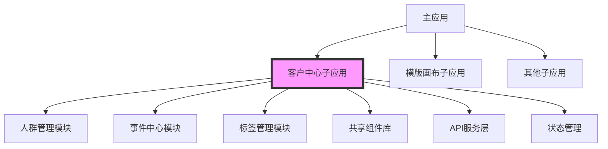
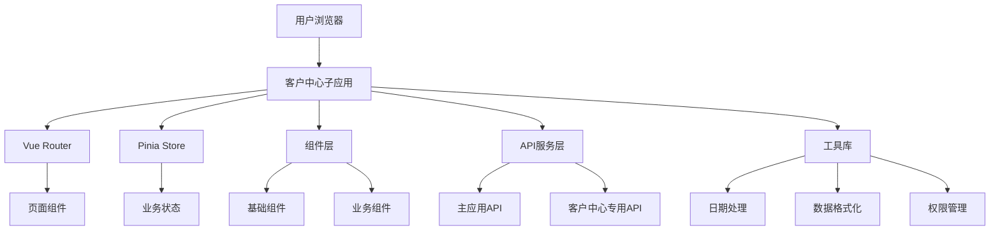

# 客户中心子应用迁移方案

## 1. 项目概述

客户中心是CDP（Customer Data Platform）应用的核心模块，包含人群管理、事件中心、标签管理三大核心功能。当前作为探索模块的一部分集成在主应用中，需要按照横版画布的独立子应用架构模式进行迁移拆分，实现功能模块化和服务独立化。

## 2. 迁移目标

### 2.1 架构目标
- 构建完全独立的客户中心子应用
- 采用横版画布的微前端集成模式
- 实现与主应用的松耦合集成
- 支持独立开发、测试、部署和运维

### 2.2 功能目标
- 完整迁移现有人群管理、事件中心、标签管理功能
- 保持现有业务逻辑和数据结构的完整性
- 优化用户界面交互体验
- 提升系统性能和可维护性

### 2.3 技术目标
- 基于Vue 3 + TypeScript + Vite构建
- 集成Arco Design组件库
- 实现统一的状态管理和路由管理
- 建立标准化的API接口规范

## 3. 范围定义

### 3.1 功能范围

#### 3.1.1 人群管理系统
- **人群管理**：人群列表展示、搜索、筛选、分页
- **人群创建**：自定义规则创建、数据导入创建
- **人群详情**：人群基本信息、规则配置、数据统计
- **人群编辑**：规则修改、数据更新、状态管理

#### 3.1.2 事件中心
- **事件管理**：事件列表、事件创建、事件编辑、状态管理
- **虚拟事件**：虚拟事件定义、事件关联、触发条件配置
- **样本统计**：事件数据统计、样本分析、效果评估
- **Kafka数据源**：数据源配置、数据接入、流数据处理

#### 3.1.3 标签管理系统
- **标签管理**：标签列表、标签创建、标签编辑、标签分类
- **标签创建**：自定义规则创建、数据导入创建、条件组配置
- **属性管理**：属性定义、属性分类、数据类型管理
- **表管理**：标签表注册、表结构管理、数据映射配置

### 3.2 技术范围
- 前端应用架构设计和实现
- 路由管理和状态管理
- API接口封装和数据模型定义
- 组件库封装和复用
- 与主应用的集成方案

### 3.3 非功能范围
- 性能优化和加载速度提升
- 错误处理和异常管理
- 日志记录和监控埋点
- 单元测试和集成测试

## 4. 架构设计

### 4.1 整体架构



### 4.2 技术架构



### 4.3 目录结构

```
customer-center/
├── src/
│   ├── components/          # 公共组件
│   │   ├── common/         # 通用组件
│   │   ├── audience/       # 人群相关组件
│   │   ├── event/          # 事件相关组件
│   │   └── tag/            # 标签相关组件
│   ├── pages/              # 页面组件
│   │   ├── audience/       # 人群管理页面
│   │   ├── event/          # 事件中心页面
│   │   └── tag/            # 标签管理页面
│   ├── api/                # API接口
│   │   ├── audience.ts     # 人群管理API
│   │   ├── event.ts        # 事件中心API
│   │   └── tag.ts          # 标签管理API
│   ├── stores/             # 状态管理
│   │   ├── audience.ts     # 人群状态
│   │   ├── event.ts        # 事件状态
│   │   └── tag.ts          # 标签状态
│   ├── router/             # 路由配置
│   ├── utils/              # 工具函数
│   ├── types/              # TypeScript类型定义
│   └── assets/             # 静态资源
├── package.json
├── vite.config.ts
└── tsconfig.json
```

## 5. 集成方案

### 5.1 集成方式
采用横版画布的微前端集成模式，通过iframe或模块联邦技术实现子应用与主应用的集成。

### 5.2 通信机制
- **父子通信**：通过postMessage或自定义事件
- **状态同步**：使用全局状态管理或事件总线
- **路由同步**：URL参数同步和路由跳转

### 5.3 样式隔离
- 使用CSS Modules或Scoped CSS
- 定义独立的样式命名空间
- 避免全局样式污染

### 5.4 数据共享
- 用户信息通过props传递
- 权限信息通过全局状态管理
- 业务数据通过API接口获取

## 6. 迁移步骤

### 第一阶段：基础架构搭建（1-2周）

#### 6.1.1 项目初始化
- 创建独立的Vue 3 + TypeScript项目
- 配置Vite构建工具
- 集成Arco Design组件库
- 设置ESLint和Prettier代码规范

#### 6.1.2 基础架构搭建
- 设计项目目录结构
- 配置路由管理和状态管理
- 创建基础组件库
- 实现统一的布局框架

#### 6.1.3 开发环境配置
- 配置开发服务器和热更新
- 设置代理和跨域处理
- 配置环境变量和配置文件
- 建立开发规范和代码审查流程

### 第二阶段：功能模块迁移（3-4周）

#### 6.2.1 人群管理系统迁移
- **页面迁移**：audience-management.vue、audience-create.vue、audience-detail.vue
- **组件迁移**：人群列表、搜索表单、创建表单、详情展示
- **API迁移**：人群管理相关的接口调用
- **状态管理**：人群数据的存储和管理

#### 6.2.2 事件中心迁移
- **页面迁移**：event-management.vue、virtual-events.vue、sample-stats.vue
- **组件迁移**：事件列表、事件表单、样本统计、Kafka配置
- **API迁移**：事件管理相关的接口调用
- **状态管理**：事件数据的存储和管理

#### 6.2.3 标签管理系统迁移
- **页面迁移**：tag-management.vue、tag-create.vue、tag-detail.vue
- **组件迁移**：标签列表、标签表单、条件配置、表管理
- **API迁移**：标签管理相关的接口调用
- **状态管理**：标签数据的存储和管理

### 第三阶段：集成测试和优化（2-3周）

#### 6.3.1 功能测试
- 单元测试：核心功能的单元测试
- 集成测试：模块间的集成测试
- 端到端测试：完整的用户流程测试
- 性能测试：加载速度和响应时间测试

#### 6.3.2 与主应用集成
- 集成横版画布的微前端框架
- 实现父子应用间的通信
- 配置路由同步和状态共享
- 处理样式隔离和冲突

#### 6.3.3 性能优化
- 代码分割和懒加载
- 组件缓存和优化
- API请求优化
- 打包体积优化

### 第四阶段：上线部署（1-2周）

#### 6.4.1 部署配置
- 配置生产环境构建
- 设置CI/CD流水线
- 配置域名和SSL证书
- 设置监控和日志

#### 6.4.2 上线验证
- 功能验证：所有功能正常运行
- 性能验证：满足性能要求
- 兼容性验证：浏览器兼容性测试
- 安全验证：安全性检查

## 7. 技术规范

### 7.1 编码规范
- 使用TypeScript进行类型安全的开发
- 遵循Vue 3 Composition API规范
- 统一的代码格式和命名规范
- 完整的注释和文档

### 7.2 组件规范
- 组件职责单一，可复用性强
- 明确的props和emits定义
- 完整的组件文档和示例
- 统一的错误处理机制

### 7.3 API规范
- RESTful API设计原则
- 统一的请求和响应格式
- 完整的错误码和错误信息
- API版本管理和兼容性

### 7.4 测试规范
- 单元测试覆盖率不低于80%
- 关键功能必须有集成测试
- 完整的测试用例和测试报告
- 自动化测试和持续集成

## 8. 风险评估

### 8.1 技术风险
- **兼容性问题**：与主应用的集成可能出现兼容性问题
- **性能问题**：独立应用可能影响整体性能
- **数据一致性**：数据同步和一致性问题

### 8.2 业务风险
- **功能缺失**：迁移过程中可能遗漏某些功能
- **用户体验**：界面变化可能影响用户使用习惯
- **数据丢失**：数据迁移过程中的丢失风险

### 8.3 缓解措施
- 制定详细的测试计划和验证方案
- 建立完整的备份和回滚机制
- 分阶段迁移，逐步验证
- 建立应急响应和问题处理机制

## 9. 交付物

### 9.1 代码交付
- 完整的客户中心子应用源代码
- 单元测试和集成测试代码
- 部署脚本和配置文件
- 数据库迁移脚本（如需要）

### 9.2 文档交付
- 技术架构文档
- API接口文档
- 部署和运维文档
- 用户使用手册

### 9.3 测试报告
- 功能测试报告
- 性能测试报告
- 安全测试报告
- 兼容性测试报告

## 10. 时间计划

| 阶段 | 任务 | 时间 | 里程碑 |
|-----|-----|------|--------|
| 第一阶段 | 基础架构搭建 | 1-2周 | 项目框架完成 |
| 第二阶段 | 功能模块迁移 | 3-4周 | 核心功能迁移完成 |
| 第三阶段 | 集成测试优化 | 2-3周 | 测试通过，性能达标 |
| 第四阶段 | 上线部署 | 1-2周 | 正式上线运行 |
| **总计** | **完整迁移** | **7-11周** | **项目交付** |

## 11. 团队分工

### 11.1 前端开发团队
- **架构师**：负责整体架构设计和技术选型
- **前端开发工程师**：负责具体功能开发和测试
- **UI/UX设计师**：负责界面设计和用户体验优化

### 11.2 后端支持团队
- **后端开发工程师**：提供API接口支持
- **数据库工程师**：负责数据迁移和优化
- **运维工程师**：负责部署和环境配置

### 11.3 测试团队
- **测试工程师**：负责功能测试和性能测试
- **QA工程师**：负责质量保证和流程管理

## 12. 验收标准

### 12.1 功能验收
- 所有核心功能完整迁移
- 用户界面与现有系统保持一致
- 数据处理逻辑正确无误
- 与主应用集成正常

### 12.2 性能验收
- 页面加载时间不超过3秒
- API响应时间不超过500ms
- 并发用户支持达到1000+
- 内存使用合理，无内存泄漏

### 12.3 质量验收
- 代码质量达到A级标准
- 单元测试覆盖率超过80%
- 无严重bug和安全隐患
- 文档完整，易于维护

通过本迁移方案的实施，客户中心将成为一个功能完整、性能优异、易于维护的独立子应用，为CDP平台的整体架构优化奠定基础。