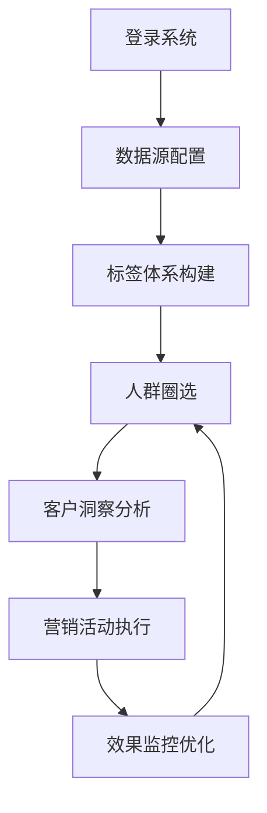

# 客群中心平台产品需求文档

## 1. 产品概述

客群中心平台是一个企业级客户数据管理与洞察平台，专注于解决企业客户数据分散、标签体系混乱、人群圈选效率低下的核心痛点。平台通过统一的数据管理、智能标签体系和精准圈选能力，为企业提供完整的客户洞察和营销支持解决方案。

平台的核心价值在于将分散的客户数据统一管理，建立标准化的客户标签体系，实现精准的客户分群和深度的客户洞察，最终形成完整的营销闭环，帮助企业提升客户运营效率和营销ROI。

## 2. 核心功能

### 2.1 用户角色

| 角色 | 注册方式 | 核心权限 |
|------|----------|----------|
| 数据分析师 | 企业邮箱注册 | 标签管理、人群分析、数据洞察 |
| 营销运营人员 | 邀请码注册 | 人群圈选、营销活动配置、效果监控 |
| 产品经理 | 管理员分配 | 客户360视图、产品策略分析、用户行为洞察 |
| 系统管理员 | 超级管理员分配 | 系统配置、权限管理、数据源管理 |

### 2.2 功能模块

客群中心平台包含以下核心页面：

1. **标签管理页面**：标签体系构建、标签规则配置、标签数据监控
2. **人群圈选页面**：可视化圈选工具、条件组合配置、人群预览验证
3. **客户360页面**：客户全景视图、行为轨迹分析、价值评估展示
4. **事件中心页面**：事件定义管理、事件数据监控、事件分析报告
5. **数据资产页面**：数据源管理、数据质量监控、数据血缘关系
6. **系统管理页面**：用户权限配置、系统参数设置、操作日志查看

### 2.3 页面详情

| 页面名称 | 模块名称 | 功能描述 |
|----------|----------|----------|
| 标签管理页面 | 标签体系管理 | 创建和管理客户标签分类，配置标签计算规则，监控标签覆盖率和准确性 |
| 标签管理页面 | 标签规则引擎 | 支持SQL和可视化两种标签规则配置方式，提供标签测试和验证功能 |
| 人群圈选页面 | 可视化圈选器 | 拖拽式条件配置，支持多维度组合筛选，实时预览圈选结果 |
| 人群圈选页面 | 人群管理 | 保存和管理圈选人群，支持人群对比分析，提供人群导出功能 |
| 客户360页面 | 客户档案 | 展示客户基础信息、标签画像、行为偏好等全方位信息 |
| 客户360页面 | 行为轨迹 | 时间线展示客户关键行为，支持行为路径分析和异常检测 |
| 事件中心页面 | 事件定义 | 定义和管理业务事件，配置事件属性和触发条件 |
| 事件中心页面 | 事件监控 | 实时监控事件触发情况，提供事件统计和趋势分析 |
| 数据资产页面 | 数据源管理 | 管理各类数据源连接，监控数据同步状态和质量 |
| 数据资产页面 | 数据血缘 | 展示数据流转关系，追踪数据来源和使用情况 |
| 系统管理页面 | 权限控制 | 配置用户角色和权限，管理数据访问控制策略 |
| 系统管理页面 | 系统配置 | 设置系统参数，管理集成配置和安全策略 |

## 3. 核心流程

### 主要用户操作流程

**数据分析师流程**：登录系统 → 配置数据源 → 创建标签体系 → 设置标签规则 → 验证标签效果 → 监控标签质量

**营销运营人员流程**：登录系统 → 选择圈选条件 → 预览目标人群 → 保存人群包 → 导出营销名单 → 跟踪营销效果

**产品经理流程**：登录系统 → 查看客户360视图 → 分析用户行为 → 洞察产品使用情况 → 制定产品策略

## 4. 用户界面设计

### 4.1 设计风格

- **主色调**：#1890FF（科技蓝）、#52C41A（成功绿）
- **辅助色**：#FAAD14（警告黄）、#F5222D（错误红）
- **按钮样式**：圆角矩形，支持多种尺寸和状态
- **字体规范**：主标题16px，正文14px，辅助文字12px
- **布局风格**：卡片式布局，左侧导航，顶部面包屑导航
- **图标风格**：线性图标，统一使用Arco Design图标库

### 4.2 页面设计概览

| 页面名称 | 模块名称 | UI元素 |
|----------|----------|--------|
| 标签管理页面 | 标签体系管理 | 树形结构展示标签分类，卡片式展示标签详情，支持拖拽排序和批量操作 |
| 人群圈选页面 | 可视化圈选器 | 左侧条件面板，中间画布区域，右侧预览面板，支持条件拖拽和实时预览 |
| 客户360页面 | 客户档案 | 顶部客户基础信息卡片，中间标签云展示，底部行为时间线，支持信息快速检索 |
| 事件中心页面 | 事件监控 | 仪表盘式数据展示，支持时间范围筛选，提供多维度图表分析 |
| 数据资产页面 | 数据血缘 | 流程图式展示数据关系，支持节点点击查看详情，提供搜索和筛选功能 |
| 系统管理页面 | 权限控制 | 表格式权限配置，支持批量操作，提供权限模板和继承机制 |

### 4.3 响应式设计

平台采用桌面优先的设计策略，同时兼容平板设备访问。主要功能针对大屏幕操作优化，支持多窗口并行工作。移动端提供基础的数据查看功能，不支持复杂的配置操作。