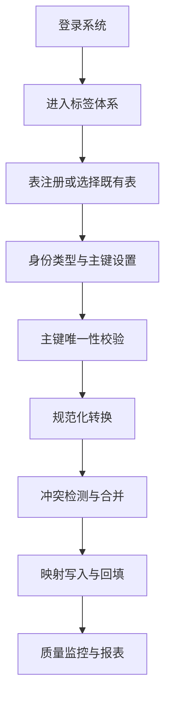
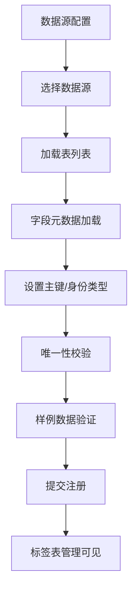
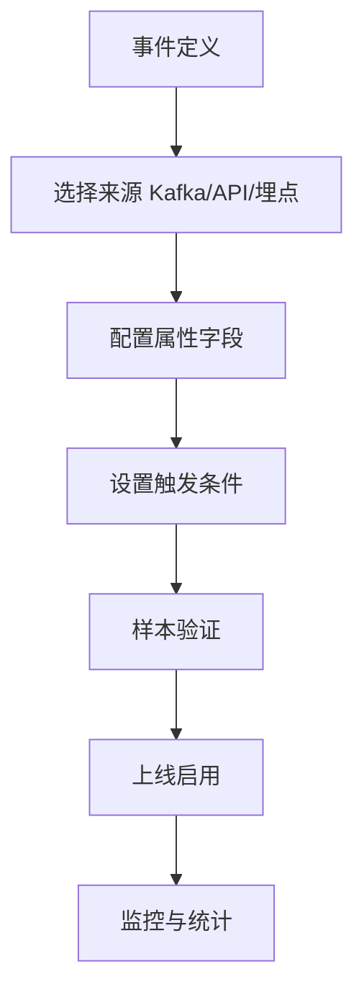

# 客群中心平台产品需求文档

## 1. 产品概述

客群中心平台是一个企业级客户数据管理与洞察平台，专注于解决企业客户数据分散、标签体系混乱、人群圈选效率低下的核心痛点。平台通过统一的数据管理、智能标签体系和精准圈选能力，为企业提供完整的客户洞察和营销支持解决方案。

平台的核心价值在于将分散的客户数据统一管理，建立标准化的客户标签体系，实现精准的客户分群和深度的客户洞察，最终形成完整的营销闭环，帮助企业提升客户运营效率和营销ROI。

## 2. 核心功能

### 2.1 用户角色

| 角色 | 注册方式 | 核心权限 |
|------|----------|----------|
| 数据分析师 | 企业邮箱注册 | 标签管理、人群分析、数据洞察 |
| 营销运营人员 | 邀请码注册 | 人群圈选、营销活动配置、效果监控 |
| 产品经理 | 管理员分配 | 客户360视图、产品策略分析、用户行为洞察 |
| 系统管理员 | 超级管理员分配 | 系统配置、权限管理、数据源管理 |

### 2.2 功能模块

客群中心平台包含以下核心子系统：

1. **标签系统**：标签表管理、标签管理、属性管理
2. **人群系统**：人群管理、人群圈选、人群分析
3. **事件中心**：事件管理、虚拟事件、事件监控
4. **数据源管理**：数据源配置、数据表注册、ID映射管理

### 2.3 页面架构

#### 标签系统页面架构
- **标签系统首页**：功能导航、快速操作、最近操作记录
- **标签表管理**：数据表注册、ID映射配置、表结构管理
- **标签管理**：标签创建、编辑、删除、批量导入、规则配置
- **属性管理**：标签属性定义、约束配置、计算规则设置

#### 人群系统页面架构
- **人群管理**：人群创建、编辑、分析、导出功能
- **人群圈选**：可视化圈选器、条件组合、实时预览

#### 事件中心页面架构
- **事件中心首页**：事件概览、趋势分析、性能监控
- **事件管理**：事件创建、配置、状态管理
- **虚拟事件**：虚拟事件定义、组合事件配置
- **事件监控**：实时事件流、异常检测、性能指标

#### 数据源管理页面架构
- **数据源配置**：多数据源连接、连接测试、状态监控
- **数据表注册**：表结构导入、字段映射、元数据管理
- **ID映射管理**：多源ID关联、映射规则、一致性检查

### 2.4 核心功能详情

#### 2.4.1 标签系统功能

**标签表管理**：
- 数据表注册：支持多种数据源类型（MySQL、PostgreSQL、Oracle等）
- ID映射配置：配置用户ID映射关系，支持多源数据关联
- 表结构管理：自动导入表结构、字段类型识别、元数据维护
- 批量导入：支持Excel、CSV、JSON格式文件导入

**标签管理**：
- 标签创建：支持静态标签、动态标签、计算标签、规则标签
- 标签分类：基础信息、行为特征、偏好特征、业务特征四大分类
- 标签规则引擎：可视化规则配置、SQL规则配置、条件组合
- 标签值管理：多标签值配置、条件规则设置、逻辑关系定义
- 通知管理：标签状态变化通知、多渠道通知配置

**属性管理**：
- 属性定义：数据类型定义、约束条件设置、计算规则配置
- 属性映射：字段映射关系、数据源关联、映射规则维护

#### 2.4.4 ID映射（Identity Mapping）

- 目标：将外部身份标识映射到平台统一客户ID，打通跨渠道、跨系统的客户识别。
- 支持标识类型：`mobile`（手机号）、`email`（邮箱）、`device_id/imei/idfa`（设备）、`openId/unionId`（小程序/公众号）、`account_id`、`member_id` 等。
- 映射策略：
  - 规范化处理：去空/前后缀、大小写统一、国家码归一、邮箱本地名规范化等。
  - 唯一性约束：`identityType + primaryKey` 唯一，避免重复映射。
  - 冲突处理：按优先级（数据源权重、最新更新时间）与人工介入策略合并/覆盖。
  - 多标识合并：同一客户的多标识聚合到统一 `customerId`。
- 执行入口：
  - 标签表管理中的“配置映射/编辑映射”。
  - 表注册页支持设置身份类型与主键，并触发唯一性校验。
- 质量监控：覆盖率、冲突率、孤立标识数、最近异常记录与趋势监控。

#### 2.4.5 注册流程（事件与表）

- 表注册：数据源选择（DB/API）、表名选择、字段加载、主键唯一性校验、身份类型设置、样例数据验证、注册成功写入标签表目录。
- 事件注册：事件名称、类型与来源（Kafka/埋点/API）、触发条件、属性字段、注册Key（`registryKey`）、样本验证、状态切换与监控。
- Kafka数据源：`bootstrapServers`、`securityProtocol`、`saslMechanism`、`username`、`password`、`topics`、`consumerGroups` 等配置与健康状态。

#### 2.4.2 事件中心功能

**事件概览**：
- 事件统计：事件总数、在线事件、虚拟事件统计
- 趋势分析：多时间维度趋势分析、对比分析
- 性能监控：响应时间监控、吞吐量监控、错误率监控
- 事件类型分布：饼图展示不同类型事件占比

**事件管理**：
- 事件创建：快速创建事件、事件属性配置、触发条件设置
- 事件分类：系统事件、业务事件、用户事件、营销事件、风控事件
- 事件测试：事件模拟触发、测试验证、调试功能

**虚拟事件**：
- 虚拟事件定义：组合多个事件、定义触发逻辑
- 事件关系：事件依赖关系、触发顺序、条件组合

#### 2.4.3 人群系统功能

**人群管理**：
- 人群创建：基于标签条件创建人群、人群命名和描述
- 人群分析：人群画像分析、人群对比、人群趋势
- 人群导出：支持多种格式导出、字段选择、数据脱敏

**人群圈选**：
- 可视化圈选器：拖拽式条件配置、实时预览结果
- 条件组合：多维度条件组合、逻辑关系设置、条件分组
- 人群预览：实时显示人群数量、人群特征分析

## 3. 核心流程

### 3.1 主要用户操作流程

**数据分析师流程**：登录系统 → 配置数据源 → 创建标签体系 → 设置标签规则 → 验证标签效果 → 监控标签质量

**营销运营人员流程**：登录系统 → 选择圈选条件 → 预览目标人群 → 保存人群包 → 导出营销名单 → 跟踪营销效果

**产品经理流程**：登录系统 → 查看客户360视图 → 分析用户行为 → 洞察产品使用情况 → 制定产品策略

### 3.2 系统管理流程

**标签创建流程**：
1. 选择创建方式（自定义规则、数据导入）
2. 配置标签基本属性（ID、名称、分类、类型）
3. 设置标签规则（条件配置、逻辑关系）
4. 配置标签值和条件
5. 设置通知管理
6. 保存并测试标签

**事件管理流程**：
1. 事件创建和基本配置
2. 事件属性定义
3. 触发条件设置
4. 事件测试验证
5. 事件状态监控
6. 事件性能优化

**人群圈选流程**：
1. 选择圈选条件和标签
2. 配置条件逻辑关系
3. 实时预览人群结果
4. 分析人群特征
5. 保存人群定义
6. 导出或使用人群

### 3.3 ID映射流程

### 3.4 表注册流程

### 3.5 事件注册流程

### 3.6 实现说明注记

- 事件中心当前数据来源为 `src/mock/event.ts`，后续可替换为真实后端服务接口。
- 标签体系的表注册、ID映射等操作调用 `src/api/tag.ts` 与 `datasourceAPI`，主键唯一性校验使用 `checkPrimaryKeyUniqueness`。

## 4. 用户界面设计

### 4.1 设计风格

- **主色调**：#1890FF（科技蓝）、#52C41A（成功绿）
- **辅助色**：#FAAD14（警告黄）、#F5222D（错误红）
- **按钮样式**：圆角矩形，支持多种尺寸和状态
- **字体规范**：主标题16px，正文14px，辅助文字12px
- **布局风格**：卡片式布局，左侧导航，顶部面包屑导航
- **图标风格**：线性图标，统一使用Arco Design图标库

### 4.2 页面设计概览

#### 4.2.1 标签系统页面设计

**标签系统首页**：
- 功能卡片式导航，展示三大核心功能模块
- 快速操作区域，支持常用功能快捷访问
- 最近操作时间线，展示用户操作历史
- 统计信息展示，包括标签数量、表数量等

**标签管理页面**：
- 表格展示标签列表，支持分页、搜索、筛选
- 标签属性展示：ID、名称、数据类型、分类、类型等
- 操作列支持编辑、更新、删除功能
- 支持批量操作和批量导入

**标签创建/编辑页面**：
- 多模式创建：自定义规则、数据导入
- 标签基本属性配置表单
- 标签值管理和条件配置
- 通知管理和webhook配置
- 规则引擎可视化配置界面

#### 4.2.2 事件中心页面设计

**事件中心首页**：
- 统计卡片展示核心指标
- 趋势分析图表（折线图）
- 事件类型分布（饼图）
- 最近事件列表
- 性能指标雷达图
- 快捷操作入口

**事件管理页面**：
- 事件列表展示和管理
- 事件创建和配置表单
- 事件属性定义和配置
- 事件测试和验证功能

#### 4.2.3 人群系统页面设计

**人群管理页面**：
- 人群列表展示
- 人群创建和编辑
- 人群分析和画像
- 人群导出功能

**人群圈选页面**：
- 可视化圈选器
- 条件配置面板
- 实时预览区域
- 人群分析结果

### 4.3 响应式设计

平台采用桌面优先的设计策略，同时兼容平板设备访问。主要功能针对大屏幕操作优化，支持多窗口并行工作。移动端提供基础的数据查看功能，不支持复杂的配置操作。

### 4.4 交互设计原则

- **一致性**：保持交互逻辑和视觉风格的一致性
- **反馈性**：用户操作后立即提供反馈
- **可预测性**：用户能够预测操作结果
- **容错性**：提供撤销和错误恢复机制
- **可访问性**：支持键盘导航和屏幕阅读器

## 5. 技术架构

### 5.1 前端技术栈

- **框架**：Vue 3 (Composition API)
- **构建工具**：Vite
- **状态管理**：Vuex
- **路由管理**：Vue Router
- **UI组件库**：Arco Design
- **图表库**：ECharts
- **开发语言**：TypeScript + JavaScript

### 5.2 核心组件架构

**标签系统组件**：
- 标签表格列表组件
- 标签创建/编辑模态框组件
- 条件配置组件
- 规则节点组件
- 批量导入抽屉组件

**事件中心组件**：
- 事件统计卡片组件
- 趋势图表组件
- 事件列表组件
- 事件创建表单组件

**通用组件**：
- 条件配置组件（复用）
- 文件上传组件
- 数据表格组件
- 图表容器组件

### 5.3 数据管理

- **状态管理**：使用Vuex进行全局状态管理
- **数据获取**：封装API调用逻辑
- **数据缓存**：实现数据缓存和更新机制
- **错误处理**：统一的错误处理和用户提示

## 6. 数据模型

### 6.1 标签数据模型

**标签基本信息**：
- 标签ID、名称、描述
- 数据类型（字符型、数值型）
- 标签分类（基础信息、行为特征、偏好特征、业务特征）
- 标签类型（静态、动态、计算、规则）
- 维度主键、共享级别
- 创建人、创建时间

**标签规则配置**：
- 条件组配置
- 逻辑关系设置
- 标签值定义
- 通知配置

### 6.2 事件数据模型

**事件基本信息**：
- 事件ID、事件名称
- 事件类型、事件分类
- 创建时间、状态
- 响应时间、性能指标

**事件属性**：
- 属性名称、属性类型
- 属性值约束
- 触发条件

**事件注册字段**：
- `id`, `eventName`, `eventType`, `eventSource`, `triggerCondition`, `status`, `registryKey`, `owner`, `description`, `createTime`, `updateTime`

### 6.3 人群数据模型

**人群基本信息**：
- 人群ID、人群名称
- 人群描述、创建时间
- 人群数量、人群特征

**人群条件**：
- 标签条件、逻辑关系
- 条件组合、分组设置

### 6.4 标签表与ID映射数据模型

**标签表字段**：
- `id`, `tableName`, `tableDesc`, `dataSource`, `recordCount`, `status`, `mappingStatus`, `identityType`, `primaryKey`, `createTime`, `updateTime`, `mappingRule`

**ID映射字段**：
- `customerId`, `identityType`, `identityValue`, `normalizedValue`, `sourceTable`, `createTime`, `updateTime`, `conflictFlag`, `priority`

**样本统计字段（事件中心）**：
- `messageType`, `size`, `format`, `content`, `timeBucket`, `typeDist`, `anomalyScore`

**Kafka数据源字段**：
- `id`, `name`, `bootstrapServers`, `securityProtocol`, `saslMechanism`, `username`, `password`, `status`, `topics[name, partitions, replicationFactor, consumerGroups]`, `createdAt`, `updatedAt`

## 7. 扩展功能

### 7.1 高级功能

**标签智能推荐**：
- 基于数据特征自动推荐标签
- 标签效果预测
- 标签优化建议

**人群智能分析**：
- 人群特征自动分析
- 人群对比分析
- 人群趋势预测

**事件智能监控**：
- 异常事件自动检测
- 事件趋势预警
- 性能异常告警

### 7.2 集成能力

**第三方系统集成**：
- CRM系统集成
- 营销平台集成
- 数据分析平台集成

**API接口**：
- 标签查询API
- 人群查询API
- 事件查询API

### 7.3 安全与权限

**数据安全**：
- 数据加密存储
- 数据传输加密
- 敏感数据脱敏

**权限管理**：
- 基于角色的权限控制
- 数据访问权限
- 操作权限控制

## 8. 性能优化

### 8.1 前端性能优化

**代码优化**：
- 组件懒加载
- 代码分割
- 图片优化

**数据优化**：
- 数据分页加载
- 数据缓存策略
- 请求合并优化

### 8.2 用户体验优化

**响应速度**：
- 骨架屏加载
- 渐进式加载
- 异步数据加载

**交互优化**：
- 操作反馈优化
- 动画效果优化
- 错误提示优化

## 9. 部署与运维

### 9.1 部署方案

**前端部署**：
- 静态资源部署
- CDN加速
- 版本管理

**监控告警**：
- 性能监控
- 错误监控
- 用户行为监控

### 9.2 运维支持

**日志管理**：
- 前端错误日志
- 用户操作日志
- 性能日志

**更新维护**：
- 热更新机制
- 版本回滚
- 灰度发布

---

本文档基于实际项目代码实现进行更新，反映了当前系统的真实功能状态和技术架构。后续将根据产品迭代持续更新和完善。
