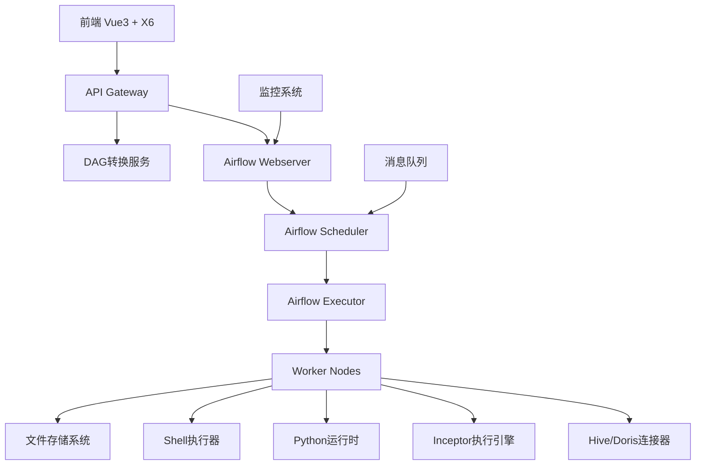
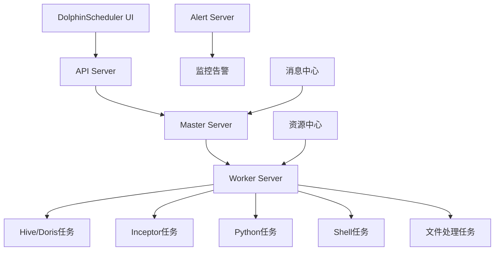

# 工作流调度系统业务场景技术方案对比

## 1. 业务场景需求分析

### 1.1 核心业务功能
- **SQL执行引擎**: 连接Hive、Doris数据源，使用Inceptor作为执行引擎
- **Python脚本执行**: 支持数据处理、机器学习、ETL等Python任务
- **文件存储管理**: 处理大数据文件的存储、传输和管理
- **Shell脚本执行**: 系统级操作和批处理任务
- **消息触发机制**: 接收上游系统消息，触发工作流执行

### 1.2 数据流程设计

数据流程是工作流调度系统的核心组成部分，需要支持完整的数据处理生命周期：

#### 1.2.1 数据输入
- **多源接入**: 支持文件系统（CSV、JSON、Parquet等）、关系型数据库（MySQL、PostgreSQL）、大数据平台（Hive、Doris）、API接口等多种数据源
- **实时/批量**: 支持实时流数据和批量数据的统一接入
- **数据校验**: 提供数据格式校验、完整性检查、数据质量评估等功能
- **元数据管理**: 自动识别和管理数据源的schema信息

#### 1.2.2 数据筛选
- **条件过滤**: 支持基于字段值、时间范围、正则表达式等多种过滤条件
- **数据清洗**: 处理空值、重复数据、异常值等数据质量问题
- **采样功能**: 支持随机采样、分层采样等数据采样方法
- **动态筛选**: 支持基于运行时参数的动态筛选条件

#### 1.2.3 数据合并
- **多表关联**: 支持内连接、外连接、交叉连接等SQL标准连接方式
- **数据聚合**: 提供分组聚合、窗口函数、统计分析等聚合处理能力
- **数据拼接**: 支持行拼接（UNION）和列拼接（JOIN）操作
- **冲突处理**: 处理数据合并过程中的字段冲突和数据类型转换

#### 1.2.4 数据输出
- **中间结果输出**: 支持在流程任意节点输出中间处理结果，便于调试和监控
- **继续加工能力**: 中间结果可作为下游节点的输入，支持复杂的数据处理链路
- **多格式输出**: 支持输出到文件、数据库、消息队列、API等多种目标
- **增量输出**: 支持全量和增量两种输出模式，优化大数据场景下的性能
- **输出校验**: 提供输出数据的完整性和正确性校验机制

### 1.3 技术挑战
- 多种异构数据源的连接和管理
- 大规模数据处理的性能优化
- 复杂依赖关系的任务调度
- 实时监控和故障恢复
- 企业级安全和权限控制

## 2. 技术方案对比

### 2.1 Airflow + X6 混合方案

#### 架构设计

#### 核心组件
- **前端层**: Vue 3 + AntV X6 + Arco Design
- **API层**: FastAPI/Express + DAG转换服务
- **调度层**: Apache Airflow
- **执行层**: Airflow Workers + 自定义Operators
- **存储层**: PostgreSQL/MySQL + Redis + HDFS/S3

#### 业务场景适配

| 业务场景 | 实现方案 | 优势 | 挑战 |
|---------|---------|------|------|
| SQL执行 | 自定义HiveOperator、DorisOperator、InceptorOperator | 成熟的连接池管理、SQL解析优化 | 需要开发自定义Operator |
| Python脚本 | PythonOperator + 虚拟环境管理 | 原生支持、依赖隔离 | 资源管理复杂 |
| 文件存储 | FileSystemOperator + S3Operator | 多种存储后端支持 | 大文件传输性能 |
| Shell脚本 | BashOperator + 安全沙箱 | 原生支持、灵活配置 | 安全风险控制 |
| 消息触发 | 自定义Sensor + 消息队列集成 | 实时响应、可靠性高 | 消息处理复杂度 |
| 数据流程管理 | 自定义DataProcessor + XCom数据传递 | 灵活的数据处理链路、强大的中间结果管理 | 需要自定义开发数据处理组件 |

#### 技术优势
- **成熟生态**: 丰富的Operator库和社区支持
- **灵活扩展**: 易于开发自定义组件
- **监控完善**: 内置Web UI和监控指标
- **容错机制**: 完善的重试和故障恢复
- **权限控制**: 基于RBAC的细粒度权限管理

#### 运维成本
- **部署复杂度**: 中等（需要配置多个组件）
- **维护成本**: 中等（需要专业运维知识）
- **资源消耗**: 较高（多进程架构）
- **监控要求**: 高（需要监控多个服务）

### 2.2 DolphinScheduler 方案

#### 架构设计

#### 核心组件
- **前端层**: DolphinScheduler Web UI（React）
- **API层**: DolphinScheduler API Server
- **调度层**: Master Server + Worker Server
- **存储层**: MySQL/PostgreSQL + Zookeeper
- **监控层**: Alert Server + Prometheus

#### 业务场景适配

| 业务场景 | 实现方案 | 优势 | 挑战 |
|---------|---------|------|------|
| SQL执行 | 内置SQL任务类型 + 数据源管理 | 开箱即用、可视化配置 | 对Inceptor支持需要定制 |
| Python脚本 | Python任务类型 + 资源管理 | 简单易用、资源隔离 | 依赖管理相对简单 |
| 文件存储 | 资源中心 + 文件任务 | 统一资源管理 | 大文件处理能力有限 |
| Shell脚本 | Shell任务类型 + 参数传递 | 原生支持、安全控制 | 执行环境限制 |
| 消息触发 | 补数据 + API触发 | 简单直接 | 实时性相对较弱 |
| 数据流程管理 | 内置数据集成任务 + 可视化数据流设计 | 开箱即用的数据处理能力、直观的流程设计 | 复杂数据处理逻辑的定制化能力有限 |

#### 技术优势
- **开箱即用**: 完整的工作流管理解决方案
- **可视化强**: 直观的DAG编辑和监控界面
- **中文友好**: 国产开源，中文文档完善
- **资源管理**: 统一的资源中心和权限管理
- **高可用**: 内置集群和故障转移机制

#### 运维成本
- **部署复杂度**: 低（一体化部署）
- **维护成本**: 低（统一管理界面）
- **资源消耗**: 中等（优化的架构设计）
- **监控要求**: 中等（内置监控功能）

## 3. 详细对比分析

### 3.1 功能场景对比

#### SQL执行能力
- **Airflow + X6**: 需要开发自定义Operator，但可以精确控制连接参数和执行逻辑
- **DolphinScheduler**: 内置SQL任务类型，但对Inceptor的支持需要额外开发

#### Python脚本执行
- **Airflow + X6**: PythonOperator功能强大，支持虚拟环境和依赖管理
- **DolphinScheduler**: Python任务类型简单易用，但高级功能相对有限

#### 文件存储管理
- **Airflow + X6**: 支持多种存储后端，灵活性高
- **DolphinScheduler**: 统一资源中心，管理简单但扩展性有限

#### 消息触发机制
- **Airflow + X6**: 通过Sensor实现，支持多种消息源，实时性好
- **DolphinScheduler**: 主要通过API触发，实时性相对较弱

### 3.2 技术架构对比

| 对比维度 | Airflow + X6 | DolphinScheduler |
|---------|-------------|------------------|
| 架构复杂度 | 高（微服务架构） | 中（一体化架构） |
| 扩展性 | 极高（插件化设计） | 中（模块化设计） |
| 性能 | 高（分布式执行） | 中高（集群执行） |
| 稳定性 | 高（成熟方案） | 中高（相对较新） |
| 社区支持 | 极高（Apache顶级项目） | 中（国内活跃） |

### 3.3 运维成本对比

#### 部署和配置
- **Airflow + X6**: 需要配置多个组件，学习曲线陡峭
- **DolphinScheduler**: 一体化部署，配置相对简单

#### 日常维护
- **Airflow + X6**: 需要监控多个服务，运维复杂度高
- **DolphinScheduler**: 统一管理界面，运维相对简单

#### 故障处理
- **Airflow + X6**: 故障定位复杂，但恢复机制完善
- **DolphinScheduler**: 故障定位相对简单，恢复机制较好

### 3.4 开发成本对比

#### 初期开发
- **Airflow + X6**: 需要开发DAG转换服务和自定义Operator，工作量大
- **DolphinScheduler**: 主要是界面定制和Inceptor集成，工作量中等

#### 后期维护
- **Airflow + X6**: 需要维护多个组件，但扩展性强
- **DolphinScheduler**: 维护相对简单，但定制化能力有限

## 4. 面向不同角色的友好度分析

### 4.1 数据科学家
- **Airflow + X6**: 需要学习DAG编写，但Python集成度高
- **DolphinScheduler**: 可视化界面友好，学习成本低

### 4.2 数据工程师
- **Airflow + X6**: 灵活性高，可以精确控制执行逻辑
- **DolphinScheduler**: 开发效率高，但定制化能力有限

### 4.3 数据分析师
- **Airflow + X6**: 需要技术背景，使用门槛高
- **DolphinScheduler**: 界面直观，易于使用和理解

### 4.4 运维人员
- **Airflow + X6**: 运维复杂度高，需要专业知识
- **DolphinScheduler**: 运维相对简单，学习成本低

## 5. 推荐方案

### 5.1 综合评估

基于业务场景需求和技术对比分析，**推荐采用DolphinScheduler方案**，理由如下：

#### 主要优势
1. **业务匹配度高**: 内置的任务类型基本覆盖所有业务场景
2. **运维成本低**: 一体化架构，部署和维护简单
3. **用户友好**: 可视化界面降低使用门槛
4. **中文支持**: 国产开源，文档和社区支持好
5. **快速上线**: 开箱即用，项目周期短

#### 需要解决的问题
1. **Inceptor集成**: 开发自定义任务类型支持Inceptor
2. **实时触发**: 增强消息触发机制的实时性
3. **大文件处理**: 优化文件存储和传输能力

### 5.2 实施计划

#### 第一阶段（1-2个月）
- 部署DolphinScheduler集群环境
- 开发Inceptor任务类型插件
- 配置Hive和Doris数据源连接
- 实现基础的工作流创建和执行

#### 第二阶段（2-3个月）
- 开发消息触发增强组件
- 优化文件存储和传输机制
- 完善监控和告警系统
- 用户培训和文档编写

#### 第三阶段（1个月）
- 性能优化和压力测试
- 生产环境部署和切换
- 运维流程建立和优化

### 5.3 风险控制

#### 技术风险
- **Inceptor集成复杂度**: 提前进行技术验证和原型开发
- **性能瓶颈**: 建立性能测试环境，及时发现和解决问题
- **数据安全**: 建立完善的权限控制和审计机制

#### 项目风险
- **人员技能**: 提供充分的培训和技术支持
- **进度延期**: 采用敏捷开发，分阶段交付
- **需求变更**: 保持架构灵活性，支持后续扩展

## 6. 总结

DolphinScheduler方案在当前业务场景下具有明显优势，能够以较低的成本快速实现业务需求。虽然在某些高级功能上不如Airflow灵活，但对于大多数企业级数据处理场景已经足够。通过合理的实施计划和风险控制，可以确保项目的成功交付和稳定运行。