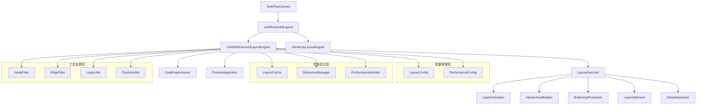
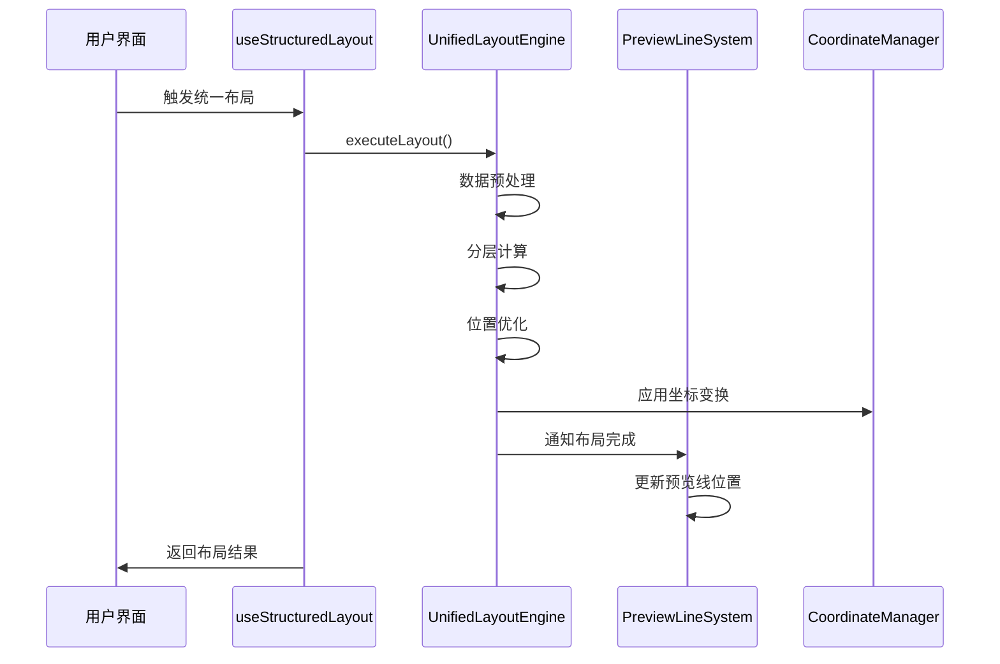
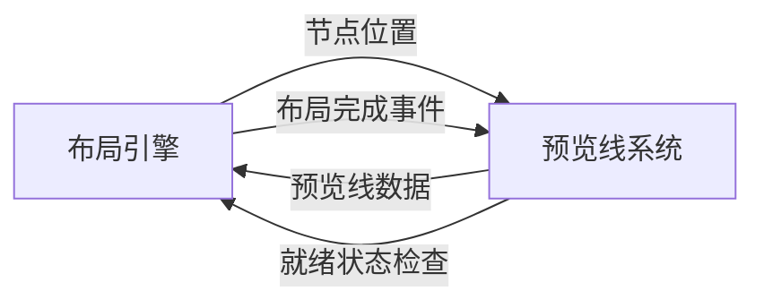

# 布局引擎核心功能分析报告

## 1. 系统架构概览

### 1.1 布局引擎核心组件架构

营销画布系统的布局引擎采用分层模块化架构设计，实现了统一的布局计算和节点定位管理：

#### 🎯 UnifiedStructuredLayoutEngine - 统一结构化布局引擎（核心层）

**文件位置**: `src/pages/marketing/tasks/utils/canvas/UnifiedStructuredLayoutEngine.js`

**核心职责**:

* 作为布局系统的统一管理入口和协调器

* 处理基于父子关联关系的分层分级自底向上定位

* 维护布局数据模型和性能监控

* 提供与预览线系统的集成接口

**关键特性**:

```javascript
// 核心配置模块
this.layoutConfig = new LayoutConfig(options.layout || {});
this.performanceConfig = new PerformanceConfig(options.performance || {});

// 核心算法模块
this.dataPreprocessor = new DataPreprocessor(this.graph, this.layoutConfig);
this.layerCalculator = new LayerCalculator(this.layoutConfig);
this.hierarchicalBuilder = new HierarchicalBuilder(this.layoutConfig);
this.bottomUpPositioner = new BottomUpPositioner(this.layoutConfig);
this.layerOptimizer = new LayerOptimizer(this.layoutConfig);
this.globalOptimizer = new GlobalOptimizer(this.layoutConfig);
this.positionApplicator = new PositionApplicator(this.layoutConfig);

// 性能优化模块
this.cache = new LayoutCache(this.performanceConfig.cache);
this.debounceManager = new DebounceManager(this.performanceConfig.debounce);
this.performanceMonitor = new PerformanceMonitor();
```

#### 🔧 HierarchyLayoutEngine - 层级布局引擎（算法层）

**文件位置**: `src/composables/layout/HierarchyLayoutEngine.js`

**核心职责**:

* 基于@antv/hierarchy的CompactBox布局算法

* 提供与UnifiedStructuredLayoutEngine兼容的接口

* 处理营销画布的垂直分层布局需求

**算法特性**:

```javascript
// @antv/hierarchy集成
import * as Hierarchy from '@antv/hierarchy';
const { compactBox } = Hierarchy;

// 层级配置
hierarchy: {
  algorithm: 'compactBox',
  direction: layoutDirection.value === 'TB' ? 'TB' : 'LR',
  getHGap: () => layoutConfig.value.nodeSpacing || 200,
  getVGap: () => layoutConfig.value.levelHeight || 200,
  enableOptimization: true
}
```

#### 🚀 LayoutService - 布局服务（接口层）

**文件位置**: `src/services/marketing/LayoutService.js`

**核心职责**:

* 提供标准化的布局服务接口

* 统一的布局响应格式和错误处理

* 与外部系统的集成接口

* 布局配置和优化管理

### 1.2 布局引擎模块化架构



## 2. 核心功能函数分析

### 2.1 布局执行功能

#### 🎯 UnifiedStructuredLayoutEngine.executeLayout()

**功能**: 执行布局的主要对外接口

```javascript
async executeLayout(layoutInput = {}) {
  const sessionId = `layout_${Date.now()}_${Math.random().toString(36).substr(2, 9)}`;
  console.log(`🎯 [统一布局引擎] 开始执行布局 - 会话: ${sessionId}`);
  
  try {
    // 开始性能监控
    this.performanceMonitor.startSession(sessionId, layoutInput);
    
    // 获取节点和边数据
    const nodes = this.graph.getNodes();
    const edges = this.graph.getEdges();
    
    // 阶段1: 数据预处理
    const preprocessedData = await this.dataPreprocessor.preprocess(
      nodes,
      edges,
      layoutInput
    );
    
    // 阶段2: 布局计算
    const layoutResult = await this.layoutExecutor.executeLayout(
      preprocessedData,
      layoutInput.bounds,
      layoutInput.options
    );
    
    // 阶段3: 位置应用
    const applicationResult = await this.positionApplicator.applyPositions(
      this.graph,
      layoutResult.positions,
      layoutInput.options
    );
    
    return {
      success: true,
      sessionId,
      layoutResult,
      applicationResult,
      timestamp: new Date().toISOString()
    };
  } catch (error) {
    console.error(`❌ [统一布局引擎] 布局执行失败 - 会话: ${sessionId}`, error);
    throw error;
  }
}
```

#### 🔧 useStructuredLayout.applyUnifiedStructuredLayout()

**功能**: 应用统一结构化布局的组合式API

```javascript
const applyUnifiedStructuredLayout = async (targetGraph = null) => {
  const workingGraph = targetGraph || getGraph()
  if (!workingGraph) {
    console.warn('[useStructuredLayout] 无法应用布局：图实例不存在')
    return { success: false, message: '图实例不存在' }
  }

  console.log('🎯 [useStructuredLayout] 开始应用统一结构化布局')
  isLayouting.value = true

  try {
    // 获取或创建布局引擎实例
    if (!layoutEngineInstance.value) {
      layoutEngineInstance.value = createLayoutEngineInstance(workingGraph)
    }

    // 执行布局
    const layoutResult = await layoutEngineInstance.value.executeLayout({
      bounds: workingGraph.getGraphArea(),
      options: {
        direction: layoutDirection.value,
        ...layoutOptions.value
      }
    })

    // 更新统计信息
    updateLayoutStats({
      lastLayoutTime: Date.now(),
      layoutCount: layoutStats.value.layoutCount + 1,
      success: true
    })

    console.log('✅ [useStructuredLayout] 统一结构化布局应用完成')
    return { success: true, result: layoutResult }

  } catch (error) {
    console.error('❌ [useStructuredLayout] 布局应用失败:', error)
    updateLayoutStats({ success: false, lastError: error.message })
    return { success: false, error: error.message }
  } finally {
    isLayouting.value = false
  }
}
```

### 2.2 布局引擎初始化功能

#### 🏗️ useStructuredLayout.initializeLayoutEngine()

**功能**: 初始化布局引擎

```javascript
const initializeLayoutEngine = async (graph) => {
  if (!graph) {
    console.warn('[useStructuredLayout] 初始化布局引擎失败：图实例为空')
    return false
  }

  try {
    console.log('🏗️ [useStructuredLayout] 开始初始化布局引擎')
    
    // 预创建布局引擎实例
    layoutEngineInstance.value = createLayoutEngineInstance(graph)
    
    if (!layoutEngineInstance.value) {
      throw new Error('布局引擎实例创建失败')
    }

    // 设置全局引用
    if (typeof window !== 'undefined') {
      window.layoutEngine = layoutEngineInstance.value
      window.UnifiedStructuredLayoutEngine = UnifiedStructuredLayoutEngine
    }

    console.log('✅ [useStructuredLayout] 布局引擎初始化完成')
    return true

  } catch (error) {
    console.error('❌ [useStructuredLayout] 布局引擎初始化失败:', error)
    return false
  }
}
```

#### 🔧 useStructuredLayout.createLayoutEngineInstance()

**功能**: 创建布局引擎实例

```javascript
const createLayoutEngineInstance = (graph) => {
  if (!graph) {
    graph = getGraph()
    if (!graph) {
      console.warn('⚠️ [布局引擎预创建] Graph实例为空，跳过预创建')
      return null
    }
  }

  const engineType = layoutConfig.value.layoutEngine || 'unified'
  console.log(`🏗️ [布局引擎预创建] 开始预创建布局引擎实例，类型: ${engineType}`)

  let layoutEngine
  
  if (engineType === 'hierarchy' && layoutConfig.value.enableHierarchyEngine) {
    console.log('🌲 [布局引擎选择] 使用HierarchyLayoutEngine (@antv/hierarchy)')
    
    layoutEngine = new HierarchyLayoutEngine(graph, {
      // 层级配置
      layer: {
        baseHeight: layoutConfig.value.levelHeight || 200,
        dynamicSpacing: true,
        maxLayers: 10,
        tolerance: 20
      },
      // 节点配置
      node: {
        minSpacing: layoutConfig.value.nodeSpacing * 0.6 || 120,
        preferredSpacing: layoutConfig.value.nodeSpacing || 200,
        maxSpacing: layoutConfig.value.nodeSpacing * 1.5 || 300,
        endpointSize: { width: 20, height: 20 }
      },
      // @antv/hierarchy特定配置
      hierarchy: {
        algorithm: 'compactBox',
        direction: layoutDirection.value === 'TB' ? 'TB' : 'LR',
        getHGap: () => layoutConfig.value.nodeSpacing || 200,
        getVGap: () => layoutConfig.value.levelHeight || 200,
        enableOptimization: true
      }
    }, connectionPreviewManager.value)
    
  } else {
    console.log('🔧 [布局引擎选择] 使用UnifiedStructuredLayoutEngine (默认)')
    
    layoutEngine = new UnifiedStructuredLayoutEngine(graph, {
      // 层级配置
      layer: {
        baseHeight: layoutConfig.value.levelHeight || 150,
        dynamicSpacing: true,
        maxLayers: 10,
        tolerance: 20
      },
      // 节点配置
      node: {
        minSpacing: layoutConfig.value.nodeSpacing * 0.6 || 120,
        preferredSpacing: layoutConfig.value.nodeSpacing || 180,
        maxSpacing: layoutConfig.value.nodeSpacing * 1.5 || 300,
        endpointSize: { width: 20, height: 20 }
      }
    }, connectionPreviewManager.value)
  }

  return layoutEngine
}
```

### 2.3 布局引擎切换功能

#### 🔄 useStructuredLayout.switchLayoutEngine()

**功能**: 切换布局引擎类型

```javascript
const switchLayoutEngine = async (engineType) => {
  if (!['unified', 'hierarchy'].includes(engineType)) {
    console.warn('[useStructuredLayout] 无效的布局引擎类型:', engineType)
    return { success: false, message: '无效的布局引擎类型' }
  }
  
  const oldEngineType = layoutConfig.value.layoutEngine
  
  if (oldEngineType === engineType) {
    console.log(`[布局引擎切换] 已经是${engineType}引擎，无需切换`)
    return { success: true, message: '无需切换' }
  }
  
  console.log(`🔄 [布局引擎切换] 从 ${oldEngineType} 切换到 ${engineType}`)
  
  try {
    // 更新配置
    layoutConfig.value.layoutEngine = engineType
    
    // 清除现有布局引擎实例，强制重新创建
    layoutEngineInstance.value = null
    
    // 获取图实例
    const graph = getGraph()
    if (!graph) {
      throw new Error('图实例不存在，无法切换布局引擎')
    }
    
    // 重新应用布局
    const result = await applyUnifiedStructuredLayout(graph)
    
    console.log(`✅ [布局引擎切换] 布局引擎切换完成: ${engineType}`)
    return {
      success: true,
      message: `成功切换到${engineType === 'hierarchy' ? '@antv/hierarchy' : 'UnifiedStructured'}引擎`,
      result
    }
    
  } catch (error) {
    console.error(`❌ [布局引擎切换] 切换失败:`, error)
    return { success: false, message: `切换失败: ${error.message}` }
  }
}
```

## 3. 布局引擎与预览线系统集成关系

### 3.1 集成架构设计

布局引擎与预览线系统通过以下方式实现深度集成：

#### 🔗 依赖注入机制

```javascript
// 在UnifiedStructuredLayoutEngine构造函数中
constructor(graph, options = {}, previewLineManager = null) {
  // 存储预览线管理器引用
  this.previewLineManager = previewLineManager;
  
  // 设置全局引用供预览线系统使用
  if (typeof window !== 'undefined') {
    window.layoutEngine = this;
    window.UnifiedStructuredLayoutEngine = UnifiedStructuredLayoutEngine;
  }
}
```

#### 🔗 PreviewLineSystem中的布局引擎引用

```javascript
// 在PreviewLineSystem中设置布局引擎
setLayoutEngine(layoutEngine) {
  try {
    if (!layoutEngine) {
      console.warn('PreviewLineSystem: 布局引擎参数为空');
      return false;
    }
    
    // 存储布局引擎引用
    this.layoutEngine = layoutEngine;
    this.layoutEngineReady = true;
    
    // 同时设置验证器的布局引擎引用
    if (this.previewLineManager && this.previewLineManager.validator) {
      this.previewLineManager.validator.setLayoutEngine(layoutEngine);
    }
    
    // 如果路由器配置管理器存在，也设置布局引擎
    if (this.routerConfigManager && typeof this.routerConfigManager.setLayoutEngine === 'function') {
      this.routerConfigManager.setLayoutEngine(layoutEngine);
    }
    
    console.log('✅ PreviewLineSystem: 布局引擎设置成功');
    return true;
  } catch (error) {
    console.error('❌ PreviewLineSystem: 设置布局引擎失败:', error);
    return false;
  }
}
```

### 3.2 初始化时序关系

#### 🕐 TaskFlowCanvasRefactored.vue中的初始化顺序

```javascript
// Step 3: ConfigDrawers and Layout Engine Initialization
console.log('[TaskFlowCanvasRefactored] Step 3: 开始 ConfigDrawers 和布局引擎初始化...');

// 3.1 初始化 configDrawers
console.log('[TaskFlowCanvasRefactored] 开始初始化 configDrawers...');
const configDrawers = new ConfigDrawers(graph);
await configDrawers.initialize();

// 3.2 初始化布局引擎
console.log('[TaskFlowCanvasRefactored] 调用 configDrawers.structuredLayout.initializeLayoutEngine()...');
const layoutEngineInitialized = await configDrawers.structuredLayout.initializeLayoutEngine(graph);

if (layoutEngineInitialized) {
  // 3.3 创建布局引擎实例并设置全局引用
  const layoutEngineInstance = configDrawers.structuredLayout.createLayoutEngineInstance(graph);
  if (layoutEngineInstance) {
    window.layoutEngine = layoutEngineInstance;
    window.UnifiedStructuredLayoutEngine = UnifiedStructuredLayoutEngine;
    console.log('✅ [TaskFlowCanvasRefactored] 布局引擎全局引用设置完成');
  }
}

// 3.4 设置 configDrawers 到组件状态
state.configDrawers.value = configDrawers;
console.log('✅ [TaskFlowCanvasRefactored] Step 3: ConfigDrawers 和布局引擎初始化完成');

// Step 4: UnifiedEdgeManager and PreviewLineSystem Integration
console.log('[TaskFlowCanvasRefactored] Step 4: 开始 UnifiedEdgeManager 和 PreviewLineSystem 集成...');

// 4.1 集成 UnifiedEdgeManager 和 PreviewLineSystem
const { unifiedEdgeManager, previewLineSystemInstance } = await setupUnifiedEdgeManager(graph);

// 4.2 关键修复：确保 PreviewLineSystem 获得布局引擎
if (previewLineSystemInstance && window.layoutEngine) {
  previewLineSystemInstance.setLayoutEngine(window.layoutEngine);
  console.log('✅ [TaskFlowCanvasRefactored] PreviewLineSystem 布局引擎设置完成');
}
```

### 3.3 集成验证机制

#### 🔍 PreviewLineSystem.isLayoutEngineReady()

```javascript
isLayoutEngineReady() {
  const hasEngine = this.layoutEngine != null;
  const isReady = this.layoutEngineReady === true;
  
  console.log('🔍 [PreviewLineSystem] isLayoutEngineReady 检查:', {
    hasEngine,
    isReady,
    layoutEngine: this.layoutEngine,
    layoutEngineReady: this.layoutEngineReady,
    result: hasEngine && isReady
  });
  
  return hasEngine && isReady;
}
```

#### 🔍 预览线创建时的布局引擎检查

```javascript
// 在createUnifiedPreviewLine中
if (!this.isLayoutEngineReady()) {
  console.log('[PreviewLineSystem] 布局引擎未就绪，跳过预览线创建');
  return {
    success: false,
    action: 'skipped',
    reason: '布局引擎未就绪',
    nodeId: nodeId
  };
}
```

## 4. 当前存在的问题分析

### 4.1 初始化时序问题

#### 🚨 问题描述

在TaskFlowCanvasRefactored.vue的初始化过程中，仍然存在"layout engine not ready"的错误，表明布局引擎的初始化时序存在问题。

#### 🔍 问题根因分析

1. **异步初始化竞态条件**: 布局引擎初始化和PreviewLineSystem初始化可能存在竞态条件
2. **全局引用设置延迟**: `window.layoutEngine`的设置可能在PreviewLineSystem需要时还未完成
3. **验证机制不完善**: `isLayoutEngineReady()`的检查逻辑可能不够严格

#### 💡 解决方案建议

1. **强化初始化顺序**: 确保布局引擎完全初始化后再初始化PreviewLineSystem
2. **添加初始化等待机制**: 在PreviewLineSystem中添加布局引擎就绪等待
3. **完善验证逻辑**: 增强`isLayoutEngineReady()`的检查条件

### 4.2 依赖注入问题

#### 🚨 问题描述

PreviewLineSystem对布局引擎的依赖通过多种方式注入，可能导致引用不一致。

#### 🔍 问题根因分析

1. **多重引用路径**: 通过构造函数参数、setLayoutEngine方法、全局window对象等多种方式
2. **引用同步问题**: 不同路径设置的引用可能不同步
3. **生命周期管理**: 布局引擎实例的生命周期管理不清晰

#### 💡 解决方案建议

1. **统一依赖注入**: 使用单一的依赖注入方式
2. **引用同步机制**: 确保所有引用路径的一致性
3. **生命周期管理**: 明确布局引擎实例的创建、更新、销毁时机

## 5. 性能优化和监控

### 5.1 性能监控机制

#### 📊 PerformanceMonitor

```javascript
// 性能监控会话管理
this.performanceMonitor.startSession(sessionId, layoutInput);
this.performanceMonitor.addMarker(sessionId, 'cache_hit');
this.performanceMonitor.markPhaseStart(sessionId, 'hierarchy_build');
this.performanceMonitor.markPhaseEnd(sessionId, 'hierarchy_build', { success: true });
this.performanceMonitor.endSession(sessionId, { success: true, fromCache: true });
```

#### 📊 缓存机制

```javascript
// 布局缓存管理
const cacheKey = this.layoutCache.generateCacheKey(layoutInput);
const cachedResult = this.layoutCache.get(cacheKey);

if (cachedResult) {
  this.performanceMonitor.addMarker(sessionId, 'cache_hit');
  return cachedResult;
}
```

### 5.2 防抖和节流

#### ⏱️ DebounceManager

```javascript
// 防抖管理器配置
this.debounceManager = new DebounceManager(this.performanceConfig.debounce);

// 防抖执行布局
const debouncedLayout = this.debounceManager.debounce(
  this.executeLayout.bind(this),
  this.performanceConfig.debounce.layoutDelay || 300
);
```

## 6. 统一布局和布局引擎功能梳理

### 6.1 统一布局系统架构

营销画布系统采用多层次的布局架构，实现了从用户界面到底层算法的完整布局解决方案：

#### 🎯 useStructuredLayout - 布局组合式API（接口层）

**文件位置**: `src/pages/marketing/tasks/composables/canvas/useStructuredLayout.js`

**核心功能**:

* **布局引擎管理**: 支持统一布局引擎(UnifiedStructuredLayoutEngine)和层级布局引擎(HierarchyLayoutEngine)的切换
* **布局配置管理**: 提供布局方向、间距、对齐等配置选项
* **坐标系统集成**: 与CoordinateSystemManager协调，确保布局结果的坐标一致性
* **预览线系统集成**: 管理PreviewLineSystem的初始化和布局引擎绑定

```javascript
// 布局引擎选择配置
layoutConfig: {
  layoutEngine: 'unified', // 'unified' | 'hierarchy'
  enableHierarchyEngine: true,
  levelHeight: 200,
  nodeSpacing: 200,
  branchSpacing: 220
}

// 动态布局配置
getDynamicLayoutConfig() {
  const isLR = layoutDirection.value === 'LR'
  return {
    rankdir: layoutDirection.value,
    nodesep: isLR ? 150 : 200,
    ranksep: isLR ? 200 : 120
  }
}
```

#### 🚀 UnifiedLayoutEngine - 新一代统一布局引擎（核心层）

**文件位置**: `src/utils/layout/UnifiedLayoutEngine.js`

**核心功能**:

* **模块化架构**: 采用依赖注入模式，集成多个专业化模块
* **算法协调**: 统一管理LayerCalculator、HierarchicalBuilder、BottomUpPositioner等算法模块
* **性能优化**: 集成缓存、防抖、性能监控等优化机制
* **向后兼容**: 保持与原有UnifiedStructuredLayoutEngine的API兼容性

```javascript
// 核心模块初始化
this.dataPreprocessor = new DataPreprocessor(this.graph, this.layoutConfig);
this.layerCalculator = new LayerCalculator(this.layoutConfig);
this.hierarchicalBuilder = new HierarchicalBuilder(this.layoutConfig);
this.bottomUpPositioner = new BottomUpPositioner(this.layoutConfig);
this.layerOptimizer = new LayerOptimizer(this.layoutConfig);
this.globalOptimizer = new GlobalOptimizer(this.layoutConfig);
this.positionApplicator = new PositionApplicator(this.layoutConfig);

// 性能优化模块
this.cache = new LayoutCache(this.performanceConfig.cache);
this.debounceManager = new DebounceManager(this.performanceConfig.debounce);
this.performanceMonitor = new PerformanceMonitor();
```

#### 🔧 UnifiedStructuredLayoutEngine - 传统统一布局引擎（兼容层）

**文件位置**: `src/pages/marketing/tasks/utils/canvas/UnifiedStructuredLayoutEngine.js`

**核心功能**:

* **协调器模式**: 作为布局系统的统一管理入口和协调器
* **分层布局**: 处理基于父子关联关系的分层分级自底向上定位
* **预览线集成**: 提供与预览线系统的深度集成接口
* **性能监控**: 维护布局数据模型和性能统计

### 6.2 布局引擎功能对比

| 功能特性 | UnifiedLayoutEngine | UnifiedStructuredLayoutEngine | HierarchyLayoutEngine |
|---------|-------------------|------------------------------|---------------------|
| **架构模式** | 模块化依赖注入 | 协调器模式 | 算法专用引擎 |
| **算法支持** | 多算法集成 | 自底向上分层 | @antv/hierarchy |
| **性能优化** | 全面优化 | 基础优化 | 算法优化 |
| **预览线集成** | 接口集成 | 深度集成 | 基础集成 |
| **维护状态** | 新一代引擎 | 传统引擎 | 专用引擎 |

### 6.3 布局流程协调机制



## 7. 布局引擎与预览线系统解耦评估

### 7.1 当前耦合关系分析

#### 🔗 强耦合点识别

1. **初始化依赖**:
   ```javascript
   // PreviewLineSystem需要布局引擎实例
   previewLineSystem.setLayoutEngine(layoutEngine)
   
   // 布局引擎需要预览线管理器
   layoutEngine.updatePreviewManager(previewLineManager)
   ```

2. **状态同步依赖**:
   ```javascript
   // 预览线系统检查布局引擎就绪状态
   if (!this.isLayoutEngineReady()) {
     return { requirement: 'NO_CREATION', reason: '布局引擎未就绪' }
   }
   ```

3. **生命周期耦合**:
   - 布局引擎初始化必须在预览线系统之前
   - 预览线创建依赖布局引擎的就绪状态
   - 布局变更需要同步更新预览线位置

#### 🔄 数据流依赖



### 7.2 解耦可行性评估

#### ✅ 可解耦部分

1. **预览线endpoint特殊处理**:
   - **当前状态**: 布局引擎中包含`adjustEndpointPositions`方法
   - **解耦方案**: 将endpoint处理逻辑移至预览线系统内部
   - **影响评估**: 低风险，可以安全移除

2. **预览线数据预处理**:
   - **当前状态**: 布局引擎处理`layoutData.previewEndpoints`
   - **解耦方案**: 预览线系统自行管理endpoint数据
   - **影响评估**: 中等风险，需要重构数据流

#### ⚠️ 部分解耦部分

1. **布局引擎引用传递**:
   - **当前状态**: 预览线系统持有布局引擎实例引用
   - **解耦方案**: 改为事件驱动的通信机制
   - **影响评估**: 高风险，需要重新设计通信协议

2. **坐标计算依赖**:
   - **当前状态**: 预览线位置计算依赖布局引擎提供的节点坐标
   - **解耦方案**: 通过坐标管理器中介
   - **影响评估**: 中等风险，需要增强坐标管理器

#### ❌ 难以解耦部分

1. **初始化时序依赖**:
   - **技术原因**: 预览线创建需要确保节点位置已确定
   - **业务原因**: 用户体验要求预览线与节点位置保持同步
   - **解耦难度**: 极高，涉及核心业务逻辑

2. **实时同步需求**:
   - **技术原因**: 布局变更需要立即更新预览线位置
   - **性能原因**: 频繁的事件通信可能影响性能
   - **解耦难度**: 高，需要复杂的状态管理机制

### 7.3 解耦实施建议

#### 🎯 阶段一：低风险解耦（推荐立即实施）

1. **移除预览线endpoint特殊处理**:
   ```javascript
   // 从HierarchyLayoutEngine.js中移除
   adjustEndpointPositions(positionMap, previewEndpoints) {
     // 此方法可以安全删除
   }
   ```

2. **清理废弃的endpoint处理代码**:
   - 移除HierarchyAdapter中的endpoint相关逻辑
   - 清理useStructuredLayout中的endpoint收集代码

#### 🔄 阶段二：中等风险解耦（需要谨慎评估）

1. **引入事件驱动通信**:
   ```javascript
   // 替代直接引用传递
   eventBus.emit('layout:completed', { nodePositions, layoutMetrics })
   eventBus.on('layout:completed', (data) => { /* 更新预览线 */ })
   ```

2. **增强坐标管理器**:
   ```javascript
   // 作为布局引擎和预览线系统的中介
   coordinateManager.subscribeToLayoutChanges(callback)
   coordinateManager.getNodePosition(nodeId)
   ```

#### ⏸️ 阶段三：高风险解耦（暂不推荐）

1. **完全解耦初始化依赖**: 风险过高，可能影响系统稳定性
2. **移除实时同步机制**: 会严重影响用户体验

### 7.4 解耦收益与风险评估

#### 📈 预期收益

1. **代码维护性**: 降低模块间耦合，提高代码可维护性
2. **测试便利性**: 独立模块更容易进行单元测试
3. **功能扩展性**: 降低新功能开发的复杂度

#### ⚠️ 潜在风险

1. **性能影响**: 事件驱动通信可能增加性能开销
2. **调试复杂性**: 异步通信增加问题排查难度
3. **兼容性风险**: 可能影响现有功能的稳定性

#### 🎯 推荐策略

**建议采用渐进式解耦策略**:
1. 立即实施阶段一的低风险解耦
2. 充分测试后考虑阶段二的中等风险解耦
3. 暂时保留核心依赖关系，确保系统稳定性

## 8. 总结和建议

### 8.1 架构优势

1. **模块化设计**: 清晰的分层架构，职责分离明确
2. **算法可扩展**: 支持多种布局算法，易于扩展
3. **性能优化**: 完善的缓存、防抖、监控机制
4. **集成友好**: 与预览线系统深度集成

### 8.2 改进建议

1. **强化初始化管理**: 完善初始化时序控制和错误处理
2. **统一依赖注入**: 简化和统一依赖注入机制
3. **增强监控能力**: 添加更详细的性能和错误监控
4. **完善文档**: 补充API文档和使用示例

### 8.3 下一步行动

1. 修复当前的初始化时序问题
2. 优化布局引擎与预览线系统的集成
3. 完善错误处理和恢复机制
4. 添加更多的单元测试和集成测试

