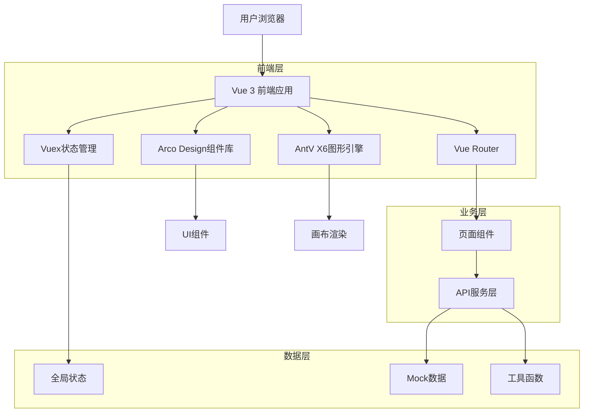
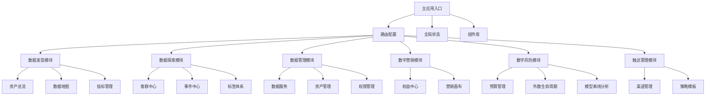

# 数据社区平台 - 技术架构设计文档

## 1. 架构设计

### 1.1 整体架构图


### 1.2 模块架构图


## 2. 技术栈描述

### 2.1 核心技术栈
- **前端框架**: Vue 3.4+ (Composition API)
- **构建工具**: Vite 5.0+
- **路由管理**: Vue Router 4.0+
- **状态管理**: Vuex 4.0+
- **UI组件库**: Arco Design Vue 2.0+
- **图形引擎**: AntV X6 2.0+
- **开发语言**: TypeScript 5.0+
- **代码规范**: ESLint + Prettier

### 2.2 开发工具配置
- **包管理**: pnpm
- **代码检查**: ESLint + @vue/eslint-config-typescript
- **格式化**: Prettier
- **Git钩子**: husky + lint-staged
- **环境变量**: dotenv
- **路径别名**: @指向src目录

### 2.3 第三方依赖
```json
{
  "dependencies": {
    "vue": "^3.4.0",
    "vue-router": "^4.2.0",
    "vuex": "^4.1.0",
    "@arco-design/web-vue": "^2.55.0",
    "@antv/x6": "^2.15.0",
    "@antv/x6-vue-shape": "^2.1.0",
    "axios": "^1.6.0",
    "dayjs": "^1.11.0",
    "lodash-es": "^4.17.0"
  },
  "devDependencies": {
    "vite": "^5.0.0",
    "typescript": "^5.3.0",
    "vue-tsc": "^1.8.0",
    "eslint": "^8.56.0",
    "prettier": "^3.1.0",
    "husky": "^8.0.0",
    "lint-staged": "^15.2.0"
  }
}
```

## 3. 路由定义

### 3.1 主路由结构
| 路由路径 | 页面组件 | 用途 | 权限要求 |
|---------|----------|------|----------|
| /home | pages/login/home.vue | 系统首页 | 需要登录 |
| /login | pages/login/index.vue | 用户登录 | 无需登录 |
| /discovery/* | pages/discovery/ | 数据发现模块 | 需要登录 |
| /exploration/* | pages/exploration/ | 数据探索模块 | 需要登录 |
| /management/* | pages/management/ | 数据管理模块 | 需要登录 |
| /marketing/* | pages/marketing/ | 数字营销模块 | 需要登录 |
| /risk/* | pages/risk/ | 数字风险模块 | 需要登录 |
| /touch/* | pages/touch/ | 触达管理模块 | 需要登录 |

### 3.2 子路由配置示例
```javascript
{
  path: '/discovery',
  name: 'discovery',
  redirect: '/discovery/asset-overview',
  children: [
    {
      path: 'asset-overview',
      name: 'AssetOverview',
      component: () => import('../pages/discovery/asset-overview/index.vue'),
      meta: {
        title: '资产总览',
        icon: 'icon-dashboard',
        requiresAuth: true
      }
    },
    {
      path: 'customer360/detail/:userId',
      name: 'Customer360Detail',
      component: () => import('../pages/discovery/customer360/detail.vue'),
      meta: {
        title: '客户360详情',
        requiresAuth: true
      },
      props: true,
      beforeEnter: (to) => {
        // 参数验证
        if (!/^\d+$/.test(to.params.userId)) {
          return '/discovery/customer360'
        }
      }
    }
  ]
}
```

## 4. 状态管理架构

### 4.1 Vuex模块结构
```javascript
// store/modules/
- user.js          // 用户状态管理
- app.js           // 应用全局状态
- budget.js        // 预算管理状态
- external-data.js // 外数管理状态
- model-offline.js // 模型离线分析状态
```

### 4.2 状态管理示例
```javascript
// store/modules/user.js
export default {
  namespaced: true,
  state: () => ({
    userInfo: null,
    token: localStorage.getItem('token'),
    permissions: []
  }),
  
  mutations: {
    SET_USER_INFO(state, userInfo) {
      state.userInfo = userInfo
    },
    SET_TOKEN(state, token) {
      state.token = token
      localStorage.setItem('token', token)
    }
  },
  
  actions: {
    async login({ commit }, credentials) {
      // 登录逻辑
      const response = await loginAPI(credentials)
      commit('SET_USER_INFO', response.userInfo)
      commit('SET_TOKEN', response.token)
      return response
    }
  }
}
```

## 5. 组件架构设计

### 5.1 组件分层
```
src/components/
├── common/          # 通用组件
│   ├── BaseTable.vue
│   ├── BaseForm.vue
│   └── BaseModal.vue
├── layout/          # 布局组件
│   ├── SideMenu.vue
│   └── TopMenu.vue
├── nodes/           # 画布节点组件
│   ├── BaseNode.vue
│   ├── InPort.vue
│   └── OutPort.vue
└── steps/           # 步骤组件
    └── SceneStep.vue
```

### 5.2 组件设计原则
1. **单一职责**: 每个组件只负责一个功能
2. **可复用性**: 通用功能提取为独立组件
3. **类型安全**: 使用TypeScript定义props和事件
4. **性能优化**: 合理使用computed和watch

### 5.3 组件通信模式
```javascript
// Props Down, Events Up
// 父组件
<template>
  <child-component 
    :data="tableData"
    @row-click="handleRowClick"
  />
</template>

// 子组件
<script setup>
const props = defineProps({
  data: {
    type: Array,
    required: true
  }
})

const emit = defineEmits(['row-click'])

const handleClick = (row) => {
  emit('row-click', row)
}
</script>
```

## 6. 数据模型设计

### 6.1 用户数据模型
```typescript
interface User {
  id: string
  username: string
  email: string
  role: 'admin' | 'user' | 'guest'
  permissions: string[]
  department: string
  createdAt: Date
  lastLoginAt: Date
}
```

### 6.2 资产数据模型
```typescript
interface Asset {
  id: string
  name: string
  type: 'table' | 'api' | 'metric' | 'variable'
  category: string
  owner: string
  department: string
  status: 'active' | 'inactive' | 'deprecated'
  tags: string[]
  createdAt: Date
  updatedAt: Date
  metadata: Record<string, any>
}
```

### 6.3 画布节点数据模型
```typescript
interface CanvasNode {
  id: string
  type: string
  x: number
  y: number
  width: number
  height: number
  data: Record<string, any>
  ports: NodePort[]
  style?: Record<string, any>
  zIndex: number
}

interface NodePort {
  id: string
  type: 'input' | 'output'
  group?: string
  position: { x: number; y: number }
  connected?: boolean
}
```

## 7. API接口设计

### 7.1 接口规范
- **基础URL**: `/api/v1`
- **请求格式**: JSON
- **响应格式**: 统一包装格式
- **错误处理**: 统一错误码和消息

### 7.2 响应格式标准
```typescript
interface ApiResponse<T> {
  code: number
  message: string
  data: T
  timestamp: number
  success: boolean
}

interface PageResponse<T> {
  list: T[]
  total: number
  page: number
  size: number
  pages: number
}
```

### 7.3 主要API接口

#### 7.3.1 用户相关API
```
POST   /api/auth/login          // 用户登录
POST   /api/auth/logout         // 用户登出
GET    /api/user/profile        // 获取用户信息
PUT    /api/user/profile        // 更新用户信息
GET    /api/user/permissions    // 获取用户权限
```

#### 7.3.2 资产相关API
```
GET    /api/assets              // 获取资产列表
GET    /api/assets/:id          // 获取资产详情
POST   /api/assets              // 创建资产
PUT    /api/assets/:id          // 更新资产
DELETE /api/assets/:id          // 删除资产
GET    /api/assets/categories   // 获取资产分类
```

#### 7.3.3 画布相关API
```
GET    /api/canvas/:id          // 获取画布数据
POST   /api/canvas              // 创建画布
PUT    /api/canvas/:id          // 更新画布
DELETE /api/canvas/:id          // 删除画布
POST   /api/canvas/:id/execute  // 执行画布
```

## 8. 性能优化策略

### 8.1 代码分割
```javascript
// 路由懒加载
const routes = [
  {
    path: '/marketing/tasks',
    component: () => import('../pages/marketing/tasks/index.vue')
  }
]

// 异步组件
const AsyncComponent = defineAsyncComponent(() => 
  import('../components/LargeComponent.vue')
)
```

### 8.2 虚拟滚动
```javascript
// 大数据列表使用虚拟滚动
import { VirtualList } from '@arco-design/web-vue'

<template>
  <virtual-list 
    :data="largeDataList"
    :height="400"
    :item-height="32"
  >
    <template #item="{ item }">
      <div class="list-item">{{ item.name }}</div>
    </template>
  </virtual-list>
</template>
```

### 8.3 缓存策略
```javascript
// 接口缓存
const cache = new Map()

async function fetchWithCache(key, fetcher) {
  if (cache.has(key)) {
    return cache.get(key)
  }
  
  const data = await fetcher()
  cache.set(key, data)
  return data
}
```

## 9. 错误处理机制

### 9.1 全局错误处理
```javascript
// main.js
app.config.errorHandler = (error, instance, info) => {
  console.error('全局错误:', error)
  console.error('组件实例:', instance)
  console.error('错误信息:', info)
  
  // 发送错误到监控系统
  reportError(error, instance, info)
}
```

### 9.2 API错误处理
```javascript
// utils/request.js
class RequestError extends Error {
  constructor(message, code, data) {
    super(message)
    this.code = code
    this.data = data
  }
}

// 响应拦截器
service.interceptors.response.use(
  response => response.data,
  error => {
    const { response } = error
    
    if (response) {
      const { code, message } = response.data
      
      switch (code) {
        case 401:
          // 未授权，跳转到登录
          router.push('/login')
          break
        case 403:
          // 无权限
          Message.error('您没有权限访问该资源')
          break
        case 500:
          // 服务器错误
          Message.error('服务器内部错误')
          break
        default:
          Message.error(message || '请求失败')
      }
    }
    
    return Promise.reject(new RequestError(message, code, response?.data))
  }
)
```

## 10. 开发规范

### 10.1 代码风格
- 使用ESLint进行代码检查
- 使用Prettier进行代码格式化
- 遵循Vue 3官方风格指南
- TypeScript严格模式

### 10.2 文件组织
```
src/
├── api/           # API接口定义
├── assets/        # 静态资源
├── components/    # 通用组件
├── composables/   # 组合式函数
├── config/        # 配置文件
├── constants/     # 常量定义
├── core/          # 核心功能
├── data/          # 静态数据
├── mock/          # 模拟数据
├── modules/       # 业务模块
├── pages/         # 页面组件
├── router/        # 路由配置
├── services/      # 业务服务
├── store/         # 状态管理
├── styles/        # 样式文件
├── types/         # 类型定义
├── utils/         # 工具函数
└── main.js        # 应用入口
```

### 10.3 Git提交规范
```
feat: 新功能
fix: 修复bug
docs: 文档更新
style: 代码格式调整
refactor: 代码重构
test: 测试相关
chore: 构建工具或辅助工具变动
```

## 11. 部署方案

### 11.1 构建配置
```javascript
// vite.config.js
export default defineConfig({
  build: {
    target: 'es2015',
    outDir: 'dist',
    assetsDir: 'assets',
    sourcemap: false,
    rollupOptions: {
      output: {
        chunkFileNames: 'js/[name]-[hash].js',
        entryFileNames: 'js/[name]-[hash].js',
        assetFileNames: '[ext]/[name]-[hash].[ext]'
      }
    }
  }
})
```

### 11.2 环境变量
```bash
# .env.development
VITE_API_BASE_URL=http://localhost:3000/api
VITE_APP_TITLE=数据社区平台

# .env.production
VITE_API_BASE_URL=https://api.datacommunity.com/api
VITE_APP_TITLE=数据社区平台
```

### 11.3 性能监控
```javascript
// 性能指标收集
const observer = new PerformanceObserver((list) => {
  for (const entry of list.getEntries()) {
    // 收集性能数据
    console.log('Performance:', entry.name, entry.duration)
  }
})

observer.observe({ entryTypes: ['measure', 'navigation'] })
```