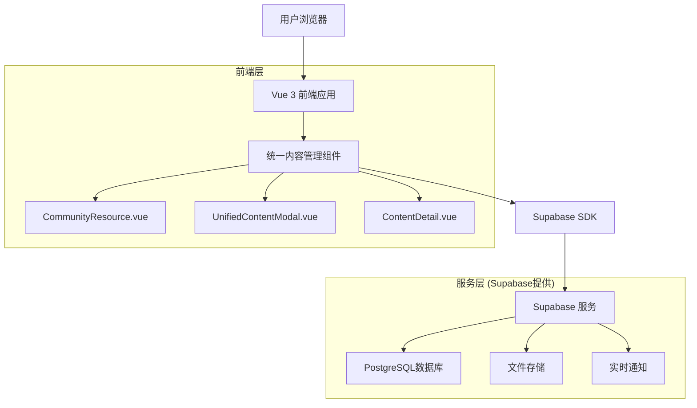
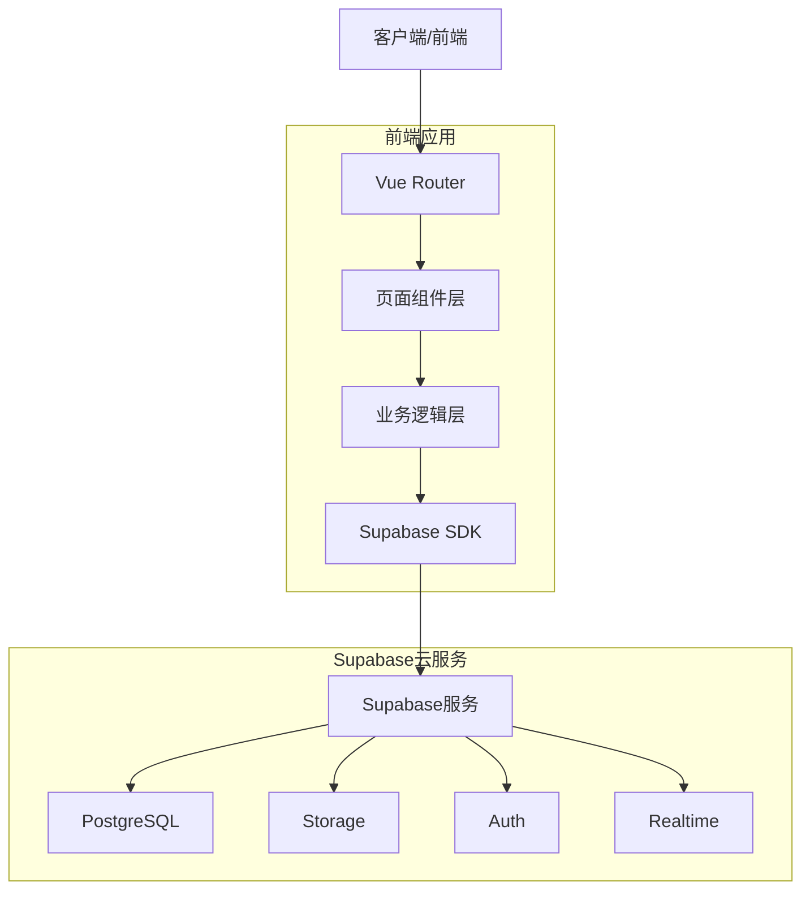
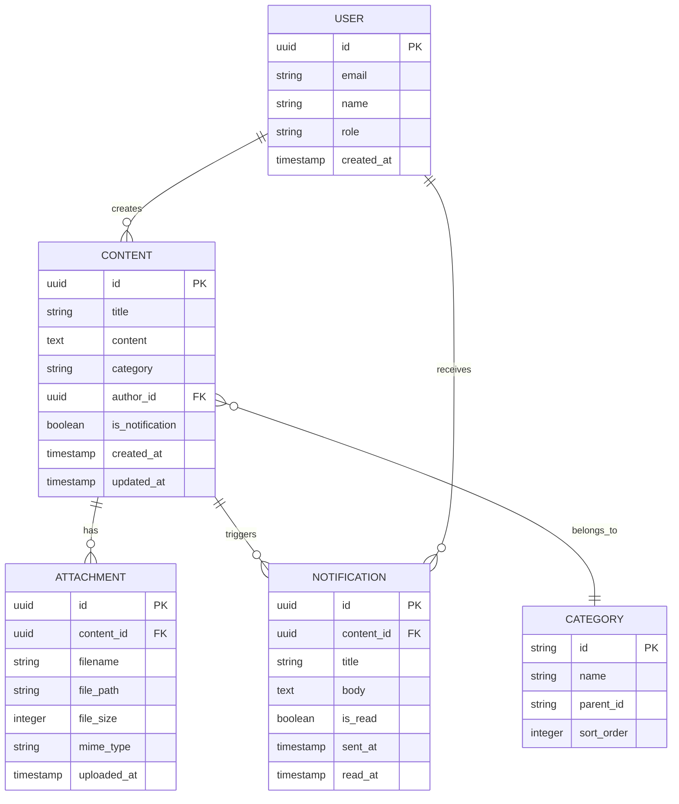

# 社区资源与通知功能合并技术架构文档

## 1. 架构设计



## 2. 技术描述

- **前端**: Vue 3 (Composition API) + Arco Design + Vite + TypeScript
- **状态管理**: Vuex
- **路由管理**: Vue Router
- **图形引擎**: AntV X6 (用于流程图展示)
- **后端服务**: Supabase (提供数据库、存储、认证)

## 3. 路由定义

| 路由 | 用途 |
|------|------|
| /community | 社区资源主页，展示统一的内容列表 |
| /community?category=policy | 政策制度分类页面 |
| /community?category=cases | 实践案例分类页面 |
| /community?category=guide | 操作指南分类页面 |
| /community?category=news | 社区动态分类页面 |
| /community/detail/:id | 内容详情页面，统一展示文档和通知 |

## 4. API定义

### 4.1 核心API

**统一内容创建**
```
POST /api/content/create
```

请求参数:
| 参数名称 | 参数类型 | 是否必需 | 描述 |
|----------|----------|----------|------|
| title | string | true | 内容标题 |
| content | string | true | 正文内容 |
| category | string | true | 内容分类 |
| attachments | File[] | false | 附件文件数组 |
| sendNotification | boolean | false | 是否发送通知 |
| notificationSettings | object | false | 通知配置 |

响应:
| 参数名称 | 参数类型 | 描述 |
|----------|----------|------|
| success | boolean | 操作是否成功 |
| contentId | string | 创建的内容ID |
| notificationId | string | 通知ID（如果发送了通知） |

**内容列表查询**
```
GET /api/content/list
```

请求参数:
| 参数名称 | 参数类型 | 是否必需 | 描述 |
|----------|----------|----------|------|
| category | string | false | 分类筛选 |
| page | number | false | 页码 |
| pageSize | number | false | 每页数量 |

**内容详情查询**
```
GET /api/content/:id
```

响应:
| 参数名称 | 参数类型 | 描述 |
|----------|----------|------|
| id | string | 内容ID |
| title | string | 标题 |
| content | string | 正文 |
| attachments | array | 附件列表 |
| category | string | 分类 |
| createdAt | string | 创建时间 |

## 5. 服务器架构图



## 6. 数据模型

### 6.1 数据模型定义



### 6.2 数据定义语言

**内容表 (content)**
```sql
-- 创建内容表
CREATE TABLE content (
    id UUID PRIMARY KEY DEFAULT gen_random_uuid(),
    title VARCHAR(200) NOT NULL,
    content TEXT NOT NULL,
    category VARCHAR(50) NOT NULL,
    author_id UUID REFERENCES auth.users(id),
    is_notification BOOLEAN DEFAULT false,
    is_public BOOLEAN DEFAULT true,
    is_sticky BOOLEAN DEFAULT false,
    view_count INTEGER DEFAULT 0,
    created_at TIMESTAMP WITH TIME ZONE DEFAULT NOW(),
    updated_at TIMESTAMP WITH TIME ZONE DEFAULT NOW()
);

-- 创建索引
CREATE INDEX idx_content_category ON content(category);
CREATE INDEX idx_content_created_at ON content(created_at DESC);
CREATE INDEX idx_content_author ON content(author_id);

-- 权限设置
GRANT SELECT ON content TO anon;
GRANT ALL PRIVILEGES ON content TO authenticated;
```

**附件表 (attachments)**
```sql
-- 创建附件表
CREATE TABLE attachments (
    id UUID PRIMARY KEY DEFAULT gen_random_uuid(),
    content_id UUID REFERENCES content(id) ON DELETE CASCADE,
    filename VARCHAR(255) NOT NULL,
    file_path TEXT NOT NULL,
    file_size INTEGER NOT NULL,
    mime_type VARCHAR(100) NOT NULL,
    uploaded_at TIMESTAMP WITH TIME ZONE DEFAULT NOW()
);

-- 创建索引
CREATE INDEX idx_attachments_content_id ON attachments(content_id);

-- 权限设置
GRANT SELECT ON attachments TO anon;
GRANT ALL PRIVILEGES ON attachments TO authenticated;
```

**通知表 (notifications)**
```sql
-- 创建通知表
CREATE TABLE notifications (
    id UUID PRIMARY KEY DEFAULT gen_random_uuid(),
    content_id UUID REFERENCES content(id) ON DELETE CASCADE,
    user_id UUID REFERENCES auth.users(id),
    title VARCHAR(200) NOT NULL,
    body TEXT,
    is_read BOOLEAN DEFAULT false,
    sent_at TIMESTAMP WITH TIME ZONE DEFAULT NOW(),
    read_at TIMESTAMP WITH TIME ZONE
);

-- 创建索引
CREATE INDEX idx_notifications_user_id ON notifications(user_id);
CREATE INDEX idx_notifications_sent_at ON notifications(sent_at DESC);
CREATE INDEX idx_notifications_is_read ON notifications(is_read);

-- 权限设置
GRANT ALL PRIVILEGES ON notifications TO authenticated;
```

**分类表 (categories)**
```sql
-- 创建分类表
CREATE TABLE categories (
    id VARCHAR(50) PRIMARY KEY,
    name VARCHAR(100) NOT NULL,
    parent_id VARCHAR(50) REFERENCES categories(id),
    sort_order INTEGER DEFAULT 0,
    description TEXT
);

-- 插入初始数据
INSERT INTO categories (id, name, parent_id, sort_order) VALUES
('policy', '政策制度', NULL, 1),
('policy-law', '法律法规', 'policy', 1),
('policy-management', '管理办法', 'policy', 2),
('policy-standard', '标准规范', 'policy', 3),
('cases', '实践案例', NULL, 2),
('cases-analytics', '数据分析', 'cases', 1),
('cases-ml', '机器学习', 'cases', 2),
('cases-visualization', '数据可视化', 'cases', 3),
('guide', '操作指南', NULL, 3),
('guide-basic', '基础操作', 'guide', 1),
('guide-advanced', '高级功能', 'guide', 2),
('guide-troubleshooting', '故障排除', 'guide', 3),
('news', '社区动态', NULL, 4),
('news-announcement', '公告通知', 'news', 1),
('news-activity', '活动资讯', 'news', 2),
('news-update', '更新日志', 'news', 3);

-- 权限设置
GRANT SELECT ON categories TO anon;
GRANT ALL PRIVILEGES ON categories TO authenticated;
```