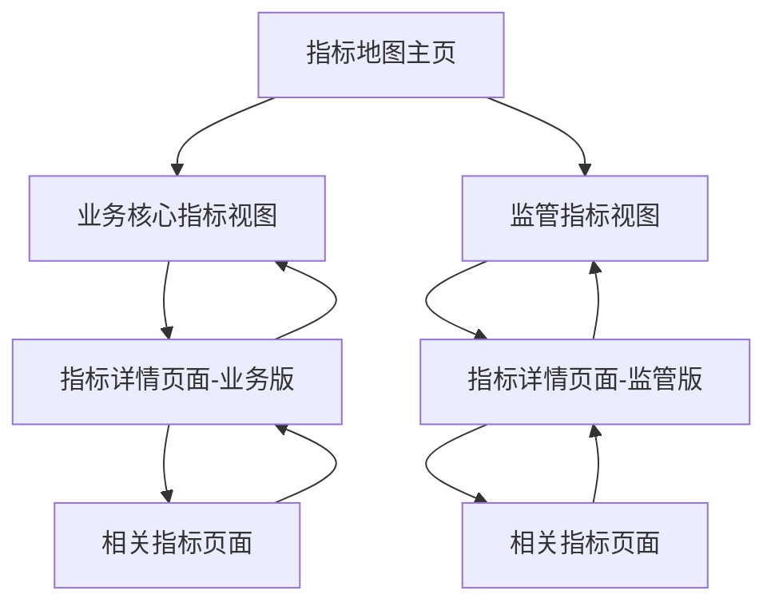

# 指标地图模块优化需求文档

## 1. 项目概述

本项目旨在优化指标地图模块，使其能够支持业务核心指标和监管指标的统一展示和切换，同时简化功能定位，专注于面向业务的指标展示功能。

### 1.1 背景

* **指标管理模块**：位于 `/discovery/asset-management/metric-management`，负责业务核心指标和监管指标的注册、编辑、版本管理等后台管理功能

* **指标地图模块**：位于 `/discovery/metrics-map`，当前仅支持业务核心指标的展示，需要扩展支持监管指标并优化用户体验

### 1.2 目标

* 实现业务核心指标和监管指标的统一展示

* 提供指标类型切换功能

* 移除新建和导出功能，专注于展示和查询

* 优化用户界面和交互体验

## 2. 核心功能需求

### 2.1 统一查询集成支持
- **功能描述**：指标地图模块需要完全集成到系统的统一查询功能中，支持全局搜索和展示
- **技术要求**：
  - 实现统一查询接口适配器，标准化指标数据格式
  - 支持指标数据在统一查询中的搜索、筛选和展示
  - 提供统一的搜索结果格式和跳转链接
  - 确保业务核心指标和监管指标都能被统一查询检索
- **交互设计**：
  - 从统一查询跳转到指标详情页面时，保持搜索上下文
  - 支持统一查询结果中的指标预览和快速访问
  - 提供面包屑导航，显示从统一查询进入的路径

### 2.2 指标类型切换功能
- **功能描述**：在指标地图页面顶部添加标签页，支持在"业务核心指标"和"监管指标"之间切换
- **交互设计**：
  - 默认显示"业务核心指标"标签页
  - 点击标签页时，动态切换显示对应类型的指标数据
  - 切换时保持当前的搜索和筛选条件
  - 不同类型指标显示不同的筛选器和表格列
  - 类型切换时同步更新统一查询系统的搜索配置

### 2.3 用户角色

本模块面向所有业务用户，无需角色区分，提供统一的指标查看和搜索功能。

### 2.4 功能模块

#### 2.4.1 页面结构优化

1. **指标地图主页**：支持业务核心指标和监管指标的统一展示

   * 指标类型切换标签

   * 搜索和筛选功能

   * 指标列表展示

   * 指标详情查看

#### 2.4.2 核心功能变更

**新增功能：**

* 指标类型切换（业务核心指标 ↔ 监管指标）

* 监管指标专属筛选条件（监管报表大类、报表名称）

* 差异化的指标详情展示

**移除功能：**

* 新建指标按钮和相关功能

* 导出功能按钮和相关逻辑

* 批量导入相关功能

**保留功能：**

* 指标搜索和筛选

* 指标详情查看

* 收藏功能

* 分页功能

### 2.3 页面详细设计

| 页面名称   | 模块名称   | 功能描述               |
| ------ | ------ | ------------------ |
| 指标地图主页 | 页面头部   | 显示页面标题，移除新建和导出按钮   |
| 指标地图主页 | 指标类型切换 | 提供业务核心指标和监管指标的切换标签 |
| 指标地图主页 | 搜索筛选区  | 根据指标类型动态显示不同的筛选条件  |
| 指标地图主页 | 指标分类树  | 根据指标类型显示不同的分类结构    |
| 指标地图主页 | 指标列表   | 展示当前选中类型的指标列表，支持分页 |
| 指标详情页面 | 页面头部   | 显示指标名称、面包屑导航、返回按钮  |
| 指标详情页面 | 基础信息区  | 展示指标基本信息，支持收藏和分享   |
| 指标详情页面 | 详情内容区  | 根据指标类型展示差异化的详情内容   |
| 指标详情页面 | 相关指标区  | 展示关联指标和推荐指标       |

## 3. 核心流程

### 3.1 用户操作流程

1. **进入指标地图页面** → 默认显示业务核心指标
2. **切换指标类型** → 点击标签切换到监管指标或业务核心指标
3. **搜索筛选指标** → 使用搜索框和筛选条件查找目标指标
4. **查看指标详情** → 点击指标名称跳转到独立详情页面
5. **详情页面操作** → 查看完整信息、收藏指标、查看相关指标
6. **返回列表** → 通过面包屑导航或返回按钮回到指标地图

### 3.2 页面导航流程



## 4. 用户界面设计

### 4.1 设计风格

* **主色调**：沿用现有的 Arco Design 主题色彩

* **按钮样式**：圆角按钮，保持一致性

* **字体**：14px 为主要字体大小，标题使用 16px-20px

* **布局风格**：卡片式布局，左侧树形导航 + 右侧内容区

* **图标风格**：使用 Arco Design 图标库

### 4.2 页面设计概览

| 页面名称   | 模块名称   | UI元素                         |
| ------ | ------ | ---------------------------- |
| 指标地图主页 | 页面头部   | 标题：指标地图，移除操作按钮区域             |
| 指标地图主页 | 指标类型切换 | 标签页组件，包含"业务核心指标"和"监管指标"两个标签  |
| 指标地图主页 | 搜索筛选区  | 搜索框 + 动态筛选条件（分类、业务域/监管报表大类等） |
| 指标地图主页 | 左侧导航树  | 根据指标类型显示不同的树形结构              |
| 指标地图主页 | 指标列表   | 表格展示，包含指标名称、类型、分类、负责人等信息     |
| 指标详情页面 | 页面头部   | 面包屑导航、指标名称、返回按钮、收藏和分享按钮      |
| 指标详情页面 | 基础信息卡片 | 指标编码、分类、负责人、更新时间等关键信息        |
| 指标详情页面 | 详情标签页  | 业务口径、技术逻辑、历史版本、使用统计等内容       |
| 指标详情页面 | 相关指标区  | 关联指标列表、推荐指标卡片              |

### 4.3 响应式设计

* 桌面优先设计，支持1200px以上宽屏显示

* 左侧导航树固定宽度240px，右侧内容区自适应

* 表格支持横向滚动，确保在较小屏幕上的可用性

## 5. 数据结构需求

### 5.1 指标类型枚举

```typescript
enum MetricType {
  BUSINESS_CORE = 'business_core', // 业务核心指标
  REGULATORY = 'regulatory' // 监管指标
}
```

### 5.2 筛选条件结构

```typescript
interface FilterConditions {
  // 通用筛选条件
  keyword: string
  category: string
  
  // 业务核心指标专用
  businessDomain?: string
  
  // 监管指标专用
  regulatoryCategory?: RegulatoryCategory
  reportName?: string
}
```

### 5.3 树形导航数据结构

```typescript
interface TreeNode {
  title: string
  key: string
  children?: TreeNode[]
  metricType: MetricType // 标识适用的指标类型
}
```

## 6. 接口需求

### 6.1 统一查询接口

```
POST /api/metrics/unified-search
```

**请求参数：**

| 参数名     | 类型     | 必填 | 描述                    |
| ------- | ------ | -- | --------------------- |
| query   | string | 否  | 搜索关键词                 |
| filters | object | 否  | 筛选条件对象                |
| pageNum | number | 是  | 页码                    |
| pageSize| number | 是  | 每页数量                  |

### 6.2 指标列表查询接口

```
GET /api/metrics/list
```

**请求参数：**

| 参数名                | 类型     | 必填 | 描述                               |
| ------------------ | ------ | -- | -------------------------------- |
| type               | string | 是  | 指标类型：business\_core 或 regulatory |
| page               | number | 是  | 页码                               |
| pageSize           | number | 是  | 每页数量                             |
| name               | string | 否  | 指标名称关键词                          |
| category           | string | 否  | 指标分类                             |
| businessDomain     | string | 否  | 业务域（仅业务核心指标）                     |
| regulatoryCategory | string | 否  | 监管报表大类（仅监管指标）                    |
| reportName         | string | 否  | 报表名称（仅监管指标）                      |

### 6.3 指标详情查询接口

```
GET /api/metrics/detail/:id
```

**请求参数：**

| 参数名 | 类型     | 必填 | 描述   |
| --- | ------ | -- | ---- |
| id  | string | 是  | 指标ID |
| from| string | 否  | 来源标识 |

**响应数据：**

| 字段名              | 类型     | 描述           |
| ---------------- | ------ | ------------ |
| id               | string | 指标ID        |
| name             | string | 指标名称         |
| code             | string | 指标编码         |
| type             | string | 指标类型         |
| category         | string | 指标分类         |
| businessDefinition | string | 业务口径         |
| technicalLogic   | string | 技术逻辑         |
| relatedMetrics   | array  | 关联指标列表       |
| usageStats       | object | 使用统计数据       |
| versions         | array  | 历史版本列表       |

### 6.4 相关指标推荐接口

```
GET /api/metrics/related/:id
```

**请求参数：**

| 参数名 | 类型     | 必填 | 描述   |
| --- | ------ | -- | ---- |
| id  | string | 是  | 指标ID |

### 6.5 指标分类树接口

```
GET /api/metrics/categories
```

**请求参数：**

| 参数名  | 类型     | 必填 | 描述                               |
| ---- | ------ | -- | -------------------------------- |
| type | string | 是  | 指标类型：business\_core 或 regulatory |

## 7. 用户体验优化

### 7.1 详情页面用户体验设计

**导航体验优化：**

* 面包屑导航：指标地图 > 业务核心指标/监管指标 > 指标名称
* 返回按钮：快速返回到指标列表，保持筛选状态
* 页面标题：动态显示当前指标名称

**信息展示优化：**

* 分层信息架构：基础信息卡片 + 详细内容标签页
* 关键信息突出：指标编码、分类、负责人等核心信息优先展示
* 内容分组：业务口径、技术逻辑、历史版本等内容分标签页展示

**交互体验优化：**

* 收藏功能：支持快速收藏/取消收藏
* 分享功能：生成指标详情链接，支持分享给其他用户
* 相关推荐：基于指标关联关系推荐相关指标

### 7.2 响应式布局设计

* 桌面端：左右布局，左侧基础信息，右侧详细内容
* 平板端：上下布局，基础信息在上，详细内容在下
* 移动端：单列布局，支持折叠展开

## 8. 技术约束

### 8.1 技术栈要求

* 前端框架：Vue 3 (Composition API)

* UI组件库：Arco Design

* 状态管理：保持现有的响应式数据管理方式

* 路由：Vue Router

### 8.2 兼容性要求

* 保持与现有指标管理模块的数据结构兼容

* 确保现有的收藏功能正常工作

* 维护现有的分页和搜索逻辑

* 支持浏览器前进后退功能

### 8.3 性能要求

* 指标类型切换响应时间 < 500ms

* 搜索结果返回时间 < 1s

* 详情页面加载时间 < 1s

* 支持大量指标数据的分页加载

## 9. 验收标准

### 9.1 功能验收

* [ ] 支持业务核心指标和监管指标的切换展示

* [ ] 移除新建和导出功能按钮

* [ ] 搜索筛选功能根据指标类型动态调整

* [ ] 指标详情页面根据类型差异化显示

* [ ] 收藏功能正常工作

* [ ] 分页功能正常工作

* [ ] 详情页面路由跳转正常

* [ ] 面包屑导航和返回功能正常

* [ ] 相关指标推荐功能正常

### 9.2 界面验收

* [ ] 页面布局美观，符合设计规范

* [ ] 指标类型切换标签清晰易用

* [ ] 表格和详情展示信息完整

* [ ] 详情页面信息层次清晰

* [ ] 响应式设计在不同屏幕尺寸下正常显示

* [ ] 面包屑导航样式和交互符合规范

### 9.3 用户体验验收

* [ ] 从列表到详情页面的跳转流畅

* [ ] 详情页面返回列表保持筛选状态

* [ ] 收藏和分享功能易于发现和使用

* [ ] 相关指标推荐准确且有用

* [ ] 页面加载和切换无明显延迟

### 9.4 性能验收

* [ ] 页面加载时间 < 2s

* [ ] 指标类型切换流畅无卡顿

* [ ] 详情页面加载时间 < 1s

* [ ] 搜索响应及时

* [ ] 大数据量下分页加载正常

## 9. 风险评估

### 9.1 技术风险

* **数据结构差异**：业务核心指标和监管指标的字段结构存在差异，需要统一处理

* **接口兼容性**：现有接口可能需要调整以支持指标类型筛选

### 9.2 用户体验风险

* **功能移除影响**：移除新建和导出功能可能影响部分用户的使用习惯

* **切换体验**：指标类型切换需要保证数据加载的流畅性

### 9.3 缓解措施

* 充分测试不同指标类型的数据展示

* 提供用户引导，说明功能变更

* 保留现有的核心展示功能，确保用户体验连续性

