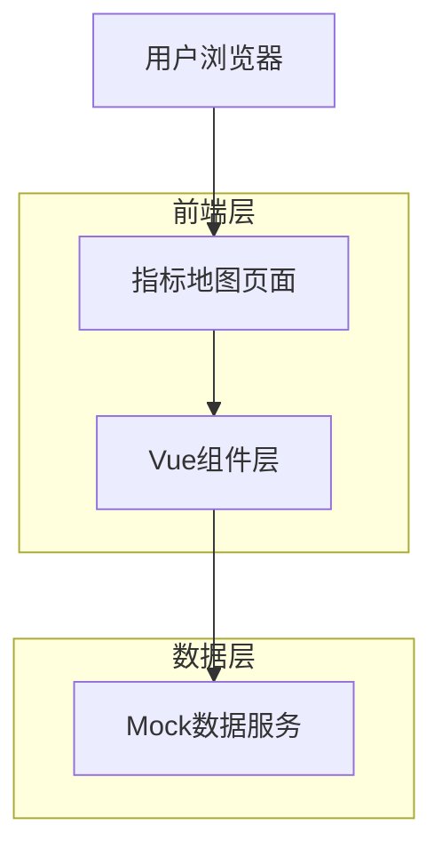
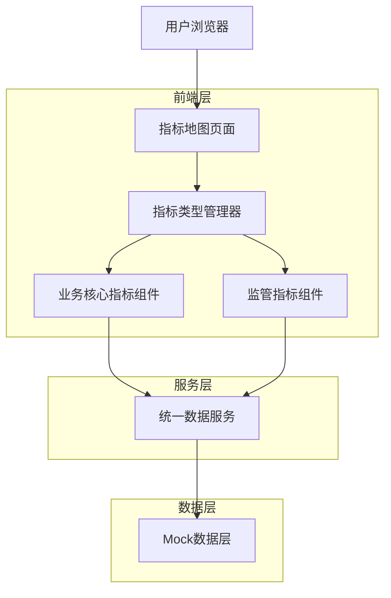
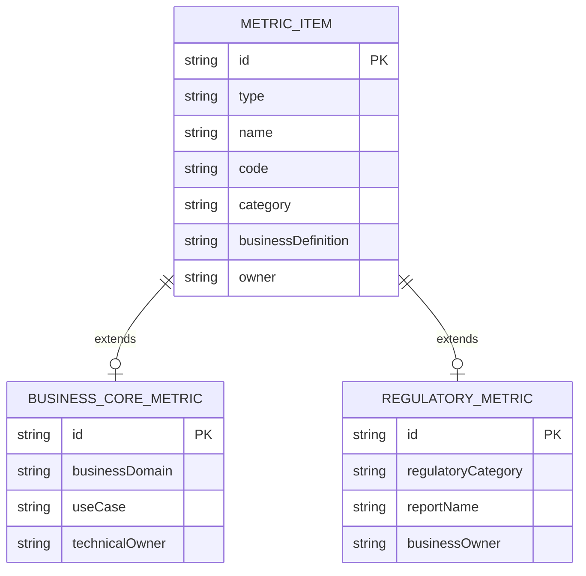

# 指标地图模块改造技术评估文档

## 1. 架构设计

### 1.1 当前架构分析



### 1.2 改造后架构设计



## 2. 技术描述

* **前端框架**：Vue 3 + Composition API + TypeScript

* **UI组件库**：Arco Design

* **构建工具**：Vite

* **状态管理**：响应式数据 (ref/reactive)

* **数据模拟**：vite-plugin-mock

## 3. 路由定义

| 路由                                            | 用途                       |
| --------------------------------------------- | ------------------------ |
| /discovery/metrics-map                        | 指标地图主页，支持业务核心指标和监管指标切换展示 |
| /discovery/metrics-map/detail/:id             | 指标详情页面，展示指标完整信息和相关推荐     |
| /discovery/asset-management/metric-management | 指标管理页面（保持不变，用于对比参考）      |

## 4. 核心组件改造分析

### 4.1 主要文件清单

| 文件路径                                         | 改造类型 | 改造内容                     |
| -------------------------------------------- | ---- | ------------------------ |
| `/src/pages/discovery/metrics-map/index.vue` | 重大改造 | 添加指标类型切换、移除新建导出功能、优化筛选逻辑 |
| `/src/pages/discovery/metrics-map/detail.vue` | 新建文件 | 创建指标详情页面组件               |
| `/src/router/modules/discovery.js`           | 路由配置 | 添加详情页面路由配置               |
| `/src/types/metrics.ts`                      | 轻微调整 | 确保类型定义完整性                |
| `/src/mock/metrics.ts`                       | 功能增强 | 增强mock数据以支持监管指标筛选和详情查询   |

### 4.2 详细改造方案

#### 4.2.1 主页面组件改造 (`/src/pages/discovery/metrics-map/index.vue`)

**当前问题分析：**

1. 页面头部包含"新建指标"和"导出"按钮（第6-18行）
2. 搜索筛选区域缺少指标类型切换（第20-48行）
3. 树形导航数据结构固定，不支持监管指标分类（第308-329行）
4. 表格列定义不支持监管指标特有字段
5. 详情抽屉内容不支持监管指标差异化展示

**具体改造内容：**

**1. 页面头部改造（第4-18行）**

```vue
<!-- 改造前 -->
<div class="page-header">
  <h2>指标地图</h2>
  <a-space>
    <a-button type="primary" @click="showCreateModal = true">
      <template #icon><icon-plus /></template>
      新建指标
    </a-button>
    <a-button @click="exportMetrics">
      <template #icon><icon-download /></template>
      导出
    </a-button>
  </a-space>
</div>

<!-- 改造后 -->
<div class="page-header">
  <h2>指标地图</h2>
  <!-- 移除操作按钮区域 -->
</div>
```

**2. 添加指标类型切换标签（在搜索区域前）**

```vue
<!-- 新增指标类型切换 -->
<div class="metric-type-tabs">
  <a-tabs v-model:active-key="currentMetricType" @change="handleMetricTypeChange">
    <a-tab-pane key="business_core" title="业务核心指标" />
    <a-tab-pane key="regulatory" title="监管指标" />
  </a-tabs>
</div>
```

**3. 搜索筛选区域改造（第20-48行）**

```vue
<!-- 改造后的搜索筛选区 -->
<div class="search-section">
  <a-row :gutter="16">
    <a-col :span="8">
      <a-input-search
        v-model="searchKeyword"
        placeholder="搜索指标名称、描述"
        @search="handleSearch"
      />
    </a-col>
    
    <!-- 业务核心指标筛选条件 -->
    <template v-if="currentMetricType === 'business_core'">
      <a-col :span="4">
        <a-select v-model="selectedCategory" placeholder="选择分类" allow-clear @change="handleSearch">
          <a-option value="用户指标">用户指标</a-option>
          <a-option value="业务域">业务域</a-option>
          <a-option value="技术指标">技术指标</a-option>
        </a-select>
      </a-col>
      <a-col :span="4">
        <a-select v-model="selectedDomain" placeholder="业务域" allow-clear @change="handleSearch">
          <a-option value="留存域">留存域</a-option>
          <a-option value="转化域">转化域</a-option>
          <a-option value="业务规模">业务规模</a-option>
        </a-select>
      </a-col>
    </template>
    
    <!-- 监管指标筛选条件 -->
    <template v-else>
      <a-col :span="4">
        <a-select v-model="selectedRegulatoryCategory" placeholder="监管报表大类" allow-clear @change="handleSearch">
          <a-option value="cbirc_banking">银保监会-银监报表</a-option>
          <a-option value="pboc_centralized">人行-大集中报表</a-option>
          <a-option value="pboc_financial_base">人行-金融基础数据</a-option>
        </a-select>
      </a-col>
      <a-col :span="4">
        <a-select v-model="selectedReportName" placeholder="报表名称" allow-clear @change="handleSearch">
          <a-option value="银行业监管统计报表">银行业监管统计报表</a-option>
          <a-option value="人民银行大集中系统报表">人民银行大集中系统报表</a-option>
        </a-select>
      </a-col>
    </template>
  </a-row>
</div>
```

**4. 响应式数据增强（第250-280行）**

```typescript
// 新增响应式数据
const currentMetricType = ref<MetricType>(MetricType.BUSINESS_CORE)
const selectedRegulatoryCategory = ref('')
const selectedReportName = ref('')

// 计算属性：动态树形数据
const dynamicTreeData = computed(() => {
  if (currentMetricType.value === MetricType.BUSINESS_CORE) {
    return [
      {
        title: '用户指标',
        key: '用户指标',
        children: [
          { title: '获客域', key: '用户指标-获客域' },
          { title: '转化域', key: '用户指标-转化域' },
          { title: '留存域', key: '用户指标-留存域' }
        ]
      },
      {
        title: '交易指标',
        key: '交易指标',
        children: [
          { title: '变现域', key: '交易指标-变现域' }
        ]
      }
    ]
  } else {
    return [
      {
        title: '资本管理',
        key: '资本管理',
        children: [
          { title: '资本充足率', key: '资本管理-资本充足率' },
          { title: '杠杆率', key: '资本管理-杠杆率' }
        ]
      },
      {
        title: '流动性管理',
        key: '流动性管理',
        children: [
          { title: '流动性覆盖率', key: '流动性管理-流动性覆盖率' },
          { title: '净稳定资金比例', key: '流动性管理-净稳定资金比例' }
        ]
      }
    ]
  }
})
```

**5. 方法改造**

```typescript
// 新增指标类型切换处理
const handleMetricTypeChange = (type: string) => {
  currentMetricType.value = type as MetricType
  // 重置筛选条件
  selectedCategory.value = ''
  selectedDomain.value = ''
  selectedRegulatoryCategory.value = ''
  selectedReportName.value = ''
  selectedKeys.value = []
  // 重新获取数据
  handleSearch()
}

// 改造搜索方法
const handleSearch = () => {
  searchForm.value = {
    name: searchKeyword.value,
    category: selectedCategory.value,
    businessDomain: selectedDomain.value,
    onlyFavorite: false,
    // 新增监管指标筛选
    type: currentMetricType.value,
    regulatoryCategory: selectedRegulatoryCategory.value,
    reportName: selectedReportName.value
  }
  
  pagination.value.current = 1
  fetchMetrics()
}

// 移除的方法
// - exportMetrics() 导出功能
// - showCreateModal 相关逻辑
// - 批量导入相关方法
```

**6. 表格列定义优化**

**改造位置：** `src/pages/discovery/metrics-map/index.vue` 第200-250行
**当前实现：** 仅支持业务核心指标
**改造方案：**
- 扩展表格列配置，支持监管指标特有字段
- 修改数据获取逻辑，根据指标类型调用不同接口
- 调整筛选器配置，监管指标显示报表名称选择器
- 确保所有指标类型都支持统一查询接口的搜索和展示
- 实现指标类型无关的搜索结果标准化处理

```typescript
// 动态表格列定义
const dynamicColumns = computed(() => {
  const baseColumns = [
    {
      title: '指标名称',
      dataIndex: 'name',
      render: ({ record }: { record: any }) => {
        return h('div', { style: 'display: flex; align-items: center; gap: 8px' }, [
          h('a-link', { 
            onClick: () => {
              // 跳转到详情页面而不是打开抽屉
              router.push(`/discovery/metrics-map/detail/${record.id}`)
            } 
          }, record.name),
          h('a-button', {
            type: 'text',
            size: 'mini',
            onClick: (e: Event) => {
              e.stopPropagation()
              toggleFavorite(record)
            }
          }, {
            icon: () => record.isFavorite ? h(IconStarFill, { style: 'color: #f7ba1e' }) : h(IconStar)
          })
        ])
      }
    },
    {
      title: '指标分类',
      dataIndex: 'category'
    }
  ]
  
  if (currentMetricType.value === MetricType.BUSINESS_CORE) {
    baseColumns.push(
      {
        title: '业务域',
        dataIndex: 'businessDomain'
      },
      {
        title: '业务口径',
        dataIndex: 'businessDefinition'
      },
      {
        title: '技术负责人',
        dataIndex: 'technicalOwner'
      }
    )
  } else {
    baseColumns.push(
      {
        title: '监管报表大类',
        dataIndex: 'regulatoryCategory',
        render: ({ record }: { record: any }) => {
          return REGULATORY_CATEGORY_LABELS[record.regulatoryCategory] || record.regulatoryCategory
        }
      },
      {
        title: '报表名称',
        dataIndex: 'reportName'
      },
      {
        title: '业务负责人',
        dataIndex: 'businessOwner'
      }
    )
  }
  
  return baseColumns
})
```

#### 4.2.2 新建指标详情页面组件 (`/src/pages/discovery/metrics-map/detail.vue`)

**改造位置：** 新增独立页面 `src/pages/discovery/metrics-detail/index.vue`
**当前实现：** 抽屉模式展示详情
**改造方案：**
- 创建独立的指标详情页面组件
- 配置新的路由 `/discovery/metrics-detail/:id`
- 实现面包屑导航和返回功能
- 支持统一查询中的搜索和展示集成
- 优化页面布局，提供更好的信息展示空间
- 集成统一查询接口，确保指标数据可被全局搜索
- 实现页面级别的数据缓存和状态管理

**组件结构设计：**

```vue
<template>
  <div class="metric-detail-page">
    <!-- 页面头部 -->
    <div class="page-header">
      <a-breadcrumb>
        <a-breadcrumb-item>
          <a-link @click="goBack">指标地图</a-link>
        </a-breadcrumb-item>
        <a-breadcrumb-item>
          {{ metricTypeLabel }}
        </a-breadcrumb-item>
        <a-breadcrumb-item>{{ metricDetail?.name }}</a-breadcrumb-item>
      </a-breadcrumb>
      
      <div class="header-actions">
        <a-button @click="goBack">
          <template #icon><icon-arrow-left /></template>
          返回
        </a-button>
        <a-button 
          :type="metricDetail?.isFavorite ? 'primary' : 'outline'"
          @click="toggleFavorite"
        >
          <template #icon>
            <icon-star-fill v-if="metricDetail?.isFavorite" />
            <icon-star v-else />
          </template>
          {{ metricDetail?.isFavorite ? '已收藏' : '收藏' }}
        </a-button>
        <a-button @click="shareMetric">
          <template #icon><icon-share-alt /></template>
          分享
        </a-button>
      </div>
    </div>

    <!-- 基础信息卡片 -->
    <a-card class="basic-info-card" :loading="loading">
      <div class="metric-header">
        <h1>{{ metricDetail?.name }}</h1>
        <a-tag :color="getTypeColor(metricDetail?.type)">{{ getTypeLabel(metricDetail?.type) }}</a-tag>
      </div>
      
      <a-row :gutter="24">
        <a-col :span="6">
          <div class="info-item">
            <span class="label">指标编码</span>
            <span class="value">{{ metricDetail?.code }}</span>
          </div>
        </a-col>
        <a-col :span="6">
          <div class="info-item">
            <span class="label">指标分类</span>
            <span class="value">{{ metricDetail?.category }}</span>
          </div>
        </a-col>
        <a-col :span="6">
          <div class="info-item">
            <span class="label">负责人</span>
            <span class="value">{{ getOwnerName(metricDetail) }}</span>
          </div>
        </a-col>
        <a-col :span="6">
          <div class="info-item">
            <span class="label">更新时间</span>
            <span class="value">{{ formatDate(metricDetail?.updatedAt) }}</span>
          </div>
        </a-col>
      </a-row>
    </a-card>

    <!-- 详情内容区 -->
    <a-card class="detail-content-card">
      <a-tabs v-model:active-key="activeTab">
        <a-tab-pane key="business" title="业务口径">
          <div class="content-section">
            <h3>业务定义</h3>
            <p>{{ metricDetail?.businessDefinition }}</p>
            
            <h3>统计周期</h3>
            <p>{{ metricDetail?.statisticalPeriod }}</p>
            
            <h3>使用场景</h3>
            <p>{{ metricDetail?.useCase }}</p>
          </div>
        </a-tab-pane>
        
        <a-tab-pane key="technical" title="技术逻辑">
          <div class="content-section">
            <h3>数据来源</h3>
            <p>{{ metricDetail?.sourceTable }}</p>
            
            <h3>处理逻辑</h3>
            <pre><code>{{ metricDetail?.processingLogic }}</code></pre>
            
            <h3>存储位置</h3>
            <p>{{ metricDetail?.storageLocation }}</p>
            
            <h3>查询代码</h3>
            <pre><code>{{ metricDetail?.queryCode }}</code></pre>
          </div>
        </a-tab-pane>
        
        <a-tab-pane key="versions" title="历史版本">
          <a-timeline>
            <a-timeline-item 
              v-for="version in metricDetail?.versions" 
              :key="version.id"
            >
              <template #dot>
                <icon-check-circle v-if="version.isActive" style="color: #00b42a" />
              </template>
              <div class="version-item">
                <div class="version-header">
                  <span class="version-number">v{{ version.version }}</span>
                  <a-tag v-if="version.isActive" color="green">当前版本</a-tag>
                </div>
                <p class="version-description">{{ version.description }}</p>
                <p class="version-meta">{{ version.createdBy }} · {{ formatDate(version.createdAt) }}</p>
              </div>
            </a-timeline-item>
          </a-timeline>
        </a-tab-pane>
        
        <a-tab-pane key="usage" title="使用统计">
          <div class="usage-stats">
            <a-row :gutter="16">
              <a-col :span="8">
                <a-statistic title="本月查询次数" :value="metricDetail?.usageStats?.monthlyQueries" />
              </a-col>
              <a-col :span="8">
                <a-statistic title="活跃用户数" :value="metricDetail?.usageStats?.activeUsers" />
              </a-col>
              <a-col :span="8">
                <a-statistic title="收藏次数" :value="metricDetail?.usageStats?.favoriteCount" />
              </a-col>
            </a-row>
          </div>
        </a-tab-pane>
      </a-tabs>
    </a-card>

    <!-- 相关指标推荐 -->
    <a-card class="related-metrics-card" title="相关指标">
      <a-row :gutter="16">
        <a-col 
          v-for="relatedMetric in relatedMetrics" 
          :key="relatedMetric.id"
          :span="8"
        >
          <a-card 
            class="related-metric-item" 
            hoverable
            @click="goToRelatedMetric(relatedMetric.id)"
          >
            <div class="related-metric-header">
              <h4>{{ relatedMetric.name }}</h4>
              <a-tag :color="getTypeColor(relatedMetric.type)">{{ getTypeLabel(relatedMetric.type) }}</a-tag>
            </div>
            <p class="related-metric-desc">{{ relatedMetric.businessDefinition }}</p>
          </a-card>
        </a-col>
      </a-row>
    </a-card>
  </div>
</template>

<script setup lang="ts">
import { ref, computed, onMounted } from 'vue'
import { useRoute, useRouter } from 'vue-router'
import { Message } from '@arco-design/web-vue'
import type { MetricItem } from '@/types/metrics'

const route = useRoute()
const router = useRouter()

const loading = ref(false)
const metricDetail = ref<MetricItem | null>(null)
const relatedMetrics = ref<MetricItem[]>([])
const activeTab = ref('business')

// 计算属性
const metricTypeLabel = computed(() => {
  return metricDetail.value?.type === 'business_core' ? '业务核心指标' : '监管指标'
})

// 方法
const fetchMetricDetail = async () => {
  loading.value = true
  try {
    const response = await fetch(`/api/metrics/detail/${route.params.id}`)
    const data = await response.json()
    metricDetail.value = data.data
    
    // 获取相关指标
    const relatedResponse = await fetch(`/api/metrics/related/${route.params.id}`)
    const relatedData = await relatedResponse.json()
    relatedMetrics.value = relatedData.data
  } catch (error) {
    Message.error('获取指标详情失败')
  } finally {
    loading.value = false
  }
}

const goBack = () => {
  router.back()
}

const toggleFavorite = async () => {
  // 切换收藏状态的逻辑
  if (metricDetail.value) {
    metricDetail.value.isFavorite = !metricDetail.value.isFavorite
    Message.success(metricDetail.value.isFavorite ? '收藏成功' : '取消收藏成功')
  }
}

const shareMetric = () => {
  // 分享功能逻辑
  const url = window.location.href
  navigator.clipboard.writeText(url)
  Message.success('链接已复制到剪贴板')
}

const goToRelatedMetric = (id: string) => {
  router.push(`/discovery/metrics-map/detail/${id}`)
}

const getTypeColor = (type: string) => {
  return type === 'business_core' ? 'blue' : 'orange'
}

const getTypeLabel = (type: string) => {
  return type === 'business_core' ? '业务核心指标' : '监管指标'
}

const getOwnerName = (metric: MetricItem | null) => {
  if (!metric) return ''
  return metric.technicalOwner || metric.businessOwner || metric.owner || ''
}

const formatDate = (date: string) => {
  return new Date(date).toLocaleDateString('zh-CN')
}

onMounted(() => {
  fetchMetricDetail()
})
</script>
```

#### 4.2.2 Mock数据服务增强 (`/src/mock/metrics.ts`)

**改造内容：**

1. **增强筛选逻辑（第150-200行）**

```typescript
// 在现有的筛选逻辑基础上增加
response: ({ query }: { query: { 
  page?: string; 
  pageSize?: string; 
  name?: string; 
  category?: string; 
  businessDomain?: string; 
  type?: string; // 新增
  regulatoryCategory?: string; // 新增
  reportName?: string // 新增
} }) => {
  const { 
    page = '1', 
    pageSize = '10', 
    name, 
    category, 
    businessDomain, 
    type, // 新增
    regulatoryCategory, // 新增
    reportName // 新增
  } = query
  
  let filteredMetrics = [...metrics]
  
  // 按指标类型筛选
  if (type) {
    filteredMetrics = filteredMetrics.filter(item => item.type === type)
  }
  
  // 按监管报表大类筛选
  if (regulatoryCategory) {
    filteredMetrics = filteredMetrics.filter(item => 
      item.regulatoryCategory === regulatoryCategory
    )
  }
  
  // 按报表名称筛选
  if (reportName) {
    filteredMetrics = filteredMetrics.filter(item => 
      item.reportName === reportName
    )
  }
  
  // ... 其他现有筛选逻辑
}
```

1. **新增分类树数据接口**

```typescript
// 新增接口
{
  url: '/api/metrics/categories',
  method: 'get',
  response: ({ query }: { query: { type?: string } }) => {
    const { type } = query
    
    if (type === MetricType.REGULATORY) {
      return {
        code: 200,
        data: [
          {
            title: '资本管理',
            key: '资本管理',
            children: [
              { title: '资本充足率', key: '资本管理-资本充足率' },
              { title: '杠杆率', key: '资本管理-杠杆率' }
            ]
          },
          {
            title: '流动性管理',
            key: '流动性管理',
            children: [
              { title: '流动性覆盖率', key: '流动性管理-流动性覆盖率' },
              { title: '净稳定资金比例', key: '流动性管理-净稳定资金比例' }
            ]
          }
        ]
      }
    } else {
      return {
        code: 200,
        data: [
          {
            title: '用户指标',
            key: '用户指标',
            children: [
              { title: '获客域', key: '用户指标-获客域' },
              { title: '转化域', key: '用户指标-转化域' },
              { title: '留存域', key: '用户指标-留存域' }
            ]
          },
          {
            title: '交易指标',
            key: '交易指标',
            children: [
              { title: '变现域', key: '交易指标-变现域' }
            ]
          }
        ]
      }
    }
  }
}
```

## 5. 技术实现方案

### 5.1 统一查询接口集成
为确保指标支持在统一查询中进行搜索和展示，需要实现以下技术方案：

```typescript
// 统一查询接口适配器
interface UnifiedSearchAdapter {
  // 标准化搜索结果
  normalizeSearchResult(rawData: any[], type: MetricType): StandardMetricItem[]
  // 获取搜索配置
  getSearchConfig(type: MetricType): SearchConfig
  // 格式化展示数据
  formatDisplayData(item: StandardMetricItem): DisplayItem
}

// 实现统一查询支持
const unifiedSearchAdapter: UnifiedSearchAdapter = {
  normalizeSearchResult(rawData, type) {
    return rawData.map(item => ({
      id: item.id,
      name: item.name,
      type: type,
      category: item.category,
      description: item.businessDefinition || item.description,
      searchableText: `${item.name} ${item.category} ${item.businessDefinition || ''}`,
      displayUrl: `/discovery/metrics-detail/${item.id}`,
      ...item
    }))
  },
  getSearchConfig(type) {
    return {
      searchFields: ['name', 'category', 'businessDefinition'],
      filterFields: type === MetricType.REGULATORY ? 
        ['regulatoryCategory', 'reportName'] : ['businessDomain'],
      sortFields: ['name', 'updateTime']
    }
  },
  formatDisplayData(item) {
    return {
      title: item.name,
      subtitle: item.category,
      description: item.description,
      tags: item.type === MetricType.REGULATORY ? 
        [item.regulatoryCategory, item.reportName] : [item.businessDomain],
      url: item.displayUrl
    }
  }
}
```

### 5.2 指标类型切换实现
使用 Vue 3 的 Composition API 和响应式系统：

```typescript
// 指标类型管理
const activeMetricType = ref<MetricType>(MetricType.BUSINESS_CORE)
const metricTypes = [
  { key: MetricType.BUSINESS_CORE, label: '业务核心指标' },
  { key: MetricType.REGULATORY, label: '监管指标' }
]

// 监听类型变化，重新获取数据
watch(activeMetricType, (newType) => {
  searchForm.value.type = newType
  handleSearch()
  // 同步更新统一查询配置
  updateUnifiedSearchConfig(newType)
})

// 更新统一查询配置
const updateUnifiedSearchConfig = (type: MetricType) => {
  const config = unifiedSearchAdapter.getSearchConfig(type)
  // 通知统一查询系统更新配置
  window.dispatchEvent(new CustomEvent('updateSearchConfig', { 
    detail: { module: 'metrics', config } 
  }))
}
```

### 5.3 指标详情页面统一查询集成
指标详情页面需要支持从统一查询跳转和数据展示：

```typescript
// 指标详情页面组件
const MetricDetail = {
  setup() {
    const route = useRoute()
    const metricId = route.params.id
    const fromUnifiedSearch = route.query.from === 'unified-search'
    
    // 获取指标详情数据
    const getMetricDetail = async (id: string) => {
      const response = await api.get(`/api/metrics/detail/${id}`)
      const rawData = response.data
      
      // 如果来自统一查询，需要标准化数据格式
      if (fromUnifiedSearch) {
        return unifiedSearchAdapter.normalizeSearchResult([rawData], rawData.type)[0]
      }
      return rawData
    }
    
    // 注册到统一查询系统
    onMounted(() => {
      // 注册指标模块到统一查询
      window.dispatchEvent(new CustomEvent('registerSearchModule', {
        detail: {
          module: 'metrics',
          name: '指标管理',
          searchHandler: handleUnifiedSearch,
          detailHandler: (id: string) => `/discovery/metrics-detail/${id}`
        }
      }))
    })
    
    // 处理统一查询请求
    const handleUnifiedSearch = async (query: string, filters: any) => {
      const response = await api.post('/api/metrics/unified-search', {
        query,
        filters,
        pageSize: 20
      })
      
      return response.data.items.map((item: any) => 
        unifiedSearchAdapter.formatDisplayData(
          unifiedSearchAdapter.normalizeSearchResult([item], item.type)[0]
        )
      )
    }
    
    return {
      metricId,
      fromUnifiedSearch,
      getMetricDetail
    }
  }
}
```

### 5.4 统一查询API接口设计
为支持统一查询功能，需要新增以下API接口：

```typescript
// 统一查询接口
POST /api/metrics/unified-search
// 请求参数
interface UnifiedSearchRequest {
  query: string              // 搜索关键词
  filters?: {
    type?: MetricType[]      // 指标类型过滤
    category?: string[]      // 分类过滤
    businessDomain?: string[] // 业务域过滤（业务指标）
    regulatoryCategory?: string[] // 监管分类过滤（监管指标）
  }
  pageSize?: number         // 每页数量
  pageNum?: number          // 页码
}

// 响应数据
interface UnifiedSearchResponse {
  items: StandardMetricItem[]
  total: number
  pageNum: number
  pageSize: number
}

// 标准化指标项
interface StandardMetricItem {
  id: string
  name: string
  type: MetricType
  category: string
  description: string
  searchableText: string    // 用于搜索的文本
  displayUrl: string        // 详情页面URL
  tags: string[]           // 标签信息
  updateTime: string
  // 原始数据字段
  [key: string]: any
}
```

## 6. 数据模型定义

### 6.1 数据模型关系图



### 5.2 数据定义语言

**指标基础表结构**

```typescript
interface MetricItem {
  id: string
  type: MetricType // 'business_core' | 'regulatory'
  name: string
  code: string
  category: string
  businessDefinition: string
  statisticalPeriod: string
  sourceTable: string
  processingLogic: string
  storageLocation: string
  queryCode: string
  versions: MetricVersion[]
  isFavorite?: boolean
  
  // 业务核心指标专用字段
  businessDomain?: string
  useCase?: string
  technicalOwner?: string
  
  // 监管指标专用字段
  regulatoryCategory?: RegulatoryCategory
  reportName?: string
  businessOwner?: string
  
  // 兼容性字段
  owner?: string
  fieldDescription?: string
  reportInfo?: string
}
```

**筛选条件接口**

```typescript
interface SearchForm {
  name: string
  category: string
  businessDomain: string
  onlyFavorite: boolean
  
  // 新增字段
  type: MetricType
  regulatoryCategory?: string
  reportName?: string
}
```

## 6. 工作量评估

### 6.1 开发工作量

| 任务类别 | 具体任务         | 预估工时 | 优先级 |
| ---- | ------------ | ---- | --- |
| 前端开发 | 页面头部改造（移除按钮） | 0.5天 | 高   |
| 前端开发 | 指标类型切换标签开发   | 1天   | 高   |
| 前端开发 | 搜索筛选区域改造     | 1.5天 | 高   |
| 前端开发 | 树形导航动态化改造    | 1天   | 中   |
| 前端开发 | 表格列定义动态化     | 1天   | 中   |
| 前端开发 | 详情抽屉差异化展示    | 1.5天 | 中   |
| 数据服务 | Mock数据服务增强   | 1天   | 高   |
| 测试调试 | 功能测试和调试      | 1天   | 高   |
| 文档更新 | 技术文档更新       | 0.5天 | 低   |

**总计：8.5个工作日**

### 6.2 测试工作量

| 测试类型  | 测试内容     | 预估工时 |
| ----- | -------- | ---- |
| 功能测试  | 指标类型切换功能 | 0.5天 |
| 功能测试  | 搜索筛选功能   | 0.5天 |
| 功能测试  | 详情展示功能   | 0.5天 |
| 兼容性测试 | 不同浏览器兼容性 | 0.5天 |
| 性能测试  | 大数据量加载测试 | 0.5天 |

**总计：2.5个工作日**

## 7. 风险评估

### 7.1 技术风险

| 风险项     | 风险等级 | 影响描述                    | 缓解措施             |
| ------- | ---- | ----------------------- | ---------------- |
| 数据结构兼容性 | 中    | 业务核心指标和监管指标字段差异可能导致展示异常 | 充分的类型检查和默认值处理    |
| 性能影响    | 低    | 动态计算可能影响页面性能            | 使用computed缓存计算结果 |
| 用户体验    | 中    | 功能移除可能影响用户使用习惯          | 提供清晰的功能引导        |

### 7.2 业务风险

| 风险项   | 风险等级 | 影响描述              | 缓解措施          |
| ----- | ---- | ----------------- | ------------- |
| 功能缺失  | 低    | 移除新建和导出功能可能影响部分用户 | 在指标管理模块保留完整功能 |
| 数据一致性 | 中    | 两个模块数据可能不同步       | 确保使用相同的数据源    |

## 8. 分阶段实施建议

### 8.1 第一阶段：核心功能开发（3天）

**目标：** 实现基本的指标类型切换功能

**任务清单：**

1. 移除页面头部的新建和导出按钮
2. 添加指标类型切换标签
3. 实现基本的类型切换逻辑
4. 增强Mock数据服务支持类型筛选

**验收标准：**

* 页面可以正常切换业务核心指标和监管指标

* 数据能够根据类型正确筛选和展示

### 8.2 第二阶段：筛选功能优化（2天）

**目标：** 完善差异化的筛选条件

**任务清单：**

1. 改造搜索筛选区域，支持动态筛选条件
2. 实现监管指标专用筛选（监管报表大类、报表名称）
3. 优化树形导航的动态展示

**验收标准：**

* 不同指标类型显示对应的筛选条件

* 筛选功能正常工作，结果准确

### 8.3 第三阶段：展示优化（2天）

**目标：** 完善表格和详情的差异化展示

**任务清单：**

1. 实现动态表格列定义
2. 优化指标详情抽屉的差异化展示
3. 完善样式和交互细节

**验收标准：**

* 表格列根据指标类型动态调整

* 详情展示内容符合不同指标类型的特点

### 8.4 第四阶段：测试和优化（1.5天）

**目标：** 全面测试和性能优化

**任务清单：**

1. 功能测试和bug修复
2. 性能优化和用户体验改进
3. 文档更新和代码整理

**验收标准：**

* 所有功能正常工作

* 性能满足要求

* 代码质量良好

## 9. 质量保证

### 9.1 代码质量标准

* 遵循Vue 3 Composition API最佳实践

* 使用TypeScript进行类型检查

* 保持代码可读性和可维护性

* 添加必要的注释和文档

### 9.2 测试策略

* 单元测试：关键方法和计算属性

* 集成测试：组件间交互

* 端到端测试：完整用户流程

* 性能测试：大数据量场景

### 9.3 部署策略

* 开发环境充分测试

* 预发布环境验证

* 生产环境灰度发布

* 监控和回滚预案

## 10. 后续优化建议

### 10.1 功能增强

* 添加指标对比功能

* 支持指标关联关系展示

* 增加指标使用统计和分析

### 10.2 性能优化

* 实现虚拟滚动支持大量数据

* 添加数据缓存机制

* 优化搜索和筛选性能

### 10.3 用户体验

* 添加快捷操作和键盘支持

* 优化移动端适配

* 增加个性化设置功能

