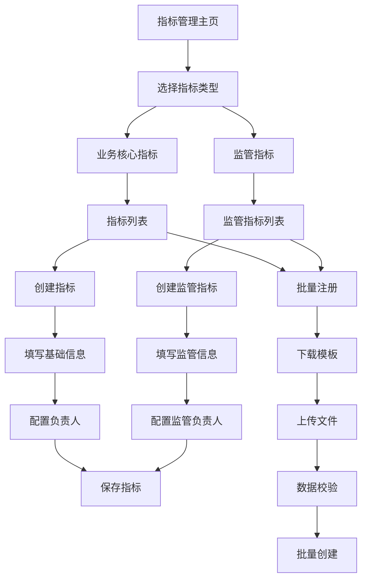

# 指标管理系统升级需求文档

## 1. 产品概述

本次升级旨在扩展现有指标管理系统，新增监管指标类型支持，实现监管指标和业务核心指标的统一管理。系统将支持不同指标类型的差异化管理，满足监管合规要求和业务运营需求。

升级后的系统将为金融机构提供完整的指标管理解决方案，涵盖监管报送和业务分析两大核心场景，提升指标管理的规范性和效率。

## 2. 核心功能

### 2.1 用户角色

| 角色 | 注册方式 | 核心权限 |
|------|----------|----------|
| 业务用户 | 内部账号登录 | 可查看和管理业务核心指标，创建和编辑指标 |
| 技术用户 | 内部账号登录 | 可管理所有类型指标，负责技术实现和维护 |
| 监管专员 | 内部账号登录 | 专门负责监管指标的创建、审核和报送管理 |

### 2.2 功能模块

本次升级的指标管理系统包含以下主要页面：

1. **指标管理主页**：指标类型切换、搜索筛选、指标列表展示
2. **指标创建页面**：单个指标注册、指标类型选择、表单动态适配
3. **批量注册页面**：Excel模板下载、批量导入、数据校验
4. **指标详情页面**：指标信息展示、版本历史、编辑功能
5. **监管报表配置页面**：报表大类管理、指标分类绑定

### 2.3 页面详情

| 页面名称 | 模块名称 | 功能描述 |
|----------|----------|----------|
| 指标管理主页 | 类型切换器 | 支持在监管指标和业务核心指标间切换，动态更新列表和筛选条件 |
| 指标管理主页 | 搜索筛选区 | 根据指标类型显示不同的筛选条件，监管指标支持按监管报表大类筛选 |
| 指标管理主页 | 指标列表 | 展示指标基本信息，根据类型显示不同的列字段，每行显示指标类型标识（蓝色"业务"标签或橙色"监管"标签） |
| 指标创建页面 | 类型选择 | 首先选择指标类型，动态加载对应的表单字段 |
| 指标创建页面 | 基础信息表单 | 指标名称、编码、描述等通用字段 |
| 指标创建页面 | 分类配置表单 | 根据指标类型显示业务域或监管报表大类 |
| 指标创建页面 | 负责人配置 | 技术负责人（必填）、业务负责人（监管指标必填，业务指标非必填） |
| 批量注册页面 | 模板管理 | 根据指标类型提供不同的Excel模板下载，业务核心指标模板包含业务域字段，监管指标模板包含监管报表大类和报表名称字段 |
| 批量注册页面 | 文件上传 | 支持Excel文件上传和数据预览，自动识别指标类型并应用对应验证规则 |
| 批量注册页面 | 数据校验 | 校验数据格式、必填字段、业务规则，监管指标额外校验业务负责人必填和指标分类与报表名称绑定关系 |
| 批量注册页面 | 批量创建结果 | 显示创建成功和失败的指标数量，提供详细的错误信息和重新导入功能 |
| 指标详情页面 | 信息展示 | 根据指标类型展示相应的详细信息 |
| 指标详情页面 | 版本管理 | 指标版本历史记录和版本对比 |
| 监管报表配置页面 | 报表大类管理 | 维护监管报表大类和子分类 |
| 监管报表配置页面 | 分类绑定 | 配置指标分类与报表名称的绑定关系 |

## 3. 核心流程

### 3.1 业务核心指标管理流程

用户登录系统后，选择业务核心指标类型，可以查看现有指标列表。创建新指标时，填写基础信息、选择业务域、配置技术负责人（业务负责人可选），完成后指标进入待审核状态。

### 3.2 监管指标管理流程

监管专员选择监管指标类型，创建新指标时必须选择监管报表大类，系统自动关联对应的指标分类和报表名称。必须配置技术负责人和业务负责人，完成后指标可用于监管报送。

### 3.3 批量注册流程

#### 3.3.1 业务核心指标批量注册
用户选择业务核心指标类型，下载业务指标Excel模板（包含指标名称、编码、业务域、技术负责人、业务负责人等字段）。填写完成后上传文件，系统校验业务域有效性、技术负责人必填等规则，显示校验结果后批量创建。

#### 3.3.2 监管指标批量注册
用户选择监管指标类型，下载监管指标Excel模板（包含指标名称、编码、监管报表大类、报表名称、指标分类、技术负责人、业务负责人等字段）。系统校验监管报表大类、业务负责人必填、指标分类与报表名称绑定关系等规则，确保监管合规性后批量创建。



## 4. 用户界面设计

### 4.1 设计风格

- **主色调**：#1890ff（蓝色）、#52c41a（绿色成功状态）
- **辅助色**：#faad14（橙色警告）、#f5222d（红色错误）
- **按钮样式**：圆角按钮，主要操作使用实心按钮，次要操作使用边框按钮
- **字体**：系统默认字体，标题使用16px，正文使用14px，辅助信息使用12px
- **布局风格**：卡片式布局，顶部导航栏，左侧功能菜单
- **图标风格**：使用Arco Design图标库，简洁线性风格

### 4.2 页面设计概览

| 页面名称 | 模块名称 | UI元素 |
|----------|----------|--------|
| 指标管理主页 | 类型切换器 | 顶部Tab切换组件，蓝色激活状态，灰色未激活状态 |
| 指标管理主页 | 搜索筛选区 | 白色背景卡片，表单布局，筛选条件左对齐，搜索按钮右对齐 |
| 指标管理主页 | 指标列表 | 表格组件，斑马纹行，悬停高亮，操作列固定右侧，指标类型列显示标签：业务核心指标显示蓝色"业务"标签（#1890ff背景），监管指标显示橙色"监管"标签（#faad14背景） |
| 指标创建页面 | 类型选择 | 单选按钮组，卡片式选择器，选中状态蓝色边框 |
| 指标创建页面 | 表单区域 | 两列布局，标签右对齐，必填字段红色星号标识 |
| 批量注册页面 | 文件上传 | 拖拽上传组件，虚线边框，上传图标和提示文字 |
| 批量注册页面 | 数据预览 | 表格展示，错误行红色背景，成功行绿色图标，指标类型列显示对应颜色标签 |
| 批量注册页面 | 模板下载区 | 两个下载按钮，业务核心指标模板（蓝色按钮）和监管指标模板（橙色按钮），按钮旁显示模板字段说明 |

### 4.3 响应式设计

系统采用桌面优先设计，支持1920px、1440px、1024px等主流分辨率。表格在小屏幕下支持横向滚动，表单在移动端自动调整为单列布局。关键操作按钮保持可见性和可点击性。

## 5. 数据结构设计

### 5.1 指标类型枚举

```typescript
enum MetricType {
  BUSINESS_CORE = 'business_core',    // 业务核心指标
  REGULATORY = 'regulatory'           // 监管指标
}
```

### 5.2 监管报表大类枚举

```typescript
enum RegulatoryCategory {
  CBIRC_BANKING = 'cbirc_banking',           // 银保监会-银监报表
  PBOC_CENTRALIZED = 'pboc_centralized',     // 人行-大集中报表
  PBOC_FINANCIAL_DATA = 'pboc_financial_data', // 人行-金融基础数据
  PBOC_INTEREST_RATE = 'pboc_interest_rate'   // 人行-利率报备检测分析
}
```

### 5.3 扩展后的指标数据结构

```typescript
interface MetricItem {
  id: string;
  name: string;
  code: string;
  description?: string;
  type: MetricType;                    // 新增：指标类型
  
  // 分类字段（根据类型不同）
  businessDomain?: string;             // 业务域（业务核心指标）
  regulatoryCategory?: RegulatoryCategory; // 监管报表大类（监管指标）
  
  // 负责人字段
  technicalOwner: string;              // 技术负责人（必填）
  businessOwner?: string;              // 业务负责人（监管指标必填，业务指标可选）
  
  // 监管指标特有字段
  reportName?: string;                 // 报表名称（与指标分类绑定）
  metricCategory?: string;             // 指标分类（监管指标与报表名称绑定）
  
  // 通用字段
  statisticalPeriod: string;
  useCase: string;
  sourceTable: string;
  processingLogic: string;
  fieldDescription: string;
  storageLocation: string;
  queryCode: string;
  status: 'active' | 'inactive';
  versions: VersionHistoryItem[];
  createdAt: string;
  updatedAt: string;
}
```

### 5.4 报表名称绑定配置

```typescript
interface ReportBinding {
  id: string;
  regulatoryCategory: RegulatoryCategory;
  reportName: string;
  metricCategories: string[];          // 绑定的指标分类列表
  isActive: boolean;
}
```

### 5.5 批量注册数据结构

```typescript
interface BatchImportItem {
  rowIndex: number;
  data: Partial<MetricItem>;
  validationErrors: string[];
  isValid: boolean;
}

interface BatchImportResult {
  totalRows: number;
  validRows: number;
  invalidRows: number;
  items: BatchImportItem[];
}
```

## 6. 业务规则

### 6.1 字段验证规则

1. **通用规则**：
   - 指标名称：必填，长度2-50字符，不能重复
   - 指标编码：必填，字母数字组合，不能重复
   - 技术负责人：必填，必须是系统内有效用户

2. **业务核心指标规则**：
   - 业务域：必填，从预定义列表选择
   - 业务负责人：非必填

3. **监管指标规则**：
   - 监管报表大类：必填，从枚举值选择
   - 业务负责人：必填，必须是系统内有效用户
   - 指标分类：必须与选择的报表名称匹配
   - 报表名称：必填，根据监管报表大类动态加载

### 6.4 批量创建验证规则

1. **Excel文件格式验证**：
   - 文件格式必须为.xlsx或.xls
   - 文件大小不超过10MB
   - 最大支持1000行数据
   - 必须包含标准模板的所有必填列

2. **数据行验证**：
   - 跳过空行和标题行
   - 每行数据按照对应指标类型的验证规则进行校验
   - 记录每行的验证错误信息

3. **业务核心指标批量验证**：
   - 业务域必须在预定义列表中
   - 技术负责人必须存在且有效
   - 业务负责人如果填写，必须存在且有效

4. **监管指标批量验证**：
   - 监管报表大类必须在枚举值中
   - 报表名称必须与监管报表大类匹配
   - 指标分类必须与报表名称绑定关系匹配
   - 技术负责人和业务负责人都必须存在且有效

5. **批量处理规则**：
   - 验证失败的行不会被创建，但不影响其他有效行
   - 提供详细的错误报告，包括行号和具体错误信息
   - 支持修正后重新导入失败的数据

### 6.2 数据迁移规则

1. 现有指标自动标记为业务核心指标类型
2. 现有的"负责人"字段映射为"技术负责人"
3. 现有的"业务域"字段保持不变
4. 为现有指标的"业务负责人"字段设置为空（可选）

### 6.3 权限控制规则

1. 业务用户只能查看和管理业务核心指标
2. 技术用户可以管理所有类型指标
3. 监管专员专门负责监管指标的管理
4. 指标创建者和负责人可以编辑指标
5. 删除操作需要管理员权限

## 7. 接口设计

### 7.1 指标管理接口

```typescript
// 获取指标列表
GET /api/metrics?type={MetricType}&page={number}&size={number}

// 创建指标
POST /api/metrics
Body: MetricItem

// 更新指标
PUT /api/metrics/{id}
Body: Partial<MetricItem>

// 删除指标
DELETE /api/metrics/{id}
```

### 7.2 批量注册接口

```typescript
// 下载模板
GET /api/metrics/template?type={MetricType}
Response: Excel文件流

// 批量导入预览
POST /api/metrics/batch/preview
Body: FormData (Excel文件)
Response: BatchImportResult

// 批量创建
POST /api/metrics/batch/create
Body: BatchImportItem[]
Response: { successCount: number, failureCount: number, errors: string[] }
```

### 7.4 Excel模板格式定义

#### 7.4.1 业务核心指标模板字段

| 列名 | 字段名 | 数据类型 | 是否必填 | 说明 |
|------|--------|----------|----------|------|
| 指标名称 | name | string | 是 | 长度2-50字符，不能重复 |
| 指标编码 | code | string | 是 | 字母数字组合，不能重复 |
| 指标描述 | description | string | 否 | 最大200字符 |
| 业务域 | businessDomain | string | 是 | 从预定义列表选择 |
| 技术负责人 | technicalOwner | string | 是 | 系统内有效用户 |
| 业务负责人 | businessOwner | string | 否 | 系统内有效用户 |
| 统计周期 | statisticalPeriod | string | 是 | 日/周/月/季/年 |
| 使用场景 | useCase | string | 是 | 最大500字符 |
| 来源表 | sourceTable | string | 是 | 数据库表名 |
| 加工逻辑 | processingLogic | string | 是 | SQL或计算逻辑 |

#### 7.4.2 监管指标模板字段

| 列名 | 字段名 | 数据类型 | 是否必填 | 说明 |
|------|--------|----------|----------|------|
| 指标名称 | name | string | 是 | 长度2-50字符，不能重复 |
| 指标编码 | code | string | 是 | 字母数字组合，不能重复 |
| 指标描述 | description | string | 否 | 最大200字符 |
| 监管报表大类 | regulatoryCategory | string | 是 | 银保监会-银监报表/人行-大集中报表/人行-金融基础数据/人行-利率报备检测分析 |
| 报表名称 | reportName | string | 是 | 根据监管报表大类选择 |
| 指标分类 | metricCategory | string | 是 | 必须与报表名称绑定匹配 |
| 技术负责人 | technicalOwner | string | 是 | 系统内有效用户 |
| 业务负责人 | businessOwner | string | 是 | 系统内有效用户（监管指标必填） |
| 统计周期 | statisticalPeriod | string | 是 | 日/周/月/季/年 |
| 使用场景 | useCase | string | 是 | 最大500字符 |
| 来源表 | sourceTable | string | 是 | 数据库表名 |
| 加工逻辑 | processingLogic | string | 是 | SQL或计算逻辑 |

### 7.3 配置管理接口

```typescript
// 获取监管报表大类
GET /api/regulatory/categories

// 获取报表名称绑定
GET /api/regulatory/bindings?category={RegulatoryCategory}

// 更新绑定配置
PUT /api/regulatory/bindings
Body: ReportBinding[]
```

## 8. 实施计划

### 8.1 开发阶段

1. **第一阶段**（1-2周）：数据结构扩展和数据迁移
2. **第二阶段**（2-3周）：指标管理页面改造和类型切换功能
3. **第三阶段**（2-3周）：创建和编辑表单的动态适配
4. **第四阶段**（1-2周）：批量注册功能开发
5. **第五阶段**（1周）：监管报表配置管理
6. **第六阶段**（1周）：测试和优化

### 8.2 测试重点

1. 不同指标类型的表单验证
2. 数据迁移的完整性和准确性
3. 批量导入的数据校验和错误处理
4. 权限控制的有效性
5. 监管指标与报表名称绑定的正确性

### 8.3 上线准备

1. 数据备份和迁移脚本准备
2. 用户培训材料制作
3. 监控和日志配置
4. 回滚方案制定

## 9. 风险评估

### 9.1 技术风险

- **数据迁移风险**：现有数据量大，迁移过程可能影响系统性能
- **兼容性风险**：新旧数据结构兼容性问题
- **性能风险**：增加字段后查询性能可能下降

### 9.2 业务风险

- **用户适应风险**：界面变化可能影响用户使用习惯
- **数据准确性风险**：批量导入可能引入错误数据
- **合规风险**：监管指标配置错误可能影响报送

### 9.3 风险缓解措施

1. 充分的测试环境验证
2. 分阶段上线，逐步切换
3. 完善的数据校验机制
4. 详细的用户培训和文档
5. 24小时技术支持保障