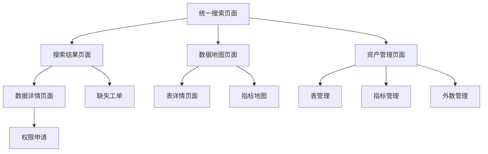

# 数据发现平台产品需求文档

## 1. 产品概述

数据发现平台是一个面向业务人员的统一数据门户，旨在解决企业数据资产分散、查找困难、理解成本高的核心痛点。平台通过"让业务找得到、看得懂、用得动全部数据资产"的核心理念，为业务分析师、数据开发、算法工程师等用户提供一站式数据发现和管理服务。

平台将显著提升数据查找效率（从平均2.5小时缩短到分钟级），提高数据理解效率，减少重复建设，并实现资产全生命周期线上化管理。

## 2. 核心功能

### 2.1 用户角色

| 角色          | 注册方式   | 核心权限                  |
| ----------- | ------ | --------------------- |
| 业务分析师/运营/风控 | 企业邮箱注册 | 可搜索查看数据资产、申请权限、提交缺失工单 |
| 数据开发/数据管理员  | 管理员邀请  | 可注册管理数据资产、审批权限、处理工单   |
| 数据科学家/算法工程师 | 企业邮箱注册 | 可搜索特征数据、查看质量评分、申请高级权限 |
| 系统管理员       | 系统预设   | 拥有全部管理权限，可配置系统参数      |

### 2.2 功能模块

数据发现平台包含以下核心页面：

1. **统一搜索页面**：谷歌式搜索体验，智能联想，高级筛选，搜索历史管理
2. **数据地图页面**：全量数据可视化展示，表集合管理，血缘关系图谱，指标地图
3. **资产管理页面**：数据资产注册向导，批量管理，生命周期管理
4. **资产总览页面**：企业数据资产统计大屏，运营监控面板
5. **客户360页面**：统一客户视图，多维度数据整合
6. **外部数据页面**：第三方数据源管理，采购登记，连接测试

### 2.3 页面详情

| 页面名称   | 模块名称   | 功能描述                  |
| ------ | ------ | --------------------- |
| 统一搜索页面 | 搜索框组件  | 支持关键词搜索、智能联想、搜索历史记录   |
| 统一搜索页面 | 高级筛选   | 按数据类型、业务域、更新频率等维度筛选   |
| 统一搜索页面 | 结果展示   | 分类展示搜索结果，支持收藏、详情查看    |
| 统一搜索页面 | 缺失工单   | 用户反馈机制，支持截图上传和详细描述    |
| 数据地图页面 | 表集合网格  | 可视化展示数据表集合，支持创建、编辑、删除 |
| 数据地图页面 | 血缘关系图  | 基于ECharts的数据血缘可视化展示   |
| 数据地图页面 | 指标地图   | 地铁图式指标层级展示，支持层级和业务线筛选 |
| 数据地图页面 | 业务流程导航 | 核心业务流程的数据流向展示         |
| 资产管理页面 | 资产统计   | 各类数据资产的数量统计和快速导航      |
| 资产管理页面 | 表管理模块  | 数据表注册向导，表结构管理，质量监控    |
| 资产管理页面 | 指标管理模块 | 业务指标定义，计算规则配置，监控告警    |
| 资产管理页面 | 外数管理模块 | 外部数据源配置，连接测试，数据同步     |
| 资产管理页面 | 批量管理模块 | 资产批量导入导出，批量操作功能       |
| 资产管理页面 | 活动时间线  | 展示最近的资产变更活动记录         |

## 3. 核心流程

### 业务用户数据发现流程

用户通过统一搜索输入关键词 → 系统返回分类结果 → 用户查看详情了解数据质量和血缘 → 申请数据权限 → 获得数据使用权限 → 反馈使用体验

### 数据管理员资产注册流程

数据管理员进入资产管理 → 选择注册类型（表/指标/外数） → 填写基础信息和元数据 → 配置质量规则和监控 → 提交审批 → 资产正式发布

### 缺失数据反馈流程

用户搜索未找到目标数据 → 点击缺失工单 → 填写缺失类型和详细描述 → 上传相关截图 → 提交工单 → 数据管理员处理工单

## 4. 用户界面设计

### 4.1 设计风格

* **主色调**：蓝色系（#1890ff）为主色，灰色系（#f7f8fa）为背景色

* **按钮样式**：圆角按钮设计，支持悬停和点击状态反馈

* **字体规范**：主标题16px，正文14px，辅助信息12px

* **布局风格**：卡片式布局，顶部导航栏，左侧功能菜单

* **图标风格**：使用Arco Design图标库，简洁现代的线性图标

### 4.2 页面设计概览

| 页面名称   | 模块名称  | UI元素                   |
| ------ | ----- | ---------------------- |
| 统一搜索页面 | 搜索区域  | 大尺寸搜索框，蓝色搜索按钮，高级筛选折叠面板 |
| 统一搜索页面 | 结果展示  | 标签页切换，卡片式结果布局，收藏红心图标   |
| 数据地图页面 | 表集合网格 | 3列网格布局，悬停阴影效果，操作按钮浮现   |
| 数据地图页面 | 指标地图  | 地铁线路图样式，层级筛选下拉框，重置按钮   |
| 资产管理页面 | 统计卡片  | 4列统计卡片，图标+数字展示，点击跳转效果  |
| 资产管理页面 | 功能模块  | 2x2网格布局，模块图标，功能标签，描述文字 |
| 缺失工单弹窗 | 表单区域  | 垂直表单布局，下拉选择，多行文本框，文件上传 |

### 4.3 响应式设计

平台采用桌面优先的响应式设计，支持1920px、1440px、1024px等主流分辨率。移动端提供基础的搜索和查看功能，复杂的管理操作建议在桌面端完成。

## 5. 技术架构要求

### 5.1 前端技术栈

* **框架**：Vue 3 + Composition API + TypeScript

* **构建工具**：Vite

* **UI组件库**：Arco Design

* **图表库**：ECharts（血缘图谱）

* **状态管理**：Vuex

* **路由管理**：Vue Router

### 5.2 核心功能实现

* **搜索功能**：支持防抖搜索，本地搜索历史存储，高级筛选条件组合

* **数据可视化**：基于ECharts实现血缘关系图，支持节点拖拽和缩放

* **表单处理**：支持分步骤表单，草稿自动保存，表单验证

* **文件上传**：支持图片上传预览，文件格式验证

* **权限控制**：基于角色的页面和功能权限控制

### 5.3 性能要求

* 页面首次加载时间不超过3秒

* 搜索响应时间不超过500ms

* 支持1000+数据表的流畅展示

* 图表渲染支持500+节点的血缘关系

## 6. 非功能性需求

### 6.1 可用性要求

* 系统可用性达到99.5%以上

* 支持7x24小时稳定运行

* 具备完善的错误处理和用户提示机制

### 6.2 安全性要求

* 支持企业级单点登录（SSO）

* 数据访问权限精确到表级别

* 敏感数据脱敏展示

* 操作日志完整记录

### 6.3 扩展性要求

* 支持插件化的数据源接入

* 支持自定义指标计算规则

* 支持多租户架构

* 支持国际化多语言

## 7. 验收标准

### 7.1 功能验收

* 统一搜索功能完整可用，支持关键词和筛选条件搜索

* 数据地图可视化展示正常，血缘关系图准确

* 资产管理流程完整，支持增删改查操作

* 缺失工单提交和处理流程畅通

### 7.2 性能验收

* 页面加载时间符合性能要求

* 大数据量场景下系统响应正常

* 并发用户访问系统稳定

### 7.3 用户体验验收

* 界面设计符合企业视觉规范

* 操作流程简洁直观

* 错误提示友好明确

* 移动端基础功能可用

