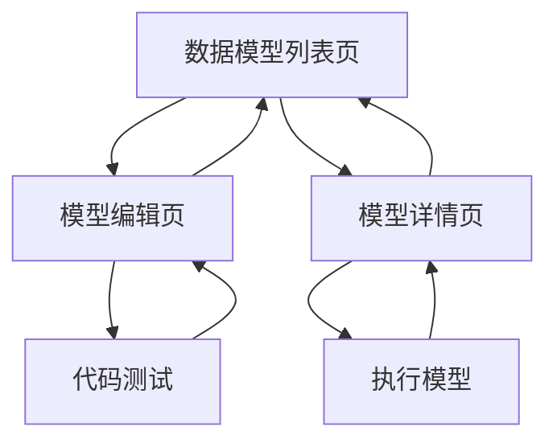

# 数据查询&管理模型应用 - 产品需求文档

## 1. 产品概述

在数据管理模块下新增数据查询&管理模型应用功能，为用户提供统一的数据模型管理平台，支持创建、编辑和管理各种数据查询模型，满足明细数据下载和分析报告模版两种核心使用场景。

该功能旨在解决数据分析师和业务用户在数据查询和报告生成过程中的效率问题，通过可视化界面管理SQL和Python脚本，提升数据处理的标准化和复用性。

## 2. 核心功能

### 2.1 用户角色

| 角色 | 注册方式 | 核心权限 |
|------|----------|----------|
| 数据分析师 | 系统内部分配 | 可创建、编辑、删除数据模型，管理自己创建的模型 |
| 业务用户 | 系统内部分配 | 可查看和使用已发布的数据模型 |
| 管理员 | 系统管理员分配 | 可管理所有数据模型，审核发布状态 |

### 2.2 功能模块

我们的数据查询&管理模型应用包含以下主要页面：

1. **数据模型列表页**：侧边菜单入口、模型列表展示、搜索筛选功能
2. **模型编辑页**：模型信息配置、代码编辑器、预览测试功能
3. **模型详情页**：模型信息查看、执行历史、版本管理

### 2.3 页面详情

| 页面名称 | 模块名称 | 功能描述 |
|----------|----------|----------|
| 数据模型列表页 | 侧边菜单 | 在数据管理模块下添加"数据查询&管理模型"菜单项，点击进入列表页 |
| 数据模型列表页 | 模型列表 | 展示数据模型表格：名称、使用场景、管理人、状态、版本。支持搜索、筛选、排序功能 |
| 数据模型列表页 | 操作按钮 | 新增模型按钮、编辑按钮、删除按钮、复制按钮 |
| 模型编辑页 | 基本信息 | 配置模型名称、描述、使用场景（明细数据下载/分析报告模版）、管理人 |
| 模型编辑页 | 代码编辑器 | 支持SQL和Python两种语言编辑，提供语法高亮、代码提示、格式化功能 |
| 模型编辑页 | 预览测试 | 代码执行测试、结果预览、错误提示功能 |
| 模型编辑页 | 版本管理 | 保存草稿、发布版本、版本历史查看 |
| 模型详情页 | 信息展示 | 显示模型完整信息、代码内容、执行统计 |
| 模型详情页 | 执行历史 | 显示模型执行记录、结果下载、错误日志 |

## 3. 核心流程

### 数据分析师流程
用户通过侧边菜单进入数据模型列表页 → 点击新增按钮进入编辑页 → 填写基本信息并选择使用场景 → 在代码编辑器中编写SQL或Python代码 → 测试代码执行效果 → 保存并发布模型 → 返回列表页查看创建的模型

### 业务用户流程
用户进入数据模型列表页 → 筛选查找需要的模型 → 点击模型名称进入详情页 → 查看模型信息和使用说明 → 执行模型获取数据结果 → 下载数据或查看报告

## 4. 用户界面设计

### 4.1 设计风格

- **主色调**：#165DFF（Arco Design主蓝色）、#F2F3F5（背景灰）
- **辅助色**：#00B42A（成功绿）、#FF7D00（警告橙）、#F53F3F（错误红）
- **按钮样式**：圆角按钮，主要按钮使用实心样式，次要按钮使用线框样式
- **字体**：PingFang SC，标题16px，正文14px，辅助文字12px
- **布局风格**：卡片式布局，左侧导航，顶部面包屑导航
- **图标风格**：使用Arco Design图标库，线性风格

### 4.2 页面设计概览

| 页面名称 | 模块名称 | UI元素 |
|----------|----------|--------|
| 数据模型列表页 | 侧边菜单 | 在数据管理分组下添加菜单项，使用数据库图标，蓝色高亮选中状态 |
| 数据模型列表页 | 页面头部 | 面包屑导航、页面标题、新增按钮（主色调，右上角位置） |
| 数据模型列表页 | 筛选区域 | 搜索框、使用场景下拉选择、状态筛选、管理人筛选，卡片式布局 |
| 数据模型列表页 | 数据表格 | Arco Table组件，斑马纹样式，悬停高亮，操作列固定右侧 |
| 模型编辑页 | 表单区域 | 左右分栏布局，左侧基本信息表单，右侧代码编辑器 |
| 模型编辑页 | 代码编辑器 | Monaco Editor集成，深色主题，全屏编辑模式 |
| 模型编辑页 | 底部操作 | 保存草稿、测试运行、发布按钮，固定底部位置 |
| 模型详情页 | 信息卡片 | 模型基本信息展示，状态标签，版本信息 |
| 模型详情页 | 代码展示 | 只读代码编辑器，语法高亮，复制按钮 |
| 模型详情页 | 执行历史 | 时间线样式展示，执行状态图标，结果下载链接 |

### 4.3 响应式设计

产品采用桌面优先设计，针对1920x1080及以上分辨率优化。支持平板设备适配（最小宽度768px），代码编辑器在小屏幕下可切换为全屏模式以提升编辑体验。