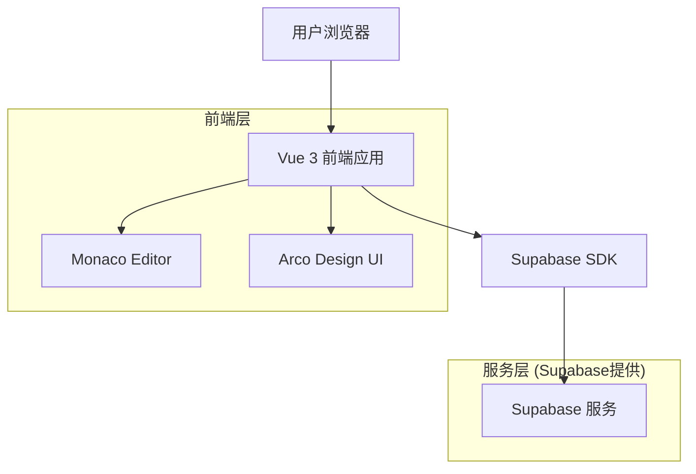
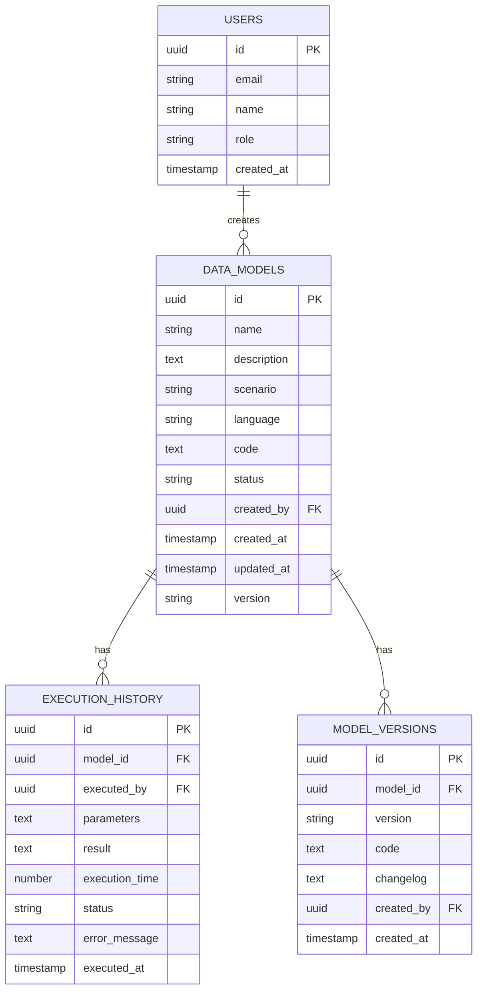

# 数据查询&管理模型应用 - 技术架构文档

## 1. 架构设计



## 2. 技术描述

- **前端**: Vue 3 (Composition API) + Arco Design + Vue Router + Vuex + Monaco Editor
- **后端**: Supabase (认证、数据库、存储)
- **构建工具**: Vite
- **开发语言**: JavaScript + TypeScript

## 3. 路由定义

| 路由 | 用途 |
|------|------|
| /management/data-models | 数据模型列表页，展示所有数据模型 |
| /management/data-models/create | 新建数据模型页面 |
| /management/data-models/:id/edit | 编辑数据模型页面 |
| /management/data-models/:id | 数据模型详情页面 |

## 4. API定义

### 4.1 核心API

**数据模型管理相关**

```
GET /api/data-models
```

请求参数:
| 参数名 | 参数类型 | 是否必需 | 描述 |
|--------|----------|----------|------|
| page | number | false | 页码，默认1 |
| pageSize | number | false | 每页数量，默认20 |
| search | string | false | 搜索关键词 |
| scenario | string | false | 使用场景筛选 |
| status | string | false | 状态筛选 |

响应:
| 参数名 | 参数类型 | 描述 |
|--------|----------|------|
| data | array | 数据模型列表 |
| total | number | 总数量 |
| page | number | 当前页码 |
| pageSize | number | 每页数量 |

```
POST /api/data-models
```

请求:
| 参数名 | 参数类型 | 是否必需 | 描述 |
|--------|----------|----------|------|
| name | string | true | 模型名称 |
| description | string | false | 模型描述 |
| scenario | string | true | 使用场景 |
| language | string | true | 编程语言 |
| code | string | true | 代码内容 |
| status | string | true | 状态 |

响应:
| 参数名 | 参数类型 | 描述 |
|--------|----------|------|
| id | string | 模型ID |
| success | boolean | 创建是否成功 |

```
PUT /api/data-models/:id
```

请求:
| 参数名 | 参数类型 | 是否必需 | 描述 |
|--------|----------|----------|------|
| name | string | true | 模型名称 |
| description | string | false | 模型描述 |
| scenario | string | true | 使用场景 |
| language | string | true | 编程语言 |
| code | string | true | 代码内容 |
| status | string | true | 状态 |

```
DELETE /api/data-models/:id
```

```
POST /api/data-models/:id/execute
```

请求:
| 参数名 | 参数类型 | 是否必需 | 描述 |
|--------|----------|----------|------|
| parameters | object | false | 执行参数 |

响应:
| 参数名 | 参数类型 | 描述 |
|--------|----------|------|
| result | any | 执行结果 |
| executionTime | number | 执行时间(ms) |
| status | string | 执行状态 |

## 5. 数据模型

### 5.1 数据模型定义



### 5.2 数据定义语言

**数据模型表 (data_models)**
```sql
-- 创建表
CREATE TABLE data_models (
    id UUID PRIMARY KEY DEFAULT gen_random_uuid(),
    name VARCHAR(255) NOT NULL,
    description TEXT,
    scenario VARCHAR(50) NOT NULL CHECK (scenario IN ('detail_download', 'report_template')),
    language VARCHAR(20) NOT NULL CHECK (language IN ('sql', 'python')),
    code TEXT NOT NULL,
    status VARCHAR(20) DEFAULT 'draft' CHECK (status IN ('draft', 'published', 'archived')),
    created_by UUID NOT NULL,
    created_at TIMESTAMP WITH TIME ZONE DEFAULT NOW(),
    updated_at TIMESTAMP WITH TIME ZONE DEFAULT NOW(),
    version VARCHAR(20) DEFAULT '1.0.0'
);

-- 创建索引
CREATE INDEX idx_data_models_created_by ON data_models(created_by);
CREATE INDEX idx_data_models_scenario ON data_models(scenario);
CREATE INDEX idx_data_models_status ON data_models(status);
CREATE INDEX idx_data_models_created_at ON data_models(created_at DESC);

-- 执行历史表 (execution_history)
CREATE TABLE execution_history (
    id UUID PRIMARY KEY DEFAULT gen_random_uuid(),
    model_id UUID NOT NULL REFERENCES data_models(id) ON DELETE CASCADE,
    executed_by UUID NOT NULL,
    parameters TEXT,
    result TEXT,
    execution_time INTEGER,
    status VARCHAR(20) DEFAULT 'success' CHECK (status IN ('success', 'error', 'timeout')),
    error_message TEXT,
    executed_at TIMESTAMP WITH TIME ZONE DEFAULT NOW()
);

-- 创建索引
CREATE INDEX idx_execution_history_model_id ON execution_history(model_id);
CREATE INDEX idx_execution_history_executed_by ON execution_history(executed_by);
CREATE INDEX idx_execution_history_executed_at ON execution_history(executed_at DESC);

-- 模型版本表 (model_versions)
CREATE TABLE model_versions (
    id UUID PRIMARY KEY DEFAULT gen_random_uuid(),
    model_id UUID NOT NULL REFERENCES data_models(id) ON DELETE CASCADE,
    version VARCHAR(20) NOT NULL,
    code TEXT NOT NULL,
    changelog TEXT,
    created_by UUID NOT NULL,
    created_at TIMESTAMP WITH TIME ZONE DEFAULT NOW()
);

-- 创建索引
CREATE INDEX idx_model_versions_model_id ON model_versions(model_id);
CREATE INDEX idx_model_versions_version ON model_versions(version);

-- 权限设置
GRANT SELECT ON data_models TO anon;
GRANT ALL PRIVILEGES ON data_models TO authenticated;
GRANT SELECT ON execution_history TO anon;
GRANT ALL PRIVILEGES ON execution_history TO authenticated;
GRANT SELECT ON model_versions TO anon;
GRANT ALL PRIVILEGES ON model_versions TO authenticated;

-- 初始化数据
INSERT INTO data_models (name, description, scenario, language, code, status, created_by) VALUES
('用户行为分析', '分析用户在平台上的行为数据，生成用户画像报告', 'report_template', 'sql', 'SELECT user_id, COUNT(*) as action_count FROM user_actions GROUP BY user_id', 'published', '00000000-0000-0000-0000-000000000001'),
('销售数据导出', '导出指定时间范围内的销售明细数据', 'detail_download', 'sql', 'SELECT * FROM sales WHERE created_at BETWEEN $start_date AND $end_date', 'published', '00000000-0000-0000-0000-000000000001'),
('数据清洗脚本', '使用Python清洗和预处理原始数据', 'detail_download', 'python', 'import pandas as pd\ndf = pd.read_csv("data.csv")\ndf_cleaned = df.dropna()\nprint(df_cleaned.head())', 'draft', '00000000-0000-0000-0000-000000000001');
```