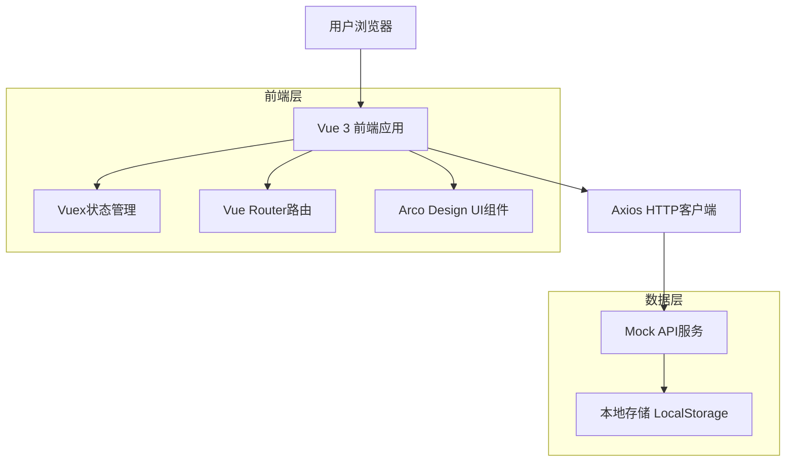
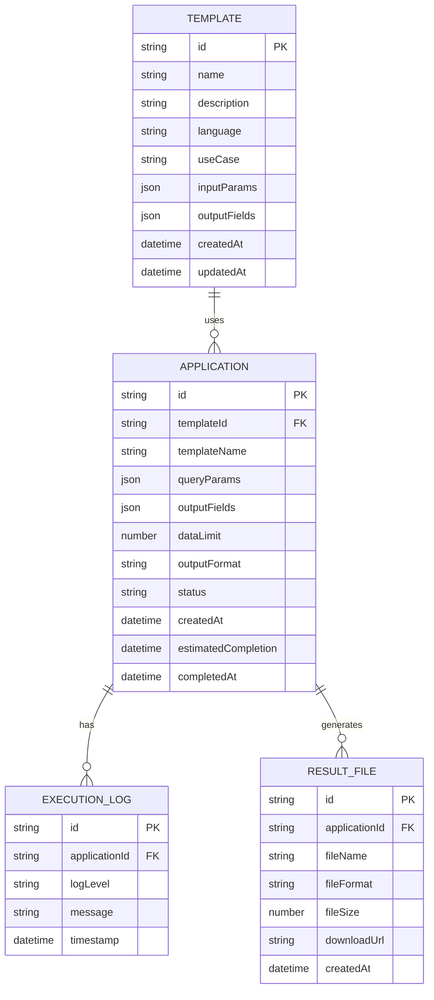

# 明细数据查询服务技术架构文档

## 1. 架构设计



## 2. 技术描述

- **前端**: Vue 3 + Composition API + Arco Design + Vite
- **状态管理**: Vuex 4
- **路由管理**: Vue Router 4
- **HTTP客户端**: Axios
- **数据模拟**: Mock.js + LocalStorage
- **日期处理**: Day.js
- **构建工具**: Vite

## 3. 路由定义

| 路由 | 用途 |
|------|------|
| /management/service/detail-data-query | 明细数据查询服务主页面，展示申请列表和添加申请功能 |
| /management/service/detail-data-query/detail/:id | 申请详情页面，显示申请的详细信息和状态 |
| /management/service/detail-data-query/result/:id | 结果下载页面，提供查询结果文件下载 |

## 4. API定义

### 4.1 核心API

#### 获取明细数据模板列表
```
GET /api/data-models/templates
```

请求参数:
| 参数名 | 参数类型 | 是否必填 | 描述 |
|--------|----------|----------|------|
| useCase | string | true | 使用场景，固定值"明细数据下载" |
| page | number | false | 页码，默认1 |
| pageSize | number | false | 每页数量，默认20 |

响应:
| 参数名 | 参数类型 | 描述 |
|--------|----------|------|
| success | boolean | 请求是否成功 |
| data | array | 模板列表 |
| total | number | 总数量 |

示例:
```json
{
  "success": true,
  "data": [
    {
      "id": "template_001",
      "name": "用户交易明细查询",
      "description": "查询用户的详细交易记录",
      "language": "sql",
      "useCase": "明细数据下载",
      "inputParams": [
        {
          "id": "p1",
          "name": "user_id",
          "type": "string",
          "required": true,
          "description": "用户ID"
        }
      ],
      "outputFields": [
        {
          "name": "transaction_id",
          "type": "string",
          "description": "交易ID"
        }
      ]
    }
  ],
  "total": 10
}
```

#### 创建查询申请
```
POST /api/detail-query/applications
```

请求:
| 参数名 | 参数类型 | 是否必填 | 描述 |
|--------|----------|----------|------|
| templateId | string | true | 模板ID |
| queryParams | object | true | 查询参数 |
| outputFields | array | true | 输出字段列表 |
| dataLimit | number | false | 数据量限制，默认10000 |
| outputFormat | string | false | 输出格式，默认csv |

响应:
| 参数名 | 参数类型 | 描述 |
|--------|----------|------|
| success | boolean | 请求是否成功 |
| data | object | 申请信息 |
| message | string | 响应消息 |

示例:
```json
{
  "templateId": "template_001",
  "queryParams": {
    "user_id": "U123456",
    "start_date": "2024-01-01",
    "end_date": "2024-01-31"
  },
  "outputFields": ["transaction_id", "user_id", "amount"],
  "dataLimit": 5000,
  "outputFormat": "excel"
}
```

#### 获取申请列表
```
GET /api/detail-query/applications
```

请求参数:
| 参数名 | 参数类型 | 是否必填 | 描述 |
|--------|----------|----------|------|
| status | string | false | 申请状态筛选 |
| page | number | false | 页码，默认1 |
| pageSize | number | false | 每页数量，默认20 |

响应:
| 参数名 | 参数类型 | 描述 |
|--------|----------|------|
| success | boolean | 请求是否成功 |
| data | array | 申请列表 |
| total | number | 总数量 |

#### 获取申请详情
```
GET /api/detail-query/applications/:id
```

响应:
| 参数名 | 参数类型 | 描述 |
|--------|----------|------|
| success | boolean | 请求是否成功 |
| data | object | 申请详情 |

#### 取消申请
```
PUT /api/detail-query/applications/:id/cancel
```

响应:
| 参数名 | 参数类型 | 描述 |
|--------|----------|------|
| success | boolean | 请求是否成功 |
| message | string | 响应消息 |

#### 下载查询结果
```
GET /api/detail-query/applications/:id/download
```

响应:
| 参数名 | 参数类型 | 描述 |
|--------|----------|------|
| success | boolean | 请求是否成功 |
| downloadUrl | string | 下载链接 |
| fileName | string | 文件名 |
| fileSize | number | 文件大小（字节） |

## 5. 数据模型

### 5.1 数据模型定义



### 5.2 数据定义语言

#### 模板数据结构
```javascript
// 数据模板接口定义
interface DataTemplate {
  id: string;
  name: string;
  description: string;
  language: 'sql' | 'python';
  useCase: string;
  inputParams: ModelParameter[];
  outputFields: OutputField[];
  createdAt: string;
  updatedAt: string;
}

interface ModelParameter {
  id: string;
  name: string;
  type: 'string' | 'number' | 'date' | 'boolean' | 'array' | 'object';
  required: boolean;
  description: string;
  defaultValue?: any;
}

interface OutputField {
  name: string;
  type: string;
  description: string;
}
```

#### 申请数据结构
```javascript
// 查询申请接口定义
interface QueryApplication {
  id: string;
  templateId: string;
  templateName: string;
  queryParams: Record<string, any>;
  outputFields: string[];
  dataLimit: number;
  outputFormat: 'csv' | 'excel' | 'json';
  status: 'pending' | 'processing' | 'completed' | 'failed' | 'cancelled';
  createdAt: string;
  estimatedCompletion: string;
  completedAt?: string;
  errorMessage?: string;
}

// 执行日志接口定义
interface ExecutionLog {
  id: string;
  applicationId: string;
  logLevel: 'info' | 'warn' | 'error';
  message: string;
  timestamp: string;
}

// 结果文件接口定义
interface ResultFile {
  id: string;
  applicationId: string;
  fileName: string;
  fileFormat: string;
  fileSize: number;
  downloadUrl: string;
  createdAt: string;
}
```

#### Mock数据初始化
```javascript
// 初始化模板数据
const initTemplateData = () => {
  const templates = [
    {
      id: 'template_001',
      name: '用户交易明细查询',
      description: '查询用户的详细交易记录，包括交易时间、金额、类型等信息',
      language: 'sql',
      useCase: '明细数据下载',
      inputParams: [
        {
          id: 'p1',
          name: 'user_id',
          type: 'string',
          required: true,
          description: '用户ID'
        },
        {
          id: 'p2',
          name: 'start_date',
          type: 'date',
          required: true,
          description: '开始日期'
        },
        {
          id: 'p3',
          name: 'end_date',
          type: 'date',
          required: true,
          description: '结束日期'
        }
      ],
      outputFields: [
        { name: 'transaction_id', type: 'string', description: '交易ID' },
        { name: 'user_id', type: 'string', description: '用户ID' },
        { name: 'transaction_time', type: 'datetime', description: '交易时间' },
        { name: 'amount', type: 'decimal', description: '交易金额' },
        { name: 'transaction_type', type: 'string', description: '交易类型' }
      ],
      createdAt: new Date().toISOString(),
      updatedAt: new Date().toISOString()
    }
  ];
  
  localStorage.setItem('detailQueryTemplates', JSON.stringify(templates));
};

// 初始化申请数据
const initApplicationData = () => {
  const applications = [];
  localStorage.setItem('detailQueryApplications', JSON.stringify(applications));
};
```

## 6. 组件架构

### 6.1 组件层次结构

```
DetailDataQueryService.vue (主页面)
├── ApplicationList.vue (申请列表)
│   ├── ApplicationCard.vue (申请卡片)
│   └── AddApplicationCard.vue (添加申请卡片)
├── AddApplicationModal.vue (添加申请弹窗)
│   ├── TemplateSelector.vue (模板选择器)
│   ├── TemplateInfo.vue (模板信息展示)
│   ├── ParamConfigForm.vue (参数配置表单)
│   ├── OutputFieldsSelector.vue (输出字段选择器)
│   └── QueryConfig.vue (查询配置)
└── ApplicationDetailModal.vue (申请详情弹窗)
    ├── BasicInfo.vue (基本信息)
    ├── QueryConditions.vue (查询条件)
    ├── OutputFields.vue (输出字段)
    └── ExecutionLogs.vue (执行日志)
```

### 6.2 状态管理

```javascript
// Vuex Store 模块定义
const detailQueryModule = {
  namespaced: true,
  state: {
    templates: [],
    applications: [],
    currentApplication: null,
    loading: false,
    error: null
  },
  mutations: {
    SET_TEMPLATES(state, templates) {
      state.templates = templates;
    },
    SET_APPLICATIONS(state, applications) {
      state.applications = applications;
    },
    ADD_APPLICATION(state, application) {
      state.applications.unshift(application);
    },
    UPDATE_APPLICATION(state, { id, updates }) {
      const index = state.applications.findIndex(app => app.id === id);
      if (index !== -1) {
        Object.assign(state.applications[index], updates);
      }
    },
    SET_CURRENT_APPLICATION(state, application) {
      state.currentApplication = application;
    },
    SET_LOADING(state, loading) {
      state.loading = loading;
    },
    SET_ERROR(state, error) {
      state.error = error;
    }
  },
  actions: {
    async fetchTemplates({ commit }) {
      commit('SET_LOADING', true);
      try {
        const response = await api.getDetailQueryTemplates();
        commit('SET_TEMPLATES', response.data);
      } catch (error) {
        commit('SET_ERROR', error.message);
      } finally {
        commit('SET_LOADING', false);
      }
    },
    async fetchApplications({ commit }) {
      commit('SET_LOADING', true);
      try {
        const response = await api.getDetailQueryApplications();
        commit('SET_APPLICATIONS', response.data);
      } catch (error) {
        commit('SET_ERROR', error.message);
      } finally {
        commit('SET_LOADING', false);
      }
    },
    async createApplication({ commit }, applicationData) {
      try {
        const response = await api.createDetailQueryApplication(applicationData);
        commit('ADD_APPLICATION', response.data);
        return response.data;
      } catch (error) {
        commit('SET_ERROR', error.message);
        throw error;
      }
    },
    async cancelApplication({ commit }, applicationId) {
      try {
        await api.cancelDetailQueryApplication(applicationId);
        commit('UPDATE_APPLICATION', {
          id: applicationId,
          updates: { status: 'cancelled' }
        });
      } catch (error) {
        commit('SET_ERROR', error.message);
        throw error;
      }
    }
  },
  getters: {
    getTemplateById: (state) => (id) => {
      return state.templates.find(template => template.id === id);
    },
    getApplicationById: (state) => (id) => {
      return state.applications.find(app => app.id === id);
    },
    pendingApplications: (state) => {
      return state.applications.filter(app => app.status === 'pending');
    },
    completedApplications: (state) => {
      return state.applications.filter(app => app.status === 'completed');
    }
  }
};
```

## 7. 部署配置

### 7.1 开发环境配置

```javascript
// vite.config.js 配置
export default defineConfig({
  plugins: [vue()],
  resolve: {
    alias: {
      '@': path.resolve(__dirname, 'src')
    }
  },
  server: {
    port: 3000,
    proxy: {
      '/api': {
        target: 'http://localhost:8080',
        changeOrigin: true,
        rewrite: (path) => path.replace(/^\/api/, '')
      }
    }
  }
});
```

### 7.2 构建配置

```javascript
// package.json scripts
{
  "scripts": {
    "dev": "vite",
    "build": "vite build",
    "preview": "vite preview",
    "lint": "eslint src --ext .vue,.js,.ts",
    "test": "vitest"
  }
}
```

### 7.3 环境变量

```bash
# .env.development
VITE_API_BASE_URL=http://localhost:8080/api
VITE_APP_TITLE=数据社区 - 开发环境

# .env.production
VITE_API_BASE_URL=/api
VITE_APP_TITLE=数据社区
```

## 8. 性能优化

### 8.1 前端优化

- **组件懒加载**：使用动态导入实现路由级别的代码分割
- **虚拟滚动**：申请列表支持大量数据的虚拟滚动
- **缓存策略**：模板数据使用本地缓存，减少重复请求
- **防抖节流**：搜索和筛选操作使用防抖处理

### 8.2 数据优化

- **分页加载**：申请列表支持分页加载，避免一次性加载大量数据
- **状态管理**：使用Vuex管理全局状态，避免重复请求
- **本地存储**：使用LocalStorage缓存用户配置和临时数据

### 8.3 用户体验优化

- **加载状态**：所有异步操作提供加载状态反馈
- **错误处理**：统一的错误处理和用户友好的错误提示
- **操作反馈**：重要操作提供成功/失败的明确反馈
- **响应式设计**：适配不同屏幕尺寸，提供良好的移动端体验

## 9. 测试策略

### 9.1 单元测试

- **组件测试**：使用Vue Test Utils测试组件功能
- **工具函数测试**：测试数据处理和验证函数
- **状态管理测试**：测试Vuex模块的mutations和actions

### 9.2 集成测试

- **API集成测试**：测试前端与Mock API的集成
- **路由测试**：测试页面路由和导航功能
- **用户流程测试**：测试完整的用户操作流程

### 9.3 端到端测试

- **关键路径测试**：测试从申请创建到结果下载的完整流程
- **错误场景测试**：测试各种错误情况的处理
- **性能测试**：测试大数据量场景下的性能表现