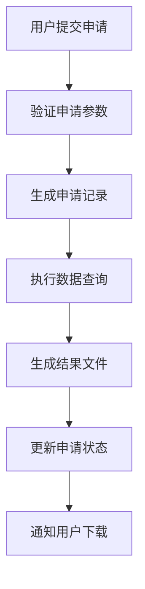
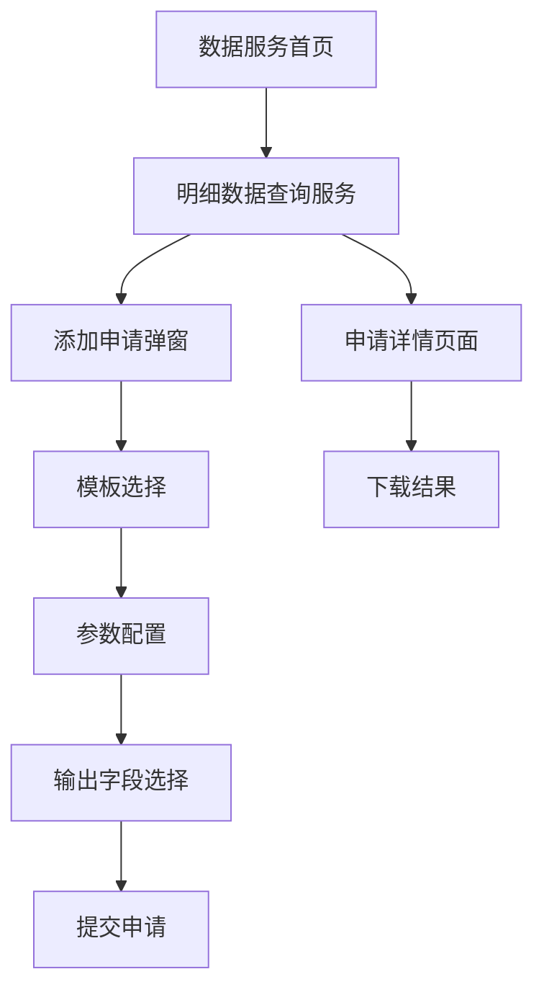

# 明细数据查询服务需求文档

## 1. 产品概述

明细数据查询服务是数据社区平台数据服务模块的新增功能，旨在为用户提供便捷的明细数据查询和下载服务。用户可以基于已配置的数据查询管理模型，选择明细数据下载场景的模板，输入查询条件，并获取结构化的数据结果。

该服务解决了用户在数据分析过程中需要获取原始明细数据的需求，提供了标准化的数据查询申请流程和结果管理机制。

## 2. 核心功能

### 2.1 用户角色

| 角色 | 权限说明 | 核心功能 |
|------|----------|----------|
| 数据分析师 | 可申请明细数据查询 | 提交查询申请、查看申请状态、下载结果 |
| 数据管理员 | 可管理查询模板和审核申请 | 配置查询模板、审核申请、监控查询状态 |

### 2.2 功能模块

明细数据查询服务包含以下核心页面：

1. **明细数据查询服务页面**：申请管理、模板选择、参数配置
2. **申请详情页面**：查看申请详情、跟踪处理状态
3. **结果下载页面**：下载查询结果、查看执行日志

### 2.3 页面详情

| 页面名称 | 模块名称 | 功能描述 |
|----------|----------|----------|
| 明细数据查询服务页面 | 申请列表 | 展示用户的查询申请列表，支持状态筛选和搜索 |
| 明细数据查询服务页面 | 添加申请弹窗 | 选择数据模板、配置查询参数、确认输出字段 |
| 明细数据查询服务页面 | 模板选择器 | 筛选并展示明细数据下载场景的数据模型模板 |
| 明细数据查询服务页面 | 参数配置表单 | 根据选择模板动态生成入参配置表单，支持多种数据类型 |
| 明细数据查询服务页面 | 输出字段选择 | 展示模板定义的输出字段，支持用户自定义选择 |
| 明细数据查询服务页面 | 查询配置 | 设置数据量限制、输出格式等查询配置项 |
| 申请详情页面 | 基本信息展示 | 显示申请ID、模板信息、申请时间、处理状态等 |
| 申请详情页面 | 查询条件展示 | 展示用户输入的查询参数和条件 |
| 申请详情页面 | 输出字段展示 | 显示用户选择的输出字段列表 |
| 申请详情页面 | 执行日志 | 展示查询执行过程和结果统计信息 |
| 结果下载页面 | 结果文件列表 | 展示可下载的结果文件，支持多种格式 |
| 结果下载页面 | 下载操作 | 提供文件下载功能，支持CSV、Excel、JSON格式 |

## 3. 核心流程

### 3.1 用户操作流程

1. **进入明细数据查询服务页面** → 查看现有申请列表
2. **点击添加申请** → 打开申请配置弹窗
3. **选择数据模板** → 从明细数据下载场景模板中选择
4. **配置查询参数** → 根据模板入参定义填写查询条件
5. **选择输出字段** → 确认需要输出的数据字段
6. **设置查询配置** → 配置数据量限制和输出格式
7. **提交申请** → 系统生成申请记录并开始处理
8. **跟踪申请状态** → 查看处理进度和状态更新
9. **下载查询结果** → 申请完成后下载结果文件

### 3.2 系统处理流程

### 3.3 页面导航流程

## 4. 用户界面设计

### 4.1 设计风格

- **主色调**：#165DFF（Arco Design 主蓝色）、#F2F3F5（背景灰）
- **辅助色**：#00B42A（成功绿）、#FF7D00（警告橙）、#F53F3F（错误红）
- **按钮样式**：圆角按钮，主要操作使用实心按钮，次要操作使用线框按钮
- **字体**：PingFang SC、Helvetica Neue，主标题16px，正文14px，辅助文字12px
- **布局风格**：卡片式布局，顶部导航，左侧面包屑导航
- **图标风格**：使用Arco Design图标库，线性风格，统一16px尺寸

### 4.2 页面设计概览

| 页面名称 | 模块名称 | UI元素 |
|----------|----------|--------|
| 明细数据查询服务页面 | 页面头部 | 标题"明细数据查询服务"，主色调#165DFF，添加申请按钮使用primary类型 |
| 明细数据查询服务页面 | 申请列表 | 网格布局卡片，每个申请卡片包含模板名称、状态标签、查询条件摘要、操作按钮 |
| 明细数据查询服务页面 | 添加申请卡片 | 虚线边框，居中图标和文字，悬停效果变为主色调边框 |
| 添加申请弹窗 | 模板选择 | 下拉选择器，选项包含模板名称和描述，支持搜索过滤 |
| 添加申请弹窗 | 模板信息展示 | 信息卡片，浅灰背景#F9FAFB，展示模板详细信息 |
| 添加申请弹窗 | 参数配置表单 | 网格布局，每个参数包含标签、输入控件、描述文字，必填项标红星 |
| 添加申请弹窗 | 输出字段选择 | 复选框网格，每个字段包含名称、类型、描述，支持全选/反选 |
| 申请详情页面 | 基本信息 | 描述列表布局，标签宽度80px，值部分使用主色调 |
| 申请详情页面 | 状态标签 | 使用Arco Design标签组件，不同状态对应不同颜色 |

### 4.3 响应式设计

- **桌面优先**：主要针对1200px以上桌面端设计
- **移动适配**：768px以下使用单列布局，卡片堆叠显示
- **触摸优化**：移动端按钮最小点击区域44px，增加触摸反馈

## 5. 技术要求

### 5.1 前端技术栈

- **框架**：Vue 3 (Composition API)
- **UI组件库**：Arco Design Vue
- **状态管理**：Vuex 4
- **路由管理**：Vue Router 4
- **HTTP客户端**：Axios
- **日期处理**：Day.js

### 5.2 数据接口要求

- 复用现有数据查询管理模型API，筛选使用场景为"明细数据下载"的模板
- 新增申请管理API，支持CRUD操作
- 新增查询执行API，支持异步处理和状态跟踪
- 新增结果下载API，支持多种文件格式

### 5.3 性能要求

- 页面首次加载时间 < 2秒
- 申请提交响应时间 < 1秒
- 支持大数据量查询（最大100万条记录）
- 结果文件支持分片下载

## 6. 验收标准

### 6.1 功能验收

- [ ] 能够正确筛选和展示明细数据下载场景的模板
- [ ] 能够根据选择模板动态生成参数配置表单
- [ ] 能够正确验证必填参数和参数格式
- [ ] 能够提交申请并生成申请记录
- [ ] 能够跟踪申请状态并实时更新
- [ ] 能够下载查询结果文件
- [ ] 支持取消待处理的申请

### 6.2 界面验收

- [ ] 界面风格与现有系统保持一致
- [ ] 响应式布局在不同屏幕尺寸下正常显示
- [ ] 交互操作流畅，无明显卡顿
- [ ] 错误提示信息清晰明确
- [ ] 加载状态有明确的视觉反馈

### 6.3 兼容性验收

- [ ] 支持Chrome 90+、Firefox 88+、Safari 14+
- [ ] 移动端支持iOS 14+、Android 10+
- [ ] 与现有数据查询管理模型功能无冲突

## 7. 实施计划

### 7.1 开发阶段

1. **第一阶段**：创建基础页面和路由配置（1天）
2. **第二阶段**：实现模板选择和参数配置功能（2天）
3. **第三阶段**：实现申请管理和状态跟踪功能（2天）
4. **第四阶段**：实现结果下载和界面优化（1天）
5. **第五阶段**：测试和bug修复（1天）

### 7.2 测试计划

- **单元测试**：覆盖核心业务逻辑
- **集成测试**：验证与现有系统的集成
- **用户验收测试**：验证用户体验和功能完整性

### 7.3 上线计划

- **预发布环境验证**：功能和性能测试
- **生产环境部署**：灰度发布，逐步开放用户访问
- **监控和反馈**：收集用户反馈，持续优化

## 8. 风险评估

### 8.1 技术风险

- **数据量过大**：可能导致查询超时，需要实现分页和限制机制
- **并发查询**：可能影响系统性能，需要实现队列管理
- **文件下载**：大文件下载可能失败，需要支持断点续传

### 8.2 业务风险

- **用户体验**：复杂的参数配置可能影响用户使用，需要提供清晰的引导
- **数据安全**：明细数据可能包含敏感信息，需要实现权限控制
- **资源消耗**：频繁的数据查询可能消耗大量系统资源

### 8.3 缓解措施

- 实现查询限制和资源监控机制
- 提供详细的用户操作指南和帮助文档
- 建立数据访问权限和审计机制
- 实现查询缓存和结果复用机制