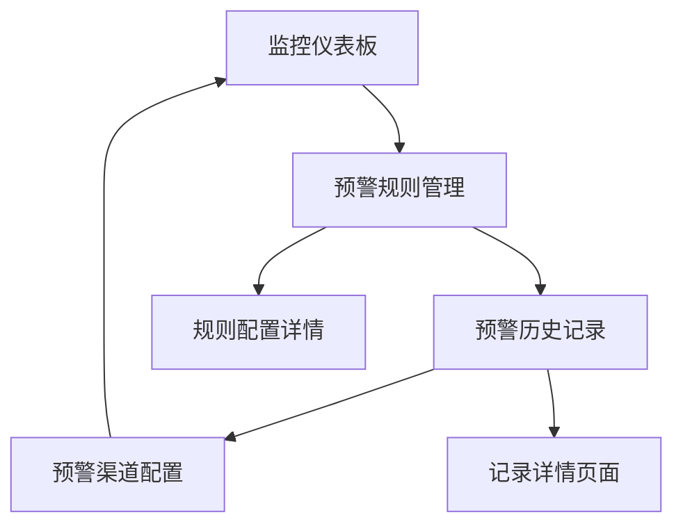

# 权益中心监控预警配置模块 - 产品需求文档

## 1. 产品概述

权益中心监控预警配置模块是一个智能化的监控预警系统，旨在为权益管理提供全方位的实时监控和预警服务。
该模块通过配置化的预警规则，实现对券库存量、券到期时间、券包下发状态等关键业务指标的自动监控，确保权益业务的稳定运行和风险及时发现。
通过该系统，运营人员可以提前发现潜在问题，降低业务风险，提升用户体验和运营效率。

## 2. 核心功能

### 2.1 用户角色

| 角色 | 注册方法 | 核心权限 |
|------|----------|----------|
| 系统管理员 | 内部账号分配 | 可配置所有预警规则，查看所有预警记录，管理预警渠道 |
| 运营管理员 | 内部账号分配 | 可配置业务相关预警规则，查看相关预警记录 |
| 业务人员 | 内部账号分配 | 可查看预警通知，处理预警事件 |

### 2.2 功能模块

我们的监控预警配置系统包含以下核心页面：
1. **预警规则管理页面**：预警规则列表、规则配置表单、规则状态管理
2. **预警历史记录页面**：预警记录列表、记录详情查看、处理状态跟踪
3. **预警渠道配置页面**：通知渠道设置、渠道测试、渠道状态管理
4. **监控仪表板页面**：实时监控数据、预警统计图表、系统健康状态

### 2.3 页面详情

| 页面名称 | 模块名称 | 功能描述 |
|----------|----------|----------|
| 预警规则管理页面 | 规则列表模块 | 展示所有预警规则，支持搜索、筛选、排序功能 |
| 预警规则管理页面 | 规则配置模块 | 创建和编辑预警规则，包括触发条件、预警阈值、通知方式等配置 |
| 预警规则管理页面 | 规则状态管理模块 | 启用/禁用预警规则，查看规则执行状态和统计信息 |
| 预警历史记录页面 | 记录列表模块 | 展示历史预警记录，支持时间范围筛选、状态筛选、关键词搜索 |
| 预警历史记录页面 | 记录详情模块 | 查看预警详细信息，包括触发原因、处理过程、解决方案等 |
| 预警历史记录页面 | 处理跟踪模块 | 跟踪预警处理状态，记录处理人员和处理结果 |
| 预警渠道配置页面 | 渠道设置模块 | 配置邮件、短信、系统通知等预警渠道参数 |
| 预警渠道配置页面 | 渠道测试模块 | 测试各种预警渠道的可用性和有效性 |
| 监控仪表板页面 | 实时监控模块 | 展示券库存、到期券数量、下发失败率等关键指标的实时数据 |
| 监控仪表板页面 | 统计图表模块 | 显示预警趋势图、处理效率统计、系统性能指标等可视化图表 |

## 3. 核心流程

**系统管理员配置预警规则流程**：
系统管理员登录系统 → 进入预警规则管理页面 → 创建新的预警规则 → 设置监控指标和阈值 → 配置预警通知方式 → 启用预警规则 → 系统开始监控

**预警触发和处理流程**：
系统监控检测到异常 → 触发预警规则 → 发送预警通知 → 相关人员接收通知 → 查看预警详情 → 处理预警事件 → 更新处理状态 → 记录处理结果

## 4. 用户界面设计

### 4.1 设计风格

- 主色调：蓝色系（#1890ff）作为主色，红色（#ff4d4f）作为预警色，绿色（#52c41a）作为成功色
- 按钮样式：圆角按钮，主要操作使用实心按钮，次要操作使用线框按钮
- 字体：系统默认字体，标题使用16px，正文使用14px，辅助信息使用12px
- 布局风格：卡片式布局，左侧导航菜单，顶部面包屑导航
- 图标风格：使用Arco Design图标库，线性图标风格，简洁明了

### 4.2 页面设计概览

| 页面名称 | 模块名称 | UI元素 |
|----------|----------|---------|
| 预警规则管理页面 | 规则列表模块 | 搜索框、筛选器、数据表格、分页组件、操作按钮（新建、编辑、删除、启用/禁用） |
| 预警规则管理页面 | 规则配置模块 | 表单组件、下拉选择器、数值输入框、多选框、开关组件、保存/取消按钮 |
| 预警历史记录页面 | 记录列表模块 | 时间选择器、状态筛选器、搜索框、数据表格、状态标签、详情链接 |
| 预警渠道配置页面 | 渠道设置模块 | 标签页组件、配置表单、测试按钮、状态指示器、保存按钮 |
| 监控仪表板页面 | 实时监控模块 | 统计卡片、进度条、状态指示灯、刷新按钮、时间显示 |
| 监控仪表板页面 | 统计图表模块 | 折线图、柱状图、饼图、数据筛选器、图例说明 |

### 4.3 响应式设计

该系统主要面向桌面端使用，采用桌面优先的设计策略，同时考虑平板设备的适配，确保在不同屏幕尺寸下都能提供良好的用户体验。