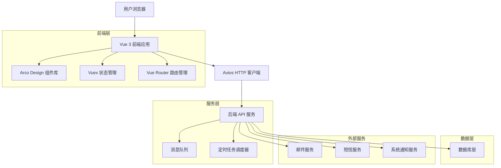
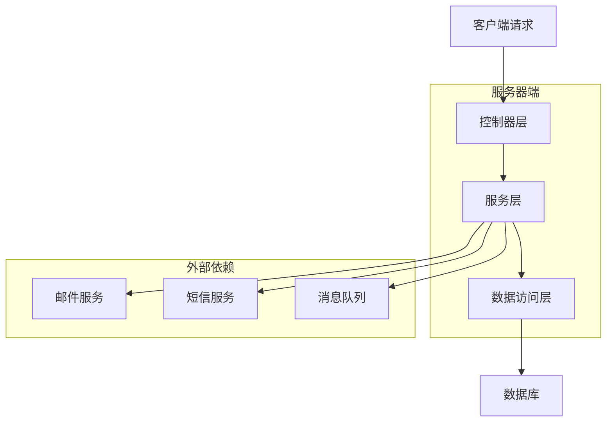
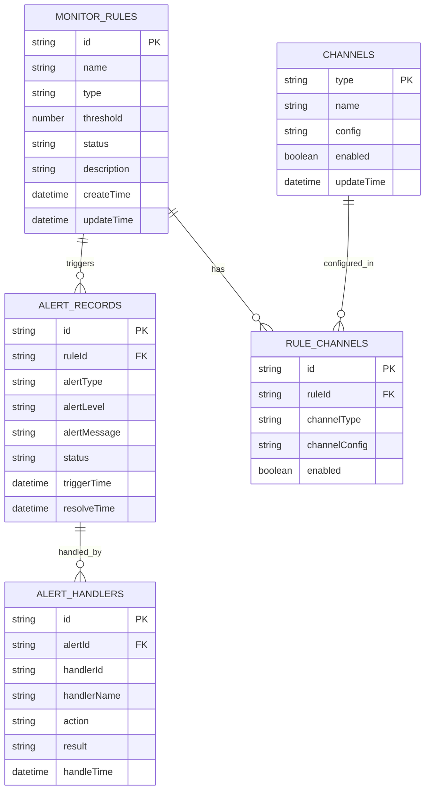

# 权益中心监控预警配置模块 - 技术架构文档

## 1. 架构设计



## 2. 技术描述

- 前端：Vue 3 + Composition API + Arco Design + Vite + TypeScript
- 状态管理：Vuex 4
- 路由管理：Vue Router 4
- HTTP 客户端：Axios
- 后端：Node.js + Express + TypeScript
- 数据库：MySQL + Redis
- 消息队列：Redis
- 定时任务：Node-cron

## 3. 路由定义

| 路由 | 用途 |
|------|------|
| /marketing/global/monitor | 监控预警主页面，显示监控仪表板 |
| /marketing/global/monitor/rules | 预警规则管理页面，支持规则的增删改查 |
| /marketing/global/monitor/history | 预警历史记录页面，查看历史预警信息 |
| /marketing/global/monitor/channels | 预警渠道配置页面，配置通知渠道 |
| /marketing/global/monitor/rules/create | 创建预警规则页面 |
| /marketing/global/monitor/rules/:id/edit | 编辑预警规则页面 |
| /marketing/global/monitor/history/:id | 预警记录详情页面 |

## 4. API 定义

### 4.1 核心 API

**预警规则管理相关**

```
GET /api/monitor/rules
```

获取预警规则列表

请求参数：
| 参数名称 | 参数类型 | 是否必需 | 描述 |
|----------|----------|----------|------|
| page | number | false | 页码，默认为1 |
| pageSize | number | false | 每页数量，默认为10 |
| status | string | false | 规则状态筛选 |
| type | string | false | 预警类型筛选 |

响应数据：
| 参数名称 | 参数类型 | 描述 |
|----------|----------|------|
| success | boolean | 请求是否成功 |
| data | object | 规则列表数据 |
| total | number | 总数量 |

示例：
```json
{
  "success": true,
  "data": {
    "list": [
      {
        "id": "rule_001",
        "name": "券库存低量预警",
        "type": "inventory_low",
        "threshold": 100,
        "status": "active",
        "channels": ["email", "sms"],
        "createTime": "2024-01-01 10:00:00"
      }
    ],
    "total": 50
  }
}
```

```
POST /api/monitor/rules
```

创建预警规则

请求参数：
| 参数名称 | 参数类型 | 是否必需 | 描述 |
|----------|----------|----------|------|
| name | string | true | 规则名称 |
| type | string | true | 预警类型 |
| threshold | number | true | 预警阈值 |
| channels | array | true | 通知渠道列表 |
| description | string | false | 规则描述 |

响应数据：
| 参数名称 | 参数类型 | 描述 |
|----------|----------|------|
| success | boolean | 创建是否成功 |
| data | object | 创建的规则信息 |

**预警历史记录相关**

```
GET /api/monitor/alerts
```

获取预警历史记录

请求参数：
| 参数名称 | 参数类型 | 是否必需 | 描述 |
|----------|----------|----------|------|
| startTime | string | false | 开始时间 |
| endTime | string | false | 结束时间 |
| status | string | false | 处理状态 |
| ruleId | string | false | 规则ID |

响应数据：
| 参数名称 | 参数类型 | 描述 |
|----------|----------|------|
| success | boolean | 请求是否成功 |
| data | array | 预警记录列表 |

**预警渠道配置相关**

```
GET /api/monitor/channels
```

获取预警渠道配置

```
PUT /api/monitor/channels/:type
```

更新预警渠道配置

## 5. 服务器架构图



## 6. 数据模型

### 6.1 数据模型定义



### 6.2 数据定义语言

**预警规则表 (monitor_rules)**
```sql
-- 创建预警规则表
CREATE TABLE monitor_rules (
    id VARCHAR(50) PRIMARY KEY DEFAULT (UUID()),
    name VARCHAR(100) NOT NULL COMMENT '规则名称',
    type VARCHAR(50) NOT NULL COMMENT '预警类型',
    threshold DECIMAL(10,2) NOT NULL COMMENT '预警阈值',
    status VARCHAR(20) DEFAULT 'active' CHECK (status IN ('active', 'inactive')) COMMENT '规则状态',
    description TEXT COMMENT '规则描述',
    create_time TIMESTAMP DEFAULT CURRENT_TIMESTAMP COMMENT '创建时间',
    update_time TIMESTAMP DEFAULT CURRENT_TIMESTAMP ON UPDATE CURRENT_TIMESTAMP COMMENT '更新时间'
);

-- 创建索引
CREATE INDEX idx_monitor_rules_type ON monitor_rules(type);
CREATE INDEX idx_monitor_rules_status ON monitor_rules(status);
CREATE INDEX idx_monitor_rules_create_time ON monitor_rules(create_time DESC);

-- 初始化数据
INSERT INTO monitor_rules (name, type, threshold, description) VALUES
('券库存低量预警', 'inventory_low', 100, '当券库存数量低于100时触发预警'),
('券即将到期预警', 'expiry_warning', 7, '当券距离到期时间少于7天时触发预警'),
('券包下发失败率预警', 'delivery_failure', 0.1, '当券包下发失败率超过10%时触发预警');
```

**预警记录表 (alert_records)**
```sql
-- 创建预警记录表
CREATE TABLE alert_records (
    id VARCHAR(50) PRIMARY KEY DEFAULT (UUID()),
    rule_id VARCHAR(50) NOT NULL COMMENT '规则ID',
    alert_type VARCHAR(50) NOT NULL COMMENT '预警类型',
    alert_level VARCHAR(20) DEFAULT 'medium' CHECK (alert_level IN ('low', 'medium', 'high', 'critical')) COMMENT '预警级别',
    alert_message TEXT NOT NULL COMMENT '预警消息',
    status VARCHAR(20) DEFAULT 'pending' CHECK (status IN ('pending', 'processing', 'resolved', 'ignored')) COMMENT '处理状态',
    trigger_time TIMESTAMP DEFAULT CURRENT_TIMESTAMP COMMENT '触发时间',
    resolve_time TIMESTAMP NULL COMMENT '解决时间',
    FOREIGN KEY (rule_id) REFERENCES monitor_rules(id) ON DELETE CASCADE
);

-- 创建索引
CREATE INDEX idx_alert_records_rule_id ON alert_records(rule_id);
CREATE INDEX idx_alert_records_status ON alert_records(status);
CREATE INDEX idx_alert_records_trigger_time ON alert_records(trigger_time DESC);
CREATE INDEX idx_alert_records_alert_level ON alert_records(alert_level);
```

**预警渠道配置表 (rule_channels)**
```sql
-- 创建预警渠道配置表
CREATE TABLE rule_channels (
    id VARCHAR(50) PRIMARY KEY DEFAULT (UUID()),
    rule_id VARCHAR(50) NOT NULL COMMENT '规则ID',
    channel_type VARCHAR(50) NOT NULL COMMENT '渠道类型',
    channel_config JSON COMMENT '渠道配置',
    enabled BOOLEAN DEFAULT TRUE COMMENT '是否启用',
    FOREIGN KEY (rule_id) REFERENCES monitor_rules(id) ON DELETE CASCADE
);

-- 创建索引
CREATE INDEX idx_rule_channels_rule_id ON rule_channels(rule_id);
CREATE INDEX idx_rule_channels_type ON rule_channels(channel_type);
```

**系统渠道表 (channels)**
```sql
-- 创建系统渠道表
CREATE TABLE channels (
    type VARCHAR(50) PRIMARY KEY COMMENT '渠道类型',
    name VARCHAR(100) NOT NULL COMMENT '渠道名称',
    config JSON COMMENT '渠道配置',
    enabled BOOLEAN DEFAULT TRUE COMMENT '是否启用',
    update_time TIMESTAMP DEFAULT CURRENT_TIMESTAMP ON UPDATE CURRENT_TIMESTAMP COMMENT '更新时间'
);

-- 初始化渠道数据
INSERT INTO channels (type, name, config) VALUES
('email', '邮件通知', '{"smtp_host": "smtp.example.com", "smtp_port": 587}'),
('sms', '短信通知', '{"provider": "aliyun", "template_id": "SMS_001"}'),
('system', '系统通知', '{"enable_popup": true, "enable_badge": true}');
```