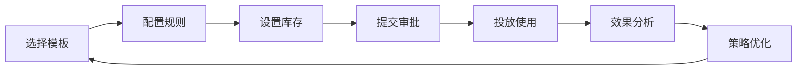

# 权益管理平台产品需求文档

## 1. 产品概述

权益管理平台是数字社区的核心营销模块，专注解决营销权益管理分散、配置复杂、效果难评估三大痛点。平台通过标准化的权益模板、实时库存监控和精准效果分析，为企业提供一站式权益运营解决方案。

平台的核心价值在于将权益配置时间从2天缩短至10分钟，实现零超发风险的库存管控，并提供有据可依的投放策略优化，特别为电销场景提供实时验证和一键发放能力，显著提升营销转化效率。

## 2. 核心功能

### 2.1 用户角色

| 角色 | 注册方式 | 核心权限 |
|------|----------|----------|
| 运营专员 | 企业邮箱注册 | 权益模板创建、库存管理、活动配置 |
| 运营主管 | 管理员分配 | 权益审批、策略制定、效果分析 |
| 电销专员 | 系统分配账号 | 权益查询、客户匹配、一键发放 |
| 数据分析师 | 邀请码注册 | 效果分析、ROI计算、优化建议 |

### 2.2 功能模块

权益管理平台包含以下核心页面：

1. **权益模板管理页面**：模板创建、规则配置、模板复用
2. **权益库存管理页面**：实时库存监控、预警设置、批次管理
3. **权益包管理页面**：权益组合配置、包装策略、批量操作
4. **优惠券管理页面**：券模板设计、库存控制、使用统计
5. **效果分析页面**：ROI计算、转化分析、优化建议
6. **电销支持页面**：客户匹配、权益推荐、快速发放

### 2.3 页面详情

| 页面名称 | 模块名称 | 功能描述 |
|----------|----------|----------|
| 权益模板管理页面 | 模板创建 | 支持免息券、折扣券、满减券等多种模板类型，提供可视化配置界面 |
| 权益模板管理页面 | 规则配置 | 设置使用条件、有效期、叠加规则，支持复杂业务逻辑配置 |
| 权益模板管理页面 | 模板复用 | 一键复制现有模板，快速创建相似权益，避免重复配置 |
| 权益库存管理页面 | 实时监控 | 展示未领取、已领取、已核销状态，支持多维度筛选查看 |
| 权益库存管理页面 | 智能预警 | 设置库存阈值，自动推送预警通知，支持多种通知方式 |
| 权益库存管理页面 | 批次管理 | 支持分批次创建权益，精准控制发放节奏和库存分配 |
| 权益包管理页面 | 组合配置 | 将多个权益打包组合，设置包装策略和使用规则 |
| 权益包管理页面 | 批量操作 | 支持权益包的批量创建、修改、停用等操作 |
| 优惠券管理页面 | 券模板设计 | 创建优惠券模板，设置券面信息、使用规则、有效期等 |
| 优惠券管理页面 | 库存控制 | 管理优惠券库存，监控发放和使用情况 |
| 优惠券管理页面 | 使用统计 | 统计优惠券使用数据，分析使用趋势和效果 |
| 效果分析页面 | ROI计算 | 精确计算每个权益的投入产出比，提供收益分析 |
| 效果分析页面 | 转化分析 | 分析权益使用带来的业务转化，评估营销效果 |
| 效果分析页面 | 优化建议 | 基于数据分析提供权益优化建议和策略调整方案 |
| 电销支持页面 | 客户匹配 | 根据客户信息快速匹配适用权益，提高电销效率 |
| 电销支持页面 | 权益推荐 | 智能推荐最适合的权益组合，提升转化率 |
| 电销支持页面 | 快速发放 | 一键发放权益给客户，简化电销操作流程 |

## 3. 核心流程

### 主要用户操作流程

**运营专员流程**：登录系统 → 选择权益模板 → 配置权益规则 → 设置库存数量 → 提交审批 → 投放使用

**运营主管流程**：登录系统 → 审批权益申请 → 监控库存状态 → 分析权益效果 → 优化投放策略

**电销专员流程**：登录系统 → 输入客户信息 → 查看推荐权益 → 选择合适权益 → 一键发放给客户

## 4. 用户界面设计

### 4.1 设计风格

- **主色调**：#1890FF（品牌蓝）、#52C41A（成功绿）
- **辅助色**：#FAAD14（警告黄）、#F5222D（危险红）
- **按钮样式**：圆角按钮，支持主要、次要、文本等多种类型
- **字体规范**：标题18px/16px，正文14px，说明文字12px
- **布局风格**：卡片式设计，左侧导航，顶部操作栏
- **图标风格**：线性图标，统一使用Arco Design图标系统

### 4.2 页面设计概览

| 页面名称 | 模块名称 | UI元素 |
|----------|----------|--------|
| 权益模板管理页面 | 模板创建 | 表单式配置界面，支持步骤引导，提供模板预览功能 |
| 权益库存管理页面 | 实时监控 | 仪表盘式展示，使用进度条和状态标签，支持颜色编码预警 |
| 权益包管理页面 | 组合配置 | 拖拽式权益组合界面，支持权益卡片拖拽和组合预览 |
| 优惠券管理页面 | 券模板设计 | 可视化券面设计器，支持实时预览和模板保存 |
| 效果分析页面 | ROI计算 | 图表化数据展示，支持时间范围筛选和多维度对比 |
| 电销支持页面 | 客户匹配 | 简洁的搜索界面，快速展示匹配结果，支持一键操作 |

### 4.3 响应式设计

平台主要面向桌面端用户，针对大屏幕操作进行优化。支持平板设备的基础功能访问，电销支持页面特别优化移动端体验，支持手机端的快速查询和发放操作。