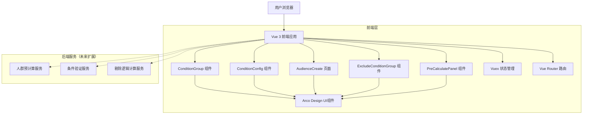
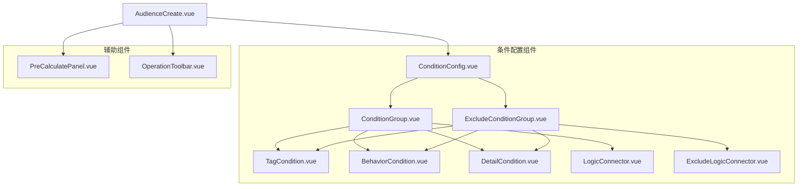
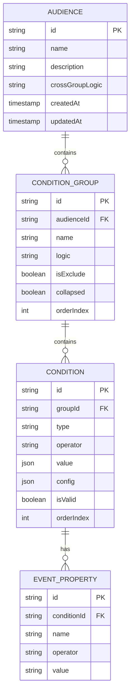

# 条件组配置优化技术架构文档

## 1. 架构设计



## 2. 技术描述

- **前端**: Vue 3 (Composition API) + TypeScript + Vite
- **UI组件库**: Arco Design Vue
- **状态管理**: Vuex 4
- **路由管理**: Vue Router 4
- **构建工具**: Vite
- **开发语言**: TypeScript
- **样式方案**: SCSS + CSS Modules

## 3. 路由定义

| 路由 | 用途 |
|------|------|
| /audience-create | 人群创建页面，包含条件组配置功能 |
| /audience-list | 人群列表页面，展示已创建的人群 |
| /audience-detail/:id | 人群详情页面，查看和编辑人群配置 |
| /condition-template | 条件模板管理页面 |

## 4. 组件架构设计

### 4.1 核心组件层次结构



### 4.2 组件接口定义

#### ConditionGroup 组件接口

```typescript
interface ConditionGroupProps {
  group: ConditionGroup
  editable: boolean
  groupIndex: number
}

interface ConditionGroupEmits {
  'update:group': (group: ConditionGroup) => void
  'delete-group': (groupIndex: number) => void
  'add-condition': (groupIndex: number, type: ConditionType) => void
  'remove-condition': (groupIndex: number, conditionIndex: number) => void
  'toggle-logic': (groupIndex: number) => void
}
```

#### 条件数据结构

```typescript
interface BaseCondition {
  id: string
  type: 'tag' | 'behavior' | 'detail'
  operator: string
  value: any
  isValid: boolean
}

interface TagCondition extends BaseCondition {
  type: 'tag'
  tagPath: string
  tagOperator: string
  tagValue: string
}

interface BehaviorCondition extends BaseCondition {
  type: 'behavior'
  eventName: string
  eventProperties: EventProperty[]
  aggregationType: string
  timeRange: TimeRange
}

interface DetailCondition extends BaseCondition {
  type: 'detail'
  dataSourceType: string
  fieldName: string
  aggregationType: string
  timeRange: TimeRange
}

interface ConditionGroup {
  id: string
  name: string
  logic: 'and' | 'or'
  conditions: (TagCondition | BehaviorCondition | DetailCondition)[]
  isExclude: boolean
  collapsed: boolean
  groupType: 'include' | 'exclude'
  excludeLogic?: 'and' | 'or' // 剔除条件组内部逻辑
}
```

## 5. 状态管理设计

### 5.1 Vuex Store 结构

```typescript
interface AudienceState {
  // 当前编辑的人群配置
  currentAudience: {
    id: string
    name: string
    description: string
    includeConditionGroups: ConditionGroup[] // 包含条件组
    excludeConditionGroups: ConditionGroup[] // 剔除条件组
    crossGroupLogic: 'and' | 'or'
    excludeGroupLogic: 'and' | 'or' // 剔除条件组间逻辑
  }
  
  // 条件配置相关
  conditionConfig: {
    tagOptions: TagOption[]
    eventOptions: EventOption[]
    fieldOptions: FieldOption[]
    operatorOptions: OperatorOption[]
  }
  
  // 预计算统计
  preCalculateStats: {
    totalCount: number
    includeCount: number
    excludeCount: number
    finalCount: number
    loading: boolean
    lastUpdated: Date
    configValid: boolean
    validationErrors: string[]
  }
  
  // 配置验证状态
  validationState: {
    isValid: boolean
    errors: ValidationError[]
    warnings: ValidationWarning[]
  }
}
```

### 5.2 主要 Actions

```typescript
interface AudienceActions {
  // 包含条件组操作
  addIncludeConditionGroup(context: ActionContext, payload: Partial<ConditionGroup>): void
  removeIncludeConditionGroup(context: ActionContext, groupIndex: number): void
  updateIncludeConditionGroup(context: ActionContext, payload: { groupIndex: number, group: ConditionGroup }): void
  
  // 剔除条件组操作
  addExcludeConditionGroup(context: ActionContext, payload: Partial<ConditionGroup>): void
  removeExcludeConditionGroup(context: ActionContext, groupIndex: number): void
  updateExcludeConditionGroup(context: ActionContext, payload: { groupIndex: number, group: ConditionGroup }): void
  
  // 条件操作
  addCondition(context: ActionContext, payload: { groupType: 'include' | 'exclude', groupIndex: number, condition: BaseCondition }): void
  removeCondition(context: ActionContext, payload: { groupType: 'include' | 'exclude', groupIndex: number, conditionIndex: number }): void
  updateCondition(context: ActionContext, payload: { groupType: 'include' | 'exclude', groupIndex: number, conditionIndex: number, condition: BaseCondition }): void
  
  // 预计算功能
  preCalculateAudience(context: ActionContext): Promise<void>
  validateConfiguration(context: ActionContext): Promise<void>
  
  // 逻辑关系操作
  toggleCrossGroupLogic(context: ActionContext): void
  toggleExcludeGroupLogic(context: ActionContext): void
  toggleConditionLogic(context: ActionContext, payload: { groupType: 'include' | 'exclude', groupIndex: number }): void
}
```

## 6. 优化实现方案

### 6.1 组件重构计划

1. **ConditionGroup 组件优化**
   - 重构为更灵活的卡片式布局
   - 支持条件类型分组显示
   - 优化条件添加/删除的交互流程
   - 增加折叠/展开功能

2. **新增 ExcludeConditionGroup 组件**
   - 专门处理剔除条件组的展示和交互
   - 使用红色边框和特殊图标标识
   - 支持剔除逻辑的可视化展示
   - 复用 ConditionGroup 的核心逻辑

3. **新增 LogicConnector 组件**
   - 可视化展示条件间逻辑关系
   - 支持点击切换逻辑操作符
   - 高亮显示逻辑路径

4. **新增 ExcludeLogicConnector 组件**
   - 专门处理剔除条件组的逻辑连接
   - 使用虚线样式区分包含和剔除逻辑
   - 支持剔除逻辑的切换

5. **新增 PreCalculatePanel 组件**
   - 替代实时预览功能
   - 提供预计算按钮和结果展示
   - 显示配置验证信息
   - 展示包含、剔除、最终人群数量

6. **新增 OperationToolbar 组件**
   - 提供快捷操作按钮
   - 支持批量操作
   - 集成预计算功能

### 6.2 剔除逻辑实现策略

1. **数据结构设计**：分离包含和剔除条件组，支持独立的逻辑关系
2. **组件复用**：剔除条件组复用包含条件组的核心逻辑，通过 props 区分类型
3. **可视化标识**：使用不同的样式和图标区分包含和剔除条件组
4. **逻辑计算**：实现包含条件组和剔除条件组的独立计算和最终结果合并

### 6.3 桌面端适配和性能优化策略

#### 6.3.1 桌面端适配
产品专为桌面端设计，采用桌面优先的响应式布局，支持常见桌面分辨率（1920x1080、1440x900、1366x768等），不考虑移动端适配和触摸交互优化。所有交互设计基于鼠标和键盘操作，充分利用桌面端的大屏幕空间和精确操作能力。

#### 6.3.2 性能优化策略

1. **虚拟滚动**：对大量条件的列表使用虚拟滚动，优化桌面端大屏幕显示
2. **懒加载**：条件选项数据按需加载，减少初始加载时间
3. **防抖处理**：鼠标和键盘输入使用防抖，预计算按需触发
4. **组件缓存**：使用 keep-alive 缓存条件配置组件
5. **计算优化**：预计算结果缓存，避免重复计算
6. **桌面端交互优化**：支持键盘快捷键、右键菜单、拖拽等桌面端特有交互

### 6.4 交互优化实现

1. **剔除逻辑可视化**
   ```typescript
   // 剔除条件组样式区分
   const getConditionGroupClass = (groupType: 'include' | 'exclude') => {
     return {
       'condition-group-card': true,
       'condition-group-include': groupType === 'include',
       'condition-group-exclude': groupType === 'exclude'
     }
   }
   
   // 剔除逻辑连接线样式
   const getLogicConnectorStyle = (isExclude: boolean) => {
     return {
       strokeDasharray: isExclude ? '5,5' : 'none',
       stroke: isExclude ? '#f53f3f' : '#1664ff'
     }
   }
   ```

2. **预计算功能**
   ```typescript
   // 预计算逻辑实现
   const preCalculateAudience = async () => {
     try {
       setLoading(true)
       
       // 验证配置
       const validation = await validateConfiguration()
       if (!validation.isValid) {
         setValidationErrors(validation.errors)
         return
       }
       
       // 计算包含条件组结果
       const includeResult = await calculateIncludeConditions()
       
       // 计算剔除条件组结果
       const excludeResult = await calculateExcludeConditions()
       
       // 计算最终结果
       const finalResult = includeResult.count - excludeResult.count
       
       setPreCalculateStats({
         includeCount: includeResult.count,
         excludeCount: excludeResult.count,
         finalCount: Math.max(0, finalResult),
         lastUpdated: new Date()
       })
     } finally {
       setLoading(false)
     }
   }
   ```

3. **桌面端快捷键支持**
   ```typescript
   // 使用 @vueuse/core 的 useMagicKeys 实现桌面端快捷键
   import { useMagicKeys } from '@vueuse/core'
   
   const { ctrl_shift_a, ctrl_shift_e, ctrl_enter, delete: deleteKey } = useMagicKeys()
   
   // 添加包含条件组
   watch(ctrl_shift_a, (pressed) => {
     if (pressed) addIncludeConditionGroup()
   })
   
   // 添加剔除条件组
   watch(ctrl_shift_e, (pressed) => {
     if (pressed) addExcludeConditionGroup()
   })
   
   // 预计算
   watch(ctrl_enter, (pressed) => {
     if (pressed) preCalculateAudience()
   })
   
   // 删除选中条件
   watch(deleteKey, (pressed) => {
     if (pressed && selectedCondition.value) deleteSelectedCondition()
   })
   ```

## 7. 数据模型

### 7.1 数据模型定义



### 7.2 本地存储结构

```typescript
// localStorage 中的数据结构
interface LocalStorageData {
  // 草稿数据
  audienceDrafts: {
    [audienceId: string]: {
      data: AudienceConfig
      lastModified: Date
      autoSave: boolean
    }
  }
  
  // 用户偏好设置
  userPreferences: {
    defaultLogic: 'and' | 'or'
    autoPreview: boolean
    showAdvancedOptions: boolean
    recentlyUsedConditions: BaseCondition[]
  }
  
  // 操作历史
  operationHistory: {
    [audienceId: string]: {
      past: AudienceSnapshot[]
      present: AudienceSnapshot
      future: AudienceSnapshot[]
    }
  }
}
```

## 8. 部署和构建

### 8.1 构建配置优化

```typescript
// vite.config.ts
export default defineConfig({
  build: {
    rollupOptions: {
      output: {
        manualChunks: {
          'condition-components': [
            './src/components/common/ConditionGroup.vue',
            './src/components/common/ConditionConfig.vue'
          ],
          'arco-design': ['@arco-design/web-vue']
        }
      }
    },
    chunkSizeWarningLimit: 1000
  },
  optimizeDeps: {
    include: ['@arco-design/web-vue', '@vueuse/core']
  }
})
```

### 8.2 代码分割策略

1. **路由级别分割**：每个页面单独打包
2. **组件级别分割**：大型组件异步加载
3. **第三方库分割**：UI库和工具库分别打包

## 9. TDD测试驱动开发策略

### 9.1 测试优先开发流程

1. **红-绿-重构循环**
   - 红：编写失败的测试用例
   - 绿：编写最少代码使测试通过
   - 重构：优化代码结构，保持测试通过

2. **测试分层策略**
   - 单元测试：组件和函数级别
   - 集成测试：组件间交互
   - 端到端测试：完整用户流程

### 9.2 核心功能测试用例

#### 9.2.1 剔除逻辑测试用例

```typescript
// 测试用例：剔除条件组创建
describe('ExcludeConditionGroup', () => {
  test('应该能够创建剔除条件组', () => {
    // 测试剔除条件组的创建逻辑
  })
  
  test('剔除条件组应该有红色边框样式', () => {
    // 测试样式区分逻辑
  })
  
  test('剔除逻辑连接线应该是虚线样式', () => {
    // 测试连接线样式
  })
})

// 测试用例：剔除逻辑计算
describe('ExcludeLogicCalculation', () => {
  test('应该正确计算包含条件组人群数量', () => {
    // 测试包含条件组计算
  })
  
  test('应该正确计算剔除条件组人群数量', () => {
    // 测试剔除条件组计算
  })
  
  test('应该正确计算最终人群数量（包含-剔除）', () => {
    // 测试最终结果计算
  })
})
```

#### 9.2.2 预计算功能测试用例

```typescript
// 测试用例：预计算面板
describe('PreCalculatePanel', () => {
  test('应该能够触发预计算', () => {
    // 测试预计算按钮功能
  })
  
  test('应该显示配置验证错误', () => {
    // 测试配置验证逻辑
  })
  
  test('应该显示包含、剔除、最终人群数量', () => {
    // 测试结果展示
  })
})

// 测试用例：配置验证
describe('ConfigurationValidation', () => {
  test('空条件组应该返回验证错误', () => {
    // 测试空配置验证
  })
  
  test('不完整条件应该返回验证错误', () => {
    // 测试不完整配置验证
  })
  
  test('有效配置应该通过验证', () => {
    // 测试有效配置验证
  })
})
```

#### 9.2.3 逻辑关系测试用例

```typescript
// 测试用例：逻辑关系切换
describe('LogicRelationship', () => {
  test('应该能够切换条件内逻辑关系（且/或）', () => {
    // 测试条件内逻辑切换
  })
  
  test('应该能够切换条件组间逻辑关系', () => {
    // 测试条件组间逻辑切换
  })
  
  test('应该能够切换剔除条件组逻辑关系', () => {
    // 测试剔除逻辑切换
  })
})
```

### 9.3 组件级测试策略

#### 9.3.1 ConditionGroup 组件测试

```typescript
describe('ConditionGroup Component', () => {
  test('应该渲染标签条件配置', () => {})
  test('应该渲染事件条件配置', () => {})
  test('应该渲染明细数据条件配置', () => {})
  test('应该支持条件的添加和删除', () => {})
  test('应该支持条件组名称编辑', () => {})
  test('应该支持折叠/展开功能', () => {})
})
```

#### 9.3.2 ExcludeConditionGroup 组件测试

```typescript
describe('ExcludeConditionGroup Component', () => {
  test('应该继承 ConditionGroup 的所有功能', () => {})
  test('应该有剔除条件组的特殊样式', () => {})
  test('应该显示剔除条件组图标', () => {})
  test('应该支持剔除逻辑配置', () => {})
})
```

### 9.4 集成测试策略

1. **组件间交互测试**
   - 条件组与逻辑连接器的联动
   - 包含和剔除条件组的协同工作
   - 预计算面板与条件配置的数据同步

2. **状态管理测试**
   - Vuex store 的状态变更
   - 组件间的数据传递
   - 异步操作的状态处理

### 9.5 端到端测试策略

1. **完整用户流程测试**
   - 创建包含条件组的完整流程
   - 创建剔除条件组的完整流程
   - 预计算和结果查看的完整流程

2. **性能测试**
   - 大量条件组的渲染性能
   - 预计算的响应时间
   - 内存使用情况监控

## 10. TDD实施步骤

### 10.1 TDD开发流程

#### 阶段1：测试用例设计（1周）

**Day 1-2：核心功能测试用例设计**
```typescript
// 1. 剔除逻辑测试用例
// 2. 预计算功能测试用例
// 3. 逻辑关系测试用例
// 4. 配置验证测试用例
```

**Day 3-4：组件级测试用例设计**
```typescript
// 1. ConditionGroup 组件测试
// 2. ExcludeConditionGroup 组件测试
// 3. LogicConnector 组件测试
// 4. PreCalculatePanel 组件测试
```

**Day 5：集成测试用例设计**
```typescript
// 1. 组件间交互测试
// 2. 状态管理测试
// 3. API集成测试
```

#### 阶段2：基础功能开发（2周）

**第1周：剔除逻辑实现**
- Day 1：编写剔除条件组创建测试 → 实现创建功能
- Day 2：编写剔除逻辑计算测试 → 实现计算逻辑
- Day 3：编写剔除样式区分测试 → 实现样式区分
- Day 4：编写剔除连接线测试 → 实现连接线样式
- Day 5：重构和优化剔除逻辑代码

**第2周：预计算功能实现**
- Day 1：编写预计算面板测试 → 实现面板组件
- Day 2：编写配置验证测试 → 实现验证逻辑
- Day 3：编写预计算逻辑测试 → 实现计算逻辑
- Day 4：编写结果展示测试 → 实现结果展示
- Day 5：重构和优化预计算代码

#### 阶段3：交互优化开发（1.5周）

**第1周：逻辑关系优化**
- Day 1-2：编写逻辑切换测试 → 实现逻辑切换功能
- Day 3-4：编写连接线展示测试 → 实现连接线可视化
- Day 5：编写快捷键测试 → 实现快捷键支持

**第2周前半：界面优化**
- Day 1-2：编写折叠展开测试 → 实现折叠展开功能
- Day 3：编写响应式布局测试 → 实现响应式设计

#### 阶段4：集成测试和优化（1周）

**Day 1-2：集成测试实现**
- 组件间交互测试实现
- 状态管理测试实现
- API集成测试实现

**Day 3-4：端到端测试**
- 完整用户流程测试
- 性能测试实现
- 错误处理测试

**Day 5：代码重构和优化**
- 代码质量优化
- 性能调优
- 文档完善

### 10.2 开发环境配置

#### 测试环境配置
```bash
# 安装测试依赖
npm install --save-dev @vue/test-utils vitest jsdom
npm install --save-dev @testing-library/vue @testing-library/jest-dom
npm install --save-dev cypress @cypress/vue

# 配置测试脚本
# package.json
{
  "scripts": {
    "test:unit": "vitest",
    "test:e2e": "cypress open",
    "test:coverage": "vitest --coverage"
  }
}
```

#### 代码质量工具配置
```bash
# ESLint + Prettier 配置
npm install --save-dev eslint prettier eslint-plugin-vue
npm install --save-dev @typescript-eslint/parser @typescript-eslint/eslint-plugin

# Husky + lint-staged 配置
npm install --save-dev husky lint-staged
```

### 10.3 质量保证措施

#### 代码质量标准
1. **测试覆盖率**：单元测试覆盖率 ≥ 90%
2. **代码审查**：所有PR必须经过代码审查
3. **自动化检查**：ESLint + Prettier + TypeScript检查
4. **性能标准**：页面加载时间 < 2s，交互响应时间 < 100ms

#### 持续集成流程
```yaml
# .github/workflows/ci.yml
name: CI
on: [push, pull_request]
jobs:
  test:
    runs-on: ubuntu-latest
    steps:
      - uses: actions/checkout@v2
      - name: Setup Node.js
        uses: actions/setup-node@v2
        with:
          node-version: '18'
      - name: Install dependencies
        run: npm ci
      - name: Run linting
        run: npm run lint
      - name: Run unit tests
        run: npm run test:unit
      - name: Run e2e tests
        run: npm run test:e2e:headless
      - name: Upload coverage
        uses: codecov/codecov-action@v1
```

### 10.4 里程碑和交付物

#### 里程碑1：测试用例完成（第1周末）
**交付物：**
- 完整的测试用例套件
- 测试环境配置
- CI/CD流程配置

#### 里程碑2：剔除逻辑完成（第3周末）
**交付物：**
- ExcludeConditionGroup 组件
- 剔除逻辑计算功能
- 相关单元测试

#### 里程碑3：预计算功能完成（第4周末）
**交付物：**
- PreCalculatePanel 组件
- 配置验证功能
- 预计算逻辑实现

#### 里程碑4：交互优化完成（第5.5周末）
**交付物：**
- 逻辑关系可视化
- 快捷键支持
- 界面优化

#### 里程碑5：项目完成（第6.5周末）
**交付物：**
- 完整功能实现
- 集成测试通过
- 性能优化完成
- 文档完善

### 10.5 风险评估和应对策略

#### 技术风险
1. **剔除逻辑复杂性**
   - 风险：剔除逻辑计算可能比预期复杂
   - 应对：提前进行技术调研，制定备选方案

2. **性能风险**
   - 风险：大量条件组可能导致性能问题
   - 应对：实施虚拟滚动和懒加载策略

#### 进度风险
1. **测试用例设计时间**
   - 风险：测试用例设计可能超出预期时间
   - 应对：优先设计核心功能测试，次要功能可后续补充

2. **集成复杂性**
   - 风险：组件集成可能遇到意外问题
   - 应对：每日集成，及时发现和解决问题