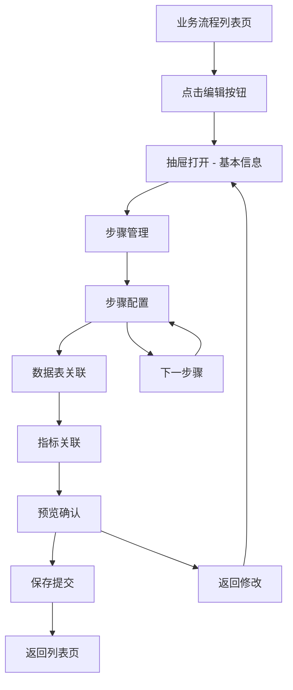
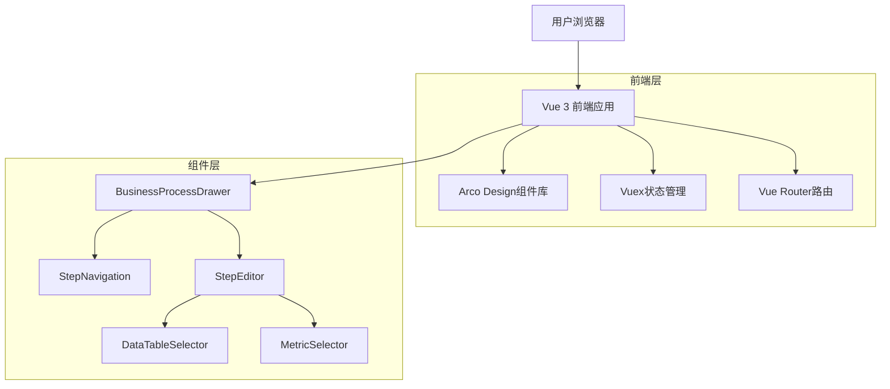
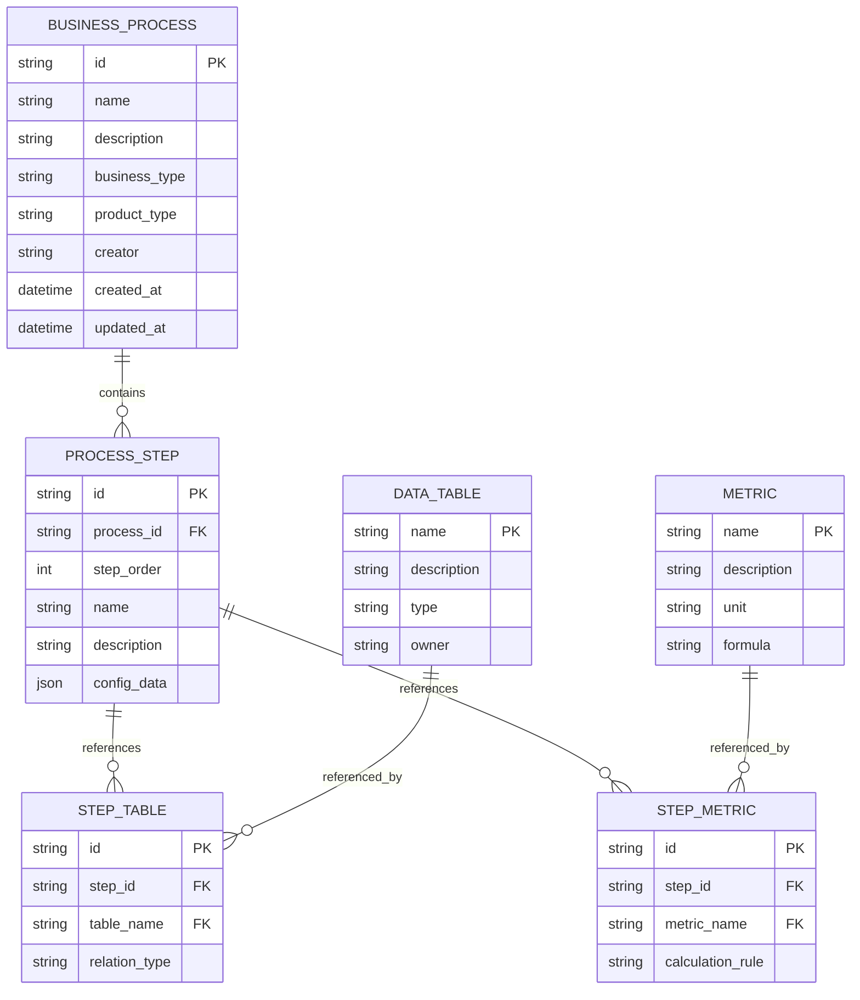

# 核心业务流程编辑功能优化方案

## 1. 产品概述

本方案旨在优化data-map页面中核心业务流程的编辑功能，将现有的弹窗(Modal)编辑方式改为抽屉(Drawer)方式，并支持分步骤编辑提交，提升用户编辑体验和操作效率。

## 2. 核心功能

### 2.1 用户角色

| 角色    | 权限说明       | 核心功能           |
| ----- | ---------- | -------------- |
| 业务分析师 | 可创建和编辑业务流程 | 流程设计、步骤配置、数据关联 |
| 数据管理员 | 可管理所有业务流程  | 流程审核、权限管理、数据维护 |
| 普通用户  | 只能查看业务流程   | 流程浏览、数据查询      |

### 2.2 功能模块

优化后的核心业务流程编辑功能包含以下主要页面：

1. **业务流程列表页**: 流程展示、筛选搜索、操作入口
2. **抽屉式编辑器**: 分步骤编辑界面、实时预览、进度跟踪
3. **步骤配置页**: 单步骤详细配置、数据关联、指标设置

### 2.3 页面详情

| 页面名称    | 模块名称   | 功能描述             |
| ------- | ------ | ---------------- |
| 业务流程列表页 | 流程展示区  | 展示现有业务流程，支持筛选和搜索 |
| 业务流程列表页 | 操作工具栏  | 新建流程、批量操作、导入导出功能 |
| 抽屉式编辑器  | 步骤导航   | 显示编辑进度，支持步骤间跳转   |
| 抽屉式编辑器  | 基本信息配置 | 设置流程名称、业务产品、描述信息 |
| 抽屉式编辑器  | 步骤编辑区  | 当前步骤的详细配置界面      |
| 抽屉式编辑器  | 预览面板   | 实时预览流程结构和配置结果    |
| 步骤配置页   | 数据表关联  | 选择和配置相关数据表       |
| 步骤配置页   | 指标关联   | 选择和配置相关业务指标      |
| 步骤配置页   | 规则设置   | 配置步骤执行规则和条件      |

## 3. 核心流程

### 3.1 分步骤编辑流程

用户进行业务流程编辑的主要操作流程：

1. **进入编辑**: 从流程列表点击编辑按钮，打开右侧抽屉
2. **基本信息**: 配置流程基本信息（业务产品、名称、描述）
3. **步骤管理**: 添加、删除、排序业务步骤
4. **步骤配置**: 逐个配置每个步骤的详细信息
5. **数据关联**: 为每个步骤关联相关数据表和指标
6. **预览确认**: 查看完整流程配置，确认无误
7. **保存提交**: 分步保存或整体提交配置

### 3.2 页面导航流程图



## 4. 用户界面设计

### 4.1 设计风格

* **主色调**: 使用Arco Design的主题色 `#165DFF`（蓝色）和 `#00B42A`（绿色）

* **按钮样式**: 圆角按钮，主要操作使用实心按钮，次要操作使用线框按钮

* **字体**: 主标题使用16px加粗，正文使用14px常规，辅助信息使用12px

* **布局风格**: 左右分栏布局，左侧为步骤导航，右侧为内容编辑区

* **图标风格**: 使用Arco Design图标库，保持一致的视觉风格

### 4.2 页面设计概览

| 页面名称    | 模块名称 | UI元素                    |
| ------- | ---- | ----------------------- |
| 业务流程列表页 | 工具栏  | 搜索框、筛选器、新建按钮，背景色#F7F8FA |
| 业务流程列表页 | 流程卡片 | 卡片式布局，圆角8px，阴影效果，悬停高亮   |
| 抽屉式编辑器  | 抽屉头部 | 标题、关闭按钮、进度指示器，高度60px    |
| 抽屉式编辑器  | 步骤导航 | 垂直步骤条，当前步骤高亮显示，宽度200px  |
| 抽屉式编辑器  | 编辑区域 | 表单组件、选择器、预览面板，自适应宽度     |
| 抽屉式编辑器  | 底部操作 | 上一步、下一步、保存、取消按钮，固定底部    |

### 4.3 响应式设计

* **桌面端优先**: 主要针对1920x1080及以上分辨率优化

* **抽屉宽度**: 最小宽度800px，最大宽度1200px，根据屏幕尺寸自适应

* **移动端适配**: 在小屏幕设备上抽屉改为全屏模式

## 5. 技术架构设计

### 5.1 架构设计



### 5.2 技术描述

* **前端**: Vue 3 (Composition API) + TypeScript + Arco Design

* **状态管理**: Vuex 4 用于管理编辑状态和数据缓存

* **路由**: Vue Router 4 处理页面导航

* **构建工具**: Vite 提供快速开发和构建

### 5.3 路由定义

| 路由                              | 用途              |
| ------------------------------- | --------------- |
| /discovery/data-map             | 数据地图主页，包含业务流程列表 |
| /discovery/data-map/process/:id | 业务流程详情页（可选）     |

### 5.4 API定义

#### 4.1 核心API

业务流程管理相关接口：

```
GET /api/business-process/list
```

请求参数:

| 参数名          | 参数类型   | 是否必需  | 描述        |
| ------------ | ------ | ----- | --------- |
| page         | number | false | 页码，默认1    |
| pageSize     | number | false | 每页数量，默认10 |
| keyword      | string | false | 搜索关键词     |
| businessType | string | false | 业务类型筛选    |

响应数据:

| 参数名     | 参数类型    | 描述       |
| ------- | ------- | -------- |
| success | boolean | 请求是否成功   |
| data    | object  | 业务流程列表数据 |
| total   | number  | 总数量      |

```
POST /api/business-process/save-step
```

请求参数:

| 参数名       | 参数类型   | 是否必需 | 描述     |
| --------- | ------ | ---- | ------ |
| processId | string | true | 流程ID   |
| stepIndex | number | true | 步骤索引   |
| stepData  | object | true | 步骤配置数据 |

示例请求:

```json
{
  "processId": "process_001",
  "stepIndex": 0,
  "stepData": {
    "name": "用户注册",
    "description": "用户注册流程",
    "tables": ["user_register", "user_device"],
    "metrics": ["日注册量", "渠道转化率"]
  }
}
```

### 5.5 数据模型

#### 5.1 数据模型定义



#### 5.2 数据定义语言

业务流程表 (business\_process)

```sql
-- 创建业务流程表
CREATE TABLE business_process (
    id VARCHAR(50) PRIMARY KEY,
    name VARCHAR(200) NOT NULL,
    description TEXT,
    business_type VARCHAR(50) NOT NULL,
    product_type VARCHAR(50) NOT NULL,
    creator VARCHAR(100) NOT NULL,
    created_at TIMESTAMP DEFAULT CURRENT_TIMESTAMP,
    updated_at TIMESTAMP DEFAULT CURRENT_TIMESTAMP ON UPDATE CURRENT_TIMESTAMP
);

-- 创建流程步骤表
CREATE TABLE process_step (
    id VARCHAR(50) PRIMARY KEY,
    process_id VARCHAR(50) NOT NULL,
    step_order INT NOT NULL,
    name VARCHAR(200) NOT NULL,
    description TEXT,
    config_data JSON,
    FOREIGN KEY (process_id) REFERENCES business_process(id) ON DELETE CASCADE
);

-- 创建索引
CREATE INDEX idx_process_step_process_id ON process_step(process_id);
CREATE INDEX idx_process_step_order ON process_step(process_id, step_order);
CREATE INDEX idx_business_process_type ON business_process(business_type, product_type);

-- 初始化数据
INSERT INTO business_process (id, name, description, business_type, product_type, creator)
VALUES 
('process_001', '个人贷款申请流程', '个人贷款从申请到放款的完整业务流程', 'self', 'personal', '系统管理员'),
('process_002', '企业贷款审批流程', '企业贷款审批和风控流程', 'self', 'business', '系统管理员');
```

## 6. 实施计划

### 6.1 开发阶段

**第一阶段：基础架构搭建（1-2天）**

* 创建抽屉组件基础结构

* 实现步骤导航组件

* 搭建状态管理架构

**第二阶段：核心功能开发（3-4天）**

* 实现分步骤编辑逻辑

* 开发数据表和指标选择器

* 实现自动保存功能

**第三阶段：用户体验优化（2-3天）**

* 添加加载状态和错误处理

* 实现预览功能

* 优化交互动画和反馈

**第四阶段：测试和优化（1-2天）**

* 功能测试和bug修复

* 性能优化

* 用户体验测试

### 6.2 技术风险评估

* **状态管理复杂性**: 分步骤编辑需要复杂的状态管理，需要仔细设计数据流

* **数据一致性**: 自动保存和手动保存的数据一致性需要特别注意

* **性能问题**: 大量数据表和指标的选择可能影响性能，需要实现虚拟滚动

### 6.3 用户体验改进点

1. **渐进式引导**: 为新用户提供操作引导
2. **智能推荐**: 根据业务类型推荐相关数据表和指标
3. **快捷操作**: 支持键盘快捷键和批量操作
4. **实时验证**: 配置过程中实时验证数据有效性
5. **历史记录**: 保存编辑历史，支持撤销和重做操作

