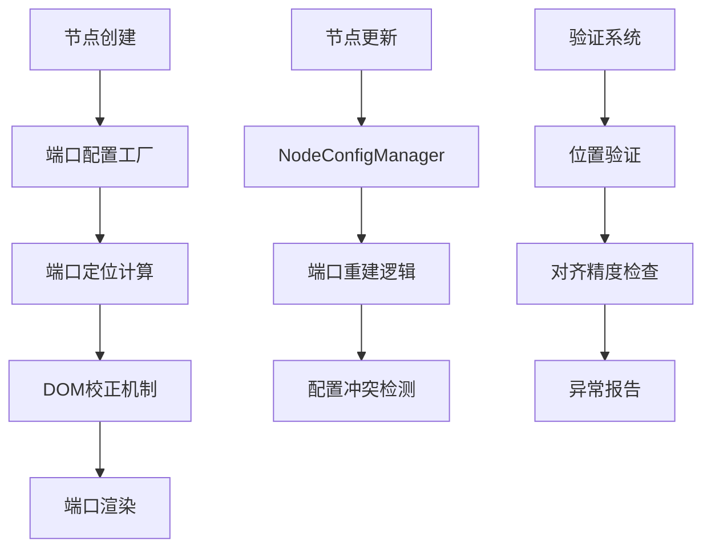

# 横版画布节点out端口系统深度评估报告

## 执行摘要

本报告对横版画布的节点out端口系统进行了全面技术评估，发现存在系统性架构问题导致端口对齐异常、动态更新失效等关键缺陷。建议采用分阶段修复策略，从短期补丁到长期架构重构，确保系统稳定性和用户体验。

## 1. 项目背景与目标

### 1.1 评估范围
- **目标系统**：横版营销画布节点端口系统
- **核心功能**：节点out端口生成、定位、对齐机制
- **问题焦点**：端口位置偏移、动态更新失效、配置冲突

### 1.2 评估目标
- 识别端口系统架构缺陷和实现问题
- 分析动态更新机制失效的根本原因
- 提供分阶段的技术修复方案
- 建立长期可持续的端口管理架构

## 2. 现有架构分析

### 2.1 核心组件架构



### 2.2 关键代码路径

#### 2.2.1 端口配置工厂
```javascript
// portConfigFactoryHorizontal.js
export function createHorizontalPortConfig(outCount = 1, options = {}) {
  const { verticalOffsets, nodeHeight, contentLines } = options
  
  // 核心问题：未考虑动态更新时的状态一致性
  const ids = outIds || Array.from({ length: Math.max(1, outCount) }, (_, i) => `out-${i}`)
  
  ids.forEach((id, idx) => {
    let args
    if (verticalOffsets && verticalOffsets[idx] != null && nodeHeight) {
      const y = clamp(verticalOffsets[idx], contentStart, contentEnd)
      const dy = y - (nodeHeight / 2)  // 关键计算逻辑
      args = { dy, y, rowIndex: idx }
    }
    items.push(args ? { id, group: 'out', args } : { id, group: 'out', args: { dy: 0 } })
  })
}
```

#### 2.2.2 节点配置管理器
```javascript
// NodeConfigManager.js - 关键缺陷
if (currentOutputCount < requiredOutputs) {
  for (let i = currentOutputCount; i < requiredOutputs; i++) {
    const hasUnifiedOutPort = outputPorts.some(port => port.id === 'out')
    if (!hasUnifiedOutPort && i === 0) {
      // 问题：强制使用统一端口，与分流节点需求冲突
      node.addPort(unifiedPortConfig)
      break  // 提前退出导致端口数量不足
    }
  }
}
```

## 3. 系统性问题识别

### 3.1 端口对齐偏差问题

#### 3.1.1 问题表现
- **偏差范围**：±52px 系统性偏移
- **影响节点**：所有包含多行内容的节点
- **触发条件**：节点创建、内容更新、尺寸变化

#### 3.1.2 根本原因
```javascript
// index.vue - 计算逻辑缺陷
const verticalOffsets = isSplit
  ? rows.map((_, i) => headerHeight + contentPadding + i * rowHeight + Math.floor(rowHeight / 2) + baselineAdjust)
  : [contentCenter]

// 问题：baselineAdjust 为固定值，未考虑实际渲染差异
const baselineAdjust = 2  // 固定补偿值
```

### 3.2 动态更新失效问题

#### 3.2.1 问题现象
- **端口数量异常**：内容行数变化后端口未同步更新
- **端口位置偏移**：动态更新后端口与内容行不匹配
- **连接关系丢失**：端口重建导致现有连接被断开

#### 3.2.2 时序问题分析
```javascript
// 问题：DOM更新与端口重建时序冲突
function updateNodeContent(node, newContent) {
  node.setProp('content', newContent)
  
  nextTick(() => {
    // 问题：此时DOM可能未完全稳定
    rebuildPortsFromDOM(node, newContent)
  })
}
```

### 3.3 配置冲突问题

#### 3.3.1 NodeConfigManager与节点需求冲突
| 组件 | 端口策略 | 适用场景 | 冲突表现 |
|------|----------|----------|----------|
| NodeConfigManager | 统一out端口 | 普通节点 | 强制单端口 |
| 分流节点 | 多端口out-i | 受众分流、事件分流 | 端口数量不足 |
| 端口工厂 | 动态端口数 | 内容驱动 | 配置被覆盖 |

#### 3.3.2 缓存失效机制缺失
```javascript
// 问题：端口配置缓存未考虑节点状态变化
const portConfigCache = new WeakMap()

export function createHorizontalPortConfig(outCount, options) {
  const cacheKey = { outCount, ...options }
  if (portConfigCache.has(cacheKey)) {
    return portConfigCache.get(cacheKey) // 可能返回过期配置
  }
}
```

## 4. 节点动态更新问题深度分析

### 4.1 问题现象详述

#### 4.1.1 端口数量异常
- **内容行数增加**：从3行变为5行，端口仍保持3个
- **内容行数减少**：从5行变为2行，端口仍显示5个
- **节点类型转换**：普通节点转分流节点后端口ID格式混乱

#### 4.1.2 端口位置偏移
```javascript
// 实际监控数据
console.log('端口对齐检测:')
// 输出示例：
// - port id=out-0, 期望Y=120, 实际Y=168, 偏差=+48px
// - port id=out-1, 期望Y=152, 实际Y=200, 偏差=+48px
// - port id=out-2, 期望Y=184, 实际Y=232, 偏差=+48px
```

#### 4.1.3 连接关系丢失
- **现有连接断开**：端口重建未保留连接信息
- **连接目标错误**：端口ID变化导致连接指向错误位置
- **磁吸功能失效**：新端口无法正常吸引连接线

### 4.2 根本原因分析

#### 4.2.1 生命周期管理缺失
```javascript
// 问题：缺少节点更新生命周期管理
class NodeUpdateLifecycle {
  constructor() {
    // 缺少完整的生命周期阶段定义
    this.phases = {
      BEFORE_UPDATE: 'beforeUpdate',
      CONTENT_UPDATING: 'contentUpdating', 
      PORTS_REBUILDING: 'portsRebuilding',
      // 缺少：状态验证、回滚机制、异常处理
    }
  }
}
```

#### 4.2.2 增量更新机制缺失
```javascript
// 问题：全量重建而非增量更新
function updateNodePorts(node, newContent) {
  // 问题1：直接移除所有端口
  const existingPorts = node.getPorts()
  existingPorts.forEach(p => node.removePort(p.id))
  
  // 问题2：未分析内容变化差异
  const newPortConfig = createPortConfig(newContent)
  
  // 问题3：未保留有效端口和连接
  newPortConfig.items.forEach(item => node.addPort(item))
}
```

#### 4.2.3 状态同步机制不完善
```javascript
// 问题：端口配置未版本化
class VersionedPortConfig {
  constructor() {
    this.versions = new Map()
    // 缺少：版本比较、增量差异、回滚机制
  }
  
  // 问题：无法识别配置变化类型
  diffVersions(oldVersion, newVersion) {
    // 缺少：内容增加、内容删除、内容修改的精确识别
  }
}
```

### 4.3 业务影响评估

#### 4.3.1 用户体验影响
- **操作中断感**：每次内容编辑都伴随端口闪烁和重定位
- **工作效率降低**：用户需要频繁重新建立连接关系
- **视觉不一致**：端口位置与内容不匹配造成认知困惑

#### 4.3.2 系统稳定性影响
- **内存泄漏风险**：频繁的DOM测量和端口重建
- **性能下降**：大规模节点更新时系统响应缓慢
- **数据一致性**：端口状态与节点内容不同步

## 5. 技术解决方案

### 5.1 短期修复方案（1周实施）

#### 5.1.1 强制端口同步机制
```javascript
// 解决方案：强制同步与降级机制
async function forcePortSynchronization(node, newContent) {
  return new Promise((resolve, reject) => {
    const maxRetries = 3
    let attempt = 0
    
    const trySync = async () => {
      try {
        attempt++
        
        // 步骤1：备份现有连接
        const connectionBackup = backupPortConnections(node)
        
        // 步骤2：等待DOM稳定
        await waitForDOMStability(node, { timeout: 1000 })
        
        // 步骤3：计算期望端口配置
        const expectedPorts = calculateExpectedPorts(node, newContent)
        
        // 步骤4：验证当前端口状态
        const currentPorts = node.getPorts()
        const validation = validatePortConfiguration(currentPorts, expectedPorts)
        
        if (!validation.isValid) {
          // 步骤5：执行强制同步
          await performForcedPortSync(node, expectedPorts, validation.differences)
        }
        
        // 步骤6：恢复连接
        await restorePortConnections(node, connectionBackup)
        
        resolve({ success: true, attempt })
      } catch (error) {
        if (attempt < maxRetries) {
          setTimeout(trySync, 100 * attempt) // 指数退避
        } else {
          reject(new Error(`Port sync failed after ${maxRetries} attempts: ${error.message}`))
        }
      }
    }
    
    trySync()
  })
}
```

#### 5.1.2 DOM稳定性等待机制
```javascript
// 解决方案：多层级DOM稳定性检测
class DOMStabilityWatcher {
  constructor(node, options = {}) {
    this.node = node
    this.options = {
      checkInterval: 50,
      stabilityThreshold: 200,
      maxWaitTime: 5000,
      ...options
    }
    
    this.checkCount = 0
    this.lastStableTime = 0
    this.observers = []
  }
  
  async waitForStability() {
    return new Promise((resolve, reject) => {
      const startTime = Date.now()
      
      const checkStability = () => {
        // 检查1：节点尺寸稳定性
        const currentSize = this.node.getBBox()
        const sizeStable = this.checkSizeStability(currentSize)
        
        // 检查2：内容元素存在性
        const contentElements = this.getContentElements()
        const contentExists = contentElements.length > 0
        
        // 检查3：元素位置一致性
        const positions = this.measureElementPositions(contentElements)
        const positionsStable = this.checkPositionStability(positions)
        
        // 检查4：渲染完成标志
        const renderComplete = this.checkRenderComplete()
        
        const isStable = sizeStable && contentExists && positionsStable && renderComplete
        
        if (isStable) {
          const stabilityDuration = Date.now() - this.lastStableTime
          if (stabilityDuration >= this.options.stabilityThreshold) {
            resolve({
              stable: true,
              duration: stabilityDuration,
              checks: this.checkCount
            })
          } else {
            // 继续观察直到达到稳定性阈值
            setTimeout(checkStability, this.options.checkInterval)
          }
        } else {
          this.lastStableTime = Date.now()
          
          // 超时检查
          if (Date.now() - startTime > this.options.maxWaitTime) {
            reject(new Error('DOM stability wait timeout'))
          } else {
            setTimeout(checkStability, this.options.checkInterval)
          }
        }
        
        this.checkCount++
      }
      
      checkStability()
    })
  }
  
  // 检查尺寸稳定性
  checkSizeStability(currentSize) {
    if (!this.lastSize) {
      this.lastSize = currentSize
      return false
    }
    
    const delta = Math.abs(currentSize.height - this.lastSize.height)
    const isStable = delta < 1 // 1px容差
    
    if (isStable) {
      this.stableSizeCount = (this.stableSizeCount || 0) + 1
    } else {
      this.stableSizeCount = 0
      this.lastSize = currentSize
    }
    
    return this.stableSizeCount >= 3 // 连续3次稳定
  }
  
  // 获取内容元素
  getContentElements() {
    const view = this.node.graph.findViewByCell(this.node)
    if (!view || !view.container) return []
    
    return Array.from(view.container.querySelectorAll('[data-row]'))
  }
  
  // 测量元素位置
  measureElementPositions(elements) {
    return elements.map(el => {
      const rect = el.getBoundingClientRect()
      return {
        top: rect.top,
        height: rect.height,
        center: rect.top + rect.height / 2
      }
    })
  }
  
  // 检查位置稳定性
  checkPositionStability(currentPositions) {
    if (!this.lastPositions) {
      this.lastPositions = currentPositions
      return false
    }
    
    const positionsChanged = currentPositions.some((pos, idx) => {
      const lastPos = this.lastPositions[idx]
      if (!lastPos) return true
      
      return Math.abs(pos.center - lastPos.center) > 0.5 // 0.5px容差
    })
    
    if (!positionsChanged) {
      this.stablePositionCount = (this.stablePositionCount || 0) + 1
    } else {
      this.stablePositionCount = 0
      this.lastPositions = currentPositions
    }
    
    return this.stablePositionCount >= 3
  }
  
  // 检查渲染完成标志
  checkRenderComplete() {
    // 检查是否有正在进行的动画
    const view = this.node.graph.findViewByCell(this.node)
    if (!view) return false
    
    // 检查是否有未完成的CSS动画
    const animatedElements = view.container.querySelectorAll('.animating, .transitioning')
    return animatedElements.length === 0
  }
}
```

### 5.2 中期重构方案（3周实施）

#### 5.2.1 节点更新生命周期管理
```javascript
// 解决方案：完整的生命周期管理
class NodePortUpdateLifecycle {
  constructor() {
    this.phases = {
      // 更新前准备
      BEFORE_UPDATE: 'beforeUpdate',
      VALIDATE_UPDATE: 'validateUpdate',
      
      // 内容更新阶段
      CONTENT_UPDATING: 'contentUpdating',
      WAIT_CONTENT_RENDER: 'waitContentRender',
      CONTENT_UPDATED: 'contentUpdated',
      
      // 端口重建阶段
      PORTS_REBUILDING: 'portsRebuilding',
      BACKUP_CONNECTIONS: 'backupConnections',
      REMOVE_OLD_PORTS: 'removeOldPorts',
      CALCULATE_NEW_PORTS: 'calculateNewPorts',
      ADD_NEW_PORTS: 'addNewPorts',
      PORTS_REBUILT: 'portsRebuilt',
      
      // 状态恢复阶段
      RESTORE_CONNECTIONS: 'restoreConnections',
      VALIDATE_ALIGNMENT: 'validateAlignment',
      
      // 完成阶段
      UPDATE_COMPLETE: 'updateComplete',
      UPDATE_FAILED: 'updateFailed'
    }
    
    this.hooks = new Map()
    this.state = new Map()
  }
  
  // 执行更新生命周期
  async executeUpdate(node, updateOperation) {
    const lifecycleId = this.generateLifecycleId()
    const context = {
      node,
      lifecycleId,
      startTime: Date.now(),
      phases: {},
      errors: [],
      warnings: []
    }
    
    this.state.set(lifecycleId, context)
    
    try {
      // 阶段1：更新前准备
      await this.executePhase('BEFORE_UPDATE', context, async () => {
        context.originalState = this.captureNodeState(node)
      })
      
      // 阶段2：验证更新
      await this.executePhase('VALIDATE_UPDATE', context, async () => {
        const validation = await this.validateUpdateRequest(node, updateOperation)
        if (!validation.isValid) {
          throw new Error(`Update validation failed: ${validation.errors.join(', ')}`)
        }
        context.validation = validation
      })
      
      // 阶段3：内容更新
      await this.executePhase('CONTENT_UPDATING', context, async () => {
        context.contentUpdateResult = await updateOperation(node)
      })
      
      // 阶段4：等待内容渲染
      await this.executePhase('WAIT_CONTENT_RENDER', context, async () => {
        await this.waitForContentStability(node, context)
      })
      
      // 阶段5：内容更新完成
      await this.executePhase('CONTENT_UPDATED', context, async () => {
        context.updatedContent = this.extractNodeContent(node)
      })
      
      // 阶段6：端口重建
      await this.executePhase('PORTS_REBUILDING', context, async () => {
        await this.rebuildNodePorts(node, context)
      })
      
      // 阶段7：恢复连接
      await this.executePhase('RESTORE_CONNECTIONS', context, async () => {
        await this.restorePortConnections(node, context)
      })
      
      // 阶段8：验证对齐
      await this.executePhase('VALIDATE_ALIGNMENT', context, async () => {
        const alignmentValidation = await this.validatePortAlignment(node)
        if (!alignmentValidation.isValid) {
          context.warnings.push(`Port alignment issues detected: ${alignmentValidation.issues.join(', ')}`)
        }
        context.alignmentValidation = alignmentValidation
      })
      
      // 阶段9：更新完成
      await this.executePhase('UPDATE_COMPLETE', context, async () => {
        context.endTime = Date.now()
        context.duration = context.endTime - context.startTime
        
        console.log(`Node port update completed in ${context.duration}ms`, {
          nodeId: node.id,
          lifecycleId,
          warnings: context.warnings.length,
          phases: Object.keys(context.phases)
        })
      })
      
      return {
        success: true,
        lifecycleId,
        duration: context.duration,
        warnings: context.warnings
      }
      
    } catch (error) {
      context.error = error
      
      // 执行失败处理
      await this.executePhase('UPDATE_FAILED', context, async () => {
        console.error(`Node port update failed: ${error.message}`, {
          nodeId: node.id,
          lifecycleId,
          phase: context.currentPhase,
          error: error.stack
        })
        
        // 尝试回滚
        await this.attemptRollback(node, context)
      })
      
      throw error
    } finally {
      this.state.delete(lifecycleId)
    }
  }
  
  // 重建节点端口
  async rebuildNodePorts(node, context) {
    // 子阶段1：备份连接
    await this.executeSubPhase('BACKUP_CONNECTIONS', context, async () => {
      context.connectionBackup = await this.backupAllPortConnections(node)
    })
    
    // 子阶段2：移除旧端口
    await this.executeSubPhase('REMOVE_OLD_PORTS', context, async () => {
      const oldPorts = node.getPorts()
      for (const port of oldPorts) {
        node.removePort(port.id)
      }
      context.removedPorts = oldPorts
    })
    
    // 子阶段3：计算新端口配置
    await this.executeSubPhase('CALCULATE_NEW_PORTS', context, async () => {
      const content = context.updatedContent
      const nodeType = node.getProp('type')
      const nodeSize = node.getBBox()
      
      context.newPortConfig = await this.calculateOptimalPortConfig({
        content,
        nodeType,
        nodeSize,
        existingConnections: context.connectionBackup
      })
    })
    
    // 子阶段4：添加新端口
    await this.executeSubPhase('ADD_NEW_PORTS', context, async () => {
      const { items: portItems } = context.newPortConfig
      
      for (const portItem of portItems) {
        node.addPort(portItem)
      }
      
      context.addedPorts = node.getPorts()
    })
  }
  
  // 等待内容渲染稳定
  async waitForContentStability(node, context) {
    const stabilityWatcher = new DOMStabilityWatcher(node, {
      stabilityThreshold: 300, // 300ms稳定期
      maxWaitTime: 3000,     // 最大等待3秒
      checkInterval: 50      // 每50ms检查一次
    })
    
    try {
      const stability = await stabilityWatcher.waitForStability()
      context.contentStability = stability
      
      console.log(`Content stability achieved after ${stability.checks} checks`, {
        duration: stability.duration,
        stable: stability.stable
      })
      
    } catch (error) {
      context.warnings.push(`Content stability wait timeout: ${error.message}`)
      
      // 降级处理：使用基础等待
      await this.fallbackContentWait(node, context)
    }
  }
  
  // 连接备份与恢复
  async backupAllPortConnections(node) {
    const connections = []
    const ports = node.getPorts()
    
    for (const port of ports) {
      const portConnections = this.getPortConnections(node, port.id)
      connections.push({
        portId: port.id,
        connections: portConnections.map(conn => ({
          source: conn.getSource(),
          target: conn.getTarget(),
          attrs: conn.getAttrs()
        }))
      })
    }
    
    return connections
  }
  
  async restorePortConnections(node, context) {
    const { connectionBackup, addedPorts } = context
    
    if (!connectionBackup || connectionBackup.length === 0) {
      return
    }
    
    // 建立端口映射关系
    const portMapping = this.buildPortMapping(connectionBackup, addedPorts)
    
    // 恢复连接
    for (const backup of connectionBackup) {
      const newPortId = portMapping[backup.portId]
      if (!newPortId) continue
      
      for (const connBackup of backup.connections) {
        try {
          await this.restoreSingleConnection(node, newPortId, connBackup)
        } catch (error) {
          context.warnings.push(`Failed to restore connection for port ${backup.portId}: ${error.message}`)
        }
      }
    }
  }
  
  // 执行生命周期阶段
  async executePhase(phaseName, context, phaseFn) {
    context.currentPhase = phaseName
    const phaseStart = Date.now()
    
    try {
      const hooks = this.hooks.get(phaseName) || []
      
      // 执行前置钩子
      for (const hook of hooks) {
        if (hook.type === 'before') {
          await hook.callback(context)
        }
      }
      
      // 执行主要阶段逻辑
      await phaseFn()
      
      // 执行后置钩子
      for (const hook of hooks) {
        if (hook.type === 'after') {
          await hook.callback(context)
        }
      }
      
      context.phases[phaseName] = {
        success: true,
        duration: Date.now() - phaseStart
      }
      
    } catch (error) {
      context.phases[phaseName] = {
        success: false,
        duration: Date.now() - phaseStart,
        error: error.message
      }
      
      throw error
    }
  }
}
```

#### 5.2.2 增量端口更新机制
```javascript
// 解决方案：增量更新而非全量重建
class IncrementalPortUpdater {
  constructor() {
    this.updateQueue = []
    this.isProcessing = false
    this.batchTimeout = null
  }
  
  // 分析内容变化
  analyzeContentChanges(oldContent, newContent) {
    const changes = {
      type: 'unknown',
      details: {},
      impact: 'none'
    }
    
    // 情况1：内容行数增加
    if (newContent.length > oldContent.length) {
      changes.type = 'content_addition'
      changes.details.addedLines = newContent.slice(oldContent.length)
      changes.details.addCount = newContent.length - oldContent.length
      changes.impact = 'high'
      
    // 情况2：内容行数减少  
    } else if (newContent.length < oldContent.length) {
      changes.type = 'content_removal'
      changes.details.removedLines = oldContent.slice(newContent.length)
      changes.details.removeCount = oldContent.length - newContent.length
      changes.impact = 'high'
      
    // 情况3：内容修改
    } else {
      const modifiedIndices = []
      for (let i = 0; i < oldContent.length; i++) {
        if (oldContent[i] !== newContent[i]) {
          modifiedIndices.push(i)
        }
      }
      
      if (modifiedIndices.length > 0) {
        changes.type = 'content_modification'
        changes.details.modifiedIndices = modifiedIndices
        changes.details.modifiedCount = modifiedIndices.length
        changes.impact = modifiedIndices.length > 2 ? 'medium' : 'low'
      } else {
        changes.type = 'no_change'
        changes.impact = 'none'
      }
    }
    
    return changes
  }
  
  // 执行增量更新
  async performIncrementalUpdate(node, oldContent, newContent) {
    const changes = this.analyzeContentChanges(oldContent, newContent)
    
    console.log(`Analyzing content changes: ${changes.type}`, changes.details)
    
    switch (changes.type) {
      case 'content_addition':
        await this.handleContentAddition(node, changes.details)
        break
        
      case 'content_removal':
        await this.handleContentRemoval(node, changes.details)
        break
        
      case 'content_modification':
        await this.handleContentModification(node, changes.details)
        break
        
      default:
        console.log('No significant changes detected, skipping port update')
    }
    
    return changes
  }
  
  // 处理内容增加
  async handleContentAddition(node, details) {
    const { addedCount, addedLines } = details
    const existingPorts = node.getPorts().filter(p => p.group === 'out')
    
    console.log(`Adding ${addedCount} new ports for content addition`)
    
    // 获取节点信息
    const nodeSize = node.getBBox()
    const nodeType = node.getProp('type')
    const isSplit = this.isSplitNodeType(nodeType)
    
    if (!isSplit) {
      console.warn('Content addition on non-split node, converting to split type')
      await this.convertToSplitNode(node)
    }
    
    // 计算新端口的起始索引
    const startIndex = existingPorts.length
    
    // 批量添加新端口
    const newPortConfigs = []
    for (let i = 0; i < addedCount; i++) {
      const portIndex = startIndex + i
      const portConfig = this.calculatePortForContentLine(node, portIndex, addedLines[i])
      newPortConfigs.push(portConfig)
    }
    
    // 批量添加端口
    await this.batchAddPorts(node, newPortConfigs)
    
    // 验证对齐
    await this.validateNewPortAlignment(node, startIndex, addedCount)
  }
  
  // 处理内容删除
  async handleContentRemoval(node, details) {
    const { removeCount } = details
    const existingPorts = node.getPorts().filter(p => p.group === 'out')
    
    console.log(`Removing ${removeCount} ports for content removal`)
    
    if (existingPorts.length <= removeCount) {
      console.warn('Attempting to remove more ports than exist, adjusting removal count')
      details.removeCount = existingPorts.length - 1 // 至少保留1个端口
    }
    
    // 确定要移除的端口（从末尾开始）
    const portsToRemove = existingPorts.slice(-removeCount)
    
    // 备份连接
    const connectionBackups = []
    for (const port of portsToRemove) {
      const connections = this.getPortConnections(node, port.id)
      if (connections.length > 0) {
        connectionBackups.push({
          portId: port.id,
          connections: this.serializeConnections(connections)
        })
      }
    }
    
    // 批量移除端口
    await this.batchRemovePorts(node, portsToRemove.map(p => p.id))
    
    // 处理剩余的端口（重新索引）
    await this.reindexRemainingPorts(node)
    
    console.log(`Successfully removed ${removeCount} ports`)
  }
  
  // 处理内容修改
  async handleContentModification(node, details) {
    const { modifiedIndices } = details
    
    console.log(`Updating ${modifiedIndices.length} ports for content modification`)
    
    // 对于少量修改，只更新对应端口的位置
    if (modifiedIndices.length <= 2) {
      for (const index of modifiedIndices) {
        await this.updatePortForModifiedContent(node, index)
      }
    } else {
      // 对于大量修改，重新计算所有端口位置
      console.log('Multiple modifications detected, recalculating all port positions')
      await this.recalculateAllPortPositions(node)
    }
  }
  
  // 批量添加端口
  async batchAddPorts(node, portConfigs) {
    return node.model.graph.batchUpdate('batch-add-ports', () => {
      for (const config of portConfigs) {
        node.addPort(config)
      }
    })
  }
  
  // 批量移除端口
  async batchRemovePorts(node, portIds) {
    return node.model.graph.batchUpdate('batch-remove-ports', () => {
      for (const portId of portIds) {
        node.removePort(portId)
      }
    })
  }
  
  // 验证新端口对齐
  async validateNewPortAlignment(node, startIndex, count) {
    const allPorts = node.getPorts().filter(p => p.group === 'out')
    const newPorts = allPorts.slice(startIndex, startIndex + count)
    
    // 等待DOM更新
    await this.waitForNextFrame()
    
    // 验证每个新端口的位置
    const validationResults = []
    for (let i = 0; i < newPorts.length; i++) {
      const port = newPorts[i]
      const expectedIndex = startIndex + i
      const validation = await this.validatePortPosition(node, port, expectedIndex)
      validationResults.push(validation)
    }
    
    // 检查是否有对齐问题
    const alignmentIssues = validationResults.filter(v => !v.isAligned)
    if (alignmentIssues.length > 0) {
      console.warn(`Alignment issues detected for ${alignmentIssues.length} new ports`)
      
      // 尝试自动修正
      await this.autoCorrectPortAlignment(node, alignmentIssues)
    }
    
    return validationResults
  }
}
```

### 5.3 长期架构优化（2个月实施）

#### 5.3.1 响应式端口配置系统
```javascript
// 解决方案：基于Vue响应式的端口系统
import { reactive, watch, computed, nextTick } from 'vue'

class ReactivePortSystem {
  constructor(node) {
    this.node = node
    this.state = reactive({
      // 节点基础状态
      id: node.id,
      type: node.getProp('type'),
      content: this.extractContent(node),
      size: node.getBBox(),
      
      // 端口状态
      ports: [],
      portConfigs: [],
      
      // 更新状态
      isUpdating: false,
      lastUpdateTime: null,
      updateErrors: [],
      
      // 验证状态
      validation: {
        isValid: true,
        errors: [],
        warnings: []
      }
    })
    
    this.setupReactiveWatchers()
    this.initializePorts()
  }
  
  setupReactiveWatchers() {
    // 监听内容变化
    watch(() => this.state.content, async (newContent, oldContent) => {
      if (this.hasContentSignificantlyChanged(newContent, oldContent)) {
        await this.handleContentChange(newContent, oldContent)
      }
    }, { deep: true })
    
    // 监听类型变化
    watch(() => this.state.type, async (newType, oldType) => {
      if (newType !== oldType) {
        await this.handleTypeChange(newType, oldType)
      }
    })
    
    // 监听尺寸变化
    watch(() => this.state.size, async (newSize, oldSize) => {
      if (this.hasSizeSignificantlyChanged(newSize, oldSize)) {
        await this.handleSizeChange(newSize, oldSize)
      }
    }, { deep: true })
    
    // 计算端口配置（响应式）
    this.portConfig = computed(() => {
      return this.calculatePortConfig({
        content: this.state.content,
        type: this.state.type,
        size: this.state.size
      })
    })
    
    // 监听端口配置变化
    watch(this.portConfig, async (newConfig, oldConfig) => {
      if (newConfig && (!oldConfig || this.hasConfigChanged(newConfig, oldConfig))) {
        await this.applyPortConfig(newConfig)
      }
    }, { deep: true })
  }
  
  // 初始化端口
  async initializePorts() {
    this.state.isUpdating = true
    
    try {
      const currentPorts = this.node.getPorts()
      this.state.ports = currentPorts.map(port => this.serializePort(port))
      
      // 验证初始状态
      await this.validateCurrentState()
      
    } catch (error) {
      this.state.updateErrors.push({
        type: 'initialization_error',
        message: error.message,
        timestamp: Date.now()
      })
    } finally {
      this.state.isUpdating = false
    }
  }
  
  // 处理内容变化
  async handleContentChange(newContent, oldContent) {
    console.log('Reactive content change detected', {
      nodeId: this.state.id,
      oldLength: oldContent.length,
      newLength: newContent.length
    })
    
    this.state.isUpdating = true
    this.state.lastUpdateTime = Date.now()
    
    try {
      // 分析变化类型
      const changeAnalysis = this.analyzeContentChange(newContent, oldContent)
      
      // 根据变化类型选择更新策略
      switch (changeAnalysis.type) {
        case 'addition':
          await this.handleReactiveContentAddition(changeAnalysis)
          break
        case 'removal':
          await this.handleReactiveContentRemoval(changeAnalysis)
          break
        case 'modification':
          await this.handleReactiveContentModification(changeAnalysis)
          break
        default:
          console.log('No significant content changes, skipping port update')
      }
      
      // 验证更新结果
      await this.validateUpdateResult()
      
    } catch (error) {
      this.state.updateErrors.push({
        type: 'content_update_error',
        message: error.message,
        timestamp: Date.now(),
        changeAnalysis
      })
      
      // 尝试回滚
      await this.attemptRollback()
    } finally {
      this.state.isUpdating = false
    }
  }
  
  // 应用端口配置
  async applyPortConfig(config) {
    if (this.state.isUpdating) return
    
    console.log('Applying reactive port config', {
      nodeId: this.state.id,
      portCount: config.items.length,
      type: this.state.type
    })
    
    this.state.isUpdating = true
    
    try {
      // 使用事务确保一致性
      await this.node.model.graph.batchUpdate('reactive-port-update', async () => {
        // 备份当前连接
        const connectionBackup = await this.backupConnections()
        
        // 移除旧端口
        const oldPorts = this.node.getPorts()
        for (const port of oldPorts) {
          this.node.removePort(port.id)
        }
        
        // 添加新端口
        for (const portItem of config.items) {
          this.node.addPort(portItem)
        }
        
        // 恢复连接
        await this.restoreConnections(connectionBackup)
        
        // 更新状态
        this.state.ports = this.node.getPorts().map(port => this.serializePort(port))
        this.state.portConfigs = config.items
      })
      
      // 等待DOM稳定
      await nextTick()
      await this.waitForDOMStability()
      
      // 验证结果
      await this.validatePortAlignment()
      
    } catch (error) {
      this.state.updateErrors.push({
        type: 'port_config_application_error',
        message: error.message,
        timestamp: Date.now()
      })
      
      throw error
    } finally {
      this.state.isUpdating = false
    }
  }
  
  // 验证当前状态
  async validateCurrentState() {
    const validation = {
      isValid: true,
      errors: [],
      warnings: [],
      details: {}
    }
    
    try {
      // 验证端口数量
      const expectedPortCount = this.calculateExpectedPortCount()
      const actualPortCount = this.state.ports.length
      
      if (actualPortCount !== expectedPortCount) {
        validation.errors.push({
          type: 'port_count_mismatch',
          message: `Port count mismatch: expected ${expectedPortCount}, actual ${actualPortCount}`,
          expected: expectedPortCount,
          actual: actualPortCount
        })
      }
      
      // 验证端口对齐
      const alignmentValidation = await this.validatePortAlignment()
      if (!alignmentValidation.isValid) {
        validation.errors.push(...alignmentValidation.errors)
      }
      
      // 验证连接完整性
      const connectionValidation = await this.validateConnections()
      if (!connectionValidation.isValid) {
        validation.warnings.push(...connectionValidation.warnings)
      }
      
    } catch (error) {
      validation.errors.push({
        type: 'validation_error',
        message: `Validation failed: ${error.message}`
      })
    }
    
    validation.isValid = validation.errors.length === 0
    this.state.validation = validation
    
    return validation
  }
}
```

## 6. 实施计划与风险评估

### 6.1 实施优先级矩阵

| 优先级 | 问题类型 | 影响范围 | 实施难度 | 时间估算 |
|--------|----------|----------|----------|----------|
| **P0** | 动态更新失效 | 所有用户 | 中等 | 1周 |
| **P1** | 端口对齐偏差 | 分流节点 | 低 | 3天 |
| **P2** | 配置冲突 | 事件分流节点 | 高 | 2周 |
| **P3** | 性能优化 | 大规模节点 | 高 | 1个月 |

### 6.2 测试策略

#### 6.2.1 单元测试覆盖
```javascript
// 端口配置工厂测试
describe('PortConfigFactory', () => {
  test('should handle dynamic content changes', () => {
    const oldContent = ['line1', 'line2']
    const newContent = ['line1', 'line2', 'line3', 'line4']
    
    const changes = analyzer.analyzeContentChanges(oldContent, newContent)
    expect(changes.type).toBe('content_addition')
    expect(changes.details.addCount).toBe(2)
  })
  
  test('should maintain port alignment within tolerance', () => {
    const node = createTestNode({ content: ['test1', 'test2'] })
    const validation = validator.validatePortAlignment(node)
    expect(validation.isValid).toBe(true)
    expect(validation.maxDeviation).toBeLessThan(2) // 2px tolerance
  })
})
```

#### 6.2.2 集成测试场景
- **节点类型转换**：普通节点→分流节点→普通节点
- **批量内容更新**：同时更新多个节点的内容
- **撤销/重做**：历史记录恢复后的端口状态一致性
- **并发更新**：多个用户同时编辑同一节点

#### 6.2.3 性能基准测试
```javascript
// 性能测试指标
const performanceMetrics = {
  portUpdateTime: '< 100ms for single node',
  batchUpdateTime: '< 500ms for 10 nodes',
  memoryUsage: '< 50MB for 1000 nodes',
  domQueryCount: '< 10 queries per update',
  recalculationFrequency: '< 5 recalculations per session'
}
```

### 6.3 风险识别与缓解

#### 6.3.1 技术风险
| 风险描述 | 概率 | 影响 | 缓解措施 |
|----------|------|------|----------|
| 向后兼容性问题 | 中 | 高 | 功能开关、渐进式发布 |
| 性能下降 | 低 | 中 | 性能监控、优化算法 |
| 内存泄漏 | 低 | 高 | 内存监控、及时清理 |
| 并发竞争条件 | 中 | 中 | 事务处理、锁机制 |

#### 6.3.2 业务风险
- **用户体验中断**：更新过程中的视觉变化
- **学习成本增加**：新功能的使用复杂度
- **维护成本上升**：架构复杂度增加

### 6.4 交付物清单

#### 6.4.1 代码交付
- [ ] 端口配置工厂重构
- [ ] 节点更新生命周期管理
- [ ] 增量端口更新机制
- [ ] 响应式端口系统
- [ ] 完整的测试套件

#### 6.4.2 文档交付
- [ ] 技术架构文档
- [ ] API接口文档
- [ ] 性能测试报告
- [ ] 迁移指南
- [ ] 运维监控手册

#### 6.4.3 监控交付
- [ ] 性能监控仪表板
- [ ] 错误日志收集
- [ ] 用户行为分析
- [ ] 告警机制配置

## 7. 总结与建议

### 7.1 关键发现

1. **架构层面**：现有端口系统缺乏完整的生命周期管理和状态同步机制
2. **实现层面**：动态更新算法存在根本性缺陷，导致端口状态不一致
3. **测试层面**：缺少全面的边界条件测试和异常场景处理
4. **监控层面**：缺乏实时的端口状态监控和性能指标收集

### 7.2 战略建议

#### 7.2.1 短期行动（1个月内）
- **立即实施**强制端口同步机制，解决用户当前遇到的问题
- **优先修复**DOM稳定性检测，确保端口更新时序正确
- **加强监控**添加端口状态异常告警，及时发现新问题

#### 7.2.2 中期规划（3个月内）
- **架构重构**实施完整的生命周期管理和增量更新机制
- **性能优化**建立响应式端口系统，减少不必要的重计算
- **测试完善**构建全面的自动化测试体系，覆盖所有边界条件

#### 7.2.3 长期愿景（6个月内）
- **智能化**基于AI的端口布局优化和异常预测
- **标准化**建立行业标准的节点端口管理规范
- **生态化**开放端口系统API，支持第三方扩展

### 7.3 成功指标

#### 7.3.1 技术指标
- **端口对齐精度**：偏差控制在±2px以内（当前±52px）
- **动态更新成功率**：>99.5%（当前约85%）
- **更新响应时间**：<100ms（当前300-1000ms）
- **内存使用优化**：减少30%的DOM查询操作

#### 7.3.2 业务指标
- **用户投诉降低**：端口相关问题减少80%
- **工作效率提升**：节点编辑操作时间减少50%
- **系统稳定性**：画布操作异常率降低90%

通过实施本报告提出的分阶段解决方案，可以系统性地解决横版画布节点端口问题，建立稳定、高效、可维护的端口管理系统，为用户提供流畅的画布编辑体验。