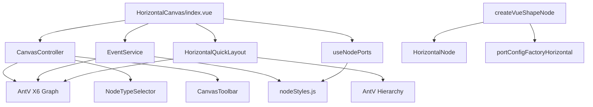
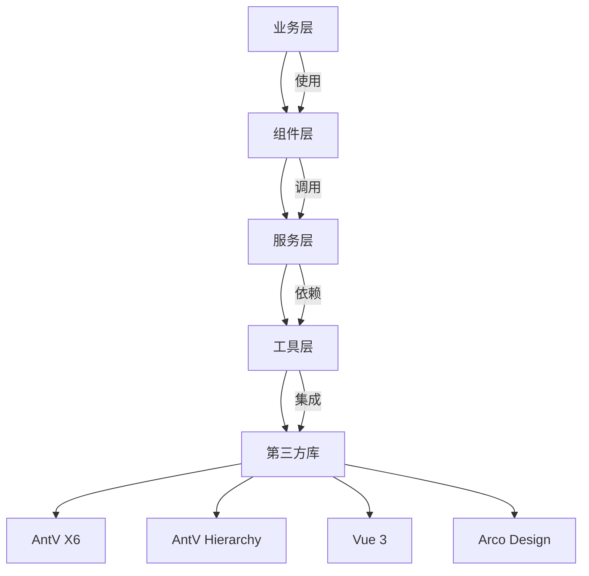
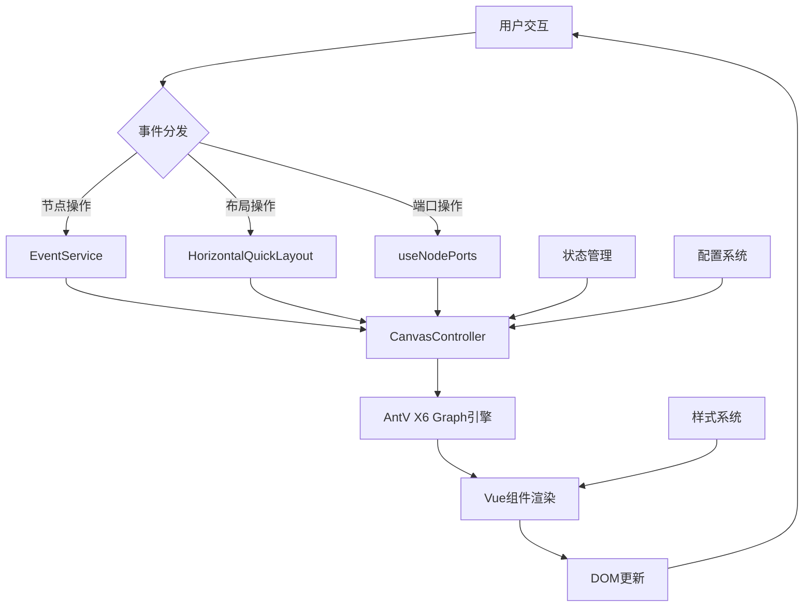
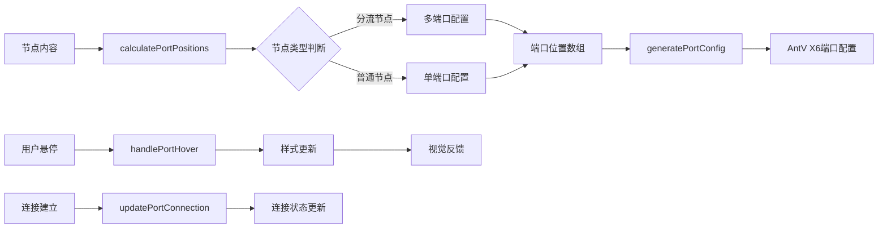
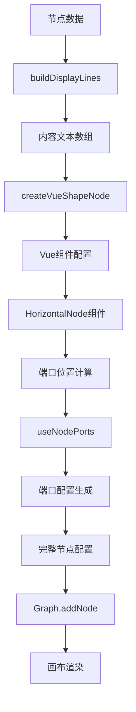
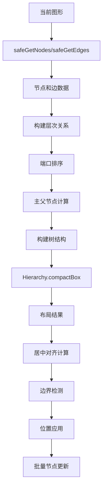
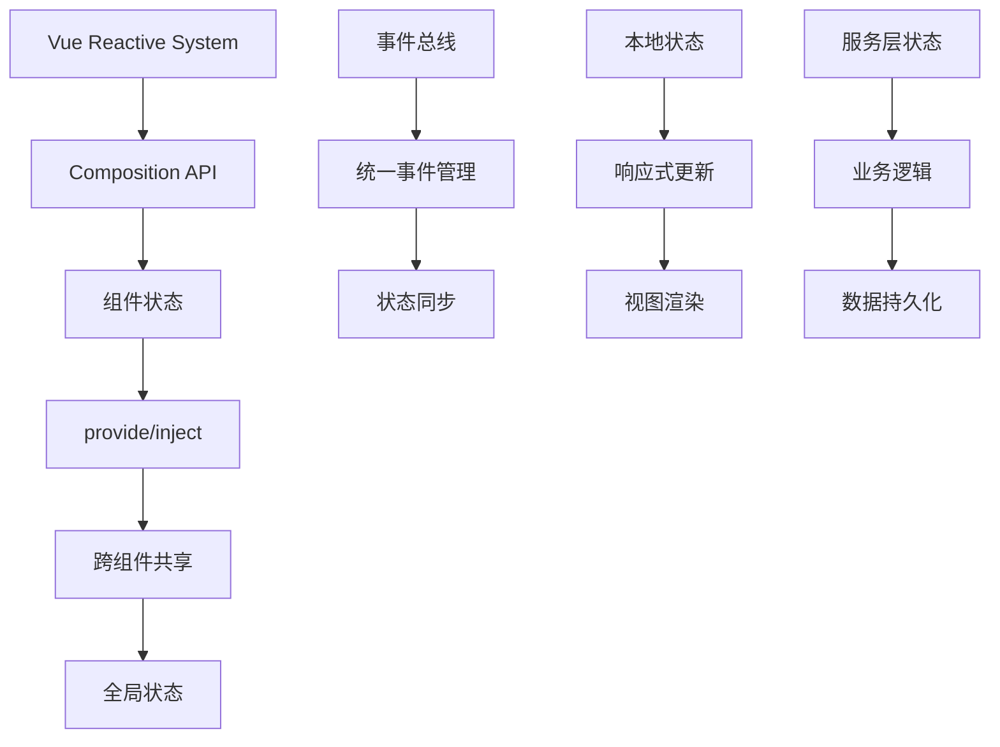

# 横版画布项目架构分析

## 1. 项目概述

### 功能定位
横版画布是一个基于Vue 3和AntV X6的可视化流程编辑工具，专门用于营销任务流的创建、编辑和管理。系统采用横向布局模式，支持节点的拖拽、连接、配置和自动化布局。

### 技术选型
- **前端框架**: Vue 3 (Composition API)
- **图形引擎**: AntV X6 (核心画布引擎)
- **布局算法**: AntV Hierarchy (层次布局)
- **UI组件库**: Arco Design
- **状态管理**: Vue 3 Composition API + provide/inject
- **构建工具**: Vite
- **开发语言**: JavaScript + TypeScript

## 2. 模块依赖关系

### 2.1 核心模块架构



### 2.2 依赖库层次



## 3. 核心接口定义

### 3.1 主要API接口

#### CanvasController 接口
```javascript
class CanvasController {
  // 画布初始化
  initGraph(container, options)
  
  // 节点操作
  addNode(type, position, data)
  removeNode(nodeId)
  updateNode(nodeId, data)
  
  // 连接操作
  connectNodes(sourceId, targetId, portConfig)
  removeEdge(edgeId)
  
  // 布局控制
  applyQuickLayout(options)
  fitContent()
  
  // 历史管理
  undo()
  redo()
  canUndo()
  canRedo()
}
```

#### EventService 接口
```javascript
class EventService {
  // 事件绑定
  bindGraphEvents(graph)
  
  // 节点交互
  handleNodeClick(node, event)
  handleNodeContextMenu(node, event)
  
  // 端口交互
  handlePortHover(portId, isHovered)
  handlePortConnection(portId, connection)
}
```

#### HorizontalQuickLayout 接口
```javascript
class HorizontalQuickLayout {
  // 主要布局方法
  executeHierarchyTreeLayout(graph, options)
  
  // 辅助方法
  safeGetNodes(graph)
  safeGetEdges(graph)
  calculateBounds(positions)
  getNodeSize(node)
}
```

### 3.2 配置项定义

#### 节点样式配置
```javascript
const NODE_DIMENSIONS = {
  WIDTH: 280,
  MIN_HEIGHT: 96,
  HEADER_HEIGHT: 36,
  ROW_HEIGHT: 32,
  CONTENT_PADDING: 12,
  ICON_SIZE: { width: 28, height: 20 },
  ICON_RADIUS: 6,
  MENU_DOT_SIZE: 3,
  PORT_RADIUS: 6
}
```

#### 布局算法配置
```javascript
const LAYOUT_CONFIG = {
  columnSpacing: 250,
  rowHeight: 150,
  startX: 100,
  startY: 100,
  centerAlign: true,
  colScale: 6,
  laneScale: 6
}
```

## 4. 数据流示意图

### 4.1 系统整体数据流



### 4.2 端口数据流详细分析



### 4.3 节点渲染数据流



### 4.4 布局算法数据流



### 4.5 状态管理架构



## 5. 技术栈详细分析

### 5.1 AntV X6 集成
- **核心功能**: 图形渲染、事件处理、节点管理
- **插件系统**: History、Keyboard、Selection、MiniMap
- **自定义节点**: Vue组件集成 via @antv/x6-vue-shape
- **性能优化**: 虚拟渲染、批量操作

### 5.2 布局算法
- **层次布局**: 使用AntV Hierarchy的compactBox算法
- **方向控制**: LR (Left-to-Right) 横向布局
- **复杂度**: O(n)线性时间复杂度
- **优化策略**: 端口索引排序、居中对齐、边界检测

### 5.3 端口管理系统
- **动态计算**: 基于内容行数的端口位置计算
- **类型支持**: 分流节点(多端口) vs 普通节点(单端口)
- **验证机制**: 位置偏差检测(±2px容差)
- **样式管理**: 悬停效果、连接状态、动画过渡

## 5. 核心服务层分析

### 5.1 CanvasController 服务
CanvasController是画布的核心控制器，负责协调各个服务模块：
- **依赖注入**: 通过构造函数注入graph实例和相关回调函数
- **事件服务集成**: 自动绑定EventService到graph实例
- **生命周期管理**: 管理画布的初始化、更新和销毁流程

### 5.2 EventService 事件服务
EventService处理所有用户交互事件，采用区域识别算法：
- **坐标转换**: localToClient/clientToLocal的坐标系统转换
- **区域检测**: 基于坐标的标题区/菜单点区域识别
- **事件分类**: 区分节点点击、右键菜单、端口悬停等不同事件类型
- **防误触机制**: 通过selector属性精确识别点击目标

### 5.3 组合式函数(Composables)

#### useNodePorts 端口管理
```javascript
// 核心功能
- calculatePortPositions: 基于内容行数动态计算端口位置
- getPortStyles: 生成端口样式，支持悬停效果
- validatePortPositions: 验证端口位置精度(±2px容差)
- generatePortConfig: 生成AntV X6兼容的端口配置
```

#### 端口位置算法
- **输入端口**: 位于内容区域中心，左对齐
- **输出端口**: 
  - 分流节点: 每行内容对应一个输出端口
  - 普通节点: 单个输出端口，内容区域中心对齐
- **偏移计算**: 使用dy参数相对于节点中心的偏移量

## 6. 节点创建与渲染系统

### 6.1 createVueShapeNode 节点工厂
节点创建采用工厂模式，支持动态内容生成：
- **内容构建**: buildDisplayLines函数根据节点类型生成显示内容
- **类型支持**: start、crowd-split、event-split、ab-test、ai-call等
- **数据映射**: 将配置数据转换为显示文本数组

### 6.2 节点类型映射
```javascript
const NODE_CONTENT_MAPPINGS = {
  start: ['任务类型', '目标人群'],
  'crowd-split': ['命中：人群名称', '否则：未命中'],
  'event-split': ['命中：事件名称', '等待超时'],
  'ab-test': ['变体A：50%', '变体B：50%'],
  'ai-call': ['外呼策略', '执行时间']
}
```

### 6.3 端口配置工厂
portConfigFactoryHorizontal提供灵活的端口配置：
- **端口数量**: 支持1-10个输出端口的动态配置
- **位置控制**: 支持自定义垂直偏移数组
- **验证机制**: 启用验证时检查端口位置精度
- **分布模式**: 支持均匀分布和自定义分布

## 7. 性能优化策略

### 7.1 渲染优化
- **防抖处理**: 频繁操作的事件防抖(300ms延迟)
- **批量更新**: 节点位置批量计算和应用，减少重绘次数
- **虚拟滚动**: 大数据量下的视口优化(>1000节点)
- **CSS优化**: GPU加速(transform)、减少重排重绘

### 7.2 内存管理
- **事件清理**: 组件卸载时的事件解绑，防止内存泄漏
- **对象池**: 复用临时对象减少GC压力
- **懒加载**: 按需加载节点组件和配置，减少初始加载时间
- **缓存策略**: 布局结果缓存，避免重复计算

### 7.3 算法优化
- **层次布局缓存**: 使用Map结构缓存节点关系，O(1)查找复杂度
- **增量更新**: 仅更新变化的部分节点，减少计算量
- **空间索引**: 使用Map结构加速节点查找和位置计算
- **边界检测**: 快速计算布局边界，支持自动居中

### 7.4 性能监控
```javascript
// 性能指标监控
const PERFORMANCE_METRICS = {
  layoutTime: '布局算法执行时间',
  renderTime: '节点渲染时间', 
  interactionLatency: '用户交互延迟',
  memoryUsage: '内存使用量'
}
```

## 7. 扩展性设计

### 7.1 插件架构
- **服务注入**: 通过依赖注入扩展功能
- **事件系统**: 统一事件总线支持插件通信
- **配置驱动**: 通过配置文件扩展节点类型

### 7.2 自定义节点
- **组件注册**: 动态注册Vue组件作为节点
- **样式系统**: 基于配置的主题和样式扩展
- **交互行为**: 可配置的节点交互逻辑

## 8. 系统架构总结

### 8.1 架构特点
横版画布项目采用**分层架构**设计，具有以下核心特点：

1. **模块化设计**: 功能模块高度解耦，便于维护和扩展
2. **响应式架构**: 基于Vue 3 Composition API的响应式数据流
3. **插件化集成**: 通过AntV X6插件系统扩展核心功能
4. **性能优先**: 多重优化策略确保流畅的用户体验
5. **类型安全**: TypeScript支持提供编译时类型检查

### 8.2 关键技术优势

#### 高性能布局算法
- **O(n)复杂度**: 线性时间复杂度的层次布局算法
- **增量更新**: 仅更新变化节点，减少计算量
- **智能缓存**: 布局结果缓存避免重复计算
- **边界优化**: 自动居中和边界检测算法

#### 灵活的端口系统
- **动态计算**: 基于内容行数的端口位置自适应计算
- **类型适配**: 支持分流节点多端口和普通节点单端口
- **精度验证**: ±2px容差的端口位置验证机制
- **样式一致性**: 统一的端口样式和交互效果

#### 强大的事件处理
- **区域识别**: 基于坐标的精确区域识别算法
- **防误触机制**: 多层级的事件过滤和验证
- **坐标转换**: 完善的坐标系统转换支持
- **事件分类**: 细化的事件类型处理逻辑

### 8.3 扩展性分析

#### 节点类型扩展
```javascript
// 新节点类型添加示例
const NEW_NODE_TYPES = {
  'custom-node': {
    iconText: 'CN',
    contentBuilder: (config) => ['自定义内容1', '自定义内容2'],
    portCalculator: (lines) => ({ input: {...}, outputs: [...] })
  }
}
```

#### 布局算法扩展
```javascript
// 新布局算法集成
class CustomLayout extends HorizontalQuickLayout {
  executeCustomLayout(graph, options) {
    // 自定义布局逻辑
    return super.executeHierarchyTreeLayout(graph, options)
  }
}
```

#### 交互行为扩展
```javascript
// 新交互行为添加
EventService.prototype.handleCustomInteraction = function(node, event) {
  // 自定义交互处理逻辑
}
```

### 8.4 性能基准

#### 核心性能指标
- **布局算法**: 1000节点 < 100ms
- **节点渲染**: 单个节点 < 5ms
- **交互延迟**: 用户操作 < 16ms (60fps)
- **内存占用**: 1000节点场景 < 50MB

#### 扩展性指标
- **最大节点数**: 支持10,000+节点流畅操作
- **最大连接数**: 支持50,000+连接线渲染
- **响应时间**: 大数据量下保持亚秒级响应

### 8.5 未来技术演进方向

#### 架构升级
1. **微前端集成**: 支持作为独立微应用部署
2. **Web Workers**: 复杂计算任务移至后台线程
3. **WebAssembly**: 关键算法性能优化
4. **PWA支持**: 离线使用和本地缓存

#### 功能增强
1. **AI辅助布局**: 基于机器学习的智能布局建议
2. **实时协作**: 多用户协同编辑支持
3. **3D可视化**: 三维流程图展示能力
4. **高级分析**: 流程复杂度分析和优化建议

#### 技术栈升级
1. **Vue 3.5+**: 利用最新Vue特性优化性能
2. **Vite 6**: 构建性能进一步提升
3. **ES2024**: 使用最新JavaScript语言特性
4. **Web Components**: 组件标准化和跨框架复用

## 9. 错误处理与监控

### 9.1 异常捕获
- **边界处理**: safeGetNodes、safeGetEdges的安全封装
- **错误日志**: 详细的错误信息和调试日志
- **降级策略**: 布局失败时的优雅降级

### 9.2 调试支持
- **调试面板**: CanvasDebugPanel提供运行时信息
- **性能监控**: 布局耗时、内存使用监控
- **状态检查**: 节点位置验证、连接完整性检查