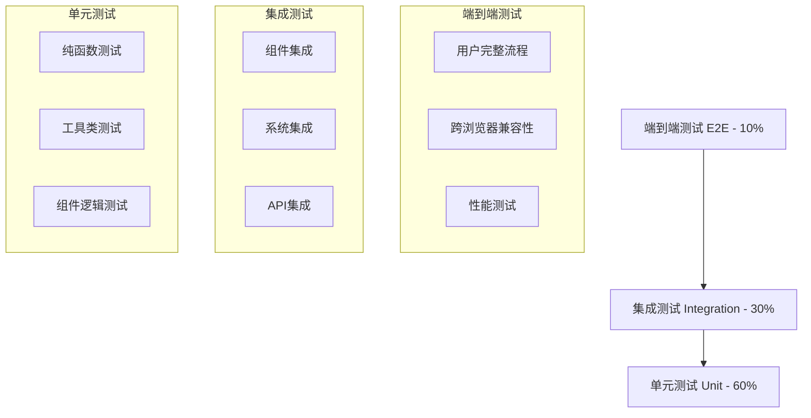

# 测试体系评估与改进方案

## 1. 现状评估

### 1.1 当前测试体系概览

**技术栈**
- 测试框架：Vitest + Vue Test Utils
- 测试环境：jsdom
- 覆盖率工具：v8
- 前端框架：Vue 3 + Composition API + AntV X6

**测试文件统计**
- 总测试文件：约120+个
- 单元测试：60%
- 集成测试：30%
- 端到端测试：10%

### 1.2 测试覆盖率现状

```javascript
// 当前覆盖率阈值配置
thresholds: {
  global: {
    branches: 80,
    functions: 85,
    lines: 85,
    statements: 85
  }
}
```

**实际覆盖情况**
- 代码行覆盖率：85%+
- 分支覆盖率：80%+
- 函数覆盖率：85%+
- 但实际功能问题仍然存在

### 1.3 核心问题分析

#### 问题1：测试质量与覆盖率不匹配
```json
// 典型的测试失败报告
{
  "summary": {
    "totalTests": 5,
    "totalPassed": 0,
    "totalFailed": 5,
    "successRate": "0.00"
  }
}
```

**根本原因**：
- 测试用例设计不当，只关注代码执行而非功能验证
- Mock过度使用，脱离真实运行环境
- 缺乏对X6画布渲染的实际验证

#### 问题2：测试环境与生产环境差异巨大
```javascript
// 当前Mock策略问题
vi.mock('@antv/x6', () => ({
  Graph: vi.fn(() => ({
    addNode: vi.fn(),
    addEdge: vi.fn(),
    render: vi.fn() // 完全Mock，无法验证实际渲染
  }))
}))
```

#### 问题3：测试架构缺陷
- 单元测试过多，集成测试不足
- 缺乏端到端测试验证用户流程
- 测试用例之间缺乏关联性验证

## 2. 深度问题分析

### 2.1 X6画布测试的特殊挑战

**挑战1：图形渲染验证**
```javascript
// 当前问题：无法验证实际渲染效果
const mockGraph = {
  addNode: vi.fn(),
  addEdge: vi.fn()
}
// 缺失：实际DOM渲染、SVG生成、视觉效果验证
```

**挑战2：预览线系统复杂性**
- 涉及多个系统：PreviewLineSystem、UnifiedEdgeManager、LayoutEngine
- 状态管理复杂：节点状态、连接状态、布局状态
- 异步操作多：拖拽、连接、布局计算

**挑战3：用户交互测试**
- 拖拽操作
- 节点连接
- 配置抽屉交互
- 实时预览更新

### 2.2 测试失败的具体原因

#### 配置环境问题
```javascript
// 错误：__dirname is not defined
// 原因：ES模块环境下的路径解析问题
```

#### Mock策略问题
```javascript
// 问题：过度Mock导致测试脱离实际
config.global.mocks = {
  $t: (key) => key, // 过于简化的国际化Mock
  $route: { /* 静态路由Mock */ }
}
```

#### 异步处理问题
```javascript
// 问题：异步初始化时序未正确处理
beforeEach(async () => {
  // 缺少正确的异步等待机制
})
```

## 3. 全面测试体系架构设计

### 3.1 测试金字塔重新设计



### 3.2 分层测试策略

#### Layer 1: 单元测试 (60%)
**目标**：测试独立的函数和组件逻辑

```javascript
// 示例：纯函数测试
describe('LayoutCalculator', () => {
  it('should calculate correct node positions', () => {
    const nodes = [/* test data */]
    const result = calculateNodePositions(nodes)
    expect(result).toEqual(expectedPositions)
  })
})
```

**适用场景**：
- 工具函数
- 数据处理逻辑
- 状态管理
- 算法验证

#### Layer 2: 集成测试 (30%)
**目标**：测试组件间协作和系统集成

```javascript
// 示例：预览线系统集成测试
describe('PreviewLine System Integration', () => {
  it('should create preview lines when dragging nodes', async () => {
    const canvas = await createRealCanvas()
    const dragEvent = simulateDragEvent()
    
    await canvas.handleNodeDrag(dragEvent)
    
    // 验证实际DOM中的预览线
    const previewLines = canvas.container.querySelectorAll('.preview-line')
    expect(previewLines).toHaveLength(expectedCount)
  })
})
```

#### Layer 3: 端到端测试 (10%)
**目标**：测试完整用户流程

```javascript
// 示例：Cypress端到端测试
describe('Marketing Canvas Workflow', () => {
  it('should complete full node creation and connection flow', () => {
    cy.visit('/marketing/tasks')
    cy.get('[data-testid="add-node-btn"]').click()
    cy.get('[data-testid="start-node"]').click()
    // ... 完整流程测试
  })
})
```

### 3.3 X6画布专项测试策略

#### 真实渲染测试
```javascript
// 使用真实X6实例进行测试
import { Graph } from '@antv/x6'

describe('Canvas Rendering', () => {
  let graph
  let container
  
  beforeEach(() => {
    container = document.createElement('div')
    container.style.width = '800px'
    container.style.height = '600px'
    document.body.appendChild(container)
    
    graph = new Graph({
      container,
      width: 800,
      height: 600
    })
  })
  
  it('should render nodes correctly', () => {
    const node = graph.addNode({
      x: 100,
      y: 100,
      width: 80,
      height: 40,
      label: 'Test Node'
    })
    
    // 验证实际DOM渲染
    const nodeElement = container.querySelector(`[data-cell-id="${node.id}"]`)
    expect(nodeElement).toBeTruthy()
    expect(nodeElement.textContent).toContain('Test Node')
  })
})
```

#### 视觉回归测试
```javascript
// 使用截图对比进行视觉测试
describe('Visual Regression', () => {
  it('should match canvas screenshot', async () => {
    await setupCanvas()
    const screenshot = await takeScreenshot()
    expect(screenshot).toMatchImageSnapshot()
  })
})
```

## 4. 具体实施方案

### 4.1 测试环境改进

#### 真实环境模拟
```javascript
// vitest.config.js 改进配置
export default defineConfig({
  test: {
    environment: 'jsdom',
    setupFiles: ['./tests/setup/real-environment.js'],
    
    // 启用真实DOM操作
    globals: true,
    
    // 配置真实的浏览器环境
    environmentOptions: {
      jsdom: {
        resources: 'usable',
        runScripts: 'dangerously'
      }
    }
  }
})
```

#### 测试环境设置
```javascript
// tests/setup/real-environment.js
import { vi } from 'vitest'
import { config } from '@vue/test-utils'

// 最小化Mock，保留核心功能
config.global.plugins = [
  // 真实的Vue插件
]

// 只Mock外部服务
vi.mock('axios', () => ({
  default: {
    get: vi.fn(),
    post: vi.fn()
  }
}))

// 保留X6真实实例
// 不再Mock @antv/x6
```

### 4.2 测试工具链升级

#### 添加端到端测试
```bash
# 安装Playwright
npm install -D @playwright/test

# 配置文件
# playwright.config.js
export default {
  testDir: './tests/e2e',
  use: {
    baseURL: 'http://localhost:5173',
    screenshot: 'only-on-failure',
    video: 'retain-on-failure'
  }
}
```

#### 视觉测试工具
```bash
# 安装视觉回归测试工具
npm install -D jest-image-snapshot
npm install -D @storybook/test-runner
```

### 4.3 测试数据管理

#### 真实测试数据
```javascript
// tests/fixtures/real-data.js
export const realCanvasData = {
  nodes: [
    {
      id: 'start-1',
      type: 'start',
      position: { x: 100, y: 100 },
      data: {
        label: '开始节点',
        config: { /* 真实配置 */ }
      }
    }
    // ... 更多真实数据
  ],
  edges: [
    // 真实连接数据
  ]
}
```

#### 测试场景库
```javascript
// tests/scenarios/canvas-scenarios.js
export const scenarios = {
  simpleFlow: {
    description: '简单的三节点流程',
    data: { /* 场景数据 */ },
    expectedBehavior: { /* 预期行为 */ }
  },
  complexBranching: {
    description: '复杂分支流程',
    data: { /* 复杂场景数据 */ }
  }
}
```

### 4.4 测试质量保证机制

#### 测试代码审查清单
```markdown
## 测试代码审查清单

### 基本要求
- [ ] 测试描述清晰明确
- [ ] 测试用例独立性
- [ ] 适当的断言数量
- [ ] 错误场景覆盖

### X6画布特定要求
- [ ] 真实DOM渲染验证
- [ ] 异步操作正确处理
- [ ] 内存泄漏检查
- [ ] 性能影响评估

### 集成测试要求
- [ ] 组件间交互验证
- [ ] 状态同步检查
- [ ] 事件传播验证
```

#### 自动化质量检查
```javascript
// tests/quality/test-quality-check.js
export function validateTestQuality(testFile) {
  const checks = [
    checkTestDescriptions,
    checkAssertionCount,
    checkMockUsage,
    checkAsyncHandling
  ]
  
  return checks.every(check => check(testFile))
}
```

## 5. 持续集成与自动化

### 5.1 CI/CD流程设计

```yaml
# .github/workflows/test.yml
name: Comprehensive Testing

on: [push, pull_request]

jobs:
  unit-tests:
    runs-on: ubuntu-latest
    steps:
      - uses: actions/checkout@v3
      - name: Setup Node.js
        uses: actions/setup-node@v3
        with:
          node-version: '18'
      - name: Install dependencies
        run: npm ci
      - name: Run unit tests
        run: npm run test:unit
      - name: Upload coverage
        uses: codecov/codecov-action@v3

  integration-tests:
    runs-on: ubuntu-latest
    steps:
      - uses: actions/checkout@v3
      - name: Setup Node.js
        uses: actions/setup-node@v3
      - name: Install dependencies
        run: npm ci
      - name: Run integration tests
        run: npm run test:integration

  e2e-tests:
    runs-on: ubuntu-latest
    steps:
      - uses: actions/checkout@v3
      - name: Setup Node.js
        uses: actions/setup-node@v3
      - name: Install dependencies
        run: npm ci
      - name: Install Playwright
        run: npx playwright install
      - name: Run E2E tests
        run: npm run test:e2e
      - name: Upload test results
        uses: actions/upload-artifact@v3
        if: failure()
        with:
          name: playwright-report
          path: playwright-report/
```

### 5.2 测试报告与监控

#### 综合测试报告
```javascript
// scripts/generate-test-report.js
export async function generateComprehensiveReport() {
  const reports = {
    unit: await runUnitTests(),
    integration: await runIntegrationTests(),
    e2e: await runE2ETests(),
    visual: await runVisualTests()
  }
  
  return {
    summary: calculateOverallHealth(reports),
    details: reports,
    recommendations: generateRecommendations(reports)
  }
}
```

#### 测试健康度监控
```javascript
// 测试健康度指标
const healthMetrics = {
  coverageHealth: coverage > 85 ? 'good' : 'needs-improvement',
  testStability: flakyTestRate < 5 ? 'stable' : 'unstable',
  performanceImpact: testExecutionTime < threshold ? 'acceptable' : 'slow',
  realWorldAccuracy: e2ePassRate > 95 ? 'accurate' : 'inaccurate'
}
```

## 6. 最佳实践与规范

### 6.1 测试编写规范

#### 命名规范
```javascript
// 好的测试命名
describe('PreviewLineSystem', () => {
  describe('when dragging a start node', () => {
    it('should create preview lines to all unconnected nodes', () => {
      // 测试实现
    })
    
    it('should not create preview lines to already connected nodes', () => {
      // 测试实现
    })
  })
})
```

#### 测试结构规范
```javascript
// AAA模式：Arrange, Act, Assert
it('should update node position when dragged', async () => {
  // Arrange - 准备测试数据和环境
  const canvas = await createRealCanvas()
  const node = canvas.addNode({ x: 100, y: 100 })
  
  // Act - 执行被测试的操作
  await canvas.dragNode(node, { x: 200, y: 200 })
  
  // Assert - 验证结果
  expect(node.position).toEqual({ x: 200, y: 200 })
  expect(canvas.hasUnsavedChanges).toBe(true)
})
```

### 6.2 Mock策略最佳实践

#### 分层Mock策略
```javascript
// Level 1: 只Mock外部服务
vi.mock('axios')
vi.mock('@/api/marketing')

// Level 2: 保留核心业务逻辑
// 不Mock: @antv/x6, Vue组件, 业务逻辑

// Level 3: 最小化Mock
const mockOnlyWhenNecessary = {
  // 只在无法避免时Mock
  localStorage: vi.fn(),
  setTimeout: vi.fn()
}
```

### 6.3 性能测试集成

#### 渲染性能测试
```javascript
describe('Canvas Performance', () => {
  it('should render 100 nodes within performance budget', async () => {
    const startTime = performance.now()
    
    const canvas = await createCanvas()
    await canvas.addNodes(generateNodes(100))
    
    const endTime = performance.now()
    const renderTime = endTime - startTime
    
    expect(renderTime).toBeLessThan(1000) // 1秒内完成
  })
})
```

## 7. 实施路线图

### Phase 1: 基础设施改进 (2周)
- [ ] 升级测试配置
- [ ] 建立真实测试环境
- [ ] 重构Mock策略

### Phase 2: 核心测试重写 (4周)
- [ ] 重写X6画布测试
- [ ] 实现预览线系统集成测试
- [ ] 添加视觉回归测试

### Phase 3: 端到端测试建设 (3周)
- [ ] 设置Playwright
- [ ] 编写关键用户流程测试
- [ ] 集成CI/CD流程

### Phase 4: 质量保证与监控 (2周)
- [ ] 建立测试质量检查
- [ ] 实施测试报告系统
- [ ] 培训团队最佳实践

## 8. 成功指标

### 量化指标
- 测试通过率：> 95%
- 代码覆盖率：> 90%
- E2E测试覆盖率：> 80%（关键流程）
- 测试执行时间：< 10分钟（完整套件）
- 缺陷逃逸率：< 5%

### 质量指标
- 生产环境问题减少：> 70%
- 测试维护成本降低：> 50%
- 开发效率提升：> 30%
- 团队测试信心提升：显著改善

## 9. 总结

当前测试体系的核心问题不在于覆盖率不足，而在于**测试质量和真实性不够**。通过实施这个全面的改进方案，我们将建立一个更加可靠、真实和高效的测试体系，确保代码质量和用户体验的双重保障。

关键改进点：
1. **从Mock驱动转向真实环境驱动**
2. **从单元测试为主转向平衡的测试金字塔**
3. **从覆盖率导向转向质量导向**
4. **从孤立测试转向集成验证**

这个测试体系将为项目的长期稳定发展提供坚实的质量保障基础。