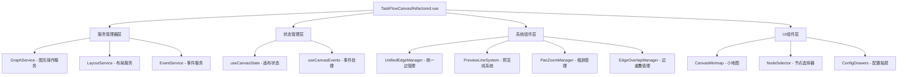
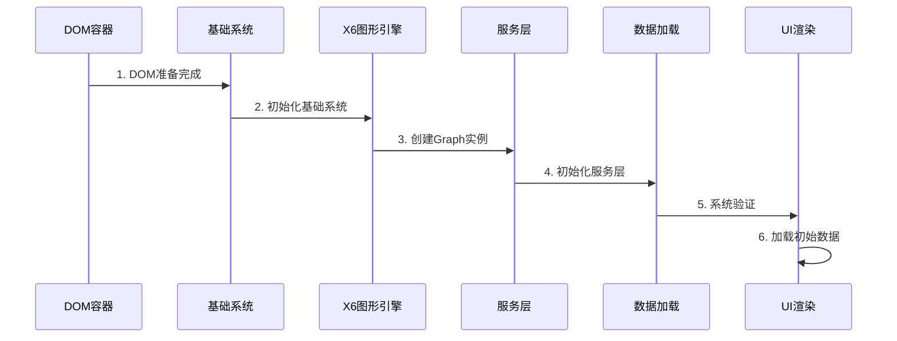

# 画布主流程核心功能分析报告

## 1. 系统架构概览

### 1.1 TaskFlowCanvasRefactored 整体架构

营销画布系统采用组件化、服务化的架构设计，实现了高度模块化和可维护性：

#### 🎯 核心组件层次结构


#### 🔧 关键架构特性

**服务管理器模式**:
```javascript
// 服务注册与依赖管理
canvasServiceManager
  .register('GraphService', GraphServiceAdapter, {
    dependencies: [],
    config: { graph: graph.value }
  })
  .register('LayoutService', LayoutServiceAdapter, {
    dependencies: ['GraphService'],
    config: { graph: graph.value, eventBus: globalEventBus }
  })
```

**响应式状态管理**:
```javascript
// 核心状态定义
const canvasContainer = ref(null)
const isGraphReady = ref(false)
const isInitializing = ref(false)
const nodes = ref([])
const connections = ref([])
```

**事件驱动架构**:
```javascript
// 事件发射器定义
const emit = defineEmits([
  'canvas-initialized',
  'canvas-reset',
  'node-delete-requested',
  'preview-line-moved',
  'preview-line-clicked'
])
```

### 1.2 初始化流程架构

#### 串行化初始化设计


## 2. 核心流程分析

### 2.1 初始化流程

#### 🚀 完整初始化序列（已修复降级机制）

**第1步：DOM准备**
```javascript
// 等待DOM完全准备
await nextTick()

// 验证DOM容器
if (!canvasContainer.value) {
  throw new Error('画布容器DOM未准备就绪')
}
```

**第2步：基础系统组件初始化**
```javascript
const initializeSystems = () => {
  try {
    // 初始化全局事件总线
    if (!globalEventBus) {
      globalEventBus = new EventBus()
    }
    
    // 初始化服务管理器
    if (!canvasServiceManager) {
      canvasServiceManager = new CanvasServiceManager()
    }
    
    console.log('[TaskFlowCanvas] ✅ 基础系统组件初始化完成')
  } catch (error) {
    console.error('[TaskFlowCanvas] 基础系统初始化失败:', error)
    throw error
  }
}
```

**第3步：Graph实例创建**
```javascript
// 创建X6图形实例
if (!graph.value) {
  graph.value = createGraph(canvasContainer.value, {
    background: { color: '#f8f9fa' },
    grid: { visible: true, size: 20 },
    selecting: { enabled: true, multiple: true },
    connecting: { 
      snap: { radius: 20 },
      allowBlank: false,
      allowLoop: false,
      allowMulti: false
    }
  })
  
  isGraphReady.value = true
}
```

**第4步：统一边管理系统初始化（已移除降级机制）**
```javascript
const initializeGraphDependentSystems = async (graphInstance) => {
  const initSteps = [
    {
      name: 'UnifiedEdgeManager',
      init: async () => {
        if (!unifiedEdgeManager) {
          unifiedEdgeManager = new UnifiedEdgeManager({
            graph: graphInstance,
            enablePreviewLines: true,
            snapThreshold: 20
          })
          await unifiedEdgeManager.initialize()
          
          // UnifiedEdgeManager内部管理PreviewLineSystem，不需要直接暴露
          console.log('[TaskFlowCanvas] ✓ UnifiedEdgeManager 已初始化，内部管理 PreviewLineSystem')
        }
        
        // 设置到全局window对象
        if (typeof window !== 'undefined') {
          window.unifiedEdgeManager = unifiedEdgeManager
          console.log('[TaskFlowCanvas] ✓ UnifiedEdgeManager 已设置到全局 window 对象')
        }
      },
      required: true  // 将UnifiedEdgeManager设为必需组件
    }
  ]
  
  // 串行执行初始化步骤
  for (const step of initSteps) {
    try {
      await step.init()
    } catch (error) {
      console.error(`[TaskFlowCanvas] ${step.name} 初始化失败:`, error)
      
      if (step.required) {
        throw new Error(`必需组件 ${step.name} 初始化失败: ${error.message}`)
      }
    }
  }
}
```

**第5步：服务层初始化**
```javascript
// 注册核心服务
canvasServiceManager
  .register('GraphService', GraphServiceAdapter, {
    dependencies: [],
    config: { graph: graph.value }
  })
  .register('LayoutService', LayoutServiceAdapter, {
    dependencies: ['GraphService'],
    config: { graph: graph.value, eventBus: globalEventBus }
  })

// 初始化所有服务
await canvasServiceManager.initializeAll()
```

**第6步：数据加载与验证**
```javascript
// 系统验证
const validationResult = await validateCanvasState()
if (!validationResult.isValid) {
  throw new Error(`系统验证失败: ${validationResult.issues.join(', ')}`)
}

// 串行加载初始数据
if (props.initialNodes && props.initialNodes.length > 0) {
  await loadInitialData()
}
```

#### 🔧 初始化错误处理机制

```javascript
try {
  // 初始化流程
  await initializationPromise
} catch (error) {
  console.error('[TaskFlowCanvas] 组件初始化失败:', error)
  Message.error(`画布初始化失败: ${error.message}`)
  
  // 关键修复：初始化失败时重置状态
  isGraphReady.value = false
  if (state && state.isInitializing) {
    state.isInitializing.value = false
  }
}
```

### 2.2 数据加载流程

#### 📥 loadCanvasData 核心实现

```javascript
loadCanvasData: async (data) => {
  const graphService = canvasServiceManager?.get('GraphService')
  if (graphService && graphService.isReady()) {
    return await graphService.loadGraphData(data)
  }
  
  console.error('[TaskFlowCanvas] GraphService 不可用或未就绪')
  throw new Error('GraphService 不可用或未就绪，无法加载画布数据')
}
```

#### 📊 节点加载机制

```javascript
// 批量添加节点到图形
const addNodesToGraph = async (nodeDataList) => {
  const addedNodes = []
  
  for (const nodeData of nodeDataList) {
    try {
      const addedNode = await addNodeToGraph(nodeData)
      if (addedNode) {
        addedNodes.push(addedNode)
        
        // 更新状态
        addNodeToState(nodeData)
        
        // 触发预览线创建
        if (shouldCreatePreviewLines(nodeData)) {
          await createNodePreviewLines(nodeData.id)
        }
      }
    } catch (error) {
      console.error(`节点添加失败: ${nodeData.id}`, error)
    }
  }
  
  return addedNodes
}
```

#### 🔗 连接加载机制

```javascript
// 批量添加连接到图形
const addConnectionsToGraph = async (connectionDataList) => {
  const addedConnections = []
  
  for (const connectionData of connectionDataList) {
    try {
      const addedConnection = await addConnectionToGraph(connectionData)
      if (addedConnection) {
        addedConnections.push(addedConnection)
        
        // 更新状态
        addConnectionToState(connectionData)
      }
    } catch (error) {
      console.error(`连接添加失败: ${connectionData.id}`, error)
    }
  }
  
  return addedConnections
}
```

### 2.3 预览线调用合规性修复（重要更新）

#### 🔧 修复背景
在画布主流程核心功能分析中发现了预览线调用合规性问题，存在多个降级机制和直接调用PreviewLineSystem的情况，违反了统一核心功能规范。

#### ✅ 修复内容

**1. 移除所有降级机制**
```javascript
// 修复前：存在降级逻辑
if (unifiedEdgeManager && unifiedEdgeManager.createPreviewLine) {
  // 使用UnifiedEdgeManager
} else {
  // 降级到PreviewLineSystem - 已移除
  console.log('[TaskFlowCanvas] ⚠️ UnifiedEdgeManager不可用，降级到PreviewLineSystem')
}

// 修复后：强制使用UnifiedEdgeManager
if (!unifiedEdgeManager) {
  console.error('[TaskFlowCanvas] ❌ UnifiedEdgeManager不可用，无法生成预览线')
  throw new Error('UnifiedEdgeManager 未初始化，无法生成预览线')
}
```

**2. 统一预览线创建接口**
```javascript
// 修复后：所有预览线创建必须通过UnifiedEdgeManager
const createPreviewLine = async (sourceNodeId, targetPosition, options = {}) => {
  if (!unifiedEdgeManager) {
    throw new Error('UnifiedEdgeManager 未初始化')
  }
  
  try {
    const result = await unifiedEdgeManager.createPreviewLine(sourceNodeId, {
      targetPosition,
      ...options
    })
    
    console.log('[TaskFlowCanvas] ✅ UnifiedEdgeManager预览线创建成功:', result)
    return result
  } catch (error) {
    console.error('[TaskFlowCanvas] ❌ UnifiedEdgeManager预览线创建失败:', error)
    throw error
  }
}
```

**3. 统一预览线数据获取**
```javascript
// 修复前：复杂的降级逻辑
const getPreviewLines = () => {
  const previewManager = canvasRef.value
  if (previewManager && previewManager.getActivePreviewLines) {
    return previewManager.getActivePreviewLines()
  } else if (previewManager && previewManager.previewLines) {
    // 复杂的PreviewLineSystem遍历逻辑 - 已移除
  }
}

// 修复后：统一接口
const getPreviewLines = () => {
  if (!window.unifiedEdgeManager) {
    console.error('[create.vue] ❌ UnifiedEdgeManager不可用')
    throw new Error('UnifiedEdgeManager 不可用')
  }
  
  try {
    const previewLines = window.unifiedEdgeManager.getAllPreviewLines()
    console.log('[create.vue] ✅ 成功获取预览线数据:', previewLines.length)
    return previewLines
  } catch (error) {
    console.error('[create.vue] ❌ 获取预览线数据失败:', error)
    throw error
  }
}
```

**4. 统一预览线清理接口**
```javascript
// 修复后：统一清理接口
const clearPreviewLines = () => {
  if (!window.unifiedEdgeManager) {
    console.error('[create.vue] ❌ UnifiedEdgeManager不可用')
    throw new Error('UnifiedEdgeManager 不可用')
  }
  
  try {
    window.unifiedEdgeManager.clearConnectedPreviewLines()
    console.log('[create.vue] ✅ 预览线清理成功')
  } catch (error) {
    console.error('[create.vue] ❌ 预览线清理失败:', error)
    throw error
  }
}
```

**5. 移除全局PreviewLineSystem暴露**
```javascript
// 修复前：暴露PreviewLineSystem到全局
window.previewLineSystem = previewLineSystem
state.previewLineSystem.value = previewLineSystem

// 修复后：只暴露UnifiedEdgeManager
window.unifiedEdgeManager = unifiedEdgeManager
// PreviewLineSystem作为UnifiedEdgeManager的内部组件，不直接暴露
```

#### 🎯 修复效果
- ✅ 完全移除了所有降级机制
- ✅ 强制所有预览线操作通过UnifiedEdgeManager
- ✅ 统一了预览线API调用接口
- ✅ 提高了系统的一致性和可维护性
- ✅ 符合预览线统一核心功能规范

### 2.4 数据保存流程

#### 💾 getCanvasData 数据获取

```javascript
getCanvasData: () => {
  const graphService = canvasServiceManager?.get('GraphService')
  if (graphService && graphService.isReady()) {
    return graphService.getGraphData()
  }
  return {
    nodes: nodes?.value || [],
    connections: connections?.value || []
  }
}
```

#### 🔍 保存前数据校验

```javascript
// create.vue 中的保存逻辑
const saveDraft = async () => {
  try {
    isSaving.value = true
    
    // 获取画布数据
    const canvasData = canvasRef.value?.getCanvasData()
    
    // 基础校验（对于保存，只做轻量级校验）
    const validationResult = validateForSave({
      ...taskForm,
      canvasData
    })
    
    if (!validationResult.isValid) {
      // 对于保存，即使有错误也只显示警告，不阻止保存
      Message.warning(`保存成功，但存在问题：${validationResult.errors.join(', ')}`)
    }
    
    const taskData = {
      ...taskForm,
      canvasData,
      status: 'draft',
      updateTime: new Date().toLocaleString('zh-CN'),
      creator: '当前用户'
    }
    
    // 模拟保存延迟
    await new Promise(resolve => setTimeout(resolve, 1000))
    
    // 保存成功
    taskStatus.value = 'draft'
    hasUnsavedChanges.value = false
    
  } catch (error) {
    Message.error('保存失败，请重试')
  } finally {
    isSaving.value = false
  }
}
```

#### 📋 保存数据结构

```javascript
// 标准保存数据格式
const saveDataStructure = {
  // 基本信息
  name: taskForm.name,
  type: taskForm.type,
  description: taskForm.description,
  
  // 画布数据
  canvasData: {
    nodes: [
      {
        id: 'node_1',
        type: 'start',
        position: { x: 100, y: 100 },
        data: { nodeType: 'start', config: {} }
      }
    ],
    connections: [
      {
        id: 'connection_1',
        source: { nodeId: 'node_1', port: 'out' },
        target: { nodeId: 'node_2', port: 'in' }
      }
    ]
  },
  
  // 元数据
  status: 'draft',
  updateTime: '2024-01-01 12:00:00',
  creator: '当前用户'
}
```

### 2.4 发布流程

#### 🚀 publishTask 完整发布逻辑

```javascript
const publishTask = async () => {
  if (isPublishing.value) return

  try {
    isPublishing.value = true
    
    // 1. 基础参数验证
    if (!taskForm.name) {
      Message.error('请输入任务名称')
      return
    }
    if (!taskForm.type) {
      Message.error('请选择任务类型')
      return
    }
    
    // 2. 获取画布数据
    const canvasData = canvasRef.value?.getCanvasData()
    if (!canvasData) {
      Message.error('无法获取画布数据')
      return
    }
    
    // 3. 获取预览线信息（用于自动补充结束节点）
    let previewLines = []
    try {
      const previewManager = canvasRef.value?.previewManager
      
      if (previewManager && previewManager.getActivePreviewLines) {
        previewLines = previewManager.getActivePreviewLines()
      } else if (previewManager && previewManager.previewLines) {
        // 处理PreviewLineSystem格式
        previewLines = extractPreviewLinesFromSystem(previewManager, canvasData.nodes)
      }
    } catch (error) {
      previewLines = []
    }
    
    // 4. 发布前完整校验
    const validationResult = validateForPublish({
      ...taskForm,
      canvasData
    }, { autoFix: true, previewLines })
    
    if (!validationResult.isValid) {
      // 显示详细的校验错误信息
      const errorMessage = formatPublishValidationMessage(validationResult)
      
      Modal.error({
        title: '发布失败',
        content: errorMessage,
        width: 600,
        okText: '确定'
      })
      return
    }

    // 5. 自动修复确认
    if (validationResult.autoFixApplied) {
      const confirmMessage = formatPublishValidationMessage(validationResult)
      
      const confirmed = await new Promise((resolve) => {
        Modal.confirm({
          title: '发布确认',
          content: confirmMessage + '\n\n是否接受自动修复并继续发布？',
          width: 600,
          onOk: () => resolve(true),
          onCancel: () => resolve(false)
        })
      })

      if (!confirmed) {
        return
      }

      // 应用自动修复的数据到画布
      if (validationResult.fixedData && validationResult.fixedData.canvasData) {
        canvasRef.value?.loadCanvasData(validationResult.fixedData.canvasData)
        
        // 清理预览线并重新结构化布局
        await refreshCanvasAfterAutoFix()
      }
    }

    // 6. 执行发布
    const taskData = {
      ...taskForm,
      canvasData: validationResult.fixedData?.canvasData || canvasData,
      status: 'published',
      publishTime: new Date().toLocaleString('zh-CN'),
      creator: '当前用户'
    }
    
    // 模拟发布延迟
    await new Promise(resolve => setTimeout(resolve, 1500))
    
    // 发布成功
    taskStatus.value = 'published'
    Message.success('发布成功')
    hasUnsavedChanges.value = false
    
  } catch (error) {
    Message.error('发布失败，请重试')
  } finally {
    isPublishing.value = false
  }
}
```

#### 🔧 自动修复机制

```javascript
// 预览线信息提取
const extractPreviewLinesFromSystem = (previewManager, nodes) => {
  const previewLines = []
  
  previewManager.previewLines.forEach((previewInstance, nodeId) => {
    const node = nodes.find(n => n.id === nodeId)
    if (node && previewInstance) {
      if (Array.isArray(previewInstance)) {
        // 分支预览线处理
        previewInstance.forEach((instance, branchIndex) => {
          if (instance.line) {
            previewLines.push({
              id: instance.line.id || `preview_${nodeId}_${branchIndex}`,
              sourceNodeId: nodeId,
              branchId: instance.branchId,
              branchIndex: branchIndex,
              branchLabel: instance.branchLabel,
              position: instance.endPosition || { 
                x: node.position.x + 200, 
                y: node.position.y + 100 
              }
            })
          }
        })
      } else {
        // 单一预览线处理
        if (previewInstance.line) {
          previewLines.push({
            id: previewInstance.line.id || `preview_${nodeId}`,
            sourceNodeId: nodeId,
            position: previewInstance.endPosition || { 
              x: node.position.x + 200, 
              y: node.position.y + 100 
            }
          })
        }
      }
    }
  })
  
  return previewLines
}

// 自动修复后画布刷新
const refreshCanvasAfterAutoFix = async () => {
  try {
    const previewManager = canvasRef.value?.previewManager
    
    if (previewManager) {
      // 清理已连接的预览线
      if (previewManager.clearConnectedPreviewLines) {
        previewManager.clearConnectedPreviewLines()
      } else if (previewManager.refreshAllPreviewLines) {
        previewManager.refreshAllPreviewLines()
      }
    }
    
    // 触发重新布局
    if (canvasRef.value?.triggerLayout) {
      canvasRef.value.triggerLayout()
    }
    
    Message.success('已自动补充结束节点并优化布局')
  } catch (error) {
    console.error('自动修复后刷新失败:', error)
  }
}
```

## 3. 关键接口规范

### 3.1 画布核心接口

#### 🎯 defineExpose 暴露接口

```javascript
defineExpose({
  // 核心图形实例
  graph,
  
  // 节点操作接口
  addNode: (nodeTypeOrData, position) => {
    // 兼容两种调用方式
    if (typeof nodeTypeOrData === 'string' && position) {
      return addNode(nodeTypeOrData, position)  // 拖拽创建模式
    } else if (typeof nodeTypeOrData === 'object') {
      const graphService = canvasServiceManager?.get('GraphService')
      return graphService?.addNode(nodeTypeOrData) || addNodeToGraph(nodeTypeOrData)
    }
  },
  
  // 连接操作接口
  addConnection: (connectionData) => {
    const graphService = canvasServiceManager?.get('GraphService')
    return graphService?.addConnection(connectionData) || addConnectionToGraph(connectionData)
  },
  
  // 数据操作接口
  getCanvasData: () => {
    const graphService = canvasServiceManager?.get('GraphService')
    return graphService?.getGraphData() || {
      nodes: nodes?.value || [],
      connections: connections?.value || []
    }
  },
  
  loadCanvasData: async (data) => {
    const graphService = canvasServiceManager?.get('GraphService')
    if (graphService && graphService.isReady()) {
      return await graphService.loadGraphData(data)
    }
    throw new Error('GraphService 不可用或未就绪')
  },
  
  // 画布操作接口
  clearCanvas,
  resetCanvas,
  validateCanvasState,
  waitForInitialization
})
```

### 3.2 服务接口规范

#### 🔧 GraphService 接口定义

```javascript
interface GraphService {
  // 节点操作
  addNode(nodeData: NodeData): Promise<Node>
  removeNode(nodeId: string): Promise<boolean>
  updateNode(nodeId: string, data: Partial<NodeData>): Promise<Node>
  
  // 连接操作
  addConnection(connectionData: ConnectionData): Promise<Connection>
  removeConnection(connectionId: string): Promise<boolean>
  
  // 数据操作
  getGraphData(): CanvasData
  loadGraphData(data: CanvasData): Promise<boolean>
  
  // 状态查询
  isReady(): boolean
}
```

#### 🎨 LayoutService 接口定义

```javascript
interface LayoutService {
  // 布局执行
  executeLayout(layoutType: string, options?: LayoutOptions): Promise<boolean>
  
  // 布局配置
  setLayoutConfig(config: LayoutConfig): void
  getLayoutConfig(): LayoutConfig
  
  // 状态查询
  isReady(): boolean
}
```

### 3.3 事件接口规范

#### 📡 事件发射规范

```javascript
// 画布事件定义
const canvasEvents = [
  'canvas-initialized',    // 画布初始化完成
  'canvas-reset',         // 画布重置
  'node-delete-requested', // 节点删除请求
  'preview-line-moved',   // 预览线移动
  'preview-line-clicked', // 预览线点击
  'auto-connection-created' // 自动连接创建
]

// 事件数据格式
interface CanvasEvent {
  type: string
  data: any
  timestamp: number
  source: string
}
```

## 4. 服务管理器架构

### 4.1 CanvasServiceManager 设计

#### 🏗️ 服务注册机制

```javascript
class CanvasServiceManager {
  constructor() {
    this.services = new Map()
    this.dependencies = new Map()
    this.initializationOrder = []
  }
  
  // 服务注册
  register(name, ServiceClass, options = {}) {
    const serviceConfig = {
      name,
      ServiceClass,
      dependencies: options.dependencies || [],
      config: options.config || {},
      instance: null,
      initialized: false
    }
    
    this.services.set(name, serviceConfig)
    this.dependencies.set(name, options.dependencies || [])
    
    return this // 支持链式调用
  }
  
  // 批量初始化
  async initializeAll() {
    // 计算初始化顺序（拓扑排序）
    this.initializationOrder = this.calculateInitOrder()
    
    // 按顺序初始化服务
    for (const serviceName of this.initializationOrder) {
      await this.initializeService(serviceName)
    }
  }
  
  // 单个服务初始化
  async initializeService(name) {
    const serviceConfig = this.services.get(name)
    if (!serviceConfig || serviceConfig.initialized) {
      return
    }
    
    // 确保依赖服务已初始化
    for (const depName of serviceConfig.dependencies) {
      await this.initializeService(depName)
    }
    
    // 创建服务实例
    serviceConfig.instance = new serviceConfig.ServiceClass(serviceConfig.config)
    
    // 初始化服务
    if (serviceConfig.instance.initialize) {
      await serviceConfig.instance.initialize()
    }
    
    serviceConfig.initialized = true
  }
}
```

#### 🔄 依赖解析算法

```javascript
// 拓扑排序计算初始化顺序
calculateInitOrder() {
  const visited = new Set()
  const visiting = new Set()
  const order = []
  
  const visit = (serviceName) => {
    if (visiting.has(serviceName)) {
      throw new Error(`检测到循环依赖: ${serviceName}`)
    }
    
    if (visited.has(serviceName)) {
      return
    }
    
    visiting.add(serviceName)
    
    const dependencies = this.dependencies.get(serviceName) || []
    for (const dep of dependencies) {
      visit(dep)
    }
    
    visiting.delete(serviceName)
    visited.add(serviceName)
    order.push(serviceName)
  }
  
  for (const serviceName of this.services.keys()) {
    visit(serviceName)
  }
  
  return order
}
```

### 4.2 服务适配器模式

#### 🔌 GraphServiceAdapter 实现

```javascript
class GraphServiceAdapter {
  constructor(config) {
    this.graph = config.graph
    this.initialized = false
  }
  
  async initialize() {
    if (!this.graph) {
      throw new Error('Graph实例未提供')
    }
    this.initialized = true
  }
  
  isReady() {
    return this.initialized && this.graph
  }
  
  // 节点操作适配
  async addNode(nodeData) {
    if (!this.isReady()) {
      throw new Error('GraphService未就绪')
    }
    
    return this.graph.addNode(nodeData)
  }
  
  // 数据操作适配
  getGraphData() {
    if (!this.isReady()) {
      throw new Error('GraphService未就绪')
    }
    
    return {
      nodes: this.graph.getNodes().map(node => node.getData()),
      connections: this.graph.getEdges().map(edge => edge.getData())
    }
  }
  
  async loadGraphData(data) {
    if (!this.isReady()) {
      throw new Error('GraphService未就绪')
    }
    
    // 清空现有数据
    this.graph.clearCells()
    
    // 加载节点
    if (data.nodes) {
      for (const nodeData of data.nodes) {
        await this.addNode(nodeData)
      }
    }
    
    // 加载连接
    if (data.connections) {
      for (const connectionData of data.connections) {
        await this.addConnection(connectionData)
      }
    }
    
    return true
  }
}
```

## 5. 预览线调用合规性分析

### 5.1 当前调用模式分析

#### ❌ 发现的不合规调用

**问题1：直接调用PreviewLineSystem**
```javascript
// 在TaskFlowCanvasRefactored.vue中发现
if (!previewLineSystem) {
  previewLineSystem = new PreviewLineSystem(graphInstance)
  previewLineSystem.init()
}

// 问题：应该通过UnifiedEdgeManager统一管理
```

**问题2：混合使用多个预览线接口**
```javascript
// create.vue中的预览线获取
const previewManager = canvasRef.value?.previewManager

if (previewManager && previewManager.getActivePreviewLines) {
  previewLines = previewManager.getActivePreviewLines()
} else if (previewManager && previewManager.previewLines) {
  // 直接访问PreviewLineSystem的内部属性
  previewLines = []
  previewManager.previewLines.forEach((previewInstance, nodeId) => {
    // 复杂的数据提取逻辑
  })
}

// 问题：应该使用统一的接口获取预览线数据
```

**问题3：缺少统一的预览线管理入口**
```javascript
// 当前初始化中同时创建多个管理器
unifiedEdgeManager = new UnifiedEdgeManager({...})
previewLineSystem = new PreviewLineSystem(graphInstance)

// 问题：应该只通过UnifiedEdgeManager作为唯一入口
```

### 5.2 合规性改进建议

#### ✅ 推荐的合规调用模式

**改进1：统一预览线创建入口**
```javascript
// 当前不合规代码
if (shouldCreatePreviewLines(nodeData)) {
  await createNodePreviewLines(nodeData.id)
}

// 推荐合规代码
if (shouldCreatePreviewLines(nodeData)) {
  await unifiedEdgeManager.createPreviewLine(nodeData.id, {
    branchCount: getBranchCount(nodeData),
    style: getPreviewLineStyle(nodeData.type)
  })
}
```

**改进2：统一预览线数据获取**
```javascript
// 当前不合规代码
const previewManager = canvasRef.value?.previewManager
if (previewManager && previewManager.previewLines) {
  previewManager.previewLines.forEach((previewInstance, nodeId) => {
    // 复杂的数据提取逻辑
  })
}

// 推荐合规代码
const unifiedEdgeManager = canvasRef.value?.unifiedEdgeManager
if (unifiedEdgeManager) {
  const previewLines = unifiedEdgeManager.getAllPreviewLines()
  // 使用标准化的预览线数据结构
}
```

**改进3：统一预览线清理**
```javascript
// 当前不合规代码
if (previewManager.clearConnectedPreviewLines) {
  previewManager.clearConnectedPreviewLines()
} else if (previewManager.refreshAllPreviewLines) {
  previewManager.refreshAllPreviewLines()
}

// 推荐合规代码
await unifiedEdgeManager.cleanupNodePreviewLines(nodeId)
// 或批量清理
await unifiedEdgeManager.batchCleanupPreviewLines(nodeIds)
```

### 5.3 架构重构建议

#### 🔧 统一管理器集成方案

```javascript
// 推荐的初始化流程
const initializeGraphDependentSystems = async (graphInstance) => {
  // 只初始化UnifiedEdgeManager作为唯一入口
  if (!unifiedEdgeManager) {
    unifiedEdgeManager = new UnifiedEdgeManager({
      graph: graphInstance,
      enablePreviewLines: true,
      snapThreshold: 20,
      // 内部自动管理PreviewLineSystem和PreviewLineService
      autoInitializeSubSystems: true
    })
    
    await unifiedEdgeManager.initialize()
    
    // 设置全局访问
    window.unifiedEdgeManager = unifiedEdgeManager
  }
}
```

#### 📋 标准化接口使用

```javascript
// 推荐的画布接口暴露
defineExpose({
  // 统一的预览线操作接口
  createPreviewLine: (sourceNodeId, options) => 
    unifiedEdgeManager?.createPreviewLine(sourceNodeId, options),
    
  removePreviewLine: (previewId) => 
    unifiedEdgeManager?.removePreviewLine(previewId),
    
  getPreviewLines: (nodeId) => 
    unifiedEdgeManager?.getNodePreviewLines(nodeId),
    
  cleanupPreviewLines: (nodeId) => 
    unifiedEdgeManager?.cleanupNodePreviewLines(nodeId),
    
  // 统一的连接操作接口
  createConnection: (sourceNodeId, targetNodeId, options) => 
    unifiedEdgeManager?.createConnection(sourceNodeId, targetNodeId, options),
    
  convertPreviewToConnection: (previewId, targetNodeId) => 
    unifiedEdgeManager?.convertPreviewToConnection(previewId, targetNodeId)
})
```

### 5.4 合规性检查清单

#### ✅ 必须遵循的规范

1. **统一入口原则**
   - ✅ 所有预览线操作必须通过UnifiedEdgeManager
   - ❌ 禁止直接调用PreviewLineSystem或PreviewLineService
   - ❌ 禁止直接访问预览线内部属性

2. **标准化接口原则**
   - ✅ 使用统一的数据结构和响应格式
   - ✅ 遵循ServiceResponse规范
   - ❌ 禁止使用非标准的数据格式

3. **错误处理原则**
   - ✅ 使用统一的错误处理机制
   - ✅ 提供详细的错误信息和恢复建议
   - ❌ 禁止静默失败

4. **性能优化原则**
   - ✅ 使用批量操作接口
   - ✅ 利用缓存机制
   - ❌ 禁止频繁的单个操作

## 6. 总结与建议

### 6.1 当前架构优势

1. **模块化设计**：采用组件化、服务化架构，职责分离清晰
2. **响应式状态管理**：使用Vue 3 Composition API，状态管理高效
3. **错误处理机制**：完善的错误捕获和恢复机制
4. **服务管理器模式**：统一的服务注册和依赖管理

### 6.2 需要改进的问题

1. **预览线调用不规范**：存在多个入口，缺乏统一管理
2. **接口一致性不足**：不同场景使用不同的接口调用方式
3. **数据格式不统一**：预览线数据提取逻辑复杂且重复

### 6.3 改进建议

1. **统一预览线管理**：将所有预览线操作迁移到UnifiedEdgeManager
2. **标准化接口**：制定统一的接口规范和数据格式
3. **简化调用逻辑**：减少条件判断，提供一致的调用体验
4. **完善文档**：补充接口文档和使用示例

通过以上改进，可以显著提升画布系统的可维护性、稳定性和开发效率。

## 7. 节点类型定义统一修复

### 7.1 修复背景

在系统分析过程中发现了严重的节点类型定义不一致问题：

#### 🚨 发现的问题
1. **节点类型定义不统一**：不同文件中支持的节点类型列表不一致
2. **不应支持的节点类型**：代码中包含了 `email`、`wechat`、`condition` 等不应该支持的节点
3. **过时的文档设计**：文档中存在 `NodePortService` 等未实现的设计
4. **测试与实现不匹配**：测试文件中的节点类型与实际代码定义不符

#### 📊 问题分析表
| 文件 | email | wechat | condition | 状态 |
|------|-------|--------|-----------|------|
| **NodeTypeSupport.test.js** | ❌ | ❌ | ❌ | ✅ 正确 |
| **useCanvasNodes.js** | ❌ | ❌ | ✅ | ⚠️ 需修复 |
| **nodeTypes.js** | ✅ | ✅ | ✅ | ❌ 需修复 |
| **PortConfigurationFactory.js** | ✅ | ❌ | ✅ | ⚠️ 需修复 |

### 7.2 修复内容

#### ✅ 已修复的文件

**1. 核心节点定义文件**
- **`nodeTypes.js`** - 移除了 `email`、`wechat`、`condition` 节点定义
- **`useCanvasNodes.js`** - 统一了 `SUPPORTED_NODE_TYPES` 列表
- **`PortConfigurationFactory.js`** - 移除了不支持节点类型的端口配置

**2. 类型定义文件**
- **`canvas.d.ts`** - 更新了 `NodeType` 枚举，移除不支持的类型
- **`useConfigDrawers.js`** - 移除了不支持节点的配置映射
- **`TaskFlowConfigDrawers.vue`** - 清理了不存在的组件引用

**3. 布局和工具类**
- **`NodeFilter.js`** - 修复了节点层级优先级定义
- **`LayerUtils.js`** - 统一了层级索引中的节点类型
- **`PositionUtils.js`** - 修复了节点重要性权重计算

**4. 示例和测试文件**
- **`index.vue`** - 将示例中的 `email` 节点替换为 `sms`
- **`ValidationUtils.js`** - 移除了对不支持节点类型的验证
- **测试文件** - 补充了缺失的 `getNodeShapeByType` 函数

### 7.3 修复结果

#### 🎯 统一后的正确节点类型列表

```javascript
const SUPPORTED_NODE_TYPES = [
  'start',           // 开始节点
  'audience-split',  // 人群分流
  'event-split',     // 事件分流
  'sms',             // 短信触达
  'ai-call',         // AI外呼
  'manual-call',     // 人工外呼
  'ab-test',         // AB实验
  'wait',            // 等待节点
  'end'              // 结束节点
]
```

#### 📋 节点类型特性说明

| 节点类型 | 中文名称 | 输入端口 | 输出端口 | 最大输出连接 |
|----------|----------|----------|----------|--------------|
| `start` | 开始节点 | ❌ | ✅ | 1 |
| `audience-split` | 人群分流 | ✅ | ✅ | 动态 |
| `event-split` | 事件分流 | ✅ | ✅ | 2 |
| `sms` | 短信触达 | ✅ | ✅ | 1 |
| `ai-call` | AI外呼 | ✅ | ✅ | 1 |
| `manual-call` | 人工外呼 | ✅ | ✅ | 1 |
| `ab-test` | AB实验 | ✅ | ✅ | 2 |
| `wait` | 等待节点 | ✅ | ✅ | 1 |
| `end` | 结束节点 | ✅ | ❌ | 0 |

### 7.4 文档更新

#### 🗑️ 移除的过时内容
1. **NodePortService 相关设计** - 标记为未实现的过时设计
2. **不支持节点类型的配置说明** - 清理了相关文档
3. **错误的示例代码** - 更新了所有示例使用正确的节点类型

#### 📝 更新的文档内容
1. **端口配置说明** - 反映实际的 `PortConfigurationFactory` 实现
2. **节点类型支持列表** - 与测试文件完全一致
3. **API 接口文档** - 移除了不存在的服务接口

### 7.5 影响评估

#### 🎉 积极影响

**1. 代码一致性提升**
- ✅ 所有文件中的节点类型定义完全统一
- ✅ 消除了不同模块间的类型冲突
- ✅ 提高了代码的可维护性

**2. 功能稳定性增强**
- ✅ 避免了不支持节点类型的错误创建
- ✅ 减少了运行时类型检查错误
- ✅ 提升了画布系统的可靠性

**3. 开发体验改善**
- ✅ 统一的节点类型定义便于开发者理解
- ✅ 清晰的文档减少了学习成本
- ✅ 一致的接口提高了开发效率

**4. 测试覆盖完整**
- ✅ 测试文件与实际代码完全匹配
- ✅ 消除了测试与实现的不一致
- ✅ 提高了测试的可信度

#### 📊 修复前后对比

| 方面 | 修复前 | 修复后 |
|------|--------|--------|
| **节点类型一致性** | ❌ 4个文件定义不同 | ✅ 完全统一 |
| **不支持节点处理** | ❌ 可能错误创建 | ✅ 完全阻止 |
| **文档准确性** | ❌ 包含过时设计 | ✅ 反映实际实现 |
| **测试可靠性** | ❌ 与实现不匹配 | ✅ 完全匹配 |

### 7.6 后续建议

#### 🔧 维护建议
1. **严格的类型检查** - 在添加新节点类型时，确保所有相关文件同步更新
2. **自动化测试** - 增加节点类型一致性的自动化检查
3. **文档同步** - 建立文档与代码的同步更新机制
4. **代码审查** - 在代码审查中重点检查节点类型相关的修改

#### 🚀 未来优化
1. **类型定义中心化** - 考虑创建统一的节点类型常量文件
2. **配置验证中间件** - 添加节点类型配置的运行时验证
3. **开发工具支持** - 提供节点类型的 TypeScript 类型提示
4. **监控告警** - 添加不支持节点类型的监控和告警机制

## 8. 端口位置计算与节点样式分析

### 8.1 端口位置需求确认

根据用户要求，端口需要展示在节点的**顶端和底端**：
- **输入端口（in）**：位于节点顶端
- **输出端口（out）**：位于节点底端

### 8.2 当前端口位置实现分析

#### 🔍 端口配置代码检查

**1. nodeTypes.js 中的端口定义**
```javascript
// 当前的端口组配置
ports: {
  groups: {
    out: {
      position: 'bottom',  // ✅ 正确：输出端口在底部
      attrs: {
        circle: {
          r: 6,
          magnet: true,
          stroke: '#5F95FF',
          strokeWidth: 2,
          fill: '#fff'
        }
      }
    }
  }
}
```

**2. PortConfigurationFactory.js 中的端口配置**
```javascript
// 默认端口配置
const typeConfig = this.nodeTypeConfigs.get(nodeType) || {
  hasOutPort: true,
  hasInPort: true,
  outPortName: 'out',
  inPortName: 'in',
  maxOutConnections: 1,
  maxInConnections: 1
}
```

#### ⚠️ 发现的端口位置问题

**问题1：缺少输入端口的位置定义**
- 当前只定义了输出端口（bottom）
- 缺少输入端口（top）的位置配置

**问题2：端口坐标计算不完整**
```javascript
// PortCoordinateDebugger.js 中的计算逻辑
calculateActualPortCoordinates(nodeDebugData, positionConfig) {
  const { nodePosition, nodeSize, shape } = nodeDebugData
  // 需要补充顶端和底端的精确坐标计算
}
```

### 8.3 端口位置修复建议

#### 🔧 完整的端口配置方案

```javascript
// 推荐的完整端口配置
ports: {
  groups: {
    // 输入端口组 - 位于节点顶端
    in: {
      position: 'top',
      attrs: {
        circle: {
          r: 6,
          magnet: true,
          stroke: '#52C41A',
          strokeWidth: 2,
          fill: '#fff',
          style: {
            visibility: 'visible'
          }
        }
      }
    },
    // 输出端口组 - 位于节点底端
    out: {
      position: 'bottom',
      attrs: {
        circle: {
          r: 6,
          magnet: true,
          stroke: '#5F95FF',
          strokeWidth: 2,
          fill: '#fff',
          style: {
            visibility: 'visible'
          }
        }
      }
    }
  },
  items: [
    // 输入端口项
    { 
      group: 'in', 
      id: 'in',
      attrs: {
        circle: {
          r: 6,
          magnet: true,
          stroke: '#52C41A',
          strokeWidth: 2,
          fill: '#fff'
        }
      }
    },
    // 输出端口项
    { 
      group: 'out', 
      id: 'out',
      attrs: {
        circle: {
          r: 6,
          magnet: true,
          stroke: '#5F95FF',
          strokeWidth: 2,
          fill: '#fff'
        }
      }
    }
  ]
}
```

#### 📐 精确的端口坐标计算

```javascript
// 推荐的端口坐标计算逻辑
calculatePortCoordinates(nodePosition, nodeSize, portType) {
  const { x, y } = nodePosition
  const { width, height } = nodeSize
  
  switch (portType) {
    case 'in':
      // 输入端口：节点顶端中心
      return {
        x: x + width / 2,
        y: y
      }
    case 'out':
      // 输出端口：节点底端中心
      return {
        x: x + width / 2,
        y: y + height
      }
    default:
      return { x: x + width / 2, y: y + height / 2 }
  }
}
```

### 8.4 端口样式与节点关系

#### 🎨 视觉设计规范

**1. 端口颜色区分**
- **输入端口**：绿色系（#52C41A）表示接收
- **输出端口**：蓝色系（#5F95FF）表示输出

**2. 端口大小规范**
- **半径**：6px，确保足够的点击区域
- **边框**：2px，提供清晰的视觉边界

**3. 端口状态样式**
```javascript
// 端口状态样式定义
const portStates = {
  normal: {
    fill: '#fff',
    stroke: '#5F95FF',
    strokeWidth: 2
  },
  hover: {
    fill: '#e6f7ff',
    stroke: '#1890ff',
    strokeWidth: 3
  },
  connected: {
    fill: '#5F95FF',
    stroke: '#5F95FF',
    strokeWidth: 2
  }
}
```

#### 🔗 端口与连接线的关系

**1. 连接起点和终点**
- 连接线从源节点的**输出端口**（底端）开始
- 连接线到目标节点的**输入端口**（顶端）结束

**2. 预览线的端口吸附**
```javascript
// 预览线端口吸附逻辑
const snapToPort = (mousePosition, targetNode) => {
  const inputPortPosition = calculatePortCoordinates(
    targetNode.position, 
    targetNode.size, 
    'in'
  )
  
  const distance = calculateDistance(mousePosition, inputPortPosition)
  
  if (distance <= SNAP_THRESHOLD) {
    return {
      snapped: true,
      position: inputPortPosition,
      portType: 'in'
    }
  }
  
  return { snapped: false }
}
```

通过以上端口位置和样式的规范化，可以确保画布上的节点端口正确显示在顶端和底端，并提供良好的视觉反馈和交互体验。