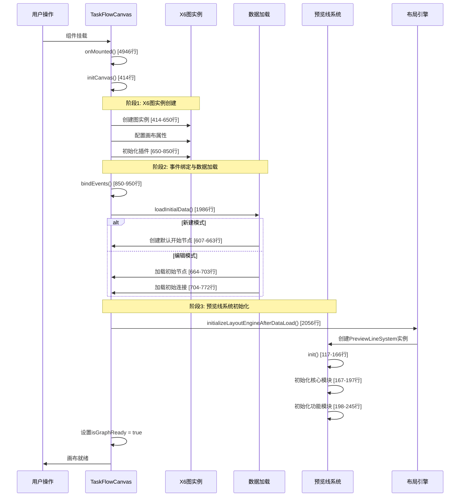

# 画布初始化流程评估文档

## 1. 文档概述

本文档详细分析了TaskFlowCanvas.vue组件在新建和编辑模式下的初始化流程，包括画布创建、数据加载和预览线系统初始化的完整过程。

**分析范围：** TaskFlowCanvas.vue (6275行)
**核心方法：** initCanvas、loadInitialData、initializeLayoutEngineAfterDataLoad
**预览线系统：** PreviewLineSystem.js (2346行)

## 2. 初始化流程概览

### 2.1 整体时序图



## 3. 核心初始化方法详解

### 3.1 onMounted生命周期 [第4946行]

**位置：** `/src/pages/marketing/tasks/components/TaskFlowCanvas.vue:4946`

```javascript
onMounted(() => {
  initCanvas()  // 核心初始化方法
  
  // 事件监听器注册
  window.addEventListener('resize', handleResize)
  window.addEventListener('keydown', handleKeyDown)
})
```

**功能：**
- 触发画布初始化
- 注册全局事件监听器
- 设置组件销毁时的清理逻辑

### 3.2 initCanvas方法 [第414-950行]

**位置：** `/src/pages/marketing/tasks/components/TaskFlowCanvas.vue:414-950`

#### 3.2.1 X6图实例创建 [414-650行]

```javascript
const initCanvas = () => {
  // 创建X6图实例
  graph.value = new Graph({
    container: canvasContainer.value,
    width: canvasSize.width,
    height: canvasSize.height,
    
    // 背景和网格配置
    background: { color: '#f8f9fa' },
    grid: { size: 20, visible: true },
    
    // 交互配置
    selecting: { enabled: true, multiple: true },
    connecting: {
      router: 'orth',           // 正交路由
      connector: 'rounded',     // 圆角连接器
      connectionPoint: 'boundary'
    }
  })
}
```

**关键配置：**
- **画布尺寸：** 动态计算容器尺寸
- **连接线路由：** 使用正交路由（orth）
- **连接器：** 圆角连接器（rounded）
- **自定义连接点：** 根据端口配置精确计算位置

#### 3.2.2 插件初始化 [650-850行]

```javascript
// 导出插件
graph.value.use(new Export())

// 历史记录插件（过滤预览线操作）
graph.value.use(new History({
  enabled: true,
  beforeAddCommand: (event, args) => {
    // 过滤预览线相关操作
    if (args?.cell?.getData?.()?.isPreviewLine) {
      return false
    }
    return true
  }
}))

// 对齐线插件
graph.value.use(new Snapline({ enabled: true }))
```

#### 3.2.3 管理器初始化 [850-950行]

```javascript
// 初始化各种管理器
coordinateSystemManager.value = new CoordinateSystemManager(graph.value)
configDrawerManager.value = new ConfigDrawerManager()
autoLayoutManager.value = new AutoLayoutManager(graph.value)
canvasPanZoomManager.value = new CanvasPanZoomManager(canvasContainer.value)

// 绑定事件
bindEvents()

// 加载初始数据
loadInitialData()
```

### 3.3 loadInitialData方法 [第1986-2055行]

**位置：** `/src/pages/marketing/tasks/components/TaskFlowCanvas.vue:1986-2055`

#### 3.3.1 新建模式 [607-663行]

```javascript
if (props.autoAddStartNode && props.initialNodes.length === 0) {
  console.log('[TaskFlowCanvas] 没有初始节点且启用自动添加，创建默认开始节点')
  const defaultStartNode = {
    id: generateUniqueId('start'),
    type: 'start',
    shape: 'circle',
    component: 'StartNode',
    x: 300,
    y: 200,
    width: 80,
    height: 80
  }
  addNodeToGraph(defaultStartNode)
}
```

**新建模式特点：**
- 自动创建默认开始节点
- 节点位置：(300, 200)
- 节点类型：start
- 无初始连接

#### 3.3.2 编辑模式 [664-772行]

```javascript
// 加载初始节点
if (props.initialNodes.length > 0) {
  console.log('[TaskFlowCanvas] 加载初始节点，数量:', props.initialNodes.length)
  props.initialNodes.forEach(nodeData => {
    addNodeToGraph(nodeData)
  })
}

// 等待节点渲染完成后加载连接
nextTick(async () => {
  if (props.initialConnections.length > 0) {
    props.initialConnections.forEach((connectionData, index) => {
      // 验证源节点和目标节点是否存在
      const sourceNode = graph.getCellById(connectionData.source)
      const targetNode = graph.getCellById(connectionData.target)
      
      if (sourceNode && targetNode) {
        addConnectionToGraph(connectionData)
      }
    })
  }
  
  // 初始化布局引擎
  await initializeLayoutEngineAfterDataLoad()
})
```

**编辑模式特点：**
- 从props加载现有节点数据
- 验证连接的源节点和目标节点存在性
- 使用nextTick确保节点渲染完成
- 异步加载连接数据

### 3.4 预览线系统初始化 [第2056-2300行]

**位置：** `/src/pages/marketing/tasks/components/TaskFlowCanvas.vue:2056-2300`

#### 3.4.1 布局引擎创建

```javascript
const initializeLayoutEngineAfterDataLoad = async () => {
  // 初始化布局引擎
  await configDrawers.value.structuredLayout.initializeLayoutEngine()
  
  // 创建布局引擎实例
  let layoutEngine = null
  if (typeof configDrawers.value.structuredLayout.createLayoutEngineInstance === 'function') {
    layoutEngine = configDrawers.value.structuredLayout.createLayoutEngineInstance(graph)
    
    // 设置全局引用
    window.layoutEngine = layoutEngine
    window.unifiedStructuredLayoutEngine = layoutEngine
  }
}
```

#### 3.4.2 PreviewLineSystem初始化

**PreviewLineSystem位置：** `/src/utils/preview-line/PreviewLineSystem.js:32-166`

```javascript
// 创建PreviewLineSystem实例
const previewLineSystemInstance = new PreviewLineSystem({
  graph: graph,
  system: {
    autoInit: false,
    enableDebug: true,
    enableStats: true,
    enableEvents: true
  }
})

// 手动初始化
const initResult = await previewLineSystem.init()
```

**PreviewLineSystem.init()方法流程：**

1. **核心模块初始化** [167-197行]
   ```javascript
   async initCoreModules() {
     this.eventManager = new EventManager()
     this.configManager = new PreviewLineConfigManager()
     this.stateManager = new StateManager()
     this.previewLineManager = new PreviewLineManager()
   }
   ```

2. **功能模块初始化** [198-245行]
   ```javascript
   async initFunctionalModules() {
     // 样式渲染器
     this.styleRenderer = new StyleRenderer()
     // 主渲染器
     this.renderer = new PreviewLineRenderer()
     // 位置计算器
     this.positionCalculator = new PositionCalculator()
     // 碰撞检测器
     this.collisionDetector = new CollisionDetector()
   }
   ```

3. **模块连接和验证**
   - 建立模块间的依赖关系
   - 注册事件监听器
   - 验证初始化结果

## 4. 新建vs编辑模式对比

| 特性 | 新建模式 | 编辑模式 |
|------|----------|----------|
| **数据来源** | 无初始数据 | props.initialNodes/initialConnections |
| **开始节点** | 自动创建默认开始节点 | 从数据加载现有节点 |
| **节点数量** | 1个（开始节点） | 根据数据动态加载 |
| **连接数量** | 0个 | 根据数据动态加载 |
| **初始化时序** | 同步创建节点 | 异步加载+验证 |
| **预览线** | 立即可用 | 数据加载完成后可用 |

## 5. 关键代码位置汇总

### 5.1 TaskFlowCanvas.vue核心方法

| 方法名 | 行号 | 功能描述 |
|--------|------|----------|
| `onMounted` | 4946 | 组件挂载入口 |
| `initCanvas` | 414-950 | 画布初始化主方法 |
| `loadInitialData` | 1986-2055 | 数据加载方法 |
| `initializeLayoutEngineAfterDataLoad` | 2056-2300 | 预览线系统初始化 |
| `bindEvents` | 850-950 | X6事件绑定 |
| `addNodeToGraph` | 节点添加方法 | 节点添加到图实例 |
| `addConnectionToGraph` | 连接添加方法 | 连接添加到图实例 |

### 5.2 PreviewLineSystem.js核心方法

| 方法名 | 行号 | 功能描述 |
|--------|------|----------|
| `constructor` | 32-115 | 构造函数和配置 |
| `init` | 117-166 | 系统初始化入口 |
| `initCoreModules` | 167-197 | 核心模块初始化 |
| `initFunctionalModules` | 198-245 | 功能模块初始化 |

### 5.3 关键配置位置

| 配置项 | 位置 | 说明 |
|--------|------|------|
| X6图实例配置 | 414-650行 | 画布基础配置 |
| 插件配置 | 650-850行 | 历史记录、对齐线等 |
| 事件绑定 | 1020-1300行 | 节点拖拽、连接等事件 |
| 预览线配置 | PreviewLineSystem.js:32-99 | 预览线系统配置 |

## 6. 初始化性能分析

### 6.1 时间复杂度

- **新建模式：** O(1) - 只创建一个开始节点
- **编辑模式：** O(n+m) - n个节点 + m个连接的加载和验证

### 6.2 关键性能点

1. **异步加载：** 使用nextTick确保DOM渲染完成
2. **节点验证：** 连接创建前验证源节点和目标节点存在
3. **预览线延迟初始化：** 在数据加载完成后初始化，避免空画布操作
4. **事件过滤：** 历史记录插件过滤预览线操作，避免性能影响

## 7. 错误处理机制

### 7.1 初始化错误处理

```javascript
try {
  await initializeLayoutEngineAfterDataLoad()
} catch (error) {
  console.error('[TaskFlowCanvas] 布局引擎初始化失败:', error)
  // 即使出错也要设置初始化完成，避免阻塞后续操作
  isInitializationComplete.value = true
}
```

### 7.2 数据加载错误处理

- 节点加载失败时跳过该节点，继续加载其他节点
- 连接验证失败时记录警告，不中断整体流程
- PreviewLineSystem初始化失败时提供降级方案

## 8. 总结与建议

### 8.1 当前架构优势

1. **清晰的分层结构：** X6图实例 → 数据加载 → 预览线系统
2. **异步初始化：** 避免阻塞UI渲染
3. **错误容错：** 单个模块失败不影响整体功能
4. **模式区分：** 新建和编辑模式有明确的处理逻辑

### 8.2 潜在改进点

1. **初始化状态管理：** 可以添加更细粒度的初始化状态跟踪
2. **性能优化：** 大量节点时可考虑分批加载
3. **错误恢复：** 预览线系统初始化失败时的自动重试机制
4. **调试支持：** 增加更多的初始化过程可视化信息

---

**文档版本：** v1.0  
**生成时间：** 2025-01-16  
**分析文件：** TaskFlowCanvas.vue (6275行), PreviewLineSystem.js (2346行)