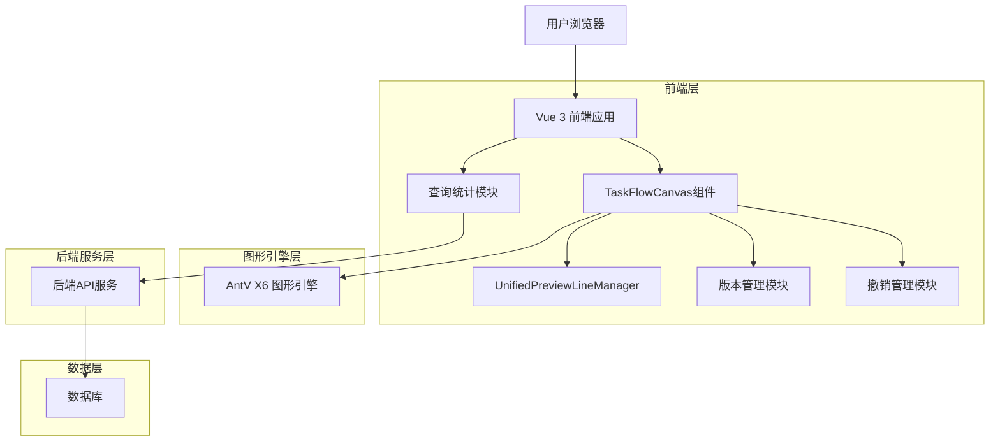
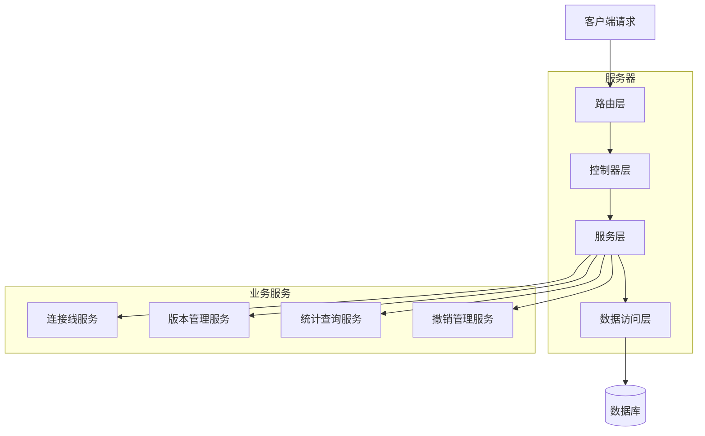
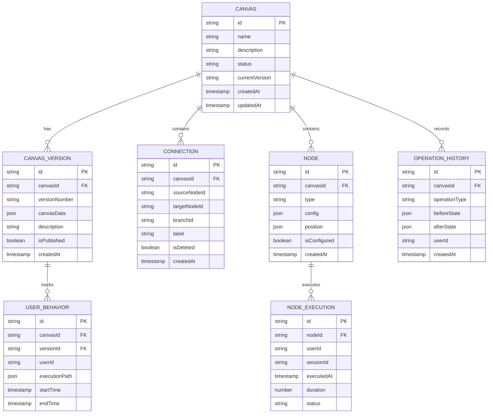

# 画布功能增强技术架构文档

## 1. 架构设计



## 2. 技术描述

- **前端**: Vue 3 + Composition API + AntV X6 + Arco Design + Vite + Mock Data Generator
- **状态管理**: Vuex + 组件内响应式状态
- **图形引擎**: AntV X6 (节点、连接线、预览线管理)
- **后端**: 无（统计模式使用前端Mock）
- **数据库**: 无（统计数据通过前端生成）

## 3. 路由定义

| 路由 | 用途 |
|------|------|
| /marketing/tasks | 画布列表页面，支持查询和统计模式 |
| /marketing/tasks/create | 画布创建页面 |
| /marketing/tasks/edit/:id | 画布编辑页面，支持版本管理和撤销功能 |
| /marketing/tasks/version/:id/:version | 特定版本的画布查看页面 |

## 4. API定义

### 4.1 连接线管理API

**删除连接线**
```
DELETE /api/canvas/:canvasId/connections/:connectionId
```

请求参数:
| 参数名 | 参数类型 | 是否必需 | 描述 |
|--------|----------|----------|------|
| canvasId | string | true | 画布ID |
| connectionId | string | true | 连接线ID |
| restorePreview | boolean | false | 是否恢复预览线 |

响应:
| 参数名 | 参数类型 | 描述 |
|--------|----------|------|
| success | boolean | 操作是否成功 |
| restoredPreviewLines | array | 恢复的预览线列表 |

### 4.2 Mock Data API (前端实现)

统计数据Mock生成器
```javascript
// StatisticsMockGenerator.js
class StatisticsMockGenerator {
  generateStatistics(canvasId, timeRange, nodeType) {
    // 返回模拟统计数据
  }
}
```

Mock数据结构:
| Data Type | Structure | Description |
|-----------|-----------|-------------|
| nodeStats | object    | 节点执行统计（模拟生成） |
| userStats | object    | 用户行为统计（模拟生成） |
| performance | object  | 性能指标（模拟生成） |

Mock数据示例
```json
{
  "nodeStats": {
    "totalExecutions": 1250,
    "successRate": 0.95,
    "avgExecutionTime": 120
  },
  "userStats": {
    "activeUsers": 45,
    "totalSessions": 180
  },
  "performance": {
    "avgLoadTime": 850,
    "errorRate": 0.02
  }
}
```

### 4.3 版本管理API

**创建新版本**
```
POST /api/canvas/:canvasId/versions
```

请求参数:
| 参数名 | 参数类型 | 是否必需 | 描述 |
|--------|----------|----------|------|
| canvasId | string | true | 画布ID |
| baseVersion | string | true | 基础版本号 |
| description | string | false | 版本描述 |

响应:
| 参数名 | 参数类型 | 描述 |
|--------|----------|------|
| versionId | string | 新版本ID |
| versionNumber | string | 版本号 |
| canvasData | object | 画布数据副本 |

### 4.4 撤销管理API

**获取操作历史**
```
GET /api/canvas/:canvasId/operations
```

**执行撤销操作**
```
POST /api/canvas/:canvasId/undo
```

请求参数:
| 参数名 | 参数类型 | 是否必需 | 描述 |
|--------|----------|----------|------|
| operationId | string | true | 操作ID |
| targetState | object | true | 目标状态 |

## 5. 服务器架构图



## 6. 数据模型

### 6.1 数据模型定义



### 6.2 数据定义语言

**画布表 (canvas)**
```sql
CREATE TABLE canvas (
    id VARCHAR(36) PRIMARY KEY DEFAULT (UUID()),
    name VARCHAR(255) NOT NULL,
    description TEXT,
    status ENUM('draft', 'published', 'archived') DEFAULT 'draft',
    current_version VARCHAR(20) DEFAULT 'v1.0.0',
    created_at TIMESTAMP DEFAULT CURRENT_TIMESTAMP,
    updated_at TIMESTAMP DEFAULT CURRENT_TIMESTAMP ON UPDATE CURRENT_TIMESTAMP
);

CREATE INDEX idx_canvas_status ON canvas(status);
CREATE INDEX idx_canvas_created_at ON canvas(created_at DESC);
```

**画布版本表 (canvas_version)**
```sql
CREATE TABLE canvas_version (
    id VARCHAR(36) PRIMARY KEY DEFAULT (UUID()),
    canvas_id VARCHAR(36) NOT NULL,
    version_number VARCHAR(20) NOT NULL,
    canvas_data JSON NOT NULL,
    description TEXT,
    is_published BOOLEAN DEFAULT FALSE,
    created_at TIMESTAMP DEFAULT CURRENT_TIMESTAMP,
    FOREIGN KEY (canvas_id) REFERENCES canvas(id) ON DELETE CASCADE,
    UNIQUE KEY uk_canvas_version (canvas_id, version_number)
);

CREATE INDEX idx_canvas_version_canvas_id ON canvas_version(canvas_id);
CREATE INDEX idx_canvas_version_published ON canvas_version(is_published);
```

**连接线表 (connection)**
```sql
CREATE TABLE connection (
    id VARCHAR(36) PRIMARY KEY DEFAULT (UUID()),
    canvas_id VARCHAR(36) NOT NULL,
    source_node_id VARCHAR(36) NOT NULL,
    target_node_id VARCHAR(36) NOT NULL,
    branch_id VARCHAR(50),
    label VARCHAR(100),
    is_deleted BOOLEAN DEFAULT FALSE,
    created_at TIMESTAMP DEFAULT CURRENT_TIMESTAMP,
    FOREIGN KEY (canvas_id) REFERENCES canvas(id) ON DELETE CASCADE
);

CREATE INDEX idx_connection_canvas_id ON connection(canvas_id);
CREATE INDEX idx_connection_source ON connection(source_node_id);
CREATE INDEX idx_connection_target ON connection(target_node_id);
```

**用户行为表 (user_behavior)**
```sql
CREATE TABLE user_behavior (
    id VARCHAR(36) PRIMARY KEY DEFAULT (UUID()),
    canvas_id VARCHAR(36) NOT NULL,
    version_id VARCHAR(36) NOT NULL,
    user_id VARCHAR(36) NOT NULL,
    execution_path JSON NOT NULL,
    start_time TIMESTAMP NOT NULL,
    end_time TIMESTAMP,
    FOREIGN KEY (canvas_id) REFERENCES canvas(id) ON DELETE CASCADE,
    FOREIGN KEY (version_id) REFERENCES canvas_version(id) ON DELETE CASCADE
);

CREATE INDEX idx_user_behavior_canvas_id ON user_behavior(canvas_id);
CREATE INDEX idx_user_behavior_user_id ON user_behavior(user_id);
CREATE INDEX idx_user_behavior_start_time ON user_behavior(start_time DESC);
```

**节点执行表 (node_execution)**
```sql
CREATE TABLE node_execution (
    id VARCHAR(36) PRIMARY KEY DEFAULT (UUID()),
    node_id VARCHAR(36) NOT NULL,
    user_id VARCHAR(36) NOT NULL,
    session_id VARCHAR(36) NOT NULL,
    executed_at TIMESTAMP DEFAULT CURRENT_TIMESTAMP,
    duration INT DEFAULT 0,
    status ENUM('success', 'error', 'timeout') DEFAULT 'success'
);

CREATE INDEX idx_node_execution_node_id ON node_execution(node_id);
CREATE INDEX idx_node_execution_user_id ON node_execution(user_id);
CREATE INDEX idx_node_execution_executed_at ON node_execution(executed_at DESC);
```

**操作历史表 (operation_history)**
```sql
CREATE TABLE operation_history (
    id VARCHAR(36) PRIMARY KEY DEFAULT (UUID()),
    canvas_id VARCHAR(36) NOT NULL,
    operation_type ENUM('create_node', 'delete_node', 'create_connection', 'delete_connection', 'configure_node') NOT NULL,
    before_state JSON,
    after_state JSON NOT NULL,
    user_id VARCHAR(36) NOT NULL,
    created_at TIMESTAMP DEFAULT CURRENT_TIMESTAMP,
    FOREIGN KEY (canvas_id) REFERENCES canvas(id) ON DELETE CASCADE
);

CREATE INDEX idx_operation_history_canvas_id ON operation_history(canvas_id);
CREATE INDEX idx_operation_history_created_at ON operation_history(created_at DESC);
```

**初始化数据**
```sql
-- 插入示例画布数据
INSERT INTO canvas (id, name, description, status) VALUES 
('canvas_001', '用户注册流程', '新用户注册和激活流程', 'published'),
('canvas_002', '营销活动流程', '营销活动执行和跟踪流程', 'draft');

-- 插入版本数据
INSERT INTO canvas_version (canvas_id, version_number, canvas_data, is_published) VALUES 
('canvas_001', 'v1.0.0', '{"nodes": [], "connections": []}', true),
('canvas_001', 'v1.1.0', '{"nodes": [], "connections": []}', false);
```