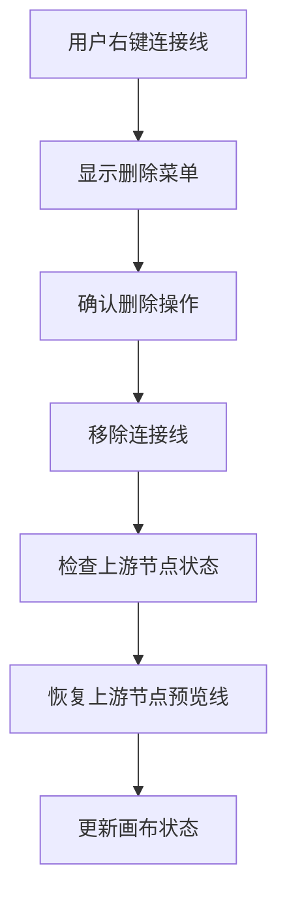
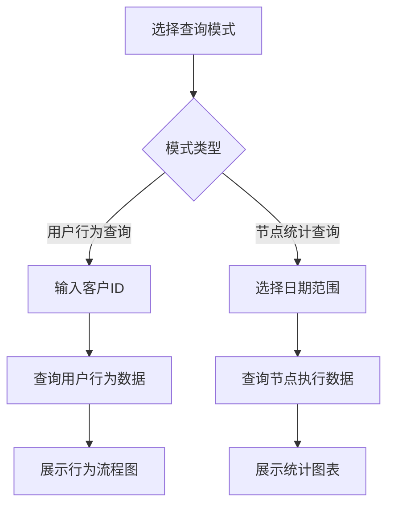
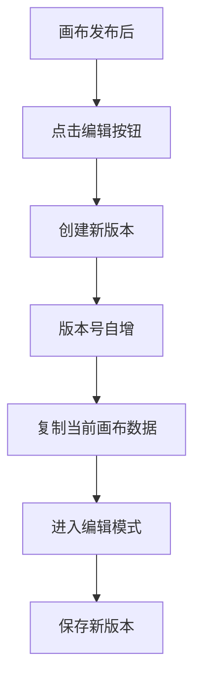

# 画布功能增强需求文档

## 1. 产品概述

本文档针对营销任务画布系统的5个核心功能增强需求，基于现有的TaskFlowCanvas.vue和UnifiedPreviewLineManager.js架构，提供详细的需求分析和技术实现方案。画布系统采用Vue 3 + AntV X6架构，支持可视化流程编辑、节点配置和预览线管理。

## 2. 核心功能需求

### 2.1 用户角色

| 角色 | 权限描述 | 核心功能 |
|------|----------|----------|
| 画布编辑者 | 创建、编辑、保存画布 | 节点操作、连接管理、版本控制 |
| 画布管理员 | 发布、版本管理、数据查询 | 版本发布、统计查询、用户行为分析 |
| 数据分析师 | 查看统计数据、导出报告 | 节点执行统计、用户行为分析 |

### 2.2 功能模块

本次需求涉及以下5个核心功能模块：

1. **连接线删除与预览线恢复模块**：实现连接线的安全删除和上游节点预览线的智能恢复
2. **画布查询与统计模块**：支持基于客户ID的用户行为查询和节点执行统计
3. **关键节点撤销模块**：提供精细化的节点操作撤销功能
4. **画布版本管理模块**：实现画布的版本控制和多版本切换
5. **预览线样式统一模块**：统一预览线的视觉表现

### 2.3 页面详情

| 页面名称 | 模块名称 | 功能描述 |
|----------|----------|----------|
| **画布编辑页面** | 连接线管理 | 右键删除连接线、自动恢复上游预览线、连接状态同步 |
| **画布编辑页面** | 撤销操作面板 | 关键节点操作历史、选择性撤销、操作预览 |
| **画布编辑页面** | 版本控制栏 | 版本创建、版本切换、版本对比、发布管理 |
| **画布列表页面** | 查询模式面板 | 客户ID输入、行为流程展示、路径分析 |
| **画布列表页面** | 统计模式面板 | 日期范围选择、节点执行统计、多版本数据对比 |
| **画布编辑页面** | 预览线样式 | 统一颜色配置、样式管理、视觉一致性 |

## 3. 核心流程

### 3.1 连接线删除流程

### 3.2 查询统计流程

### 3.3 版本管理流程

## 4. 用户界面设计

### 4.1 设计风格

- **主色调**：#1890ff（主蓝色）、#52c41a（成功绿）、#ff4d4f（警告红）
- **按钮样式**：圆角按钮，4px圆角，阴影效果
- **字体**：PingFang SC、Helvetica Neue，主要字号14px、12px
- **布局风格**：卡片式布局，顶部导航，左侧工具栏
- **图标风格**：线性图标，统一使用Arco Design图标库

### 4.2 页面设计概览

| 页面名称 | 模块名称 | UI元素 |
|----------|----------|--------|
| **画布编辑页面** | 连接线右键菜单 | 删除按钮、确认对话框、操作提示 |
| **画布编辑页面** | 撤销操作面板 | 操作历史列表、撤销按钮、预览区域 |
| **画布编辑页面** | 版本控制栏 | 版本下拉选择、新建版本按钮、发布按钮 |
| **画布列表页面** | 查询面板 | 模式切换标签、输入框、查询按钮、结果展示区 |
| **画布编辑页面** | 预览线配置 | 颜色选择器、样式预览、应用按钮 |

### 4.3 响应式设计

采用桌面优先的响应式设计，支持1920px、1440px、1024px等主流分辨率，确保在不同屏幕尺寸下的良