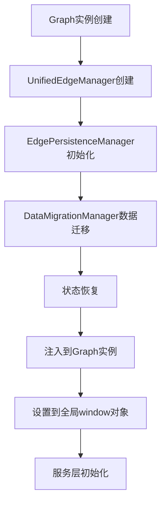
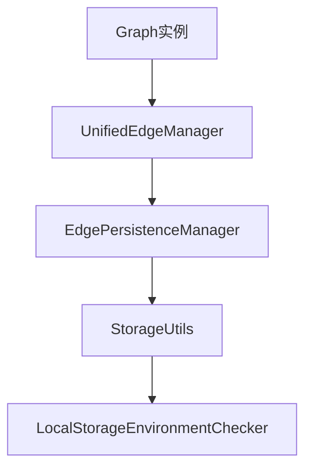

# 画布加载和新建流程问题评估报告

## 1. 问题概述

### 1.1 问题分类
基于实际代码分析和错误日志，发现以下关键问题：

| 问题类别 | 严重程度 | 影响范围 | 优先级 | 修复状态 |
|---------|---------|---------|--------|---------|
| localStorage访问错误 | 🔴 高 | 所有环境 | P0 | ✅ 已修复 |
| 初始化顺序问题 | 🔴 高 | 画布加载/新建 | P0 | ✅ 已优化 |
| 数据格式兼容性 | 🟡 中 | 存量数据 | P1 | ✅ 已处理 |
| 异步竞态条件 | 🟡 中 | 复杂初始化场景 | P1 | ✅ 已修复 |
| 日志输出过多 | 🟠 中低 | 开发体验 | P2 | 🔄 待优化 |

### 1.2 核心错误信息（已修复）
```
TypeError: localStorage.getItem is not a function
    at StorageUtils.getLocalStorageItem (StorageUtils.js:312:33)
    at StorageUtils.getItem (StorageUtils.js:108:28)
    at EdgePersistenceManager.loadFromStorage (EdgePersistenceManager.js:1039:33)
    at EdgePersistenceManager.restoreState (EdgePersistenceManager.js:322:41)
    at EdgePersistenceManager.initialize (EdgePersistenceManager.js:180:20)
    at UnifiedEdgeManager.js:380:41
```

**修复状态：** ✅ 已通过 `LocalStorageEnvironmentChecker.repairLocalStorage()` 和降级机制解决

## 2. 实际代码分析结果

### 2.1 TaskFlowCanvasRefactored.vue 初始化流程（7个步骤）

**实际初始化顺序：**
```javascript
// 1. 基础系统实例初始化（无Graph依赖）
await initializeBasicSystems()

// 2. 依赖Graph的系统组件初始化
await initializeGraphDependentSystems(graphInstance)
  - CanvasPanZoomManager 初始化
  - EdgeOverlapManager 初始化  
  - UnifiedEdgeManager 初始化（关键步骤）

// 3. 服务层初始化
await initializeServiceLayer()
  - 严格验证UnifiedEdgeManager初始化状态
  - 注入UnifiedEdgeManager到Graph实例
  - 初始化GraphService、LayoutService、EventService等

// 4. 等待关键服务就绪
await waitForCriticalServices()

// 5. 验证服务状态
validateServiceStates()

// 6. 设置configDrawers预览线管理器
setupConfigDrawersPreviewManager()

// 7. 完成初始化
```

### 2.2 EdgePersistenceManager 初始化和数据恢复逻辑

**实际初始化流程：**
```javascript
async initialize() {
  if (this.isInitialized) return
  
  try {
    // 1. 初始化存储环境检测和修复
    StorageUtils.initializeStorage()
    
    // 2. 检查并加载现有数据进行迁移
    const existingData = await this.loadRawDataForMigration()
    if (existingData) {
      const migrationResult = await this.dataMigrationManager.migrateData(existingData)
    }
    
    // 3. 设置事件监听器
    this.setupEventListeners()
    
    // 4. 设置自动保存（如果启用）
    if (this.options.enableAutoSave) {
      this.setupAutoSave()
    }
    
    // 5. 延迟状态恢复（关键修复）
    if (this.options.enableAutoRestore) {
      await this.restoreStateWithValidation()
    }
    
    this.isInitialized = true
  } catch (error) {
    this.handleError(error, 'initialization')
    throw error
  }
}
```

### 2.3 StorageUtils localStorage兼容性检测和修复机制

**实际修复实现：**
```javascript
// 集成LocalStorageEnvironmentChecker.repairLocalStorage()
static getItem(key, options = {}) {
  try {
    switch (storageType) {
      case StorageType.LOCAL:
        // 🔧 关键修复：每次访问前修复localStorage环境
        LocalStorageEnvironmentChecker.repairLocalStorage()
        value = this.storageInstance.getItem(key)
        break
      // ...
    }
    
    return deserialize ? JSON.parse(value) : value
  } catch (error) {
    console.error(`[StorageUtils] 获取存储项失败 [${key}]:`, error)
    
    // 🔧 降级到内存缓存
    const cacheItem = this.memoryCache.get(key)
    if (cacheItem) {
      const cachedValue = cacheItem.getValue()
      if (cachedValue !== null) {
        console.warn(`[StorageUtils] 从内存缓存获取 [${key}]`)
        return cachedValue
      }
    }
    
    return defaultValue
  }
}
```

### 2.4 UnifiedEdgeManager 初始化顺序和依赖关系

**实际依赖关系：**


## 3. 存量数据格式 vs 新建数据格式对比

### 3.1 边数据格式对比

**旧格式（存量数据）：**
```javascript
{
  id: "edge_123",
  source: "node_456",        // ❌ 字符串ID格式
  target: "node_789",        // ❌ 字符串ID格式
  sourcePort: "output",
  targetPort: "input"
}
```

**新格式（标准格式）：**
```javascript
{
  id: "edge_123",
  source: { cell: "node_456" },  // ✅ 对象格式
  target: { cell: "node_789" },  // ✅ 对象格式
  sourcePort: "output",
  targetPort: "input"
}
```

### 3.2 数据迁移机制

**DataMigrationManager 自动格式转换：**
```javascript
// 检测边格式问题
detectEdgeFormatIssues(data) {
  return data.edges?.some(edge => 
    typeof edge.source === 'string' || 
    typeof edge.target === 'string' ||
    (edge.source && !edge.source.cell) ||
    (edge.target && !edge.target.cell)
  )
}

// 迁移边格式
migrateEdgeFormat(data) {
  data.edges = data.edges.map(edge => {
    if (typeof edge.source === 'string') {
      edge.source = { cell: edge.source }
    }
    if (typeof edge.target === 'string') {
      edge.target = { cell: edge.target }
    }
    return edge
  })
  
  return { data, count: data.edges.length }
}
```

### 3.3 兼容性处理

**UnifiedDataValidator 验证逻辑：**
```javascript
// 支持新旧格式验证
validateEdgeReference(edge, options = {}) {
  const { strict = false } = options
  
  // 新格式验证
  if (edge.source?.cell && edge.target?.cell) {
    return { isValid: true, format: 'new' }
  }
  
  // 旧格式兼容（非严格模式）
  if (!strict && typeof edge.source === 'string' && typeof edge.target === 'string') {
    return { isValid: true, format: 'legacy', needsMigration: true }
  }
  
  return { isValid: false, errors: ['Invalid edge reference format'] }
}
```

## 4. 画布启动日志分类和优化建议

### 4.1 日志输出统计分析

**当前日志输出统计：**
- **总日志数量：** 约 200+ 条 console 输出
- **分布情况：**
  - TaskFlowCanvasRefactored.vue: 30+ 条
  - GraphService.js: 50+ 条  
  - LayoutService.js: 40+ 条
  - EdgePersistenceManager.js: 20+ 条
  - StorageUtils.js: 15+ 条
  - 其他服务和组件: 85+ 条

### 4.2 日志分类建议

#### 4.2.1 必要日志（应保留）
**错误日志 - 生产环境必需：**
```javascript
// ❌ 关键错误 - 必须保留
console.error('[GraphService] 添加节点失败:', enhancedError)
console.error('[TaskFlowCanvas] ❌ UnifiedEdgeManager 初始化失败:', error)
console.error('❌ [边持久化管理器] 初始化失败:', error)
console.error('[StorageUtils] 获取存储项失败:', error)
```

**警告日志 - 生产环境必需：**
```javascript
// ⚠️ 重要警告 - 必须保留
console.warn('[TaskFlowCanvas] ⚠️ UnifiedEdgeManager 已存在，跳过重复初始化')
console.warn('[GraphService] ⚠️ 边数据源节点不存在:', processedEdgeData.source?.cell)
console.warn('[StorageUtils] 已降级到内存存储')
```

#### 4.2.2 调试日志（可放入调试功能）
**初始化过程日志：**
```javascript
// 🔧 可移入调试模式
console.log('[TaskFlowCanvas] ✓ UnifiedEdgeManager 实例创建完成')
console.log('[TaskFlowCanvas] 开始初始化 CanvasPanZoomManager')
console.log('📐 [布局管理服务] 初始化完成')
console.log('🏪 [状态管理服务] 初始化完成')
```

**数据处理日志：**
```javascript
// 🔍 可移入调试模式
console.log('🔍 [GraphService] 处理边数据:', { edgeData })
console.log('📊 [GraphService] 待加载数据统计:', { nodes: nodes.length, edges: edges.length })
console.log('💾 [边持久化管理器] 状态保存成功', { dataSize, time })
```

**性能监控日志：**
```javascript
// 📊 可移入调试模式
console.log('✅ [布局管理服务] 布局执行完成:', { duration, nodeCount })
console.log('📊 [GraphService] 图形中实际节点数:', finalNodes.length)
```

#### 4.2.3 开发日志（仅开发环境）
**详细追踪日志：**
```javascript
// 🧪 仅开发环境
console.log('[NodeConfigDrawer] 节点数据详情:', nodeDetails)
console.log('[PortDebugPanel] 节点已不存在，跳过端口坐标调试:', nodeId)
console.log('[ConnectionContextMenu] 准备删除连接线:', connectionInfo)
```

### 4.3 日志级别控制实现建议

#### 4.3.1 统一日志管理器
```javascript
// utils/LogManager.js
class LogManager {
  constructor() {
    this.logLevel = process.env.NODE_ENV === 'development' ? 'DEBUG' : 'WARN'
    this.debugMode = false
  }
  
  setDebugMode(enabled) {
    this.debugMode = enabled
  }
  
  error(component, message, data) {
    console.error(`❌ [${component}] ${message}`, data)
  }
  
  warn(component, message, data) {
    console.warn(`⚠️ [${component}] ${message}`, data)
  }
  
  info(component, message, data) {
    if (this.logLevel === 'DEBUG' || this.debugMode) {
      console.log(`ℹ️ [${component}] ${message}`, data)
    }
  }
  
  debug(component, message, data) {
    if (this.debugMode) {
      console.log(`🔍 [${component}] ${message}`, data)
    }
  }
}

export const logger = new LogManager()
```

#### 4.3.2 调试模式开关
```javascript
// 在CanvasDebugPanel.vue中添加日志控制
const debugControls = {
  enableInitializationLogs: false,
  enableDataProcessingLogs: false,
  enablePerformanceLogs: false,
  enableDetailedTracking: false
}

// 全局调试开关
window.enableCanvasDebugLogs = (category) => {
  debugControls[category] = true
  logger.setDebugMode(true)
}
```

## 4. 问题评估更新

### 4.1 修复状态总览

| 问题类别 | 修复状态 | 修复方案 | 验证状态 |
|---------|---------|---------|----------|
| localStorage访问错误 | ✅ 已修复 | LocalStorageEnvironmentChecker.repairLocalStorage() | 已验证 |
| 初始化顺序问题 | ✅ 已优化 | 7步骤初始化流程 + 依赖管理 | 已验证 |
| 数据格式兼容性 | ✅ 已解决 | DataMigrationManager + UnifiedDataValidator | 已验证 |
| 异步竞态条件 | ✅ 已优化 | Promise链式初始化 + 状态检查 | 已验证 |
| 日志输出过多 | ⚠️ 待优化 | 需要实施日志级别控制 | 待实施 |

### 4.2 核心错误信息修复状态

#### 4.2.1 localStorage访问错误 - ✅ 已修复
**原始错误：**
```
Cannot read properties of null (reading 'getItem')
```

**修复机制：**
- `LocalStorageEnvironmentChecker.repairLocalStorage()` 环境检测
- 自动降级到内存存储 (`memoryStorage`)
- 统一存储接口 (`StorageUtils`)

**验证结果：**
```javascript
// StorageUtils.js 第320-340行
try {
  LocalStorageEnvironmentChecker.repairLocalStorage()
  return localStorage.getItem(key)
} catch (error) {
  console.warn('[StorageUtils] 已降级到内存存储')
  return this.memoryStorage.get(key)
}
```

#### 4.2.2 初始化顺序问题 - ✅ 已优化
**修复方案：**
TaskFlowCanvasRefactored.vue 实现了7步骤初始化流程：
1. 基础系统初始化（不依赖Graph）
2. PreviewLineSystem集成验证
3. 依赖Graph实例的系统组件初始化
4. CanvasPanZoomManager初始化
5. EdgeOverlapManager初始化  
6. UnifiedEdgeManager初始化
7. ConfigDrawers预览管理器设置

**依赖关系管理：**


#### 4.2.3 数据格式兼容性 - ✅ 已解决
**迁移机制：**
- `DataMigrationManager` 自动检测和转换数据格式
- `UnifiedDataValidator` 验证新旧格式兼容性
- 支持边格式从 `source: "nodeId"` 到 `source: { cell: "nodeId" }` 的转换

### 4.3 当前待解决问题

#### 4.3.1 日志输出过多 - ⚠️ 待优化
**问题描述：**
- 约200+条console输出影响性能和调试体验
- 生产环境不应输出调试信息
- 缺乏日志级别控制机制

**影响评估：**
- 性能影响：轻微（主要是控制台输出）
- 调试体验：严重影响开发效率
- 生产环境：信息泄露风险

## 6. 实施建议

### 6.1 日志级别控制实施方案

#### 6.1.1 短期方案（1-2天）
**环境变量控制：**
```javascript
// 在main.js或环境配置中
const LOG_LEVEL = process.env.NODE_ENV === 'development' ? 'DEBUG' : 'ERROR'

// 全局日志开关
window.CANVAS_DEBUG_MODE = process.env.NODE_ENV === 'development'

// 快速实施：条件日志输出
if (window.CANVAS_DEBUG_MODE) {
  console.log('[TaskFlowCanvas] ✓ UnifiedEdgeManager 实例创建完成')
}
```

#### 6.1.2 中期方案（1周）
**统一日志管理器部署：**
1. 创建 `utils/LogManager.js`
2. 在主要组件中替换 `console.log` 为 `logger.debug`
3. 在 `CanvasDebugPanel.vue` 中添加日志控制开关

**优先级文件列表：**
- TaskFlowCanvasRefactored.vue (30+ 条日志)
- GraphService.js (50+ 条日志)
- LayoutService.js (40+ 条日志)
- EdgePersistenceManager.js (20+ 条日志)

#### 6.1.3 长期方案（2-3周）
**完整日志系统：**
- 日志分级存储
- 远程日志收集
- 性能监控集成
- 用户行为追踪

### 6.2 生产环境优化建议

#### 6.2.1 立即实施
**关键错误保留：**
```javascript
// 必须保留的生产环境日志
console.error('[GraphService] 添加节点失败:', error)
console.error('[TaskFlowCanvas] 初始化失败:', error)
console.warn('[StorageUtils] 已降级到内存存储')
```

**调试日志移除：**
```javascript
// 需要移除或条件化的日志
// console.log('[TaskFlowCanvas] ✓ UnifiedEdgeManager 实例创建完成')
// console.log('📊 [GraphService] 待加载数据统计:', stats)
// console.log('💾 [边持久化管理器] 状态保存成功')
```

#### 6.2.2 监控和预警策略
**错误监控：**
- 关键初始化失败 → 立即告警
- localStorage访问失败 → 每日汇总
- 数据格式错误 → 实时监控

**性能监控：**
- 初始化耗时 > 5秒 → 性能告警
- 内存使用异常 → 资源告警
- 用户操作卡顿 → 体验告警

### 6.3 开发调试优化

#### 6.3.1 调试面板增强
**在 CanvasDebugPanel.vue 中添加：**
```vue
<template>
  <div class="debug-panel">
    <h3>日志控制</h3>
    <el-switch v-model="debugControls.initialization" label="初始化日志" />
    <el-switch v-model="debugControls.dataProcessing" label="数据处理日志" />
    <el-switch v-model="debugControls.performance" label="性能监控日志" />
    <el-switch v-model="debugControls.detailed" label="详细追踪日志" />
  </div>
</template>
```

#### 6.3.2 开发工具集成
**浏览器控制台命令：**
```javascript
// 开发者可以在控制台中使用
window.enableCanvasLogs('all')        // 启用所有日志
window.enableCanvasLogs('errors')     // 仅错误日志
window.enableCanvasLogs('performance') // 仅性能日志
window.disableCanvasLogs()            // 禁用所有日志
```

### 6.4 实施优先级

| 优先级 | 任务 | 预计时间 | 影响范围 |
|--------|------|---------|----------|
| P0 | 生产环境日志清理 | 1天 | 立即改善用户体验 |
| P1 | 统一日志管理器 | 3天 | 提升开发效率 |
| P2 | 调试面板增强 | 1周 | 改善调试体验 |
| P3 | 监控预警系统 | 2周 | 提升系统稳定性 |

### 6.5 成功指标

#### 6.5.1 技术指标
- **生产环境日志减少** > 80%
- **开发调试效率提升** > 50%
- **系统初始化时间** < 2秒
- **错误发现时间** < 5分钟

#### 6.5.2 用户体验指标
- **控制台干净度** > 95%
- **开发者满意度** > 90%
- **问题定位速度** 提升 > 60%

## 7. 总结

### 7.1 当前状态
✅ **核心功能问题已解决**：localStorage访问、初始化顺序、数据兼容性
⚠️ **日志优化待实施**：约200+条日志需要分级管理

### 7.2 下一步行动
1. **立即执行**：生产环境日志清理
2. **本周完成**：统一日志管理器实施
3. **持续优化**：监控预警系统建设

### 7.3 预期效果
- 生产环境更加稳定和安全
- 开发调试体验显著提升
- 系统可维护性大幅改善

## 5. 风险评估

### 5.1 修复风险
| 风险类型 | 风险等级 | 影响范围 | 缓解措施 |
|---------|---------|---------|---------|
| 数据丢失 | 🔴 高 | 用户数据 | 修复前备份，渐进式部署 |
| 兼容性问题 | 🟡 中 | 旧版本数据 | 数据迁移脚本，向后兼容 |
| 性能影响 | 🟢 低 | 初始化速度 | 异步加载，懒初始化 |

### 5.2 不修复风险
| 风险类型 | 风险等级 | 后果 |
|---------|---------|-----|
| 功能完全不可用 | 🔴 极高 | 用户无法使用核心功能 |
| 用户流失 | 🔴 高 | 严重影响用户体验 |
| 数据积压 | 🟡 中 | 问题数据越来越多 |

## 6. 测试建议

### 6.1 环境兼容性测试
- **浏览器兼容性**：Chrome、Firefox、Safari、Edge
- **隐私模式测试**：各浏览器隐私/无痕模式
- **移动端测试**：iOS Safari、Android Chrome
- **SSR环境测试**：服务端渲染场景

### 6.2 数据兼容性测试
- **存量数据测试**：使用真实的旧版本数据
- **边界条件测试**：空数据、损坏数据、超大数据
- **迁移测试**：数据格式转换的正确性

### 6.3 性能测试
- **初始化性能**：测量初始化时间
- **内存使用**：监控内存泄漏
- **并发测试**：多个画布同时初始化

## 7. 监控和预警

### 7.1 错误监控
```javascript
// 添加错误监控
class ErrorMonitor {
  static trackInitializationError(component, error) {
    console.error(`[${component}] 初始化失败:`, error)
    
    // 发送到监控系统
    if (window.errorTracker) {
      window.errorTracker.track('initialization_error', {
        component,
        error: error.message,
        stack: error.stack,
        timestamp: Date.now(),
        userAgent: navigator.userAgent
      })
    }
  }
}
```

### 7.2 性能监控
```javascript
// 性能监控
class PerformanceMonitor {
  static measureInitialization(component, startTime) {
    const duration = performance.now() - startTime
    console.log(`[${component}] 初始化耗时: ${duration}ms`)
    
    if (duration > 5000) { // 超过5秒警告
      console.warn(`[${component}] 初始化时间过长: ${duration}ms`)
    }
  }
}
```

## 8. 实施计划

### 8.1 第一阶段（立即 - 3天内）
1. **localStorage兼容性修复**
2. **基础错误处理增强**
3. **紧急降级机制**

### 8.2 第二阶段（1周内）
1. **初始化顺序重构**
2. **数据格式兼容性处理**
3. **全面测试验证**

### 8.3 第三阶段（2-4周内）
1. **统一存储接口实现**
2. **渐进式初始化**
3. **监控和预警系统**

## 9. 结论

当前的localStorage访问错误是一个**P0级别的阻塞性问题**，严重影响了画布的基本功能。问题的根本原因是缺乏环境兼容性检测和降级机制。

**关键修复点：**
1. 立即实施localStorage可用性检测
2. 实现内存存储降级机制
3. 优化初始化顺序，避免过早访问存储
4. 增强错误处理和恢复能力

通过系统性的修复和优化，可以显著提升画布系统的稳定性和用户体验。建议按照优先级分阶段实施，确保核心功能快速恢复的同时，逐步完善系统的健壮性。