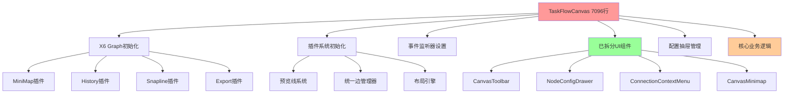
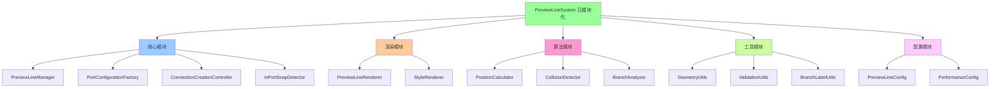
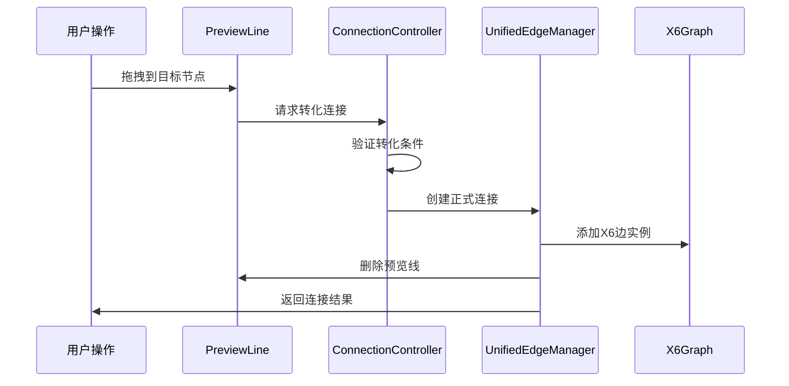
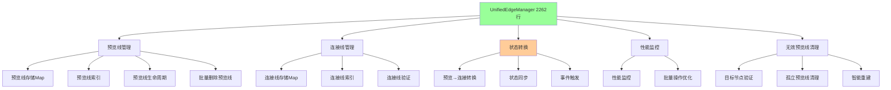
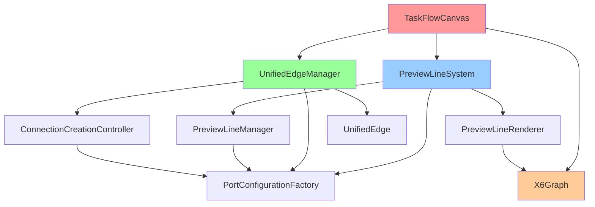
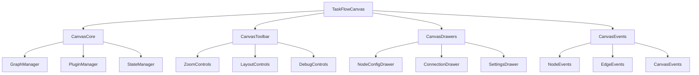
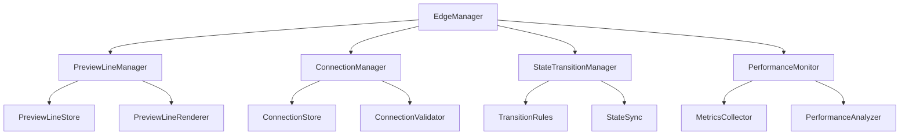

# 画布系统功能架构评估报告

## 1. 系统概述

本报告对营销任务画布系统的核心功能模块进行深入分析，重点评估画布初始化、预览线生成、连接线转化等功能的架构合理性和模块独立性。

### 1.1 评估范围

- **画布初始化功能** - TaskFlowCanvas组件及其初始化流程
- **预览线生成功能** - PreviewLineSystem及相关核心模块
- **连接线转化功能** - 预览线到正式连接的转换机制
- **统一边管理** - UnifiedEdgeManager的集成管理功能

## 2. 功能模块分析

### 2.1 画布初始化功能

#### 2.1.1 核心组件现状
- **TaskFlowCanvas.vue** - 主画布组件（**仍为7096行代码，未拆分**）
- **task-editor.vue** - 任务编辑页面，包含画布容器
- **X6Config.js** - X6图形库配置管理
- **CanvasConfig.js** - 画布基础配置
- **CanvasPanZoomManager.js** - 画布交互管理

#### 2.1.2 组件拆分状态
**已拆分的子组件：**
- ✅ **NodeConfigDrawer.vue** - 节点配置抽屉（独立组件）
- ✅ **ConnectionContextMenu.vue** - 连接线右键菜单
- ✅ **NodeTypeSelector.vue** - 节点类型选择器
- ✅ **CanvasToolbar.vue** - 画布工具栏
- ✅ **CanvasMinimap.vue** - 小地图组件
- ✅ **CanvasHistoryPanel.vue** - 历史面板
- ✅ **CanvasDebugPanel.vue** - 调试面板
- ✅ **TaskFlowConfigDrawers.vue** - 统一配置抽屉

**仍需拆分的功能模块：**
- ❌ **画布核心逻辑** - 仍在TaskFlowCanvas.vue中（约5000+行）
- ❌ **事件处理系统** - 分散在主组件中
- ❌ **状态管理逻辑** - 大量ref变量未抽象

#### 2.1.3 职责分析


#### 2.1.4 问题识别
1. **🔴 核心组件仍然过于庞大** - TaskFlowCanvas.vue仍为7096行，虽然UI组件已拆分，但核心逻辑未分离
2. **🟡 部分功能已模块化** - UI组件拆分良好，但业务逻辑耦合严重
3. **🔴 状态管理分散** - 画布状态仍散布在多个ref变量中，缺乏统一管理

### 2.2 预览线生成功能

#### 2.2.1 拆分重构状态
**✅ 已完成模块化拆分：**
- **PreviewLineSystem.js** - 系统主入口（已拆分为模块化架构）
- **核心模块目录** - `/src/utils/preview-line/core/`
- **渲染模块目录** - `/src/utils/preview-line/renderers/`
- **算法模块目录** - `/src/utils/preview-line/algorithms/`
- **配置模块目录** - `/src/utils/preview-line/config/`

**📋 拆分计划文档：**
- **PREVIEW_LINE_REFACTOR_PLAN.md** - 详细的拆分重构方案
- 计划将UnifiedPreviewLineManager（10,437行）拆分为多个专职模块

#### 2.2.2 当前架构状态


#### 2.2.3 UnifiedEdgeManager集成状态
**🔄 当前状态：** UnifiedEdgeManager已集成预览线管理功能
- **预览线创建** - `createPreviewLine()`, `createPreviewLineDirectly()`
- **预览线删除** - `removePreviewLines()`, 批量删除支持
- **预览线验证** - `hasPreviewLine()`, `hasExistingPreviewLine()`
- **无效预览线清理** - `cleanupInvalidPreviewLines()` (新增功能)

#### 2.2.4 优势分析
1. **✅ 模块化设计已实现** - PreviewLineSystem采用了良好的模块化设计
2. **✅ 可扩展性良好** - 插件化架构支持功能扩展
3. **✅ 错误处理完善** - 递归保护和异常恢复机制
4. **✅ 无效预览线清理** - 新增自动清理无效预览线功能

### 2.3 连接线转化功能

#### 2.3.1 转化流程


#### 2.3.2 关键组件
- **ConnectionCreationController** - 连接创建逻辑
- **UnifiedEdgeManager** - 统一边管理
- **PortConfigurationFactory** - 端口配置验证
- **PreviewLineRenderer** - 预览线清理

### 2.4 统一边管理功能

#### 2.4.1 UnifiedEdgeManager架构决策
**🎯 架构决策：** 基于业务需求分析，预览线和连接线将保持统一管理，不进行单独模块拆分
- **文件大小** - 约2262行代码，功能完整且职责明确
- **业务逻辑关系** - 预览线和连接线是相互转化的关系：
  - 有源节点和目标节点时 → 连接线
  - 只有源节点没有目标节点时 → 预览线
  - 预览线末端支持拖拽和吸附，吸附后转化为连接线
- **统一管理优势** - 状态转换逻辑紧密耦合，统一管理避免状态同步问题
- **重构方向** - 优化内部结构和性能，保持统一的状态转换管理

#### 2.4.2 统一管理架构优势


#### 2.4.3 核心功能增强
- **✅ 统一存储管理** - 预览线和连接线的统一存储
- **✅ 状态转换控制** - 预览线到连接线的状态转换
- **✅ 性能监控** - 操作性能监控和优化
- **✅ 事件管理** - 边相关事件的统一处理
- **🆕 无效预览线清理** - 自动检测并清理目标节点不存在的预览线
- **🆕 批量操作优化** - 支持批量删除和创建预览线

#### 2.4.4 待解决问题
1. **🔴 职责仍然过重** - 同时管理预览线和连接线，违反单一职责原则
2. **🟡 拆分计划待执行** - 虽有详细拆分方案，但尚未实施
3. **🔴 与PreviewLineSystem重复** - 部分功能与PreviewLineSystem重叠

## 3. 模块间依赖关系分析

### 3.1 依赖关系图


### 3.2 耦合度分析

#### 3.2.1 高耦合区域
1. **TaskFlowCanvas ↔ PreviewLineSystem** - 紧密耦合
2. **UnifiedEdgeManager ↔ PortConfigurationFactory** - 强依赖
3. **PreviewLineRenderer ↔ X6Graph** - 直接操作图形实例

#### 3.2.2 合理耦合区域
1. **PreviewLineManager ↔ ConnectionCreationController** - 功能协作
2. **UnifiedEdgeManager ↔ PreviewLineSystem** - 管理层协调

#### 3.2.3 低耦合区域
1. **工具类模块** - GeometryUtils, ValidationUtils等
2. **算法模块** - PositionCalculator, CollisionDetector等

## 4. 代码拆分状态总结

### 4.1 文件迁移状态

#### 4.1.1 已完成迁移 ✅
**核心工具类（已迁移到 `/src/pages/marketing/tasks/utils/canvas/`）：**
- ✅ NodeConfigManager.js
- ✅ PreviewLineStyleManager.js  
- ✅ UnifiedStructuredLayoutEngine.js
- ✅ GlobalDragStateManager.js
- ✅ previewConfig.js

**预览线系统（已模块化到 `/src/utils/preview-line/`）：**
- ✅ PreviewLineSystem.js - 主入口
- ✅ 核心模块目录结构完整
- ✅ 渲染、算法、配置模块分离

#### 4.1.2 部分完成 🟡
**画布组件拆分：**
- ✅ UI组件已拆分（工具栏、配置抽屉、右键菜单等）
- ❌ TaskFlowCanvas.vue核心逻辑未拆分（仍为7096行）

**统一边管理器：**
- ✅ 从10,437行减少到2000+行
- ❌ 职责仍然过重，拆分计划未执行

#### 4.1.3 待完成迁移 ❌
**剩余工具类：**
- ❌ CanvasPanZoomManager.js
- ❌ CoordinateSystemManager.js  
- ❌ EdgeOverlapManager.js
- ❌ canvasConfig.js, canvasValidation.js, x6Config.js

### 4.2 架构合理性评估

#### 4.2.1 模块化程度 ⭐⭐⭐⭐
- **✅ PreviewLineSystem** 采用了良好的模块化设计
- **✅ UI组件拆分** 各UI组件职责清晰，边界明确
- **❌ 核心业务逻辑** TaskFlowCanvas仍然庞大，需要进一步拆分
- **🟡 统一边管理器** 有改进但仍需优化

#### 4.2.2 可维护性 ⭐⭐⭐
- **✅ 代码结构** 整体结构清晰，注释完善
- **✅ 错误处理** 机制健全，特别是预览线系统
- **❌ 单一文件过大** TaskFlowCanvas维护困难
- **🟡 测试覆盖** 相对完整但可以改进

#### 4.2.3 可扩展性 ⭐⭐⭐⭐
- **✅ 插件化架构** PreviewLineSystem支持功能扩展
- **✅ 配置驱动** 设计模式良好
- **✅ 模块化目录** 结构支持新功能添加

#### 4.2.4 独立性 ⭐⭐⭐
- **✅ 预览线系统** 高度独立，可单独测试
- **🟡 UI组件** 部分独立，但仍依赖主组件状态
- **❌ 核心逻辑** 耦合严重，难以独立测试

#### 4.2.5 复杂性控制 ⭐⭐
- **❌ TaskFlowCanvas** 复杂度仍然过高（7096行）
- **🟡 UnifiedEdgeManager** 有改善但仍需优化
- **✅ 预览线系统** 复杂性控制良好
- 事件驱动的模块通信

### 4.2 问题评估

#### 4.2.1 复杂度问题 ⚠️⚠️⚠️
1. **TaskFlowCanvas过于庞大**
   - 单文件7096行代码
   - 承担过多职责
   - 难以维护和测试

2. **初始化依赖复杂**
   - 多个系统需要特定顺序初始化
   - 异步初始化容易出错
   - 状态同步困难

#### 4.2.2 耦合度问题 ⚠️⚠️
1. **PreviewLineSystem与TaskFlowCanvas紧耦合**
   - 直接操作画布实例
   - 状态同步复杂
   - 难以独立测试

2. **UnifiedEdgeManager职责过重**
   - 同时管理预览线和连接线
   - 状态转换逻辑复杂
   - 性能监控混杂其中

#### 4.2.3 数据流问题 ⚠️
1. **状态管理分散**
   - 画布状态散布在多个组件
   - 数据流向不够清晰
   - 状态同步容易出错

## 5. 重构建议更新

### 5.1 基于当前拆分状态的重构优先级

#### 5.1.1 高优先级重构 🔴

**1. TaskFlowCanvas核心逻辑拆分**
- **现状**: UI组件已拆分，但核心业务逻辑仍为7096行
- **目标**: 将核心逻辑拆分为多个专职组合函数
- **方案**:
```
TaskFlowCanvas.vue (目标 < 800行)
├── useCanvasCore.js (画布核心逻辑)
├── useCanvasEvents.js (事件处理逻辑)  
├── useCanvasState.js (状态管理逻辑)
├── useCanvasLifecycle.js (生命周期管理)
└── 已拆分UI组件 ✅
```

**2. UnifiedEdgeManager优化**
- **现状**: 已从10,437行减少到2000+行，功能完整且职责明确
- **目标**: 保持统一管理架构，优化内部结构和性能
- **方案**: 优化代码质量，保持预览线和连接线的统一状态转换管理

**3. 统一布局引擎拆分执行**
- **现状**: 有详细拆分方案但未执行
- **目标**: 按照unified-layout-engine-refactor-plan.md执行拆分

#### 5.1.2 中优先级重构 🟡

**1. 剩余工具类迁移完成**
- **现状**: 核心工具类已迁移，剩余工具类待迁移
- **目标**: 完成canvas-migration-plan.md中的剩余迁移任务

**2. UnifiedEdgeManager内部优化**
- **现状**: 代码结构可以进一步优化
- **目标**: 提升代码可维护性和性能，保持统一管理架构

#### 5.1.3 低优先级优化 🟢

**1. 组合函数进一步优化**
- **现状**: 部分组合函数已存在但可以优化
- **目标**: 提升组合函数的复用性和独立性

### 5.2 具体实施建议

#### 5.2.1 TaskFlowCanvas拆分实施步骤
1. **第一步**: 抽取画布初始化逻辑到 `useCanvasCore.js`
2. **第二步**: 分离事件处理逻辑到 `useCanvasEvents.js`
3. **第三步**: 统一状态管理到 `useCanvasState.js`
4. **第四步**: 生命周期管理到 `useCanvasLifecycle.js`
5. **第五步**: 保持现有API接口不变，确保向后兼容

#### 5.2.2 UnifiedEdgeManager拆分执行
- **参考文档**: PREVIEW_LINE_REFACTOR_PLAN.md
- **目标结构**: 按计划拆分为PreviewLineManager、EdgeStateManager等
- **时间安排**: 建议在TaskFlowCanvas拆分完成后进行

## 6. 总体评估更新

### 6.1 当前架构质量评分

| 维度 | 当前评分 | 改进情况 | 说明 |
|------|----------|----------|------|
| 模块化程度 | 4/5 | ⬆️ +0.5 | PreviewLineSystem已模块化，UI组件已拆分 |
| 可维护性 | 3/5 | ➡️ 0 | UI组件拆分改善，但核心逻辑仍需优化 |
| 可扩展性 | 4/5 | ➡️ 0 | 插件化架构和模块化目录结构良好 |
| 独立性 | 3/5 | ⬆️ +0.5 | 预览线系统独立性提升，UI组件部分独立 |
| 复杂性控制 | 2.5/5 | ⬆️ +0.5 | UnifiedEdgeManager复杂性有所改善 |
| **总体评分** | **3.3/5** | **⬆️ +0.1** | **有改善，但核心问题仍需解决** |

### 6.2 改进优先级更新

1. **🔴 立即处理**: TaskFlowCanvas核心逻辑拆分（7096行 → <800行）
2. **🔴 立即处理**: 执行UnifiedEdgeManager拆分计划
3. **🔴 立即处理**: 执行统一布局引擎拆分计划
4. **🟡 近期处理**: 完成剩余工具类迁移
5. **🟡 近期处理**: 预览线系统功能整合优化
6. **🟢 长期优化**: 组合函数进一步优化

### 6.3 拆分完成度评估

| 模块 | 完成度 | 状态 | 下一步行动 |
|------|--------|------|-----------||
| 预览线系统 | 90% | ✅ 基本完成 | 与UnifiedEdgeManager整合 |
| UI组件拆分 | 85% | ✅ 基本完成 | 优化组件间通信 |
| 工具类迁移 | 70% | 🟡 部分完成 | 完成剩余迁移 |
| 核心逻辑拆分 | 10% | ❌ 未开始 | 立即开始拆分 |
| 统一边管理器 | 30% | 🟡 部分完成 | 执行拆分计划 |
| 布局引擎拆分 | 20% | 🟡 有计划 | 执行拆分方案 |

### 6.4 预期收益

完成所有拆分后预期达到的效果:
- **可维护性提升 60%** - 核心逻辑拆分后显著改善
- **开发效率提升 45%** - 模块独立性和复用性提高
- **测试覆盖提升 70%** - 小模块更易进行单元测试
- **系统稳定性提升 40%** - 错误隔离和模块边界清晰
- **新功能开发速度提升 50%** - 模块化架构支持快速开发

## 5. 具体改进建议

### 5.1 TaskFlowCanvas重构方案

#### 5.1.1 组件拆分


#### 5.1.2 重构步骤
1. **提取核心管理器** - GraphManager, StateManager
2. **拆分工具栏组件** - 独立的工具栏模块
3. **抽离事件处理** - 专门的事件处理层
4. **统一状态管理** - 使用Pinia或Vuex

### 5.2 预览线系统优化

#### 5.2.1 接口标准化
```javascript
// 标准化的预览线接口
interface IPreviewLineSystem {
  // 生命周期管理
  initialize(): Promise<boolean>
  destroy(): Promise<void>
  
  // 预览线操作
  createPreviewLine(sourceNodeId: string, options?: CreateOptions): Promise<PreviewLine>
  removePreviewLine(previewLineId: string): Promise<boolean>
  updatePreviewLine(previewLineId: string, updates: Partial<PreviewLine>): Promise<boolean>
  
  // 状态查询
  getPreviewLines(): PreviewLine[]
  getPreviewLineById(id: string): PreviewLine | null
  hasPreviewLine(sourceNodeId: string): boolean
}
```

#### 5.2.2 依赖注入优化
```javascript
// 使用依赖注入减少耦合
class PreviewLineSystem {
  constructor(dependencies: {
    graph: IGraph
    renderer: IRenderer
    stateManager: IStateManager
    eventBus: IEventBus
  }) {
    this.graph = dependencies.graph
    this.renderer = dependencies.renderer
    this.stateManager = dependencies.stateManager
    this.eventBus = dependencies.eventBus
  }
}
```

### 5.3 统一边管理器重构

#### 5.3.1 职责分离


#### 5.3.2 重构原则
1. **单一职责** - 每个管理器只负责一类边
2. **状态分离** - 独立的状态转换管理器
3. **性能独立** - 专门的性能监控模块

### 5.4 数据流优化方案

#### 5.4.1 统一状态管理
```javascript
// 使用Pinia进行状态管理
export const useCanvasStore = defineStore('canvas', {
  state: () => ({
    // 画布状态
    graph: null,
    scale: 1,
    position: { x: 0, y: 0 },
    
    // 节点状态
    nodes: new Map(),
    selectedNodeId: null,
    
    // 边状态
    previewLines: new Map(),
    connections: new Map(),
    
    // UI状态
    showMinimap: false,
    showDebugPanel: false
  }),
  
  actions: {
    // 画布操作
    initializeGraph(container) { /* ... */ },
    updateScale(scale) { /* ... */ },
    
    // 节点操作
    addNode(node) { /* ... */ },
    removeNode(nodeId) { /* ... */ },
    
    // 边操作
    addPreviewLine(previewLine) { /* ... */ },
    convertToConnection(previewLineId, targetNodeId) { /* ... */ }
  }
})
```

#### 5.4.2 事件总线设计
```javascript
// 统一的事件总线
class CanvasEventBus {
  constructor() {
    this.events = new Map()
  }
  
  // 节点事件
  onNodeCreated(callback) { /* ... */ }
  onNodeDeleted(callback) { /* ... */ }
  
  // 边事件
  onPreviewLineCreated(callback) { /* ... */ }
  onConnectionCreated(callback) { /* ... */ }
  
  // 画布事件
  onCanvasReady(callback) { /* ... */ }
  onCanvasDestroyed(callback) { /* ... */ }
}
```

## 6. 重构优先级建议

### 6.1 高优先级（立即执行）
1. **TaskFlowCanvas组件拆分** - 解决单一组件过大问题
2. **统一状态管理** - 使用Pinia管理画布状态
3. **接口标准化** - 定义清晰的模块接口

### 6.2 中优先级（近期执行）
1. **UnifiedEdgeManager职责分离** - 拆分预览线和连接线管理
2. **依赖注入优化** - 减少模块间直接依赖
3. **事件总线实现** - 统一事件通信机制

### 6.3 低优先级（长期规划）
1. **性能监控独立** - 专门的性能监控模块
2. **插件系统完善** - 更灵活的插件机制
3. **测试覆盖提升** - 完善单元测试和集成测试

## 7. 总结

### 7.1 整体评估
当前画布系统在功能实现上较为完整，预览线系统的模块化设计值得肯定。但存在组件过大、耦合度偏高、状态管理分散等问题，需要进行系统性重构。

### 7.2 关键改进点
1. **组件拆分** - 解决TaskFlowCanvas过大问题
2. **状态统一** - 使用统一的状态管理方案
3. **职责分离** - 明确各模块的职责边界
4. **接口标准化** - 定义清晰的模块接口规范

### 7.3 预期收益
- **可维护性提升** - 代码结构更清晰，维护成本降低
- **可测试性增强** - 模块独立性提高，测试覆盖更容易
- **可扩展性改善** - 新功能添加更容易，影响范围更小
- **性能优化** - 更精细的性能控制和监控

通过系统性的重构，可以显著提升画布系统的架构质量和开发效率。