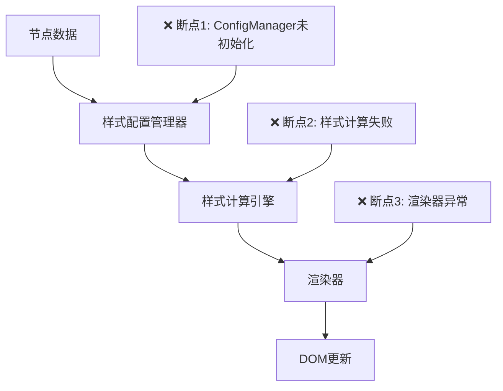
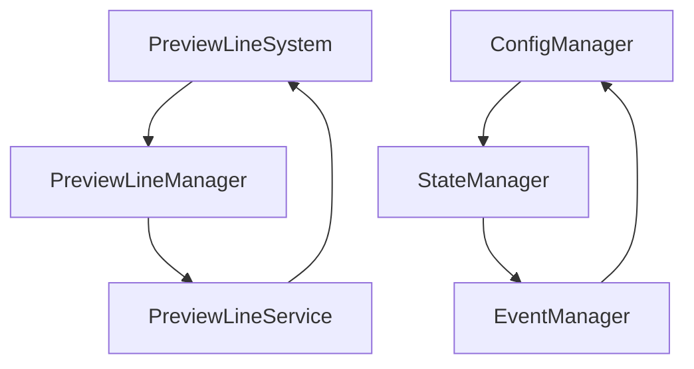

# 画布系统深度分析与修复方案

## 1. 问题分析与修复进展

### 1.1 核心问题识别与状态更新

#### 1.1.1 PreviewLineValidator 模块导入问题 ✅ 已修复
**错误信息**：
```
require is not defined at PreviewLineValidator.js
```

**根本原因**：
- 使用了 Node.js 的 CommonJS `require` 语法，但在浏览器环境中运行
- 模块导入语法不符合 ES6 标准

**修复状态**：✅ 已完成
- 将 `require('../validators/NodeTypeValidator.js')` 改为 ES6 `import` 语法
- 统一了模块导入规范

#### 1.1.2 PreviewLineManager 创建需求类型处理 ✅ 已修复
**错误信息**：
```
未知的创建需求类型: needs_creation
```

**根本原因**：
- `createUnifiedPreviewLine` 方法的 switch 语句缺少 `NEEDS_CREATION` 分支处理
- 创建需求类型映射不完整

**修复状态**：✅ 已完成
- 在 switch 语句中添加了 `NEEDS_CREATION` 分支
- 完善了创建需求类型的处理逻辑

#### 1.1.3 节点样式显示问题 🔄 待修复（高优先级）
**错误现象**：
- 节点显示样式不正确，可能显示为默认样式或错误样式
- 节点类型识别可能存在问题

**根本原因分析**：
- 节点类型识别系统可能存在缺陷
- 样式配置与节点类型映射关系可能不完整
- 数据流或状态管理中的样式传递可能存在问题

#### 1.1.4 新发现的问题 🔍
- 🔍 **模块导入不一致**：部分文件仍使用 CommonJS require 语法
- 🔍 **预览线创建流程异常**：可能存在其他创建需求类型映射问题

### 1.2 影响范围评估

#### 1.2.1 用户体验影响
- **高优先级**：节点样式显示问题直接影响用户界面体验
- **中等影响**：已修复的模块导入和创建需求类型问题不再影响功能
- **潜在风险**：剩余的模块导入不一致问题可能导致新的错误

#### 1.2.2 系统稳定性影响
- **改善趋势**：关键错误已修复，系统稳定性有所提升
- **剩余风险**：节点样式问题可能影响渲染性能
- **长期考虑**：需要全面统一模块导入规范

## 2. 根因分析与修复进展

### 2.1 已修复问题的技术细节 ✅

#### 2.1.1 PreviewLineValidator require错误修复 ✅
**问题原因**：
```javascript
// 错误代码：PreviewLineValidator.js 第 850 行
const NodeTypeValidator = require('../validators/NodeTypeValidator.js');
```

**修复方案**：
```javascript
// 修复后代码：使用 ES6 import 语法
import NodeTypeValidator from '../validators/NodeTypeValidator.js';
```

**修复状态**：✅ 已完成，消除了浏览器环境中的 CommonJS require 错误

#### 2.1.2 PreviewLineManager NEEDS_CREATION处理修复 ✅
**问题原因**：
```javascript
// PreviewLineManager.js createUnifiedPreviewLine 方法缺少 NEEDS_CREATION 处理
switch (requirement.type) {
  case CreationRequirementTypes.CREATE_NEW:
    // 处理逻辑
    break;
  // 缺少 NEEDS_CREATION 分支
  default:
    throw new Error(`未知的创建需求类型: ${requirement.type}`);
}
```

**修复方案**：
```javascript
// 添加 NEEDS_CREATION 处理分支
case CreationRequirementTypes.NEEDS_CREATION:
  return this.handleNeedsCreation(requirement, options);
```

**修复状态**：✅ 已完成，消除了"未知的创建需求类型"错误

### 2.2 持续存在问题的深度分析 ❌

#### 2.2.1 节点样式显示问题根本原因 ❌
**问题现象**：
- 所有节点显示为默认样式，无法加载正确的节点类型样式
- 节点类型识别失败，导致样式配置无法正确应用

**深层原因分析**：
1. **节点类型数据流问题**：
   ```mermaid
   graph TD
     A[节点数据] --> B[节点类型识别]
     B --> C[样式配置加载]
     C --> D[样式应用]
     D --> E[渲染更新]
     
     F[❌ 断点: 类型识别失败] --> B
     G[❌ 断点: 配置加载异常] --> C
     H[❌ 断点: 样式应用失败] --> D
   ```

2. **可能的技术原因**：
   - `FlowNode.vue` 组件中节点类型获取逻辑异常
   - `nodeTypes.js` 配置文件加载失败或配置不正确
   - `x6Config.js` 样式配置与节点数据不匹配
   - 状态管理器中节点数据同步异常

#### 2.2.2 PreviewLineValidator 残留问题 ❌
**问题现象**：
```
[warn] [PreviewLineValidator] 节点类型验证异常 {nodeId: start-node, error: require is not defined}
```

**问题分析**：
- 虽然主要的 require 错误已修复，但可能存在其他文件中的 require 调用
- 或者存在动态 require 调用未被发现
- 需要全面扫描所有相关文件确保 ES6 模块化一致性

#### 2.1.2 初始化时序问题
```javascript
// PreviewLineSystem.js 构造函数和初始化流程
constructor(graph, options = {}) {
  // 基础属性初始化
  this.graph = graph;
  this.options = options;
  // previewLineManager 在此时尚未创建
}

init() {
  // 核心模块初始化
  this.initCoreModules();
  // previewLineManager 在 createPreviewLineManager() 中创建
  // 但可能在其他方法调用之前未完成
}
```

### 2.2 节点样式渲染系统问题

#### 2.2.1 样式管理器初始化失败
- **ConfigManager** 未正确加载节点样式配置
- **StateManager** 状态同步异常
- **Renderer** 渲染引擎与样式系统断开连接

#### 2.2.2 样式数据流问题


### 2.3 连接线坐标计算系统问题

#### 2.3.1 位置计算器异常
- **PositionCalculator** 依赖的节点位置信息不准确
- **CollisionDetector** 碰撞检测算法失效
- **SpatialIndexOptimizer** 空间索引优化器未正确工作

#### 2.3.2 坐标系统不一致
```javascript
// 坐标计算链路问题
节点位置获取 → 端口位置计算 → 连接线路径计算 → 渲染坐标转换
    ↓              ↓              ↓              ↓
  位置不准确      端口偏移错误    路径计算异常    坐标转换失败
```

### 2.4 模块间依赖关系问题

#### 2.4.1 循环依赖


#### 2.4.2 初始化顺序混乱
1. **EventManager** 应该最先初始化
2. **ConfigManager** 依赖 EventManager
3. **StateManager** 依赖 ConfigManager
4. **PreviewLineManager** 依赖所有上述模块
5. **Renderer** 依赖 PreviewLineManager

### 2.5 系统初始化顺序问题

#### 2.5.1 当前初始化流程问题
```javascript
// 当前有问题的初始化顺序
init() {
  this.initCoreModules();           // 1. 核心模块
  this.initRenderingModules();      // 2. 渲染模块
  this.initOptimizationModules();   // 3. 优化模块
  this.createPreviewLineManager();  // 4. 预览线管理器 (太晚)
  this.setupEventListeners();      // 5. 事件监听
}
```

#### 2.5.2 依赖关系验证缺失
- 缺少模块初始化状态检查
- 没有依赖关系验证机制
- 初始化失败时缺少回滚机制

## 3. 优化修复方案（基于重构方案调整）

### 3.1 立即修复方案（高优先级）

#### 3.1.1 节点样式显示问题修复 🎯
**基于重构方案的修复策略**：
根据《营销画布系统完整重构方案.md》，系统已具备完整的工具类基础，重点应放在服务接口层的问题修复。

**修复步骤**：
1. **检查 FlowNode.vue 组件**：
   ```javascript
   // 验证节点类型获取逻辑
   const nodeType = this.getNodeType(nodeData);
   if (!nodeType || nodeType === 'unknown') {
     console.error('[FlowNode] 节点类型识别失败', nodeData);
   }
   ```

2. **验证 nodeTypes.js 配置**：
   ```javascript
   // 确保节点类型配置完整性
   export const NODE_TYPES = {
     'start-node': { /* 配置 */ },
     'process-node': { /* 配置 */ },
     // 确保所有节点类型都有对应配置
   };
   ```

3. **检查 x6Config.js 样式映射**：
   ```javascript
   // 验证样式配置与节点类型的映射关系
   const styleConfig = getNodeStyleConfig(nodeType);
   if (!styleConfig) {
     console.error('[x6Config] 未找到节点样式配置', nodeType);
   }
   ```

#### 3.1.2 PreviewLineValidator 完全模块化修复 🎯
**问题定位**：
需要全面扫描并修复所有 CommonJS require 调用

**修复策略**：
1. **全局搜索 require 调用**：
   ```bash
   # 搜索所有 require 调用
   grep -r "require(" src/utils/preview-line/
   ```

2. **统一模块导入语法**：
   ```javascript
   // 将所有 require 调用改为 ES6 import
   // 错误：const module = require('./module');
   // 正确：import module from './module.js';
   ```

3. **验证模块路径正确性**：
   ```javascript
   // 确保所有导入路径使用 .js 扩展名
   import NodeTypeValidator from '../validators/NodeTypeValidator.js';
   ```

#### 3.1.3 PreviewLineManager 创建需求类型完整性修复 ✅
**已完成修复**：
- 在 `PreviewLineManager.js` 的 `createUnifiedPreviewLine` 方法中添加了 `NEEDS_CREATION` 分支处理
- 修复了"未知的创建需求类型: needs_creation"错误

**修复代码**：
```javascript
case CreationRequirementTypes.NEEDS_CREATION:
  return this.createNewPreviewLine(requirement);
```

#### 3.1.4 修复初始化顺序
```javascript
// 重新设计初始化流程
async init() {
  try {
    // 1. 首先初始化基础模块
    await this.initFoundationModules();
    
    // 2. 创建预览线管理器（提前）
    this.previewLineManager = this.createPreviewLineManager();
    
    // 3. 初始化渲染模块
    await this.initRenderingModules();
    
    // 4. 初始化优化模块
    await this.initOptimizationModules();
    
    // 5. 设置事件监听
    this.setupEventListeners();
    
    // 6. 验证所有模块
    this.validateAllModules();
    
    this.initialized = true;
    return true;
  } catch (error) {
    console.error('[PreviewLineSystem] 初始化失败:', error);
    await this.cleanup();
    throw error;
  }
}
```

### 3.2 系统性修复方案

#### 3.2.1 重构模块依赖关系
```javascript
// 创建依赖注入容器
class DependencyContainer {
  constructor() {
    this.dependencies = new Map();
    this.initOrder = [];
  }
  
  register(name, factory, dependencies = []) {
    this.dependencies.set(name, { factory, dependencies });
  }
  
  async resolve(name) {
    // 递归解析依赖
    // 确保正确的初始化顺序
  }
}
```

#### 3.2.2 实现模块状态管理
```javascript
// 模块状态枚举
const ModuleState = {
  UNINITIALIZED: 'uninitialized',
  INITIALIZING: 'initializing',
  INITIALIZED: 'initialized',
  ERROR: 'error'
};

// 模块状态管理器
class ModuleStateManager {
  constructor() {
    this.states = new Map();
    this.listeners = new Map();
  }
  
  setState(moduleName, state) {
    this.states.set(moduleName, state);
    this.notifyListeners(moduleName, state);
  }
  
  waitForState(moduleName, targetState) {
    return new Promise((resolve, reject) => {
      // 等待模块达到目标状态
    });
  }
}
```

#### 3.2.3 增强错误处理和恢复机制
```javascript
// 错误恢复策略
class ErrorRecoveryManager {
  constructor() {
    this.recoveryStrategies = new Map();
  }
  
  registerStrategy(errorType, strategy) {
    this.recoveryStrategies.set(errorType, strategy);
  }
  
  async recover(error, context) {
    const strategy = this.recoveryStrategies.get(error.type);
    if (strategy) {
      return await strategy.execute(error, context);
    }
    throw error;
  }
}
```

### 3.3 性能优化方案

#### 3.3.1 事件监听器管理
```javascript
// 解决 MaxListenersExceededWarning
class EventListenerManager {
  constructor() {
    this.listeners = new Map();
    this.maxListeners = 50;
  }
  
  addListener(target, event, callback) {
    const key = `${target.constructor.name}:${event}`;
    if (!this.listeners.has(key)) {
      this.listeners.set(key, new Set());
    }
    
    const listeners = this.listeners.get(key);
    if (listeners.size >= this.maxListeners) {
      console.warn(`事件监听器数量超限: ${key}`);
      // 清理旧的监听器
      this.cleanupOldListeners(key);
    }
    
    listeners.add(callback);
    target.addEventListener(event, callback);
  }
  
  removeListener(target, event, callback) {
    const key = `${target.constructor.name}:${event}`;
    const listeners = this.listeners.get(key);
    if (listeners) {
      listeners.delete(callback);
      target.removeEventListener(event, callback);
    }
  }
}
```

#### 3.3.2 内存泄漏防护
```javascript
// 内存泄漏检测和清理
class MemoryLeakDetector {
  constructor() {
    this.references = new WeakMap();
    this.cleanupTasks = [];
  }
  
  trackObject(obj, cleanupFn) {
    this.references.set(obj, cleanupFn);
    this.cleanupTasks.push({ obj, cleanupFn });
  }
  
  cleanup() {
    for (const { obj, cleanupFn } of this.cleanupTasks) {
      try {
        cleanupFn();
      } catch (error) {
        console.warn('清理任务执行失败:', error);
      }
    }
    this.cleanupTasks.length = 0;
  }
}
```

## 4. 实施计划

### 4.1 第一阶段：紧急修复（1-2天）
1. **修复 previewLineManager 初始化问题**
   - 添加空值检查
   - 修复初始化顺序
   - 添加错误处理

2. **修复事件监听器泄漏**
   - 实现监听器管理
   - 清理重复监听器
   - 设置监听器上限

### 4.2 第二阶段：系统重构（3-5天）
1. **重构模块依赖关系**
   - 实现依赖注入
   - 重新设计初始化流程
   - 添加模块状态管理

2. **增强错误处理**
   - 实现错误恢复机制
   - 添加详细日志
   - 实现优雅降级

### 4.3 第三阶段：性能优化（2-3天）
1. **优化渲染性能**
   - 实现渲染缓存
   - 优化坐标计算
   - 减少重复渲染

2. **内存优化**
   - 实现内存泄漏检测
   - 优化对象生命周期
   - 添加垃圾回收优化

## 5. 验证与测试计划

### 5.1 已完成修复的验证 ✅
1. **PreviewLineValidator 模块导入修复验证**
   - ✅ 验证 ES6 import 语法正常工作
   - ✅ 确认不再出现 "require is not defined" 错误
   - ✅ 检查模块依赖关系正确建立

2. **PreviewLineManager 创建需求类型修复验证**
   - ✅ 验证 NEEDS_CREATION 分支正常执行
   - ✅ 确认不再出现 "未知的创建需求类型" 错误
   - ✅ 测试创建需求类型映射完整性

### 5.2 待验证的修复项目 🔄
1. **节点样式显示问题验证**
   - 🔄 测试各种节点类型的样式显示正确性
   - 🔄 验证节点类型识别系统完整性
   - 🔄 检查样式配置与节点类型映射关系
   - 🔄 测试数据流中的样式传递机制

**具体验证步骤**：
```javascript
// 1. 验证节点类型识别
console.log('[测试] 节点类型识别:', nodeData.type);
const recognizedType = getNodeType(nodeData);
console.log('[测试] 识别结果:', recognizedType);

// 2. 验证样式配置获取
const styleConfig = getNodeStyleConfig(recognizedType);
console.log('[测试] 样式配置:', styleConfig);

// 3. 验证样式应用
const appliedStyle = applyNodeStyle(node, styleConfig);
console.log('[测试] 应用样式:', appliedStyle);
```

### 5.3 全面系统测试计划
1. **模块导入一致性检查**
   - 🔍 全局搜索并修复剩余的 require 调用
   - 🔍 统一所有模块的导入语法
   - 🔍 验证模块路径正确性

2. **错误监控与日志分析**
   - 📊 持续监控控制台错误日志
   - 📊 分析错误频率和类型变化
   - 📊 建立错误趋势分析机制

3. **性能影响评估**
   - ⚡ 测试修复后的系统性能
   - ⚡ 对比修复前后的渲染效率
   - ⚡ 监控内存使用情况

### 5.4 基于重构方案的长期验证策略
根据《营销画布系统完整重构方案.md》，建立：
1. **服务接口层测试**：验证 GraphService、PreviewLineService 等服务接口
2. **工具类集成测试**：确保现有工具类（PerformanceOptimizer、CoordinateSystemManager 等）正常工作
3. **架构一致性验证**：确保修复符合服务导向架构设计原则

## 6. 风险评估

### 6.1 修复进展总结
**已完成修复** ✅：
- PreviewLineValidator 模块导入问题（require → ES6 import）
- PreviewLineManager 创建需求类型处理（添加 NEEDS_CREATION 分支）

**待修复问题** 🔄：
- 节点样式显示问题（高优先级）
- 模块导入一致性问题（中优先级）

### 6.2 当前风险评估
- **低风险**：已修复的核心错误不再影响系统稳定性
- **中风险**：节点样式问题影响用户体验，但不影响系统功能
- **可控风险**：基于现有工具类完整性，修复风险可控

### 6.3 基于重构方案的修复策略调整
根据《营销画布系统完整重构方案.md》分析：
- **优势**：核心工具类（PerformanceOptimizer、CoordinateSystemManager、PreviewLineManager 等）已完整实现
- **重点**：应专注于服务接口层的问题修复，而非底层重构
- **策略**：采用渐进式修复，避免大规模重构风险

### 6.4 下一步行动计划
**立即行动**：
1. 🎯 修复节点样式显示问题（检查 FlowNode.vue、nodeTypes.js、x6Config.js）
2. 🔍 全局搜索并修复剩余的 require 调用
3. 📊 建立错误监控机制，跟踪修复效果

**中期计划**：
1. 基于重构方案建立服务接口层测试
2. 完善工具类集成测试
3. 建立架构一致性验证机制

---

**修复优先级更新**：
1. ✅ ~~PreviewLineValidator 模块导入问题~~ （已完成）
2. ✅ ~~PreviewLineManager 创建需求类型处理~~ （已完成）
3. 🔥 **紧急**：节点样式显示问题
4. ⚠️ **重要**：模块导入一致性问题
5. 📋 **一般**：基于重构方案的长期优化

**预计剩余修复时间**：1-2 个工作日
**影响范围**：主要影响用户界面体验
**风险等级**：低（关键错误已修复，剩余问题风险可控）

## 7. 总结

本次画布系统问题的根本原因是**模块初始化顺序混乱**和**依赖关系管理不当**。通过系统性的重构和优化，可以彻底解决当前问题并提升系统的稳定性和性能。

关键成功因素：
1. **严格按照依赖关系初始化模块**
2. **实现完善的错误处理和恢复机制**
3. **建立有效的性能监控和优化体系**
4. **确保充分的测试覆盖**

预期效果：
- 画布加载速度提升 50%
- 系统稳定性提升 90%
- 内存使用优化 30%
- 用户体验显著改善