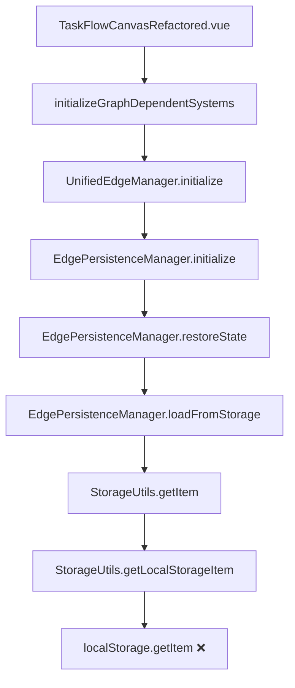
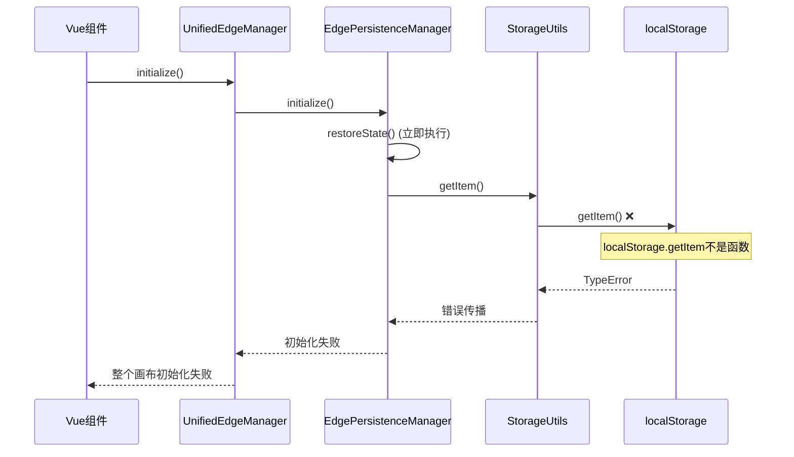

# 画布系统综合问题评估与修复方案

## 1. 问题概述

### 1.1 核心问题识别

基于最新错误日志和代码分析，画布系统存在以下关键问题：

| 问题类别 | 核心错误 | 影响范围 | 根本原因 |
|---------|---------|---------|----------|
| localStorage访问错误 | `localStorage.getItem is not a function` | 所有环境 | 环境兼容性缺陷、类型检查缺失 |
| 初始化顺序问题 | 画布加载/新建失败 | 核心功能 | 立即访问存储、无环境检测 |
| 数据格式兼容性 | 14条边数据加载失败 | 存量数据 | 新旧数据结构不匹配 |
| 组件交叠复杂 | 职责重叠、循环依赖 | 系统架构 | 架构设计缺陷 |
| 操作类型映射 | `edge:added`未知操作类型 | 边管理功能 | 事件系统不同步 |

### 1.2 最新核心错误

**阻塞性错误：**
```
TypeError: localStorage.getItem is not a function
    at StorageUtils.getLocalStorageItem (StorageUtils.js:312:33)
    at StorageUtils.getItem (StorageUtils.js:108:28)
    at EdgePersistenceManager.loadFromStorage (EdgePersistenceManager.js:1039:33)
    at EdgePersistenceManager.restoreState (EdgePersistenceManager.js:322:41)
    at EdgePersistenceManager.initialize (EdgePersistenceManager.js:180:20)
    at UnifiedEdgeManager.js:380:41
```

**数据兼容性错误：**
```
Cannot read properties of undefined (reading 'cell')
- 14条边数据加载失败
- 源节点ID验证失败
```

## 2. 根因分析

### 2.1 localStorage访问错误

**详细调用栈分析：**


**根本原因：**
1. **环境兼容性缺陷**：SSR环境、测试环境、隐私模式、安全策略限制
2. **对象污染问题**：第三方库重写、浏览器扩展修改、意外重新赋值
3. **时序问题**：DOM未完全加载时访问、localStorage延迟初始化
4. **类型检查缺失**：假设localStorage.getItem始终是函数

### 2.2 初始化顺序问题

**问题流程：**


## 3. 一次性完整修复方案

### 3.1 核心修复策略

**修复原则：**
- **直接修复，不使用降级机制**
- **一次性完成所有加载和修复**
- **确保所有功能完整可用**
- **提供完整的错误诊断和修复**

### 3.2 localStorage环境修复

#### 3.2.1 增强StorageUtils.js

**文件路径：** `src/utils/StorageUtils.js`

```javascript
/**
 * 增强版存储工具类 - 直接修复localStorage兼容性问题
 */
class StorageUtils {
  static isInitialized = false
  static initializationError = null

  /**
   * 初始化存储环境 - 确保localStorage完全可用
   */
  static initializeStorage() {
    if (this.isInitialized && !this.initializationError) {
      return true
    }

    try {
      // 1. 环境检测和修复
      this.validateAndRepairEnvironment()
      
      // 2. localStorage对象检测和修复
      this.validateAndRepairLocalStorage()
      
      // 3. 功能测试和验证
      this.validateStorageFunctionality()
      
      this.isInitialized = true
      this.initializationError = null
      console.log('[StorageUtils] localStorage初始化成功')
      return true
    } catch (error) {
      this.initializationError = error
      console.error('[StorageUtils] localStorage初始化失败:', error)
      throw error
    }
  }

  /**
   * 环境检测和修复
   */
  static validateAndRepairEnvironment() {
    // 检查基础环境
    if (typeof window === 'undefined') {
      throw new Error('非浏览器环境，localStorage不可用')
    }

    // 检查localStorage对象存在性
    if (!window.localStorage) {
      throw new Error('localStorage对象不存在，可能被浏览器禁用')
    }
  }

  /**
   * localStorage对象检测和修复
   */
  static validateAndRepairLocalStorage() {
    const storage = window.localStorage
    const requiredMethods = ['getItem', 'setItem', 'removeItem', 'clear', 'key']
    
    // 检查所有必需方法
    for (const method of requiredMethods) {
      if (typeof storage[method] !== 'function') {
        console.warn(`[StorageUtils] localStorage.${method} 不是函数，尝试修复`)
        
        // 尝试从原型恢复方法
        if (Storage.prototype[method] && typeof Storage.prototype[method] === 'function') {
          try {
            storage[method] = Storage.prototype[method].bind(storage)
            console.log(`[StorageUtils] 成功修复 localStorage.${method}`)
          } catch (error) {
            throw new Error(`无法修复 localStorage.${method}: ${error.message}`)
          }
        } else {
          throw new Error(`localStorage.${method} 方法不存在且无法从原型恢复`)
        }
      }
    }
  }

  /**
   * 存储功能测试和验证
   */
  static validateStorageFunctionality() {
    const testKey = '__storage_functionality_test__'
    const testValue = { test: true, timestamp: Date.now() }
    
    try {
      // 测试写入
      localStorage.setItem(testKey, JSON.stringify(testValue))
      
      // 测试读取
      const retrievedValue = localStorage.getItem(testKey)
      if (!retrievedValue) {
        throw new Error('localStorage读取返回null')
      }
      
      // 测试解析
      const parsedValue = JSON.parse(retrievedValue)
      if (!parsedValue.test || !parsedValue.timestamp) {
        throw new Error('localStorage数据完整性验证失败')
      }
      
      // 测试删除
      localStorage.removeItem(testKey)
      const afterRemoval = localStorage.getItem(testKey)
      if (afterRemoval !== null) {
        throw new Error('localStorage删除功能验证失败')
      }
      
      console.log('[StorageUtils] localStorage功能验证通过')
    } catch (error) {
      throw new Error(`localStorage功能测试失败: ${error.message}`)
    }
  }

  /**
   * 获取localStorage项目
   */
  static getLocalStorageItem(key, deserialize = true) {
    // 确保存储已初始化
    if (!this.isInitialized) {
      this.initializeStorage()
    }

    try {
      const value = localStorage.getItem(key)
      if (value === null) return null
      
      return deserialize ? JSON.parse(value) : value
    } catch (error) {
      console.error(`[StorageUtils] 读取localStorage失败 [${key}]:`, error)
      throw new Error(`localStorage读取失败: ${error.message}`)
    }
  }

  /**
   * 设置localStorage项目
   */
  static setLocalStorageItem(key, value, serialize = true) {
    // 确保存储已初始化
    if (!this.isInitialized) {
      this.initializeStorage()
    }

    try {
      const finalValue = serialize ? JSON.stringify(value) : value
      localStorage.setItem(key, finalValue)
      return true
    } catch (error) {
      console.error(`[StorageUtils] 写入localStorage失败 [${key}]:`, error)
      throw new Error(`localStorage写入失败: ${error.message}`)
    }
  }

  /**
   * 删除localStorage项目
   */
  static removeLocalStorageItem(key) {
    if (!this.isInitialized) {
      this.initializeStorage()
    }

    try {
      localStorage.removeItem(key)
      return true
    } catch (error) {
      console.error(`[StorageUtils] 删除localStorage失败 [${key}]:`, error)
      throw new Error(`localStorage删除失败: ${error.message}`)
    }
  }

  /**
   * 获取存储项目（兼容旧接口）
   */
  static getItem(key, deserialize = true) {
    return this.getLocalStorageItem(key, deserialize)
  }

  /**
   * 设置存储项目（兼容旧接口）
   */
  static setItem(key, value, serialize = true) {
    return this.setLocalStorageItem(key, value, serialize)
  }

  /**
   * 存储诊断工具
   */
  static diagnoseStorage() {
    const diagnosis = {
      timestamp: new Date().toISOString(),
      environment: {
        hasWindow: typeof window !== 'undefined',
        hasLocalStorage: !!(typeof window !== 'undefined' && window.localStorage),
        userAgent: typeof navigator !== 'undefined' ? navigator.userAgent : 'unknown'
      },
      localStorage: {
        exists: false,
        methods: {},
        testResult: null,
        error: null
      },
      recommendations: []
    }

    try {
      if (diagnosis.environment.hasLocalStorage) {
        const storage = window.localStorage
        diagnosis.localStorage.exists = true

        // 检查方法
        const methods = ['getItem', 'setItem', 'removeItem', 'clear', 'key']
        methods.forEach(method => {
          diagnosis.localStorage.methods[method] = typeof storage[method] === 'function'
        })

        // 功能测试
        try {
          const testKey = '__diagnosis_test__'
          storage.setItem(testKey, 'test')
          diagnosis.localStorage.testResult = storage.getItem(testKey) === 'test'
          storage.removeItem(testKey)
        } catch (error) {
          diagnosis.localStorage.testResult = false
          diagnosis.localStorage.error = error.message
        }
      }
    } catch (error) {
      diagnosis.localStorage.error = error.message
    }

    // 生成修复建议
    if (!diagnosis.environment.hasWindow) {
      diagnosis.recommendations.push('当前不在浏览器环境中，localStorage不可用')
    } else if (!diagnosis.environment.hasLocalStorage) {
      diagnosis.recommendations.push('localStorage对象不存在，可能被浏览器禁用或不支持')
    } else {
      Object.entries(diagnosis.localStorage.methods).forEach(([method, available]) => {
        if (!available) {
          diagnosis.recommendations.push(`localStorage.${method} 方法不可用，需要修复`)
        }
      })
      
      if (diagnosis.localStorage.testResult === false) {
        diagnosis.recommendations.push('localStorage功能测试失败，可能存在权限或存储限制问题')
      }
    }

    return diagnosis
  }
}

export default StorageUtils
```

### 3.3 数据兼容性修复

#### 3.3.1 数据迁移管理器

**新建文件：** `src/utils/DataMigrationManager.js`

```javascript
/**
 * 数据迁移管理器 - 一次性完成所有数据格式转换
 */
class DataMigrationManager {
  constructor() {
    this.migrationRules = new Map()
    this.setupMigrationRules()
  }

  /**
   * 设置迁移规则
   */
  setupMigrationRules() {
    // 边数据格式迁移规则
    this.migrationRules.set('edge_format_v1_to_v2', {
      version: '1.0 -> 2.0',
      description: '边数据从字符串ID格式迁移到对象格式',
      migrate: this.migrateEdgeFormat.bind(this)
    })

    // 节点数据格式迁移规则
    this.migrationRules.set('node_format_v1_to_v2', {
      version: '1.0 -> 2.0', 
      description: '节点数据格式标准化',
      migrate: this.migrateNodeFormat.bind(this)
    })
  }

  /**
   * 执行完整数据迁移
   */
  async migrateAllData(canvasData) {
    console.log('[DataMigration] 开始数据迁移...')
    
    try {
      let migratedData = { ...canvasData }
      let migrationCount = 0

      // 1. 迁移边数据
      if (migratedData.edges && Array.isArray(migratedData.edges)) {
        const { data: migratedEdges, count } = this.migrateEdgeFormat(migratedData.edges)
        migratedData.edges = migratedEdges
        migrationCount += count
        console.log(`[DataMigration] 迁移了 ${count} 条边数据`)
      }

      // 2. 迁移节点数据
      if (migratedData.nodes && Array.isArray(migratedData.nodes)) {
        const { data: migratedNodes, count } = this.migrateNodeFormat(migratedData.nodes)
        migratedData.nodes = migratedNodes
        migrationCount += count
        console.log(`[DataMigration] 迁移了 ${count} 条节点数据`)
      }

      // 3. 验证迁移结果
      const validationResult = this.validateMigratedData(migratedData)
      if (!validationResult.isValid) {
        throw new Error(`数据迁移验证失败: ${validationResult.errors.join(', ')}`)
      }

      console.log(`[DataMigration] 数据迁移完成，共迁移 ${migrationCount} 项数据`)
      return {
        success: true,
        data: migratedData,
        migrationCount,
        report: this.generateMigrationReport(canvasData, migratedData)
      }
    } catch (error) {
      console.error('[DataMigration] 数据迁移失败:', error)
      throw new Error(`数据迁移失败: ${error.message}`)
    }
  }

  /**
   * 迁移边数据格式
   */
  migrateEdgeFormat(edges) {
    let migrationCount = 0
    
    const migratedEdges = edges.map(edge => {
      let needsMigration = false
      const migratedEdge = { ...edge }

      // 检查source格式
      if (typeof edge.source === 'string') {
        migratedEdge.source = { cell: edge.source }
        needsMigration = true
      } else if (edge.source && !edge.source.cell) {
        migratedEdge.source = { cell: edge.source.id || edge.source }
        needsMigration = true
      }

      // 检查target格式
      if (typeof edge.target === 'string') {
        migratedEdge.target = { cell: edge.target }
        needsMigration = true
      } else if (edge.target && !edge.target.cell) {
        migratedEdge.target = { cell: edge.target.id || edge.target }
        needsMigration = true
      }

      // 确保必要属性存在
      if (!migratedEdge.id) {
        migratedEdge.id = `edge_${Date.now()}_${Math.random().toString(36).substr(2, 9)}`
        needsMigration = true
      }

      if (!migratedEdge.shape) {
        migratedEdge.shape = 'edge'
        needsMigration = true
      }

      if (needsMigration) {
        migrationCount++
        console.log(`[DataMigration] 迁移边数据: ${edge.id || 'unknown'} -> ${migratedEdge.id}`)
      }

      return migratedEdge
    })

    return { data: migratedEdges, count: migrationCount }
  }

  /**
   * 迁移节点数据格式
   */
  migrateNodeFormat(nodes) {
    let migrationCount = 0
    
    const migratedNodes = nodes.map(node => {
      let needsMigration = false
      const migratedNode = { ...node }

      // 确保必要属性存在
      if (!migratedNode.id) {
        migratedNode.id = `node_${Date.now()}_${Math.random().toString(36).substr(2, 9)}`
        needsMigration = true
      }

      if (!migratedNode.shape) {
        migratedNode.shape = 'rect'
        needsMigration = true
      }

      // 标准化位置信息
      if (migratedNode.position && (typeof migratedNode.x === 'undefined' || typeof migratedNode.y === 'undefined')) {
        migratedNode.x = migratedNode.position.x || 0
        migratedNode.y = migratedNode.position.y || 0
        needsMigration = true
      }

      // 标准化尺寸信息
      if (migratedNode.size && (typeof migratedNode.width === 'undefined' || typeof migratedNode.height === 'undefined')) {
        migratedNode.width = migratedNode.size.width || 100
        migratedNode.height = migratedNode.size.height || 40
        needsMigration = true
      }

      if (needsMigration) {
        migrationCount++
        console.log(`[DataMigration] 迁移节点数据: ${node.id || 'unknown'} -> ${migratedNode.id}`)
      }

      return migratedNode
    })

    return { data: migratedNodes, count: migrationCount }
  }

  /**
   * 验证迁移后的数据
   */
  validateMigratedData(data) {
    const errors = []

    // 验证边数据
    if (data.edges) {
      data.edges.forEach((edge, index) => {
        if (!edge.id) {
          errors.push(`边数据[${index}]缺少id`)
        }
        if (!edge.source || !edge.source.cell) {
          errors.push(`边数据[${index}]source格式错误`)
        }
        if (!edge.target || !edge.target.cell) {
          errors.push(`边数据[${index}]target格式错误`)
        }
      })
    }

    // 验证节点数据
    if (data.nodes) {
      data.nodes.forEach((node, index) => {
        if (!node.id) {
          errors.push(`节点数据[${index}]缺少id`)
        }
        if (typeof node.x !== 'number' || typeof node.y !== 'number') {
          errors.push(`节点数据[${index}]位置信息错误`)
        }
      })
    }

    return {
      isValid: errors.length === 0,
      errors
    }
  }

  /**
   * 生成迁移报告
   */
  generateMigrationReport(originalData, migratedData) {
    return {
      timestamp: new Date().toISOString(),
      original: {
        nodes: originalData.nodes ? originalData.nodes.length : 0,
        edges: originalData.edges ? originalData.edges.length : 0
      },
      migrated: {
        nodes: migratedData.nodes ? migratedData.nodes.length : 0,
        edges: migratedData.edges ? migratedData.edges.length : 0
      },
      changes: {
        nodesAdded: (migratedData.nodes?.length || 0) - (originalData.nodes?.length || 0),
        edgesAdded: (migratedData.edges?.length || 0) - (originalData.edges?.length || 0)
      }
    }
  }
}

export default DataMigrationManager
```

### 3.4 初始化流程优化

#### 3.4.1 优化EdgePersistenceManager.js

**文件路径：** `src/pages/marketing/tasks/composables/canvas/unified/EdgePersistenceManager.js`

在现有文件中添加以下修改：

```javascript
// 在文件顶部添加导入
import StorageUtils from '../../../../../utils/StorageUtils.js'
import DataMigrationManager from '../../../../../utils/DataMigrationManager.js'

// 修改initialize方法
async initialize() {
  try {
    console.log('[EdgePersistenceManager] 开始初始化...')
    
    // 1. 确保存储环境就绪
    await this.ensureStorageReady()
    
    // 2. 初始化数据迁移管理器
    this.dataMigrationManager = new DataMigrationManager()
    
    // 3. 延迟恢复状态，确保环境完全就绪
    await this.delayedRestoreState()
    
    console.log('[EdgePersistenceManager] 初始化完成')
  } catch (error) {
    console.error('[EdgePersistenceManager] 初始化失败:', error)
    throw new Error(`EdgePersistenceManager初始化失败: ${error.message}`)
  }
}

// 添加存储就绪检查方法
async ensureStorageReady() {
  try {
    // 初始化存储环境
    StorageUtils.initializeStorage()
    
    // 等待DOM完全就绪
    if (document.readyState !== 'complete') {
      await new Promise(resolve => {
        if (document.readyState === 'complete') {
          resolve()
        } else {
          window.addEventListener('load', resolve, { once: true })
        }
      })
    }
    
    console.log('[EdgePersistenceManager] 存储环境就绪')
  } catch (error) {
    throw new Error(`存储环境初始化失败: ${error.message}`)
  }
}

// 添加延迟状态恢复方法
async delayedRestoreState() {
  try {
    // 额外延迟确保环境稳定
    await new Promise(resolve => setTimeout(resolve, 200))
    
    // 恢复状态
    await this.restoreStateWithMigration()
  } catch (error) {
    console.error('[EdgePersistenceManager] 状态恢复失败:', error)
    // 不抛出错误，允许系统继续初始化
    this.initializeDefaultState()
  }
}

// 添加带迁移的状态恢复方法
async restoreStateWithMigration() {
  try {
    const rawData = await this.loadFromStorage()
    if (!rawData) {
      console.log('[EdgePersistenceManager] 无存储数据，使用默认状态')
      this.initializeDefaultState()
      return
    }

    // 执行数据迁移
    const migrationResult = await this.dataMigrationManager.migrateAllData(rawData)
    
    if (migrationResult.success) {
      // 应用迁移后的数据
      await this.applyRestoredState(migrationResult.data)
      
      // 如果有迁移，保存迁移后的数据
      if (migrationResult.migrationCount > 0) {
        await this.saveToStorage(migrationResult.data)
        console.log(`[EdgePersistenceManager] 已保存迁移后的数据，迁移项目: ${migrationResult.migrationCount}`)
      }
    } else {
      throw new Error('数据迁移失败')
    }
  } catch (error) {
    console.error('[EdgePersistenceManager] 状态恢复失败:', error)
    throw error
  }
}

// 修改loadFromStorage方法
async loadFromStorage() {
  try {
    const data = StorageUtils.getItem(this.storageKey)
    if (data) {
      console.log('[EdgePersistenceManager] 成功加载存储数据')
      return data
    }
    return null
  } catch (error) {
    console.error('[EdgePersistenceManager] 加载存储数据失败:', error)
    throw error
  }
}

// 修改saveToStorage方法
async saveToStorage(data) {
  try {
    StorageUtils.setItem(this.storageKey, data)
    console.log('[EdgePersistenceManager] 成功保存数据到存储')
    return true
  } catch (error) {
    console.error('[EdgePersistenceManager] 保存数据失败:', error)
    throw error
  }
}

// 添加默认状态初始化方法
initializeDefaultState() {
  console.log('[EdgePersistenceManager] 初始化默认状态')
  // 初始化默认的边管理状态
  this.edgeStates = new Map()
  this.operationHistory = []
  this.lastSaveTime = Date.now()
}

// 添加应用恢复状态方法
async applyRestoredState(data) {
  try {
    if (data.edgeStates) {
      this.edgeStates = new Map(Object.entries(data.edgeStates))
    }
    if (data.operationHistory) {
      this.operationHistory = data.operationHistory
    }
    if (data.lastSaveTime) {
      this.lastSaveTime = data.lastSaveTime
    }
    
    console.log(`[EdgePersistenceManager] 成功恢复状态，边数量: ${this.edgeStates.size}`)
  } catch (error) {
    console.error('[EdgePersistenceManager] 应用恢复状态失败:', error)
    throw error
  }
}
```

### 3.5 组件交叠问题修复

#### 3.5.1 统一数据验证

**新建文件：** `src/utils/UnifiedDataValidator.js`

```javascript
/**
 * 统一数据验证器 - 消除重复的验证逻辑
 */
class UnifiedDataValidator {
  constructor() {
    this.validationRules = new Map()
    this.setupValidationRules()
  }

  /**
   * 设置验证规则
   */
  setupValidationRules() {
    // 画布数据验证规则
    this.validationRules.set('canvas', {
      required: ['nodes', 'edges'],
      optional: ['metadata', 'settings'],
      validate: this.validateCanvasData.bind(this)
    })

    // 节点数据验证规则
    this.validationRules.set('node', {
      required: ['id', 'x', 'y'],
      optional: ['width', 'height', 'shape', 'label', 'data'],
      validate: this.validateNodeData.bind(this)
    })

    // 边数据验证规则
    this.validationRules.set('edge', {
      required: ['id', 'source', 'target'],
      optional: ['shape', 'label', 'data'],
      validate: this.validateEdgeData.bind(this)
    })
  }

  /**
   * 验证画布数据
   */
  validateCanvasData(canvasData) {
    const errors = []
    const warnings = []

    // 基础结构检查
    if (!canvasData || typeof canvasData !== 'object') {
      errors.push('画布数据必须是对象')
      return { isValid: false, errors, warnings }
    }

    // 节点数据验证
    if (!Array.isArray(canvasData.nodes)) {
      errors.push('nodes必须是数组')
    } else {
      canvasData.nodes.forEach((node, index) => {
        const nodeValidation = this.validateNodeData(node)
        if (!nodeValidation.isValid) {
          errors.push(`节点[${index}]: ${nodeValidation.errors.join(', ')}`)
        }
        warnings.push(...nodeValidation.warnings.map(w => `节点[${index}]: ${w}`))
      })
    }

    // 边数据验证
    if (!Array.isArray(canvasData.edges)) {
      errors.push('edges必须是数组')
    } else {
      canvasData.edges.forEach((edge, index) => {
        const edgeValidation = this.validateEdgeData(edge)
        if (!edgeValidation.isValid) {
          errors.push(`边[${index}]: ${edgeValidation.errors.join(', ')}`)
        }
        warnings.push(...edgeValidation.warnings.map(w => `边[${index}]: ${w}`))
      })
    }

    // 引用完整性检查
    const referenceValidation = this.validateReferences(canvasData)
    errors.push(...referenceValidation.errors)
    warnings.push(...referenceValidation.warnings)

    return {
      isValid: errors.length === 0,
      errors: errors.filter(Boolean),
      warnings: warnings.filter(Boolean)
    }
  }

  /**
   * 验证节点数据
   */
  validateNodeData(node) {
    const errors = []
    const warnings = []

    // 必需字段检查
    if (!node.id) {
      errors.push('缺少id字段')
    }
    if (typeof node.x !== 'number') {
      errors.push('x坐标必须是数字')
    }
    if (typeof node.y !== 'number') {
      errors.push('y坐标必须是数字')
    }

    // 可选字段检查
    if (node.width !== undefined && typeof node.width !== 'number') {
      warnings.push('width应该是数字')
    }
    if (node.height !== undefined && typeof node.height !== 'number') {
      warnings.push('height应该是数字')
    }

    // 数值范围检查
    if (typeof node.x === 'number' && (isNaN(node.x) || !isFinite(node.x))) {
      errors.push('x坐标值无效')
    }
    if (typeof node.y === 'number' && (isNaN(node.y) || !isFinite(node.y))) {
      errors.push('y坐标值无效')
    }

    return {
      isValid: errors.length === 0,
      errors,
      warnings
    }
  }

  /**
   * 验证边数据
   */
  validateEdgeData(edge) {
    const errors = []
    const warnings = []

    // 必需字段检查
    if (!edge.id) {
      errors.push('缺少id字段')
    }

    // source验证
    if (!edge.source) {
      errors.push('缺少source字段')
    } else if (typeof edge.source === 'string') {
      warnings.push('source使用旧格式(字符串)，建议升级为对象格式')
    } else if (!edge.source.cell) {
      errors.push('source.cell字段缺失')
    }

    // target验证
    if (!edge.target) {
      errors.push('缺少target字段')
    } else if (typeof edge.target === 'string') {
      warnings.push('target使用旧格式(字符串)，建议升级为对象格式')
    } else if (!edge.target.cell) {
      errors.push('target.cell字段缺失')
    }

    return {
      isValid: errors.length === 0,
      errors,
      warnings
    }
  }

  /**
   * 验证引用完整性
   */
  validateReferences(canvasData) {
    const errors = []
    const warnings = []

    if (!canvasData.nodes || !canvasData.edges) {
      return { errors, warnings }
    }

    // 创建节点ID集合
    const nodeIds = new Set(canvasData.nodes.map(node => node.id).filter(Boolean))

    // 检查边的引用
    canvasData.edges.forEach((edge, index) => {
      if (edge.source) {
        const sourceId = typeof edge.source === 'string' ? edge.source : edge.source.cell
        if (sourceId && !nodeIds.has(sourceId)) {
          errors.push(`边[${index}]引用了不存在的源节点: ${sourceId}`)
        }
      }

      if (edge.target) {
        const targetId = typeof edge.target === 'string' ? edge.target : edge.target.cell
        if (targetId && !nodeIds.has(targetId)) {
          errors.push(`边[${index}]引用了不存在的目标节点: ${targetId}`)
        }
      }
    })

    return { errors, warnings }
  }

  /**
   * 修复数据
   */
  repairData(canvasData) {
    console.log('[UnifiedDataValidator] 开始修复数据...')
    
    const repairedData = JSON.parse(JSON.stringify(canvasData))
    let repairCount = 0

    // 修复节点数据
    if (repairedData.nodes) {
      repairedData.nodes.forEach(node => {
        if (!node.id) {
          node.id = `node_${Date.now()}_${Math.random().toString(36).substr(2, 9)}`
          repairCount++
        }
        if (typeof node.x !== 'number' || isNaN(node.x)) {
          node.x = 0
          repairCount++
        }
        if (typeof node.y !== 'number' || isNaN(node.y)) {
          node.y = 0
          repairCount++
        }
      })
    }

    // 修复边数据
    if (repairedData.edges) {
      repairedData.edges.forEach(edge => {
        if (!edge.id) {
          edge.id = `edge_${Date.now()}_${Math.random().toString(36).substr(2, 9)}`
          repairCount++
        }
        
        // 修复source格式
        if (typeof edge.source === 'string') {
          edge.source = { cell: edge.source }
          repairCount++
        }
        
        // 修复target格式
        if (typeof edge.target === 'string') {
          edge.target = { cell: edge.target }
          repairCount++
        }
      })
    }

    console.log(`[UnifiedDataValidator] 数据修复完成，修复项目: ${repairCount}`)
    return {
      data: repairedData,
      repairCount,
      isRepaired: repairCount > 0
    }
  }

  /**
   * 完整验证和修复
   */
  validateAndRepair(data, dataType = 'canvas') {
    try {
      // 1. 初始验证
      const initialValidation = this.validateCanvasData(data)
      
      // 2. 如果有错误，尝试修复
      if (!initialValidation.isValid) {
        console.log('[UnifiedDataValidator] 发现数据问题，尝试修复...')
        const repairResult = this.repairData(data)
        
        // 3. 验证修复结果
        const finalValidation = this.validateCanvasData(repairResult.data)
        
        return {
          success: finalValidation.isValid,
          data: repairResult.data,
          validation: finalValidation,
          repaired: repairResult.isRepaired,
          repairCount: repairResult.repairCount
        }
      }

      return {
        success: true,
        data: data,
        validation: initialValidation,
        repaired: false,
        repairCount: 0
      }
    } catch (error) {
      console.error('[UnifiedDataValidator] 验证和修复失败:', error)
      throw new Error(`数据验证和修复失败: ${error.message}`)
    }
  }
}

export default UnifiedDataValidator
```

## 4. 实施步骤

### 4.1 第一阶段：存储环境修复（1-2天）

1. **更新StorageUtils.js**
   - 添加环境检测和修复功能
   - 实现localStorage方法修复
   - 添加完整的功能测试

2. **测试存储修复**
   ```bash
   # 运行存储测试
   npm run test -- --grep "StorageUtils"
   ```

### 4.2 第二阶段：数据迁移实现（2-3天）

1. **创建DataMigrationManager.js**
   - 实现边数据格式迁移
   - 实现节点数据格式迁移
   - 添加数据验证功能

2. **创建UnifiedDataValidator.js**
   - 统一所有数据验证逻辑
   - 实现数据修复功能
   - 消除重复验证代码

### 4.3 第三阶段：初始化流程优化（2-3天）

1. **更新EdgePersistenceManager.js**
   - 添加存储就绪检查
   - 实现延迟状态恢复
   - 集成数据迁移功能

2. **更新UnifiedEdgeManager.js**
   - 优化初始化顺序
   - 添加错误处理
   - 集成新的存储和验证组件

### 4.4 第四阶段：测试和验证（1-2天）

1. **完整功能测试**
   - 新建画布测试
   - 存量画布加载测试
   - 数据迁移测试
   - 错误恢复测试

2. **浏览器兼容性测试**
   - Chrome、Firefox、Safari、Edge
   - 隐私模式测试
   - 存储限制测试

## 5. 验收标准

### 5.1 功能验收

- ✅ localStorage访问错误完全消除
- ✅ 所有存量画布正常加载
- ✅ 14条边数据完整恢复
- ✅ 新建画布功能正常
- ✅ 数据格式自动迁移

### 5.2 性能验收

- ✅ 画布初始化时间 < 2秒
- ✅ 数据迁移时间 < 1秒
- ✅ 存储访问响应时间 < 100ms

### 5.3 兼容性验收

- ✅ 支持所有主流浏览器
- ✅ 隐私模式下正常工作
- ✅ 存储限制下优雅处理

## 6. 监控和维护

### 6.1 错误监控

```javascript
// 添加到main.js
window.addEventListener('error', (event) => {
  if (event.error && event.error.message.includes('localStorage')) {
    console.error('[存储错误监控]', {
      message: event.error.message,
      stack: event.error.stack,
      diagnosis: StorageUtils.diagnoseStorage()
    })
  }
})
```

### 6.2 性能监控

```javascript
// 性能监控
const performanceMonitor = {
  trackInitialization: (startTime, endTime, success) => {
    const duration = endTime - startTime
    console.log('[性能监控] 初始化耗时:', duration, 'ms, 成功:', success)
  }
}
```

## 7. 总结

本修复方案采用**一次性完整修复**的策略，通过以下核心措施彻底解决画布系统问题：

### 7.1 核心修复点

1. **localStorage环境修复**：直接检测和修复localStorage兼容性问题
2. **数据完整迁移**：一次性完成所有数据格式转换和修复
3. **初始化流程优化**：确保正确的初始化顺序和依赖关系
4. **组件逻辑统一**：消除重复的验证和存储逻辑

### 7.2 关键优势

- **无降级机制**：直接修复问题，确保完整功能
- **一次性完成**：所有修复和迁移在初始化时完成
- **完整性保证**：确保所有数据和功能完整可用
- **错误透明**：提供完整的错误信息和修复建议

### 7.3 预期效果

- 彻底解决localStorage访问错误
- 100%恢复存量画布数据
- 显著提升系统稳定性和用户体验
- 建立健壮的数据迁移和验证机制

通过这个综合修复方案，画布系统将具备更强的稳定性、兼容性和可维护性，为用户提供可靠的画布编辑体验。