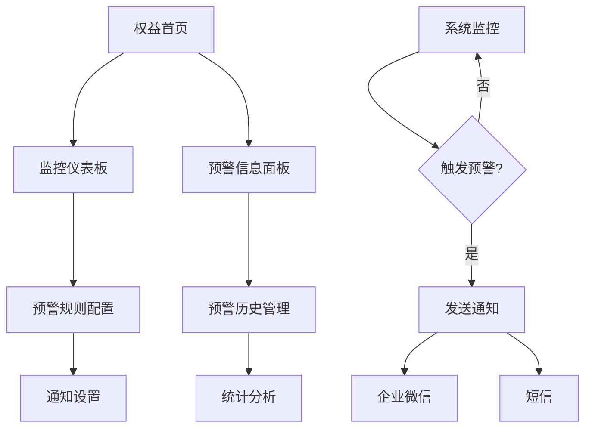

# 监控预警配置模块 - 产品需求文档

## 1. 产品概述

监控预警配置模块是权益中心全局管理的UI演示功能，专门用于展示券包库存、券过期、券包发放失败等关键业务场景的监控和预警界面设计。该模块将完全融合到现有的权益首页（http://localhost:5175/marketing/dashboard），通过增强现有仪表板功能，为产品演示提供完整的监控视图和预警管理界面。

- 核心目标：提供完整的UI demo展示，演示监控预警功能的界面设计和交互流程，基于mock数据实现所有前端功能。
- 产品价值：为产品设计和开发提供可视化参考，展示完整的用户体验流程和界面效果。

## 2. 核心功能

### 2.1 用户角色

| 角色 | 权限说明 | 核心权限 |
|------|----------|----------|
| 运营管理员 | 系统管理员权限 | 可配置所有预警规则、查看所有监控数据、管理预警历史 |
| 业务运营 | 业务操作权限 | 可查看监控数据、接收预警通知、处理预警事件 |

### 2.2 功能模块

本模块功能将完全融合到现有权益首页，通过增强和扩展现有功能实现：

1. **监控仪表板**（融合到权益首页）：实时监控数据展示、预警状态概览、关键指标趋势分析
2. **预警规则配置**：预警规则的创建、编辑、删除、启用/禁用管理
3. **预警历史管理**：历史预警记录查看、处理状态跟踪、统计分析

### 2.3 页面详情

| 页面名称 | 模块名称 | 功能描述 |
|----------|----------|----------|
| 权益首页（增强版） | 监控仪表板 | 在现有统计卡片基础上增加预警状态指示器、模拟实时监控数据刷新、预警事件快速入口（基于mock数据） |
| 权益首页（增强版） | 预警信息面板 | 扩展现有"权益平台预警信息"表格，增加预警级别、处理状态、快速操作功能（使用mock数据演示） |
| 预警规则配置 | 规则管理 | 演示创建、编辑、删除预警规则界面；展示库存阈值、过期时间、失败率等条件配置表单 |
| 预警规则配置 | 通知设置 | 演示企业微信和短信两种通知渠道的配置界面和接收人设置表单 |
| 预警历史管理 | 历史记录 | 展示历史预警记录列表、处理状态跟踪界面、导出功能演示（基于mock数据） |
| 预警历史管理 | 统计分析 | 展示预警频次统计图表、处理效率分析界面、趋势图表演示（使用mock数据） |

## 3. 核心流程

### 运营管理员流程
1. 登录系统 → 进入权益首页 → 查看监控仪表板
2. 点击预警配置入口 → 创建/编辑预警规则 → 设置通知渠道（企业微信/短信）
3. 启用预警规则 → 系统开始监控 → 触发预警时自动发送通知

### 业务运营流程
1. 登录系统 → 进入权益首页 → 查看实时监控数据
2. 接收预警通知（企业微信/短信）→ 登录系统查看详情
3. 处理预警事件 → 标记处理状态 → 查看处理结果

## 4. 用户界面设计

### 4.1 设计风格
- 主色调：延续现有权益首页的蓝色系（#165DFF）和绿色系（#00B42A）
- 预警色彩：红色（#F53F3F）表示严重预警，橙色（#FF7D00）表示一般预警
- 按钮样式：圆角按钮，与Arco Design保持一致
- 字体：系统默认字体，标题16px，正文14px，辅助文字12px
- 布局风格：卡片式布局，保持与现有页面的一致性
- 图标风格：使用Arco Design图标库，简洁现代

### 4.2 页面设计概览

| 页面名称 | 模块名称 | UI元素 |
|----------|----------|---------|
| 权益首页（增强版） | 监控仪表板 | 在现有统计卡片右上角增加预警状态指示灯（红/橙/绿），实时数据刷新按钮，预警数量徽章 |
| 权益首页（增强版） | 预警信息面板 | 扩展现有表格，增加预警级别列（带颜色标识），处理状态列，快速处理按钮 |
| 预警规则配置 | 规则列表 | 表格展示规则，包含规则名称、监控类型、阈值、状态、操作列；顶部搜索和新建按钮 |
| 预警规则配置 | 规则编辑 | 模态框形式，包含规则基本信息、监控条件设置、通知渠道选择（企业微信/短信复选框） |
| 预警历史管理 | 历史列表 | 时间线样式展示，包含预警时间、类型、内容、处理状态、处理人信息 |

### 4.3 响应式设计
- 桌面优先设计，适配1920px、1440px、1024px等主流分辨率
- 移动端适配：支持平板和手机浏览，关键功能保持可用性
- 触控优化：按钮和操作区域适合触控操作，最小44px点击区域