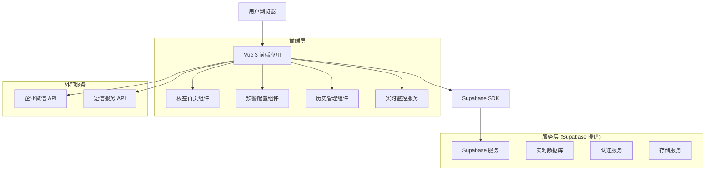
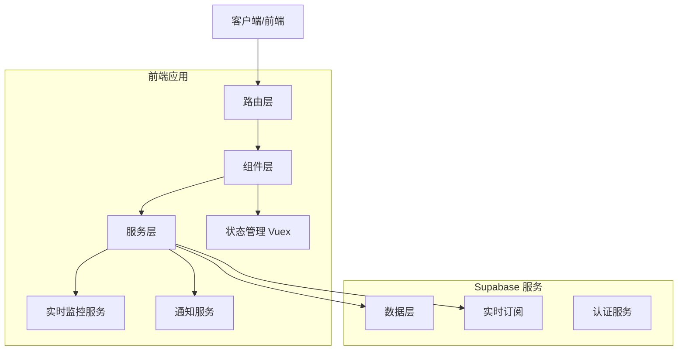
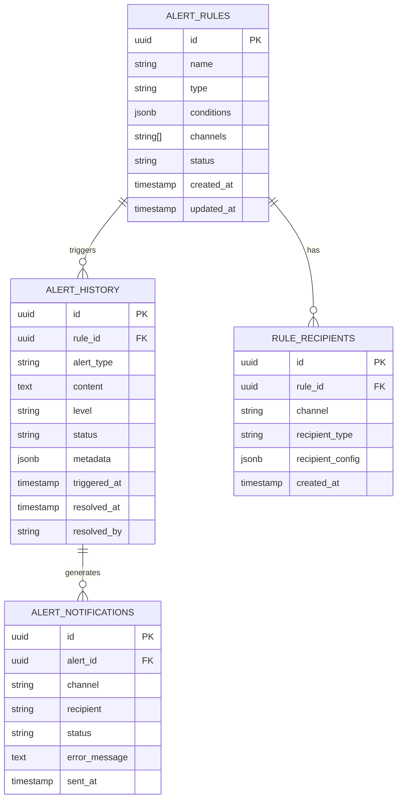

# 监控预警配置模块 - 技术架构文档

## 1. 架构设计



## 2. 技术描述

- 前端：Vue 3 (Composition API) + Arco Design + Vite + JavaScript/TypeScript
- 状态管理：Vuex 4
- 路由管理：Vue Router 4
- 图表库：ECharts (复用现有)
- 数据模拟：Mock数据服务（无需真实后端）
- UI组件：Arco Design组件库

## 3. 路由定义

| 路由 | 用途 |
|------|------|
| /marketing/dashboard | 权益首页（增强版），集成监控仪表板和预警信息面板 |
| /marketing/alert/rules | 预警规则配置页面，管理监控规则和通知设置 |
| /marketing/alert/history | 预警历史管理页面，查看历史记录和统计分析 |

## 4. API 定义

### 4.1 核心 API

#### 预警规则管理

```
GET /api/alert/rules
```
获取预警规则列表

Response:
| 参数名 | 参数类型 | 描述 |
|--------|----------|------|
| id | string | 规则ID |
| name | string | 规则名称 |
| type | string | 监控类型 (inventory/expiry/failure) |
| conditions | object | 监控条件配置 |
| channels | array | 通知渠道 ['wechat', 'sms'] |
| status | string | 规则状态 (active/inactive) |
| created_at | string | 创建时间 |

```
POST /api/alert/rules
```
创建预警规则

Request:
| 参数名 | 参数类型 | 是否必需 | 描述 |
|--------|----------|----------|------|
| name | string | true | 规则名称 |
| type | string | true | 监控类型 |
| conditions | object | true | 监控条件 |
| channels | array | true | 通知渠道 |
| recipients | object | true | 接收人配置 |

#### 预警历史管理

```
GET /api/alert/history
```
获取预警历史记录

Response:
| 参数名 | 参数类型 | 描述 |
|--------|----------|------|
| id | string | 记录ID |
| rule_id | string | 触发的规则ID |
| alert_type | string | 预警类型 |
| content | string | 预警内容 |
| level | string | 预警级别 (high/medium/low) |
| status | string | 处理状态 (pending/processing/resolved) |
| triggered_at | string | 触发时间 |
| resolved_at | string | 处理时间 |

#### 实时监控数据

```
GET /api/monitoring/dashboard
```
获取仪表板监控数据

Response:
| 参数名 | 参数类型 | 描述 |
|--------|----------|------|
| inventory_stats | object | 库存统计数据 |
| process_stats | object | 过程监控数据 |
| alert_summary | object | 预警汇总信息 |
| real_time_alerts | array | 实时预警列表 |

## 5. 服务架构图



## 6. 数据模型

### 6.1 数据模型定义



### 6.2 数据定义语言

#### 预警规则表 (alert_rules)
```sql
-- 创建预警规则表
CREATE TABLE alert_rules (
    id UUID PRIMARY KEY DEFAULT gen_random_uuid(),
    name VARCHAR(100) NOT NULL,
    type VARCHAR(50) NOT NULL CHECK (type IN ('inventory', 'expiry', 'failure')),
    conditions JSONB NOT NULL,
    channels TEXT[] NOT NULL DEFAULT '{}',
    status VARCHAR(20) DEFAULT 'active' CHECK (status IN ('active', 'inactive')),
    created_at TIMESTAMP WITH TIME ZONE DEFAULT NOW(),
    updated_at TIMESTAMP WITH TIME ZONE DEFAULT NOW()
);

-- 创建索引
CREATE INDEX idx_alert_rules_type ON alert_rules(type);
CREATE INDEX idx_alert_rules_status ON alert_rules(status);

-- 初始化数据
INSERT INTO alert_rules (name, type, conditions, channels) VALUES
('库存不足预警', 'inventory', '{"threshold": 100, "comparison": "lt"}', '{"wechat", "sms"}'),
('券即将过期预警', 'expiry', '{"days_before": 3}', '{"wechat"}'),
('发放失败率预警', 'failure', '{"failure_rate": 0.1, "time_window": 60}', '{"wechat", "sms"}');
```

#### 预警历史表 (alert_history)
```sql
-- 创建预警历史表
CREATE TABLE alert_history (
    id UUID PRIMARY KEY DEFAULT gen_random_uuid(),
    rule_id UUID REFERENCES alert_rules(id),
    alert_type VARCHAR(50) NOT NULL,
    content TEXT NOT NULL,
    level VARCHAR(20) DEFAULT 'medium' CHECK (level IN ('high', 'medium', 'low')),
    status VARCHAR(20) DEFAULT 'pending' CHECK (status IN ('pending', 'processing', 'resolved')),
    metadata JSONB DEFAULT '{}',
    triggered_at TIMESTAMP WITH TIME ZONE DEFAULT NOW(),
    resolved_at TIMESTAMP WITH TIME ZONE,
    resolved_by VARCHAR(100)
);

-- 创建索引
CREATE INDEX idx_alert_history_rule_id ON alert_history(rule_id);
CREATE INDEX idx_alert_history_triggered_at ON alert_history(triggered_at DESC);
CREATE INDEX idx_alert_history_status ON alert_history(status);
```

#### 规则接收人表 (rule_recipients)
```sql
-- 创建规则接收人表
CREATE TABLE rule_recipients (
    id UUID PRIMARY KEY DEFAULT gen_random_uuid(),
    rule_id UUID REFERENCES alert_rules(id) ON DELETE CASCADE,
    channel VARCHAR(20) NOT NULL CHECK (channel IN ('wechat', 'sms')),
    recipient_type VARCHAR(20) NOT NULL CHECK (recipient_type IN ('user', 'group')),
    recipient_config JSONB NOT NULL,
    created_at TIMESTAMP WITH TIME ZONE DEFAULT NOW()
);

-- 创建索引
CREATE INDEX idx_rule_recipients_rule_id ON rule_recipients(rule_id);
```

#### 预警通知表 (alert_notifications)
```sql
-- 创建预警通知表
CREATE TABLE alert_notifications (
    id UUID PRIMARY KEY DEFAULT gen_random_uuid(),
    alert_id UUID REFERENCES alert_history(id),
    channel VARCHAR(20) NOT NULL,
    recipient VARCHAR(200) NOT NULL,
    status VARCHAR(20) DEFAULT 'pending' CHECK (status IN ('pending', 'sent', 'failed')),
    error_message TEXT,
    sent_at TIMESTAMP WITH TIME ZONE DEFAULT NOW()
);

-- 创建索引
CREATE INDEX idx_alert_notifications_alert_id ON alert_notifications(alert_id);
CREATE INDEX idx_alert_notifications_status ON alert_notifications(status);
```

#### 权限设置
```sql
-- 为匿名用户授予基本读取权限
GRANT SELECT ON alert_rules TO anon;
GRANT SELECT ON alert_history TO anon;

-- 为认证用户授予完整权限
GRANT ALL PRIVILEGES ON alert_rules TO authenticated;
GRANT ALL PRIVILEGES ON alert_history TO authenticated;
GRANT ALL PRIVILEGES ON rule_recipients TO authenticated;
GRANT ALL PRIVILEGES ON alert_notifications TO authenticated;
```