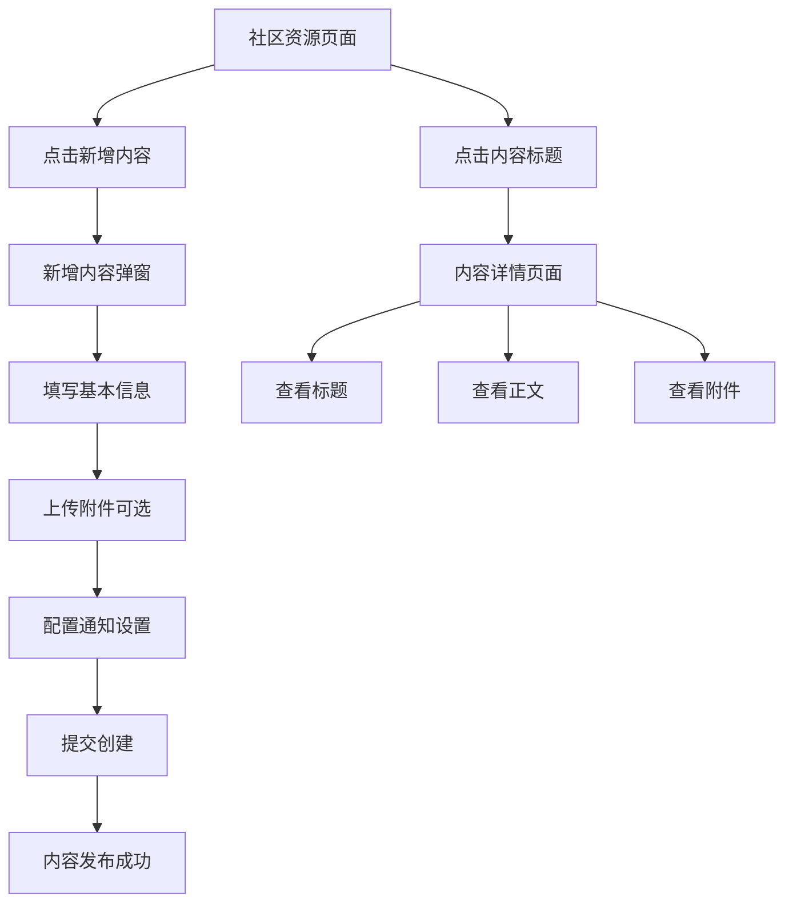

# 社区资源与通知功能合并需求文档

## 1. 产品概述

本文档旨在统一社区资源管理和通知发送功能，通过合并"新增文档"和"新建通知"弹窗，创建一个统一的"新增内容"功能模块。该功能支持灵活的内容发布方式，既可以上传文档资源，也可以发送通知，或者两者结合使用。

## 2. 核心功能

### 2.1 用户角色
| 角色 | 权限说明 | 核心功能 |
|------|----------|----------|
| 管理员 | 完整的内容管理权限 | 可创建、编辑、删除所有内容，管理通知发送 |
| 内容编辑者 | 内容创建和编辑权限 | 可创建和编辑内容，发送通知 |
| 普通用户 | 查看权限 | 可查看公开内容和接收通知 |

### 2.2 功能模块

整体功能包含以下核心页面：
1. **社区资源页面**：统一的内容展示和管理界面
2. **新增内容弹窗**：合并后的内容创建界面
3. **内容详情页面**：统一的内容查看界面

### 2.3 页面详情

| 页面名称 | 模块名称 | 功能描述 |
|----------|----------|----------|
| 社区资源页面 | 内容列表 | 展示文档和通知的统一列表，支持分类筛选和搜索 |
| 社区资源页面 | 新增内容按钮 | 触发统一的内容创建弹窗 |
| 新增内容弹窗 | 基本信息 | 输入标题、选择分类、编写正文内容 |
| 新增内容弹窗 | 附件管理 | 可选的文件上传功能，支持多种格式 |
| 新增内容弹窗 | 通知设置 | 配置是否发送通知、通知范围等 |
| 内容详情页面 | 标题区域 | 显示内容标题、分类、发布信息 |
| 内容详情页面 | 正文区域 | 显示格式化的正文内容 |
| 内容详情页面 | 附件区域 | 显示附件列表，支持下载和预览 |

## 3. 核心流程

### 管理员/编辑者操作流程
1. 进入社区资源页面
2. 点击"新增内容"按钮
3. 在弹窗中填写标题和正文
4. 选择是否上传附件（可选）
5. 配置通知发送设置
6. 提交创建内容

### 用户查看流程
1. 进入社区资源页面
2. 浏览内容列表或使用搜索
3. 点击内容标题查看详情
4. 查看标题、正文、附件三个模块

## 4. 用户界面设计

### 4.1 设计风格
- **主色调**：蓝色系 (#1890ff) 作为主色，灰色系 (#f5f5f5) 作为背景色
- **按钮样式**：圆角按钮，主要操作使用蓝色，次要操作使用灰色边框
- **字体**：系统默认字体，标题使用 16-20px，正文使用 14px
- **布局风格**：卡片式布局，左侧导航树，右侧内容区域
- **图标风格**：使用 Arco Design 图标库，简洁线性风格

### 4.2 页面设计概览

| 页面名称 | 模块名称 | UI元素 |
|----------|----------|---------|
| 社区资源页面 | 导航区域 | 左侧树形导航，支持分类筛选，白色背景，阴影效果 |
| 社区资源页面 | 内容列表 | 卡片式列表，每项包含标题、描述、标签、元信息 |
| 新增内容弹窗 | 表单区域 | 垂直表单布局，标签在上，输入框在下，600px宽度 |
| 新增内容弹窗 | 附件上传 | 拖拽上传区域，支持多文件，显示上传进度 |
| 内容详情页面 | 标题模块 | 大标题显示，包含分类标签、发布时间等元信息 |
| 内容详情页面 | 正文模块 | Markdown渲染显示，支持富文本格式 |
| 内容详情页面 | 附件模块 | 文件列表显示，包含文件名、大小、下载按钮 |

### 4.3 响应式设计
- **桌面优先**：主要针对桌面端设计，最小宽度 1200px
- **移动适配**：在移动端隐藏左侧导航，改为顶部下拉菜单
- **触摸优化**：按钮和链接区域增大，适合触摸操作