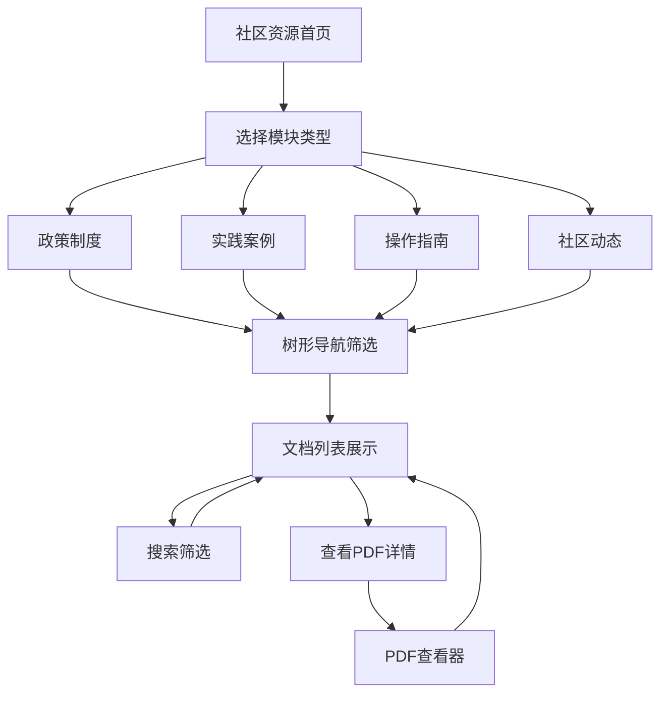

# 社区资源模块重构 - 产品需求文档

## 1. Product Overview

本项目旨在重构现有的4个社区资源页面（政策制度、实践案例、操作指南、社区动态），通过创建统一的通用组件来消除85%的代码重复，提升开发效率和维护性。
- 解决当前2314行重复代码的技术债务问题，通过配置化方式实现模块差异化，为用户提供一致且高效的社区资源浏览体验。
- 项目将显著降低维护成本，提升新功能开发效率60%，为后续社区功能扩展奠定坚实基础。

## 2. Core Features

### 2.1 User Roles

| Role | Registration Method | Core Permissions |
|------|---------------------|------------------|
| 普通用户 | 系统登录 | 可浏览所有社区资源，查看文档详情，使用搜索和筛选功能 |
| 管理员用户 | 管理员权限 | 除普通用户权限外，可管理文档分类，配置模块参数 |

### 2.2 Feature Module

我们的社区资源重构需求包含以下主要页面：
1. **统一社区资源页面**: 通用组件架构，左侧树形导航，右侧文档列表，PDF查看器集成
2. **模块配置管理**: 配置文件管理，模块参数设置，分类体系定义
3. **文档管理界面**: 文档列表展示，搜索筛选功能，排序和分页

### 2.3 Page Details

| Page Name | Module Name | Feature description |
|-----------|-------------|---------------------|
| 统一社区资源页面 | 左侧树形导航 | 展示模块分类树结构，支持展开折叠，节点选择筛选，搜索联动，文档数量统计 |
| 统一社区资源页面 | 右侧文档列表 | 显示文档列表，支持标题描述展示，发布时间排序，查看次数统计，PDF查看按钮 |
| 统一社区资源页面 | 搜索筛选功能 | 关键词搜索，分类筛选，状态筛选，时间排序，结果高亮显示 |
| 统一社区资源页面 | PDF查看器 | 内嵌PDF查看，全屏模式，页面导航，缩放控制，返回列表功能 |
| 模块配置管理 | 配置文件管理 | 模块参数配置，分类体系定义，图标映射设置，字段差异化配置 |
| 文档管理界面 | 面包屑导航 | 显示当前位置，支持快速返回，层级结构清晰，响应式适配 |

## 3. Core Process

### 主要用户操作流程

**普通用户流程：**
1. 用户访问社区资源页面 → 2. 选择左侧树形导航分类 → 3. 浏览右侧文档列表 → 4. 使用搜索筛选功能 → 5. 点击查看文档详情或PDF

**管理员流程：**
1. 管理员登录系统 → 2. 访问配置管理界面 → 3. 设置模块参数和分类 → 4. 保存配置并生效 → 5. 验证前端展示效果

## 4. User Interface Design

### 4.1 Design Style

- **主色调**: #1890ff (Arco Design 主蓝色), #f0f2f5 (背景灰)
- **辅助色**: #52c41a (成功绿), #faad14 (警告橙), #f5222d (错误红)
- **按钮样式**: 圆角按钮设计，主要按钮使用渐变效果，次要按钮使用边框样式
- **字体**: 系统默认字体栈，标题使用16px-20px，正文使用14px，辅助信息使用12px
- **布局风格**: 左右分栏布局，卡片式内容展示，顶部面包屑导航
- **图标风格**: 使用Arco Design图标库，线性图标风格，统一16px尺寸

### 4.2 Page Design Overview

| Page Name | Module Name | UI Elements |
|-----------|-------------|-------------|
| 统一社区资源页面 | 左侧导航区域 | 白色背景，240px固定宽度，顶部搜索框，树形结构展示，节点图标和文字，展开折叠动画效果 |
| 统一社区资源页面 | 右侧内容区域 | 浅灰背景，弹性宽度，顶部面包屑导航，文档卡片列表，每个卡片包含标题、描述、时间、操作按钮 |
| 统一社区资源页面 | 搜索筛选栏 | 白色背景，输入框和下拉选择器组合，排序按钮组，清除筛选按钮 |
| PDF查看器 | 全屏模式 | 深色背景，白色内容区域，顶部工具栏，左侧页面缩略图，右侧PDF内容，底部页码导航 |

### 4.3 Responsiveness

产品采用桌面优先设计，同时支持移动端自适应：
- 桌面端（>1200px）：左右分栏布局，树形导航固定宽度240px
- 平板端（768px-1200px）：左侧导航可折叠，内容区域自适应
- 移动端（<768px）：导航改为顶部下拉菜单，内容区域全宽显示，支持触摸滑动操作