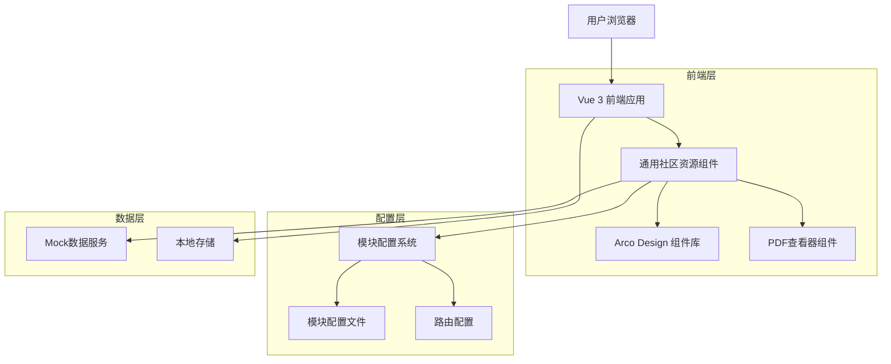
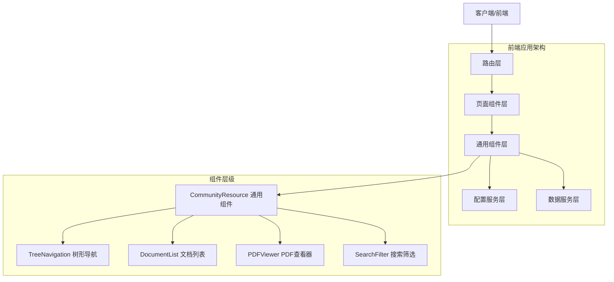
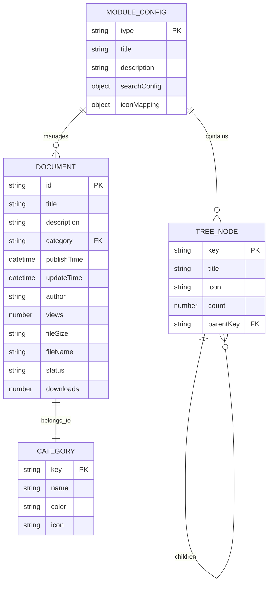

# 社区资源模块重构 - 技术架构文档

## 1. Architecture design



## 2. Technology Description

- **前端框架**: Vue 3 (Composition API) + Vite + TypeScript
- **UI组件库**: Arco Design Vue + 自定义组件
- **状态管理**: Vue 3 Reactive API + Pinia (可选)
- **路由管理**: Vue Router 4
- **构建工具**: Vite + ESLint + Prettier
- **PDF处理**: PDF.js 或 vue-pdf-embed

## 3. Route definitions

| Route | Purpose |
|-------|---------|
| /community | 社区资源主页，重定向到政策制度页面 |
| /community/policy | 政策制度页面，使用通用组件 + policy配置 |
| /community/cases | 实践案例页面，使用通用组件 + cases配置 |
| /community/guide | 操作指南页面，使用通用组件 + guide配置 |
| /community/news | 社区动态页面，使用通用组件 + news配置 |
| /community/:type/pdf/:id | PDF查看页面，全屏模式显示文档内容 |

## 4. API definitions

### 4.1 Core API

由于使用Mock数据，主要通过配置文件和组件接口定义数据结构：

**模块配置接口**
```typescript
interface ModuleConfig {
  type: 'policy' | 'cases' | 'guide' | 'news';
  title: string;
  description: string;
  treeData: TreeNode[];
  documentFields: DocumentField[];
  iconMapping: IconMapping;
  searchConfig: SearchConfig;
}
```

**文档数据接口**
```typescript
interface Document {
  id: string;
  title: string;
  description: string;
  category: string;
  publishTime: string;
  updateTime: string;
  author: string;
  views: number;
  fileSize?: string;
  fileName?: string;
  status?: string;
  downloads?: number;
}
```

**树形节点接口**
```typescript
interface TreeNode {
  key: string;
  title: string;
  icon?: string;
  children?: TreeNode[];
  count?: number;
}
```

## 5. Server architecture diagram



## 6. Data model

### 6.1 Data model definition



### 6.2 Data Definition Language

**模块配置数据结构**
```javascript
// src/config/communityModules.js
export const moduleConfigs = {
  policy: {
    type: 'policy',
    title: '政策制度',
    description: '数据管理相关政策制度文档',
    treeData: [
      {
        key: 'law',
        title: '法律法规',
        icon: 'IconBook',
        children: [
          { key: 'law-data', title: '数据安全法', count: 5 },
          { key: 'law-privacy', title: '个人信息保护法', count: 3 }
        ]
      },
      {
        key: 'management',
        title: '管理办法',
        icon: 'IconFile',
        children: [
          { key: 'mgmt-security', title: '数据安全管理办法', count: 8 },
          { key: 'mgmt-quality', title: '数据质量管理办法', count: 4 }
        ]
      }
    ],
    documentFields: ['title', 'description', 'category', 'status', 'publishTime', 'author', 'views'],
    iconMapping: {
      'law': { icon: 'IconBook', color: '#1890ff' },
      'management': { icon: 'IconFile', color: '#52c41a' },
      'standard': { icon: 'IconSettings', color: '#faad14' }
    },
    searchConfig: {
      placeholder: '搜索政策制度...',
      filters: ['category', 'status'],
      sortOptions: ['publishTime', 'updateTime', 'views']
    }
  },
  
  cases: {
    type: 'cases',
    title: '实践案例',
    description: '数据分析和应用实践案例',
    treeData: [
      {
        key: 'analysis',
        title: '数据分析',
        icon: 'IconBarChart',
        children: [
          { key: 'analysis-basic', title: '基础分析', count: 12 },
          { key: 'analysis-advanced', title: '高级分析', count: 8 }
        ]
      }
    ],
    documentFields: ['title', 'description', 'category', 'publishTime', 'author', 'views', 'downloads'],
    iconMapping: {
      'analysis': { icon: 'IconBarChart', color: '#1890ff' },
      'ml': { icon: 'IconRobot', color: '#722ed1' },
      'visualization': { icon: 'IconPieChart', color: '#13c2c2' }
    }
  }
};

// 初始化文档数据
export const initDocuments = {
  policy: [
    {
      id: 'policy-001',
      title: '数据安全法实施细则',
      description: '详细解读数据安全法的实施要求和操作指南',
      category: 'law-data',
      status: '生效中',
      publishTime: '2024-01-15',
      updateTime: '2024-01-20',
      author: '法务部',
      views: 1250,
      fileName: 'data_security_law_implementation.pdf',
      fileSize: '2.3MB'
    }
  ],
  
  cases: [
    {
      id: 'case-001',
      title: '用户行为分析实践案例',
      description: '基于用户行为数据的深度分析方法和应用实践',
      category: 'analysis-basic',
      publishTime: '2024-01-10',
      updateTime: '2024-01-15',
      author: '数据分析团队',
      views: 890,
      downloads: 156,
      fileName: 'user_behavior_analysis_case.pdf',
      fileSize: '4.1MB'
    }
  ]
};
```

**组件接口定义**
```typescript
// src/types/community.ts
export interface CommunityResourceProps {
  moduleType: 'policy' | 'cases' | 'guide' | 'news';
  moduleConfig: ModuleConfig;
}

export interface DocumentListProps {
  documents: Document[];
  loading: boolean;
  onViewDocument: (document: Document) => void;
  onSearch: (keyword: string) => void;
  onFilter: (filters: FilterOptions) => void;
}

export interface TreeNavigationProps {
  treeData: TreeNode[];
  selectedKeys: string[];
  expandedKeys: string[];
  onSelect: (keys: string[]) => void;
  onExpand: (keys: string[]) => void;
}
```