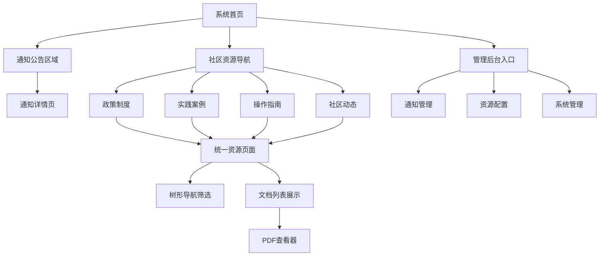

# 社区资源管理系统 - 产品需求文档

## 1. 产品概述

社区资源管理系统是一个集成化的数据社区平台，提供统一的资源浏览、内容管理和通知发布功能。系统通过重构现有的4个社区资源模块，消除85%的代码重复，同时集成通知管理功能，为用户提供一站式的社区服务体验。

- 解决当前社区资源管理分散、代码重复率高、通知发布不统一的问题，通过配置化架构实现模块差异化管理
- 主要服务于社区用户、内容管理员、系统管理员，提供高效的资源浏览和内容管理体验
- 目标是建立完善的社区资源生态系统，提升用户参与度，降低系统维护成本65%，提高开发效率60%

## 2. 核心功能

### 2.1 用户角色

| 角色 | 注册方法 | 核心权限 |
|------|----------|----------|
| 普通用户 | 系统登录 | 可浏览所有社区资源，查看文档详情，使用搜索筛选功能，接收通知 |
| 内容编辑 | 管理员邀请 | 可创建、编辑指定类型资源和通知，需管理员审核发布 |
| 系统管理员 | 系统内部分配 | 可管理所有资源和通知，配置系统参数，管理用户权限，查看操作日志 |

### 2.2 功能模块

我们的社区资源管理系统包含以下主要页面：

1. **统一社区资源页面**：通用组件架构，左侧树形导航，右侧文档列表，PDF查看器集成
2. **通知管理模块**：通知创建编辑，分类管理，发布审核，首页展示
3. **资源配置管理**：模块参数配置，分类体系定义，权限设置
4. **系统管理后台**：用户管理，操作日志，系统监控

### 2.3 页面详情

| 页面名称 | 模块名称 | 功能描述 |
|----------|----------|----------|
| 统一社区资源页面 | 左侧树形导航 | 展示模块分类树结构，支持展开折叠，节点选择筛选，搜索联动，文档数量统计，**集成通知分类节点** |
| 统一社区资源页面 | 右侧文档列表 | 显示文档列表，支持标题描述展示，发布时间排序，查看次数统计，PDF查看按钮，**统一展示通知和资源文档** |
| 统一社区资源页面 | 搜索筛选功能 | 关键词搜索，分类筛选，状态筛选，时间排序，结果高亮显示，**支持通知和文档混合搜索** |
| 统一社区资源页面 | PDF查看器 | 内嵌PDF查看，全屏模式，页面导航，缩放控制，返回列表功能，**支持通知附件查看** |
| 首页通知展示模块 | 通知公告区域 | 展示最新发布的通知，支持分类筛选和时间排序，NEW标记显示，**按社区资源分类展示** |
| 首页通知展示模块 | 社区资源导航 | 四个模块入口：政策制度、实践案例、操作指南、社区动态，**每个入口显示对应通知数量** |
| 通知管理列表页 | 通知列表管理 | 展示所有通知，支持按类型、状态、时间筛选和搜索，批量操作，**按社区资源分类管理** |
| 通知创建/编辑页 | 富文本编辑器 | 支持富文本编辑，插入图片、链接、表格，文档上传功能，**上传文档自动归类** |
| 通知创建/编辑页 | 分类选择 | **必选社区资源分类**（政策制度/实践案例/操作指南/社区动态），设置优先级，定时发布，关联资源模块 |
| 通知创建/编辑页 | 文档上传管理 | **支持多文档上传，自动继承通知的社区资源分类，支持PDF、Word、Excel等格式** |
| 资源配置管理页 | 模块配置管理 | 配置四个资源模块的参数，分类体系，图标映射，字段差异化，**统一管理通知和资源分类** |
| 系统管理后台 | 用户权限管理 | 管理用户角色，分配权限，查看用户活动，操作日志记录，**通知和资源统一权限控制** |

## 3. 核心流程

### 主要用户操作流程

**普通用户流程：**
用户访问首页 → 查看通知公告（注意NEW标记） → 选择社区资源模块 → 使用树形导航筛选 → 浏览文档列表 → 查看PDF详情 → 返回继续浏览

**内容编辑流程：**
编辑登录系统 → 创建/编辑通知或资源 → **必选社区资源分类**（政策制度/实践案例/操作指南/社区动态）→ 设置参数和优先级 → **上传文档自动继承分类** → 预览效果 → 提交审核 → 管理员审核通过后发布到对应资源页面

**系统管理员流程：**
管理员登录 → 查看待审核内容 → 审核通知和资源 → **统一配置通知和资源分类体系** → 管理用户权限 → 查看系统运行状态和日志 → **监控通知在各资源页面的展示效果**

## 4. 用户界面设计

### 4.1 设计风格

- **主色调**：#1890ff (Arco Design 主蓝色)，#165dff (深蓝色)
- **辅助色**：#52c41a (成功绿)，#faad14 (警告橙)，#f5222d (错误红)，#722ed1 (紫色)
- **按钮样式**：圆角按钮设计，主要按钮使用渐变效果，支持悬停动画，次要按钮使用边框样式
- **字体**：系统默认字体栈，标题使用16px-24px，正文使用14px，辅助信息使用12px
- **布局风格**：卡片式布局，左右分栏结构，顶部导航 + 面包屑，响应式设计
- **图标风格**：使用Arco Design图标库，线性图标风格，统一16px尺寸，支持彩色状态图标

### 4.2 页面设计概览

| 页面名称 | 模块名称 | UI元素 |
|----------|----------|---------|
| 系统首页 | 通知公告区域 | 卡片式列表，标题、时间、分类标签，NEW标记（红色圆点+文字），悬停效果 |
| 系统首页 | 社区资源导航 | 四个大图标按钮，分别对应四个模块，图标+标题+描述，网格布局 |
| 统一资源页面 | 左侧导航区域 | 白色背景，240px固定宽度，顶部搜索框，树形结构展示，节点图标和文字，展开折叠动画 |
| 统一资源页面 | 右侧内容区域 | 浅灰背景，弹性宽度，顶部面包屑导航，文档卡片列表，排序和筛选工具栏 |
| 通知管理页面 | 管理界面 | 表格布局，工具栏操作，状态徽章，分类标签，搜索筛选区域 |
| PDF查看器 | 全屏模式 | 深色背景，白色内容区域，顶部工具栏，左侧页面缩略图，底部页码导航 |
| 配置管理页面 | 配置界面 | 标签页布局，表单区域，实时预览，保存确认机制 |

### 4.3 响应式设计

系统采用桌面优先设计，全面支持移动端自适应：
- **桌面端（>1200px）**：左右分栏布局，树形导航固定宽度240px，完整功能展示
- **平板端（768px-1200px）**：左侧导航可折叠，内容区域自适应，工具栏简化
- **移动端（<768px）**：导航改为顶部下拉菜单，内容区域全宽显示，支持触摸滑动，底部操作栏

## 5. 通知与社区资源集成需求

### 5.1 分类体系统一
- **通知分类必须与社区资源分类保持一致**：政策制度、实践案例、操作指南、社区动态
- 通知创建时必须选择对应的社区资源分类，不允许创建无分类通知
- 通知发布后自动在对应的社区资源页面中展示，与该分类下的文档混合显示
- 支持通知类型的二级分类，与现有资源树形结构保持一致

### 5.2 文档上传集成
- 通知上传的文档自动继承通知的社区资源分类标记
- 支持通知附件在对应社区资源页面的PDF查看器中正常显示
- 通知文档与资源文档在搜索、筛选、排序功能中统一处理
- 文档上传支持批量操作，所有文档自动归类到通知所属的社区资源分类

### 5.3 导航展示集成
- 首页社区资源导航显示各分类下的通知数量统计
- 社区资源页面左侧树形导航集成通知分类节点
- 通知在文档列表中有特殊标识（如"通知"标签），便于用户区分
- 支持按内容类型（通知/文档）进行筛选和查看

### 5.4 用户体验统一
- 通知和资源文档在界面展示上保持一致的设计风格
- 统一的搜索体验，支持跨通知和文档的全文检索
- 一致的权限控制，通知的查看权限与对应资源分类权限保持同步
- 统一的操作日志记录，通知和资源操作都记录在同一系统中

## 6. 特殊需求

### 6.1 性能要求
- 页面首次加载时间 < 2秒
- 树形导航展开响应时间 < 300ms
- PDF文档加载时间 < 5秒
- 搜索结果响应时间 < 1秒
- **通知和文档混合查询响应时间 < 1.5秒**

### 6.2 兼容性要求
- 支持Chrome 80+、Firefox 75+、Safari 13+、Edge 80+
- 支持iOS 13+、Android 8+移动端浏览器
- 支持PDF.js在各浏览器中的正常显示
- **通知附件在各浏览器中的兼容性显示**

### 6.3 安全要求
- 用户权限验证和会话管理
- 文件上传安全检查和病毒扫描
- 操作日志记录和审计追踪
- 敏感数据加密存储和传输
- **通知发布权限与社区资源管理权限统一控制**