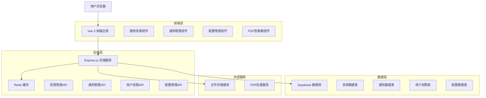
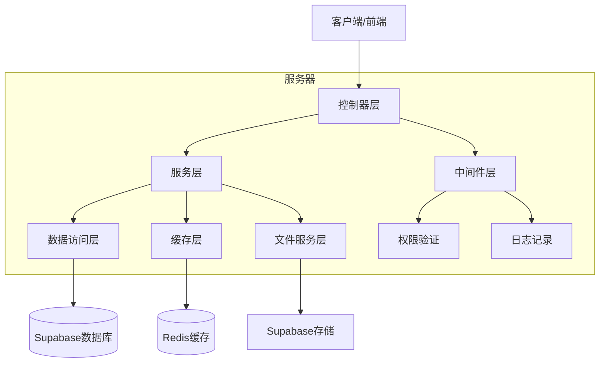
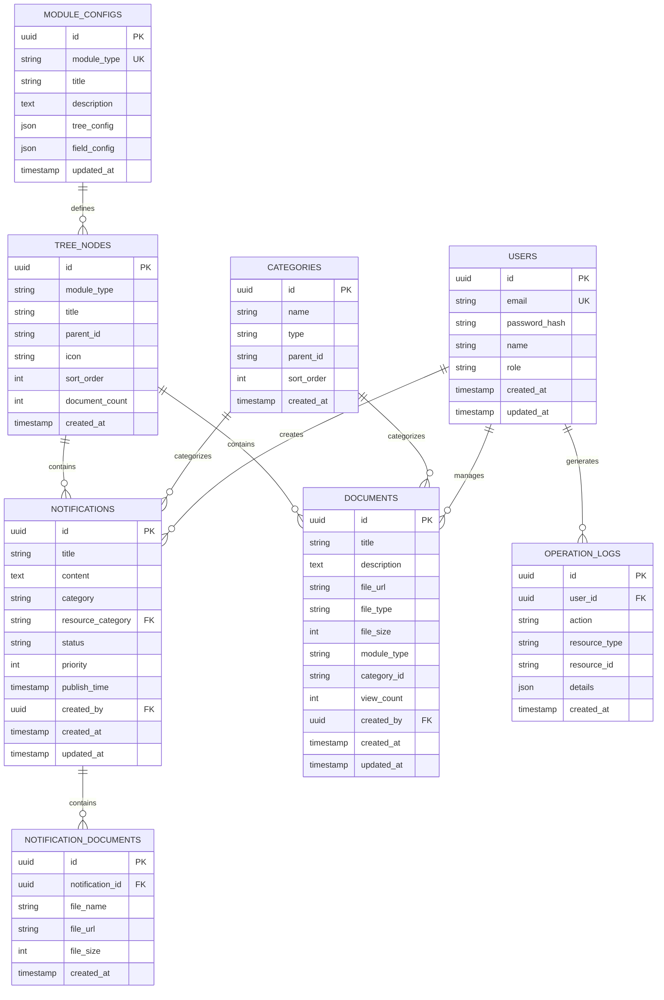

# 社区资源管理系统 - 技术架构文档

## 1. 架构设计



## 2. 技术描述

- **前端**: Vue 3 (Composition API) + Arco Design + Vite + TypeScript + Pinia + Vue Router 4
- **后端**: Express.js + Supabase SDK + Redis + Multer + PDF.js
- **数据库**: Supabase (PostgreSQL)
- **缓存**: Redis
- **文件存储**: Supabase Storage
- **构建工具**: Vite
- **状态管理**: Pinia
- **UI组件库**: Arco Design

## 3. 路由定义

| 路由 | 用途 |
|------|-----|
| / | 系统首页，展示通知公告和社区资源导航 |
| /community/policy | 政策制度资源页面（使用通用组件） |
| /community/cases | 实践案例资源页面（使用通用组件） |
| /community/guide | 操作指南资源页面（使用通用组件） |
| /community/news | 社区动态资源页面（使用通用组件） |
| /admin/notifications | 通知管理列表页面 |
| /admin/notifications/create | 通知创建页面 |
| /admin/notifications/edit/:id | 通知编辑页面 |
| /admin/config | 系统配置管理页面 |
| /admin/users | 用户权限管理页面 |
| /login | 用户登录页面 |

## 4. API定义

### 4.1 社区资源管理API

**获取模块配置**
```
GET /api/modules/:moduleType/config
```

响应:
| 参数名称 | 参数类型 | 描述 |
|----------|----------|------|
| moduleType | string | 模块类型标识 |
| title | string | 模块标题 |
| description | string | 模块描述 |
| treeConfig | object | 树形结构配置 |
| fieldConfig | object | 字段显示配置 |

**获取文档数据（集成通知）**
```
GET /api/modules/:moduleType/documents
```

请求参数:
| 参数名称 | 参数类型 | 是否必需 | 描述 |
|----------|----------|----------|------|
| categoryId | string | false | 分类ID筛选 |
| keyword | string | false | 搜索关键词 |
| sortBy | string | false | 排序字段 |
| sortOrder | string | false | 排序方向 |
| page | number | false | 页码 |
| pageSize | number | false | 每页数量 |
| contentType | string | false | **内容类型筛选**（all/document/notification） |
| includeNotifications | boolean | false | **是否包含通知**，默认true |

响应:
| 参数名称 | 参数类型 | 描述 |
|----------|----------|------|
| documents | array | **文档列表（包含通知）** |
| notifications | array | **通知列表** |
| total | number | 总数量 |
| categories | array | 分类统计 |
| notificationCount | number | **通知数量统计** |

**获取树形节点数据**
```
GET /api/modules/:moduleType/tree
```

响应:
| 参数名称 | 参数类型 | 描述 |
|----------|----------|------|
| id | string | 节点ID |
| title | string | 节点标题 |
| children | array | 子节点数组 |
| documentCount | number | 文档数量 |
| icon | string | 图标名称 |

### 4.2 通知管理API

**获取通知列表**
```
GET /api/notifications
```

请求参数:
| 参数名称 | 参数类型 | 是否必需 | 描述 |
|----------|----------|----------|------|
| category | string | false | 通知分类 |
| status | string | false | 发布状态 |
| keyword | string | false | 搜索关键词 |
| page | number | false | 页码 |
| pageSize | number | false | 每页数量 |

**创建通知**
```
POST /api/notifications
```

请求体:
| 参数名称 | 参数类型 | 是否必需 | 描述 |
|----------|----------|----------|------|
| title | string | true | 通知标题 |
| content | string | true | 通知内容 |
| category | string | true | **社区资源分类**（policy/cases/guide/news） |
| priority | number | false | 优先级 |
| publishTime | string | false | 定时发布时间 |
| attachments | array | false | 附件列表，**自动继承category分类** |
| resourceCategory | string | true | **关联的社区资源分类ID** |

**更新通知**
```
PUT /api/notifications/:id
```

**删除通知**
```
DELETE /api/notifications/:id
```

### 4.3 文件管理API

**上传文件（支持分类标记）**
```
POST /api/files/upload
```

请求体: FormData
| 参数名称 | 参数类型 | 是否必需 | 描述 |
|----------|----------|----------|------|
| file | File | true | 上传的文件 |
| category | string | true | **社区资源分类**（policy/cases/guide/news） |
| resourceCategory | string | true | **关联的社区资源分类ID** |
| notificationId | string | false | **关联的通知ID**（如果是通知附件） |
| contentType | string | false | **内容类型**（document/notification） |

响应:
| 参数名称 | 参数类型 | 描述 |
|----------|----------|------|
| fileId | string | 文件ID |
| fileName | string | 文件名 |
| fileUrl | string | 文件访问URL |
| fileSize | number | 文件大小 |
| category | string | **继承的社区资源分类** |
| resourceCategory | string | **关联的资源分类ID** |

### 4.4 用户权限API

**用户登录**
```
POST /api/auth/login
```

请求体:
| 参数名称 | 参数类型 | 是否必需 | 描述 |
|----------|----------|----------|------|
| email | string | true | 用户邮箱 |
| password | string | true | 用户密码 |

响应:
| 参数名称 | 参数类型 | 描述 |
|----------|----------|------|
| token | string | 访问令牌 |
| user | object | 用户信息 |
| permissions | array | 用户权限列表 |

## 5. 服务器架构图



## 6. 数据模型

### 6.1 数据模型定义



### 6.2 数据定义语言

**用户表 (users)**
```sql
-- 创建用户表
CREATE TABLE users (
    id UUID PRIMARY KEY DEFAULT gen_random_uuid(),
    email VARCHAR(255) UNIQUE NOT NULL,
    password_hash VARCHAR(255) NOT NULL,
    name VARCHAR(100) NOT NULL,
    role VARCHAR(20) DEFAULT 'user' CHECK (role IN ('user', 'editor', 'admin')),
    created_at TIMESTAMP WITH TIME ZONE DEFAULT NOW(),
    updated_at TIMESTAMP WITH TIME ZONE DEFAULT NOW()
);

-- 创建索引
CREATE INDEX idx_users_email ON users(email);
CREATE INDEX idx_users_role ON users(role);

-- 权限设置
GRANT SELECT ON users TO anon;
GRANT ALL PRIVILEGES ON users TO authenticated;
```

**通知表 (notifications)**
```sql
-- 创建通知表
CREATE TABLE notifications (
    id UUID PRIMARY KEY DEFAULT gen_random_uuid(),
    title VARCHAR(255) NOT NULL,
    content TEXT NOT NULL,
    category VARCHAR(50) NOT NULL CHECK (category IN ('policy', 'cases', 'guide', 'news')),
    resource_category UUID REFERENCES categories(id),
    status VARCHAR(20) DEFAULT 'draft' CHECK (status IN ('draft', 'published', 'archived')),
    priority INTEGER DEFAULT 1 CHECK (priority BETWEEN 1 AND 5),
    publish_time TIMESTAMP WITH TIME ZONE,
    created_by UUID REFERENCES users(id),
    created_at TIMESTAMP WITH TIME ZONE DEFAULT NOW(),
    updated_at TIMESTAMP WITH TIME ZONE DEFAULT NOW()
);

-- 创建索引
CREATE INDEX idx_notifications_category ON notifications(category);
CREATE INDEX idx_notifications_status ON notifications(status);
CREATE INDEX idx_notifications_publish_time ON notifications(publish_time DESC);
CREATE INDEX idx_notifications_created_by ON notifications(created_by);

-- 权限设置
GRANT SELECT ON notifications TO anon;
GRANT ALL PRIVILEGES ON notifications TO authenticated;
```

**文档表 (documents)**
```sql
-- 创建文档表
CREATE TABLE documents (
    id UUID PRIMARY KEY DEFAULT gen_random_uuid(),
    title VARCHAR(255) NOT NULL,
    description TEXT,
    file_url VARCHAR(500) NOT NULL,
    file_type VARCHAR(50) NOT NULL,
    file_size INTEGER NOT NULL,
    module_type VARCHAR(50) NOT NULL,
    category_id VARCHAR(100),
    view_count INTEGER DEFAULT 0,
    created_by UUID REFERENCES users(id),
    created_at TIMESTAMP WITH TIME ZONE DEFAULT NOW(),
    updated_at TIMESTAMP WITH TIME ZONE DEFAULT NOW()
);

-- 创建索引
CREATE INDEX idx_documents_module_type ON documents(module_type);
CREATE INDEX idx_documents_category_id ON documents(category_id);
CREATE INDEX idx_documents_created_at ON documents(created_at DESC);
CREATE INDEX idx_documents_view_count ON documents(view_count DESC);

-- 权限设置
GRANT SELECT ON documents TO anon;
GRANT ALL PRIVILEGES ON documents TO authenticated;
```

**分类表 (categories)**
```sql
-- 创建分类表
CREATE TABLE categories (
    id UUID PRIMARY KEY DEFAULT gen_random_uuid(),
    name VARCHAR(100) NOT NULL,
    type VARCHAR(50) NOT NULL,
    parent_id UUID REFERENCES categories(id),
    sort_order INTEGER DEFAULT 0,
    created_at TIMESTAMP WITH TIME ZONE DEFAULT NOW()
);

-- 创建索引
CREATE INDEX idx_categories_type ON categories(type);
CREATE INDEX idx_categories_parent_id ON categories(parent_id);
CREATE INDEX idx_categories_sort_order ON categories(sort_order);

-- 权限设置
GRANT SELECT ON categories TO anon;
GRANT ALL PRIVILEGES ON categories TO authenticated;
```

**模块配置表 (module_configs)**
```sql
-- 创建模块配置表
CREATE TABLE module_configs (
    id UUID PRIMARY KEY DEFAULT gen_random_uuid(),
    module_type VARCHAR(50) UNIQUE NOT NULL,
    title VARCHAR(100) NOT NULL,
    description TEXT,
    tree_config JSONB NOT NULL DEFAULT '{}',
    field_config JSONB NOT NULL DEFAULT '{}',
    updated_at TIMESTAMP WITH TIME ZONE DEFAULT NOW()
);

-- 创建索引
CREATE INDEX idx_module_configs_module_type ON module_configs(module_type);

-- 权限设置
GRANT SELECT ON module_configs TO anon;
GRANT ALL PRIVILEGES ON module_configs TO authenticated;

-- 初始化数据
INSERT INTO module_configs (module_type, title, description, tree_config, field_config) VALUES
('policy', '政策制度', '政策法规和制度文件', 
 '{"rootNodes": ["国家政策", "地方政策", "行业规范", "内部制度"]}',
 '{"showAuthor": true, "showDate": true, "showTags": true}'),
('cases', '实践案例', '最佳实践和成功案例', 
 '{"rootNodes": ["技术案例", "管理案例", "创新案例", "合作案例"]}',
 '{"showAuthor": true, "showDate": true, "showDifficulty": true}'),
('guide', '操作指南', '操作手册和使用指南', 
 '{"rootNodes": ["系统操作", "业务流程", "技术指南", "常见问题"]}',
 '{"showSteps": true, "showDifficulty": true, "showVersion": true}'),
('news', '社区动态', '社区新闻和动态信息', 
 '{"rootNodes": ["重要公告", "活动通知", "技术分享", "行业资讯"]}',
 '{"showAuthor": true, "showDate": true, "showSource": true}');
```

**树形节点表 (tree_nodes)**
```sql
-- 创建树形节点表
CREATE TABLE tree_nodes (
    id UUID PRIMARY KEY DEFAULT gen_random_uuid(),
    module_type VARCHAR(50) NOT NULL,
    title VARCHAR(100) NOT NULL,
    parent_id UUID REFERENCES tree_nodes(id),
    icon VARCHAR(50),
    sort_order INTEGER DEFAULT 0,
    document_count INTEGER DEFAULT 0,
    created_at TIMESTAMP WITH TIME ZONE DEFAULT NOW()
);

-- 创建索引
CREATE INDEX idx_tree_nodes_module_type ON tree_nodes(module_type);
CREATE INDEX idx_tree_nodes_parent_id ON tree_nodes(parent_id);
CREATE INDEX idx_tree_nodes_sort_order ON tree_nodes(sort_order);

-- 权限设置
GRANT SELECT ON tree_nodes TO anon;
GRANT ALL PRIVILEGES ON tree_nodes TO authenticated;
```

**通知文档关联表 (notification_documents)**
```sql
-- 创建通知文档关联表
CREATE TABLE notification_documents (
    id UUID PRIMARY KEY DEFAULT gen_random_uuid(),
    notification_id UUID REFERENCES notifications(id) ON DELETE CASCADE,
    file_name VARCHAR(255) NOT NULL,
    file_url VARCHAR(500) NOT NULL,
    file_size INTEGER NOT NULL,
    created_at TIMESTAMP WITH TIME ZONE DEFAULT NOW()
);

-- 创建索引
CREATE INDEX idx_notification_documents_notification_id ON notification_documents(notification_id);

-- 权限设置
GRANT SELECT ON notification_documents TO anon;
GRANT ALL PRIVILEGES ON notification_documents TO authenticated;
```

**操作日志表 (operation_logs)**
```sql
-- 创建操作日志表
CREATE TABLE operation_logs (
    id UUID PRIMARY KEY DEFAULT gen_random_uuid(),
    user_id UUID REFERENCES users(id),
    action VARCHAR(50) NOT NULL,
    resource_type VARCHAR(50) NOT NULL,
    resource_id VARCHAR(100),
    details JSONB DEFAULT '{}',
    created_at TIMESTAMP WITH TIME ZONE DEFAULT NOW()
);

-- 创建索引
CREATE INDEX idx_operation_logs_user_id ON operation_logs(user_id);
CREATE INDEX idx_operation_logs_action ON operation_logs(action);
CREATE INDEX idx_operation_logs_created_at ON operation_logs(created_at DESC);

-- 权限设置
GRANT SELECT ON operation_logs TO authenticated;
GRANT INSERT ON operation_logs TO authenticated;
```